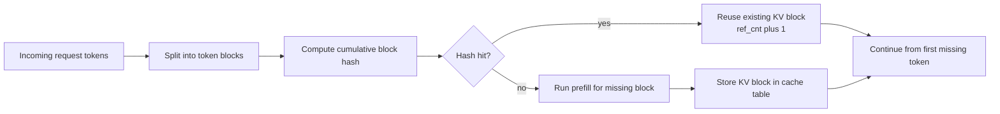
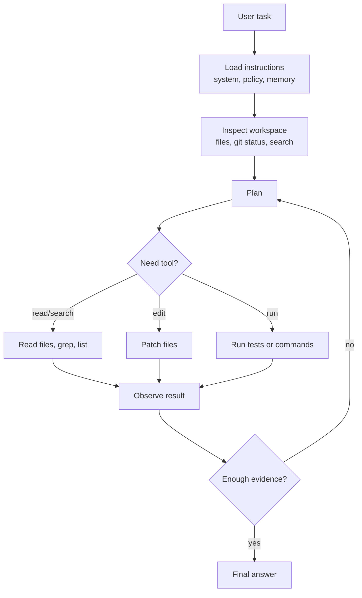
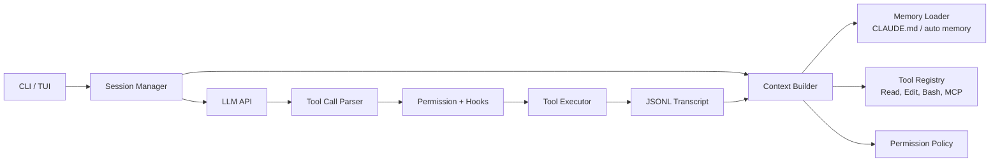
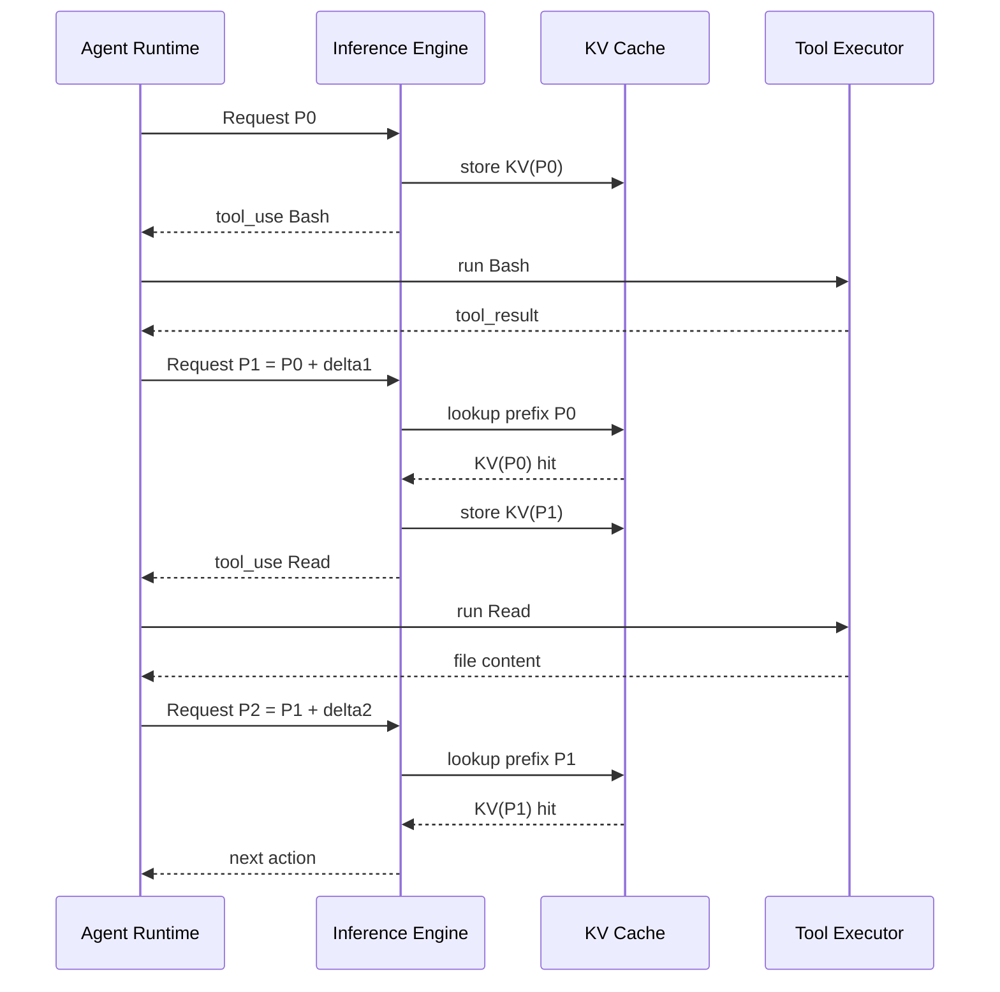

## 1. 先说结论

版本说明：本文写于2026-05-08，参考的是当天可访问的公开资料，包括Anthropic Prompt Caching文档、Claude Code官方文档、OpenAI Prompt Caching文档、vLLM Automatic Prefix Caching设计文档、SGLang/LMCache公开文档，以及一些论文和公开社区讨论。Claude Code存在社区逆向和泄露源码讨论，但本文不复刻、不传播非公开源码，只用公开文档与可验证行为来解释工程机制。涉及“Claude Code可能怎么做”的地方，我会明确标为工程推断。

Agentic workload和普通聊天最大的区别是：

**普通聊天经常是“用户问一句，模型答一句”；agentic任务是“同一个任务里，模型反复读取同一批系统指令、工具定义、项目记忆、历史轨迹，然后多次调用工具、观察结果、再决策”。**

所以Agentic场景天然适合KV cache复用，原因不是模型“记住了答案”，而是每一轮请求的前缀高度重复：

```text
系统提示词
工具定义
权限规则
项目记忆
代码库说明
固定few-shot示例
之前若干轮对话和工具结果
当前用户新问题或最新工具结果
```

如果前面很长一段完全相同，推理系统就可以复用这段前缀已经算好的KV cache，跳过重复prefill，直接从后面的新增token继续算。

一句话：

**Agentic KV cache复用的核心是稳定上下文前缀，而不是缓存自然语言响应。**

Agentic应用里最值钱的可复用部分通常是：

1. system prompt。
2. tool schema / tool description。
3. agent policy / permission policy。
4. 项目级记忆，例如`CLAUDE.md`。
5. 技能、slash command、subagent说明。
6. 多轮任务里的既有conversation prefix。
7. RAG或代码库检索中反复出现的大块文档。

最容易破坏cache的东西也很固定：

1. 在前缀中插入时间戳、随机ID、临时路径、版本号。
2. 每轮动态改变工具顺序或工具schema。
3. 把易变的tool result插到system prompt或工具定义之前。
4. 每轮重新压缩上下文，导致token序列不再完全一致。
5. 用不同tokenizer、不同模型版本、不同采样服务副本。
6. 多租户场景没有隔离cache salt，造成安全风险。

从实现上看，KV cache复用有几种层次：

| 层次 | 复用对象 | 典型系统 | 优点 | 限制 |
|---|---|---|---|---|
| 单请求decode KV cache | 当前请求历史token的K/V | 几乎所有Transformer推理 | decode必需，最基础 | 只在一个请求生命周期内有效 |
| Prefix cache / Prompt cache | 多请求相同前缀的K/V | OpenAI、Anthropic、vLLM、SGLang | 降低TTFT和prefill成本 | 通常要求前缀token完全相同 |
| Block-level KV sharing | 固定大小token block | vLLM APC | 实现简单，适合PagedAttention | 命中粒度受block大小影响 |
| Radix tree prefix sharing | token序列前缀树 | SGLang RadixAttention | 前缀共享更自然 | 数据结构和调度更复杂 |
| 分层/跨实例KV cache | GPU/CPU/磁盘/网络中的KV | LMCache等 | 跨engine复用、容量更大 | 数据搬运、延迟、隔离更复杂 |
| 非前缀KV复用 | 文档片段或任意复用段 | CacheBlend/研究系统 | 更适合RAG | 标准attention下位置相关，正确性更难 |

这篇文章会重点解释：

1. KV cache到底是什么。
2. prefix cache为什么能复用。
3. Agent的一般工作流怎样组织上下文。
4. Claude Code这类coding agent的上下文链路是什么样。
5. KV cache在agent loop里具体如何复用。
6. 为什么泄露/逆向讨论里经常提到工具顺序、cache breakpoint、system reminder。
7. 设计Agent时怎么提高cache hit rate。

## 2. KV Cache从第一性原理看

Transformer每层attention会把输入token hidden states投影成：

$$
Q = XW_Q,\quad K = XW_K,\quad V = XW_V
$$

attention大致是：

$$
\mathrm{Attention}(Q,K,V)=\mathrm{softmax}\left(\frac{QK^T}{\sqrt{d}}\right)V
$$

自回归生成时，第$t$个token只能看前面的token：

$$
x_1,x_2,\ldots,x_{t-1}
$$

假设已经完成前$t-1$个token的计算。生成第$t$个token时，模型需要新的query：

$$
q_t
$$

但它仍然要和历史所有key/value做attention：

$$
K_{1:t-1},\quad V_{1:t-1}
$$

如果每一步都重新计算历史token的K/V，代价会非常高。因此推理系统会把每一层历史token的K/V存起来，这就是KV cache。

### 2.1 Prefill和Decode

LLM推理一般分两段：

1. **prefill**：处理输入prompt，生成整段prompt的KV cache。
2. **decode**：每一步生成新token，复用已有KV cache，并追加新token的KV。

假设prompt长度是$T$，输出长度是$O$。

prefill会处理：

```text
prompt token 1 ... prompt token T
```

decode会处理：

```text
output token 1
output token 2
...
output token O
```

prefill通常计算量大，decode通常更受KV cache读写和显存带宽影响。

Agentic场景的关键在prefill：

**agent每一步都要把一大段上下文重新发给模型。如果没有prefix cache，每一步都要重新prefill同一大段系统提示词、工具定义和历史轨迹。**

### 2.2 KV Cache有多大

普通attention模型中，KV cache大小近似为：

$$
\mathrm{KVBytes}=2 \times L \times T \times H_{kv} \times D_{head} \times B
$$

其中：

1. $2$表示K和V。
2. $L$是层数。
3. $T$是token数。
4. $H_{kv}$是KV head数量。
5. $D_{head}$是每个head维度。
6. $B$是每个元素字节数，例如FP16/BF16是2 bytes。

举一个简化例子：

```text
L = 32
H_kv = 8
D_head = 128
B = 2 bytes
T = 32K tokens
```

则KV cache大约是：

$$
2 \times 32 \times 32768 \times 8 \times 128 \times 2
= 4,294,967,296 \text{ bytes}
\approx 4 \text{ GiB}
$$

这只是一个请求的KV cache。实际模型、GQA/MLA、KV量化、并行切分都会改变数值，但趋势不变：

**上下文越长，KV cache越贵。**

## 3. “KV Cache复用”和“Prompt Cache”是什么关系

API文档里常说prompt caching，推理系统文档里常说prefix caching或KV cache reuse。它们不是完全同一个抽象层，但底层目标一致：

**如果两个请求有相同token前缀，就不要重复计算这段前缀的KV。**

可以把它理解成三层：

```text
产品/API层:
  prompt caching / cached_tokens / cache_control

推理引擎层:
  prefix cache / block table / radix tree / ref count / eviction

模型计算层:
  复用每层每个token对应的K/V tensor
```

### 3.1 为什么必须是前缀

标准causal attention里，第$i$个token的hidden state依赖它前面的所有token：

$$
h_i = f(x_1, x_2, \ldots, x_i)
$$

因此同一段文本放在不同上下文位置，或者前面多了别的token，它的KV不一定相同。

例如：

```text
请求A: [system][tools][doc][question A]
请求B: [system][tools][doc][question B]
```

在`question A/B`之前，前三段token完全相同，所以`[system][tools][doc]`可以复用。

但如果变成：

```text
请求C: [system][dynamic time][tools][doc][question C]
```

从`dynamic time`之后，token前缀已经不同，后面的`tools`和`doc`即使文本一样，KV也通常不能直接复用。因为它们的前文不同。

这就是为什么多数生产级prompt cache强调：

**稳定内容放前面，动态内容放后面。**

### 3.2 “完全相同”到底指什么

严格说，cache匹配的不是字符串，而是模型看到的token序列和相关执行配置。

至少要考虑：

1. model id / model revision。
2. tokenizer。
3. token ids。
4. tool schema序列化后的token。
5. system/messages/tools的拼接顺序。
6. multimodal输入的编码方式。
7. cache namespace或tenant salt。
8. 一些实现相关参数，例如LoRA、adapter、特殊模板。

看起来“文本一样”不一定cache命中，因为中间JSON序列化顺序、空格、工具数组顺序、隐藏system reminder都可能改变token。

## 4. vLLM的Automatic Prefix Caching怎么做

vLLM文档把Automatic Prefix Caching描述为在KV cache manager里实现的block级复用。

核心思路是：

1. KV cache被切成固定大小block。
2. 每个block满了以后，根据这个block的token和之前prefix的hash生成block hash。
3. 新请求进来时，对它的token前缀按block计算hash。
4. 如果hash表里已有相同block，就复用已有KV block。
5. block用引用计数管理。
6. 内存不足时按LRU等策略驱逐不用的block。

可以画成：



为什么hash要包含前面的prefix hash？

因为标准attention下，某个block的KV不仅取决于block内部token，还取决于它前面的全部token。一个更准确的key类似：

```text
block_hash_i = hash(parent_hash_{i-1}, block_tokens_i, extra_keys)
```

这样：

```text
[A][B][C]
```

里的`[C]`，和：

```text
[X][B][C]
```

里的`[C]`不会误判成同一个KV block。

### 4.1 Block粒度的收益和代价

block级prefix cache的优点：

1. 容易和PagedAttention结合。
2. 不需要复杂prefix tree。
3. 引用计数、free queue、eviction都比较直接。
4. 多请求共享同一物理KV block，省显存和prefill算力。

代价是：

1. 命中粒度通常是block。
2. 最后一个未满block未必能被复用。
3. prompt中间插入一个token，会让后面所有block hash都变。
4. 跨实例共享需要额外KV传输层。

Agentic workload里，block级复用通常已经很有价值，因为system prompt和tool schema往往很长，而且位置稳定。

## 5. SGLang RadixAttention和LMCache补上了什么

vLLM用hash block做prefix cache。SGLang更强调RadixAttention，也就是用radix tree管理共享前缀。

可以把多个请求组织成一棵前缀树：

```text
root
└── system + tools
    ├── task A context
    │   └── question A
    └── task B context
        └── question B
```

相同前缀只存一份KV，不同分支各自延伸。

这很适合agentic workloads，因为agent经常有：

```text
共享agent框架前缀 + 不同任务轨迹
```

LMCache则把问题进一步扩展到跨engine、跨层级存储：

```text
GPU KV cache
CPU RAM
local disk
distributed storage
network/RDMA
```

它的目标不是只在一个engine进程内部复用，而是让KV cache成为一个可查找、可搬运、可复用的外部层。对于多轮QA、RAG、agent工作流，很多上下文片段反复出现，单靠GPU本地cache容量不够，外部KV cache层就有意义。

但要注意：

**KV搬运不是免费的。**

如果从CPU或网络取KV的时间超过重新prefill的时间，cache反而可能拖慢。真正的系统要根据：

1. prefix长度。
2. GPU算力。
3. GPU显存压力。
4. PCIe/NVLink/RDMA带宽。
5. 当前batch排队情况。
6. cache命中概率。

来决定是否复用、预取或驱逐。

## 6. 一般Agent工作流是什么样

Agent不是单次prompt，而是一个循环。

最经典的模式可以写成：

```text
while not done:
    1. 收集上下文
    2. 构造模型输入
    3. 模型决定下一步
    4. 如果需要工具，执行工具
    5. 把工具结果写回上下文
    6. 继续下一轮
```

更细一点，coding agent通常是：



每一轮调用LLM时，上下文大致包含：

```text
固定部分:
  system prompt
  developer instructions
  tool definitions
  permission policy
  style rules
  memory files
  project-specific instructions

半固定部分:
  current task
  previous plan
  previous tool calls
  previous tool results
  compacted summary

动态部分:
  newest observation
  user interruption
  current error message
  latest file diff
```

KV cache复用的关键是让“固定部分”和“半固定部分的稳定前缀”尽量在前面、尽量不变。

## 7. Claude Code类Coding Agent的公开工作流

Claude Code官方文档公开了很多关键机制：

1. 它是终端里的agentic coding tool。
2. 它可以读写文件、运行shell命令、调用外部服务。
3. 它支持`CLAUDE.md`作为项目/用户/组织级记忆。
4. 它支持slash commands。
5. 它支持subagents。
6. 它支持hooks，在工具调用前后、subagent完成、compact前后等生命周期点运行。
7. 它把消息、工具调用和结果写入`~/.claude/projects/`下的JSONL，以支持resume、rewind、fork等操作。
8. 它有权限系统，读操作、写操作、shell命令有不同控制。

这说明Claude Code类agent至少有这些模块：



### 7.1 Context Builder是Agent的核心

很多人以为agent核心是“会调用工具”。更准确地说：

**agent核心是每一轮如何构造上下文。**

因为模型本身是无状态的。它能不能继续任务，取决于下一轮prompt里有没有：

1. 原始任务。
2. 约束和风格规则。
3. 已经做过什么。
4. 哪些工具可用。
5. 工具结果是什么。
6. 当前工作目录和权限。
7. 哪些内容必须避免。

Context Builder通常要做：

1. 读取system/developer指令。
2. 读取项目记忆。
3. 注册工具schema。
4. 注入当前目录、git状态、环境信息。
5. 拼接历史消息。
6. 压缩过长历史。
7. 插入最新用户消息。
8. 插入工具结果。
9. 设置cache breakpoint或依赖API自动缓存。

从KV cache角度看，Context Builder的输出是否稳定，直接决定cache hit rate。

### 7.2 Tool Loop为什么会产生高复用

假设一个coding agent执行任务：

```text
用户: 修复测试失败
```

它可能跑：

```text
Turn 1: 读README、列文件
Turn 2: rg错误函数
Turn 3: 读相关文件
Turn 4: 修改代码
Turn 5: 跑测试
Turn 6: 根据失败继续修改
Turn 7: 总结
```

每一轮请求的开头大概率都相同：

```text
[system prompt]
[developer rules]
[tool definitions]
[permission policy]
[CLAUDE.md]
[original user task]
[turn 1 transcript]
...
```

新增内容只是在末尾追加：

```text
[latest tool result]
```

因此理想情况下：

```text
Turn 2复用Turn 1的大部分prefix
Turn 3复用Turn 2的大部分prefix
Turn 4复用Turn 3的大部分prefix
...
```

这就是agentic场景比一次性QA更依赖prompt caching的原因。

## 8. Anthropic Prompt Caching与Claude Code的关系

Anthropic Prompt Caching文档说明了几个重要点：

1. cache引用的是整个prompt前缀。
2. 顺序是`tools`、`system`、`messages`。
3. `cache_control`标记到某个block为止的内容可缓存。
4. cache命中要求前缀完全一致。
5. 默认ephemeral cache有短TTL，也提供更长TTL选项。
6. 静态内容应该放在prompt开头，例如工具定义、系统指令、上下文、示例。

这和Claude Code类agent高度相关，因为它们的固定开销很大：

```text
工具定义: Read/Edit/Bash/Grep/Glob/MCP...
系统规则: 如何工作、如何报告、如何处理权限
项目记忆: CLAUDE.md、仓库说明、团队规范
会话历史: 多轮工具调用和观察
```

如果每一轮都重新计算这些内容，成本和延迟都会很高。

### 8.1 一个理想的Claude Code Prompt布局

下面是抽象后的布局，不代表真实内部源码：

```text
tools:
  Tool schema 1
  Tool schema 2
  Tool schema 3
  ...
  cache_control maybe here

system:
  Core agent policy
  Safety rules
  Coding style
  Memory from CLAUDE.md
  Project instructions
  cache_control maybe here

messages:
  User original task
  Assistant plan
  Tool call 1
  Tool result 1
  Assistant decision
  Tool call 2
  Tool result 2
  ...
  Latest user/tool observation
```

如果`tools + system + early messages`稳定，就能复用大量KV。

### 8.2 为什么工具定义特别重要

工具定义经常很长，而且在每轮都要发送给模型。一个coding agent可能有：

1. 文件读取工具。
2. 文件编辑工具。
3. shell工具。
4. 搜索工具。
5. todo工具。
6. MCP工具。
7. subagent工具。
8. web fetch工具。

每个工具都有名称、描述、参数schema、使用约束。如果工具列表每轮变化，或者顺序不稳定，token prefix就会变。

因此工程上常见优化是：

1. 固定工具排序。
2. 延迟加载很少用的工具。
3. 把动态工具说明放在后面。
4. 工具schema变化时只让必要部分变。
5. 对不同agent profile使用不同但稳定的工具集合。

社区关于Claude Code缓存问题的讨论里，经常提到`deferred tools`、工具描述注入位置、cache breakpoint移动等现象。本文不验证这些非官方细节，但背后的推理是成立的：

**只要工具数组、system blocks或message blocks的前缀结构改变，prompt cache就可能从改变点之后失效。**

## 9. KV Cache在Agent Loop里具体如何复用

用一个具体例子说明。

### 9.1 第一次请求

用户输入：

```text
请修复项目里的单元测试失败
```

Agent构造请求：

```text
P0 =
  [tools: Read/Edit/Bash/Grep]
  [system: coding agent rules]
  [memory: CLAUDE.md]
  [user: 请修复项目里的单元测试失败]
```

推理服务执行prefill：

```text
prefill(P0) -> KV(P0)
```

模型输出：

```text
assistant: 我需要先查看测试失败信息
tool_use: Bash("pytest ...")
```

### 9.2 第二次请求

工具执行后返回：

```text
tool_result: test_x failed ...
```

Agent构造第二次请求：

```text
P1 =
  [tools: Read/Edit/Bash/Grep]
  [system: coding agent rules]
  [memory: CLAUDE.md]
  [user: 请修复项目里的单元测试失败]
  [assistant: ... tool_use Bash]
  [tool_result: test_x failed ...]
```

注意：

```text
P0 是 P1 的前缀
```

如果cache还在，推理服务不需要重新计算`P0`，只需要从新增的assistant/tool_result部分继续prefill：

```text
reuse KV(P0)
prefill(delta = P1 - P0)
```

### 9.3 第三次请求

模型决定读文件：

```text
tool_use: Read("src/foo.py")
```

工具返回文件内容后：

```text
P2 =
  P1
  [assistant: ... tool_use Read]
  [tool_result: file content ...]
```

理想情况下：

```text
reuse KV(P1)
prefill(P2 - P1)
```

这就是多轮agent持续加速的基础。

可以画成：



### 9.4 cache命中后到底省了什么

命中prefix cache后，省的是这段prefix的prefill计算：

```text
不命中:
  prefill(full prompt)
  decode(response)

命中:
  load/reuse KV(prefix)
  prefill(uncached suffix)
  decode(response)
```

它不省：

1. 新增suffix的计算。
2. decode阶段生成输出token的计算。
3. 读取KV cache的显存带宽。
4. tool execution时间。
5. 网络请求和排队时间。

所以prompt cache对TTFT和prefill-heavy workload最有效，对长输出decode-heavy workload收益较小。

## 10. Agentic场景下的Cache Breakpoint策略

Anthropic这类API支持显式`cache_control`时，应用可以选择cache到哪里。不同策略有不同效果。

### 10.1 只缓存system/tools

```text
[tools][system]  <-- cache
[messages dynamic]
```

优点：

1. 命中稳定。
2. 不容易被工具结果污染。
3. 适合不同用户任务共享同一个agent框架。

缺点：

1. 单个长任务的历史消息不能充分复用。
2. 多轮agent中仍要反复prefill历史轨迹。

适合：

1. 很多短任务。
2. 系统提示词很长。
3. 工具定义很长。
4. 用户消息差异很大。

### 10.2 缓存完整conversation prefix

```text
[tools][system][messages up to previous turn]  <-- cache
[latest observation]
```

优点：

1. 多轮agent收益最大。
2. 每轮只算新增tool result和最新指令。

缺点：

1. cache更容易被动态内容破坏。
2. cache entry增长快。
3. tool result很大时，写cache成本高。
4. 如果马上compact，之前cache可能失效。

适合：

1. 长时间同一个任务。
2. 多轮工具调用。
3. 同一会话内连续工作。

### 10.3 排除动态tool result

有研究和工程经验指出，盲目缓存完整上下文不一定总是最好。动态tool result可能很大、变化快、复用概率低。把它们纳入cache可能增加写cache成本和cache污染。

一种策略是：

```text
[tools][system][stable memory][stable examples] <-- cache
[dynamic tool results][latest task state]       <-- no cache or lower priority
```

这牺牲了一部分多轮复用，但提高了cache稳定性。

### 10.4 Agent里的多breakpoint

更精细的agent可以设置多个稳定层：

```text
Layer 1: tools
Layer 2: tools + system
Layer 3: tools + system + project memory
Layer 4: tools + system + project memory + stable conversation prefix
```

当Layer 4失效时，至少Layer 3还能命中。

这就是为什么有些API和系统会支持多个cache breakpoint，或者内部用block/radix结构自然复用最长公共前缀。

## 11. 以Claude Code为例：哪些上下文最可能被复用

下面不是Claude Code内部源码复刻，而是基于官方文档和agent系统常识的工程拆解。

Claude Code一次模型调用里，可能有这些稳定块：

| 上下文块 | 变化频率 | cache价值 | 风险 |
|---|---:|---:|---|
| 核心system prompt | 低 | 高 | 版本升级会变 |
| tool definitions | 中 | 很高 | MCP工具、插件、权限变化会变 |
| permission rules | 中 | 中 | 用户授权、settings变化会变 |
| CLAUDE.md memory | 中低 | 高 | 用户编辑、项目切换会变 |
| slash command文本 | 中 | 中 | 命令参数动态替换 |
| subagent prompt | 中低 | 中高 | 不同subagent不同前缀 |
| conversation history | 高但追加式 | 高 | compact/rewind/fork会变 |
| tool results | 高 | 看情况 | 大文件、日志、时间戳容易破坏复用 |
| environment reminders | 高 | 低到中 | 若插入位置靠前会伤cache |

最理想的布局是：

```text
稳定且大的内容:
  放前面，固定顺序

动态但任务内会追加复用的内容:
  放中后部，保持append-only

每轮都变、复用概率低的内容:
  放最后
```

### 11.1 `CLAUDE.md`为什么对cache友好

官方文档说明Claude Code会使用`CLAUDE.md`作为项目记忆。这个文件通常包含：

1. 项目架构。
2. 常用命令。
3. 代码风格。
4. 测试方法。
5. 禁止事项。

这些内容对同一项目内的多个任务是稳定的，适合缓存。

但如果`CLAUDE.md`过大、频繁变化，或者导入大量动态文件，cache命中会下降。更好的做法是：

1. 保持`CLAUDE.md`短而稳定。
2. 把任务相关临时信息放到后面的消息里。
3. 不要在记忆文件里放时间戳、当前分支状态、临时日志。
4. 对大文档使用按需读取，而不是每轮全量塞进system。

### 11.2 Subagent对cache的影响

Claude Code支持subagents。公开文档说明subagent可以有自己的prompt和工具权限。

从cache角度看，subagent有两面性：

好处：

1. 专用prompt比主agent短。
2. 工具集合更小。
3. 子任务上下文更聚焦。
4. 同类子任务可以复用同一subagent前缀。

代价：

1. 主agent和subagent的system prompt不同，cache不能完全共享。
2. subagent启动需要构造新上下文。
3. 如果每次子任务都带大量不同材料，命中率仍低。

所以subagent不只是“并行执行”，也是一种上下文隔离手段：

```text
主agent:
  负责总体任务、用户沟通、集成结果

explorer subagent:
  负责只读搜索，工具更少，上下文更短

worker subagent:
  负责某个模块修改，prompt稳定但任务材料不同
```

### 11.3 Hooks对cache的影响

Hooks会在生命周期事件中执行，例如工具调用前后、subagent结束、compact前后等。

如果hook只是外部执行，不把结果注入模型上下文，它不影响prompt cache。

如果hook输出被写入消息历史，就会影响cache：

```text
PreToolUse hook output
PostToolUse hook output
Notification
SessionStart info
FileChanged info
```

原则是：

1. hook输出要短。
2. 稳定hook结果放前面才有缓存价值。
3. 动态hook结果放末尾。
4. 不要把每轮时间、随机ID、完整环境变量放进前缀。

## 12. 为什么“泄露源码”讨论常常围绕缓存bug

社区对Claude Code的逆向或泄露讨论里，经常会出现这些词：

1. `cache_control`
2. `system[0]`
3. tool order
4. deferred tools
5. system reminder
6. resumed session
7. message structure mismatch
8. cache read / cache create tokens

我们不需要依赖非公开源码，也能理解这些问题为什么重要。

Prompt cache本质上是：

```text
cache_key = hash(serialized_prompt_prefix)
```

如果某个版本升级后，序列化结构从：

```text
tools:
  all tools
system:
  stable system
messages:
  user task
```

变成：

```text
tools:
  basic tools
system:
  stable system
messages:
  system reminder with dynamic tool references
  user task
```

那么即使用户看到的任务一样，模型实际看到的token前缀也变了。

### 12.1 Resume为什么容易破坏cache

resume场景里，agent需要从磁盘JSONL恢复历史：

```text
old transcript -> rebuild messages -> call model
```

如果恢复路径和新会话路径构造prompt的方式不完全一致，就会出现：

```text
fresh session prefix != resumed session prefix
```

例如：

1. fresh session把工具放在`tools`字段。
2. resume session把部分工具说明作为message reminder插入。
3. fresh session的cache breakpoint在system后。
4. resume session的cache breakpoint在messages后。

这些差异都会导致cache miss，甚至每一轮都重新写cache。

### 12.2 Compact为什么会让cache断开

compact会把长历史压缩成摘要。压缩前：

```text
[system][tools][user][turn1][turn2][turn3][turn4]
```

压缩后：

```text
[system][tools][summary][latest turn]
```

`system + tools`还能复用，但conversation prefix从`user`之后就完全变了。

所以compact是必要的上下文管理手段，但它会重置一部分cache收益。

好的agent runtime通常会在：

1. 上下文接近窗口上限。
2. 历史tool result太长。
3. 任务阶段切换。
4. 用户显式要求清理。

时才compact，而不是每轮都compact。

## 13. Agentic KV Cache复用的安全问题

KV cache不是普通文本缓存，它包含模型中间激活。共享KV cache时要考虑隔离。

### 13.1 多租户隔离

如果两个租户的prompt前缀token一样，是否可以共享KV？

从纯计算正确性看可以，但从安全和产品语义看未必可以。因为共享cache可能引入：

1. 侧信道风险。
2. cache命中时间泄露。
3. 错误跨租户复用。
4. 计费归属问题。
5. 数据删除和合规问题。

因此系统通常要把tenant id、org id、model id、adapter id、cache salt等纳入cache key。

vLLM文档也提到可以通过`cache_salt`影响第一个block的hash，使只有相同salt的请求能复用。

### 13.2 Tool结果中的敏感信息

Agent工具结果可能包含：

1. 源码。
2. API key。
3. 日志。
4. 用户数据。
5. 数据库查询结果。

这些内容如果写入共享cache，就必须受同样的数据隔离策略保护。更保守的做法是：

1. 私有tool result只在同一会话复用。
2. 跨用户只复用公开system/tools。
3. RAG文档按权限域分cache namespace。
4. cache eviction和审计遵守数据保留策略。

## 14. 怎么设计一个Cache友好的Agent

### 14.1 Prompt布局原则

推荐顺序：

```text
1. 工具定义，固定排序
2. 核心system prompt，稳定
3. 项目/组织记忆，稳定
4. 长期可复用上下文，例如代码库说明
5. 当前任务原始描述
6. append-only历史轨迹
7. 最新工具结果或用户输入
```

避免：

```text
1. 在开头放当前时间
2. 在开头放随机request id
3. 每轮重排工具
4. 每轮重写system prompt
5. 把最新日志插到system中间
6. 把完整git diff每轮都塞进前缀
```

### 14.2 工具定义原则

工具定义要：

1. 稳定排序。
2. schema字段顺序稳定。
3. 描述少变。
4. 按agent profile拆分。
5. 对MCP工具做稳定发现和缓存。

如果工具很多，可以考虑：

```text
基础工具:
  每轮都提供，例如Read、Edit、Bash

专业工具:
  按需加载，例如数据库、浏览器、云平台

罕用工具:
  通过ToolSearch或二级选择引入
```

但按需加载要小心：动态插入工具说明的位置会影响cache。最好把新增工具放在后面，或者让工具集合在会话开始时固定下来。

### 14.3 记忆原则

记忆内容分三类：

| 类型 | 放哪里 | cache策略 |
|---|---|---|
| 长期稳定规则 | system / CLAUDE.md | 强缓存 |
| 项目事实 | CLAUDE.md或项目文档摘要 | 强缓存，但不要太长 |
| 任务临时状态 | messages末尾或todo状态 | 弱缓存 |

不要把临时状态写进长期记忆，例如：

```text
当前测试失败是test_foo
刚才命令输出...
今天是...
```

这些会让后续无关任务也携带动态噪声。

### 14.4 Tool Result原则

tool result越大，越要做结构化裁剪：

```text
坏:
  把10万行日志全塞回上下文

好:
  保留失败摘要
  保留关键stack trace
  保留相关文件路径
  必要时让模型再按需读取
```

这不仅省token，也提高cache质量。因为大而低复用的tool result会占用cache容量。

## 15. 一个可执行的Agent Runtime伪代码

下面是一个简化agent runtime，重点看cache相关位置。

```python
class AgentRuntime:
    def __init__(self, model, tools, memory_loader, transcript_store):
        self.model = model
        self.tools = stable_sort_tools(tools)
        self.memory_loader = memory_loader
        self.transcript_store = transcript_store

    def build_context(self, session_id, latest_event):
        stable_tools = serialize_tools(self.tools)
        stable_system = load_core_system_prompt()
        project_memory = self.memory_loader.load_stable_memory()
        transcript = self.transcript_store.load(session_id)

        # 固定且大的内容放前面。
        prefix = [
            {"type": "tools", "content": stable_tools},
            {"type": "system", "content": stable_system},
            {"type": "system", "content": project_memory},
        ]

        # Anthropic风格API可在稳定块后设置cache_control。
        prefix[-1]["cache_control"] = {"type": "ephemeral"}

        # 历史保持append-only，便于最长前缀复用。
        messages = transcript.to_messages()
        messages.append(latest_event)

        return prefix, messages

    def run_turn(self, session_id, latest_event):
        prefix, messages = self.build_context(session_id, latest_event)
        response = self.model.call(prefix=prefix, messages=messages)
        self.transcript_store.append(session_id, response)

        if response.has_tool_call():
            result = execute_tool_with_permission(response.tool_call)
            self.transcript_store.append(session_id, result)
            return self.run_turn(session_id, result)

        return response
```

真实系统会复杂得多：

1. 并行工具调用。
2. subagent fork。
3. 权限审批。
4. hooks。
5. compact。
6. token budget裁剪。
7. streaming。
8. tool error恢复。
9. cache统计和计费。

但cache友好的核心就是：

```text
stable prefix + append-only transcript + dynamic suffix
```

## 16. 如何评估Agentic Cache收益

不要只看“有没有cache”。要看这些指标：

| 指标 | 含义 |
|---|---|
| cache_read_tokens | 本轮从cache读了多少输入token |
| cache_create_tokens | 本轮新写入cache多少token |
| cached_tokens | OpenAI等API返回的缓存命中token |
| TTFT | first token latency |
| end-to-end latency | 包括工具执行和网络 |
| prefill GPU time | prompt处理时间 |
| decode GPU time | 输出生成时间 |
| cache hit ratio | 命中token / 总输入token |
| eviction rate | cache被驱逐频率 |
| write amplification | 低复用内容造成的cache写入浪费 |

一个常见误区是：

```text
cache_create_tokens很高，看起来缓存很多
```

但如果下一轮没有`cache_read_tokens`，说明你只是在不断写入新cache，没有有效复用。

更糟的是：

```text
每轮cache_create都接近完整上下文
cache_read只命中system prompt
```

这通常说明conversation prefix被某个动态块打断了。

## 17. 常见Cache Miss案例

### 17.1 时间戳放在system开头

```text
system:
  Current time: 2026-05-08 17:50:01
  You are a coding agent...
```

下一轮：

```text
system:
  Current time: 2026-05-08 17:50:20
  You are a coding agent...
```

从第一个不同token开始，后面都不能命中。

改法：

```text
system:
  You are a coding agent...

messages末尾:
  Current time: ...
```

### 17.2 工具顺序不稳定

```text
Turn 1 tools: [Read, Edit, Bash]
Turn 2 tools: [Bash, Read, Edit]
```

语义一样，但token不同。

改法：

```text
tools = sort_by_name(tools)
```

### 17.3 JSON schema序列化不稳定

```text
{"name":"Read","description":"...","input_schema":...}
```

和：

```text
{"description":"...","input_schema":...,"name":"Read"}
```

可能token不同。

改法：

```text
json.dumps(obj, sort_keys=True, separators=(",", ":"))
```

具体API内部是否这么序列化由SDK决定，但应用自己的动态块应保持稳定。

### 17.4 Resume路径和新会话路径不同

```text
fresh:
  tools field contains all tools

resume:
  messages contain tool reminder
```

改法：

1. 统一context builder。
2. transcript只存语义事件，不直接存最终prompt字符串。
3. resume时用同一套builder重建prompt。
4. cache统计按fresh/resume分别监控。

### 17.5 Compact过于频繁

每轮都compact会导致：

```text
Turn N prefix != Turn N-1 prefix
```

改法：

1. 到token预算阈值再compact。
2. 保留稳定摘要模板。
3. 把摘要放在稳定位置，但不要每轮重写。

## 18. Prefix Cache和语义缓存不是一回事

很多人会混淆三种缓存：

| 缓存 | key | value | 是否保证输出一致 |
|---|---|---|---|
| Exact response cache | 完整请求 | 完整响应 | 对确定性设置可近似一致 |
| Semantic cache | embedding相似问题 | 旧答案 | 不保证 |
| KV/prefix cache | token前缀 | K/V tensor | 不改变模型计算语义 |

KV cache复用不会让模型“跳过思考”或“复用旧答案”。它只跳过重复前缀的底层计算。只要实现正确，输出分布和从头prefill一致。

这也是为什么prefix cache在服务端推理里很受欢迎：

**它是性能优化，不是行为近似。**

## 19. Agentic Workload里的高级问题

### 19.1 多Agent并行

多agent系统里，常见模式是：

```text
planner agent
research agent
coder agent
reviewer agent
```

它们的system prompt不同，所以彼此cache不一定共享。但同类agent之间可以共享：

```text
research agent task 1:
  [research system][tools][memory][task 1]

research agent task 2:
  [research system][tools][memory][task 2]
```

共享前缀是：

```text
[research system][tools][memory]
```

因此多agent系统最好不要给每个子任务生成随机化prompt，而应使用稳定agent profile。

### 19.2 Speculative Decoding和Prefix Cache

Speculative decoding优化decode阶段，prefix cache优化prefill阶段。两者可以互补，但工程上可能有兼容限制。

如果某些推理引擎在特定模型或配置下关闭prefix caching，可能是因为：

1. draft model和target model的cache管理复杂。
2. attention backend不支持共享block。
3. cache key需要包含更多执行配置。
4. scheduler和KV manager尚未覆盖某个组合。

生产环境要以实际引擎版本测试为准。

### 19.3 RAG与非前缀复用

RAG常见输入：

```text
[system][question][doc1][doc2][doc3]
```

如果不同问题复用同一篇文档，但文档前面的question不同，那么标准prefix cache不能直接复用`doc1`的KV。

改成：

```text
[system][doc1][doc2][doc3][question]
```

能提高prefix复用，但可能改变提示效果和模型注意力模式。

研究系统和LMCache生态里有一些非前缀复用、blending、context-independent KV的方向，但这比prefix cache更难，因为标准KV是上下文相关的。

## 20. 实践建议

如果你在做Agent产品，建议按这个优先级优化：

1. **先测指标**：记录`cached_tokens`、`cache_read_tokens`、TTFT、输入token、输出token。
2. **固定prompt前缀**：工具、system、memory固定顺序。
3. **动态内容后置**：时间、request id、工具结果、错误日志放末尾。
4. **减少工具schema抖动**：不要每轮发现一遍工具并随机排序。
5. **分离长期记忆和临时状态**：长期记忆稳定，临时状态放messages。
6. **谨慎compact**：必要时compact，不要每轮重写摘要。
7. **按权限域隔离cache**：tenant、org、workspace、model、adapter纳入cache key。
8. **避免缓存垃圾内容**：低复用大日志不要写入高价值cache层。
9. **测试resume路径**：fresh和resume的prompt结构要一致。
10. **对subagent做profile化**：同类subagent共享稳定prompt。

一个简单检查方法：

```text
连续运行同一个agent任务3轮，观察：

Turn 1:
  cache_create_tokens 很高
  cache_read_tokens 低

Turn 2:
  cache_read_tokens 应该显著上升
  cache_create_tokens 应该主要对应新增部分

Turn 3:
  cache_read_tokens 应该继续接近历史前缀长度
```

如果不是这样，就检查：

1. prompt开头是否有动态字段。
2. tools是否重排。
3. system是否每轮变化。
4. cache breakpoint是否放错。
5. 是否跨了不同模型或不同服务副本。
6. cache TTL是否过期。

## 21. 小结

Agentic场景下KV cache复用之所以重要，是因为agent每一轮都携带大量重复上下文。系统提示词、工具定义、权限规则、项目记忆、历史轨迹构成了长而稳定的prefix。只要这个prefix保持token级一致，推理引擎或API服务就可以复用已经算好的KV，显著降低prefill成本和TTFT。

Claude Code这类coding agent的工作流，本质是：

```text
构造上下文 -> 调模型 -> 调工具 -> 记录结果 -> 追加上下文 -> 再调模型
```

这个循环天然形成append-only prefix，所以非常适合prompt caching。但它也非常脆弱：工具顺序、隐藏reminder、resume重建、compact、动态system字段，都可能让cache从某个位置之后失效。

从工程角度看，cache友好的agent不是靠一个神奇开关，而是靠上下文结构纪律：

```text
稳定内容靠前
动态内容靠后
历史尽量追加
工具顺序固定
记忆少变
权限隔离清晰
指标持续观测
```

这套原则比某个具体产品或某段源码更重要。只要你理解了标准causal attention的上下文相关性，就能判断哪些内容能复用、哪些内容会打断复用，以及为什么Agentic workload是KV cache优化最值得投入的场景之一。

## 参考

1. Anthropic Prompt Caching文档：<https://platform.claude.com/docs/en/build-with-claude/prompt-caching>
2. Claude Code工作机制文档：<https://code.claude.com/docs/en/how-claude-code-works>
3. Claude Code Memory文档：<https://code.claude.com/docs/en/memory>
4. Claude Code Skills与Slash Commands文档：<https://code.claude.com/docs/en/slash-commands>
5. Claude Code Hooks文档：<https://code.claude.com/docs/en/hooks>
6. Claude Code Settings与权限文档：<https://code.claude.com/docs/en/settings>
7. OpenAI Prompt Caching文档：<https://platform.openai.com/docs/guides/prompt-caching>
8. vLLM Automatic Prefix Caching设计文档：<https://docs.vllm.ai/en/latest/design/prefix_caching/>
9. SGLang文档：<https://docs.sglang.io/index.html>
10. LMCache文档：<https://docs.lmcache.ai/>
11. Prompt Cache: Modular Attention Reuse for Low-Latency Inference：<https://arxiv.org/abs/2311.04934>
12. KVFlow: Efficient Prefix Caching for Accelerating LLM-Based Multi-Agent Workflows：<https://arxiv.org/abs/2507.07400>
13. Don't Break the Cache: An Evaluation of Prompt Caching for Long-Horizon Agentic Tasks：<https://arxiv.org/abs/2601.06007>
14. vLLM: Efficient Memory Management for Large Language Model Serving / PagedAttention相关资料：<https://arxiv.org/abs/2309.06180>
