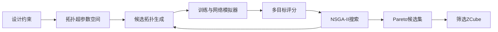
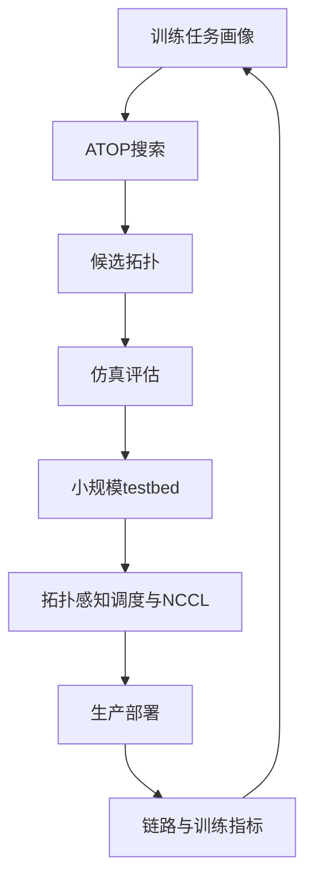

## 1. 先说结论

版本说明：本文参考的是 2026-05-21 访问的 Z.ai 在 X 上发布的文章入口、ACM DOI 页面、SIGCOMM 2025 官方论文列表、OpenAlex/Crossref 元数据，以及 everythinginsigcomm 对 SIGCOMM 2025 论文的公开记录。ACM PDF 当前对命令行抓取有 Cloudflare 挑战，因此本文不粘贴论文原文，只基于可验证摘要、元数据和公开记录做机制级解析。原论文标题是 **From ATOP to ZCube: Automated Topology Optimization Pipeline and A Highly Cost-Effective Network Topology for Large Model Training**，发表在 ACM SIGCOMM 2025。

一句话概括：

**ATOP 的核心不是“又设计了一个拓扑”，而是把 GPU 训练网络拓扑设计变成一个可搜索、可评估、可多目标优化的问题；ZCube 是这个搜索流程找到的一个高性价比解。**

这篇论文想解决的问题非常现实：大模型训练集群越来越大，网络越来越贵，而传统拓扑设计常常依赖人类专家在 Fat-tree、Rail-optimized Fat-tree、Rail-only、HPN 等少数模板里做调整。模板化设计的优点是确定、好解释、工程上容易接受；缺点是人类很容易偏向“规整、对称、看起来舒服”的结构，而未必能找到训练性能、故障容忍和硬件成本之间的最优折中。

ATOP 的做法是：

1. 把拓扑表示成一组高层超参数，而不是直接搜索巨大邻接矩阵。
2. 用这些超参数覆盖常见数据中心和 HPC 拓扑的设计直觉。
3. 把候选拓扑放进高保真模拟器里评估 LLM 训练流量、集合通信性能、成本和容错。
4. 用多目标进化算法 NSGA-II 搜索 Pareto 前沿。
5. 从搜索结果里发现 ZCube 这种人类不一定会手工画出来的不对称拓扑。

论文摘要给出的关键结果是：在 256、1024、4096、16384 GPU 等尺度上，ZCube 相比 ROFT、Rail-only、HPN 等已有拓扑，在仿真中让端到端 LLM 训练速度提升约 3% 到 7%，同时把网络硬件成本降低约 26% 到 46%；在 16 GPU 真实 testbed 上，ZCube 保持相同 all-reduce 和 all-to-all 性能，同时硬件成本降低约 25%。

这不是一个“训练速度暴涨”的故事，而是一个更工程化、更有钱味的问题：

```text
如果网络成本少 30% 左右，而训练吞吐不降甚至略升，这对万卡级集群就是非常大的资本开支差异。
```

## 2. 两个链接分别是什么

用户给的第一个链接是：

```text
https://x.com/Zai_org/status/2057216685040443743
```

这个 X 帖由 Z.ai 账号发布，时间是 2026-05-20 21:47:33 UTC。未登录页面能看到它只包含一个 X Article 短链：

```text
https://x.com/i/article/2057206923208884224
```

也就是说，第一个链接更像是 Z.ai 对这篇文章或解读的发布入口，而不是论文正文。X Article 未登录抓取时只返回登录页，所以本文把它作为发布声明引用，不把不可见内容当作事实来源。

第二个链接是 ACM DOI：

```text
https://dl.acm.org/doi/epdf/10.1145/3718958.3750503
```

论文元数据可以通过 Crossref、OpenAlex 和 SIGCOMM 2025 官方页面交叉确认：

1. 论文标题：From ATOP to ZCube: Automated Topology Optimization Pipeline and A Highly Cost-Effective Network Topology for Large Model Training
2. 会议：Proceedings of the ACM SIGCOMM 2025 Conference
3. DOI：10.1145/3718958.3750503
4. 作者：Zihan Yan、Dan Li、Li Chen、Dian Xiong、Kaihui Gao、Yiwei Zhang、Rui Yan、Menglei Zhang、Bochun Zhang、Zhuo Jiang、Jianxi Ye、Haibin Lin
5. 机构覆盖清华大学、中关村实验室、Harnets.AI、ByteDance

这组作者和机构也解释了为什么 Z.ai 会转发或发布相关文章：这篇论文处在大模型训练基础设施、GPU 集群网络和产业实践的交界处。

## 3. 为什么 GPU 训练拓扑不只是“普通数据中心网络”

普通数据中心网络要服务很多类型的流量：RPC、存储、缓存、用户请求、后台任务、东西向服务调用。它追求通用性、可运维性、隔离、故障域、弹性扩缩容。

大模型训练网络的约束不一样。一个训练 job 可能独占几百到几万张 GPU，通信模式有明显结构：

1. Data Parallel 会频繁做梯度 all-reduce 或 reduce-scatter/all-gather。
2. Tensor Parallel 对层内矩阵分片通信敏感，常常要求低延迟高带宽。
3. Pipeline Parallel 会形成阶段之间的激活和梯度流。
4. Expert Parallel / MoE 会带来 all-to-all，流量分布更尖锐。
5. Checkpoint、参数同步、数据加载也会占用网络，但和主训练环路的敏感度不同。

如果把 GPU 组织成节点、机架、pod、rail 等层级，那么训练中的通信不是随机的。它常常和并行策略绑定：

```text
同一个 TP group 内部：希望尽量近、带宽高、延迟低
同一个 DP group 内部：all-reduce 规模大，链路负载要均衡
EP/MoE all-to-all：可能跨更多节点，容易打爆上层链路
跨故障域放置：希望单点故障不要让整个训练作业崩掉
```

所以问题不是“给每台机器接入一个 Clos 网络就完事”，而是：

```text
在固定 GPU 数、交换机型号、端口数、链路带宽、机柜布线、成本预算下，
应该怎样连线，才能让训练通信快、设备少、故障后退化可控？
```

这就是 ATOP 试图自动化的问题。

## 4. 手工拓扑设计的瓶颈

传统拓扑设计常见两类思路。

第一类是 Clos/Fat-tree 这类数据中心经典结构。它的优点是规整、分层、等价路径多、工程经验丰富，缺点是为了全带宽和对称性会堆很多上层交换机，成本高，且不一定贴合 LLM 训练流量。

第二类是面向 GPU 训练做优化的结构，例如 Rail-only、ROFT、HPN 等。它们会利用 GPU 服务器内多张 NIC 的 rail 结构，尝试让某些集合通信走更短、更便宜的路径。相比通用 Clos，它们更了解 AI 训练，但仍然是人类先验很强的拓扑模板。

手工设计的问题在于搜索空间太大。假设有 $N$ 个交换节点和 GPU 节点，直接在邻接矩阵上搜索，可能的连边组合呈指数爆炸。哪怕加上端口数、链路数、层级约束，候选数量也大到不可能穷举。

更重要的是，拓扑好坏不是一个单指标：

1. 最短路径平均距离小，不代表 all-reduce 一定快。
2. bisection bandwidth 高，不代表 MoE all-to-all 不拥塞。
3. 网络成本低，不代表故障后还能保持可用。
4. 单个 collective benchmark 好，不代表完整训练 step time 好。
5. 规整拓扑好布线，不代表它在给定预算下最优。

这就是论文里 ATOP 的位置：它不是直接替代网络工程师，而是把工程师知道的设计原则压缩成一个能被算法搜索的参数空间。

## 5. ATOP 的核心抽象：不要搜索邻接矩阵

如果直接搜索“任意两个节点之间要不要连边”，算法很快会被组合爆炸淹没。ATOP 的关键设计是把拓扑表示成高层超参数。everythinginsigcomm 的记录提到，ATOP 使用 11 类可搜索超参数，来自已有 DCN 和 HPC 拓扑的专家设计原则。

可以把它理解成这样：

```text
不要问：
  switch_17 到 switch_93 要不要连线？

而是问：
  有几层？
  每层规模是多少？
  每层内部怎么连？
  层间怎么连？
  rail 之间怎么交叉？
  链路带宽和端口预算怎么分配？
  哪些部分保持对称，哪些部分允许不对称？
```

这种表示有两个好处。

第一，它显著缩小搜索空间。纯邻接矩阵可能需要搜索成千上万个二元变量，而高层超参数可能只需要几十个参数。

第二，它保留了工程可解释性。最后得到的拓扑不是一团随机图，而是仍然有层级、局部结构、端口约束和设计语义的网络。这样才有机会从论文走向真实部署。

这也是 ATOP 和“拿图优化算法随便搜一个 random graph”的重要区别：ATOP 的搜索空间是由网络设计经验塑形过的。

## 6. ATOP 的流程

ATOP 可以拆成四个阶段：



第一步是输入约束。比如 GPU 数量、服务器形态、NIC 数、交换机端口、链路带宽、预算、已有数据中心是否允许改造。

第二步是生成候选拓扑。候选不是任意图，而是由一组超参数决定的结构化拓扑。

第三步是模拟。模拟器需要回答的问题不是“这个图平均最短路是多少”，而是“在 LLM 训练流量下，它的端到端 step time、集合通信时间、链路拥塞、容错退化、硬件成本分别怎样”。

第四步是多目标优化。论文使用 NSGA-II 这类多目标进化算法。它不要求把所有目标硬塞成一个加权分数，而是寻找 Pareto 前沿：

```text
如果拓扑 A 在训练时间、成本、容错上都不差于拓扑 B，
并且至少一个指标更好，那么 A 支配 B。

不能相互支配的一组候选，就是 Pareto 前沿。
```

这很适合基础设施设计，因为真实决策很少只有一个目标。公司可能愿意多花 5% 成本换 2% 训练速度，也可能愿意牺牲一点峰值性能换更好的扩容和容错。Pareto 前沿给的是一组选项，而不是单个“算法神谕”。

## 7. 为什么要用 NSGA-II

NSGA-II 是一种经典多目标遗传算法。它大致做三件事：

1. 维护一批候选解。
2. 用交叉、变异生成新候选。
3. 根据非支配排序和多样性指标保留更好的候选。

对拓扑搜索来说，它比简单贪心更合适，因为拓扑参数之间可能强耦合：

1. 增加某层交换机数量可能降低拥塞，但也改变端口分配和布线成本。
2. 某个 rail 的连接方式对 all-reduce 有利，但对 all-to-all 未必有利。
3. 不对称结构可能在常态下更便宜，但故障后更容易形成热点。
4. 扩容场景下的最佳拓扑，未必是从零建设场景下的最佳拓扑。

贪心算法容易被局部选择带偏。NSGA-II 的优势是能在一个被工程先验压缩过的空间里保留多样性，逐步逼近不同目标之间的折中边界。

不过这也意味着 ATOP 的结果取决于搜索空间定义和模拟器准确性。自动搜索不是魔法，模型偏差会直接变成拓扑偏差。

## 8. ZCube 到底新在哪里

公开摘要和记录没有给出足够完整的 ZCube 连线细节，因此不能在这里伪造具体结构图。但可以明确的是，ZCube 的价值来自两个关键词：

1. **asymmetric topology**：它不是传统人类偏好的完全规整结构。
2. **cost-effective**：它不是单纯追求最高性能，而是在性能接近或更高的同时显著减少硬件成本。

为什么不对称可能更好？

因为训练流量本身并不完全对称。并行策略、GPU 放置、集合通信算法会让某些方向、某些层级、某些 rail 更关键。一个完全对称的网络会给所有方向都配置相似资源，这简单但可能浪费。一个合适的不对称网络可以把更多资源放在真正影响 step time 的路径上，把不敏感路径做得更便宜。

可以用一个简化例子理解：

```text
拓扑 A：每个方向都给 100 单位带宽，总成本 400。
拓扑 B：关键方向给 140，次要方向给 60，总成本 320。

如果训练流量 80% 都压在关键方向，B 可能更快也更便宜。
```

当然，真实 ZCube 不是这么简单的带宽重分配。它涉及 GPU 服务器、交换层级、rail、路径长度、链路复用、容错等多个维度。但这个例子说明了“不对称为什么可能有意义”。

## 9. 指标应该怎样读

论文摘要中的数字很诱人，但要正确理解。

第一，仿真里训练速度提升 3% 到 7%，不是模型算法层面的加速，而是网络拓扑改善带来的端到端训练时间改善。对单个 step 来说，3% 看起来不大；对持续数周、数月的万卡训练来说，这已经很可观。

第二，硬件成本降低 26% 到 46% 是更重要的信号。网络设备、光模块、线缆、机柜空间、电力和运维都会进入总成本。大规模训练集群里，网络不是配角。

第三，16 GPU testbed 的结果证明了 ZCube 不只是仿真图。但 16 GPU 仍然很小，它能验证基本通信和成本趋势，不能完全替代千卡、万卡级真实部署。

第四，all-reduce 和 all-to-all 是必要但不充分的 benchmark。真正训练还会受到计算-通信重叠、框架调度、NCCL 算法选择、拓扑感知 rank placement、故障恢复、作业混部等影响。

所以更稳妥的结论是：

```text
ZCube 展示了“自动拓扑搜索可以找到更高性价比网络”的强证据，
但每个生产集群仍然要把自己的硬件、训练栈和作业画像放进评估闭环。
```

## 10. ATOP 为什么比直接 benchmark 拓扑更有用

如果候选拓扑只有三四个，直接 benchmark 就够了。但真实设计里候选空间太大，很多拓扑甚至还没有被人类命名。ATOP 的意义是把这个过程系统化。

它能回答三类问题。

第一，从零建设：

```text
我要建一个 4096 GPU 训练集群，在给定交换机和 NIC 下，什么拓扑最划算？
```

第二，已有集群优化：

```text
我已经有一套网络，能不能换一部分连线或交换层级，让训练更快？
```

第三，扩容：

```text
原来是 1024 GPU，现在要扩到 4096 GPU，怎样扩才不把上层网络变成瓶颈？
```

这三类问题的最优解可能不同。手工设计很容易把“从零建设的优雅拓扑”误用到“在已有约束下扩容”的场景。ATOP 的价值在于把场景和约束显式输入。

## 11. 一个简化的搜索例子

假设我们要设计 1024 GPU 集群，每台服务器 8 GPU、8 NIC，那么有 128 台 GPU 服务器。交换机每台 64 端口，链路都是 400G。我们只考虑三种指标：

1. 训练 step time 越小越好。
2. 交换机和链路成本越低越好。
3. 单链路故障后的性能下降越小越好。

一个粗糙的搜索空间可以包含：

```text
pod 数量: 4 / 8 / 16
每 pod 服务器数: 8 / 16 / 32
rail 是否只在同号 NIC 间连接: true / false
pod 内拓扑: fat-tree / cube-like / hybrid
pod 间拓扑: full-mesh / partial-mesh / layered
上层交换机数量: 8 / 16 / 32
链路超售比: 1:1 / 2:1 / 4:1
是否允许不对称连边: true / false
```

每组参数生成一个候选拓扑。模拟器把 LLM 训练通信映射到图上，得到：

```text
candidate_17:
  step_time = 1.00
  cost = 1.00
  failure_drop = 5%

candidate_42:
  step_time = 0.96
  cost = 0.72
  failure_drop = 8%

candidate_89:
  step_time = 0.94
  cost = 0.95
  failure_drop = 3%
```

没有绝对赢家。candidate_42 更便宜也更快，但故障后下降更大；candidate_89 更稳但成本高。ATOP 最终给决策者的应该是这类 Pareto 选项，而 ZCube 是其中在多个 GPU 规模上都表现突出的结构。

## 12. 和 ROFT、Rail-only、HPN 的关系

论文摘要明确把 ZCube 和 ROFT、Rail-only、HPN 做比较。

Rail-only 的设计直觉是利用多 NIC rail，把同一 rail 上的 GPU/NIC 组织成较强的通信通道。它通常有成本优势，但跨 rail 或复杂流量下可能不够灵活。

ROFT 可以理解成 Rail-optimized Fat-tree，把 Fat-tree 的通用性和 rail 优化结合起来。它比纯通用 Fat-tree 更贴近 GPU 训练，但仍然较依赖分层对称结构。

HPN 是另一类面向高性能训练网络的候选。公开摘要没有展开细节，但它作为 state-of-the-art baseline 出现在比较中。

ZCube 并不是否定这些拓扑。更准确地说：

```text
ROFT / Rail-only / HPN 是强人工先验下的好设计；
ATOP 把这些先验放进更大的可搜索空间；
ZCube 是搜索后发现的、在给定目标下更优的设计点。
```

这个逻辑很重要。ATOP 不是“无先验 AI 设计网络”，而是“把人类先验结构化，再让算法探索人类不容易枚举的组合”。

## 13. 最容易误读的地方

第一，不要把 ZCube 理解成所有数据中心都应该立刻替换的拓扑。论文 Q&A 里也提到，新拓扑不容易部署，因为几乎所有数据中心拓扑现在都围绕 Clos/Fat-tree 形成了运维和工程惯性。

第二，不要只看训练速度提升。ZCube 最强的故事是成本-性能比，而不是绝对速度碾压。

第三，不要忽略 rank placement。拓扑再好，如果训练框架没有把 TP/DP/EP group 放到合适的位置，网络优势可能被浪费。

第四，不要忽略 NCCL 和集合通信算法。不同拓扑需要不同的 ring/tree/channel 策略。如果 collective library 不理解拓扑，可能走出次优路径。

第五，不要把小规模 testbed 外推得太满。16 GPU testbed 有价值，但万卡集群里的布线、故障、拥塞、作业混部、维护窗口会引入更多变量。

## 14. 真正落地还需要什么

要把 ATOP/ZCube 这类思想用于生产，我认为至少需要五个配套系统。

第一，准确的 workload profiling。你要知道训练任务到底花多少时间在 all-reduce、all-gather、reduce-scatter、all-to-all、P2P、checkpoint 和数据加载上。

第二，拓扑感知调度。集群调度器要知道不同 GPU 之间的网络距离和带宽，把同一个训练 job 的 rank 放在合适位置。

第三，拓扑感知 collective。NCCL 或类似通信库要选择适配 ZCube 的通信算法，而不是假设 Fat-tree 或 rail-only。

第四，可操作的布线和变更流程。网络拓扑不是论文图，真实世界有线缆长度、机柜空间、光模块库存、端口标签、施工窗口、故障排查。

第五，持续验证。拓扑搜索基于模拟器，模拟器必须不断用真实训练日志、链路计数器、拥塞指标和故障演练校准。

可以把生产闭环画成：



## 15. 对大模型基础设施的启发

这篇论文最有启发的地方，不是 ZCube 这个具体名字，而是它代表的基础设施设计方式变化。

过去很多基础设施设计是“专家先画结构，再用 benchmark 验证”。ATOP 更像是“专家定义搜索语言和评估函数，再让算法系统探索”。这在大模型基础设施里会越来越常见：

1. GPU 拓扑和并行策略联合搜索。
2. KV cache 放置和调度策略联合搜索。
3. MoE expert placement 和网络拓扑联合优化。
4. 存储层级、checkpoint 策略和训练恢复时间联合优化。
5. 推理集群里 prefill/decode disaggregation 的网络和调度联合优化。

共同点是：系统规模太大，人工枚举不够；但完全无约束搜索又不现实。最有效的路径通常是把专家经验变成可搜索参数，把系统目标变成可评估函数。

## 16. 我的判断

如果只从论文摘要看，ZCube 的训练速度提升 3% 到 7% 可能不够“炸裂”。但从基础设施投资看，它非常值得重视，因为网络硬件成本降低 26% 到 46% 才是关键。

我会把这篇论文放在“AI 基础设施从经验设计走向自动化搜索”的代表性工作里。它没有宣称一个拓扑统治所有场景，而是提供了一条方法论：

```text
先把拓扑设计空间变得可搜索，
再把训练真实性能纳入评估，
最后在性能、成本、容错之间找 Pareto 最优。
```

对实际工程团队来说，最值得学的不是照搬 ZCube，而是搭建自己的 ATOP：把本公司的 GPU 服务器形态、交换机 SKU、训练框架、并行策略、作业画像、成本模型和故障模型放进去，搜索适合自己的拓扑。

## 17. 参考

1. Z.ai 在 X 上的发布帖：<https://x.com/Zai_org/status/2057216685040443743>
2. X Article 入口：<https://x.com/i/article/2057206923208884224>
3. ACM DOI：<https://dl.acm.org/doi/10.1145/3718958.3750503>
4. SIGCOMM 2025 官方论文列表：<https://conferences.sigcomm.org/sigcomm/2025/program/papers-info/>
5. DBLP 条目：<https://dblp.uni-trier.de/rec/conf/sigcomm/Yan00XGZYZZJYL25.html>
6. OpenAlex DOI 元数据：<https://api.openalex.org/works/doi:10.1145/3718958.3750503>
7. Crossref DOI 元数据：<https://api.crossref.org/works/10.1145/3718958.3750503>
8. everythinginsigcomm 记录与 Q&A：<https://everythinginsigcomm.group/t/from-atop-to-zcube-automated-topology-optimization-pipeline-and-a-highly-cost-effective-network-topology-for-large-model-training/414>
