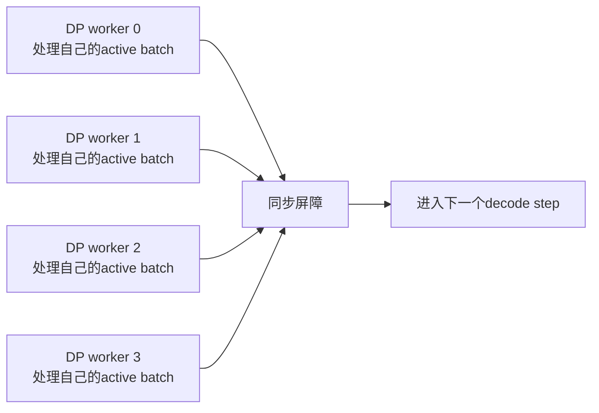
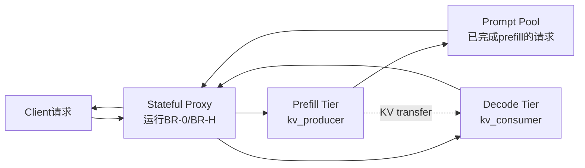

论文：Tackling the Data-Parallel Load Balancing Bottleneck in LLM Serving: Practical Online Routing at Scale

作者：Tianci Bu, Yuan Lyu, Zixi Chen, Chendong Song, Hong Liang, Tsepten Gurung, Yuwei Fan, Yinyu Ye, Zijie Zhou

版本：arXiv:2605.06113v2，2026-05-07提交，2026-05-08更新

链接：https://arxiv.org/abs/2605.06113

## 1. 先说结论

这篇论文讨论的是一个很容易被低估的 LLM serving 问题：

**当模型用 TP/EP 切分、再用 DP 扩展吞吐时，decode 阶段的每一步都有同步屏障。只要某个 DP worker 比其他 worker 更重，其他 worker 就会在每个 decode step 上等它。**

这不是普通 HTTP 服务里的“请求数不均匀”问题。LLM decode 的负载更特殊：

1. 请求一旦被分到某个 decode worker，通常不能迁移，因为迁移要搬完整 KV cache。
2. 请求的负载不是固定的，而是随着输出 token 增长，KV cache 越来越长。
3. 输出长度在路由时未知，长尾请求会长期占住某个 worker。
4. 路由器必须在每个 decode step 附近做决定，预算是毫秒级。

论文提出的 BalanceRoute 不是新的 attention kernel，也不是新的 KV cache 压缩方法，而是一个 **prefill 完成后，把请求分配到 decode DP worker 的在线路由算法**。

它有两个版本：

| 方法 | 是否需要预测 | 核心思想 |
|---|---:|---|
| BR-0 | 不需要 | 用当前负载计算每个 worker 的安全余量，优先把请求填到不会超过当前最重 worker 的位置 |
| BR-H | 需要短视野预测 | 看未来 $H$ 个 decode step，预测哪些请求快结束，再决定把新请求放到哪里 |

论文在 `vllm-ascend` 上实现了一个 stateful proxy，并在 144-NPU 集群上评估。主实验里，在 $G=8$ 个 decode DP worker 时：

| 数据集 | 最强基线吞吐 | BR-0吞吐 | 部署版BR-H吞吐 | 部署版BR-H相对最强基线 |
|---|---:|---:|---:|---:|
| Proprietary Data | 847 tok/s | 943 tok/s | 977 tok/s | 约 +15.4% |
| Azure-2024 | 794 tok/s | 854 tok/s | 909 tok/s | 约 +14.5% |

更重要的是，随着 DP worker 数量变大，负载不均衡的代价会放大。论文的 scaling 实验中，oracle BR-H 相对最强基线的吞吐优势从 $G=4$ 的 +13.4% 增长到 $G=16$ 的 +34.5%。

一句话概括：

**BalanceRoute 把 LLM decode 路由从“看队列长度”升级成“看 KV 负载和同步屏障下的边际失衡代价”。**

## 2. 背景：为什么DP decode会卡在最慢worker上

大模型 serving 通常会混合使用几种并行方式：

1. **TP, Tensor Parallelism**：把一个模型层里的矩阵计算切到多个设备上。
2. **EP, Expert Parallelism**：MoE 模型里把不同 expert 放到不同设备上。
3. **DP, Data Parallelism**：复制多份模型并行处理不同请求。

单个模型太大时，通常先用 TP 或 EP 组成一个 worker group。为了提高吞吐，再复制多个这样的 group，形成多个 DP worker。

问题出在 decode 阶段。每个 decode step 都会有 TP all-reduce 或 EP all-to-all 这类 collective communication。只要这些 DP worker 处在同一个同步节奏里，每一步的时间就会被最慢的 worker 决定。

可以把一次 decode step 理解成：



如果 4 个 worker 的负载分别是：

```text
worker 0: 100K tokens of KV
worker 1: 95K tokens of KV
worker 2: 40K tokens of KV
worker 3: 30K tokens of KV
```

那么 worker 2 和 worker 3 不会因为自己轻就提前进入下一步。它们会在 barrier 前等待 worker 0。

这就是论文关心的 DP imbalance。它不是只影响一次请求分发，而是会在每个 decode step 反复付费。

## 3. 为什么普通负载均衡不够

常见路由策略包括：

| 策略 | 做法 | 在LLM decode里的问题 |
|---|---|---|
| Random | 随机选 worker | 不看请求大小和已有 KV 负载 |
| Round Robin | 轮流分发 | 只均衡请求数，不均衡 token/KV 负载 |
| Power of Two Choices | 随机挑两个，选更轻的 | 如果轻重指标只是队列长度，仍然看错负载 |
| Join Shortest Queue | 选 active request 数最少的 worker | 一个长上下文请求和一个短请求被当成同样的 1 个请求 |

LLM decode 的请求成本差异非常大。例如：

```text
请求A:
  prompt = 512 tokens
  output = 100 tokens

请求B:
  prompt = 16K tokens
  output = 4000 tokens
```

它们都是一个请求，但对 decode worker 的长期负载完全不同。

论文强调了四个让问题变难的结构。

第一，**sticky assignment**。prefill 完成后，请求会被分配到某个 decode worker。这个 worker 持有后续 decode 需要的 KV cache。中途迁移请求意味着要搬 KV cache，代价太高，所以实际系统里通常不迁移。

第二，**负载会随时间增长**。如果请求 $i$ 的 prompt 长度是 $s_i$，它生成到第 $j$ 个 decode step 时，对应的 KV 负载可以近似写成：

$$
w_i^{(j)} = s_i + j - 1
$$

也就是说，长输出请求不只是占 slot 久，它每一步还会越来越重。

第三，**输出长度未知**。路由时知道 prompt tokens，但不知道请求到底会生成多少 token。长尾输出会让某个 worker 长时间成为 straggler。

第四，**决策预算很小**。decode step 通常是几十毫秒量级，路由器不能每一步跑一个很重的全局优化器。

这解释了为什么论文没有直接用复杂整数规划做在线路由，而是设计了一个能在毫秒级运行的打分函数和两阶段算法。

## 4. 论文的问题建模

设有 $G$ 个 decode DP worker。第 $k$ 个 decode step 时，worker $g$ 上的活跃请求集合是 $\mathcal{A}_g(k)$。

worker $g$ 的当前负载定义为它所有 active requests 的 KV workload 之和：

$$
L_g(k) =
\sum_{i \in \mathcal{A}_g(k)}
w_i^{(k - x_i + 1)}
$$

其中 $x_i$ 是请求 $i$ 被分配到 decode worker 的 step。

每一步的最重 worker 负载是：

$$
M(k) = \max_{g \in [G]} L_g(k)
$$

论文用下面的量刻画这一步的总失衡：

$$
I(k) = G \cdot M(k) - \sum_{g \in [G]} L_g(k)
$$

这个公式很好理解：

```text
如果所有 worker 都被填到最重 worker 的负载 M(k)，总工作量是 G * M(k)
真实总负载是 sum L_g(k)
两者差值就是在 barrier 下被浪费的“空等空间”
```

例如 $G=4$，当前负载是：

```text
[100, 90, 70, 60]
```

那么：

$$
M = 100
$$

$$
I = 4 \times 100 - (100 + 90 + 70 + 60) = 80
$$

这个 $80$ 可以理解为：

```text
worker 0: 等待空隙 0
worker 1: 等待空隙 10
worker 2: 等待空隙 30
worker 3: 等待空隙 40
总空隙 = 80
```

路由器要做的是：当一批 prefill-completed 请求等待进入 decode 时，把它们分配到合适的 worker，尽量降低这种每步失衡。

## 5. BR-0：不做预测，只看当前安全余量

BR-0 是 BalanceRoute 的 prediction-free 版本。

它的核心概念是 **safe margin**：

$$
m_g = M(k) - L_g(k)
$$

也就是 worker $g$ 在不超过当前最重 worker 之前还能吃下多少负载。

假设当前负载是：

```text
worker 0: 100
worker 1: 90
worker 2: 70
worker 3: 60
```

那么 safe margin 是：

```text
worker 0: 0
worker 1: 10
worker 2: 30
worker 3: 40
```

如果有一个 prompt 长度为 25 的请求要进来，把它放到 worker 3 上，worker 3 从 60 变成 85，不会超过 100。这是好事，因为它填平了空隙。

但如果有一个 prompt 长度为 80 的请求放到 worker 3 上，worker 3 会从 60 变成 140。新的最重 worker 变成 140，所有其他 worker 都要等它。这个动作不仅没有减少失衡，反而制造了更大的 straggler。

BR-0 用 F-score 表达这个边际收益。设分配到 worker $g$ 的请求集合是 $Q$，这些请求的初始负载之和为：

$$
\Delta_s(Q) = \sum_{i \in Q} s_i
$$

BR-0 的打分是：

$$
F_g(Q)
=
\Delta_s(Q)
-
G \cdot (\Delta_s(Q) - m_g)_+
$$

其中 $(x)_+ = \max(x, 0)$。

这个式子分成两段。

当 $\Delta_s(Q) \le m_g$，也就是新请求没有让 worker $g$ 超过当前最重 worker：

$$
F_g(Q) = \Delta_s(Q)
$$

越多越好，因为它在填空隙。

当 $\Delta_s(Q) > m_g$，也就是发生 overflow：

$$
F_g(Q) = Gm_g - (G-1)\Delta_s(Q)
$$

超过安全余量之后，每多放一点负载，就会把新的最大负载 $M(k)$ 往上抬。由于所有 $G$ 个 worker 都受 barrier 影响，这个惩罚会随着 $G$ 放大。

这就是 BR-0 最关键的直觉：

**安全区内，负载是收益；超过安全区，负载会变成乘以系统规模的惩罚。**

## 6. BR-0的两阶段路由

如果每次都在所有 waiting requests 和所有 worker 的所有子集上做组合优化，开销会太大。论文把 BR-0 拆成两阶段。

### 6.1 Stage 1：容量充足时贪心填充

当总空 slot 还很多时，算法优先选择 free capacity 最大的 worker，再从 waiting set 里选使 $F_g(\{i\})$ 最大的单个请求。

直觉是：这时大部分 worker 还处在安全区，没必要做复杂组合搜索。先把大的请求放到容量和余量都更充足的位置，通常就能明显改善负载形状。

### 6.2 Stage 2：容量稀缺时精细选择

当剩余 slot 不多时，每个 slot 都很关键。算法会把有空位的 worker 放进优先队列，优先考虑 capacity 和 safe margin 更好的 worker。

对某个 worker $g$，BR-0 会从 waiting set 的候选窗口里选一个请求子集 $Q^\star$，使 $F_g(Q)$ 最大：

```text
Q* = argmax F_g(Q)
```

如果最优子集的 score 仍然不正，算法也会强制放入一个最好的单请求，避免请求一直饿死。

这套设计有一个实用优点：BR-0 不需要预测模型、不需要训练数据、不需要理解请求语义。只要路由器能拿到当前每个 worker 的 active KV workload 和 waiting requests 的 prompt length，就可以运行。

## 7. BR-H：把“谁快结束”也纳入路由

BR-0 只看当前 step，有时会做出短视决策。

例如当前某个 worker 很重，但它上面的长请求其实马上就要结束。如果路由器知道这一点，就可以更积极地把新请求放过去。反过来，某个 worker 当前不重，但上面全是还会持续很久的请求，也不一定适合继续加压。

BR-H 用一个短视野 $H$ 解决这个问题。

论文没有要求预测完整输出长度，而是预测一个更适合路由的问题：

$$
\widehat{c}_i(k)
\approx
\mathbb{E}[\min(r_i(k), H)]
$$

其中 $r_i(k)$ 是请求 $i$ 在 step $k$ 时剩余的 decode steps。

这个量的含义是：

```text
在未来 H 个 step 里，请求 i 预计还会贡献多少步负载？
```

如果请求很快结束，$\widehat{c}_i(k)$ 小。  
如果请求大概率超过 $H$ 步，$\widehat{c}_i(k)$ 接近 $H$。

论文把预测拆成两部分：

1. **termination classifier**：预测请求是否会在未来 $H$ 步内结束。
2. **conditional-mean regressor**：如果会在窗口内结束，预测还剩多少步。

组合公式是：

$$
\widehat{c}_i(k)
=
(1-\widehat{p}_{\mathrm{fin}}^{(i)})H
+
\widehat{p}_{\mathrm{fin}}^{(i)}
\widehat{\mu}_{\mathrm{rem}}^{(i)}
$$

这个设计比直接预测完整输出长度更稳。长输出通常是 heavy-tailed，完整长度很难准；但“未来 80 步内会不会结束”这种短视野二分类更可控，也更贴近路由真正需要的信息。

## 8. BR-H的horizon F-score

BR-H 把 BR-0 的单步 F-score 扩展到未来 $H$ 步。

它先根据活跃请求的预测剩余贡献，估计每个 worker 在未来的负载：

```text
L_g(k), L_g(k+1), ..., L_g(k+H)
```

然后对每个 horizon step 计算 envelope：

$$
M_h = \max_{g'} L_{g'}(k+h)
$$

以及 worker $g$ 在未来每一步的 margin：

$$
m_{g,h} = M_h - L_g(k+h)
$$

BR-H 的打分是：

$$
F_g(Q)
=
\alpha(\mathbf{1}^{\top}\mathbf{d})\Delta_s(Q)
-
\beta
\left(
\Delta_s(Q)\mathbf{1} - \mathbf{m}_g
\right)_+^{\top}
\mathbf{d}
$$

其中：

$$
\mathbf{d} = (1, \gamma, \gamma^2, \ldots, \gamma^H)
$$

可以把它理解成：

```text
收益项:
  把新请求放到 worker g，可以填补未来 H 步里的低负载空间

惩罚项:
  如果新请求让 worker g 在某些未来 step 超过 envelope，就按折扣后的 overflow 惩罚

gamma:
  越小越不信远期预测，算法越接近 BR-0

beta:
  控制 overflow 惩罚强度
```

当 $H=0$ 且 $(\alpha, \beta)=(1, G)$ 时，BR-H 就退化成 BR-0。

这点很重要：BR-0 和 BR-H 不是两套无关算法，而是同一个框架在“无预测”和“短视野预测”两个 operating point 上的实例。

## 9. 系统实现：为什么需要stateful proxy

论文不只是给了算法，还在 `vllm-ascend` 上做了系统实现。

部署场景是 prefill-decode disaggregation：



核心组件有几个。

第一，**stateful proxy**。BR-H 需要全局视角：每个 worker 当前有哪些 active requests、当前 KV workload、waiting pool 里有哪些 prefill-completed 请求、活跃请求预计什么时候结束。因此普通 stateless router 不够，论文实现了一个 Python/uvloop proxy。

第二，**Prompt Pool**。prefill 完成后的请求不会立刻进入 decode，而是先放进 pool。decode dispatcher 醒来时，可以从一批 waiting requests 里选子集，而不是每次只能处理一个请求。这是 Stage 2 能发挥作用的前提。

第三，**payload mutation**。proxy 不修改 vLLM engine，而是通过 OpenAI-compatible API 的请求字段来驱动 prefill 和 decode：

```text
prefill probe:
  stream = false
  max_tokens = 1
  min_tokens = 1
  kv_transfer_params = remote decode enabled

decode admission:
  stream = true
  恢复原始max_tokens和采样参数
  附带prefill阶段返回的KV transfer handles
```

这样 prefiller 先算好 KV cache，并通过 MooncakeConnector 等机制把 KV 交给 decode worker。

第四，**in-band telemetry**。proxy 通过解析 decode 返回的 SSE stream 来更新每个请求已经生成多少 token；请求结束时清理状态。prefiller 的 KV cache 使用率通过 Prometheus metrics 轮询，用来做 back-pressure，避免 prefiller KV 被 delayed-free 请求撑满。

第五，**毫秒级调度开销**。论文在 $G=8$、$R_{\max}=4$ 的设置下测得：

| 模型/部署 | Dispatch P50 | Dispatch P99 |
|---|---:|---:|
| DeepSeek-V3 671B | 1.20 ms | 2.77 ms |
| Qwen3-30B-A3B | 1.03 ms | 2.52 ms |

相对约 60 ms 的 engine step，这个控制面开销在论文实验里足够小。

## 10. 实验结果怎么读

论文的主实验设置：

| 项 | 设置 |
|---|---|
| Serving stack | `vllm-ascend`，V1 scheduler，continuous batching，PagedAttention，MooncakeConnector |
| 主模型 | DeepSeek-V3 671B W8A8 |
| 硬件 | Atlas 910C，最大 144 NPU |
| 默认拓扑 | 4P1D，4 个 prefill nodes，1 个 decode node |
| 默认 decode DP | $G=8$，TP=4 |
| 数据集1 | Proprietary production trace，8000 requests，平均 prompt 3197，平均 output 1185 |
| 数据集2 | Azure-2024 conversation split，过滤 output length > 1000，10000 requests，平均 prompt 4652，平均 output 1052 |

对比基线是 vLLM router 里的常见策略：

1. Random
2. Round-Robin
3. Power-of-Two-Choices
4. Join-Shortest-Queue

指标有三个：

1. **Average imbalance**：每步各 DP worker KV workload 的 max-min，越低越好。
2. **TPOT P95**：time per output token 的 95 分位，越低越好。
3. **Throughput**：输出 tokens/s，越高越好。

主结果如下。

| 方法 | Proprietary imbalance | Proprietary TPOT | Proprietary tput | Azure imbalance | Azure TPOT | Azure tput |
|---|---:|---:|---:|---:|---:|---:|
| Random | 438225 | 85.2 | 811 | 146564 | 90.3 | 706 |
| Round-Robin | 254798 | 83.2 | 847 | 110049 | 89.1 | 771 |
| P2C | 262940 | 84.0 | 836 | 109033 | 89.3 | 794 |
| JSQ | 215110 | 83.2 | 843 | 104737 | 89.3 | 785 |
| BR-0 | 51927 | 79.3 | 943 | 54051 | 83.3 | 854 |
| BR-H oracle | 23577 | 78.0 | 1029 | 35301 | 77.3 | 957 |
| BR-H deployed, Survival | 40757 | 78.7 | 979 | 44010 | 82.1 | 893 |
| BR-H deployed, ExactMatch | 36277 | 78.8 | 977 | 38496 | 82.3 | 909 |

几个观察：

第一，BR-0 已经很强。它不需要预测，就把 Proprietary Data 上的 imbalance 从 JSQ 的 215110 降到 51927，吞吐从 843 tok/s 提到 943 tok/s。

第二，BR-H 的 oracle 版本说明“未来信息”确实有价值。Proprietary Data 上，oracle BR-H 把 imbalance 进一步降到约 24K，吞吐到约 1029 tok/s。

第三，部署版预测器能追回不少 lookahead 收益。ExactMatch 在 Proprietary Data 上达到 977 tok/s，在 Azure-2024 上达到 909 tok/s。

第四，TPOT P95 也下降了。这说明吞吐提升不是通过牺牲尾延迟换来的。

## 11. 为什么规模越大收益越明显

论文的一个重要观点是：DP worker 越多，负载不均衡越容易变成大问题。

原因是 max 和 mean 的差距会随着 worker 数量增大而变大。只要请求长度有波动，worker 数越多，出现某个特别重 worker 的概率就越高。同步屏障又会让所有 worker 都被这个 straggler 拖住。

论文在 Proprietary Data 上做了 scaling 实验：

| 方法 | $G=4$ 吞吐 | $G=8$ 吞吐 | $G=16$ 吞吐 |
|---|---:|---:|---:|
| 最强基线 | 366.4 | 846.7 | 927.3 |
| BR-0 | 407.1 | 942.5 | 1117.8 |
| BR-H oracle | 415.3 | 1028.9 | 1247.4 |

BR-H oracle 相对最强基线：

```text
G=4:  +13.4%
G=8:  +21.5%
G=16: +34.5%
```

这说明 BalanceRoute 解决的是一个会随规模放大的瓶颈。小规模时，随机波动和 barrier idle 还没那么致命；规模变大后，DP 负载均衡会更接近一等公民问题。

## 12. 参数与预测器：论文里真正实用的地方

BR-H 有两个重要参数：

1. $\beta$：overflow 惩罚强度。
2. $\gamma$：未来 step 的折扣因子。

如果 $\gamma$ 小，算法更相信近未来，少相信远未来，行为更接近 BR-0。  
如果 $\beta$ 大，算法更害怕把某个 worker 推成新的 straggler。

论文做了参数敏感性实验。在 Proprietary Data、$G=8$、oracle、$H=80$ 下，不同参数组合的吞吐大致在 945 到 1043 tok/s 之间，TPOT P95 在 77.3 到 79.5 ms 之间。所有扫过的配置都明显好于最强基线。

这点对系统落地很关键：BR-H 不是只能靠一个精确参数点才能工作。

预测器方面，论文评估了两个非深度学习实现：

| 预测器 | 做法 | 适合场景 |
|---|---|---|
| Survival | 基于训练集输出长度的经验分布估计 | 没有 prompt-level 重复信号 |
| ExactMatch | 对 prompt hash 维护经验 CDF，miss 时回退到 Survival | 多轮对话、模板化请求、prompt 重复明显 |

离线准确率表明：

| 数据集 | 预测器 | Stage-1 AUC | Stage-2 MAE |
|---|---|---:|---:|
| Azure-2024 | Survival | 0.993 | 5.4 |
| Azure-2024 | ExactMatch | 0.995 | 5.4 |
| Proprietary Data | Survival | 0.700 | 20.1 |
| Proprietary Data | ExactMatch | 0.974 | 2.9 |

这也解释了为什么 ExactMatch 对有重复结构的 workload 更有用。

## 13. 和cache-aware routing的区别

LLM serving 里还有一类路由是 cache-aware routing，比如为了 prefix cache 命中，把相同前缀请求路由到同一个 backend。

BalanceRoute 关注点不同。

cache-aware routing 主要问：

```text
哪个后端已有这个prefix的KV cache？
```

BalanceRoute 主要问：

```text
把这个prefill-completed请求放进哪个decode DP worker，
会最小化同步屏障下的跨worker失衡？
```

它们并不冲突，但目标函数不同。一个关注 prefix reuse，一个关注 DP barrier idle。

在 PD disaggregation 场景下，这个区别更明显：prefill tier 已经完成 prompt 计算，decode tier 面临的问题是如何把这些带 KV 的请求放到 DP worker 上，让后续每一步 decode 不被 straggler 拖慢。

## 14. 局限性

论文也有一些需要注意的边界。

第一，实验里每个 cell 是 single replay。作者说明 144-NPU 资源不稳定，无法系统性做多次重复实验。因此结果的趋势可信，但统计置信区间没有充分展开。

第二，部署版预测器主要在 $G=8$ 下和 oracle 对比。更大规模下 predictor noise 与 $G$ 的交互还需要更多实验。

第三，stateful Python proxy 在论文规模下开销很低，但更大 $G$、更高 QPS 或跨机房部署时，单点控制面可能需要分层、分片或硬件卸载。

第四，BR-H 的 Prompt Pool 会让 KV transfer 变成 late-binding。论文指出 BR-0 有 pool-bypass 低延迟路径，可以提前 overlap KV transfer；但 $H>0$ 的 BR-H 如何同时保留 pool 的组合选择能力和提前 KV transfer，仍是未来工作。

第五，BalanceRoute 优化的是 decode DP imbalance。如果系统瓶颈在 prefill、网络、KV transfer、tokenizer、client backpressure 或模型 kernel 本身，路由收益会被其他瓶颈盖住。

## 15. 什么时候值得用BalanceRoute

更适合的场景：

1. 大模型部署已经使用 TP/EP + DP。
2. decode 阶段有明显同步屏障或 step-level straggler。
3. 请求输出长度差异大，长尾明显。
4. prompt/output tokens 大，KV workload 主导 decode step 时间。
5. PD disaggregation 下，需要把 prefill-completed 请求分配到 decode tier。
6. 现有 router 主要按请求数、队列长度或简单 active tokens 做路由。

不一定优先做的场景：

1. DP worker 很少，barrier idle 不是主瓶颈。
2. 请求长度非常均匀，JSQ/RR 已经足够。
3. prefill 远比 decode 更瓶颈。
4. 系统没有可靠的 per-worker KV workload telemetry。
5. 中途迁移 KV cache 很便宜，sticky assignment 假设不成立。

工程落地可以按这个顺序推进：

```text
1. 先采集每个decode worker的active tokens/KV workload。
2. 画出每个step的max-min和max-mean gap。
3. 如果gap稳定很大，先实现BR-0。
4. 如果BR-0收益明显，再加入短视野completion预测，升级到BR-H。
5. 最后再考虑Prompt Pool、KV transfer overlap、back-pressure等系统优化。
```

## 16. 总结

BalanceRoute 的价值不在于复杂，而在于它抓住了 LLM serving 里一个很具体的结构：

**decode DP worker 不是独立服务器，它们被每步 collective communication 绑在一起。路由器让某个 worker 变重，代价会通过同步屏障传导给所有 worker。**

BR-0 用 safe margin 和 F-score 把这个代价表达出来，不需要预测就能显著降低失衡。BR-H 再用短视野终止预测，把“哪个请求快结束”纳入未来负载估计，进一步改善吞吐和尾延迟。

这篇论文给我的启发是：LLM serving 的 router 不应该只是 Web 时代负载均衡策略的移植。它应该理解 token、KV cache、decode step、同步屏障和 sticky assignment。只要这些结构存在，路由策略就有很大的系统优化空间。

## 参考

1. BalanceRoute论文：https://arxiv.org/abs/2605.06113
2. BalanceRoute PDF：https://arxiv.org/pdf/2605.06113
3. arXiv DOI：https://doi.org/10.48550/arXiv.2605.06113
4. vLLM Router：https://github.com/vllm-project/router
5. vLLM项目：https://github.com/vllm-project/vllm
6. vLLM Ascend：https://github.com/vllm-project/vllm-ascend
