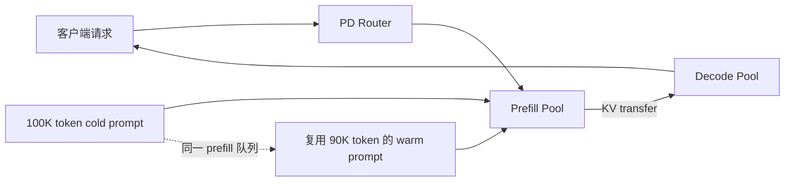
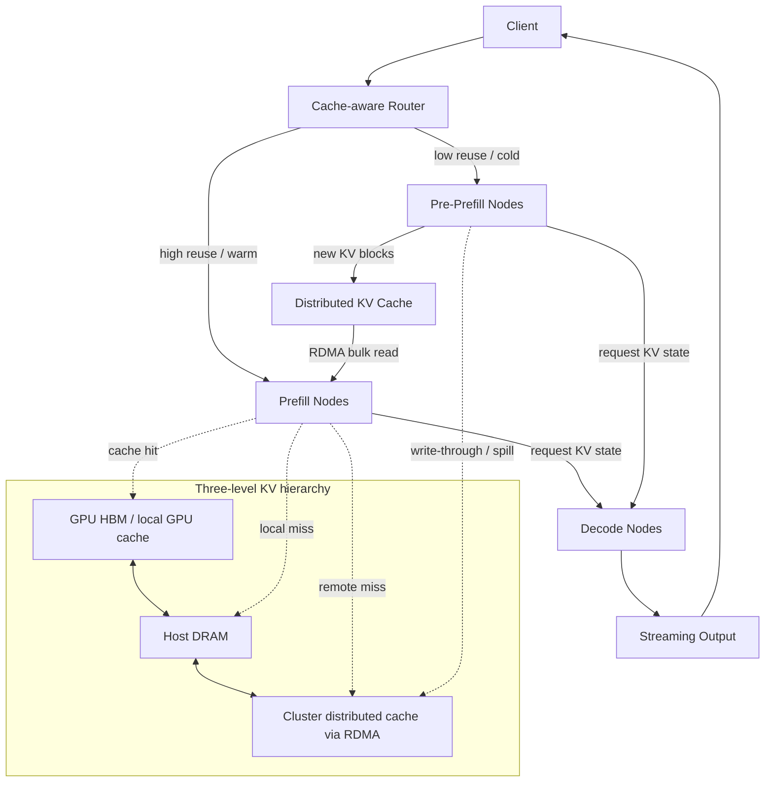
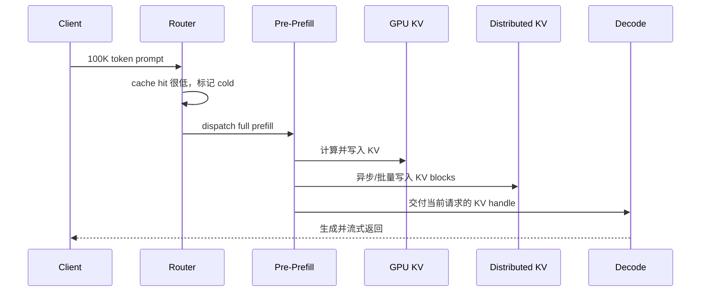

> 版本说明：本文基于 Together AI 官方博客《Cache-aware prefill–decode disaggregation (CPD) for up to 40% faster long-context LLM serving》整理。原文发表于 2026-03-04，本文于 2026-08-26 撰写。Together AI 的 CPD 具体实现、路由器接口、缓存一致性协议和生产配置没有完全公开，正文会明确区分原文实测结果与解释性推导。

## 1 先说结论

Together AI 这篇文章真正提出的不是“再做一次 Prefill/Decode 分离”，而是给 P/D 分离增加一个**按缓存复用程度分流的 pre-prefill 层**：

1. **冷请求（cold request）**：prompt 基本没有可复用前缀，需要完整 prefill。它们进入专门的 pre-prefill 节点，计算新上下文并把 KV cache 写入分布式缓存。
2. **热请求（warm request）**：prompt 的大部分前缀已经存在缓存中。它们进入普通 prefill 节点，读取已有 KV，只计算很短的后缀。
3. **Decode 请求**：继续由独立的 decode 节点处理，避免被长 prefill 打断。

CPD 的关键收益来自**隔离不同成本的 prefill**，而不是让模型 kernel 本身变快。普通 PD 已经把 prefill 和 decode 隔离了，但 cold 和 warm prefill 仍然可能在同一个 prefill 队列里互相阻塞。CPD 再把 prefill 拆成两条路径，让可复用上下文走快路径，让昂贵的新上下文在另一组资源上逐步把缓存“预热”起来。

原文在 NVIDIA B200 上评测了混合 warm/cold 的 coding-agent workload：2P1D 基线大约在 `0.75–0.8 QPS/GPU` 附近饱和，CPD 大约可以到 `1.1–1.15 QPS/GPU`，可持续吞吐提升约 `35–40%`。这里的“40%”是特定负载、硬件和延迟 SLO 下的**可持续系统容量提升**，不是每个请求都降低 40% 延迟，也不是 decode 吞吐提升 40%。

## 2 为什么长上下文服务会被缓存命中率影响

### 2.1 Prefill 和 Decode 是两种完全不同的工作

Decoder-only Transformer 的在线推理可以拆成两个阶段：

```text
prefill(prompt):
  一次性处理输入 prompt 的全部 token
  计算每层 attention 的 K/V
  把 K/V 写入 KV cache

decode(next token):
  每轮只处理最新生成的 token
  读取此前所有 token 的 KV cache
  计算下一个 token，并追加新的 K/V
```

两者的资源画像不同：

| 维度 | Prefill | Decode |
| --- | --- | --- |
| 输入形态 | 一次处理整段 prompt | 每轮处理一个或少量新 token |
| 主要指标 | TTFT（Time to First Token） | TPOT/ITL（每个输出 token 的间隔） |
| 计算特征 | 大矩阵、长序列、适合吞吐 | 小步迭代、对调度抖动敏感 |
| KV 行为 | 大量写入 KV | 高频读取历史 KV 并追加新 KV |
| 长上下文影响 | prompt 越长，首次计算越重 | KV 越长，每一步读取的数据越多 |

Prefill 的 attention 计算量通常随输入长度 $n$ 以二次量级增长（即使 FlashAttention 避免了大中间张量，也没有改变 attention 的基本算术量级），而 MLP 和投影部分大致随 $n$ 线性增长。Decode 每一步只输入一个新 token，但要访问长度为 $t$ 的历史 KV，因此它更容易受显存带宽和 batch 调度影响。

TTFT 可以粗略拆成：

$$
\mathrm{TTFT}
\approx
\mathrm{queue\ time}
+\mathrm{prefill\ compute}
+\mathrm{KV\ transfer}
+\mathrm{first\ decode\ step}
$$

普通 PD 主要解决的是 `prefill compute` 和 decode 之间的资源干扰；CPD 进一步处理 `queue time` 和 `KV transfer`，因为长上下文场景里这两项可能比 kernel 本身更决定用户看到的延迟。

### 2.2 Prefix cache 让“相似请求”变成不同成本

考虑三个请求：

```text
请求 A = [系统提示词][工具说明][代码库文档][问题 A]
请求 B = [系统提示词][工具说明][代码库文档][问题 B]
请求 C = [完全不同的新文档][问题 C]
```

A 和 B 共享很长的前缀。只要模型、tokenizer、位置编码、LoRA/adapter 和缓存命名空间一致，前缀 token 对应的 K/V 就可以复用。B 不需要重新计算 `[系统提示词][工具说明][代码库文档]`，只需要加载这段 KV 并计算自己的问题后缀。

但 C 没有可复用前缀，需要完整 prefill。于是可以把请求按缓存命中程度分成：

- **warm**：命中前缀占比较高，新增计算很少。
- **cold**：命中很短或完全未命中，需要处理大量新 token。

这不是请求的永久属性。同一个长上下文第一次出现时是 cold；它被计算并写入缓存后，后续请求就可能变成 warm。CPD 把缓存命中率看成路由和调度输入，而不是请求结束后的附加统计。

### 2.3 普通 PD 仍然存在队头阻塞

普通的 P/D 分离可以画成这样：



假设一个 cold 请求需要几秒钟的 prefill，而一个 warm 请求只需加载 KV 并计算几千个新 token。两者虽然计算成本完全不同，却可能排在同一组 prefill worker 后面。此时 warm 请求的 TTFT 变长，并不是因为它需要更多计算，而是因为它在队列里等待 cold 请求完成。

这就是文章讨论的核心问题：**PD 已经隔离了 prefill 和 decode，却没有隔离不同复用程度的 prefill。**

## 3 CPD 的整体架构

### 3.1 三类节点和职责

CPD 在 P/D 之间增加了一个 pre-prefill tier：

| 节点角色 | 面向的请求 | 主要动作 | 主要目标 |
| --- | --- | --- | --- |
| Pre-Prefill | cold、低复用 prompt | 完整 prefill，写入分布式 KV cache | 吞吐、持续吸收新上下文 |
| Prefill | warm、高复用 prompt | 读取缓存 KV，只计算未命中后缀 | 低 TTFT、短队列 |
| Decode | 所有已完成 prefill 的请求 | 读取 KV，逐 token 生成 | 稳定 TPOT/ITL、低尾延迟 |

架构数据路径如下：



图里的层级是一个“快到慢”的路径：

1. **GPU memory**：延迟最低，容量最紧张，适合当前活跃请求和最热前缀。
2. **Host DRAM**：容量比 GPU 大，仍然可以通过高速内存路径搬运，但需要额外的 host-device copy。
3. **集群级 distributed cache**：通过 RDMA 连接多个节点的共享缓存，容量最大，但需要网络传输和元数据查询。

原文没有把这三层的具体软件组件、淘汰算法或一致性协议全部展开。因此更准确的说法是：CPD 规定了**缓存层级和数据流**，具体实现可以采用不同的 KV store、transfer engine 和本地缓存管理器。

### 3.2 Router 的决策输入

CPD router 至少需要估计以下信息：

```text
matched_tokens = longest_cached_prefix(request_tokens)
reuse_ratio    = matched_tokens / prompt_tokens
new_tokens     = prompt_tokens - matched_tokens
```

一种概念性的路由流程是：

```pseudo
prefix = cache_index.longest_prefix(tokens, cache_namespace)
reuse_ratio = prefix.length / len(tokens)

if prefix.length == 0 or reuse_ratio < cold_threshold:
    route to pre_prefill
else:
    route to prefill
```

真实系统不会只看一个比例。还需要把候选节点的排队时间、GPU/DRAM 命中位置、RDMA 带宽、请求优先级、decode 容量和延迟 SLO 一起纳入决策。CPD 的文章重点是“按复用程度分流”，并没有给出一个可直接复制的阈值公式。

### 3.3 为什么 pre-prefill 不是“第三种 decode”

pre-prefill 的名字容易让人误以为它是一个新的模型阶段。实际上它仍然执行普通 prefill，只是承担了不同的系统角色：

- 对没有缓存的长 prompt，负责把新上下文算出来。
- 把生成的 KV 写入可被其他 prefill 节点读取的分布式 cache。
- 不让这类长任务占据 warm 请求的快速 prefill 资源。

因此 CPD 的分界点是**缓存可复用性**，不是模型计算图中的新算子。pre-prefill 和 prefill 可以运行相同的模型，只是资源池、队列和数据路径不同。

## 4 KV Cache 的三层数据路径

### 4.1 冷请求：计算优先，顺便建立缓存

第一次出现的大上下文没有可读的 KV：



当前请求仍然可以在 pre-prefill 生成后进入 decode；写入分布式 cache 的动作是为了后续请求复用。冷请求因此承担两份成本：当前请求的完整计算，以及把 KV 持久化/传输出去的额外开销。

### 4.2 分布式 warm 请求：传输替代重复计算

第二次出现同一前缀时，router 发现远端 distributed cache 有对应 blocks：

1. Prefill 节点向 cache index 查询最长命中前缀。
2. 分配本地 GPU KV slots。
3. 通过 RDMA 批量读取远端 KV blocks。
4. 只对未命中的后缀运行 prefill。
5. 将完整的请求状态交给 decode 节点。

此时要比较的是：

$$
\mathrm{load\ time}
=
\frac{\mathrm{KV\ bytes}}{\mathrm{effective\ bandwidth}}
+\mathrm{metadata\ overhead}
$$

是否小于重新计算共享前缀的时间。如果网络拥塞、命中前缀很短或模型 prefill 很快，直接重算可能更划算。CPD 的“cache-aware”应当被理解为允许路由器做这种判断，而不是无条件地把所有命中都搬过来。

### 4.3 本地 warm 请求：最短路径

如果相同上下文继续落在拥有本地副本的节点上，命中可能发生在 GPU 或 host DRAM：

```text
GPU KV hit       -> 直接复用，几乎没有外部传输
Host DRAM hit    -> GPU 与 DRAM 之间搬运，再运行短后缀 prefill
Remote KV hit    -> RDMA 读取，再搬入 GPU，运行短后缀 prefill
No hit           -> 退化为 cold，进入 pre-prefill
```

原文用 100K token 上下文举例：第一次请求需要秒级完整计算；第二次请求从分布式 cache 加载后，成本变成高带宽传输加少量计算；第三次请求如果本地仍有副本，则可以进一步缩短到更低延迟。这里的“秒级”和“几百毫秒”是文章中的场景性描述，不应当当作所有模型、网络和缓存后端的保证值。

### 4.4 缓存键和正确性边界

文章没有公布完整的 cache key 格式，但工程上至少要把下面信息纳入命名空间：

```text
model_id + model_revision + tokenizer_revision
+ adapter/LoRA identity + tenant/cache salt
+ token sequence or block hashes + position semantics
```

如果只按原始字符串做 key，模型升级、tokenizer 改变或 adapter 切换后可能错误复用旧 KV。跨节点读取还需要确认：

- block 是否已经完整写入，而不是仍在 prefill 节点的写入队列里。
- 远端副本是否来自同一模型版本和并行布局。
- 请求取消或节点故障时，未完成的 KV 是否应被标记为不可见。
- cache index 的失效事件是否能及时传播到 router。

这些是 CPD 要落地时必须补齐的控制面契约，不能从“有 RDMA KV cache”这一描述中自动推导出来。

## 5 三次请求看懂 CPD 的收益

假设一个 coding agent 的共享上下文是 100K tokens，后缀问题只有 2K tokens。用一个简化的请求序列表示：

```text
请求 1：100K 新上下文 + 问题 A
请求 2：同一 100K 上下文 + 问题 B
请求 3：同一 100K 上下文 + 问题 C，且仍在同一 prefill 节点附近
```

### 请求 1：Cold / bootstrap

- Router 查询不到足够长的 prefix。
- 请求进入 pre-prefill，执行完整 102K token 的 prefill。
- 生成的 100K token KV 被写入 distributed cache。
- 当前请求随后进入 decode。

这次请求最贵，但它把“新上下文”转换成了可复用状态。

### 请求 2：Warm / distributed reuse

- Router 命中远端 100K token 的 KV blocks。
- Prefill 节点通过 RDMA 读取这些 blocks。
- 只计算 2K token 的问题 B（还要加上少量边界处理）。
- Decode 节点接收已经准备好的 KV。

从计算角度看，系统避免了重复处理 100K token；从延迟角度看，瓶颈从大规模矩阵计算转成了网络传输、内存拷贝和少量后缀计算。

### 请求 3：Warm / local reuse

- 如果 100K token 的 KV 还在目标节点的 GPU 或 host DRAM，直接走本地层。
- 不需要再访问集群级 distributed cache。
- Prefill 几乎只处理 2K token 的新问题。

因此同一个上下文会经历：

```text
第一次：compute-bound，建立副本
第二次：network/memory-bound，远端复用
第三次：local-memory-bound，本地复用
```

这解释了 CPD 为什么同时强调**缓存层级**和**请求分流**：只有缓存本身没有用，路由器还要让 warm 请求尽量避开 cold 队列；只有分流也不够，cold 请求必须把新 KV 写到后续请求能找到的位置。

## 6 评测：40% 到底测量了什么

### 6.1 原文的实验配置

Together AI 将普通 PD 和 CPD 放在同一类硬件与流量条件下比较：

| 项目 | 原文配置 |
| --- | --- |
| GPU | NVIDIA B200 |
| Prefill stage | 每个节点 4 张 B200，使用 tensor parallelism |
| Decode stage | 每个节点 4 张 B200，使用 data parallelism 与 attention sharding |
| 并发上限 | inflight requests 最多 24 |
| 流量模型 | coding-agent 场景，长共享上下文，混合 warm/cold 请求 |
| 目标 QPS | 0.4 到 1.6，步长 0.2 |
| 每档运行 | 先 ramp 30 秒，再稳定运行 600 秒 |
| 基线 | 2P1D、2P2D，所有 prefill 共享普通 P 资源 |
| CPD | CPD-1D、CPD-2D，增加 pre-prefill tier 并按缓存命中路由 |

这里的 `2P1D` 可以读成两个 prefill 节点加一个 decode 节点，`2P2D` 则是两个 decode 节点。CPD-1D/2D 对应一个或两个 decode 节点，同时多出一个专门处理 cold prompt 的 pre-prefill 层。

### 6.2 饱和点右移

原文 Figure 4 的核心观察是：

| 配置 | 进入 prefill 饱和的大致位置 |
| --- | --- |
| 2P1D 基线 | 约 0.75–0.8 QPS/GPU |
| CPD | 约 1.1–1.15 QPS/GPU |

用中间值粗略计算：

$$
\frac{1.125 - 0.775}{0.775}
\approx 45\%
$$

但文章对外总结为最高约 35–40%，所以应以原文的整体曲线和 SLO 口径为准，不要把两个读图中间值重新包装成更高的精确结论。更稳妥的理解是：CPD 把系统可承受的混合流量工作点向右推了约四成。

### 6.3 TTFT p50、p90 和吞吐曲线

原文对延迟的描述可以分成三层：

1. **低负载**：2P1D 与 CPD 的 TTFT p50 接近，说明 CPD 没有在空闲时引入明显固定开销。
2. **接近基线饱和点**：2P1D 的 p50 快速超过 1 秒并进入多秒区间；CPD 仍保持亚秒到低秒级的中位 TTFT。
3. **尾延迟**：p90 在高负载下都会上升，CPD 通常低于或接近基线；cold 流量突发仍会使 pre-prefill 队列增长，但影响被限制在 cold tier 内。

吞吐分解也很重要：

- CPD 在较高 QPS 下维持更高的 prefill throughput/GPU。
- decode throughput 总体相近，收益主要不是 decode kernel 或 decode 节点变快。
- 从 1D 增加到 2D 会提高两种架构的总容量，说明 decode 资源仍然是整体容量的一部分；CPD 则在相同 decode 配置下继续保持优势。

因此“40%”更准确的语义是：在 tail-sensitive SLA 下，warm 请求不再长时间排在 cold prefill 后面，系统可以在 TTFT 约束内接纳更多请求。

### 6.4 不能从这个实验推出什么

下面这些结论不能直接从原文实验推出：

- 不能推出任何模型、任何 GPU 或任何网络都能提升 40%。
- 不能推出单请求 TTFT 固定降低 40%。
- 不能推出 cache hit 越高越好；过高的远端读流量可能把 RDMA 和内存带宽打满。
- 不能推出 decode 阶段完全没有瓶颈；原文只说明该实验中主要差异来自 prefill 调度。
- 不能把 synthetic coding-agent workload 的 warm/cold 比例当作所有生产流量的分布。

要复现实验，至少还需要知道模型大小、平均输出长度、warm/cold 比例、cache block 大小、RDMA 拓扑、KV 数据格式和 SLO 阈值。文章公开的信息足以解释机制，但不足以构造一份完全相同的 benchmark 脚本。

## 7 与其他方案的关系

### 7.1 CPD 与普通 PD 分离

| 方案 | 解决的问题 | 没有解决的问题 |
| --- | --- | --- |
| 普通 PD | prefill 与 decode 互相打断；P/D 可独立扩缩容 | cold 与 warm prefill 仍共享 P 容量 |
| CPD | 在 PD 之上按 cache reuse 分离 cold/warm prefill | 仍需处理 KV 传输、缓存一致性和 tier 负载平衡 |

可以把 CPD 看成两级调度：第一层是 `P vs. D`，第二层是 `cold-P vs. warm-P`。没有第二层时，长的新 prompt 仍可能堵住可快速复用缓存的请求。

### 7.2 CPD 与单机本地 prefix cache

本地 prefix cache 的优点是路径短、实现简单、无需远端一致性；缺点是容量和可见性都绑定在单机：

```text
请求 A 的 KV 在节点 1
请求 B 被负载均衡到节点 2
节点 2 看不到节点 1 的 prefix cache，只能重算
```

CPD 的 distributed cache 允许跨节点复用，但要付出 RDMA 传输、cache index、失效通知和副本管理的代价。两者不是互斥关系：CPD 的三层层级本来就希望优先命中 GPU/DRAM，再退回远端 cache。

### 7.3 CPD 与 LMCache/Mooncake 类 KV 系统

LMCache、Mooncake 等系统把 KV cache 提升为跨请求、跨实例、跨存储层管理的数据资源，通常会提供更完整的存储、传输和控制面能力。CPD 更像是一种**服务架构和调度策略**：

| 维度 | CPD | LMCache/Mooncake 类系统 |
| --- | --- | --- |
| 核心问题 | cold/warm prefill 如何隔离 | KV 如何存、查、搬、跨实例复用 |
| 关键组件 | pre-prefill tier + cache-aware router | KV index/store + transfer engine + connector |
| 关系 | 可以调用外部 KV store 实现三层 hierarchy | 可以作为 CPD 的 distributed cache 数据面 |
| 主要收益 | 降低 warm 请求排队，推高 SLO goodput | 扩大缓存容量，减少重复 prefill 和跨实例限制 |
| 主要代价 | 需要额外一组 pre-prefill 资源和路由逻辑 | 需要存储、传输、元数据和故障恢复控制面 |

因此不能把 CPD 当成 LMCache 或 Mooncake 的替代品。一个实际系统可能是：CPD router 决定请求去哪一层，Mooncake/LMCache 负责 KV 的查找和传输，vLLM/SGLang 负责本地 block 管理和模型执行。

## 8 工程落地时最容易被低估的代价

### 8.1 远端 KV 传输不一定比重算快

KV 大小随层数、上下文长度、KV heads 和数据类型增长。粗略写成：

$$
\mathrm{KVBytes}
\approx
2 \times L \times T \times H_{kv} \times D_{head} \times \mathrm{sizeof(dtype)}
$$

当 $T$ 很大时，远端传输几十 GB 并不奇怪。若有效带宽只有 100 Gb/s 左右，排队、协议、内存拷贝和 RDMA 争用都可能让 load time 接近甚至超过重新 prefill 的时间。因此路由器应该保留 `recompute` fallback，而不是看到 prefix hit 就无条件读取。

### 8.2 缓存写入必须有可见性协议

pre-prefill 节点可能边计算边写 KV。如果 router 过早把“正在写入的 block”报告为可用，warm 请求就可能读到不完整状态。一个可靠的协议至少需要：

```text
ALLOCATED -> WRITING -> SEALED -> VISIBLE -> EVICTED
```

只有 `VISIBLE` 的 block 才能参与命中；请求取消、节点故障或 checksum 校验失败时，应把 block 标记为不可见并允许重算。

### 8.3 cold tier 也会饱和

把 cold 请求移到 pre-prefill 并不会消灭计算，只是把它们从 warm 快路径挪开。如果新上下文持续涌入，pre-prefill 队列仍会变长，distributed cache 写带宽也会成为瓶颈。生产调度需要同时监控：

- warm prefill queue time
- cold pre-prefill queue time
- GPU/DRAM/remote cache hit ratio
- KV read/write bandwidth
- TTFT p50/p90 与 TPOT
- cache eviction rate 和副本数量

### 8.4 负载均衡与缓存亲和性冲突

把所有命中同一热门前缀的请求固定发到一个节点，命中率高但容易形成热点；完全随机均衡又会让缓存命中率下降。CPD 的 router 需要在下面几个目标之间折中：

```text
cache hit benefit
+ queueing delay
+ remote transfer cost
+ decode capacity
+ tenant/SLO priority
```

这也是 CPD 与简单 consistent hashing 的差异：它不是只根据 session 选机器，而是根据当前缓存事实和负载动态选择路径。

### 8.5 失败模式和退化路径

一个可用的 CPD 系统至少要定义这些情况：

| 失败情况 | 合理的退化动作 |
| --- | --- |
| distributed cache 不可达 | 对命中前缀重算，或切换到本地 PD 路径 |
| RDMA 带宽拥塞 | 限制远端读取并选择 pre-prefill/重算 |
| cache index 延迟或过期 | 以保守的 cache miss 处理，避免读错 KV |
| pre-prefill 队列过长 | admission control、限流或临时关闭冷请求 |
| 节点在写入期间故障 | 丢弃未 sealed blocks，其他请求重算 |
| 模型/adapter 版本不一致 | cache namespace 隔离，禁止跨版本复用 |

如果没有这些 fallback，系统可能为了追求命中率而把单点缓存故障放大成全局 TTFT 故障。

## 9 什么时候值得采用 CPD

### 更适合的场景

- 100K 甚至更长上下文已经成为常态。
- coding agent、RAG、multi-turn chat、agent memory 等请求有明显共享前缀。
- warm/cold 流量混合且 bursty，普通 PD 的 prefill 队列出现队头阻塞。
- 有 B200/H100 级 GPU 和 RDMA 网络，能够提供稳定的 KV 传输带宽。
- 业务更关心 SLO 内的 goodput、TTFT p90，而不是裸 token/s。
- 组织能够维护分布式 KV cache 的元数据、一致性、淘汰和故障恢复。

### 暂时不适合的场景

- prompt 很短，prefix reuse 很低，远端 KV 传输没有足够可摊销的计算量。
- 单机服务或小集群，新增 pre-prefill tier 的 GPU 成本高于节省的计算。
- 网络只有普通 TCP，且没有办法稳定保证远端 KV 的带宽和尾延迟。
- 请求高度随机、上下文几乎不会重复，cache index 和副本维护只会增加复杂度。
- 业务更看重实现简单和可预测运维，而不是在高负载下挤出最后一段容量。

最实际的决策方式是先记录一段真实流量的 prefix hit length 分布，再测量：

```text
重算命中前缀的时间
vs.
本地/远端加载 KV 的时间
```

只有当 warm 流量足够多、cold 请求确实会阻塞它们，并且 `load < recompute` 在目标 SLO 下稳定成立时，CPD 的额外层级才值得引入。

## 10 总结

CPD 可以用一句话概括：**在 Prefill/Decode 分离之上，再按 KV cache 复用程度把 prefill 拆成 cold 和 warm 两条资源路径。**

它的完整逻辑是：

1. Router 估计 prompt 的可复用前缀。
2. 低复用请求进入 pre-prefill，完整计算并写入分布式 KV cache。
3. 高复用请求进入普通 prefill，从 GPU、DRAM 或 RDMA distributed cache 读取 KV，只计算未命中后缀。
4. Decode 节点保持独立，避免长 prefill 破坏 token 间隔。
5. 缓存层级让同一上下文从远端复用逐步变成本地复用，调度隔离则避免 cold 请求堵住 warm 快路径。

Together AI 的评测说明，长上下文推理的瓶颈已经不只是模型 FLOPS。缓存命中率、队列组织、KV 数据放置、网络带宽和尾延迟约束会共同决定系统容量。CPD 的约 35–40% 可持续 QPS 提升，是这一系统性观点在特定 B200 workload 上的验证，而不是一个脱离负载条件的通用加速常数。

## 参考

1. Together AI，Cache-aware prefill–decode disaggregation (CPD) for up to 40% faster long-context LLM serving：<https://www.together.ai/blog/cache-aware-disaggregated-inference>
2. Mooncake，A KVCache-centric Disaggregated Architecture for LLM Serving：<https://arxiv.org/abs/2407.00079>
3. LMCache，An Efficient KV Cache Layer for Enterprise-Scale LLM Inference：<https://arxiv.org/abs/2510.09665>
4. vLLM，Automatic Prefix Caching 文档：<https://docs.vllm.ai/en/latest/features/automatic_prefix_caching.html>
5. 本博客已有的《PD分离调研：从推理阶段拆分到Mooncake的KVCache中心架构》：`source/_posts/pd-disaggregation-mooncake.md`
