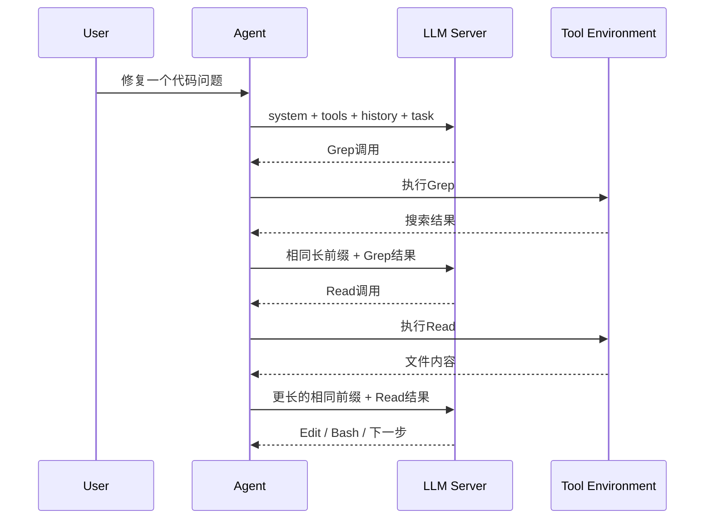
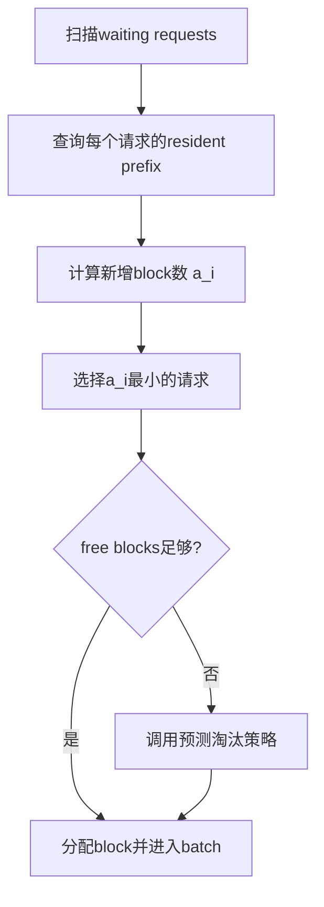
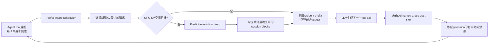

> 版本说明：本文基于2026-06-15提交的arXiv v1论文《CacheWise: Understanding Workloads and Optimizing KVCache Management for Efficiently Serving LLM Coding Agents》、作者公开的CATraces仓库`181c435`以及`cachewise-project/vllm`的`cachewise`分支`16cc7d4`整理。论文只有v1，系统与公开代码都可能继续变化。文中性能数字来自论文，本文没有本地复现2×H200实验。

## 1. 先说结论

CacheWise最重要的贡献不是又发明了一种KV Cache，而是指出：

**Coding agent不能再按一串互不相关的LLM请求来调度，它是一个由LLM调用和工具执行交替组成的长生命周期闭环会话。KV Cache管理的目标应该从“当前请求尽快完成”，转向“让整条agent会话少做重复prefill、尽快完成”。**

普通vLLM式策略通常做两件事：

1. waiting queue按FCFS取请求。
2. 显存不足时按LRU淘汰当前没有引用的KV block。

这两种策略都只看请求或历史，不看未来。Coding agent恰好提供了两类可利用的信号：

1. **prefix residency**：某个waiting请求有多少前缀KV已经在GPU上。
2. **tool metadata**：会话正在执行`grep`、`pytest`还是`docker build`，其参数是什么，已经跑了多久。

CacheWise据此组合两项机制：

1. **Prefix-aware scheduling**：优先调度还需要分配最少新KV block的请求，减少为了接纳它而挤掉其他会话缓存的概率。
2. **Predictive eviction**：不再淘汰“过去最久没访问”的block，而是优先淘汰“预计距离下一次复用最远”的会话block。

论文在2×H200、Qwen2.5-Coder-32B-Instruct和真实Claude Code trace回放上报告：

| 指标 | CacheWise相对vLLM / InferCept的论文结果 |
|---|---|
| 高负载会话完成时间 | 降低2.7-3.5倍 |
| Token goodput | 提升1.64-2倍 |
| 请求吞吐 | 提升1.5-2倍 |
| KV block淘汰数 | 降低2-2.6倍 |
| KV数据搬运量 | 降低约2-2.6倍 |
| CPU offload场景会话完成时间 | 降低约1.19倍 |
| Prefix-aware scheduling单独贡献 | `N=30/40`时goodput提升约1.38-1.7倍 |
| Predictive eviction单独贡献 | goodput提升1.2-1.6倍，会话完成时间降低约1.7-2倍 |

这些数字必须带着三个限定条件理解：

1. `N <= 10`、KV Cache没有明显竞争时，各系统几乎一样。
2. CacheWise会让缺少可复用历史的新请求等待更久，因此高负载下P99请求延迟反而更差。
3. 论文的“session completion time”只累计LLM请求延迟，排除了工具执行时间；它不是用户墙钟时间。

一句话概括：

**CacheWise用“当前能复用多少”决定先服务谁，用“多久以后才会再用”决定先淘汰谁。**

## 2. 为什么coding agent不是普通聊天负载

### 2.1 一次用户任务会展开成很多LLM请求

聊天通常是：

```text
用户问题 -> LLM回答 -> 用户思考 -> 下一轮
```

Coding agent通常是：

```text
用户任务
  -> LLM决定搜索文件
  -> Grep执行并返回结果
  -> LLM决定读取文件
  -> Read执行并返回内容
  -> LLM修改代码
  -> Edit执行并返回结果
  -> LLM决定运行测试
  -> Bash/pytest执行并返回结果
  -> LLM分析失败并继续修改
  -> ...
  -> 任务完成
```



每次工具返回都会自动触发下一次LLM请求。论文在CATraces中观察到，在中位数位置，工具完成触发的请求比用户直接触发的请求多约20倍。这意味着系统大部分时间运行在闭环里，没有人盯着单次TTFT。

因此评价目标发生变化：

| 普通在线聊天常用指标 | Coding agent更关心的指标 |
|---|---|
| 单请求TTFT | 整个会话完成时间 |
| 单请求TBT / ITL | 每单位时间推进多少有效agent步骤 |
| 请求吞吐 | Token goodput与任务吞吐 |
| 单轮P99 | 闭环关键路径是否反复重算 |

这不代表TTFT和P99突然不重要，而是说它们不足以表达agent工作负载。一个调度器可以让每个请求看起来都“公平”，却因为频繁破坏长前缀而让整个任务慢几倍。

### 2.2 每一轮都复用并扩展同一个长前缀

设第`t`轮上下文为：

$$
P_t = [\text{system},\text{tools},\text{user task},\text{history}_{1:t}]
$$

工具返回新结果后，第`t+1`轮通常是：

$$
P_{t+1} = P_t \Vert [\text{tool result}_t]
$$

所以`P_t`是`P_{t+1}`的前缀。只要这段KV还在，下一轮只需prefill新增后缀；如果它被淘汰，就要重新计算或从CPU/SSD/远端搬回来。

论文报告CATraces的prefill/decode token比例约为聊天负载的21倍。直觉上很好理解：coding agent每轮输入携带越来越长的代码、工具结果和历史，模型输出往往只是短推理或下一个工具调用。

这让coding agent成为一种典型的“长输入、短输出、高频多轮、强前缀复用”负载。

### 2.3 会话很长，工具间隔又不规则

论文观察到CATraces中的会话时长中位数约36分钟，尾部超过2.6小时。会话越久，上下文越大，同时驻留的长会话越多，GPU KV working set越容易超过显存容量。

更麻烦的是，相邻两次LLM请求之间不是固定think time，而取决于工具：

```text
Grep("pattern")                  -> 通常很快
Read("small_file.py")            -> 通常很快
pytest tests/client -xvs          -> 可能几十秒到几分钟
docker compose build             -> 可能更久
WebFetch(url)                     -> 受网络影响，长尾明显
```

论文给出的Bash参数聚类示例很直观：

| 命令模式 | P50 | P90 | P99 | 样本数 |
|---|---:|---:|---:|---:|
| `python -c`单行脚本 | 0.1s | 0.2s | 0.4s | 9 |
| `mypy`类型检查 | 10s | 56s | 182s | 46 |
| `docker compose`构建 | 22s | 89s | 152s | 30 |
| `git add/status`等操作 | 0.1s | 34s | 97s | 34 |

因此，“30秒没访问过”的两个会话并不等价：

1. 一个可能刚完成测试，马上会发下一次请求。
2. 另一个可能仍在跑大型构建，短时间内不会复用KV。

LRU看不到这个区别。

## 3. CATraces到底是什么

论文首先补了一个数据空白：此前常用数据集要么是聊天trace，要么是合成agent任务，要么没有真实工具执行和交互式会话。

CATraces来自研究者使用Claude Code处理真实开源项目的匿名化记录，包含：

1. 用户指令和模型输出。
2. 工具调用、参数与结果。
3. 每条消息的token统计和时间戳。
4. 人类介入与会话边界信息。

论文表1列出的总规模约为1000万tokens。当前公开仓库`181c435`的manifest进一步显示：

| 项目 | 公开manifest数据 |
|---|---:|
| 会话条目 | 94 |
| 非空会话 | 81 |
| 项目ID | 11 |
| LLM调用 | 20,634 |
| 工具调用 | 11,617 |
| 单会话最多LLM调用 | 1,799 |
| 单会话最多工具调用 | 961 |

这组数据的价值是“真实闭环结构”，但不能把它当成所有coding agent的总体分布：

1. 数据来自一个研究实验室内自愿参与者，不是跨组织生产流量。
2. 客户端是Claude Code，其他agent的prompt组织、压缩策略和工具集合可能不同。
3. 任务集中在开源软件研发，未必代表企业私有仓库、GUI agent或数据分析agent。
4. 公开trace经过脱敏。仓库README明确提醒：工具参数被脱敏后，用公开数据重训TF-IDF聚类可能达不到未脱敏trace的准确率。
5. 论文用80%会话训练预测器、20%回放评测；相似用户和项目模式可能帮助预测，跨组织泛化能力没有充分验证。

所以这篇论文最坚实的部分是工作负载形态和系统机制，具体倍数仍需在自己的agent流量上重测。

## 4. KV Cache压力如何形式化

先定义GPU上可用于KV Cache的总block容量为`M`。时刻`t`有一组活跃会话：

$$
\mathcal{S}_t = \{S_1,S_2,\ldots\}
$$

会话`S_i`完整上下文需要`d_i`个KV block，其中当前仍驻留GPU的有`k_i(t)`个。论文把总需求working set写成：

$$
W(t)=\sum_{i \in \mathcal{S}_t} d_i
$$

当`S_i`的新请求到达时，还需新增：

$$
a_i(t)=d_i-k_i(t)
$$

个block。

若：

$$
W(t)+a_i(t) \le M
$$

系统可以直接接纳请求；若超过`M`，就必须淘汰其他会话的block。严格说，论文这里把完整会话需求和实际resident working set的记号混在了一起；工程判断更直接：**当前free blocks是否足以覆盖`a_i(t)`，不足部分就必须通过淘汰获得。**

这组符号揭示了两个独立决策：

1. 调度：waiting请求里先选择哪个`a_i(t)`。
2. 淘汰：需要腾空间时，选择哪个会话的resident block。

CacheWise正好分别优化这两点。

## 5. 为什么FCFS会造成KV Cache抖动

假设GPU最多容纳100个block，现在有三个waiting请求：

| 会话 | 完整上下文`d_i` | GPU已有`k_i` | 新增需求`a_i=d_i-k_i` |
|---|---:|---:|---:|
| A | 70 | 64 | 6 |
| B | 50 | 8 | 42 |
| C | 60 | 52 | 8 |

GPU当前只剩10个free blocks。

如果FCFS队头是B：

1. B需要42个新block。
2. 系统还要淘汰至少32个已有block。
3. 被淘汰的很可能来自A和C。
4. A或C下一轮到达时又要重算刚被淘汰的长前缀。

如果先运行A：

1. 只需6个新block，不必淘汰。
2. A完成这一轮后，一部分临时资源可释放。
3. 再运行只需8个block的C。
4. 系统延后B，却让更多有效工作在不破坏缓存的情况下完成。

FCFS的问题不是顺序“错了”，而是它完全忽略每个请求会给KV working set带来多大增量。多条长会话交错进入时，会出现类似虚拟内存thrashing的现象：系统不断驱逐、重算或搬运相同前缀，GPU做了很多计算，却没有产生新的有效token。

## 6. 机制一：Prefix-aware Request Scheduling

CacheWise每轮从waiting请求中选择：

$$
i^*=\arg\min_i a_i(t)
$$

也就是优先选择需要最少额外KV block的请求。等价地，在请求总长度接近时，可以理解为优先选择GPU resident prefix最长的请求。



它同时带来两个效果：

1. **缓存效果**：尽量不为了一个冷请求破坏很多热前缀。
2. **排队效果**：`a_i`也近似该请求当前需要做的prefill工作量，因此有点像Shortest Job First，可以更快完成更多短增量请求。

论文强调，prefix-aware scheduling不是CacheWise首创。SGLang等系统已经探索过类似思路。CacheWise的贡献是用真实coding agent trace证明：在长生命周期、强前缀复用的闭环负载中，它尤其重要，并把它与预测淘汰联合起来。

### 6.1 它为什么会伤害P99

如果一个新会话没有任何resident prefix，它的`a_i`通常最大。只要队列里不断有老会话回来，新会话就可能持续被插队。

论文结果也显示：

1. CacheWise的P50请求延迟可比基线低13-14倍。
2. 但高负载下P99请求延迟更高。

这不是测量噪声，而是策略的直接代价。论文认为闭环agent应优先优化session completion time，因此接受这个交换。

生产系统不能照搬这一假设。至少要考虑：

1. 用户正在等待的首轮请求是否要设更高优先级。
2. waiting age是否要加入score，避免starvation。
3. 是否限制连续插队次数。
4. 交互式会话、后台agent、批处理agent是否要分队列。
5. SLO是单请求P99还是任务完工时间。

论文没有系统评估公平性约束，这是落地时最需要补的一层。

## 7. 机制二：Predictive KVCache Eviction

### 7.1 从LRU转向近似Belady

定义`tau_i(t)`为会话`S_i`从当前时刻到下一次复用KV的时间。

如果知道未来，理想策略是优先淘汰：

$$
j^*=\arg\max_j \tau_j(t)
$$

也就是最晚才会再访问的缓存。这对应经典Belady思想。

LRU用“上次访问距今多久”猜未来；CacheWise用“正在执行什么工具、参数是什么、已经执行多久”估计未来。

注意，CacheWise不需要把每个工具的完成时间预测到毫秒级。淘汰只需要一个相对排序：

```text
会话A：预计2秒后复用
会话B：预计40秒后复用
会话C：预计8秒后复用

需要淘汰时优先选择B。
```

只要能较稳定地找出“最晚回来”的候选，策略就可能接近oracle。

### 7.2 为什么不能只用工具名均值

同一个`Bash`工具可以是：

```text
git status
mypy src/
pytest tests/ -x
docker compose build
```

它们的时延分布完全不同。CacheWise因此把预测拆成：

1. 按`tool_name`分组。
2. 把`tool_args`转换为最多5000维的TF-IDF向量。
3. 用KMeans按参数语义模式聚类。
4. 为每个cluster维护历史工具时长分布。
5. 在线根据新工具参数找到最近cluster。
6. 结合已经过去的执行时间，估计剩余时间。

这里不需要大模型，也没有复杂在线训练。TF-IDF、KMeans和经验分布足够轻量，符合调度关键路径的成本要求。

### 7.3 “已经执行多久”为什么重要

假设某类测试历史时长为：

```text
8s, 10s, 12s, 60s, 90s
```

刚开始执行时，均值约36秒。但如果它已经跑了20秒，前三个短样本已经不可能，条件分布只剩60秒和90秒。此时不能继续用无条件均值。

设工具总执行时间为`T`，已经过去`t`，预测器关心：

$$
E[T-t \mid T>t]
$$

若用生存函数：

$$
S(x)=P(T>x)
$$

则期望剩余时间可以写成：

$$
E[T-t \mid T>t]
=\frac{1}{S(t)}\int_t^\infty S(x)\,dx
$$

公开predictor代码正是从每个cluster的`prob_still_running`经验曲线做插值和梯形积分，得到这个条件期望。

这也解释了为何优先级会随时间变化：工具刚启动时可能预计很久；执行到其历史长尾后，剩余时间估计会重新变化。

### 7.4 为什么要周期性重建heap

KV block进入eviction heap时，预测值是当时计算的。随着工具继续执行，旧值会过期。

CacheWise每隔`N_rebuild`个engine iteration重新预测所有无引用block并重建heap。论文实验设置：

$$
N_{rebuild}=3
$$

这是典型的精度与CPU开销交换：

1. 更频繁：排序更新，CPU成本更高。
2. 更稀疏：heap里保留陈旧预测，可能淘汰错对象。

同一会话的多个block共享相同metadata和预测，不需要逐block运行一次模型。block仍是vLLM的物理管理粒度，但预测的语义粒度是session。

## 8. 两种机制怎样协同

调度与淘汰不是同一个问题：

1. Prefix-aware scheduling减少“现在需要腾多少空间”。
2. Predictive eviction减少“腾出的空间多久后又会被要回来”。



论文消融实验验证两者可以独立贡献：

| 消融 | 结果 |
|---|---|
| 只给vLLM / InferCept加prefix-aware scheduling | `N=30`时goodput提升约1.38-1.64倍，`N=40`时约1.6-1.7倍 |
| 同上，会话完成时间 | `N=30`降低约1.8-2.35倍，`N=40`降低约1.85-2.66倍 |
| 固定prefix-aware，再加入预测淘汰 | goodput再提升1.2-1.6倍，会话完成时间再降低约1.7-2倍 |

这说明预测器不是所有收益的来源。即使没有历史数据，先做prefix-aware scheduling也可能拿到相当一部分收益。

## 9. vLLM实现路径

论文称CacheWise在vLLM上约实现了2500行Python，修改两个关键位置：

1. Batch scheduler：改变waiting请求选择顺序。
2. KVCache block manager：为block保留session/tool metadata，并用预测优先级代替LRU淘汰顺序。

论文描述的数据路径是：

```text
请求结束
  -> block ref_cnt降到0
  -> block仍保留session + tool metadata
  -> predictor计算expected time-to-reuse
  -> block按预测值进入eviction heap

显存需要新block
  -> 从heap选择最晚复用的候选
  -> 清除其prefix hash / 回收block
  -> 分配给当前请求
```

它不要求修改coding agent内部控制循环。服务端可以从请求和tool call相关metadata解析所需信号，因此比把agent runtime与推理引擎绑在一起的系统更容易接入不同客户端。

### 9.1 公开vLLM分支能验证什么

作者组织公开了`cachewise-project/vllm`，`cachewise`分支`16cc7d4`能看到：

1. `prioritize_waiting_by_prefix_cache`配置。
2. 扫描waiting queue、按本地加外部prefix match选请求的实现。
3. `enable_cachewise_free_heap`配置。
4. KV block上的`cachewise_policy`metadata。
5. free block heap、prefix-aware scheduler对应测试。

但这个公开revision不能被直接当成论文完整可复现实物。最明显的是`cachewise_policy.py`：

1. `oracle.ground_truth_idle_s`路径可以读取真实空闲时间。
2. 普通`next_tool`路径没有调用公开的TF-IDF预测器，而是对`tool name + args`取Python hash作为score。

哈希只能稳定地把不同参数映射成任意顺序，不能预测工具剩余时间。公开CATraces仓库里确实另有TF-IDF、MiniBatchKMeans和生存曲线推断代码，但在上述vLLM revision里看不到完整接线。

因此更严谨的结论是：

**论文机制和评测描述是完整的，公开仓库也提供了trace、预测器与部分vLLM集成代码，但截至本文核查的revision，无法仅按README一键复现论文端到端CacheWise结果。**

这不否定论文结果，但降低了外部验证强度。后续应关注作者是否发布固定benchmark脚本、模型配置、完整predictor integration与实验commit。

## 10. 实验设计与结果怎么读

### 10.1 Testbed

论文实验环境：

| 项目 | 配置 |
|---|---|
| GPU | 2×NVIDIA H200，合计282GB显存 |
| CPU | AMD EPYC 9534，64 cores |
| 并行 | Tensor Parallelism = 2 |
| 模型 | Qwen2.5-Coder-32B-Instruct |
| Prefill | 开启chunked prefill，每chunk最多512 tokens |
| 工作负载 | CATraces真实多轮会话确定性回放 |
| 训练/评测 | 随机80%会话训练预测器，剩余20%实验 |
| 负载 | 同时启动`N`个独立coding agent会话直到全部完成 |

人类长时间idle被视为session boundary。恢复后的会话仍带有较长历史，因此会产生较大prefill；系统会先淘汰人类idle会话，再考虑因工具执行而暂时inactive的会话。

### 10.2 Baselines

1. **vLLM**：FCFS + block-level LRU。
2. **InferCept**：FCFS + 根据会话近期工具时长moving average做预测淘汰。
3. **CacheWise\***：使用trace中的ground-truth工具时长，相当于oracle eviction。
4. **vLLM(Prefix-aware)**和**InferCept(Prefix-aware)**：用来隔离调度收益。

论文没有直接运行SGLang对比，理由是SGLang已有prefix-aware scheduling，而消融覆盖了这一能力。但“加入相似调度策略的vLLM”不能完全替代与真实SGLang端到端对比，因为两者的radix cache、调度器和执行路径并不相同。

### 10.3 指标定义

Token goodput不是模型处理的所有token速率，而是排除重复计算和KV movement后，每秒完成的有用新token。这个定义比raw throughput更适合看cache thrashing。

论文的session completion time定义为一个会话内所有LLM request latency之和：

$$
T_{session}^{paper}=\sum_{r \in session} T_{LLM}(r)
$$

不包含工具执行：

$$
T_{wall}=T_{session}^{paper}+\sum T_{tool}+T_{client/queue/other}
$$

所以“3.5倍会话完成时间提升”不能直接翻译成用户端墙钟时间也提升3.5倍。如果任务大部分时间都在跑测试或等待网络，服务端优化在总时间里的比例会变小。

### 10.4 端到端结果

低负载`N <= 10`时，KV显存足够，各系统结果相近。这是合理且重要的负结果：CacheWise只在working set超过GPU KV容量、开始淘汰时创造价值。

高负载`N > 10`时：

1. 会话完成时间相对vLLM和InferCept降低2.7-3.5倍。
2. Token goodput提升1.64-2倍。
3. 请求吞吐提升1.5-2倍。
4. 淘汰block数降低2-2.6倍。
5. P50请求延迟降低13-14倍，但P99变差。

CacheWise接近使用真实未来工具时长的CacheWise\*。少数配置下甚至略胜oracle，论文解释为不同淘汰选择会改变随后prefix-aware调度的可选顺序，因此“局部最优淘汰”不一定对应相同的全局调度轨迹。这也提醒我们：调度和缓存联合系统里，oracle定义本身要谨慎。

### 10.5 Offload结果

如果淘汰意味着重新prefill长前缀，单次错误淘汰代价很高，所以CacheWise提升大。

论文还测试了真正把KV从GPU搬到CPU DRAM、需要时再经PCIe搬回的场景。在`N=30`时，CacheWise会话完成时间只比vLLM低约1.19倍。

原因不是策略失效，而是每次错误淘汰的罚金变小：

```text
重新prefill长上下文：昂贵GPU计算
PCIe swap-in长上下文：仍有代价，但通常比重算快
```

因此分层存储与CacheWise是互补关系，但offload越快，预测淘汰的性能上限越低。

### 10.6 Predictor粒度

论文比较：

1. 所有工具共用一个global mean。
2. 只按tool name分布。
3. 按参数聚类为C20、C50、C100。
4. 使用ground-truth时长的Hint。

从point estimate增加到C100，淘汰数和会话完成时间持续改善；C100最多进一步改善约19%的会话完成时间。超过100后数据不足以产生更多有效cluster。

这说明参数确实携带信息，但也暴露样本效率问题：不同仓库、命令、测试框架的长尾非常大，小cluster估计容易不稳定。公开训练代码甚至设置每cluster目标至少约30个样本，并对部分异常值做过滤，这些选择都可能影响线上泛化。

### 10.7 CPU调度开销

CacheWise需要扫描prefix、运行预测、维护heap，因此CPU scheduling overhead是vLLM的约2.4-3倍。

在`N=40`时，论文报告：

| 项目 | vLLM | CacheWise |
|---|---:|---:|
| CPU scheduling | 0.33s | 0.99s |
| GPU model execution | 16.6s | 11.2s |

CPU多花0.66秒，GPU少花5.4秒，净收益约4.7秒/请求。调度占总请求时间从约6%升到约9%。

这在论文硬件和32B模型上成立。换成更小模型、更快GPU或更长waiting queue后，O(n)扫描与heap重建可能更显眼，需要重新评估。

## 11. 这篇论文最值得肯定的地方

### 11.1 先测工作负载，再设计策略

论文的设计链路非常清楚：

```text
工具触发请求占主导
  -> 指标改为session completion

上下文持续增长、前缀高度复用
  -> prefix-aware scheduling

工具间隔长尾但metadata有结构
  -> predictive eviction
```

它没有先提出复杂系统再寻找场景，而是让每个机制对应一个测量观察。

### 11.2 预测目标选得足够小

CacheWise不预测任务是否成功、不理解代码语义，也不预测精确完成时刻。它只需要给候选会话排一个“谁最晚回来”的相对顺序。

这是一个很实用的系统设计原则：**只预测决策真正需要的量。** 目标越小，模型越轻，越容易放进调度热路径。

### 11.3 不要求绑定agent框架

一些agent serving系统要求用特定编程抽象表达整个workflow。CacheWise把优化放在推理节点，只依赖请求前缀和工具metadata，更容易服务Claude Code、IDE插件或其他客户端。

### 11.4 把缓存、调度与session目标连接起来

传统prefix cache常被当成一个命中率优化；CacheWise说明命中率不是孤立指标。调度顺序会改变resident set，resident set会改变淘汰，淘汰又会改变下一轮调度成本。真正的目标是闭环任务推进速度。

## 12. 局限与未回答的问题

### 12.1 数据集代表性有限

94个会话条目、11个项目对首次公开研究很有价值，但不足以覆盖企业级多租户coding agent。不同组织的CI、仓库规模、网络环境、工具权限和agent压缩策略都会改变分布。

### 12.2 Distribution drift只被提到，没有实测

论文建议定期用近期trace重训，但没有回答：

1. 新仓库冷启动需要多少样本。
2. 工具版本升级后多久失效。
3. 新命令落不到已有cluster时如何降级。
4. 错误预测最坏会损失多少。
5. 是否需要用户级、项目级或全局模型。

### 12.3 公平性和SLO不完整

P99已经显示新请求可能被推迟，但论文没有给出max wait、starvation rate或tenant fairness。共享服务不可能只优化平均session completion。

### 12.4 单节点实验不能证明集群调度收益

论文假设prefix-aware load balancer会让同一session落到同一节点，然后CacheWise在节点内工作。现实中还有：

1. 节点扩缩容和故障。
2. 多副本间session迁移。
3. 路由负载均衡与prefix affinity冲突。
4. 跨节点KV传输成本。
5. 不同模型、LoRA和tenant namespace隔离。

节点内最优策略不一定等于集群全局最优。

### 12.5 对比系统仍不够全面

没有直接对比SGLang，也没有与完整LMCache/Mooncake分层缓存组合做大规模实验。论文的CPU offload实验验证了互补性，但覆盖面有限。

### 12.6 只评估一个32B模型和一类硬件

KV压力取决于模型结构、GQA/MQA/MLA、KV dtype、block size和GPU容量。大显存H200上的竞争阈值不能直接外推到A100、L40S或不同KV量化配置。

### 12.7 公开artifact尚未形成闭环复现

Trace和predictor公开是加分项，但论文所述完整vLLM集成、固定实验配置与一键benchmark仍不够清晰。尤其公开vLLM分支普通tool hint仍使用hash score，需要作者澄清评测代码对应关系。

## 13. 工程上什么时候值得采用

适合优先尝试CacheWise思路的场景：

1. 同一agent会话会产生几十到上千次LLM调用。
2. 每轮上下文大部分是上一轮前缀。
3. 多个长会话并发，GPU经常发生prefix block eviction。
4. Prefill计算或KV搬运已经占据明显GPU时间。
5. 工具名称和参数能预测大致执行时长。
6. 业务更关心任务完工时间，而不是每个请求严格FCFS。

不必急着上的场景：

1. 低并发，KV working set长期小于显存容量。
2. 单轮或少轮请求，几乎没有session prefix reuse。
3. 工具执行时间完全被外部随机因素支配。
4. 强交互SLO要求新请求不能被老会话插队。
5. 高速KV offload已经把错误淘汰成本压得很低。

推荐按收益风险从低到高分三步落地：

```text
第一步：只观测
  记录session_id、resident prefix、eviction、recompute、tool latency

第二步：只做prefix-aware scheduling
  不训练预测器，加入aging保护，验证goodput和公平性

第三步：加入predictive eviction
  先按tool name经验分布，再评估参数聚类是否有额外收益
```

这样可以先拿到论文消融中已经很可观的调度收益，也能避免在没有本地数据时直接引入错误预测。

## 14. 总结

CacheWise对LLM serving最有价值的提醒是：应用形态变了，调度单位也应该变化。

Coding agent的一次任务不是一个request，而是一条长时间运行的闭环session；它反复复用并扩展同一个上下文前缀。FCFS会把多个会话交错到GPU上，放大active working set；LRU只看过去，无法判断哪个工具马上返回。两者组合后，很容易让KV Cache在长会话之间反复抖动。

CacheWise的答案很克制：

1. 用resident prefix决定先服务谁。
2. 用工具metadata和已执行时间预测谁最晚回来。
3. 用session completion time和token goodput评价系统，而不是只看单请求TTFT。

它的实验结果说明，在真正发生KV显存竞争时，减少错误淘汰可以带来数量级可见的会话收益；同时它也诚实暴露了代价：P99、公平性、预测漂移、CPU调度成本和公开复现完整度。

因此正确的工程结论不是“把LRU全部换成机器学习”，而是：

**先识别应用可提供的未来信号，再用最轻量的预测把它变成缓存优先级；如果没有显存竞争或没有可靠信号，就保持简单。**

## 参考

1. [CacheWise论文：arXiv:2606.16824](https://arxiv.org/abs/2606.16824)
2. [CacheWise论文PDF](https://arxiv.org/pdf/2606.16824)
3. [CATraces公开数据与分析代码](https://github.com/cachewise-project/cachewise-coding-traces)
4. [CacheWise作者组织的vLLM fork](https://github.com/cachewise-project/vllm/tree/cachewise)
5. [vLLM Automatic Prefix Caching文档](https://docs.vllm.ai/en/latest/design/v1/prefix_caching/)
6. [SGLang论文：Efficient Execution of Structured Language Model Programs](https://arxiv.org/abs/2312.07104)
7. [InferCept论文](https://proceedings.mlr.press/v235/abhyankar24a.html)
8. [LMCache项目](https://github.com/LMCache/LMCache)
