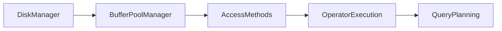
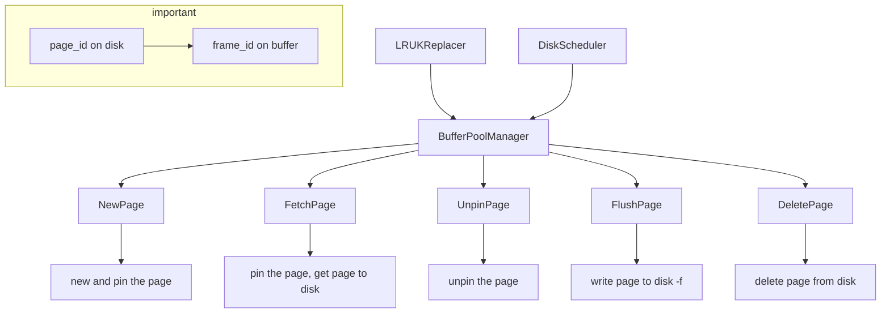

# 课程笔记

## Overview

- algebra
- vector database for ai
- relational languages
  - dml/ddl/dcl

## SQL

- aggregates/group by/having
- string operations/date operations/output redirection
- window functions(over/partition by)
- nested queries
- lateral join
- common table expressions(with as)
- union/intersect/except

## Database storage

- outline



- volatile(bytes addressable) / non-volatile(block)
- sequential / random access
- why not use os(mmap, Virtual memory)?

### Three storage approaches

- heap file --metadata track--> page(with header) -> tuple
- tuple oriented storage
  - slotted pages/record ids
  - denormalized(pre-join) tuple data
- log structured storage(good for write-heavy workloads)
  - coalesce
  - sorted string tables
- index organized Storage
  - can be sorted and using binary search

### Inside tuple

- word-aligned tuples
- variable precision numbers/fixed precision numbers
- null data types(bitmap/special value)
- large data

## Storage models / Compression

- oltp/olap/hybrid(htap)
- row is for oltp/col is for olap

### three storage models

- n-ary storage model/decomposition storage model/hybrid storage model(pax)
- DSM: how to merge a complete tuple(dictionary compression)
- partition attributes across(pax)

### database compression

- block level
  - general-purpose algorithm(zstd)
- tuple-level
- attribute-level
- column-level
  - run-length encoding
  - bit packing
  - bitmap encoding
  - delta encoding
  - dictionary compression

## Database memory

- locks/latches
- buffer pool optimization
  - multiple buffer pools
  - pre fetching
  - scan sharing
  - buffer pool bypass
- lru/lru-k/mysql approximate lru-k
- fsync errors(there is a page cache between file disk and file system), so use direct IO

## Hash tables

- hash function/hash collision

### hash function

- facebook xxhash3/google farmhash

### static hashing schemes

- probe hashing/cuckoo hashing

### dynamic hashing schemes

- chained hashing
- bloom filters(false positives sometimes occur, tell you a key is exists maybe wrong)
- extendible hashing
- linear hashing

## B+ tree

- B+Tree has a better concurrency access than B tree
- selection conditions/duplicate keys
- clusted b+ tree

### design choices

- node size
- merge threshold
- variable length keys
- intra node search

### optimization

- prefix compression/suffix truncation
- deduplication
- pointer swizzling
- bulk insert
- write optimized b+ tree(delay update)

## Index concurrency control

- test and set spinlock(atomic)/blocking os mutex(mutex)/reader writer locks(shared_mutex)

### hash table latching

- page latches/slot latches

### b+tree latching

# 项目思路

## 项目准备

- 判分：

[gradescope](https://www.gradescope.com): KK5DVJ

- 讨论：

https://discord.gg/YF7dMCg

- 使用clang：

```cmake
set(CMAKE_C_COMPILER "/usr/bin/clang")
set(CMAKE_CXX_COMPILER "/usr/bin/clang++")
```

~~nmd这玩意儿要写在project后面谁跟我说要写在前面的？？~~

这玩意儿放的位置很迷

## P0. C++ Primer

### Think basic

- what is a trie? https://zhuanlan.zhihu.com/p/28891541
- what is copy on write? 即修改的时候再复制而不是直接复制：https://zh.wikipedia.org/zh-cn/%E5%AF%AB%E5%85%A5%E6%99%82%E8%A4%87%E8%A3%BD
- why copy on write? 每次修改都会产生一个新的trie，如果不能影响到原来的trie，需要尽量复用节点
- 智能指针可通过get获取原始指针，可用dynamic_cast判断派生类指针

### Task1

- Get: 找到后用dynamic_cast把指针改成指向TrieNodeWithValue
- Put: 所有经过的节点都需要克隆
- 因为Put是一个const函数，所以不能修改root!
- 所有sharedptr都是const TrieNode，只有uniqueptr是non-const的，That's why the return of Clone is unique!
- 所以本质就是non-const unique->const shared，因为shared是const
- why use unique? 如果是non-const shared，把它改了那所有的引用都改了
- 还要注意空字符串/root\_初始为nullptr!
- **map的insert方法不会自动替换相同的键的值！**要么用[]要么用insert_or_assign!!

### Task2

- 这时候就可以看到COW的好处了：读写共存(如果不考虑一致性)

### Task3

- 本来使用lldb调试的，不知道为什么无法显示继承类的定义，遂改成gdb调试

### Task4

- 利用transform实现大小写转换：

```cpp
std::transform(val.begin(), val.end(), std::back_inserter(result), ::tolower);
```

### Result

<p align="center">

</p>

## P1. Buffer Pool

### Task1

- LRU-k
  - 比较第前k次的访问时间
  - 如果访问次数未超过k次，则认为时间为+inf
  - 如果有多个+inf，则按照LRU的方式比较(比较最早的那次访问)
  - 相当于访问次数未超过k次的不计入缓存
  - 这样即考虑了访问频次又考虑了访问时间

### Task2

- 实现DiskScheduler，创建后台线程负责处理所有的IO请求

### Task3

- 结合替换算法/IO处理，实现缓存管理器，整理逻辑如下：



- 注意多线程，两个fetch同一个frame的情况，pincount相当于引用计数
- unpinpage时如果找到页就将其设为是否可替换（注意isdirty的true->false这种情况不存在，如果原来是脏页不能直接变成false）
- page的读写锁不是必需的(不会在pin住page的情况下修改page中内容)，在一把大锁保平安的基础上
- **别把必要的函数放到assert里面！！！**

### 优化

- 如果是顺序扫描，则尽量不替换顺序的page
- 并行化IO，需要保证IO操作的顺序，未实现

### Result

<p align="center">
    
</p>

## P2. Hash Table

其实可以直接奔着task3去做，很多辅助函数暂时用不到，或者等重构的时候再实现，此project的目标就是实现find/insert/delete三个接口

### Task1

- 用pageguard封装page，负责其latch/pincount的释放
- 细分为writepageguard和readpageguard，分别对应写锁和读锁
- 注意unpinpage其实传入的dirty是guard自身的dirty成员数据
- 接收that的移动时，**需要先释放自己的page**

### Task2

- 实现各种Page的定义
- 使用INVALID_PAGE_ID来标记页的不存在
- 定义bucket的remove时，注意如果remove的是最后一个元素则直接减size即可

### Task3

- 实现完整的ExtendibleHash，前两task的实现就是为此服务的
- 注意到三种Page的实现中都删除了构造函数，因为使用reinterpret_cast转换指针后无法调用构造函数
- local depth 的作用是指示directory中有几个指向了bucket: $2^{(global - local)}$ 
- 注意split bucket并重新分配后，新插入仍有可能overflow，此时继续split
- increase global后复制以前的一半到新的一半
- 进行位操作时注意类型保持uint32，同时注意无符号类型倒序遍历时当i=0后再减一会溢出
- uint32 类型的数据右移32位会导致数据没有变化？(**如果移动位数超过类型位数，会自动取余**)
- shrink时注意如果两个bucket都为空，那就继续shrink
