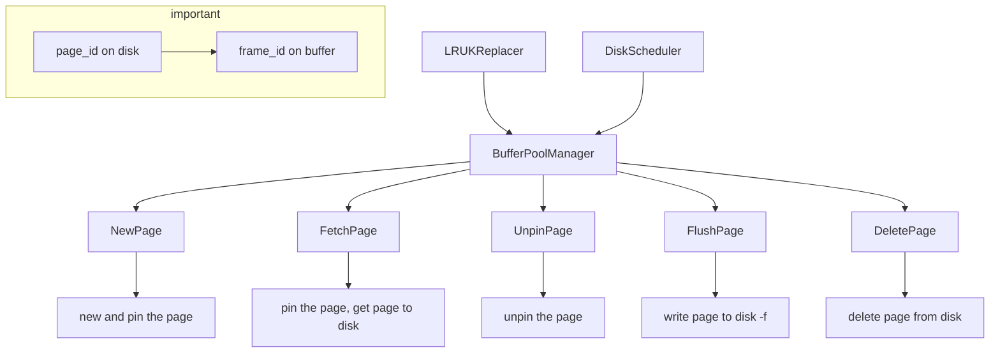

# 课程笔记

## Overview

- algebra
- vector database for ai
- relational languages
  - dml/ddl/dcl

## SQL

- aggregates/group by/having
- string operations/date operations/output redirection
- window functions(over/partition by)
- nested queries
- lateral join
- common table expressions(with as)
- union/intersect/except

## Database storage

- outline


- volatile(bytes addressable) / non-volatile(block)
- sequential / random access
- why not use os(mmap, Virtual memory)?

### Three storage approaches

- heap file --metadata track--> page(with header) -> tuple
- tuple oriented storage
  - slotted pages/record ids
  - denormalized(pre-join) tuple data
- log structured storage(good for write-heavy workloads)
  - coalesce
  - sorted string tables
- index organized Storage
  - can be sorted and using binary search

### Inside tuple

- word-aligned tuples
- variable precision numbers/fixed precision numbers
- null data types(bitmap/special value)
- large data

## Storage models / Compression

- oltp/olap/hybrid(htap)
- row is for oltp/col is for olap

### three storage models

- n-ary storage model/decomposition storage model/hybrid storage model(pax)
- DSM: how to merge a complete tuple(dictionary compression)
- partition attributes across(pax)

### database compression

- block level
  - general-purpose algorithm(zstd)
- tuple-level
- attribute-level
- column-level
  - run-length encoding
  - bit packing
  - bitmap encoding
  - delta encoding
  - dictionary compression

## Database memory

- locks/latches
- buffer pool optimization
  - multiple buffer pools
  - pre fetching
  - scan sharing
  - buffer pool bypass
- lru/lru-k/mysql approximate lru-k
- fsync errors(there is a page cache between file disk and file system), so use direct IO

## Hash tables

- hash function/hash collision

### hash function

- facebook xxhash3/google farmhash

### static hashing schemes

- probe hashing/cuckoo hashing

### dynamic hashing schemes

- chained hashing
- bloom filters(false positives sometimes occur, tell you a key is exists maybe wrong)
- extendible hashing
- linear hashing

## B+ tree

- B+Tree has a better concurrency access than B tree
- selection conditions/duplicate keys
- clusted b+ tree

### design choices

- node size
- merge threshold
- variable length keys
- intra node search

### optimization

- prefix compression/suffix truncation
- deduplication
- pointer swizzling
- bulk insert
- write optimized b+ tree(delay update)

## Index concurrency control

- test and set spinlock(atomic)/blocking os mutex(mutex)/reader writer locks(shared_mutex)

### hash table latching

- page latches/slot latches

### b+tree latching

## Sorting / Aggregations

- in-memory sorting(quick sort)
- top-n heap sort/external merge sort(use three buffer pool page)
- general external merge sort
- double buffering(overlap cpu/io operations)
- using b+tree(cluster/uncluster) for sorting
- hashing for aggregations

## Join algorithm

- early/late materialization(record id)
- (block/index)nested loop join/sort merge join/hash join
- use smaller table as outer table
- partitioned hash join
- hybrid hash join

## Query Execution

### processing model

- iterator model
- materialization model
- vectorization model
- plan processing direction

### access methods

- sequential scan
  - zone maps
- index scan
- multi-index scan
- modification query
  - Halloween problem

### expression evaluation

- JIT compile

- scheduler
- parallel/distribute database
- process/thread/ per worker
- sql server
- embedded dbms
- intra query parallelism
- intra-operator parallelism(horizontal)
  - gather/distribute/repartition
- inter-operator parallelism(vertical)
- bushy parallelism
- io parallelism(RAID)

## Query planning/Optimization

- predicate pushdown
- replace Cartesian product
- projection pushdown
- hyperloglog

## Concurrency control

- ACID
- ensuring atomicity: logging/shadow paging
- ensuring isolation: pessimistic/optimistic
- dependency graph
- conflict serializable/view serializable

## 2Phase locking

- shared/exclusive lock
- strong 2pl(avoid cascading abort)
- deadlock detection/prevention
- waits-for graph
- deadlock handling: find victim/completely roll back/partial
- deadlock prevention: wait-die/wound-wait(using priority)
- lock granularity/hierarchy
- intention locks: is/ix/six

## Timestamp ordering concurrency control

- can't read from the future(rw)
- can't write if future has read/write(wr, ww)
- thomas write rule
- optimistic concurrency control
  - read Phase
  - validation Phase(three cases)
  - write Phase(serial commits/parallel commits)
- phantom problem(insert/delete)
  - re-execute scans
  - predicate locking
  - index locking
- isolation level
  - serializable
  - repeatable read(phantom read)
  - read committed(non-repeatable read/phantom read)
  - read uncommitted(dirty read/non-repeatable read/phantom read)

## Multi-version concurrency control

- read/write do not block each other
- when write, create a version/when read, read the newest version
- snapshot isolation(write skew anomaly)

### mvcc design decisions

- concurrency control protocol: timestamp/occ/2pl
- version storage:
  - append-only(old-new chain/new-old chain)
  - time-travel
  - delta
- garbage collection:
  - tuple level
  - transaction level
- index management
  - secondary indexes
  - logical pointers/physical pointers
  - duplicate key
- deletes
  - deleted flag
  - tombstone tuple

## Logging

- system failures: software / hardware
- steal policy/force policy
- shadow paging
- write-ahead log: steal + no force
- logging schemes: physical/logical/physiological
- checkpoints

## Recovery

- aries

# 项目思路

## 项目准备

- 判分：

[gradescope](https://www.gradescope.com): KK5DVJ

- 讨论：

https://discord.gg/YF7dMCg

- 使用clang：

```cmake
set(CMAKE_C_COMPILER "/usr/bin/clang")
set(CMAKE_CXX_COMPILER "/usr/bin/clang++")
```

~~nmd这玩意儿要写在project后面谁跟我说要写在前面的？？~~

这玩意儿放的位置很迷

## P0. C++ Primer

### Think basic

- what is a trie? https://zhuanlan.zhihu.com/p/28891541
- what is copy on write? 即修改的时候再复制而不是直接复制：https://zh.wikipedia.org/zh-cn/%E5%AF%AB%E5%85%A5%E6%99%82%E8%A4%87%E8%A3%BD
- why copy on write? 每次修改都会产生一个新的trie，如果不能影响到原来的trie，需要尽量复用节点
- 智能指针可通过get获取原始指针，可用dynamic_cast判断派生类指针

### Task1

- Get: 找到后用dynamic_cast把指针改成指向TrieNodeWithValue
- Put: 所有经过的节点都需要克隆
- 因为Put是一个const函数，所以不能修改root!
- 所有sharedptr都是const TrieNode，只有uniqueptr是non-const的，That's why the return of Clone is unique!
- 所以本质就是non-const unique->const shared，因为shared是const
- why use unique? 如果是non-const shared，把它改了那所有的引用都改了
- 还要注意空字符串/root\_初始为nullptr!
- **map的insert方法不会自动替换相同的键的值！**要么用[]要么用insert_or_assign!!

### Task2

- 这时候就可以看到COW的好处了：读写共存(如果不考虑一致性)

### Task3

- 本来使用lldb调试的，不知道为什么无法显示继承类的定义，遂改成gdb调试

### Task4

- 利用transform实现大小写转换：

```cpp
std::transform(val.begin(), val.end(), std::back_inserter(result), ::tolower);
```

### Result

<p align="center">

</p>

## P1. Buffer Pool

### Task1

- LRU-k
  - 比较第前k次的访问时间
  - 如果访问次数未超过k次，则认为时间为+inf
  - 如果有多个+inf，则按照LRU的方式比较(比较最早的那次访问)
  - 相当于访问次数未超过k次的不计入缓存
  - 这样即考虑了访问频次又考虑了访问时间

### Task2

- 实现DiskScheduler，创建后台线程负责处理所有的IO请求

### Task3

- 结合替换算法/IO处理，实现缓存管理器，整理逻辑如下：



- 注意多线程，两个fetch同一个frame的情况，pincount相当于引用计数
- unpinpage时如果找到页就将其设为是否可替换（注意isdirty的true->false这种情况不存在，如果原来是脏页不能直接变成false）
- page的读写锁不是必需的(不会在pin住page的情况下修改page中内容)，在一把大锁保平安的基础上
- **别把必要的函数放到assert里面！！！**

### 优化

- 如果是顺序扫描，则尽量不替换顺序的page（后一个page会被访问，前一个page不会被访问，从而可以调整替换策略）
- 并行化IO，需要保证IO操作的顺序，未实现
- 如果只锁一个mutex，优先用 unique lock 相对于 scoped lock

### Result

<p align="center">
    
</p>

## P2. Hash Table

其实可以直接奔着task3去做，很多辅助函数暂时用不到，或者等重构的时候再实现，此project的目标就是实现find/insert/delete三个接口

另外由于许多类都提前定义好了，需要额外关注下成员变量（比如page_guard别忘了dirty变量）

要求实现的是Extendible Hash，主要难点在于插入和删除

此数据结构的一些特点：

- 添加了一个header，通过most-significant bit来索引directory，而通过least-significant bit来索引bucket，添加header是为了提供更好的并发能力
- directory size 必定是2的幂次方
- local depth 的作用是指示directory中有几个指向了bucket: $2^{(global - local)}$
- local depth <= global depth
- 虽说是可扩容的，但仍无法超过最大限制，比如directory的max depth为4，如果第一个bucket满了，那么无法再插入最后4位为0000的数了

### Insert的几种Case（方括号表示local depth）：

- 正常Insert，返回
- bucket已满，需要扩容，Local depth必定增加：
- 初始情况这4个bucket_idx都指向同一个bucket，在110的位置插入并且overflow
  - 找到另一类新bucket的位置
    - 另一类bucket：比如depth为1时，所有的0都指向同一个bucket，当depth增长为2时，多出来的一位就可以进行区分（10/00）
  - 更新那一路的bucket（可能有多个）
  - 更新local depth/remap directory，重新分发bucket中的元素

```shell
00[0] -> 0[00] <-- new bucket idx
01[0] -> 0[10]
10[0] -> 1[00]
11[0] -> 1[10] <-- current bucket idx
```

- 需要增加global depth：
  - 复制前一半的元数据
  - 再进行bucket的remap和redistribute

```shell
[00] -> [000] <- current bucket idx
0[1] -> 00[1]
[10] -> 0[10]
1[1] -> 01[1]
     -> [100] <- new bucket idx
     -> 10[1]
     -> 1[10]
     -> 11[1]
```

注意重新分配后仍有可能无法插入，此时需要继续扩容（循环进行直到无法扩容或插入成功）

### Remove的case：

- 考虑删除后的shrink
- 不同于Insert，shrink~~只考虑global depth = local depth的情况~~(不能加这个限制条件，否则可能都是空桶但仍然无法shrink)
- why shrink: 当10指向的bucket为空时，就可以释放这个bucket并将此处索引映射到00的bucket，有两个位置指向同一个bucket，因此减小local depth
- 当且仅当所有local depth小于global depth时，才会进行shrink
- 不同于Insert，shrink减小global depth，不用再进行额外的元数据操作
- 存在多次shrink的情况，比如下图，如果01位置的bucket为空，当00的bucket为空并进行shrink后，此时需要继续shrink(another bucket is empty)

```shell
[00] -> 0[0] <-- bucket idx
0[1] -> 0[1] <-- another bucket
[10] -> 1[0]
1[1] -> 1[1]
```

### Task1

- 用pageguard封装page，负责其latch/pincount的释放
- 细分为writepageguard和readpageguard，分别对应写锁和读锁
- 注意unpinpage传入的dirty是guard自身的dirty成员数据
- 对于移动操作，**需要先释放自己的page**
- 不要忘记自身携带的dirty成员变量

### Task2

- 实现各种Page的定义
- 使用INVALID_PAGE_ID来标记页的不存在
- 定义bucket的remove时，注意如果remove的是最后一个元素则直接减size即可
- **cpp的类中成员变量默认值是随机的，不要忘记初始化**

### Task3

- 实现完整的ExtendibleHash，前两task的实现就是为此服务的
- 注意到三种Page的实现中都删除了构造函数，因为使用reinterpret_cast转换指针后无法调用构造函数
- 进行位操作时注意类型保持uint32，同时注意**无符号类型倒序遍历时当i=0后再减一会溢出**
- uint32 类型的数据右移32位会导致数据没有变化？(**如果移动位数超过类型位数，会自动取余**)

### 锁优化

- 得益于pageguard的实现，我们可以轻松进行锁优化

  - GetValue:

  ```mermaid
  flowchart LR
      a[rlock header] --> b[rlock directory] --> c[unlock header] --> d[rlock bucket] --> e[unlock directory] --> f[get value]
  ```

  - Insert:

  ```mermaid
  flowchart LR
      a[wlock header] --> b[wlock directory] --> c[unlock header] --> d[wlock bucket] --> g[insert value]
  ```

  - Remove:

  ```mermaid
  flowchart LR
      a[rlock header] --> b[wlock directory] --> c[unlock header] --> d[wlock bucket] --> g[remove value]
  ```

- ~~注意到header仅在insert时会进行修改（remove的shrink没有要求删掉directory），可以用bitmap记录是否有directory（锁仍是必需的，因为要保证bitmap操作的线程安全）~~ 因为仍要锁，实际并无增益
- 在判断插入无需grow或者删除shrink时，即可释放directory锁
- 刚开始对directory用读锁，如果发现directory需要修改，则用写锁重头来过（经过测试只对remove操作这样做，因为shrink发生的情况较少）

### Result

以上优化只是个人思路，实际实操并没有明显提升(qwq)

最终结果：

<p align="center">
    
</p>

## P3. Query Execution

有几个概念还是很抽象的：

- plan node，查询节点，包含expression用以构造tuple
- schema，生成tuple的列名
- executor，算子，通过next返回处理过的tuple
- catalog，存储数据库的元数据
- expression，通过evaluate返回Value

查询逻辑为：

- Parser，将sql语句解析为语法树
- Binder，根据语法树绑定为数据结构，这样才可以通过编程语言的方式进行控制
- Planner，生成查询节点（通过explain查看得到的
- Optimizer，根据规则优化查询节点
- Executor，执行查询

整个执行过程是iterator的（pull-based的火山模型）

优化器是从children开始优化的

实验中许多情况默认内存可以放下数据，这样代码更好写，否则就要考虑partitioned hash了

### Task1

- 优化器会将filter执行器优化至seqscan中
- 源代码已解决Halloween problem:

```cpp
// When creating table iterator, we will record the maximum RID that we should scan.
// Otherwise we will have dead loops when updating while scanning. (In project 4, update should be implemented as
// deletion + insertion.)
RID stop_at_rid_;
```

- 通过列名比较索引的列和filter的列是否相等(索引的列名还要拼接表名)
- 因为只要求对`where v = 1`的情况优化为index scan，所以只用比较一个列

### Task2

- Aggregate key 对应的是 group by 得到的列值
- Aggregate value 对应的是通过expr得到的value(例如sum()得到的就是tuple那一列的值，count()得到的就是1)
- 两者通过std哈希表映射（不考虑内存放不下的情况）
- count\* 与 count(col) 的区别在与后者只统计非空值

### Task3

- 哈希表的value记录多个Tuple values/RID(late materialization)
- 如果是left join，把右表作为outer table
- 优化器实现中，使用递归处理相对更易编写

### Task4

- 使用优先队列进行topk优化（比如要获得k个最大值，则创建最小堆，复杂度为nlogk）
- window function中注意rank，如果两个tuple根据order by的值相等，则rank不增加；如果没有order by，则都是1

### 优化

// TODO

## P4. Concurrency Control

- 实验要求的是MVOCC，乐观锁，即后处理冲突
- 除bonus task外，要求的隔离级别为snapshot-isolation，此隔离级别需要解决dirty read/non-repeatable read问题
- 实验通过记录时间戳的方式解决以上问题

### Task1

这一部分负责安排分配时间戳

- watermark返回所有运行中txn的最小read_ts，通过map记录所有的read_ts，可以在commit/abort txn后快速找到下一个最小的read_ts
- begin txn 不需要增加ts，commit需要，因为同一时刻只能有一个txn commit，而begin没有限制

### Task2

这一部分安排seq scan的事务操作(相当于读操作)

- tableheap中（即磁盘上）是最新的记录，而undo日志记录**ts时刻**的tuple记录(增量记录)
- reconstruct 的作用即把最新的tuple回退到以前的tuple
- 检查重构的tuple是否处于删除状态
- ~~需要重新修改commit操作，将table heap中的ts更新~~
- 注意read_ts为0时对应的undo log
- 只有两种情况需要回退：

  ```
  // 1. the newest is not commited and the cur txn is not the newest's txn(not commited, not visible)
  // 2. commited. but can't read from future
  ```

### Task3

- 写冲突：
  - 最新版本已经commit，但写操作发生在一个之前的版本
  - 最新版本未commit，当前事务并非此事务
  - 若发生写冲突，则设置为tainted并抛出异常
- 可以使用UpdateTupleInplace，因为此部分规定类型尺寸是固定的
- 注意undo log是增量记录，如果将1改为2又改回1，依然认为此列被修改
- catalog 有个 gettablenames 的接口来获得所有table

### Task4

- 删除tuple并不会删除主键，所以版本链中存在tuple删了又有的情况
- 为什么不删主键呢，因为index scan需要主键查找到以前的版本
- 更新时如果主键也被更新，先将所有涉及到的tuple mark为delete再进行更新
- 由于hash index只支持点查询，所以很多情况不用考虑(Halloween problem)
- 如果是在主键上进行update，先delete所有，再update
- 如果将主键列的值全改为一个相同的值，此时需要抛出异常
- 并发中，存在多个事务同时update同一个tuple的情况(并发下，不能仅仅通过ts\_考虑冲突，如果不加锁，肯定存在绕过if的情况)
  - 主要冲突在于版本链（所有的读取都是依赖于Heap上的值/undo log）
  - 务必在更新heap之前，先处理好版本链的更新，在版本链的更新中处理好冲突
  - 更新版本链无外乎两种情况：append新的log，modify之前的log
  - 注意这里的冲突讨论的都是逻辑冲突，和操作相关的内存冲突已经通过latch避免
  - `UpdateUndoLink->UpdateVersionLink`, `GetUndoLink->GetVersionLink`
  - 利用check和in_progress进行保护，在commit时修改inprogress（同时注意修改应该保持原子性
  - 如果发生写冲突，但是如果正在处理的事务commit后的ts仍小于另一个事务的readts，此时不应直接abort

### Bonus

// TODO

### Result

实现abort的最简单逻辑后就可以减少bench1test的很多冲突，从结果来看实现bonus(通过bench2test)的人数并不多

<p align="center">
    
</p>

## All result

不算bonus勉强通关吧、

也算是第一次从头到尾刷完国外CS的课，相见恨晚

<p align="center">
    
</p>

花费时间在一个月左右，外加本校课程作业压力

虽然有很多时间花费在一些很搞笑的bug上...

<p align="center">
    
</p>
