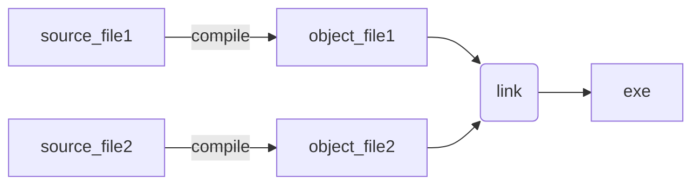

因课程与时间问题，无法一直使用CPP，经常需要从头拾起，故写下此篇以助快速回忆

参考书籍：

- A tour of c++
- Effective modern c++

# 第一章 A tour of c++

## 1 Basic

### 1.1 Programs



### 1.2 Assignment

compare pointer and reference:

```cpp
int x = 2; int y = 3;
int *p = &x; int *q = &y;
p = q // p becomes &y
```

```cpp
int x = 2; int y = 3;
int &p = x; int &q = y;
p = q // x becomes 3
```

## 2 Modularity

### 2.1 Unions

- union occupies only as much space as the largest member
- we don't know the kind of value

```cpp
union u {
    int i;
    float f;
};
```

- variant need more space to store the kind of value

```cpp
variant<int, char> v;
if (holds_alternative<int>(v))
    get<int>(v);
```

- enumerations

```cpp
enum class Color { red, blue, green };
Color col = Color::red;
```

### 2.2 Modules (C++20)

- translation unit(a source file -> a unit)
- the include is only the copy and paste
- why modules?
  - the include will be handle n times in n translation units
  - avoid macro affect

```cpp
// vector.cpp
module;
export module Vector; // define the module called "Vector"
export class Vector { // declare
    //...
}
// define
//...

// other.cpp
import Vector;
//...
```

### 2.3 Exceptions

- keywords: \<stdexcept\>, noexcept
- we need invariant to avoid exceptions(assert/static_assert)
- chatgpt will do the things

### 2.4 Function Arguments

- pass by value / pass by reference(const &r)
- default function argument
- overloading
- return with move

```cpp
TYPE f() {
    TYPE i;
    return i;
}
```

- structured binding

```cpp
struct Entry {
    string name;
    int value;
}

Entry read_entry(istream &is) {
    string s;
    int i;
    is >> s >> i;
    return {s, i};
}

auto [n, v] = read_entry(cin); // unpack
```

the types are deduced from return type

```cpp
map<string, int> m;
for (const auto &[k, v] : m) {
    //...
}
```

## 3 Classes

- always use explicit constructor
- define a class

```cpp
class complex {
    double re, im; // representation: two doubles
public:
    complex(double r, double i): re{r}, im{i} {}
    complex(double r): re{r}, im{0} {}
    complex(): re{0}, im{0} {}

    double real() const { return re; }
    void real(double d) { re=d; }
    double imag() const { return im; }
    void imag(double d) { im=d; }

    complex& operator+=(complex z)
    {
        re+=z.re;
        im+=z.im;
        return ∗this;
    }

    complex& operator−=(complex z)
    {
        re−=z.re;
        im−=z.im;
        return ∗this;
    }
};
```

- using initializer_list

```cpp
// the {1, 2, 3} was converted to initializer_list
Vector(std::initializer_list<double>);
//...
Vector v1 = {1, 2, 3};
```

- abstract types

```cpp
class Container {
public:
    virtual double& operator[](int)=0;
    virtual int size() const = 0;
}

class VectorContainer: public Container {
   //...
}
```

- virtual function table(vtbl)

<p align="center">
    
</p>

- using dynamic_cast to find hierarchy

```cpp
// Shape -> Smiley, the obj is Shape
if (Smiley* p = dynamic_cast<Smiley*>(obj)) {
    // ...
}
```

- resource acquisition is initialization(RAII)

## 4 Templates

- example

```cpp
template<typename T>
class Vector {};
```

- function object

```cpp
template<typename T>
class LessThan {
    //...
    bool oprerator()(const T& x) const return { x < val; }
}
```

- lambda expression
- type trait
- aliases(`using`)
- `if constexpr`

## 5 Concepts

- define 

```cpp
template<typename T>
concept Incrementable = requires(T a) {
    { ++a } -> std::same_as<T&>;
};
```

- using

```cpp
template<Incrementable T>
void incrementAndPrint(T value) {
    ++value;
    std::cout << "Value after increment: " << value << std::endl;
}
int num = 1;
incrementAndPrint(num)
```

```cpp
template <typename T, typename S,
          typename = std::enable_if_t<std::is_base_of_v<Target, T> &&
                                      std::is_base_of_v<Search, S>>>
```

- fold expression

```cpp
template<Number... T>
int sum(T... v) {
    return (v + ... + 0); // right fold: (v[0] + (v[1] + (v[2] + 0)))
}

int x = sum(1, 2, 3);
int y = sum('a', 2.4);
```

- **perfect forwarding**
## 6 library

- std::swap(a, b)
- hash<X>
- string/string streams
- regular expression
- iterators
- io
- file system/file streams
- containers: vector/list/map/set
    - map --> rb_tree
    - unordered map --> hash table

- head files
<p align="center">
    
</p>

- algorithm

<p align="center">
    
</p>

- unique_ptr/shared_ptr/weak_ptr
- move/forward
- bitset/pair/tuple
- variant/optional/any
- span/mem_fn/enable_if

# 第二章 Effective modern c++


