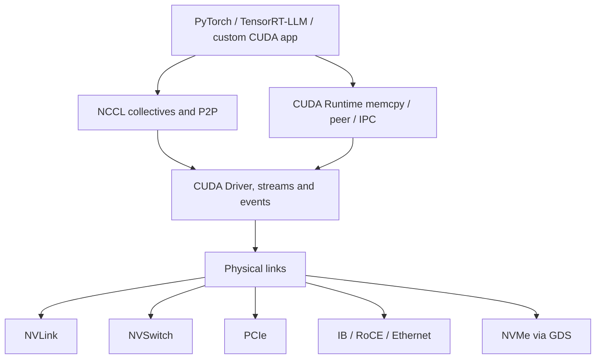
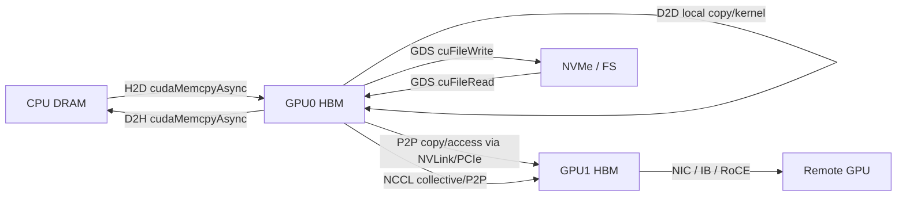
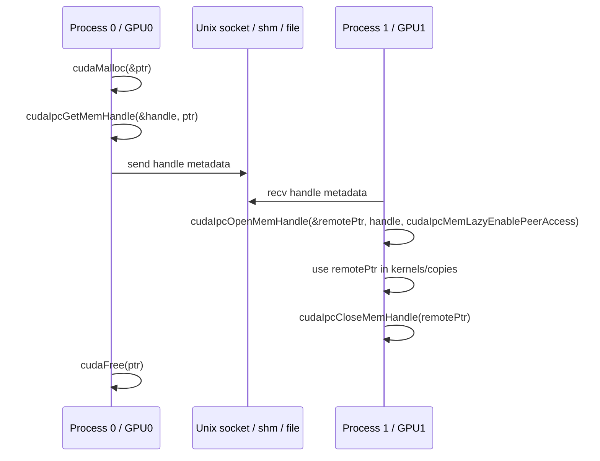
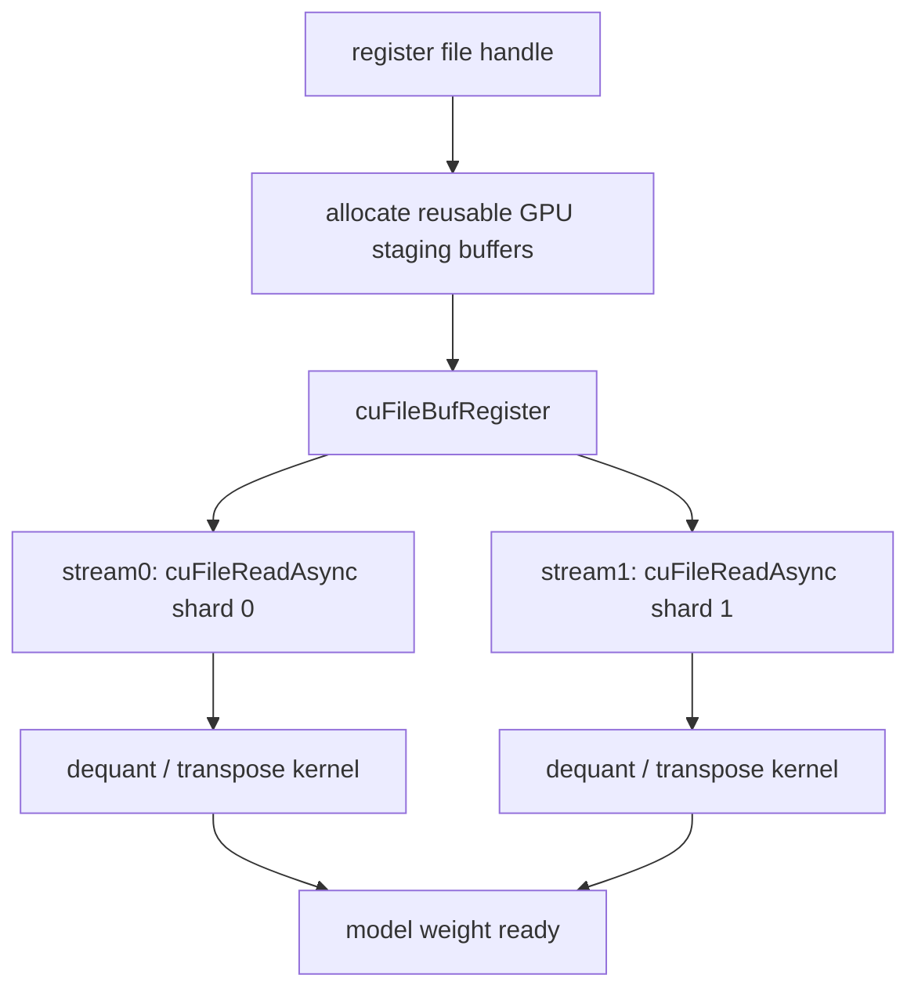
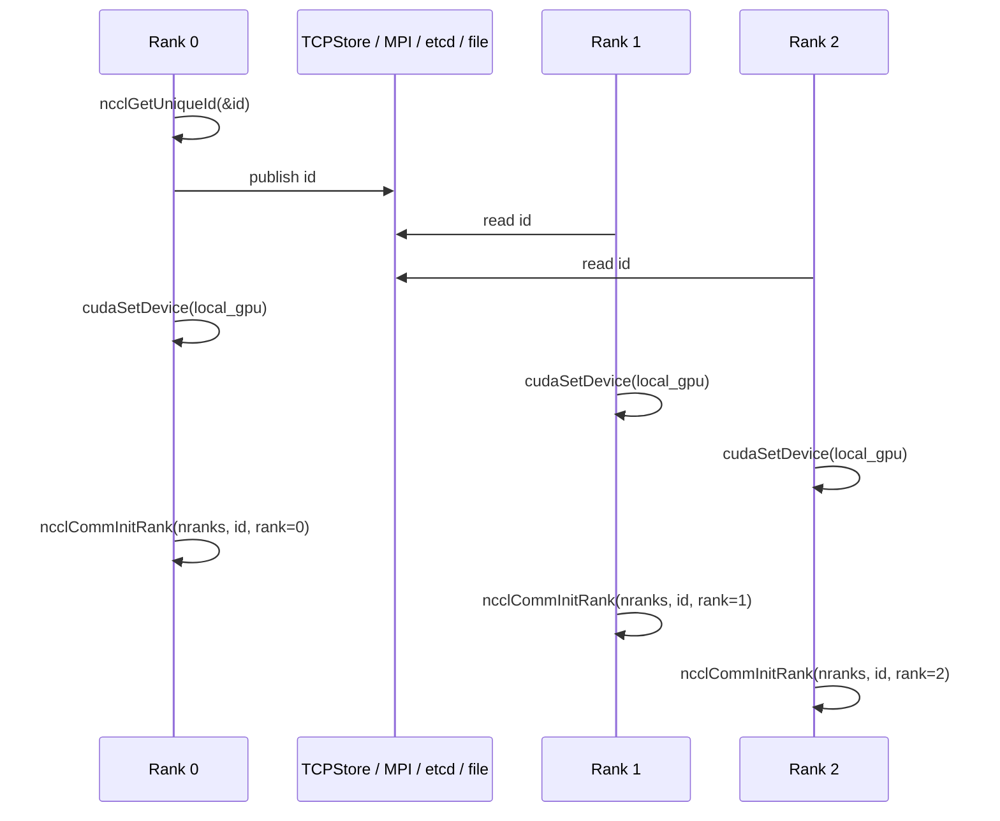
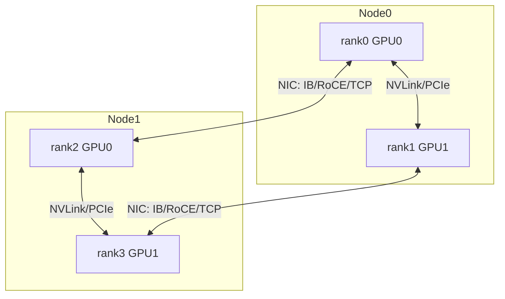

## 1. 先说结论

版本说明：本文参考的是2026-05-15访问的NVIDIA官方文档。CUDA Runtime API页面显示CUDA Toolkit版本为`13.2.1`，最后更新日期为2026-04-09；CUDA Programming Guide为`13.2`，最后更新日期为2026-03-04；GDS cuFile API Reference为`v1.16`；NCCL文档为`2.30.3`。这些API和行为会随CUDA、驱动、NCCL、文件系统和硬件拓扑变化，工程里应以目标机器上的`cudaRuntimeGetVersion()`、`cudaDriverGetVersion()`、`ncclGetVersion()`、`nvidia-smi topo -m`、`gdscheck.py`为准。

这几个技术点可以用一句话串起来：

**CUDA负责“GPU怎么看见内存和怎么搬字节”，NVLink/NVSwitch/PCIe/NIC决定“字节实际走哪条物理链路”，CUDA IPC/VMM负责“多进程怎么共享GPU内存句柄”，NCCL负责“多GPU之间怎么做高层通信模式”，cuFile/GDS负责“存储怎么直接进出GPU内存”。**

常见选择可以先这样记：

| 场景 | 优先考虑 | 关键API或库 | 典型数据路径 |
| --- | --- | --- | --- |
| CPU内存到GPU | `cudaMemcpyAsync` + pinned host memory | `cudaHostAlloc`、`cudaMemcpyAsync` | DRAM -> PCIe/NVLink-C2C -> HBM |
| 同进程多GPU拷贝 | P2P copy | `cudaMemcpyPeerAsync`、`cudaDeviceEnablePeerAccess` | GPU0 HBM -> NVLink/PCIe -> GPU1 HBM |
| 同进程跨GPU直接访存 | P2P load/store | `cudaDeviceCanAccessPeer`、`cudaDeviceEnablePeerAccess` | GPU kernel直接解引用peer指针 |
| 多进程共享GPU显存 | CUDA IPC或Driver VMM | `cudaIpcGetMemHandle`、`cudaIpcOpenMemHandle` | 进程间传handle，本地映射成device pointer |
| 文件直接读写GPU显存 | GPUDirect Storage/cuFile | `cuFileHandleRegister`、`cuFileBufRegister`、`cuFileRead` | NVMe/文件系统 -> nvidia-fs -> GPU HBM |
| 多GPU训练通信 | NCCL collective | `ncclAllReduce`、`ncclReduceScatter`、`ncclAllGather` | rank间按拓扑走NVLink/PCIe/NIC |
| 多GPU点对点消息 | NCCL P2P或CUDA P2P | `ncclSend`、`ncclRecv`或`cudaMemcpyPeerAsync` | rank A buffer -> rank B buffer |

一个容易混淆的点是：**“能共享地址”不等于“通信已经完成”。** CUDA IPC打开出来的是本进程可用的device pointer，P2P enable之后kernel可以访问peer memory，NCCL调用也只是把通信操作enqueue到CUDA stream上。正确性仍然依赖stream、event、进程间控制消息、NCCL communicator错误处理和显式同步。

如果把CUDA通信按层次拆开，最重要的是这张图：



应用层通常选择NCCL或CUDA API；真正的带宽、延迟、拥塞和路径选择由硬件拓扑、驱动、NCCL拓扑图、环境变量和运行时状态共同决定。

## 2. 先把数据路径画清楚

GPU系统里的“搬运”不是一个概念，而是一组路径：



按工程视角，这些路径至少有四层问题：

1. **地址是否可见**：当前进程、当前CUDA context、当前GPU能不能把这个指针解释成有效地址。
2. **传输走哪里**：CPU bounce buffer、PCIe、NVLink、NVSwitch、NIC、NVMe、nvidia-fs。
3. **什么时候完成**：同步API阻塞host；异步API只入队，需要stream/event同步。
4. **谁保证一致性**：stream order、event、进程间协议、NCCL collective ordering、CUDA memory model。

性能优化通常不是“换一个API就快”，而是让数据路径更短、同步更少、传输更大块、更可重叠。

## 3. CUDA通信栈：从API到物理链路

讨论CUDA通信时，最好把“通信语义”和“物理链路”分开：

| 层次 | 负责什么 | 例子 |
| --- | --- | --- |
| 通信语义 | 谁给谁发、是否reduce、是否共享地址 | `cudaMemcpyPeerAsync`、`ncclAllReduce`、`cudaIpcOpenMemHandle` |
| CUDA执行模型 | 操作在哪个device、哪个stream、何时完成 | `cudaSetDevice`、stream、event、graph |
| 访问能力 | 当前GPU能不能直接访问peer memory | UVA、P2P enable、BAR映射、IOMMU/ACS影响 |
| 传输协议/库 | 如何分块、排队、选择算法 | NCCL ring/tree、LL/LL128/Simple protocol |
| 物理链路 | 字节实际经过什么硬件 | NVLink、NVSwitch、PCIe、IB/RoCE、NVMe |

这能解释很多现象：

1. 同样是`cudaMemcpyPeerAsync`，GPU之间有NVLink和只有跨NUMA PCIe，性能完全不同。
2. 同样是`ncclAllReduce`，NCCL可能选择ring、tree或CollNet/NVLS等路径，取决于拓扑和版本能力。
3. CUDA IPC只是让另一个进程拿到可用device pointer，不保证它走NVLink，也不自动提供同步。
4. GPUDirect RDMA和GDS都叫GPUDirect，但一个面向NIC，一个面向storage，路径和API完全不同。

下面几节仍按API展开，但重点放在通信语义和拓扑。

## 4. CUDA显存与基础搬运API

CUDA Runtime里最基础的内存API分成几类：

| 类别 | API | 说明 |
| --- | --- | --- |
| 设备内存 | `cudaMalloc`、`cudaFree` | 分配GPU device memory |
| host pinned memory | `cudaHostAlloc`、`cudaMallocHost`、`cudaHostRegister` | 让host内存适合DMA和异步H2D/D2H |
| managed memory | `cudaMallocManaged`、`cudaMemPrefetchAsync`、`cudaMemAdvise` | 统一内存，由运行时迁移页面 |
| 普通拷贝 | `cudaMemcpy`、`cudaMemcpyAsync` | H2D、D2H、D2D、H2H |
| 2D/3D拷贝 | `cudaMemcpy2DAsync`、`cudaMemcpy3DAsync` | pitch、array、图像/张量切片 |
| peer拷贝 | `cudaMemcpyPeerAsync`、`cudaMemcpy3DPeerAsync` | 多GPU之间拷贝 |
| memset | `cudaMemsetAsync` | 初始化device memory |

`cudaMemcpyAsync(dst, src, count, kind, stream)`是最常见的搬运入口。`kind`可以显式写`cudaMemcpyHostToDevice`、`cudaMemcpyDeviceToHost`、`cudaMemcpyDeviceToDevice`，在支持UVA的系统上也可以用`cudaMemcpyDefault`让CUDA根据指针推断方向。

一个典型H2D/D2H流水线如下：

```cpp
cudaStream_t s;
cudaStreamCreate(&s);

void* h = nullptr;
float* d = nullptr;
size_t bytes = n * sizeof(float);

cudaHostAlloc(&h, bytes, cudaHostAllocDefault);  // pinned host memory
cudaMalloc(&d, bytes);

cudaMemcpyAsync(d, h, bytes, cudaMemcpyHostToDevice, s);
kernel<<<grid, block, 0, s>>>(d);
cudaMemcpyAsync(h, d, bytes, cudaMemcpyDeviceToHost, s);

cudaStreamSynchronize(s);
```

这里有几个实践点：

1. **要重叠H2D/D2H和kernel，host buffer最好是pinned memory**。pageable host memory往往会触发额外暂存和同步，吞吐和延迟都不稳定。
2. **`cudaMemcpyAsync`异步的是host视角**。它返回不代表数据已经可用，只代表工作已经提交到stream。
3. **同一个stream内有序，不同stream能否重叠取决于依赖和硬件copy engine**。
4. **小拷贝多次提交通常很亏**。调度开销、PCIe transaction、同步开销会吞掉带宽，优先合并成大块或batch。
5. **D2D不一定都一样**。同一GPU内D2D是本地显存拷贝；跨GPU D2D如果没有P2P路径，可能退化为经host中转或受拓扑限制。

## 5. 多GPU：P2P copy和P2P access

同一进程内使用多GPU时，第一步是理解“当前device”。`cudaSetDevice(i)`影响后续的`cudaMalloc`、stream、event和kernel launch。一个stream属于创建它时的device，把kernel发到不匹配的stream会失败；但跨设备memory copy本身有专门语义。

### 5.1 P2P copy

跨GPU拷贝可以用：

```cpp
cudaSetDevice(0);
float* p0 = nullptr;
cudaMalloc(&p0, bytes);

cudaSetDevice(1);
float* p1 = nullptr;
cudaMalloc(&p1, bytes);

cudaStream_t s1;
cudaStreamCreate(&s1);
cudaMemcpyPeerAsync(p1, 1, p0, 0, bytes, s1);
```

`cudaMemcpyPeerAsync(dst, dstDevice, src, srcDevice, count, stream)`显式给出源GPU和目标GPU。它适合“我只是要把一段buffer从GPU A复制到GPU B”的场景。

如果两个GPU之间支持并启用了P2P访问，peer copy可以不经过host staging，通常更快。NVIDIA文档也强调，CUDA会利用copy engine和NVLink等硬件来提升P2P transfer。

### 5.2 P2P access

P2P access不是拷贝，而是让一个GPU kernel直接访问另一个GPU上的显存：

```cpp
int can = 0;
cudaDeviceCanAccessPeer(&can, 1, 0);
if (can) {
    cudaSetDevice(1);
    cudaDeviceEnablePeerAccess(0, 0);
    // device 1上的kernel可以访问device 0分配的p0
    kernel_on_gpu1<<<grid, block>>>(p0);
}
```

注意几个坑：

1. **P2P enable是单向的**。GPU1访问GPU0要在GPU1上enable peer 0；反过来还要另做一次。
2. **拓扑决定能力**。`cudaDeviceCanAccessPeer()`返回false时，不要假设NVLink、PCIe同机就一定可直连。
3. **全局enable有分配开销**。CUDA Programming Guide提到，`cudaDeviceEnablePeerAccess()`会让peer device上的已有和后续分配都对当前device可访问，因此会给分配路径带来随peer数量增长的开销。更细粒度的选择是Driver API里的VMM。
4. **远端load/store延迟高于本地HBM**。P2P access适合稀疏控制结构、少量跨卡读写、或必须直接解引用的场景；大块数据通常用copy或NCCL更合适。

## 6. NVLink、NVSwitch、PCIe与拓扑

CUDA P2P和NCCL最终都要落到物理互连上。最常见的单机GPU互连有三类：

| 互连 | 心智模型 | 常见特征 | 对CUDA通信的影响 |
| --- | --- | --- | --- |
| PCIe | GPU挂在PCIe root complex下 | 通用、层级明显、受NUMA/交换芯片影响 | 所有GPU都有PCIe，但跨root/跨NUMA性能可能差 |
| NVLink | GPU之间的高速直连link | 带宽高、延迟低、适合GPU-GPU通信 | P2P copy/access和NCCL通常显著受益 |
| NVSwitch | 多GPU通过交换芯片互连 | 更接近全互连，适合8卡或更多GPU | NCCL可构建更均衡的集合通信路径 |

`nvidia-smi topo -m`是排查通信性能的第一步。常见标记可以粗略这样理解：

| 标记 | 含义 |
| --- | --- |
| `NV#` | 两个GPU之间有#条NVLink |
| `PIX` | 经过最多一个PCIe bridge |
| `PXB` | 经过多个PCIe bridge |
| `PHB` | 经过PCIe host bridge |
| `SYS` | 跨NUMA node或socket |
| `NODE` | 同NUMA node内路径 |

这些标记不是性能合同，但能快速解释“为什么0到1很快、0到7很慢”。对多GPU程序，应该把rank映射和拓扑绑在一起考虑：

```text
好映射：
  tensor parallel group内部GPU尽量在NVLink/NVSwitch近邻里
  pipeline parallel跨节点时尽量让相邻stage靠近NIC

坏映射：
  all-reduce最频繁的一组rank跨NUMA或跨PCIe root complex
  rank顺序和物理GPU顺序完全不匹配
```

NCCL会自动读取拓扑并选择算法，但自动不等于魔法。容器屏蔽设备、PCIe ACS、错误的`CUDA_VISIBLE_DEVICES`顺序、禁用IB、NUMA绑定错误，都可能让NCCL看到的世界和你以为的不一样。

### 6.1 NVLink和P2P

NVLink对应用不是一个新CUDA API。你仍然调用`cudaMemcpyPeerAsync`、启用P2P access、或者使用NCCL。区别在于，如果两个GPU之间有NVLink且驱动/拓扑允许，底层传输可以走NVLink。

因此，代码里不要写“使用NVLink拷贝”这种抽象，应该写：

```cpp
int can = 0;
cudaDeviceCanAccessPeer(&can, dst_dev, src_dev);
if (can) {
    cudaSetDevice(dst_dev);
    cudaDeviceEnablePeerAccess(src_dev, 0);
}
cudaMemcpyPeerAsync(dst, dst_dev, src, src_dev, bytes, stream);
```

然后用拓扑和profiling确认实际链路：

```bash
nvidia-smi topo -m
NCCL_DEBUG=INFO ./your_nccl_program
nsys profile --trace=cuda,nvtx,osrt ./your_program
```

### 6.2 NVSwitch和集合通信

NVSwitch的价值主要体现在多GPU集合通信。没有NVSwitch时，8卡通信可能受限于若干点对点链路和PCIe层级；有NVSwitch时，GPU之间可以通过交换网络获得更均衡的互连。

对应用来说，NVSwitch仍然主要通过NCCL受益：

1. AllReduce可以把数据切分后在多个路径上传输。
2. AllGather/ReduceScatter可以更稳定地使用多卡互连带宽。
3. 多个tensor parallel group可以减少路径争用，但仍要看具体拓扑。

NCCL 2.x文档里还有NVLS相关环境变量和拓扑控制项。它们属于“知道机器拓扑之后再调”的工具，不适合在不了解硬件时盲目设置。

### 6.3 PCIe、NUMA与CPU亲和性

即使主要做GPU-GPU通信，CPU和PCIe拓扑仍然重要：

1. rank进程绑定到离目标GPU更近的CPU NUMA node，通常能降低host侧调度和控制路径开销。
2. NIC和GPU如果不在同一PCIe/NUMA邻域，跨节点NCCL可能走更差路径。
3. NVMe到GPU的GDS路径也受NVMe和GPU的PCIe位置影响。

常用检查：

```bash
nvidia-smi topo -m
nvidia-smi topo -mp
lspci -tv
numactl --hardware
```

经验上，通信问题先看拓扑，再看库版本，再看环境变量。

## 7. CUDA IPC：多进程共享GPU内存

多进程多GPU程序里，每个进程通常绑定一个GPU。进程A里的device pointer不能直接发给进程B使用，因为指针值只在创建它的进程/上下文里有意义。CUDA IPC解决的是“把一段GPU allocation导出成进程可传递的handle，再由另一个进程映射成本地device pointer”。

基本流程如下：



代码骨架：

```cpp
// exporter
cudaSetDevice(0);
void* d = nullptr;
cudaMalloc(&d, bytes);

cudaIpcMemHandle_t h;
cudaIpcGetMemHandle(&h, d);
send_handle_to_other_process(h);

// importer
cudaSetDevice(1);
cudaIpcMemHandle_t h = recv_handle();
void* remote = nullptr;
cudaIpcOpenMemHandle(&remote, h, cudaIpcMemLazyEnablePeerAccess);

consumer_kernel<<<grid, block>>>(static_cast<float*>(remote));

cudaIpcCloseMemHandle(remote);
```

CUDA IPC要重点记这些限制：

1. **handle不是数据拷贝**。它只是授权另一个进程映射同一段底层allocation。
2. **生命周期必须由应用协议保证**。exporter不能在importer close之前`cudaFree`原始allocation，否则行为未定义。
3. **不是所有内存都支持**。Programming Guide明确说legacy CUDA IPC不支持`cudaMallocManaged`分配。
4. **平台和版本有要求**。CUDA Programming Guide 13.2描述legacy CUDA IPC只支持Linux；Runtime API页面对特定runtime版本还列出了Linux/Windows兼容性说明。实际工程应按部署CUDA版本确认。
5. **安全边界要认真处理**。CUDA文档提示，`cudaMalloc()`可能从更大的底层block里做sub-allocation，IPC可能共享整个底层block。为了避免把相邻分配暴露给别的进程，建议共享2MiB对齐大小的allocation。
6. **同步不是自动的**。如果P0写入、P1读取，需要用CUDA event IPC、进程间消息、stream wait event或更高层协议保证“写完再读”。

CUDA IPC适合单机多进程推理、数据加载进程和计算进程共享GPU buffer、进程间零拷贝传递中间结果等场景。但如果你要的是“多GPU做all-reduce/all-gather”，直接用NCCL通常更合适。

## 8. GPUDirect RDMA：NIC直接访问GPU显存

GPUDirect RDMA是另一个容易和GDS混淆的概念。GDS是storage到GPU，GPUDirect RDMA是第三方PCIe设备，最典型是InfiniBand/RoCE NIC，直接读写GPU memory。

传统跨节点GPU通信可能是：

```text
GPU HBM -> CPU DRAM staging -> NIC -> network -> CPU DRAM staging -> GPU HBM
```

GPUDirect RDMA希望变成：

```text
GPU HBM -> NIC DMA -> network -> NIC DMA -> GPU HBM
```

应用层通常不会直接写GPUDirect RDMA代码，而是通过NCCL、UCX、MPI、NVSHMEM或框架通信层使用。它对NCCL跨节点性能非常关键，尤其是大模型训练中的AllReduce、ReduceScatter、AllGather。

要点：

1. **GPUDirect RDMA不是NCCL API**。NCCL只是可能利用它。
2. **GPU、NIC、PCIe拓扑很关键**。同NUMA/同PCIe交换域通常更好。
3. **容器和内核模块要配对**。驱动、`nvidia-peermem`、IB驱动、设备权限都会影响是否能走GDR路径。
4. **小消息未必总是受益**。协议延迟、注册成本、NCCL协议选择会影响效果。

排查时关注NCCL日志里的NET/GDR相关信息，并结合`ibv_devinfo`、`nvidia-smi topo -m`、`NCCL_DEBUG=INFO`看实际路径。

## 9. cuFile与GPUDirect Storage

GPUDirect Storage，简称GDS，解决的是存储I/O到GPU显存的数据路径问题。传统路径大致是：

```text
NVMe / filesystem -> kernel page cache or user buffer -> CPU DRAM -> cudaMemcpy -> GPU HBM
```

GDS/cuFile希望变成：

```text
NVMe / supported filesystem -> nvidia-fs / DMA path -> GPU HBM
```

也就是说，cuFile不是“CUDA里的文件API”，而是围绕GDS的一组CPU侧API，用来把文件handle、GPU buffer和I/O请求交给GDS数据路径。

### 6.1 cuFile基本调用顺序

典型流程：

```cpp
#include <fcntl.h>
#include <unistd.h>
#include <cuda_runtime.h>
#include <cufile.h>

cuFileDriverOpen();

int fd = open(path, O_RDONLY | O_DIRECT);

CUfileDescr_t descr = {};
descr.handle.fd = fd;
descr.type = CU_FILE_HANDLE_TYPE_OPAQUE_FD;

CUfileHandle_t cf_handle;
cuFileHandleRegister(&cf_handle, &descr);

void* d_buf = nullptr;
cudaMalloc(&d_buf, bytes);

cuFileBufRegister(d_buf, bytes, 0);

ssize_t n = cuFileRead(cf_handle, d_buf, bytes, file_offset, 0);

cuFileBufDeregister(d_buf);
cuFileHandleDeregister(cf_handle);
close(fd);
cuFileDriverClose();
```

API职责可以这样拆：

| API | 作用 | 是否总是必须 |
| --- | --- | --- |
| `cuFileDriverOpen` | 初始化cuFile/GDS状态 | 可隐式，但性能路径建议显式 |
| `cuFileHandleRegister` | 把OS fd注册成`CUfileHandle_t`，检查文件/挂载支持 | 必须 |
| `cuFileBufRegister` | 注册GPU或host buffer，摊销pin/map成本 | 可选，但性能路径建议显式 |
| `cuFileRead/cuFileWrite` | 同步读写 | 读写核心API |
| `cuFileReadAsync/cuFileWriteAsync` | stream ordered异步读写 | 需要CUDA stream流水线时使用 |
| `cuFileStreamRegister` | 为stream I/O预注册资源和参数语义 | 可选，性能路径可用 |
| `cuFile*Deregister/DriverClose` | 释放资源 | 应显式做 |

NVIDIA文档明确说，`cuFileBufRegister`成本较高，应尽量在critical path之外提前做，并复用buffer来摊销注册成本。如果不注册buffer，cuFile可能使用内部注册buffer，这能简化代码，但性能和可控性会下降。

### 6.2 同步与异步cuFile

`cuFileRead`是同步调用，会阻塞host直到I/O完成。`cuFileReadAsync`则把I/O提交到CUDA stream；如果传入非空stream，该操作和stream中的其他CUDA工作有序。

一个模型加载场景可以这样流水线化：



`cuFileStreamRegister`有一个容易忽略的参数语义：默认情况下，异步I/O的size、file offset、buffer offset指针值可能到执行时才取值；如果这些参数在提交时就确定，或者所有输入4K对齐，可以用flag告诉cuFile，从而给实现更多优化空间。文档里也说明`0xF`表示所有输入对齐且提交时已知，通常性能最好。

### 6.3 cuFile常见问题

1. **GDS需要硬件、驱动、nvidia-fs、文件系统、挂载方式共同支持**。API能编译不代表实际路径是GDS direct path。
2. **不对齐也能工作，但可能不快**。cuFile文档说`cuFileRead`支持非对齐offset和任意size，但性能可能不如对齐读。
3. **注册和注销不能和未完成I/O乱序**。在I/O未完成时注销handle或buffer可能导致未定义行为。
4. **fork要避开初始化后的cuFile**。文档说明库初始化之后再`fork()`，child里的行为未定义。
5. **compat mode不是同一条快路径**。当文件系统或参数不支持direct path时，可能进入兼容路径，CPU参与度和带宽都会不同。

一个实用检查方式：

```bash
gdscheck.py -p
gdsio -f /mnt/nvme/testfile -d 0 -w 4 -s 16G -i 1M -x 0
```

测试时要分别看吞吐、CPU占用、I/O size、对齐、NUMA、GPU/NVMe拓扑，而不是只看一个GB/s数字。

## 10. NCCL：多GPU通信的高层抽象

NCCL把多GPU通信抽象成rank和communicator。每个rank通常绑定一个CUDA device，所有rank加入同一个communicator后，就可以在CUDA stream上提交collective或P2P通信。

创建communicator的多进程典型流程：



文档里对`ncclCommInitRank`的关键约束是：rank必须在`0..nranks-1`之间且唯一，每个rank关联到一个CUDA device，并且在调用前要先`cudaSetDevice()`；这个初始化会和其他rank隐式同步，因此多rank必须由不同线程/进程调用，或者在单进程多GPU时用group call管理。

### 10.1 常见collective

| 操作 | 语义 | 训练/推理中的例子 |
| --- | --- | --- |
| `ncclAllReduce` | 所有rank输入做reduce，每个rank得到完整结果 | DDP梯度求和 |
| `ncclBroadcast` | root把buffer发给所有rank | 广播参数、随机种子 |
| `ncclReduce` | 所有rank reduce到root | 汇总统计 |
| `ncclAllGather` | 每个rank贡献一段，所有rank得到拼接结果 | tensor parallel收集activation |
| `ncclReduceScatter` | reduce后按rank切分 | ZeRO、FSDP、Megatron通信 |
| `ncclAlltoAll` | 每个rank给每个rank发送不同切片 | MoE token dispatch |
| `ncclSend/ncclRecv` | 点对点双边通信 | pipeline parallel、KV转发 |

一个AllReduce例子：

```cpp
cudaSetDevice(local_rank);
ncclComm_t comm;
ncclCommInitRank(&comm, nranks, id, rank);

cudaStream_t s;
cudaStreamCreate(&s);

ncclAllReduce(sendbuf, recvbuf, count, ncclFloat32, ncclSum, comm, s);

// NCCL操作已经进入stream，不代表已经完成
cudaStreamSynchronize(s);
```

NCCL调用通常返回的是“是否成功提交/排队”，真正完成还要看CUDA stream。异步错误可以通过`ncclCommGetAsyncError()`查询；一旦communicator出错，NVIDIA文档提醒不能再假设该communicator上已入队操作的完成性或正确性，通常要`ncclCommAbort()`并重建。

### 10.2 group call与多GPU单进程

单进程管理多个GPU时，经常要在一个线程里对多个device发起NCCL操作。此时需要用：

```cpp
ncclGroupStart();
for (int i = 0; i < ndev; ++i) {
    cudaSetDevice(devs[i]);
    ncclAllReduce(send[i], recv[i], count, ncclFloat16, ncclSum, comms[i], streams[i]);
}
ncclGroupEnd();
```

group call不是“把多个通信合成一个collective语义”，而是告诉NCCL这批操作一起提交，避免单个调用在等待其他rank时死锁，也给NCCL更多聚合调度空间。

### 10.3 NCCL和CUDA IPC/P2P的关系

NCCL不是CUDA IPC的替代品，CUDA IPC也不是NCCL的替代品：

1. **CUDA IPC提供共享内存视图**：你自己定义谁写、谁读、如何同步、如何回收。
2. **CUDA P2P提供底层跨GPU拷贝/访存能力**：适合明确的一对一buffer移动或远端访存。
3. **NCCL提供通信协议和拓扑优化**：适合rank集合上的reduce、gather、scatter、all-to-all、send/recv。

实际框架里它们经常一起出现。比如单机多进程NCCL可能使用CUDA IPC、共享内存、P2P、NVLink路径；跨节点则会使用网络插件、InfiniBand/RoCE、GPUDirect RDMA等。但应用层通常不应该绕过NCCL手写all-reduce，除非你要做非常特殊的通信模式。

### 10.4 NCCL拓扑、算法和协议

NCCL性能来自两件事：知道拓扑，以及为通信模式选合适算法。

常见算法心智模型：

| 算法 | 适合什么 | 直觉 |
| --- | --- | --- |
| Ring | 大消息、高带宽 | 每个rank只和邻居交换分块，带宽利用好 |
| Tree | 小到中等消息、低延迟 | 以树形聚合/广播，减少步骤 |
| CollNet/NVLS等 | 特定硬件和版本 | 利用交换网络或网卡能力加速集合通信 |

常见协议心智模型：

| 协议 | 直觉 |
| --- | --- |
| LL | low latency，小消息优化 |
| LL128 | 折中延迟和带宽 |
| Simple | 大消息高带宽路径 |

这些不是应用必须手动指定的东西。大多数时候应该先让NCCL自动选择，然后用`NCCL_DEBUG=INFO`和profiling看它选了什么。如果确实要调，优先用benchmark验证，不要靠感觉设置`NCCL_ALGO`、`NCCL_PROTO`。

## 11. 多进程多GPU通信模式对比

### 11.1 单机一进程多GPU

优点是控制简单，指针和对象都在同一进程里，可以直接管理多个CUDA context：

```text
one process
  thread/main loop
    cudaSetDevice(0) -> launch/copy
    cudaSetDevice(1) -> launch/copy
    NCCL comms[0..n-1]
```

适合小规模工具、benchmark、单进程推理服务。缺点是一个进程崩溃会影响所有GPU，Python GIL和框架调度也可能成为问题。

### 11.2 单机多进程一进程一GPU

这是训练和推理里最常见的模式：

```text
process rank 0 -> cuda:0
process rank 1 -> cuda:1
process rank 2 -> cuda:2
process rank 3 -> cuda:3
```

通信通常交给NCCL；需要共享buffer时用CUDA IPC；需要加载大文件到GPU时可以每个rank自己用cuFile读取本rank shard。

优点是隔离性好、和PyTorch DDP/FSDP/TP天然匹配；缺点是进程间控制面复杂，需要处理rank启动、唯一ID分发、错误传播和资源回收。

### 11.3 多节点多GPU

多节点时，CUDA IPC只覆盖单节点同OS实例内的legacy IPC需求；跨节点通信通常交给NCCL、MPI、UCX、NVSHMEM或框架通信层。NCCL会基于拓扑选择环、树、NVLink、PCIe、NIC等路径，但应用仍要配置网络接口、容器权限、IB/RoCE、GDR能力和防火墙端口。

最小心智模型：



## 12. 性能判断：看瓶颈而不是看API名

显存搬运和通信性能常见指标：

| 指标 | 含义 | 易错点 |
| --- | --- | --- |
| bandwidth | 单位时间搬了多少字节 | 小包延迟主导时GB/s没有意义 |
| latency | 一次操作从提交到完成的时间 | host返回不等于stream完成 |
| overlap | copy/I/O/compute是否重叠 | 默认stream、隐式同步会破坏重叠 |
| CPU utilization | CPU是否参与搬运 | GDS/RDMA目标之一是降低CPU参与 |
| topology | GPU、NIC、NVMe之间的连接关系 | 跨NUMA、跨PCIe root complex会变慢 |
| registration cost | pinned、GDS、NCCL注册成本 | 应在初始化阶段摊销 |

一个粗略估算方法：

$$
T_{\mathrm{copy}} \approx T_{\mathrm{launch}} + \frac{\mathrm{bytes}}{\mathrm{effective\ bandwidth}} + T_{\mathrm{sync}}
$$

小buffer时，`T_launch`和`T_sync`主导；大buffer时，带宽主导；复杂pipeline里，能否和kernel重叠比单次带宽更重要。

对NCCL collective还要看通信量。例如ring all-reduce每个rank大致发送和接收：

$$
2 \cdot \frac{N-1}{N} \cdot S
$$

其中$N$是rank数，$S$是每个rank的buffer大小。这解释了为什么大模型训练里梯度bucket大小、通信计算重叠、拓扑和算法选择会显著影响吞吐。

## 13. 常见故障与排查顺序

### 13.1 CUDA memcpy/P2P

1. 用`cudaGetLastError()`和返回值检查每个API，不要只看kernel有没有崩。
2. 用`cudaPointerGetAttributes()`确认指针属于host、device还是managed memory。
3. 用`cudaDeviceCanAccessPeer()`确认P2P能力。
4. 用`nvidia-smi topo -m`看GPU之间是`NV#`、`PIX`、`PXB`、`PHB`还是`SYS`。
5. 检查是否用了默认stream导致隐式串行。

### 13.2 拓扑和NVLink/NVSwitch

1. `nvidia-smi topo -m`确认GPU-GPU、GPU-NIC、GPU-CPU亲和性。
2. `NCCL_DEBUG=INFO NCCL_DEBUG_SUBSYS=INIT,GRAPH`看NCCL识别到的拓扑图。
3. 检查`CUDA_VISIBLE_DEVICES`是否改变了逻辑rank到物理GPU的映射。
4. 检查容器是否隐藏了NVLink/NVSwitch相关拓扑信息或网络设备。
5. 不要只看“机器有NVLink”，要看目标rank对之间是否有合适路径。

### 13.3 CUDA IPC

1. 确认exporter和importer生命周期：先open、后use、先close、后free。
2. 确认不是`cudaMallocManaged`。
3. 确认handle传输没有被截断，`cudaIpcMemHandle_t`是二进制结构，不是字符串。
4. 加入进程间ack，避免exporter过早释放。
5. 用event或控制消息保证写读顺序。

### 13.4 cuFile/GDS

1. 跑`gdscheck.py -p`确认驱动、nvidia-fs、文件系统支持。
2. 检查文件打开flag、挂载选项、I/O size和offset对齐。
3. 确认`cuFileHandleRegister`和`cuFileBufRegister`返回值。
4. 分别测page cache路径、POSIX direct I/O路径、GDS路径，避免误判。
5. 注意容器里是否暴露了`/dev/nvidia-fs*`和相关capability。

### 13.5 NCCL

1. 设置`NCCL_DEBUG=INFO`，必要时加`NCCL_DEBUG_SUBSYS=INIT,GRAPH,NET,COLL`。
2. 确认所有rank的`nranks`、`rank`、`ncclUniqueId`一致。
3. 确认每个rank在`ncclCommInitRank`前调用了正确的`cudaSetDevice()`。
4. 确认collective调用顺序在所有rank上一致；顺序不一致很容易死锁。
5. 跨节点先确认网络接口，常用`NCCL_SOCKET_IFNAME`、`NCCL_IB_HCA`约束选择。
6. 出现异步错误时查询`ncclCommGetAsyncError()`，必要时abort并重建communicator。

## 14. 实战选择建议

如果只是加载模型权重：

1. 小模型或一次性加载：普通POSIX read到CPU再`cudaMemcpyAsync`足够简单。
2. 大模型、多rank、NVMe本地盘：考虑cuFile/GDS按shard直接读入GPU staging buffer。
3. 读入后还要转置/反量化：用cuFile async + CUDA stream把I/O和kernel串起来。

如果是单机多GPU推理：

1. tensor parallel通信优先用NCCL collective。
2. pipeline stage之间固定buffer传递可以考虑NCCL send/recv。
3. 同机多进程共享只读大buffer可以考虑CUDA IPC，但要非常小心生命周期和同步。
4. 跨GPU频繁远端随机访问通常要谨慎，远端访存延迟可能拖垮kernel。

如果是训练：

1. DDP梯度同步用`ncclAllReduce`。
2. FSDP/ZeRO常见核心是`ReduceScatter + AllGather`。
3. MoE token dispatch常见是`AlltoAll`。
4. 通信性能不佳时先查topology和bucket，再查NCCL环境变量，不要一开始就改算法。

如果是排查CUDA通信性能，建议顺序固定下来：

1. 画出rank到GPU、GPU到NIC、GPU到NVMe的拓扑。
2. 用microbenchmark确认单链路能力：H2D/D2H、P2P copy、NCCL all-reduce、GDS读写。
3. 用Nsight Systems看copy、kernel、NCCL是否真的重叠。
4. 再调bucket、stream、NCCL环境变量和rank mapping。

## 15. 总结

CUDA、cuFile、CUDA IPC和NCCL不是同一层东西：

1. **CUDA memory copy**解决显存和host/peer显存之间的字节搬运。
2. **P2P access**解决同进程内一个GPU直接访问另一个GPU显存的问题。
3. **CUDA IPC/VMM**解决多进程之间如何共享GPU allocation的问题。
4. **cuFile/GDS**解决存储I/O如何直接进入GPU内存、减少CPU bounce的问题。
5. **NCCL**解决多GPU/rank之间常见通信模式的协议、调度和拓扑优化问题。
6. **NVLink/NVSwitch/PCIe/NIC**不是上层API，但它们决定通信上限；API只是把工作提交给这些链路。

工程上最重要的是先画出数据路径，再选择API。只要明确“数据在哪里、谁能看见、走哪条链路、什么时候完成、谁负责同步”，这些API就不会混在一起。

## 参考

1. NVIDIA CUDA Runtime API 13.2.1: Memory Management, `cudaMemcpyAsync`、`cudaMemcpyPeerAsync`等：<https://docs.nvidia.com/cuda/cuda-runtime-api/group__CUDART__MEMORY.html>
2. NVIDIA CUDA Runtime API 13.2.1: Peer Device Memory Access, `cudaDeviceCanAccessPeer`、`cudaDeviceEnablePeerAccess`：<https://docs.nvidia.com/cuda/cuda-runtime-api/group__CUDART__PEER.html>
3. NVIDIA CUDA Runtime API 13.2.1: Device Management, `cudaIpcGetMemHandle`、`cudaIpcOpenMemHandle`、`cudaIpcCloseMemHandle`：<https://docs.nvidia.com/cuda/cuda-runtime-api/group__CUDART__DEVICE.html>
4. NVIDIA CUDA Programming Guide 13.2: Programming Systems with Multiple GPUs：<https://docs.nvidia.com/cuda/cuda-programming-guide/03-advanced/multi-gpu-systems.html>
5. NVIDIA CUDA Programming Guide 13.2: Interprocess Communication：<https://docs.nvidia.com/cuda/cuda-programming-guide/04-special-topics/inter-process-communication.html>
6. NVIDIA GDS cuFile API Reference v1.16：<https://docs.nvidia.com/gpudirect-storage/api-reference-guide/index.html>
7. NVIDIA NCCL User Guide 2.30.3: API：<https://docs.nvidia.com/deeplearning/nccl/user-guide/docs/api.html>
8. NVIDIA NCCL User Guide 2.30.3: Collective Communication Functions：<https://docs.nvidia.com/deeplearning/nccl/user-guide/docs/api/colls.html>
9. NVIDIA NCCL User Guide 2.30.3: Communicator Creation and Management Functions：<https://docs.nvidia.com/deeplearning/nccl/user-guide/docs/api/comms.html>
10. NVIDIA NCCL User Guide 2.30.3: Environment Variables, troubleshooting and tuning：<https://docs.nvidia.com/deeplearning/nccl/user-guide/docs/env.html>
11. NVIDIA GPUDirect RDMA Documentation：<https://docs.nvidia.com/cuda/gpudirect-rdma/>
