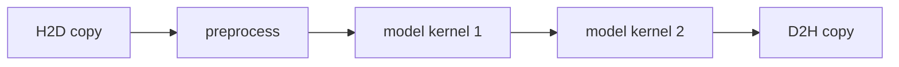
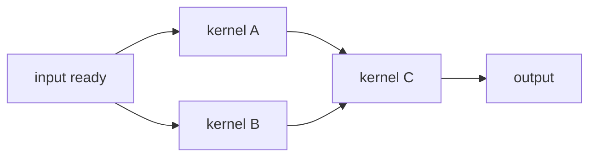
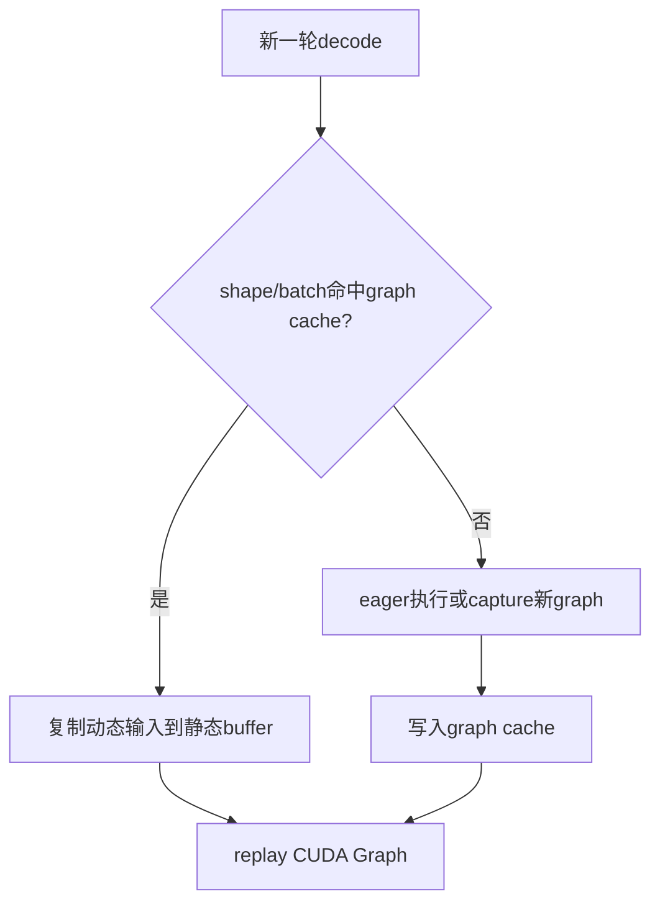
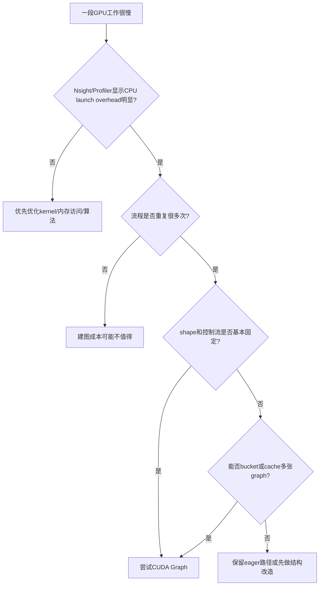

## 1. 先说结论

版本说明：本文写于2026-05-12，主要参考NVIDIA CUDA Programming Guide v13.2的CUDA Graphs章节、NVIDIA技术博客，以及PyTorch当前main文档里的CUDA semantics。CUDA Graph本身比较稳定，但不同CUDA Toolkit、驱动、GPU架构和框架版本的性能细节会变化，所以生产环境要以本机实测为准。

CUDA Graph解决的核心问题很简单：

**当你的程序反复提交一串相似的GPU操作时，不要每次都让CPU一个一个launch kernel，而是先把这串操作录成一张图，后面反复replay这张图。**

它最适合下面这种场景：

1. 每轮执行的CUDA操作很多。
2. 单个kernel很短，CPU launch overhead占比明显。
3. 执行流程、依赖关系、tensor shape、内存地址大体固定。
4. 这段流程会重复很多次，比如训练迭代、推理decode、仿真 timestep、图像处理pipeline。

它不适合下面这种场景：

1. 每次控制流都不一样。
2. shape频繁变化，且不能做bucket。
3. 每个kernel本身很重，launch overhead占比很小。
4. 捕获过程中需要频繁同步、CPU读回结果、动态分配内存。

一句话总结：

**CUDA Graph不是让单个kernel算得更快，而是让一串GPU任务提交得更便宜、更稳定。**

## 2. 先理解普通CUDA launch的开销

写CUDA时，我们经常这样提交kernel：

```cpp
kernel_a<<<grid, block, 0, stream>>>(...);
kernel_b<<<grid, block, 0, stream>>>(...);
kernel_c<<<grid, block, 0, stream>>>(...);
```

这三行看起来只是“告诉GPU跑三个函数”，但每一次launch背后CPU runtime和driver都要做一些准备工作，比如参数处理、依赖处理、命令提交、调度相关工作。对一个运行几毫秒的大kernel来说，这点开销通常不明显；但对运行几微秒的小kernel来说，launch overhead就可能变成主要成本。

一个粗略例子：

```text
每轮有30个小kernel
每个kernel真正GPU计算时间: 8 us
每次launch相关CPU开销: 4 us
每轮重复10000次
```

如果逐个launch，单轮大致是：

$$
30 \times (8 + 4) = 360\ \mu s
$$

其中CPU提交相关开销约：

$$
30 \times 4 = 120\ \mu s
$$

如果这30个kernel可以被capture成一个CUDA Graph，后续每轮只需要一次graph launch。假设graph replay的提交开销是几微秒量级，那么单轮可能接近：

$$
30 \times 8 + 5 = 245\ \mu s
$$

真实数字一定要实测，但这个例子说明了CUDA Graph的收益来源：

**它主要减少CPU反复提交大量小任务的成本。**

NVIDIA官方博客里也用多个短kernel的例子展示过类似现象：当每个kernel本身只有几微秒时，普通launch的间隙会明显影响端到端时间；把一组kernel放进CUDA Graph后，可以用一次graph launch提交整组工作。

## 3. CUDA Graph到底是什么

CUDA Graph可以理解为一张“GPU任务依赖图”。

图里的点叫node，边表示依赖关系。node可以是：

1. kernel launch
2. memory copy
3. memset
4. host function
5. event record / wait
6. child graph
7. memory node
8. conditional node

例如下面这段流程：

```text
H2D copy -> preprocess kernel -> model kernel 1 -> model kernel 2 -> D2H copy
```

可以画成：



更复杂一点，可以有并行分支：



CUDA Graph的关键点是：**定义和执行分离**。

它通常分三步：

```text
Definition:    描述图里有哪些操作、依赖是什么
Instantiation: 把图变成可执行实例，做校验和预处理
Execution:     反复launch这个可执行实例
```

对应到CUDA Runtime API，大致是：

```text
cudaGraph_t      graph;      // 图模板
cudaGraphExec_t  graphExec;  // 可执行图实例

构建 graph
cudaGraphInstantiate(...)
cudaGraphLaunch(graphExec, stream)
cudaGraphLaunch(graphExec, stream)
cudaGraphLaunch(graphExec, stream)
```

这就是为什么第一次创建图可能比较贵，但后面replay便宜。CUDA Graph适合“先付一次建图成本，然后重复使用很多次”的工作负载。

## 4. Stream和CUDA Graph的关系

CUDA里原本就有stream。stream表示一条按顺序提交的异步任务队列：

```text
stream0: kernel A -> kernel B -> kernel C
```

多个stream之间可以用event表达依赖：

```text
stream0: kernel A -> record event
stream1: wait event -> kernel B
```

CUDA Graph不是替代stream，而是另一种提交模型。一个很常见的做法是：

1. 先按原来的stream方式写代码。
2. 用stream capture把这段stream操作录下来。
3. 得到一张CUDA Graph。
4. 实例化后反复launch。

可以理解为：

```text
普通模式:
CPU每轮逐个提交 A、B、C、D

Graph模式:
CPU第一轮录制 A、B、C、D
CPU后续每轮只提交 graphExec
```

## 5. 两种建图方式

CUDA Graph主要有两种创建方式。

### 5.1 显式Graph API

显式API就是手动创建图、添加node、添加依赖：

```cpp
cudaGraphCreate(&graph, 0);
cudaGraphAddKernelNode(&node_a, graph, deps, num_deps, &params_a);
cudaGraphAddKernelNode(&node_b, graph, &node_a, 1, &params_b);
cudaGraphInstantiate(&graph_exec, graph, nullptr, nullptr, 0);
```

优点是控制精确，可以清楚地管理每个node。缺点是写起来繁琐，尤其是已有代码本来就是按stream写的。

### 5.2 Stream Capture

stream capture更常用。它把一段原本提交到stream的CUDA工作记录成图：

```cpp
cudaStreamBeginCapture(stream, cudaStreamCaptureModeGlobal);

kernel_a<<<grid, block, 0, stream>>>(...);
kernel_b<<<grid, block, 0, stream>>>(...);
kernel_c<<<grid, block, 0, stream>>>(...);

cudaStreamEndCapture(stream, &graph);
cudaGraphInstantiate(&graph_exec, graph, nullptr, nullptr, 0);
```

这段capture期间，kernel并不会真的执行，而是被记录进图里。后面调用：

```cpp
cudaGraphLaunch(graph_exec, stream);
```

才会真正提交整张图。

所以stream capture适合把已有代码低成本迁移到CUDA Graph。

## 6. C++完整示例：把三个小kernel录成一张图

下面是一个简化但完整的CUDA C++示例。它先warm up，再capture三个kernel，最后多次replay。

```cpp
// cuda_graph_demo.cu
#include <cuda_runtime.h>

#include <cstdio>
#include <cstdlib>

#define CHECK_CUDA(call)                                                     \
  do {                                                                       \
    cudaError_t err = (call);                                                \
    if (err != cudaSuccess) {                                                \
      std::fprintf(stderr, "CUDA error %s:%d: %s\n", __FILE__, __LINE__,     \
                   cudaGetErrorString(err));                                 \
      std::exit(1);                                                          \
    }                                                                        \
  } while (0)

__global__ void add_bias(float* x, float bias, int n) {
  int i = blockIdx.x * blockDim.x + threadIdx.x;
  if (i < n) {
    x[i] += bias;
  }
}

__global__ void mul_scale(float* x, float scale, int n) {
  int i = blockIdx.x * blockDim.x + threadIdx.x;
  if (i < n) {
    x[i] *= scale;
  }
}

__global__ void relu(float* x, int n) {
  int i = blockIdx.x * blockDim.x + threadIdx.x;
  if (i < n) {
    x[i] = x[i] > 0.0f ? x[i] : 0.0f;
  }
}

int main() {
  const int n = 1 << 20;
  const int threads = 256;
  const int blocks = (n + threads - 1) / threads;

  float* d_x = nullptr;
  CHECK_CUDA(cudaMalloc(&d_x, n * sizeof(float)));
  CHECK_CUDA(cudaMemset(d_x, 0, n * sizeof(float)));

  cudaStream_t stream;
  CHECK_CUDA(cudaStreamCreate(&stream));

  // Warmup: 让CUDA context、kernel module等初始化成本不要混进测量。
  for (int i = 0; i < 3; ++i) {
    add_bias<<<blocks, threads, 0, stream>>>(d_x, 1.0f, n);
    mul_scale<<<blocks, threads, 0, stream>>>(d_x, 0.5f, n);
    relu<<<blocks, threads, 0, stream>>>(d_x, n);
  }
  CHECK_CUDA(cudaStreamSynchronize(stream));

  cudaGraph_t graph;
  cudaGraphExec_t graph_exec;

  CHECK_CUDA(cudaStreamBeginCapture(stream, cudaStreamCaptureModeGlobal));
  add_bias<<<blocks, threads, 0, stream>>>(d_x, 1.0f, n);
  mul_scale<<<blocks, threads, 0, stream>>>(d_x, 0.5f, n);
  relu<<<blocks, threads, 0, stream>>>(d_x, n);
  CHECK_CUDA(cudaStreamEndCapture(stream, &graph));

  CHECK_CUDA(cudaGraphInstantiate(&graph_exec, graph, nullptr, nullptr, 0));
  CHECK_CUDA(cudaGraphDestroy(graph));

  for (int iter = 0; iter < 1000; ++iter) {
    CHECK_CUDA(cudaGraphLaunch(graph_exec, stream));
  }
  CHECK_CUDA(cudaStreamSynchronize(stream));

  CHECK_CUDA(cudaGraphExecDestroy(graph_exec));
  CHECK_CUDA(cudaStreamDestroy(stream));
  CHECK_CUDA(cudaFree(d_x));
  return 0;
}
```

编译：

```bash
nvcc -O3 cuda_graph_demo.cu -o cuda_graph_demo
./cuda_graph_demo
```

这个例子里要注意三件事：

1. capture时提交的kernel不会立刻执行，而是被记录。
2. `cudaGraphInstantiate`可能比较贵，不应该放在热路径里反复调用。
3. `cudaGraphLaunch`可以反复调用同一个`graph_exec`。

## 7. 更贴近真实业务的例子：固定shape推理pipeline

假设一个推理服务每次都做：

```text
H2D copy input
normalize kernel
model layer kernels
postprocess kernel
D2H copy output
```

如果输入shape固定，比如永远是`batch=16, channels=3, height=224, width=224`，那么它很适合CUDA Graph。

普通方式：

```text
每个请求/批次:
    cudaMemcpyAsync(input)
    normalize<<<...>>>()
    conv/attention/gemm kernels...
    postprocess<<<...>>>()
    cudaMemcpyAsync(output)
```

Graph方式：

```text
初始化:
    分配固定输入输出buffer
    capture整段pipeline
    instantiate graphExec

每个请求/批次:
    把新输入copy到固定input buffer
    cudaGraphLaunch(graphExec)
    从固定output buffer读取结果
```

核心约束是“固定buffer”。CUDA Graph replay时，图里的操作会使用capture时记录的内存地址。你不能每次换一个全新的input tensor地址，然后期望旧graph自动指向新地址。常见做法是：

1. 长期持有一块`static_input`。
2. 每次把新输入复制到`static_input`。
3. replay graph。
4. 从长期持有的`static_output`读结果。

这也是PyTorch CUDA Graph示例里反复强调的模式。

## 8. PyTorch示例：固定输入地址后replay

PyTorch暴露了`torch.cuda.CUDAGraph`、`torch.cuda.graph`和`torch.cuda.make_graphed_callables`。下面是一个最小推理例子：

```python
import torch

torch.manual_seed(0)

device = "cuda"
model = torch.nn.Sequential(
    torch.nn.Linear(1024, 4096),
    torch.nn.ReLU(),
    torch.nn.Linear(4096, 1024),
).to(device).eval()

batch = 32
static_input = torch.empty((batch, 1024), device=device)

# warmup必须在side stream上做，避免把初始化开销录进graph。
warmup_stream = torch.cuda.Stream()
warmup_stream.wait_stream(torch.cuda.current_stream())
with torch.cuda.stream(warmup_stream):
    for _ in range(3):
        static_output = model(static_input)
torch.cuda.current_stream().wait_stream(warmup_stream)

graph = torch.cuda.CUDAGraph()
with torch.cuda.graph(graph):
    static_output = model(static_input)

def infer(x: torch.Tensor) -> torch.Tensor:
    # x的shape必须和static_input一致。
    static_input.copy_(x)
    graph.replay()
    return static_output

for _ in range(10):
    x = torch.randn((batch, 1024), device=device)
    y = infer(x)
    # 如果后续逻辑也在GPU上，可以直接使用y；需要CPU结果时再同步/拷贝。
```

这段代码的重点不是`model`多复杂，而是内存语义：

1. capture时`model(static_input)`产生的CUDA操作被录下来。
2. replay时图仍然读取同一个`static_input`地址。
3. 所以新请求要先`copy_`到这块固定地址。
4. `static_output`也要长期持有，因为replay会写回同一个输出地址。

如果你每次都写：

```python
x = torch.randn((batch, 1024), device="cuda")
y = model(x)
```

那每次`x`和`y`的地址可能不同，不符合最朴素的CUDA Graph replay模式。

## 9. 训练也能用CUDA Graph吗

能，但限制比推理更多。

训练一步通常包括：

```text
forward
loss
backward
optimizer.step
```

如果shape固定，模型控制流固定，优化器行为capturable，就可以把一整个训练step capture起来。PyTorch官方文档也给了类似示例：capture前先warmup，capture时执行forward、loss、backward和optimizer step，后续replay。

但是训练更容易遇到这些问题：

1. optimizer内部可能有不支持capture的CPU逻辑。
2. AMP的`GradScaler.update()`这类动态逻辑可能不适合放进capture。
3. backward会涉及grad tensor分配，通常要在capture前把grad设成`None`并让它们从graph私有内存池里创建。
4. dropout、随机数、动态shape、条件分支都要仔细处理。

所以训练里常见策略是：

1. 先只capture模型主体的一段。
2. 确认收益后，再扩大capture范围。
3. 对不同shape做不同graph。
4. 保留fallback路径。

## 10. CUDA Graph和kernel fusion的区别

很多人会问：CUDA Graph和kernel fusion是不是解决同一个问题？

不是。

kernel fusion是把多个kernel合成一个kernel，例如：

```text
kernel A: x = x + bias
kernel B: x = relu(x)

融合后:
kernel F: x = relu(x + bias)
```

它减少的是：

1. kernel launch次数
2. 中间结果读写global memory的次数
3. kernel之间的调度和同步开销

CUDA Graph则是不改变kernel本身，只改变提交方式：

```text
kernel A -> kernel B -> kernel C
```

仍然是三个kernel，只是它们被作为一张图一起提交。

对比一下：

| 方案 | 改kernel代码 | 减少launch overhead | 减少global memory往返 | 适合 |
| --- | --- | --- | --- | --- |
| Kernel fusion | 通常需要 | 是 | 是 | 小算子链、elementwise、固定模式 |
| CUDA Graph | 不一定 | 是 | 否 | 多kernel重复流程、框架生成的大量CUDA工作 |

实践里两者可以叠加。比如深度学习框架先做算子融合，再把剩下的一串CUDA操作capture成graph。

## 11. 动态shape怎么办

CUDA Graph最喜欢固定shape，但真实业务常常有动态shape。

常见处理方式有三种。

### 11.1 Shape bucketing

把动态shape归到有限个bucket：

```text
seq_len 1-128     -> graph_128
seq_len 129-256   -> graph_256
seq_len 257-512   -> graph_512
seq_len 513-1024  -> graph_1024
```

每个bucket维护一张或几张CUDA Graph。新请求来了以后，padding到对应bucket，再replay对应graph。

优点：

1. 实现相对简单。
2. replay路径稳定。
3. 非常适合LLM serving里的固定batch/固定seq_len组合。

缺点：

1. padding会浪费计算。
2. bucket太多会增加显存和管理复杂度。
3. 极端shape可能仍然要fallback。

### 11.2 Graph update

如果图的拓扑不变，只是kernel参数、grid、block或某些地址发生有限变化，可以尝试更新已有`cudaGraphExec_t`，例如使用`cudaGraphExecUpdate`或针对kernel node设置新参数。

适合：

1. node数量不变。
2. 依赖关系不变。
3. 只是参数变化。

不适合：

1. 控制流变化导致node数量变化。
2. 某些kernel有时出现、有时不出现。
3. 内存分配和释放模式变化很大。

NVIDIA专门有技术博客讨论“dynamic environment”里复用或更新CUDA Graph，核心思想就是：**能不重新instantiate，就不要在热路径里重新instantiate。**

### 11.3 Recapture + cache

如果变化比较复杂，可以按参数组合缓存graph：

```text
key = (batch_size, seq_len, dtype, layout)
if key not in graph_cache:
    capture_and_instantiate(key)
launch(graph_cache[key])
```

这也是很多推理系统会采用的思路。第一次遇到某个shape会慢一点，后面命中缓存就快。

## 12. LLM推理为什么经常提CUDA Graph

LLM推理尤其是decode阶段，很容易受益于CUDA Graph。

decode每一步通常只为每个请求生成一个新token。对单步decode来说，GPU上可能会有很多小操作：

```text
layer norm
QKV projection
attention
MLP
residual
sampling
KV cache update
```

如果每一步都由CPU逐个提交大量kernel，CPU launch overhead和调度抖动会变得明显。CUDA Graph可以把固定batch、固定shape下的一步decode录下来，然后每个decode step replay。

但LLM serving也有难点：

1. batch size会变。
2. sequence length会变。
3. KV cache地址和block table会变。
4. continuous batching会让每一步参与请求不同。
5. speculative decoding、prefix caching、chunked prefill会带来更多动态性。

所以实际系统通常不会只维护一张graph，而是维护一组graph：

```text
graph(batch=1)
graph(batch=2)
graph(batch=4)
graph(batch=8)
graph(batch=16)
...
```

或者按更细的shape和模式建缓存。不能命中的情况走普通eager路径，或者触发新graph capture。

可以把它理解成：



## 13. Capture期间常见禁忌

CUDA Graph最容易踩坑的地方在capture阶段。

### 13.1 不要在capture里做非法同步

capture期间，这些操作经常会出问题：

```cpp
cudaDeviceSynchronize();
cudaStreamSynchronize(capturing_stream);
cudaMemcpy(...); // 同步版本，常隐式使用legacy stream并同步
```

原因是capture时stream里的工作还没有真正入队执行，只是在构建图。你不能在这时查询或同步“正在被capture的工作”。

应该尽量使用异步API：

```cpp
cudaMemcpyAsync(dst, src, bytes, cudaMemcpyHostToDevice, stream);
```

并确保它被capture进同一张图，或者放在capture外面。

### 13.2 小心legacy default stream

NVIDIA文档明确提到，stream capture不能用于`cudaStreamLegacy`，也就是传统NULL stream。capture期间混用legacy stream还可能因为隐式依赖导致错误。

更稳妥的做法是显式创建非阻塞stream：

```cpp
cudaStream_t stream;
cudaStreamCreateWithFlags(&stream, cudaStreamNonBlocking);
```

### 13.3 不要在replay路径里换地址

最常见的PyTorch问题是：

```python
with torch.cuda.graph(g):
    y = model(x)

# 后面换了一个全新的x
x = torch.randn_like(x)
g.replay()
```

这通常不是你想要的。graph里记录的是capture时的地址。正确方式是保持`static_input`不变，然后把新数据copy进去：

```python
static_input.copy_(new_input)
g.replay()
```

### 13.4 随机数和状态要谨慎

如果capture里有随机操作，要确认框架如何处理随机数状态。否则你可能以为每次replay都有新随机数，实际得到的是重复模式，或者触发框架报错。

### 13.5 内存分配要稳定

capture期间如果触发动态分配，框架通常需要特殊内存池支持。PyTorch CUDA Graph会使用私有内存池来保证replay时地址稳定。你要避免在热路径里制造不可控的新分配。

## 14. 怎么判断该不该用CUDA Graph

可以按这个流程判断：



更具体的检查项：

1. 用Nsight Systems看CPU提交和GPU kernel之间是否有明显gap。
2. 对比单个kernel运行时间和launch overhead。
3. 测量capture + instantiate成本。
4. 测量第一次launch和后续repeat launch。
5. 测量端到端吞吐、P50/P99 latency，而不是只看某个kernel。
6. 确认graph replay不会引入额外显存压力。

NVIDIA 2024年的技术博客提到，在CUDA 12.6和Ampere架构测试中，straight-line kernel graph的repeat launch CPU overhead相比CUDA 11.8有显著改善，某些场景接近常数级。但这类数字强依赖硬件、驱动、CUDA版本和图拓扑，不能直接照搬到自己的业务。

## 15. 一个简单benchmark应该怎么写

不要只测：

```cpp
cudaGraphLaunch(...);
```

然后立刻下结论。更合理的benchmark至少分开测：

1. eager模式端到端时间。
2. capture + instantiate时间。
3. graph第一次launch时间。
4. graph repeat launch平均时间。
5. 不同重复次数下的摊销收益。

伪代码：

```cpp
// 1. warmup
run_eager_many_times();
cudaStreamSynchronize(stream);

// 2. eager timing
start_cpu_timer();
for (int i = 0; i < iters; ++i) {
  run_eager_once(stream);
}
cudaStreamSynchronize(stream);
stop_cpu_timer();

// 3. capture + instantiate timing
start_cpu_timer();
capture_graph();
instantiate_graph();
stop_cpu_timer();

// 4. graph repeat timing
start_cpu_timer();
for (int i = 0; i < iters; ++i) {
  cudaGraphLaunch(graph_exec, stream);
}
cudaStreamSynchronize(stream);
stop_cpu_timer();
```

收益可以粗略看：

$$
\mathrm{SavedTime}
= T_{\mathrm{eager}} -
\left(T_{\mathrm{instantiate}} + N \times T_{\mathrm{graph\ replay}}\right)
$$

当$N$足够大时，`instantiate`成本被摊薄，CUDA Graph才更容易赢。

## 16. 常见误解

### 16.1 CUDA Graph会自动优化我的kernel吗

不会。它不会把一个低效kernel自动变成高效kernel。它主要优化提交、依赖和调度层面的开销。kernel内部访存不合并、occupancy低、shared memory冲突，这些还是要靠kernel优化。

### 16.2 CUDA Graph一定比普通stream快吗

不一定。如果你的kernel很重，launch overhead占比很低，CUDA Graph可能收益很小。第一次capture和instantiate还会额外花时间。

### 16.3 CUDA Graph只能录kernel吗

不是。它还可以包含memcpy、memset、event、host node、child graph等node类型。但不是所有CUDA API都能在capture里使用，尤其要小心同步API和legacy stream。

### 16.4 动态shape就完全不能用吗

不是。可以用bucket、graph cache、graph update或者fallback路径。只是工程复杂度会上升。

### 16.5 PyTorch里用了`torch.compile`还需要CUDA Graph吗

这要看后端和实际执行路径。`torch.compile`可能做图级优化、算子融合、调度优化，有些后端也会使用CUDA Graph相关能力。但从使用者角度看，仍然要用profile确认瓶颈。如果瓶颈是CPU提交大量CUDA工作，CUDA Graph仍然可能有价值。

## 17. 实践建议

如果你准备在项目里引入CUDA Graph，可以按下面顺序做：

1. 先profile，确认有CPU launch overhead或GPU间隙问题。
2. 找一段最稳定、重复次数最多的GPU流程。
3. 固定输入输出buffer，先做最小capture。
4. 加eager fallback，方便处理异常shape。
5. 加graph cache，按`batch/shape/dtype`等key管理多张graph。
6. 记录capture、instantiate、first launch、repeat launch的指标。
7. 做端到端压测，重点看吞吐和P99 latency。
8. 再考虑扩大capture范围。

最重要的是：

**CUDA Graph是一种工程手段，不是魔法开关。先证明瓶颈，再引入它。**

## 18. 总结

CUDA Graph把一串CUDA操作从“每次逐个提交”变成“先定义、实例化，再反复launch”。它的收益来自减少CPU launch overhead、让CUDA提前看到整段workflow，并在重复执行场景中摊薄建图成本。

初学者可以抓住四个关键词：

1. **Graph**：一组CUDA操作和依赖。
2. **Capture**：把stream上的操作录成图。
3. **Instantiate**：把图模板变成可执行实例。
4. **Replay**：反复launch同一个实例。

工程上最常见的约束是：

1. shape尽量固定。
2. 控制流尽量固定。
3. replay使用固定内存地址。
4. capture里不要做非法同步。
5. 动态场景用bucket、cache、update或fallback。

如果你做的是LLM推理、训练step、仿真循环、图像处理pipeline、批量小kernel工作流，CUDA Graph都值得了解和实测。

## 参考

1. [NVIDIA CUDA Programming Guide v13.2: CUDA Graphs](https://docs.nvidia.com/cuda/archive/13.2.0/cuda-programming-guide/04-special-topics/cuda-graphs.html)
2. [NVIDIA Technical Blog: Getting Started with CUDA Graphs](https://developer.nvidia.com/blog/cuda-graphs/)
3. [NVIDIA Technical Blog: Employing CUDA Graphs in a Dynamic Environment](https://developer.nvidia.com/blog/employing-cuda-graphs-in-a-dynamic-environment/)
4. [NVIDIA Technical Blog: Constant Time Launch for Straight-Line CUDA Graphs and Other Performance Enhancements](https://developer.nvidia.com/blog/constant-time-launch-for-straight-line-cuda-graphs-and-other-performance-enhancements/)
5. [PyTorch CUDA semantics: CUDA Graphs](https://docs.pytorch.org/docs/main/notes/cuda.html#cuda-graphs)
6. [PyTorch API: torch.cuda.CUDAGraph](https://docs.pytorch.org/docs/stable/generated/torch.cuda.CUDAGraph.html)
