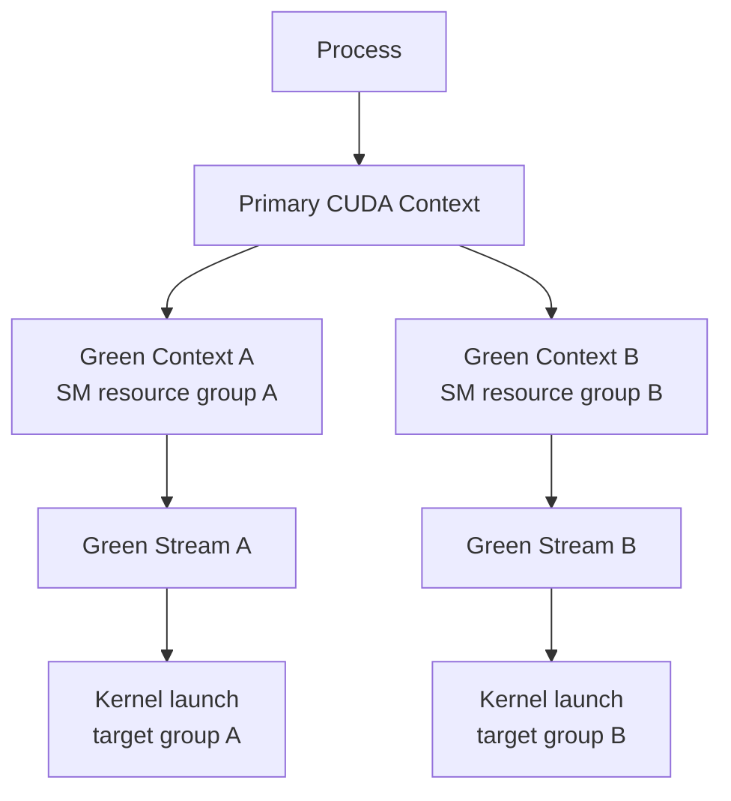
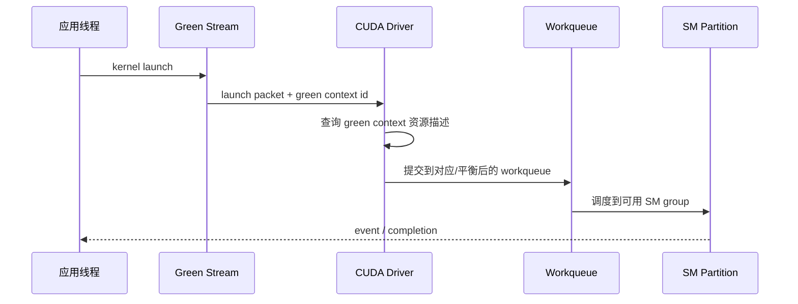
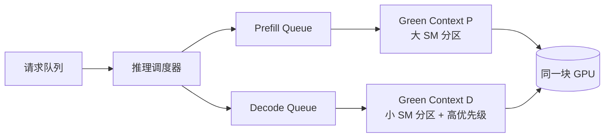

> 版本说明：本文写于 2026-06-15，主要参考 NVIDIA CUDA Driver API v13.3.0 Green Contexts 文档、CUDA 12.4 归档文档，以及 PyTorch main 分支中的 `torch.cuda.green_contexts.GreenContext` 文档。CUDA Green Context 仍在演进，尤其是 workqueue 配置、运行时封装和上层框架支持，生产使用时应以实际 CUDA Toolkit、driver、GPU 架构和框架版本为准。

## 1. 先说结论

CUDA Green Context 是 CUDA Driver API 里的一种轻量级 context 机制。它的核心能力不是“省电”，而是：

**在同一块 GPU 上创建带资源约束的 CUDA context，让发到这个 context 关联 stream 上的 kernel 尽量只使用指定的设备资源，当前最重要的是 SM 子集和 workqueue 配置。**

可以把它理解成介于普通 CUDA stream 和 MIG 之间的一层软件资源分区能力：

| 机制 | 控制粒度 | 隔离强度 | 典型用途 |
|---|---|---|---|
| CUDA stream | 同一 context 内的执行队列和依赖关系 | 很弱，不限制 SM 集合 | 表达异步、依赖和并发机会 |
| Green Context | context/stream 级别的 SM 子集与 workqueue 配置 | 中等偏弱，属于软件资源选择 | 同进程内把不同工作负载引导到不同 SM 分区 |
| MPS | 多进程共享同一 GPU 的服务端调度 | 中等，面向多进程吞吐和并发 | 多个进程共享 GPU，减少 context 切换 |
| MIG | 硬件级 GPU slice | 强，包含显存容量、部分缓存/引擎等硬隔离 | 多租户、强资源边界、云实例切分 |

Green Context 最容易误解的点有三个：

1. 它不是 MIG。它不会把 GPU 变成几个硬件隔离的小 GPU，也不会给你独立显存容量边界。
2. 它不是普通 stream priority。stream priority 影响调度优先级，Green Context 试图限制 kernel 可用的资源集合。
3. 它不是强 QoS 合约。NVIDIA 文档明确提醒：即使两个 green context 使用不相交的 SM 分区，也不保证其中的 kernel 一定并发运行，也不保证 forward progress，因为还有 workqueue、内存系统、copy engine、依赖关系等其他资源可能互相影响。

如果只记一句话：

**Green Context 给 CUDA 程序一个“按 stream 发送到指定 SM 分区”的软件入口，但它提供的是资源选择和减少干扰的机会，不是完整硬隔离。**

## 2. 为什么需要 Green Context

传统 CUDA 程序常常只有一个默认思路：一个进程拿到一个 device，创建 context，在这个 context 下创建多个 stream，然后让 CUDA runtime/driver 和 GPU 调度器自己决定 kernel 怎么并发。

这对很多 HPC 或训练任务是合理的，因为目标通常是把整卡吃满。但新一代 GPU 服务场景里，经常会出现“同一张卡上有几类延迟敏感度完全不同的工作”：

1. LLM 推理中，prefill 是大吞吐、大矩阵乘，decode 是小 batch、逐 token、尾延迟敏感。
2. 在线服务里，主请求路径要低延迟，后台压缩、cache eviction、embedding refresh 可以慢一点。
3. 多模型服务里，一个大模型 batch 可能长时间占满 SM，小模型或控制 kernel 被拖慢。
4. benchmark 和 profiling 里，希望测“只给 N 个 SM 时吞吐怎么变化”，而不是通过降低 block 数间接估算。

只用 stream 很难表达这种需求。你可以创建两个 stream，也可以给 decode stream 更高 priority，但这仍然没有告诉 driver：

```text
prefill stream: 尽量只用 SM 0-107
decode  stream: 尽量只用 SM 108-119
```

MIG 可以做强隔离，但代价也更高：

1. 需要硬件和部署层支持。
2. 切分粒度固定，不适合在一个进程里频繁改变策略。
3. 切开之后就是几个逻辑 GPU，跨 slice 的共享和调度更重。

Green Context 解决的是更细的一层问题：

**不改变物理 GPU 拓扑，不创建 MIG slice，只在 CUDA Driver API 层创建资源受限的 context，再把 stream 和 kernel launch 绑定到这些 context 上。**

## 3. 从普通 CUDA Context 讲起

CUDA context 可以粗略理解为 GPU 侧的进程状态容器。它持有和隔离很多运行时状态：

1. module 和 kernel 装载状态。
2. device memory allocation 所属关系。
3. stream、event 等执行对象。
4. 当前 device、地址空间、错误状态等上下文。

普通 context 的心智模型是：

```text
Process
  -> CUDA context on GPU0
       -> Stream A
       -> Stream B
       -> Stream C
```

这些 stream 表达的是顺序和依赖：

1. 同一个 stream 内的任务按顺序执行。
2. 不同 stream 之间如果没有 event 或同步依赖，就有并发机会。
3. 是否真的并发，取决于 kernel 资源占用、调度器、SM 空闲情况、硬件限制等。

但普通 stream 不携带“只能用哪些 SM”的语义。一个小 kernel 发到高优先级 stream，不代表它有一组保留 SM；一个大 kernel 发到低优先级 stream，也不代表它不会抢到绝大多数 SM。

Green Context 在这个模型里加了一层：



这里的关键不是多了一个名字，而是 `Green Stream A` 和 `Green Context A` 关联；发到这个 stream 的 kernel 会带着 green context 的资源约束进入 driver 调度路径。

## 4. Green Context 的创建流程

NVIDIA Driver API 文档给出的流程可以拆成五步。

### 4.1 查询设备资源

第一步是从 device 上拿到初始资源描述。当前最重要的是两类：

1. `CU_DEV_RESOURCE_TYPE_SM`：表示 SM 资源。
2. `CU_DEV_RESOURCE_TYPE_WORKQUEUE_CONFIG`：表示 workqueue 配置资源。

典型入口是：

```c
cuDeviceGetDevResource(device, &resource, CU_DEV_RESOURCE_TYPE_SM);
```

得到的不是“已经切好的 slice”，而是一份可以继续分割或修改的资源描述。

### 4.2 切分 SM 资源

拿到 SM 资源之后，可以把它切成一个或多个 group。文档里有两个方向：

1. `cuDevSmResourceSplitByCount`：按最小 SM 数切分，API 会受默认粒度约束影响，可能发生 round up 和 alignment。
2. `cuDevSmResourceSplit`：更显式地创建结构化 group，可以创建非等分 group，但调用方需要自己查询并满足粒度要求。

当前文档给出的大致架构约束是：

1. Compute Capability 7.x、8.x 和 Tegra SoC：`smCount` 通常需要是 2 的倍数，默认 co-scheduled alignment 是 2。
2. Compute Capability 9.0+：`smCount` 通常需要是 8 的倍数，或者满足显式提供的 `coscheduledSmCount`；默认 alignment 是 8。

这里的 `coscheduledSmCount` 很重要。Green Context 不是简单地给你一个数字“12 个 SM”，而是尽量表达一组可以被共同调度的结构化 SM 资源。对 Hopper 之后的 cluster launch、cooperative group、occupancy 估算等场景，SM 是否能被 co-scheduled 会影响真实可用性。

一个直观例子：

```text
GPU: 120 SM

目标:
  - prefill: 96 SM
  - decode : 16 SM
  - reserve: 8 SM

切分结果:
  group A: 96 SM, structured
  group B: 16 SM, structured
  remainder: 8 SM, unstructured or later再处理
```

这不是说 SM 编号一定按文本连续分配。用户不应该假设自己拿到了具体的 `SM 0-95`。API 暴露的是资源 group 和调度属性，而不是让应用直接管理物理 SM 编号。

### 4.3 配置 workqueue

Green Context 不只关心 SM。新版 Driver API 还提供 workqueue 配置资源，其中两个字段尤其关键：

1. `wqConcurrencyLimit`：期望的最大并发 stream-ordered workload 数量。
2. `sharingScope`：workqueue 资源怎么在 context 之间共享。

`sharingScope` 主要有两类：

1. `CU_WORKQUEUE_SCOPE_DEVICE_CTX`：使用整个 device context 下共享的 workqueue 资源，也就是默认 driver 行为。
2. `CU_WORKQUEUE_SCOPE_GREEN_CTX_BALANCED`：在可能的情况下，让 balanced green contexts 使用非重叠 workqueue 资源。

为什么 SM 都切开了，还要管 workqueue？因为 kernel 能不能并发推进，不只取决于 SM 是否重叠。提交队列、调度队列、依赖处理、内部资源都可能成为干扰点。

NVIDIA 文档的表述很谨慎：不相交 SM 分区也不保证并发和 forward progress；如果同时使用不相交 SM 与 balanced workqueue，能提高避免干扰的机会。这个措辞说明 Green Context 目前更像“尽量减少干扰的资源描述”，不是严格实时调度器。

### 4.4 生成资源 descriptor

资源切分和配置完成后，需要调用：

```c
cuDevResourceGenerateDesc(&desc, resources, nbResources);
```

这一步把一组 device resource 变成 `CUdevResourceDesc`。可以把它理解成：

```text
SM group + workqueue config + device compatibility checks
    -> CUdevResourceDesc
```

这个 descriptor 是创建 green context 的输入。API 会检查资源是否来自同一个 device、SM 资源是否来自兼容的 split、alignment 是否一致等条件。

### 4.5 创建 Green Context 和 Green Stream

最后创建 green context：

```c
cuGreenCtxCreate(&green_ctx, desc, device, flags);
```

然后创建和它关联的 stream：

```c
cuGreenCtxStreamCreate(&stream, green_ctx, flags, priority);
```

之后应用把 kernel、memcpy、event 等操作发到这个 stream，就进入了 green context 对应的执行路径。

简化后的伪代码如下：

```c
CUdevice dev;
CUdevResource sm_all;
CUdevResource sm_groups[2];
CUdevResourceDesc desc_a;
CUgreenCtx green_a;
CUstream stream_a;

cuInit(0);
cuDeviceGet(&dev, 0);

cuDeviceGetDevResource(dev, &sm_all, CU_DEV_RESOURCE_TYPE_SM);

CU_DEV_SM_RESOURCE_GROUP_PARAMS params[2] = {
    {.smCount = 96, .coscheduledSmCount = 8},
    {.smCount = 16, .coscheduledSmCount = 8},
};

cuDevSmResourceSplit(sm_groups, 2, &sm_all, NULL, 0, params);
cuDevResourceGenerateDesc(&desc_a, &sm_groups[0], 1);
cuGreenCtxCreate(&green_a, desc_a, dev, 0);
cuGreenCtxStreamCreate(&stream_a, green_a, CU_STREAM_NON_BLOCKING, 0);

my_kernel<<<grid, block, 0, stream_a>>>(...);
```

上面只是展示控制流，不是可直接编译的完整示例。真实代码需要处理错误码、descriptor 生命周期、stream 销毁、context 栈切换、runtime API 与 driver API 混用等细节。

## 5. Kernel launch 后发生了什么

普通 CUDA launch 可以抽象成：

```text
kernel launch
  -> stream
  -> CUDA context
  -> driver scheduler
  -> GPU work queues
  -> SM scheduling
```

Green Context 增加的是“stream 所属 context 携带资源 descriptor”：



这条路径里有两个重要后果。

第一，Green Context 的约束是绑定在 stream/context 关系上的。你不能只创建一个 green context，然后继续把所有 kernel 发到默认 stream，还期待它自动生效。实际使用时，要么使用 `cuGreenCtxStreamCreate` 创建 green stream，要么把 green context 转成 `CUcontext` 并在正确的 context 下创建 stream。

第二，Green Context 不改变 kernel 自身的资源声明。kernel 的 register、shared memory、block size、cluster size、cooperative launch 约束仍然存在。你给某个 context 16 个 SM，如果 kernel 的 launch 形态需要更多 co-scheduled SM 或者资源不满足，调度效果可能和预期不同，甚至失败。

## 6. 和 Stream Priority 的区别

很多人第一次看到 Green Context，会把它和 stream priority 混在一起。它们解决的问题不同。

stream priority 的语义接近：

```text
如果有多个 ready work，优先考虑高优先级 stream。
```

Green Context 的语义接近：

```text
这个 stream 的 work 应该使用这组 device resource。
```

举个 LLM decode 的例子。假设一张 H100 上同时跑 prefill 和 decode：

```text
prefill: 大 GEMM，batch 大，吞吐优先
decode : 小 batch，逐 token，延迟敏感
```

只用 priority：

```text
prefill stream priority = low
decode  stream priority = high
```

decode 有机会更早被调度，但如果 prefill kernel 已经占住大量 SM，decode 仍可能等待。priority 不是资源预留。

用 Green Context：

```text
prefill green context: 96 SM
decode  green context: 16 SM
```

decode 的 kernel 有机会在自己的 SM group 上推进，减少被大 prefill kernel 干扰的概率。但这仍然不是绝对保证，因为还有 workqueue、内存带宽、L2、HBM、copy、依赖等共享资源。

实际系统里两者可以组合：

1. Green Context 做空间资源选择。
2. stream priority 做同一资源组内的优先级提示。
3. event 和 graph capture 管依赖。
4. 上层 scheduler 控制 batch、队列、prefill/decode 节奏。

## 7. 和 MPS 的区别

CUDA MPS 主要解决多进程共享 GPU 的问题。没有 MPS 时，多个进程各有 CUDA context，context 切换和并发能力受限；MPS 通过一个 server 把多个 client 的工作统一提交到 GPU，提高多进程并发和吞吐。

MPS 和 Green Context 的边界可以这样看：

| 对比项 | MPS | Green Context |
|---|---|---|
| 面向对象 | 多进程 client | CUDA Driver API context/stream |
| 主要目标 | 提高多进程共享 GPU 的并发与吞吐 | 在程序内表达资源子集 |
| 资源控制 | 可配置 active thread percentage 等限制 | 显式 SM resource group 和 workqueue scope |
| API 形态 | 系统服务与环境配置为主 | 应用直接调用 Driver API |
| 隔离语义 | 多进程共享调度 | context/stream 级资源选择 |

MPS 更像“让多个进程更好地共享一张卡”；Green Context 更像“让一个或少数 runtime 明确把不同 stream 送到不同资源组”。它们不是严格替代关系，但叠加使用时要非常小心，因为最终都落到同一套 driver 和 GPU 调度资源上。

## 8. 和 MIG 的区别

MIG 是硬件级分区。开启 MIG 后，一张 GPU 会被切成多个 GPU instance，每个 instance 有明确的计算、显存容量、部分缓存和硬件资源边界。上层通常看到的是多个 CUDA device。

Green Context 不改变 CUDA device 枚举，也不提供独立显存容量。它更像同一 device 内的软件资源视图：

```text
MIG:
  GPU0 -> GPU instance 0, GPU instance 1, GPU instance 2
  每个 instance 像独立设备，有较强隔离

Green Context:
  GPU0 -> primary context -> green context A/B/C
  仍在同一设备内，共享显存和很多全局资源
```

所以选择时可以按需求判断：

1. 要多租户强隔离、显存容量边界、云资源售卖：优先看 MIG。
2. 要同一推理进程内把 prefill/decode/后台任务做软分区：Green Context 更灵活。
3. 只是表达 kernel 依赖和异步并发：普通 stream 足够。
4. 多进程小任务共享 GPU：MPS 往往更直接。

## 9. 为什么 LLM 推理会关心它

LLM 推理里 Green Context 的吸引力主要来自 P/D 干扰问题。

prefill 阶段处理 prompt，全量计算输入 token 的 KV cache。它通常是大矩阵乘、吞吐导向，容易把 SM 和 HBM 带宽吃满。

decode 阶段逐 token 生成，每一步计算量小得多，但用户感知强烈。decode 抖动会直接体现为 inter-token latency 和尾延迟。

两者放在同一张卡上时，常见问题是：

```text
prefill batch 变大
  -> 大 kernel 占住 SM 和内存带宽
  -> decode token step 等待
  -> ITL / p99 latency 抖动
```

Green Context 提供了一种可能的形态：



这种设计的目标不是让 decode 永远不受影响，而是把干扰从“完全由 driver 和 kernel 形态自然竞争”变成“上层系统能显式留一部分计算资源给 decode”。

但真实收益取决于很多条件：

1. decode 是否真的被 SM 饥饿限制，而不是 HBM/L2/通信限制。
2. prefill kernel 是否足够大，是否长期占用整卡。
3. framework 是否能把不同 kernel 稳定发到不同 green stream。
4. CUDA Graph、NCCL、custom op、Triton kernel 是否都能继承正确 stream。
5. 留给 decode 的 SM 数量是否会反过来降低吞吐，导致排队更严重。

因此，Green Context 对 LLM 推理是一个很有价值的调度工具，但不是“打开就降延迟”的开关。

## 10. PyTorch 里的 GreenContext 封装

PyTorch main 文档里已经有 `torch.cuda.green_contexts.GreenContext`，并标注为 beta API。它提供了更 Pythonic 的入口：

```python
from torch.cuda.green_contexts import GreenContext

ctx = GreenContext.create(
    num_sms=16,
    workqueue_scope="balanced",
    workqueue_concurrency_limit=4,
    device_id=0,
)

stream = ctx.Stream()

with torch.cuda.stream(stream):
    # 在这个 stream 上提交的 CUDA work 会走对应 green context
    y = model_small(x)
```

文档里 `create` 的几个参数正好对应 Driver API 的核心资源：

1. `num_sms`：green context 使用的 SM 数量；为 `None` 时不切 SM。
2. `workqueue_scope`：`"device_ctx"` 或 `"balanced"`。
3. `workqueue_concurrency_limit`：workqueue 最大并发 stream-ordered workload 数。
4. `device_id`：目标 CUDA device。

PyTorch 封装说明了一个趋势：Green Context 不只是 C++ driver API 玩具，上层 ML framework 已经开始暴露它。但 beta 状态也意味着：

1. API 可能变化。
2. 并不是所有 PyTorch CUDA 路径都一定按你预期使用这个 stream。
3. 第三方 extension、Triton、NCCL、CUDA Graph capture 需要单独验证。
4. 多线程 dataloader、异步 engine、inference server 内部 stream 管理可能覆盖用户设置。

如果在 vLLM、SGLang、TensorRT-LLM 这类系统中使用 Green Context，真正要改的往往不是一行 `with stream`，而是 scheduler、worker、kernel launch、graph replay、通信 stream、memory copy stream 的整体归属关系。

## 11. 使用时的坑

### 11.1 不要把 SM 数理解成性能线性比例

给一个 workload 50% SM，不代表吞吐刚好变成 50%。原因包括：

1. kernel block 数不足时，少量 SM 可能已经够用。
2. HBM 带宽、L2、Tensor Core、register、shared memory 都可能成为瓶颈。
3. 小 kernel 的 launch overhead 和调度开销占比更高。
4. 某些 kernel 对 occupancy、cluster size、tile shape 很敏感。

所以 Green Context 的 benchmark 应该同时看吞吐、延迟、SM utilization、memory throughput、kernel timeline，而不是只看 `num_sms`。

### 11.2 不要假设 disjoint SM 就一定并发

NVIDIA 文档明确说，即使 green contexts 有不相交的 SM 分区，也不保证 kernel 并发运行或 forward progress。实际系统里还可能遇到：

1. workqueue 共享造成提交或调度干扰。
2. 一个 kernel 使用 cooperative launch 或 cluster 约束，影响调度。
3. 内存带宽被另一个分区打满。
4. 默认 stream、legacy stream 同步语义引入隐式依赖。
5. 框架内部在别的 stream 上提交了关键 kernel。

因此，如果目标是低延迟 QoS，Green Context 必须配合 profiling 验证，不能只看 API 调用成功。

### 11.3 注意 runtime API 和 driver API 混用

CUDA runtime API 建立在 driver API 之上，但高层框架通常会隐藏 context 和 stream 管理。Green Context 是 driver 层能力，混用时要特别确认：

1. 当前 CPU 线程的 context 栈是谁。
2. stream 是不是在 green context 下创建的。
3. kernel launch 用的是不是这个 stream。
4. event wait/record 是否跨 context 合法。
5. context destroy 前 stream 是否已经销毁。

Driver API 文档也提醒，`cuGreenCtxDestroy` 不会自动销毁通过 `cuGreenCtxStreamCreate` 或普通 stream API 创建的 stream，用户需要显式销毁 stream，否则可能产生资源泄漏；green context 销毁后再使用相关 stream 会返回类似 `CUDA_ERROR_STREAM_DETACHED` 的错误。

### 11.4 不要把它当安全隔离

Green Context 的名字容易让人联想到“绿色、隔离、节能、租户边界”，但它不是安全隔离机制。多个 green context 仍共享同一 GPU 的很多全局资源：

1. HBM 总容量和带宽。
2. L2 cache 和内部 interconnect。
3. copy engine、NVLink、PCIe 等 I/O 路径。
4. 同一进程的地址空间和对象生命周期。

如果需求是强租户隔离，应使用 MIG、容器/device plugin、权限控制和调度系统，而不是 Green Context。

## 12. 一个实际评估方法

如果要判断 Green Context 是否适合你的服务，可以按下面流程做实验。

### 12.1 建立 baseline

先跑不使用 Green Context 的 baseline：

```text
配置 A:
  prefill stream: normal
  decode  stream: high priority
  no SM partition

指标:
  TTFT p50/p95/p99
  ITL p50/p95/p99
  tokens/s
  GPU SM utilization
  HBM bandwidth
  kernel overlap timeline
```

### 12.2 做 SM sweep

然后固定 workload，扫描 decode 分区大小：

```text
配置 B1: decode 8 SM,  prefill rest
配置 B2: decode 16 SM, prefill rest
配置 B3: decode 24 SM, prefill rest
配置 B4: decode 32 SM, prefill rest
```

观察：

1. ITL p99 是否下降。
2. TTFT 是否恶化。
3. 总吞吐是否下降太多。
4. decode 分区是否真的有 kernel overlap。
5. prefill 队列是否因为 SM 减少而排队变长。

### 12.3 加 workqueue balanced

如果只切 SM 效果不稳定，再测试：

```text
workqueue_scope = "balanced"
workqueue_concurrency_limit = 适配设备和 workload 的值
```

目标是看 workqueue 干扰是否下降，而不是盲目相信 balanced 一定更好。

### 12.4 看 Nsight Systems

Green Context 的验证不应该只看业务指标，还应该看 timeline：

1. prefill kernel 和 decode kernel 是否真的重叠。
2. decode kernel 是否还在长时间排队。
3. 是否有默认 stream 隐式同步。
4. copy、NCCL、custom kernel 是否跑到了错误 stream。
5. CUDA Graph replay 是否仍然保持 green stream 语义。

如果 timeline 上没有看到预期变化，业务指标偶然变好也不应轻易归因于 Green Context。

## 13. 适合和不适合的场景

适合优先尝试：

1. 同一进程内有两类 GPU workload，一个吞吐优先，一个延迟优先。
2. 延迟敏感 kernel 经常被大 kernel 阻塞，而且 profiling 显示 SM 饥饿明显。
3. 你能控制底层 stream 和 kernel launch，而不是完全被黑盒框架封装。
4. 想做“给 N 个 SM 时性能如何”的资源缩放实验。
5. P/D colocate 推理服务里，希望在不启用 MIG 的情况下给 decode 留软资源。

不适合指望它解决：

1. 多租户安全隔离。
2. 显存容量隔离。
3. HBM 带宽强 QoS。
4. 跨进程复杂共享但不愿改应用代码。
5. 框架内部 stream 不可控的黑盒 workload。
6. 需要确定性实时调度保证的场景。

## 14. 小结

CUDA Green Context 的核心价值，是把 GPU 内部资源从“整卡交给 driver 自由竞争”推进到“应用可以显式描述一部分资源归哪个 context/stream 使用”。

它的机制可以总结为：

1. 查询 device resource。
2. 切分 SM 或配置 workqueue。
3. 生成 resource descriptor。
4. 创建 green context。
5. 创建 green stream。
6. 把 kernel launch 发到这个 stream。

它最适合的心智模型不是“软件 MIG”，而是：

**一个面向 CUDA stream 的软空间分区工具，用来减少不同 workload 在 SM 和 workqueue 层面的互相干扰。**

对 LLM 推理系统来说，它提供了一个很值得关注的方向：在同卡 colocate prefill/decode 时，给 decode 留出一部分可调度资源，降低逐 token 延迟抖动。但它不是银弹，真实效果必须通过 Nsight timeline、业务延迟分位数和吞吐折损一起验证。

## 参考

1. NVIDIA CUDA Driver API v13.3.0: [Green Contexts](https://docs.nvidia.com/cuda/cuda-driver-api/group__CUDA__GREEN__CONTEXTS.html)
2. NVIDIA CUDA Driver API 12.4 archive: [Green Contexts](https://docs.nvidia.com/cuda/archive/12.4.0/cuda-driver-api/group__CUDA__GREEN__CONTEXTS.html)
3. PyTorch main documentation: [torch.cuda.green_contexts.GreenContext](https://docs.pytorch.org/docs/main/generated/torch.cuda.green_contexts.GreenContext.html)
4. NVIDIA CUDA Programming Guide: [current CUDA programming guide](https://docs.nvidia.com/cuda/cuda-programming-guide/index.html)
