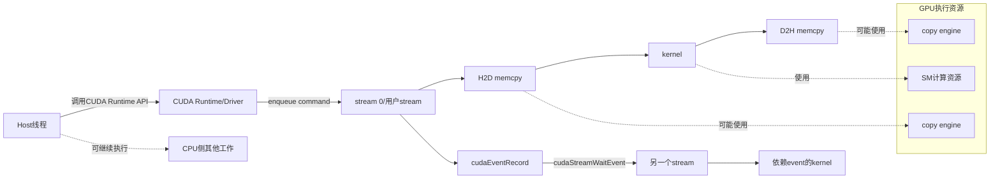
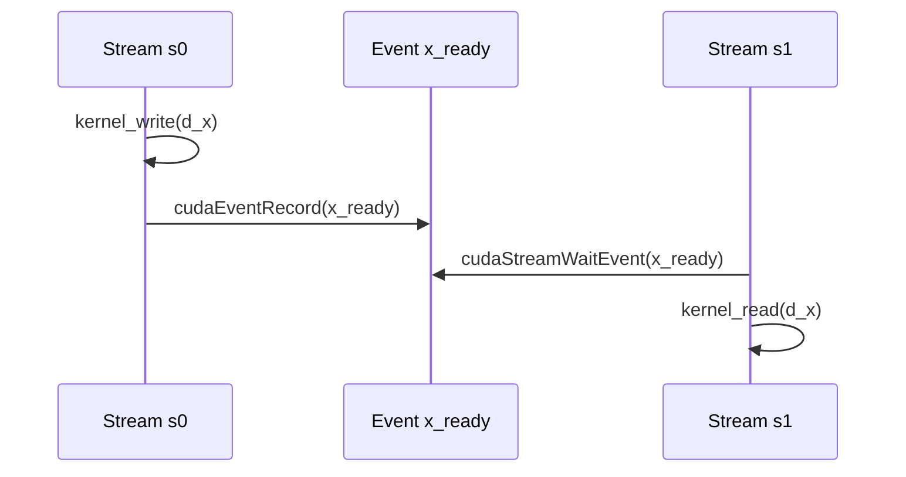
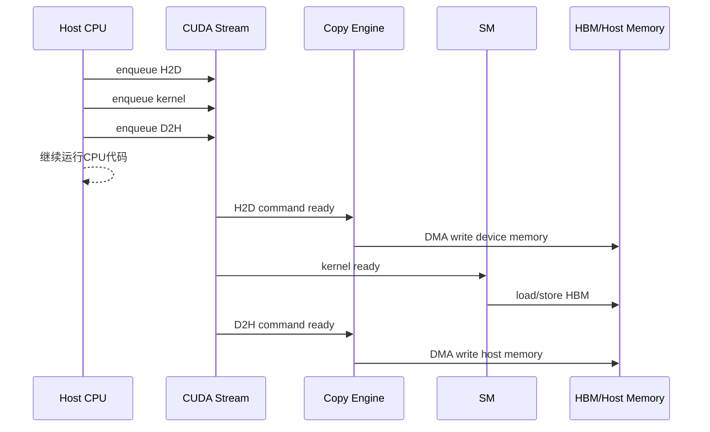

## 1. 先说结论

版本说明：本文参考的是2026-05-20访问的NVIDIA CUDA C++ Programming Guide 13.1.0 Legacy版、CUDA Runtime API 13.1.1文档，以及CUDA Runtime API里的API synchronization behavior、stream synchronization behavior、stream ordered memory allocator章节。CUDA stream/event的核心语义长期稳定，但默认stream模式、异步内存分配、Graph、device-side async copy、具体GPU copy engine数量和profiler行为都可能随CUDA版本、驱动和硬件变化。实际工程里要以你机器上的`cudaRuntimeGetVersion()`、`cudaDriverGetVersion()`、`cudaGetDeviceProperties()`和Nsight Systems时间线为准。

一句话概括：

**CUDA里的“异步”不是“操作已经完成”，而是“host线程把命令提交给CUDA运行时/驱动后可以先返回”；真正的执行顺序由stream内顺序、stream间依赖、event、默认stream语义、内存类型、copy engine和GPU资源共同决定。**

最重要的结论先列出来：

1. **Stream是命令队列和依赖边界**：同一个stream里的kernel、memcpy、memset按提交顺序执行；不同stream之间可以乱序或并发，但不能把“可能并发”当作正确性保证。
2. **Event是GPU时间线上的标记**：`cudaEventRecord(event, s)`把event排进stream；`cudaStreamWaitEvent(t, event)`让另一个stream等待这个标记完成。
3. **`Async`后缀不等于绝对异步**：官方Runtime API明确说同步/异步形式会因为参数不同表现出不同同步行为，pageable host memory尤其容易引入隐式同步或staging。
4. **H2D/D2H想和kernel重叠，host buffer通常必须是pinned memory**：也就是`cudaMallocHost()`、`cudaHostAlloc()`或注册过的page-locked host memory。
5. **默认stream是常见性能坑**：legacy default stream会和其他blocking streams发生隐式同步；per-thread default stream更像普通stream，但混用legacy stream仍要小心。
6. **`cudaDeviceSynchronize()`是大锤**：它会等当前device上所有相关工作完成。能用event或`cudaStreamSynchronize()`表达局部依赖时，不要用全局同步。
7. **内存拷贝并发受硬件限制**：`asyncEngineCount > 0`表示设备可把GPU和host之间的异步拷贝与kernel重叠；`asyncEngineCount == 2`通常意味着H2D和D2H有机会互相重叠。
8. **异步错误会延迟暴露**：kernel launch返回成功只说明launch参数等host侧检查通过，device侧错误可能在后续任意CUDA API、event同步或stream同步时才出现。
9. **`cudaMallocAsync/cudaFreeAsync`把内存生命周期也放进stream顺序里**：它不是普通`cudaMalloc`的简单替代，跨stream使用时必须用event或同步建立“分配完成后再访问、free执行前不再访问”的时间关系。
10. **性能优化的核心不是“多开stream”**：而是把真实独立的工作拆成流水线，让copy engine、SM、CPU线程都少等。

先看一张总图：



这张图里最容易误解的是：CPU调用`cudaMemcpyAsync()`返回，不代表`H2D memcpy`已经完成；它只是说明这个拷贝命令已经被提交到某条stream，之后由CUDA调度到copy engine上执行。

## 2. 从CPU视角看：一次CUDA调用到底发生了什么

先不要急着看stream。把一次最常见的CUDA程序展开：

```cpp
cudaMemcpyAsync(d_in, h_in, bytes, cudaMemcpyHostToDevice, stream);
kernel<<<grid, block, 0, stream>>>(d_out, d_in);
cudaMemcpyAsync(h_out, d_out, bytes, cudaMemcpyDeviceToHost, stream);
```

从host线程视角，这三行是在调用CUDA Runtime API。从GPU执行视角，它们不是立即在CPU当前线程里完成，而是变成三条命令：

```text
stream:
  1. H2D copy: h_in -> d_in
  2. kernel: d_in -> d_out
  3. D2H copy: d_out -> h_out
```

同一个stream内有天然顺序，所以kernel不会在H2D完成前读`d_in`，D2H也不会在kernel写完`d_out`前读`d_out`。这就是CUDA stream最基本、也最重要的正确性语义。

但是host线程看到的是另一件事：

```text
CPU提交H2D命令 -> API返回
CPU提交kernel命令 -> API返回
CPU提交D2H命令 -> API返回
CPU继续执行后面的代码
```

如果后面的CPU代码马上读取`h_out`：

```cpp
cudaMemcpyAsync(h_out, d_out, bytes, cudaMemcpyDeviceToHost, stream);
printf("%f\n", h_out[0]);  // 错误：D2H可能还没有完成
```

这就是数据竞争。正确做法是同步到一个明确的完成点：

```cpp
cudaMemcpyAsync(h_out, d_out, bytes, cudaMemcpyDeviceToHost, stream);
cudaStreamSynchronize(stream);
printf("%f\n", h_out[0]);
```

或者用event表达更局部的依赖：

```cpp
cudaEventRecord(done, stream);

// CPU可以做别的事情

cudaEventSynchronize(done);
printf("%f\n", h_out[0]);
```

这里要区分三种“完成”：

| 说法 | 含义 |
|---|---|
| API返回 | host线程不再阻塞在这个CUDA调用里 |
| 命令进入stream | CUDA接受了这个命令，后续按依赖调度 |
| device工作完成 | GPU/copy engine真的执行完，对应结果可被依赖方安全读取 |

很多CUDA bug来自把第一种完成误认为第三种完成。

## 3. CUDA API：Runtime API、Driver API和库API

平时写CUDA最常用的是Runtime API：

```cpp
cudaMalloc(&dptr, bytes);
cudaMemcpyAsync(dptr, hptr, bytes, cudaMemcpyHostToDevice, stream);
kernel<<<grid, block, shared_mem, stream>>>(...);
cudaEventRecord(event, stream);
```

Driver API则更底层，名字通常是`cu*`：

```cpp
cuMemAlloc(&dptr, bytes);
cuMemcpyHtoDAsync(dptr, hptr, bytes, stream);
cuLaunchKernel(...);
cuEventRecord(event, stream);
```

两套API面对的是同一个CUDA driver和GPU上下文，只是抽象层不同。Runtime API更方便，Driver API更显式，常见于框架、JIT、插件系统和需要精细控制context/module/function的场景。

还有一类是库API，比如cuBLAS、cuDNN、NCCL、CUTLASS封装出来的调用。它们通常也会把工作提交到某条stream：

```cpp
cublasSetStream(handle, stream);
cublasGemmEx(handle, ...);
```

工程上要记住：

1. CUDA API可以是“提交命令”的API，也可以是“查询状态”的API，也可以是“阻塞等待”的API。
2. 库API背后也可能提交kernel、memcpy、event、workspace初始化或内部同步。
3. 只看函数名是否带`Async`不够，必须看文档里的同步语义和参数。
4. 同一个框架里如果不同库用了不同stream，要显式建立依赖，否则数据可能还没准备好。

NVIDIA Runtime API文档里有一个非常关键的提醒：同步版和异步版memcpy/memset的命名并不完全等价于最终行为，因为具体行为会随参数变化。也就是说，`cudaMemcpyAsync()`通常是异步提交，但遇到pageable memory、默认stream、资源不足、内部初始化等情况时，host侧仍可能被阻塞。

## 4. Stream：顺序、并发和依赖边界

CUDA Programming Guide对stream的定义可以压缩成一句话：

```text
stream是一串按顺序执行的命令；不同stream的命令可以乱序或并发执行，但并发不是正确性保证。
```

创建普通stream：

```cpp
cudaStream_t s;
cudaStreamCreate(&s);

kernel<<<grid, block, 0, s>>>(...);
cudaMemcpyAsync(dst, src, bytes, cudaMemcpyDeviceToHost, s);

cudaStreamDestroy(s);
```

更推荐在性能敏感代码里用non-blocking stream：

```cpp
cudaStream_t s;
cudaStreamCreateWithFlags(&s, cudaStreamNonBlocking);
```

`cudaStreamNonBlocking`的意义不是“这个stream永远不阻塞”，而是它不会被legacy default stream的隐式同步规则绑住。这个点后面单独讲。

### 4.1 同一个stream内：天然串行

```cpp
cudaMemcpyAsync(d_a, h_a, bytes, cudaMemcpyHostToDevice, s);
kernel1<<<grid, block, 0, s>>>(d_b, d_a);
kernel2<<<grid, block, 0, s>>>(d_c, d_b);
cudaMemcpyAsync(h_c, d_c, bytes, cudaMemcpyDeviceToHost, s);
```

上面这段可以理解成：

```text
d_a准备好 -> kernel1完成 -> kernel2完成 -> h_c准备好
```

不需要在每一步之间插`cudaDeviceSynchronize()`。stream顺序本身就是device侧依赖。

### 4.2 不同stream间：默认没有顺序保证

```cpp
kernel_write<<<grid, block, 0, s0>>>(d_x);
kernel_read<<<grid, block, 0, s1>>>(d_x);
```

如果`s0`和`s1`之间没有event依赖，那么`kernel_read`可能在`kernel_write`之前、之后或同时执行。这个程序在正确性上是错的。

正确写法：

```cpp
cudaEventRecord(x_ready, s0);
cudaStreamWaitEvent(s1, x_ready, 0);
kernel_read<<<grid, block, 0, s1>>>(d_x);
```

event把依赖从`s0`传给`s1`：



### 4.3 Stream并发不是无限并发

多个stream只是给调度器提供更多可选工作，不等于所有工作都会同时跑。是否能并发取决于：

1. GPU是否支持concurrent kernel execution。
2. 每个kernel占了多少SM、register、shared memory、block slot。
3. 是否有足够copy engine支持传输重叠。
4. stream之间有没有隐式或显式依赖。
5. 是否使用legacy default stream引入全局顺序。
6. 是否有profiler、debug环境变量或同步API改变执行行为。

一个大kernel如果已经占满所有SM，另一个stream里的kernel即使没有依赖，也可能排队等资源。

### 4.4 Stream priority只是提示，不是抢占

CUDA支持创建带优先级的stream：

```cpp
int least, greatest;
cudaDeviceGetStreamPriorityRange(&least, &greatest);

cudaStream_t high, low;
cudaStreamCreateWithPriority(&high, cudaStreamNonBlocking, greatest);
cudaStreamCreateWithPriority(&low, cudaStreamNonBlocking, least);
```

高优先级stream会影响调度器选择待启动任务的顺序，但通常不会抢占已经在GPU上执行的低优先级kernel。所以它适合“让短小高优任务更早被调度”，不适合当作实时抢占机制。

## 5. 默认stream：`stream = 0`为什么经常拖慢程序

很多示例代码会写：

```cpp
kernel<<<grid, block>>>(...);  // 没写stream，等价于stream 0
cudaMemcpyAsync(dst, src, bytes, kind);  // 默认stream参数也是0
```

`stream = 0`到底是什么，取决于编译模式：

| 模式 | 行为 |
|---|---|
| legacy default stream | 每个device一个特殊NULL stream，会和其他blocking streams发生隐式同步 |
| per-thread default stream | 每个host线程有自己的默认stream，更像普通stream |

如果没有指定`--default-stream`，传统行为通常是legacy。legacy default stream的坑在于，它会让很多本来独立的stream被串起来：

```cpp
kernel_a<<<grid, block, 0, s>>>();
kernel_b<<<grid, block>>>();       // legacy default stream
kernel_c<<<grid, block, 0, s>>>();
```

在legacy default stream语义下，`kernel_b`会等`s`里之前的blocking工作，后续blocking stream里的工作又会等`kernel_b`。结果是：

```text
kernel_a -> kernel_b -> kernel_c
```

如果你以为`s`和默认stream可以并发，就会非常困惑：明明开了stream，Nsight Systems时间线上却一条接一条。

解决思路：

1. 性能敏感代码显式传stream，不依赖默认stream。
2. 创建用户stream时考虑`cudaStreamNonBlocking`。
3. 编译时明确选择`--default-stream per-thread`，但要确认整个项目和第三方库都能接受。
4. 用Nsight Systems看实际依赖，不要凭感觉判断。

## 6. Event：跨stream依赖、计时和局部同步

Event可以理解成“被排进stream的一枚标记”。它常用于三件事：

1. 让一个stream等待另一个stream的某个完成点。
2. 让CPU等待GPU时间线上的某个完成点。
3. 测量同一device上的GPU elapsed time。

### 6.1 基本用法

```cpp
cudaEvent_t e;
cudaEventCreate(&e);

kernel_a<<<grid, block, 0, s0>>>(...);
cudaEventRecord(e, s0);

cudaStreamWaitEvent(s1, e, 0);
kernel_b<<<grid, block, 0, s1>>>(...);
```

语义是：

```text
s0里event之前的工作完成 -> event完成 -> s1里event之后的工作才可执行
```

注意，`cudaEventRecord(e, s0)`不是“马上记录当前CPU时间”，而是把“等s0前面的工作完成后记录event”这个命令放进`s0`。

### 6.2 Event同步API

常用API：

```cpp
cudaEventSynchronize(e);  // CPU阻塞等event完成
cudaEventQuery(e);        // CPU非阻塞查询event是否完成
cudaStreamWaitEvent(s, e, 0);  // device侧让stream等待event
```

其中`cudaStreamWaitEvent()`很重要，因为它建立的是device侧依赖，不需要CPU阻塞：

```cpp
cudaEventRecord(e, producer_stream);
cudaStreamWaitEvent(consumer_stream, e, 0);
consumer_kernel<<<grid, block, 0, consumer_stream>>>(...);
```

这比下面这种写法更好：

```cpp
cudaEventRecord(e, producer_stream);
cudaEventSynchronize(e);  // CPU卡住
consumer_kernel<<<grid, block, 0, consumer_stream>>>(...);
```

除非CPU确实需要读取结果，否则不要把device侧依赖变成host侧等待。

### 6.3 Event计时

最常见计时代码：

```cpp
cudaEvent_t start, stop;
cudaEventCreate(&start);
cudaEventCreate(&stop);

cudaEventRecord(start, s);
kernel<<<grid, block, 0, s>>>(...);
cudaEventRecord(stop, s);

cudaEventSynchronize(stop);

float ms = 0.0f;
cudaEventElapsedTime(&ms, start, stop);
```

几个注意点：

1. start和stop最好放在同一个stream中，否则elapsed time可能掺入跨stream调度影响。
2. event时间是GPU时间线上的时间，不包括CPU提交API的开销。
3. 如果要测端到端延迟，要用CPU timer包住提交和同步。
4. 高频路径上如果只需要依赖、不需要计时，可以用`cudaEventDisableTiming`降低event开销：

```cpp
cudaEventCreateWithFlags(&e, cudaEventDisableTiming);
```

## 7. 同步语义：不要把所有等待都写成`cudaDeviceSynchronize()`

CUDA同步有很多层次。越靠全局，越简单，也越容易损失并发。

| API | 等待范围 | 典型用途 | 风险 |
|---|---|---|---|
| `cudaDeviceSynchronize()` | 当前device上先前提交的相关工作 | 调试、程序结束、粗粒度阶段边界 | 破坏所有stream并发 |
| `cudaStreamSynchronize(s)` | 指定stream之前的工作 | CPU需要读取该stream结果 | 只卡一个stream，但CPU仍阻塞 |
| `cudaEventSynchronize(e)` | 指定event完成 | CPU等某个局部完成点 | 依赖表达清晰 |
| `cudaStreamWaitEvent(s, e)` | stream等待event | GPU侧跨stream依赖 | 推荐用于流水线 |
| `cudaStreamQuery(s)` / `cudaEventQuery(e)` | 非阻塞查询 | 轮询、调度器集成 | 轮询太频繁会浪费CPU |

经验规则：

```text
需要CPU读结果 -> 用stream/event同步到最小完成点
只是GPU内部后续工作依赖 -> 用cudaStreamWaitEvent
调试异步错误 -> 临时用cudaDeviceSynchronize
生产性能路径 -> 尽量避免全局同步
```

举个典型坏例子：

```cpp
cudaMemcpyAsync(d_in, h_in, bytes, cudaMemcpyHostToDevice, s);
cudaDeviceSynchronize();
kernel<<<grid, block, 0, s>>>(d_out, d_in);
cudaDeviceSynchronize();
cudaMemcpyAsync(h_out, d_out, bytes, cudaMemcpyDeviceToHost, s);
cudaDeviceSynchronize();
```

这段代码把本来可以由stream顺序表达的依赖，全部变成host阻塞。更合理的是：

```cpp
cudaMemcpyAsync(d_in, h_in, bytes, cudaMemcpyHostToDevice, s);
kernel<<<grid, block, 0, s>>>(d_out, d_in);
cudaMemcpyAsync(h_out, d_out, bytes, cudaMemcpyDeviceToHost, s);
cudaStreamSynchronize(s);
```

如果CPU在最后才需要`h_out`，中间没有必要同步。

## 8. 异步内存拷贝：`cudaMemcpyAsync`到底异步在哪里

`cudaMemcpyAsync()`的签名：

```cpp
cudaError_t cudaMemcpyAsync(
    void* dst,
    const void* src,
    size_t count,
    cudaMemcpyKind kind,
    cudaStream_t stream = 0);
```

它的异步性分两层：

1. 对host异步：API可能在copy完成前返回。
2. 对其他stream可重叠：如果硬件、stream、内存类型都允许，这个copy可以和其他stream的kernel或copy同时执行。

这两层不是一回事。

### 8.1 H2D、D2H、D2D、P2P

| 类型 | 例子 | 常见执行资源 | 是否容易与kernel重叠 |
|---|---|---|---|
| H2D | host -> GPU device memory | PCIe/NVLink + copy engine | 需要pinned host memory和硬件支持 |
| D2H | GPU device memory -> host | PCIe/NVLink + copy engine | 需要pinned host memory和硬件支持 |
| D2D | 同GPU device memory内部拷贝 | GPU内部copy路径或kernel式实现 | 取决于设备能力和资源 |
| P2P | GPU0 -> GPU1 | P2P over PCIe/NVLink | 需要peer access/拓扑支持 |

要检查设备能力：

```cpp
cudaDeviceProp prop;
cudaGetDeviceProperties(&prop, device);

printf("concurrentKernels = %d\n", prop.concurrentKernels);
printf("asyncEngineCount = %d\n", prop.asyncEngineCount);
```

解释：

1. `concurrentKernels`表示是否支持多个kernel并发执行。
2. `asyncEngineCount > 0`表示有机会让异步拷贝和kernel重叠。
3. `asyncEngineCount == 2`常见含义是H2D和D2H方向可以同时推进，但具体仍要看硬件和路径。

### 8.2 Pageable host memory为什么会破坏异步

普通`malloc()`拿到的是pageable memory：

```cpp
float* h = (float*)malloc(bytes);
```

操作系统可以把pageable memory换出、迁移或分页管理。DMA engine不能安全地直接长期依赖这段虚拟内存，所以CUDA驱动可能要先把数据stage到内部pinned buffer，再发起DMA。这个staging过程可能导致stream同步或host阻塞。

Pinned memory，也叫page-locked host memory：

```cpp
float* h = nullptr;
cudaMallocHost(&h, bytes);

// 或者
cudaHostAlloc(&h, bytes, cudaHostAllocDefault);
```

它的特点：

1. 物理页被pin住，不能被OS随便换出。
2. GPU copy engine可以更直接地发起DMA传输。
3. H2D/D2H和kernel重叠通常需要它。
4. 分配和释放成本更高，过量pinned memory会影响系统整体内存管理。

经验：

```text
小量临时数据 -> pageable memory简单即可
大块高频H2D/D2H -> 预分配pinned buffer池
流水线传输 -> pinned + cudaMemcpyAsync + 多stream
不要每个batch都cudaMallocHost/cudaFreeHost
```

### 8.3 `cudaMemcpyAsync`和默认stream

这个调用看起来异步：

```cpp
cudaMemcpyAsync(d, h, bytes, cudaMemcpyHostToDevice);
```

但它使用默认stream。默认stream如果是legacy，就可能和其他blocking streams发生隐式同步。更好的写法是：

```cpp
cudaMemcpyAsync(d, h, bytes, cudaMemcpyHostToDevice, copy_stream);
```

再用event把拷贝完成点交给计算stream：

```cpp
cudaMemcpyAsync(d, h, bytes, cudaMemcpyHostToDevice, copy_stream);
cudaEventRecord(h2d_done, copy_stream);

cudaStreamWaitEvent(compute_stream, h2d_done, 0);
kernel<<<grid, block, 0, compute_stream>>>(d);
```

## 9. 异步计算与内存传输重叠：流水线才是重点

一个batch的执行通常是：

```text
H2D input -> kernel compute -> D2H output
```

如果只有一个batch，重叠空间有限。真正能吃到异步收益的是多batch流水线：

```text
batch0: H2D -> compute -> D2H
batch1:      H2D -> compute -> D2H
batch2:           H2D -> compute -> D2H
```

理想情况下，时间线类似：

```mermaid
gantt
    title 双缓冲流水线：H2D、Compute、D2H重叠
    dateFormat  X
    axisFormat %s

    section H2D copy engine
    H2D batch0 :0, 2
    H2D batch1 :2, 4
    H2D batch2 :4, 6

    section SM compute
    K batch0   :2, 5
    K batch1   :5, 8
    K batch2   :8, 11

    section D2H copy engine
    D2H batch0 :5, 7
    D2H batch1 :8, 10
    D2H batch2 :11, 13
```



这里最理想的吞吐由最长阶段决定：

```text
steady_state_time_per_batch ~= max(H2D_time, kernel_time, D2H_time)
```

而不是三者相加：

```text
serial_time_per_batch = H2D_time + kernel_time + D2H_time
```

当然这只是理想模型。实际会受到PCIe/NVLink带宽、copy engine数量、kernel占用率、launch开销、内存分配、NUMA、CPU数据准备速度影响。

### 9.1 双缓冲示例

```cpp
constexpr int kStages = 2;

cudaStream_t streams[kStages];
cudaEvent_t done[kStages];

for (int i = 0; i < kStages; ++i) {
    cudaStreamCreateWithFlags(&streams[i], cudaStreamNonBlocking);
    cudaEventCreateWithFlags(&done[i], cudaEventDisableTiming);
}

for (int batch = 0; batch < num_batches; ++batch) {
    int slot = batch % kStages;

    // 复用slot前，确保上一次使用这个slot的D2H已经完成。
    if (batch >= kStages) {
        cudaEventSynchronize(done[slot]);
    }

    cudaMemcpyAsync(d_in[slot], h_in[batch], bytes_in,
                    cudaMemcpyHostToDevice, streams[slot]);

    my_kernel<<<grid, block, 0, streams[slot]>>>(
        d_out[slot], d_in[slot], batch_size);

    cudaMemcpyAsync(h_out[batch], d_out[slot], bytes_out,
                    cudaMemcpyDeviceToHost, streams[slot]);

    cudaEventRecord(done[slot], streams[slot]);
}

for (int i = 0; i < kStages; ++i) {
    cudaEventSynchronize(done[i]);
}
```

这个例子里，每个slot有自己的device input/output buffer和stream。复用slot前用event确保上一次的D2H已经结束，否则host可能覆盖仍在使用的buffer。

注意，`h_in`和`h_out`如果想获得稳定重叠，应该是pinned memory。

### 9.2 更细的copy stream + compute stream

有时你想把H2D、compute、D2H拆成不同stream，例如为了独立控制优先级或复用计算stream：

```cpp
cudaMemcpyAsync(d_in, h_in, bytes, cudaMemcpyHostToDevice, h2d_stream);
cudaEventRecord(h2d_done, h2d_stream);

cudaStreamWaitEvent(compute_stream, h2d_done, 0);
kernel<<<grid, block, 0, compute_stream>>>(d_out, d_in);
cudaEventRecord(compute_done, compute_stream);

cudaStreamWaitEvent(d2h_stream, compute_done, 0);
cudaMemcpyAsync(h_out, d_out, bytes, cudaMemcpyDeviceToHost, d2h_stream);
cudaEventRecord(d2h_done, d2h_stream);
```

这相当于手工画了一张依赖图：


这种方式表达能力强，但也更容易写错。简单场景下，一个slot一条stream已经足够。

## 10. `cudaMallocAsync`：把内存生命周期放进stream顺序

传统`cudaMalloc()`和`cudaFree()`常见问题：

1. 分配释放开销高。
2. `cudaFree()`历史上可能触发全局同步，破坏并发。
3. 高频临时buffer会让性能抖动。

CUDA提供了stream ordered memory allocator：

```cpp
void* p = nullptr;
cudaMallocAsync(&p, bytes, stream);

kernel<<<grid, block, 0, stream>>>(p);

cudaFreeAsync(p, stream);
```

这个模型的核心是：

```text
alloc命令进入stream
同stream后续工作可以使用这块内存
free命令进入stream
stream执行到free后，这块内存不应再被后续GPU工作访问
```

也就是说，`cudaMallocAsync()`返回时，指针值已经给你了，但这不代表其他stream可以马上用它。其他stream要用，必须等分配所在stream里的allocation operation完成：

```cpp
cudaMallocAsync(&p, bytes, alloc_stream);
cudaEventRecord(alloc_done, alloc_stream);

cudaStreamWaitEvent(use_stream, alloc_done, 0);
kernel<<<grid, block, 0, use_stream>>>(p);
```

释放也一样。如果`use_stream`还在使用`p`，不能只在`alloc_stream`里随手free：

```cpp
cudaEventRecord(use_done, use_stream);
cudaStreamWaitEvent(free_stream, use_done, 0);
cudaFreeAsync(p, free_stream);
```

否则就是use-after-free，只是这个free发生在GPU时间线上，bug可能非常隐蔽。

一个更安全的实践是：临时buffer的alloc、use、free尽量放同一条stream；跨stream共享时，把event依赖写得非常明确。

## 11. Host、Device和Memory的异步关系

CUDA异步执行其实有三条时间线：



从这张图可以看出，异步不是一件事，而是几类并发：

1. CPU和GPU并发：CPU提交后继续准备下一个batch、做后处理、调度网络I/O。
2. Copy和compute并发：H2D/D2H由copy engine推进，kernel由SM推进。
3. 多kernel并发：多个stream里的小kernel可能同时占用不同SM资源。
4. 多copy并发：H2D和D2H可能由不同copy engine同时推进。
5. device内部异步：较新GPU和CUDA支持在kernel内部把global memory到shared memory的拷贝异步化，用pipeline隐藏访存延迟。

### 11.1 Device内部的异步拷贝：`cuda::memcpy_async`

前面讲的是host提交的`cudaMemcpyAsync()`。它在kernel外部，把host/device/device之间的数据搬运排进stream。

CUDA还有device代码里的异步模型，例如从global memory异步拷到shared memory，然后用pipeline或barrier等待：

```cpp
#include <cuda/pipeline>

__global__ void tiled_kernel(float* out, const float* in) {
    extern __shared__ float smem[];

    auto block = cooperative_groups::this_thread_block();
    auto pipe = cuda::make_pipeline();

    for (int tile = 0; tile < num_tiles; ++tile) {
        pipe.producer_acquire();
        cuda::memcpy_async(block, smem, in + tile_offset(tile),
                           bytes_per_tile, pipe);
        pipe.producer_commit();

        pipe.consumer_wait();
        block.sync();

        // 使用smem中的tile做计算
        compute_tile(out, smem, tile);

        block.sync();
        pipe.consumer_release();
    }
}
```

这是另一层异步：不再是CPU和GPU之间的异步，而是kernel内部用异步copy/pipeline隐藏global memory访问延迟。它和stream/event不是替代关系：

1. stream/event管理kernel之间、copy和kernel之间的顺序。
2. `cuda::memcpy_async`/pipeline管理kernel内部不同阶段之间的顺序。
3. 外层stream正确，内层pipeline错误，kernel仍会读到未准备好的shared memory。

如果只是在写普通应用层CUDA，先把stream/event和host-device copy搞清楚；如果在写高性能kernel，再深入`cp.async`、pipeline、barrier和shared memory tiling。

## 12. 正确性：内存可见性和生命周期

CUDA异步程序最容易犯的不是“没并发起来”，而是“数据生命周期错了”。

### 12.1 Host buffer不能提前复用

错误：

```cpp
for (int i = 0; i < n; ++i) {
    fill_input(h_buf, i);
    cudaMemcpyAsync(d_buf[i], h_buf, bytes, cudaMemcpyHostToDevice, s[i]);
}
```

如果`h_buf`是同一个buffer，下一轮`fill_input()`可能在上一轮H2D还没读完时覆盖它。正确做法：

1. 每个in-flight slot一个host buffer。
2. 或复用前等对应event完成。

```cpp
int slot = i % kStages;
if (i >= kStages) {
    cudaEventSynchronize(h2d_consumed[slot]);
}

fill_input(h_buf[slot], i);
cudaMemcpyAsync(d_buf[slot], h_buf[slot], bytes,
                cudaMemcpyHostToDevice, stream[slot]);
cudaEventRecord(h2d_consumed[slot], stream[slot]);
```

### 12.2 Device buffer不能提前释放或复用

错误：

```cpp
cudaMemcpyAsync(d, h, bytes, cudaMemcpyHostToDevice, s);
kernel<<<grid, block, 0, s>>>(d);
cudaFree(d);  // 可能同步，也可能破坏并发；语义上也很危险
```

更好的方式是让生命周期和stream一致：

```cpp
cudaMallocAsync(&d, bytes, s);
cudaMemcpyAsync(d, h, bytes, cudaMemcpyHostToDevice, s);
kernel<<<grid, block, 0, s>>>(d);
cudaFreeAsync(d, s);
```

或者使用长生命周期buffer池，避免热路径分配释放。

### 12.3 Unified Memory不是“自动没有同步”

Managed memory让CPU和GPU可以通过同一个指针访问数据：

```cpp
cudaMallocManaged(&p, bytes);
kernel<<<grid, block>>>(p);
cudaDeviceSynchronize();
printf("%f\n", p[0]);
```

它简化地址管理，但不取消执行依赖。CPU读取GPU刚写过的数据前，仍要保证kernel完成。为了性能，常用：

```cpp
cudaMemPrefetchAsync(p, bytes, device, stream);
kernel<<<grid, block, 0, stream>>>(p);
cudaMemPrefetchAsync(p, bytes, cudaCpuDeviceId, stream);
cudaStreamSynchronize(stream);
```

`cudaMemPrefetchAsync()`也是stream相关命令，作用是提前迁移或建立合适位置，减少page fault和迁移抖动；它不是正确性同步的万能替代。

## 13. 异步错误：为什么bug经常在“不相关”的API处爆

CUDA异步错误有一个特点：出错的kernel和报错的API不一定是同一个地方。

比如：

```cpp
bad_kernel<<<grid, block, 0, s>>>(...);

// 这里可能只拿到launch参数检查结果
cudaError_t e1 = cudaGetLastError();

// 真正的非法访存可能到这里才暴露
cudaError_t e2 = cudaStreamSynchronize(s);
```

推荐调试宏：

```cpp
#define CUDA_CHECK(call)                                                     \
    do {                                                                     \
        cudaError_t err__ = (call);                                           \
        if (err__ != cudaSuccess) {                                           \
            fprintf(stderr, "CUDA error %s:%d: %s\n",                        \
                    __FILE__, __LINE__, cudaGetErrorString(err__));           \
            std::abort();                                                     \
        }                                                                     \
    } while (0)

#define CUDA_KERNEL_CHECK()                                                   \
    do {                                                                     \
        CUDA_CHECK(cudaGetLastError());                                       \
    } while (0)
```

调试kernel时可以临时加：

```cpp
bad_kernel<<<grid, block, 0, s>>>(...);
CUDA_KERNEL_CHECK();
CUDA_CHECK(cudaStreamSynchronize(s));
```

或者设置：

```bash
CUDA_LAUNCH_BLOCKING=1 ./your_program
```

但这只适合调试。它会全局改变kernel launch异步行为，性能时间线会失真。

## 14. 性能测量：看CPU时间、GPU时间和时间线

### 14.1 用event测GPU执行时间

```cpp
cudaEventRecord(start, s);
kernel<<<grid, block, 0, s>>>(...);
cudaEventRecord(stop, s);
cudaEventSynchronize(stop);
cudaEventElapsedTime(&ms, start, stop);
```

这适合测GPU时间，不适合测CPU提交开销。

### 14.2 用CPU timer测端到端时间

```cpp
auto t0 = std::chrono::steady_clock::now();

cudaMemcpyAsync(d_in, h_in, bytes, cudaMemcpyHostToDevice, s);
kernel<<<grid, block, 0, s>>>(d_out, d_in);
cudaMemcpyAsync(h_out, d_out, bytes, cudaMemcpyDeviceToHost, s);
cudaStreamSynchronize(s);

auto t1 = std::chrono::steady_clock::now();
```

这包含CPU提交、排队、执行、同步等待等端到端成本。

### 14.3 用Nsight Systems看真实重叠

对于stream/event问题，最有价值的是时间线：

```bash
nsys profile -t cuda,nvtx,osrt -o report ./your_program
nsys-ui report.nsys-rep
```

重点看：

1. CUDA API行：host线程是否被某个API长时间阻塞。
2. CUDA GPU Kernel行：kernel是否真的并发。
3. CUDA Memory行：H2D/D2H是否和kernel重叠。
4. Stream编号：是否不小心都进了默认stream。
5. Memcpy的内存类型：pageable还是pinned。
6. 空洞：copy engine或SM是否在等待CPU提交、等待依赖或等待数据。

如果你只看event时间，可能看不出host侧提交、pageable staging、默认stream隐式同步、CPU数据准备慢这些问题。

## 15. 常见误区

### 15.1 “我用了多个stream，所以一定并发”

不一定。多个stream只是允许独立命令并发。以下情况都会让它们串行或部分串行：

1. kernel资源占满。
2. copy使用pageable host memory。
3. 使用legacy default stream。
4. 中间调用了`cudaDeviceSynchronize()`。
5. 设备不支持对应并发能力。
6. 数据依赖本来就是串行的。

### 15.2 “`cudaMemcpyAsync`返回了，所以host buffer可以改”

不一定。H2D copy可能还没从host buffer读完。复用或释放host buffer前，要同步对应stream/event。

### 15.3 “event记录后就代表前面的工作完成”

不是。`cudaEventRecord()`本身也是排队命令。event完成，才代表它前面的stream工作完成。

### 15.4 “`cudaFreeAsync`返回后内存已经释放”

从host API角度它返回了，但free操作在stream时间线上。更重要的是：在free执行点之后，后续GPU工作不能再访问这块内存。跨stream时要用event保证使用都结束后再free。

### 15.5 “把所有同步删掉性能就会变好”

删掉同步可能只是把正确性删掉。正确目标是：

```text
保留必要依赖
缩小同步范围
把host等待改成device侧event等待
把全局同步改成局部同步
```

## 16. 实战设计：一个稳定的异步推理/处理流水线

假设有一个服务，每个请求做：

```text
CPU预处理 -> H2D -> GPU kernel -> D2H -> CPU后处理
```

一个稳健设计通常是：

1. 初始化时创建固定数量slot，例如2或3。
2. 每个slot预分配pinned input/output host buffer。
3. 每个slot预分配device input/output buffer，或用`cudaMallocAsync`但保持stream内生命周期清晰。
4. 每个slot一条non-blocking stream。
5. 每个slot一个done event。
6. 调度线程只在复用slot时等待这个slot的done event。
7. CPU预处理和GPU执行并行推进。
8. 用Nsight Systems确认H2D、kernel、D2H是否按预期重叠。

伪代码：

```cpp
struct Slot {
    cudaStream_t stream;
    cudaEvent_t done;
    void* h_in;
    void* h_out;
    void* d_in;
    void* d_out;
};

std::vector<Slot> slots(kStages);

for (auto& slot : slots) {
    cudaStreamCreateWithFlags(&slot.stream, cudaStreamNonBlocking);
    cudaEventCreateWithFlags(&slot.done, cudaEventDisableTiming);
    cudaMallocHost(&slot.h_in, input_bytes);
    cudaMallocHost(&slot.h_out, output_bytes);
    cudaMalloc(&slot.d_in, input_bytes);
    cudaMalloc(&slot.d_out, output_bytes);

    // 初始化为已完成，便于第一次复用。
    cudaEventRecord(slot.done, slot.stream);
}

for (int req = 0; req < num_requests; ++req) {
    Slot& slot = slots[req % kStages];

    cudaEventSynchronize(slot.done);

    preprocess(slot.h_in, req);

    cudaMemcpyAsync(slot.d_in, slot.h_in, input_bytes,
                    cudaMemcpyHostToDevice, slot.stream);

    infer_kernel<<<grid, block, 0, slot.stream>>>(slot.d_out, slot.d_in);

    cudaMemcpyAsync(slot.h_out, slot.d_out, output_bytes,
                    cudaMemcpyDeviceToHost, slot.stream);

    cudaEventRecord(slot.done, slot.stream);

    // 后处理可以由另一个CPU线程在done后做，避免阻塞提交线程。
}
```

如果后处理也要异步化，可以把`slot.done`交给CPU worker线程：

```cpp
cudaEventSynchronize(slot.done);
postprocess(slot.h_out);
```

这时要小心slot所有权：postprocess没结束前，提交线程也不能复用`h_out`。

## 17. 排错清单

遇到“异步没重叠起来”，按这个顺序查：

1. 是否所有操作都进了同一个stream？
2. 是否不小心用了默认stream？
3. 默认stream是否是legacy模式？
4. 用户stream是否是blocking stream，是否被legacy default stream同步？
5. H2D/D2H host buffer是否是pinned memory？
6. `cudaGetDeviceProperties()`里`asyncEngineCount`是多少？
7. 中间是否有`cudaDeviceSynchronize()`、同步`cudaMemcpy()`、`cudaFree()`或某个库内部同步？
8. kernel是否占满SM，导致其他kernel无法并发？
9. copy方向是否可并发，比如H2D和D2H是否有独立copy engine？
10. Nsight Systems里CUDA API行是否有长时间阻塞？
11. event依赖是否写反，导致consumer等错了producer？
12. host buffer或device buffer是否被提前复用，引入隐式等待或数据错误？
13. profiler是否改变了kernel launch或并发行为？

遇到“结果偶尔错”，按这个顺序查：

1. CPU读取host output前是否等D2H完成？
2. H2D还没读完时，host input是否被覆盖？
3. 跨stream读写同一device buffer时是否有event依赖？
4. `cudaMallocAsync`分配的指针是否在allocation完成前被其他stream访问？
5. `cudaFreeAsync`是否在所有使用者完成后才执行？
6. kernel launch后是否检查了`cudaGetLastError()`？
7. 是否在合适位置同步来捕获device侧非法访存？

## 18. 什么时候不要追求异步重叠

异步不是免费优化。以下场景不一定值得复杂化：

1. 数据量很小，copy时间远小于kernel launch开销。
2. kernel本身很短，多stream调度开销反而明显。
3. 数据依赖严格串行，没有可流水线化的batch。
4. host预处理才是瓶颈，GPU本来就在等CPU。
5. 使用复杂event后正确性风险高，但收益只有几个百分点。
6. 推理服务里尾延迟比吞吐更重要，过深pipeline会增加单请求排队时间。

更实用的判断方式：

```text
先用Nsight Systems确认瓶颈
再构造最小双缓冲流水线
确认吞吐提升和尾延迟变化
最后再扩大到多stage、多stream或自定义内存池
```

## 19. 小结

CUDA stream、event、异步API和异步内存传输可以统一理解成一套时间线编程模型：

1. API调用把工作提交到stream，不等于工作完成。
2. 同一stream内天然有顺序，不同stream间要用event建立依赖。
3. CPU需要结果时才做host侧同步，GPU内部依赖优先用`cudaStreamWaitEvent()`。
4. H2D/D2H与kernel重叠通常要求pinned memory、非默认stream、硬件copy engine支持和正确的流水线结构。
5. 默认stream、pageable memory、全局同步、同步分配释放、库内部同步，是最常见的隐式串行来源。
6. `cudaMallocAsync/cudaFreeAsync`把内存生命周期也放进stream时间线，跨stream共享必须显式同步。
7. 性能问题要看Nsight Systems时间线，正确性问题要看event依赖和buffer生命周期。

如果只记一条：

```text
CUDA异步编程不是“尽量不等”，而是“只在真正的数据依赖处等待，并把等待放在最小范围内”。
```

## 参考

1. NVIDIA CUDA C++ Programming Guide 13.1.0 Legacy：Asynchronous Concurrent Execution、Streams、Events、Overlapping Behavior、Cross-stream Dependencies and Events  
   <https://docs.nvidia.com/cuda/archive/13.1.0/cuda-c-programming-guide/index.html>
2. NVIDIA CUDA Runtime API 13.1.1：API synchronization behavior  
   <https://docs.nvidia.com/cuda/archive/13.1.1/cuda-runtime-api/api-sync-behavior.html>
3. NVIDIA CUDA Runtime API 13.1.1：Stream synchronization behavior  
   <https://docs.nvidia.com/cuda/archive/13.1.1/cuda-runtime-api/stream-sync-behavior.html>
4. NVIDIA CUDA Runtime API 13.1.1：Memory Management, `cudaMemcpyAsync`/`cudaMemsetAsync`  
   <https://docs.nvidia.com/cuda/archive/13.1.1/cuda-runtime-api/group__CUDART__MEMORY.html>
5. NVIDIA CUDA Runtime API 13.1.1：Stream Ordered Memory Allocator, `cudaMallocAsync`/`cudaFreeAsync`  
   <https://docs.nvidia.com/cuda/archive/13.1.1/cuda-runtime-api/group__CUDART__MEMORY__POOLS.html>
