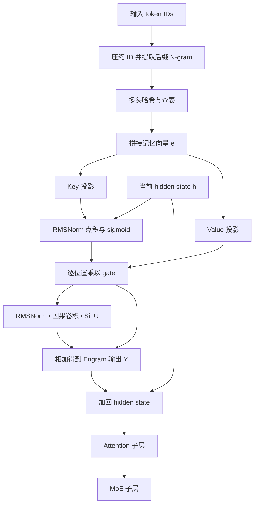
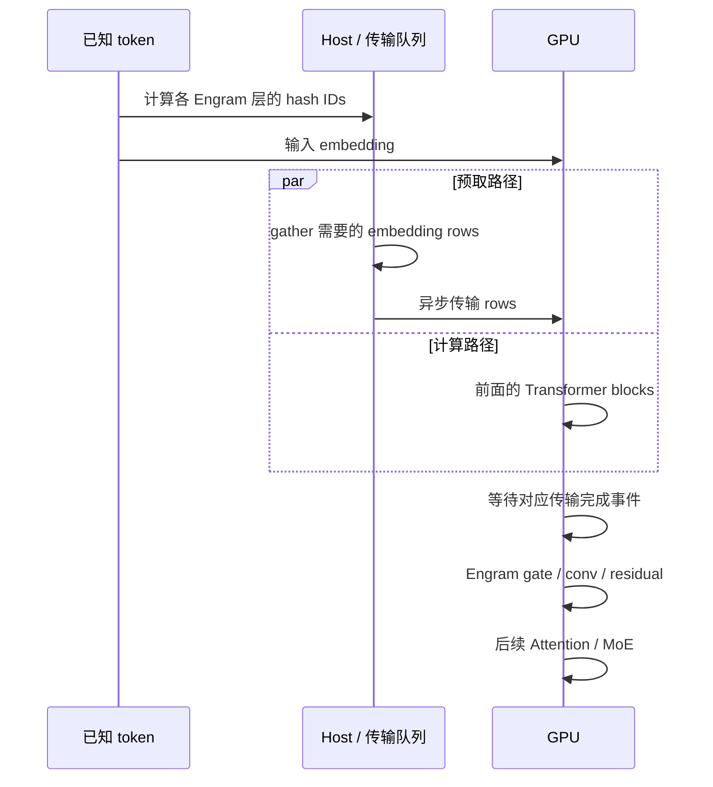

> 资料说明：本文于 2026-09-22 核对 DeepSeek-AI 与北京大学的论文 [Conditional Memory via Scalable Lookup: A New Axis of Sparsity for Large Language Models，v2](https://arxiv.org/abs/2601.07372v2)，该版修订于 2026-07-12。代码以 [Engram 官方仓库](https://github.com/deepseek-ai/Engram)的提交 `fb7f84a` 为准。文中区分论文实验、演示代码和工程估算；官方 `engram_demo_v1.py` 主要展示数据流。

## 先说结论

Engram 可以理解为 Transformer 旁边的一块**按输入条件查表的静态记忆**。它把语言中的一部分局部、稳定、重复的模式，例如人名、专有名词、固定短语和常见 token 组合，交给哈希后的 N-gram embedding 表去检索；Transformer 的 attention 和 MoE 则把更多层数和算力留给需要上下文组合的任务。这里“静态”指给定表项在推理时存储固定的向量，表内数值是在训练中学习的。

它解决的问题不是“给模型接一个外部知识库”，也不是把 attention 替换成数据库查询，而是给模型增加一种和 MoE 平行的稀疏轴：

- **MoE 是条件计算**：根据当前 hidden state 选择少数专家，执行动态的神经计算。
- **Engram 是条件记忆**：根据输入 token 的局部序列确定地址，从大表里取出少量静态向量。

DeepSeek 的实验结论可以概括成三点：

1. 在总参数和激活参数严格对齐时，把一部分 MoE 专家容量换成 Engram，验证损失呈现 U 形分配曲线；大约 20%～25% 的稀疏参数预算放到 Engram 时效果最好，纯 MoE 并不是最优点。
2. Engram-27B 和同总参数、同激活参数的 MoE-27B 对比，在知识、推理、代码和数学任务上都有提升。论文表 1 中，MMLU 为 60.4 对 57.4，BBH 为 55.9 对 50.9，HumanEval 为 40.8 对 37.8，MATH 为 30.7 对 28.3。
3. 由于查表地址只由 token 序列决定，表本身可以放到 host DRAM，提前预取后与前面 Transformer block 的计算重叠。论文在 H800、512 条序列的测试中，把 100B 参数的表放在 CPU 内存，8B dense backbone 的吞吐从 6315.52 token/s 降到 6140.02 token/s，约 2.8% 的下降。这个结果依赖特定负载、PCIe 路径和预取时机，不能直接等同于所有硬件上的“零开销”。

读懂它，需要同时看清两条路径：token 决定查哪里，hidden state 决定怎样使用查到的内容。

## 1. 为什么 Transformer 需要一条“条件记忆”路径

### 1.1 一个 token 预测里混着两种工作

假设模型读到：

```text
Only Alexander the Great could tame the horse ...
```

模型至少要做两类不同的事情：

1. 识别 `Alexander the Great` 是一个稳定的多 token 实体，并保留它与后续词的常见搭配。
2. 根据完整上下文判断句子的语义、时间、指代和下一步推理。

第二类工作需要动态组合：同一个词在不同上下文里可能有不同含义，模型必须使用 attention 和 FFN/MoE 逐层计算。第一类工作却有一部分很像查字典：局部 token 序列已经足以提示一个稳定的表示。

标准 Transformer 没有专门的查表原语。它只能让早期 attention、FFN 和 residual stream 一层层把局部模式“重建”出来。重建当然能工作，但每一层的深度是有限资源；用多层计算一个静态短语，就可能挤占复杂推理真正需要的有效深度。

### 1.2 MoE 解决了容量问题，但没有解决检索问题

MoE 通过 router 选择少数专家，使总参数量可以大幅超过每 token 的激活参数量。粗略写成：

$$
\text{MoE: } h_t \xrightarrow{\text{router}(h_t)} \{E_i\}_{i\in S_t} \xrightarrow{} h'_t
$$

路由依赖 hidden state，专家执行的是动态函数。它适合“这段上下文需要哪种计算”。但如果目标是复用一个稳定的局部 token 关联，MoE 仍然要启动专家做神经计算，而且这些知识被分散在参数和层间变换中。

Engram 把这个问题拆开：

$$
\text{Engram: } (x_{t-n+1},\ldots,x_t)
\xrightarrow{\text{hash}}
\{z_{t,n,k}\}
\xrightarrow{\text{lookup}}
 e_t
\xrightarrow{\text{gate}(h_t,e_t)}
 y_t
$$

这里的地址由 token 序列决定，hidden state 只负责判断查到的记忆在当前上下文里应该用多少。

## 2. Engram 的完整数据流

Engram 不是把一个 embedding 表简单加到输入 embedding 上。官方架构里，查表结果在指定 Transformer layer 注入，并在后面继续经过标准 Attention 和 MoE。



图中省略了 Attention/MoE 自身的残差细节。模块通常只插在少数层：论文表 5 报告的层位置是 `[2, 15]`，使用 2-gram、3-gram，每阶 8 个 hash head，拼接后的记忆维度 $d_{mem}=1280$。层位置按论文原表记法记录，不能直接与 demo 的零起始索引混用。

## 3. 查表阶段：从 token 到静态记忆

### 3.1 Tokenizer compression：先把等价 token 合并

直接使用 tokenizer ID 会浪费表空间。子词 tokenizer 为了无损还原文本，可能给大小写、前导空格、Unicode 变体分配不同 ID。例如 `A`、`a`、`␣a`、带重音的变体，文本归一化后可能属于同一类局部模式。

Engram 预先构造一个投影函数：

$$
P: V\rightarrow V',\qquad x'_t=P(x_t)
$$

官方 demo 中的归一化流程包括 NFKC、NFD、去重音、小写化、合并连续空白等处理。它把原始 token 映射到 canonical token。论文附录 C 报告，在 128k tokenizer 上有效词表减少约 23.43%。

模型输入和输出仍使用原来的 token ID；压缩只发生在 Engram 计算地址的支路中。这样可以减少规范化后等价表项的重复，让一些不同书写形式共享记忆。这个投影不改变序列长度，也不能保证两种不同子词切分一定映射到同一个 N-gram。

代价是归一化规则本身成为模型的一部分。大小写、空白、特殊 token 和 Unicode 处理得过激，可能把本来应该区分的模式合并；处理得过保守，又会失去压缩收益。

### 3.2 只取 suffix N-gram

对于位置 $t$，Engram 使用以当前位置结尾的局部序列：

$$
 g_{t,n}=(x'_{t-n+1},\ldots,x'_{t-1},x'_t),\qquad n\in\{2,3,\ldots,N\}
$$

为什么强调 suffix？自回归模型在位置 $t$ 消费已经知道的 $x_t$，输出用于预测 $x_{t+1}$。因此这里使用 $x_{\leq t}$，没有读取待预测的下一个 token。序列开头不足 $n$ 个 token 时，demo 用压缩后的 `pad_id` 左填充。处理训练时拼接的文档或推理中的新请求时，还需要正确处理序列边界。

Engram 不直接为全部 N-gram 分配一张组合表。假设压缩后词表大小是 $|V'|$，三元组空间是 $|V'|^3$，即使 $|V'|$ 只有十万，也不可能完整开表，所以需要哈希。

### 3.3 Multi-head hashing：用多张小表降低碰撞风险

对每个 N-gram 阶数 $n$ 和 hash head $k$，使用一个确定性的哈希函数得到表索引：

$$
 z_{t,n,k}=\varphi_{n,k}(g_{t,n})\bmod M_{n,k},
 \qquad e_{t,n,k}=E_{n,k}[z_{t,n,k}]
$$

其中 $M_{n,k}$ 是第 $k$ 个 embedding 表的大小，通常选质数；$E_{n,k}$ 是表，$e_{t,n,k}$ 是取出的向量。最后把所有 N-gram、所有 head 的向量拼起来：

$$
 e_t=\mathop{\Vert}_{n=2}^{N}\mathop{\Vert}_{k=1}^{K}e_{t,n,k}
 \in\mathbb{R}^{d_{mem}}
$$

多头让同一段 N-gram 获得多份表项表示：即使它和另一段文本在一个 head 上碰撞，其他 head 仍可能区分二者。各 head 对应不同参数表，因此两个 head 恰好返回相同数字索引，也不代表读取了同一个向量。碰撞仍可能发生，不能未经证明就把这些 head 当作完全独立的随机函数。

官方 demo 对每个 layer 生成一组奇数乘数。每个 N-gram 先算一个公共混合值，再用各 head 不同的质数表长取模：

$$
s_{t,n}^{(\ell)}=\bigoplus_{j=0}^{n-1}\left(r_j^{(\ell)}x'_{t-j}\right),
\qquad z_{t,n,k}^{(\ell)}=s_{t,n}^{(\ell)}\bmod M_{n,k}^{(\ell)}
$$

符号 $\oplus$ 表示按位 XOR。哈希本身不需要学习；可训练的是地址背后的向量和融合参数。确定性的前提是 token 映射、乘数、表长与模型版本一致，它使预取不必等待 hidden state。

### 3.4 表里的知识是怎么学出来的

训练时，命中的 embedding rows 和 backbone 一起参与下一 token 预测。语言模型损失沿 value/key 投影反向传播，更新被读取的行；同一行被多个 N-gram 命中时，会累积这些模式的训练信号。表项通常不是一条能单独解码的事实记录，也不存在“一个实体必然独占一个槽”的保证。

论文对 Engram embedding 使用 Adam，学习率为基准学习率的 5 倍，不施加 weight decay；backbone 的主要优化器是 Muon。虽然每 token 只读取少量行，大表的参数、优化器状态和分布式更新仍需要真实存储空间。

## 4. 融合阶段：让静态表知道当前上下文

### 4.1 为什么查到向量后还要门控

静态表只看到局部 N-gram，不知道完整句子。例如 `bank` 附近的局部模式可能同时出现在银行和河岸语境；哈希碰撞也可能让表项被多个模式共享。直接把 $e_t$ 加到 hidden state，会把错误或不合时宜的记忆强行注入模型。

Engram 用当前 hidden state $h_t\in\mathbb{R}^d$ 做动态 query，把 $e_t\in\mathbb{R}^{d_{mem}}$ 投影成 key/value；$W^K,W^V$ 的形状均为 $d\times d_{mem}$：

$$
 k_t=W^K e_t,\qquad v_t=W^V e_t
$$

然后对 query 和 key 做 RMSNorm，再计算一个标量 gate：

$$
 \alpha_t=\sigma\left(
 \frac{\operatorname{RMSNorm}(h_t)^\top
 \operatorname{RMSNorm}(k_t)}{\sqrt d}
 \right),
 \qquad \widetilde v_t=\alpha_t v_t
$$

如果当前上下文和查到的记忆相容，点积更大，$α_t$ 倾向于变大；如果记忆与上下文不匹配，门控会抑制它。这里的 $α_t$ 是每个位置、每个 branch 的动态权重，不是 MoE 那种在专家之间做 top-k 选择。

这是对检索结果的标量调制，没有在整张表上计算 attention softmax。RMSNorm 点积再除以 $\sqrt d$ 也不等同于直接计算 cosine similarity。

官方 demo 还对点积做了保留符号的平方根变换，再送入 sigmoid。代码中可以确认这一实现差异，但没有据此证明它单独带来多少收益；复现时应明确采用论文公式还是 demo 变体。

### 4.2 Short convolution：补回一点局部连续性

查表是逐位置的，单个位置得到的 $\widetilde v_t$ 还缺少连续位置之间的局部交互。Engram 在门控后的 value 上使用短的 depthwise causal convolution：

$$
 Y=\operatorname{SiLU}\left(
 \operatorname{Conv1D}(\operatorname{RMSNorm}(\widetilde V))
 \right)+\widetilde V
$$

论文配置的 kernel size 是 4，dilation 取最大 N-gram 阶数 3；因而位置 $t$ 的卷积分支会使用 $t,t-3,t-6,t-9$ 的门控 value。depthwise 表示每个通道独立卷积，参数量约为 $wd$，远小于一般的全通道卷积。它在门控结果上补充局部交互，同时保持因果性。

论文训练配置将卷积参数初始化为零，使卷积分支起初不改变门控后的 value。此时 Engram 仍有 $\widetilde V$ 直接输出，不能把它理解成整个 Engram 模块初始输出为零。

最后把 $Y$ 残差加回当前 Transformer block，再继续执行 Attention 和 MoE：

$$
 H^{(\ell)}\leftarrow H^{(\ell)}+Y
$$

Engram 的定位因此很清楚：它是 block 内的一条辅助记忆路径，不是完整的第二个语言模型。

### 4.3 多分支 mHC 中的共享与分支特定参数

论文默认使用四个 residual branch 的 Manifold-Constrained Hyper-Connections（mHC）。为了控制成本，所有 branch 共享 embedding table 和 $W^V$，但为每个 branch 使用不同的 $W^{K,(m)}$：

$$
 \alpha_t^{(m)}=σ\left(
 \frac{\operatorname{RMSNorm}(h_t^{(m)})^\top
 \operatorname{RMSNorm}(W^{K,(m)}e_t)}{\sqrt d}
 \right)
$$

同一份静态记忆可以因此被不同 branch 以不同强度使用；投影还可以融合成一次 dense FP8 矩阵乘。论文消融显示，去掉多分支融合、tokenizer compression 或 context-aware gating，验证损失都会明显变差。

## 5. 一个可以手算的查表例子

设压缩后的 token ID 是 `[41, 93, 17, 208]`。处理最后一个 token `208` 时，2-gram 是 `[17, 208]`，3-gram 是 `[93, 17, 208]`。

为便于手算，使用人为选择的奇数乘数 `[3, 5, 7]`，按从当前 token 向前的顺序应用。两阶各用两个 head，表长为 `[101, 103]` 和 `[107, 109]`：

```python
# 可直接运行的教学例子：表长和乘数均非论文配置。
tokens = [41, 93, 17, 208]
multipliers = [3, 5, 7]
prime_sizes = {2: [101, 103], 3: [107, 109]}

for n in (2, 3):
    mixed = 0
    for j in range(n):
        mixed ^= tokens[-1 - j] * multipliers[j]
    indices = [mixed % size for size in prime_sizes[n]]
    print(n, mixed, indices)
```

结果为：

```text
2 549 [44, 34]
3 174 [67, 65]
```

其中 `208*3 XOR 17*5 = 549`，再与 `93*7` 做 XOR 得到 `174`。之后读取四张独立表的第 44、34、67、65 行，拼成记忆向量。输入的开头 `41` 改变时，此处地址保持不变，但 hidden state 可以改变，因此门控后的输出仍能不同。

回到论文配置，每个 Engram 层包含 2 个 N-gram 阶数、每阶 8 个 head，共读取 16 行。按表 5 的拼接维度 $d_{mem}=1280$，等宽分配时每行为 80 维；key/value 投影再把它映射到 backbone 的 $d=2560$ 维。hash head 的数量与 attention head 数量无关。

下面是按论文公式书写的**单 residual stream 张量伪代码**。`suffix_windows` 在每个位置构造因果窗口并在序列起点补 PAD；不同 `(n, k)` 使用独立表，所有未定义函数都表示相应算子：

```python
# input_ids: [B, T]; hidden: [B, T, d]
canonical = compress_token_ids(input_ids)
pieces = []
for n in (2, 3):
    grams = suffix_windows(canonical, n, pad_id=PAD)  # [B, T, n]
    for k in range(K):
        ids = hash_ngram(grams, layer_id, n, k)       # [B, T]
        pieces.append(tables[n, k][ids])             # [B, T, d_head]
memory = concat(pieces, dim=-1)                      # [B, T, d_mem]

key = key_proj(memory)                              # [B, T, d]
value = value_proj(memory)
score = (rmsnorm(hidden) * rmsnorm(key)).sum(-1) / sqrt(d)
alpha = sigmoid(score)[..., None]                   # [B, T, 1]
gated = value * alpha
refined = silu(depthwise_causal_conv(rmsnorm(gated)))
hidden = hidden + gated + refined
```

这段伪代码省略多分支 gate 和 demo 的符号平方根变换，但保留了 value 路径、SiLU 和两处残差相加。**表有多少行决定存储容量，每 token 取多少行、每行多宽决定查表返回的数据量。**

## 6. Engram 和 MoE 如何分配稀疏容量

### 6.1 三种参数量

论文把总预算拆成三类量：

- $P_{tot}$：总可训练参数，不含词表 embedding 和 LM head。
- $P_{act}$：每个 token 激活的参数量，近似决定每 token 的训练 FLOPs。
- $P_{sparse}=P_{tot}-P_{act}$：没有在当前 token 上执行的稀疏参数预算，例如未选中的专家和未查到的 embedding rows。

定义 $ρ$ 为分给 MoE 专家容量的比例：

$$
 P_{MoE}^{(sparse)}=\rho P_{sparse},
 \qquad
 P_{Engram}=(1-\rho)P_{sparse}
$$

$ρ=1$ 是纯 MoE；减小 $ρ$ 就减少 routed experts，把释放的参数换成 Engram 表。注意，这里的 Engram 参数虽然会参与训练更新，但每个 token 只访问固定的少数表项，无需在每个 token 上读取整张表的所有行。

### 6.2 为什么曲线是 U 形

当 MoE 占比太高时，模型缺少专门的静态记忆；当太多预算交给 Engram 时，可供路由的专家容量变少，动态计算的表达能力受限。在论文扫描的分配范围内，两种因素形成 U 形损失曲线：

| 稀疏预算中 MoE 占比 $\rho$ | 分配特点 | 论文观察 |
| --- | --- | --- |
| 较低，约 40% | Engram 占比较高，专家容量缩减 | 可以接近纯 MoE，但离最佳混合点有差距 |
| 约 75%～80% | 两种容量互补 | 所测配置的最低验证损失附近 |
| 100% | 稀疏预算全部给专家 | 比最佳混合配置损失更高 |

$\rho$ 描述的是稀疏预算，不是整网算力占比。即使讨论 $\rho\to0$ 的极限，固定的 active backbone 也仍需执行神经计算，不能把它画成一个完全没有 Transformer 的“纯查表模型”。

论文在约 5.7B 和 9.9B 总参数的两个计算预算上都观察到相近的最优区间，$ρ\approx75\%$～$80\%$。也就是说，粗略地把 20%～25% 的 inactive parameter budget 给 Engram，往往比把全部预算给专家更好；这个比例不是对所有模型、数据和硬件都成立的固定超参数。

在“无限记忆”实验中，作者保持约 3B 的 MoE backbone 不变，把 Engram slot 从 $2.58\times10^5$ 扩到 $1.0\times10^7$，额外增加约 13B 参数。验证损失随 slot 数在 log 空间近似线性下降，说明 Engram 提供了一个不必同比增加每 token FLOPs 的容量旋钮，但它仍受训练数据覆盖和内存系统约束。

## 7. 论文实验：它到底提升了什么

### 7.1 大规模预训练配置

论文比较了 Dense-4B、MoE-27B、Engram-27B、Engram-40B，四个模型都训练 262B tokens，并把激活参数对齐到 3.8B。Engram-27B 是从 MoE-27B 重新分配容量得到的：routed experts 从 72 个减到 55 个，释放的预算换成 5.7B 参数的 Engram。Engram-40B 保持相同的激活计算预算，把静态记忆继续扩大到 18.5B 参数。

| 项目 | MoE-27B | Engram-27B | Engram-40B |
| --- | ---: | ---: | ---: |
| 总参数 | 26.7B | 26.7B | 39.5B |
| 激活参数（不含 token embedding） | 3.8B | 3.8B | 3.8B |
| 训练 tokens | 262B | 262B | 262B |
| routed experts | 72 | 55 | 55 |
| 每 token 激活 routed experts | 6 | 6 | 6 |
| Engram 参数 | 0 | 5.7B | 18.5B |
| Engram 层 | - | [2, 15] | [2, 15] |
| N-gram | - | [2, 3] | [2, 3] |

它们共享 30 层、hidden size 2560、MLA 和四分支 mHC 的基本配置，训练数据及顺序对齐。MoE 子层另含 2 个 shared experts；附录还列出首个 dense layer。下面摘录论文表 1 的结果，绝对变化按百分点或 F1 分数差计算，不能读成相对百分比涨幅。

| Benchmark | MoE-27B | Engram-27B | 绝对变化 |
| --- | ---: | ---: | ---: |
| MMLU（5-shot） | 57.4 | 60.4 | +3.0 |
| MMLU-Pro（5-shot） | 28.3 | 30.1 | +1.8 |
| CMMLU（5-shot） | 57.9 | 61.9 | +4.0 |
| BBH（3-shot） | 50.9 | 55.9 | +5.0 |
| ARC-Challenge（25-shot） | 70.1 | 73.8 | +3.7 |
| DROP F1（1-shot） | 55.7 | 59.0 | +3.3 |
| HumanEval Pass@1（0-shot） | 37.8 | 40.8 | +3.0 |
| GSM8K（8-shot） | 58.4 | 60.6 | +2.2 |
| MATH（4-shot） | 28.3 | 30.7 | +2.4 |

论文摘要中将部分提升概括为 MMLU +3.4，而表 1 的 MMLU 列是 +3.0。表 1 的 MMLU-Redux 恰好是 60.6 → 64.0，即 +3.4；本文按各指标自己的表格数值计算差值。

Engram-40B 的验证损失进一步从 1.622 降到 1.610，但并非每项分数都提高：HumanEval 从 Engram-27B 的 40.8 降到 38.4，MATH 从 30.7 到 30.6。作者提出训练不足的可能解释；现有结果支持平均趋势，尚不足以保证记忆越大每项任务都更好。

### 7.2 长上下文：attention 为什么也会受益

Engram 的收益不只在知识问答。作者的解释是：如果早期层已经通过 lookup 处理了很多局部模式，attention 就可以把容量更多用于跨段落、跨变量和多跳关系。

各 checkpoint 都使用相同的 YaRN 扩展方案，追加 5000 steps、30B tokens 的长上下文训练，窗口为 32768。随后论文对比 LongPPL 和 RULER。比较基线 MoE-27B（50k 预训练 steps，loss 1.63）与同 loss 的 Engram-27B（46k steps）时：

- Multi-Query NIAH：97.0 对 84.2；
- Variable Tracking：87.2 对 77.0；
- LongPPL 的 Book perplexity：4.19 对 4.38；
- Code perplexity：2.45 对 2.49。

这不是说 Engram 自动把 attention 变成线性复杂度。它仍然使用标准 backbone；收益来自表示学习分工和更早的局部模式处理。在同预训练步数 50k 的比较里，Multi-Query NIAH 为 97.0 对 84.2，Variable Tracking 为 89.0 对 77.0。不过 Single NIAH 为 99.3 对 100.0，不能写成所有子任务都提高。同 pre-training loss 是控制变量的一种办法，也不能完全等同两模型的所有能力。

### 7.3 “有效深度增加”有哪些证据

LogitLens 将每层 hidden state 通过最终 LM head 投影，观察中间预测与模型最终预测的 KL 散度。Engram 早期层的散度更低，支持“更早形成接近输出的表示”这一解释；它没有直接测量推理步骤数。

CKA 比较不同层表示的相似度。论文在 Few-NERD 的实体末 token 上分析，Engram-27B 第 5 层与 MoE 基线约第 12 层更相似。这个发现与减少早期局部特征组合的假说一致，但不意味着在任何任务上都可以删掉七层，或把网络层数直接等价换算。

## 8. 系统实现：为什么大表可以放到 host memory

### 8.1 训练：表分片和 All-to-All

训练时 embedding table 可能大到单卡 HBM 放不下。官方架构把表分片到多张 GPU：

1. 根据 token 计算每个表的 hash ID。
2. 把本 rank 需要的 row 请求发送到持有对应 shard 的 rank。
3. 用 All-to-All 收集 active rows，完成前向融合。
4. 反向时把梯度按相同的 shard 路径分发回去。

这和 MoE 的 expert parallel 有相似的通信形态，但地址是确定的。表扩容会增加存储和通信管理压力，单 token 实际传输的 row 数仍然由 N-gram 阶数和 head 数决定。

这里描述的是论文的分布式方案。demo 使用普通 `nn.Embedding`，没有实现远程 shard、分布式梯度归并或稀疏优化器状态管理。低 FLOPs 不代表训练通信、优化器状态或 checkpoint 也按同样比例下降。

### 8.2 推理：确定性地址允许提前预取

MoE router 需要先看到 hidden state 才能知道要访问哪些专家；Engram 的地址只依赖输入 token，因此可以提前知道：



Prefill 的 prompt 已知，可以提前生成整段或当前 chunk 的索引；decode 只有当前已采样 token 和历史前缀已知，因此预取当前步所需表项。它并不能提前准确查询尚未生成的未来 token。

Engram layer 放得越深，前面可用于隐藏 PCIe/内存延迟的计算窗口越长；但建模实验又显示，较早插入更能替代底层的局部模式重建。论文在第 2 层和第 15 层分两次放置，正是在建模收益与通信隐藏之间折中。

语言 N-gram 访问通常具有 Zipf 分布：少量高频模式占据大多数访问。因此系统可以设计多级缓存：高频 row 放在 GPU HBM 或 host DRAM，长尾 row 放到更大但更慢的内存或 NVMe。这里的工程难点不在“能不能查表”，而在 cache 命中率、去重、DMA/PCIe/NVLink 拓扑和 batch 内请求的合并。

论文提出了多级缓存方向；下面的实测表使用的是整表 host DRAM，并没有证明 NVMe 冷数据访问也只损失 3% 吞吐。

### 8.3 论文的 offload 测试应该怎样读

论文使用 nano-vLLM 风格的推理 harness，在 NVIDIA H800 上用 512 条、长度均匀分布在 100～1024 的序列测试。100B 参数的 Engram 表全部放在 host DRAM：

| backbone | baseline（token/s） | +100B Engram CPU offload | 吞吐下降 |
| --- | ---: | ---: | ---: |
| Dense-4B | 9031.62 | 8858.28 | 1.9% |
| Dense-8B | 6315.52 | 6140.02 | 2.8% |

论文把这张表放在第二个 Transformer block，用第一个 block 的计算隐藏 PCIe 传输。测试选择 dense backbone 是为了避开 MoE expert parallel 通信这一干扰因素。因此该结果证明的是特定 harness 和负载下 offload 可行，尚不能外推到有 EP 通信竞争的生产 MoE 集群或逐请求延迟。

### 8.4 算一遍容量与流量

下面是工程估算，采用 BF16、每元素 2 字节；它不是表 4 实验披露的精度配置。若表有 100B 参数，单存权重约需 $100\times10^9\times2=200$ GB。再看论文 27B 配置：每个 Engram 层读取拼接后 1280 个元素，未去重、没有 cache 命中时，原始向量约为 2560 bytes/token/layer。

假设一次迭代恰好处理 512 个 decode token，两个 Engram 层的向量总量约为：

$$
512\times2\times1280\times2=2{,}621{,}440\ \mathrm{bytes}=2.5\ \mathrm{MiB}
$$

这只是向量 payload，没有计入索引、请求元数据、gather、分片通信和拷贝开销，也不意味着论文的 512 条序列测试每步一定同时处理 512 个 token。若有效链路带宽假定为 32 GB/s，2.5 MiB 的纯搬运下界约 82 微秒，真实耗时还会更长。

设对应预取从发起到可用耗时为 $T_{fetch}$，该 Engram 层前面可重叠的计算窗口为 $T_{window}$，额外等待可以粗略写成：

$$
T_{stall}\approx\max(0,T_{fetch}-T_{window})
$$

这解释了层位置、batch 和硬件为什么必须一起调。低 batch 可能使计算窗口变短；大 prefill chunk 则会增加批量 gather 和搬运量；两者都需要测，而非假设一定有利。

论文所说的 $O(1)$，指在 N-gram 阶数、head 数和行宽固定后，每 token 的查表工作不随总 slot 数增长。整段 $T$ 个 token 的访问量仍随 $T$ 增长，融合投影和卷积也仍有计算成本。随机 DRAM 访问、缓存失效和 PCIe 争用都不会被这个复杂度符号消除。

## 9. 机制解释和失败模式

### 9.1 Engram 更像“参数化静态记忆”，不是 RAG

RAG 的知识保存在可更新文档或向量库里，查询结果通常包含外部文本，能够在不重新训练模型的情况下更新。Engram 的表是在训练中学习的参数，查到的是向量，不是可读文档：

| 维度 | Engram | RAG |
| --- | --- | --- |
| 地址 | token N-gram 的确定性 hash | query 与文档索引的相似度检索 |
| 内容 | 训练得到的 embedding | 外部文档/片段 |
| 更新 | 通常需要继续训练或重建表 | 更新索引或文档即可 |
| 计算 | 固定数量 lookup + 小投影 | 检索、排序、文档编码/拼接 |
| 适合 | 高频、稳定、局部模式 | 时效性知识和可追溯事实 |

Engram 也不同于 KV cache 和 agent 的长期记忆。它的表参数在请求之间共享，推理时不会因为用户说一句“记住我的名字”就自动写入新知识；KV cache 则保存当前上下文逐层生成的状态，大小和序列长度有关。两者可以同时存在。

### 9.2 Hash collision 和多义词

哈希表节省了组合空间，却带来碰撞。多 head 能降低风险，但不能保证无碰撞；表项还可能天然承载多个语义。context-aware gate 会抑制一部分冲突，但如果训练数据把两个模式频繁混在一起，静态向量仍会成为噪声源。

### 9.3 Tokenizer compression 的边界

压缩后的 canonical ID 只对预设规范化规则有效。代码、大小写敏感的标识符、数学表达式和混合语言文本可能需要更保守的归一化。如果把 `Foo` 和 `foo` 合并，对自然语言可能有帮助，对 API 名称却可能有害。

### 9.4 静态记忆的时效性

Engram 记住的是训练分布中的模式。它不能像 RAG 一样即时知道今天的新闻、刚发布的 API 或当前数据库状态。对于这类知识，Engram 可以提供常见模式的先验，但事实来源仍应交给检索系统或工具调用。

### 9.5 门控误抑制和训练/推理不一致

门控依赖 hidden state 的语义对齐。如果早期层上下文还不够，可能把本来有用的记忆压得过低。论文在 12 层小模型上扫描单次插入位置，第 2 层好于第 1 层，也好于很多更深层：较早注入与先获得一点上下文之间确实存在折中。

把相同表项从 GPU 移到 host，只要数值、索引和同步正确，原则上只改变执行时序；预取未完成时应等待，不能静默用零向量代替。真正会改变模型行为的是 tokenizer 映射、hash seed、表内容版本不匹配，或者推理时跳过 Engram。

论文做过完全关闭 Engram 的压力测试：若干事实知识任务只保留原分数约 29%～44%，阅读理解任务保留约 81%～93%。作者重点解读这两类任务，并提醒直接关模块引入了训练—推理不一致。因此不能把它解释成一个可以无损启停的知识缓存。

增量 decode 还必须维护局部状态：最大阶数为 3 时，哈希需要前两个 token；kernel size 4、dilation 3 的卷积需要相应历史门控 value。工程上可以保留覆盖过去 9 个位置的缓冲。分块 prefill、prefix cache 恢复和新请求切换都要处理这些状态，单保存 token 的 hash ID 不够。

### 9.6 大表不是免费的

Engram 的计算开销近似与“每 token 命中的 row 数”相关，但容量开销与表大小相关。更大的表需要：

- 更多 host DRAM/NVMe 容量；
- 更复杂的 shard、cache 和回收策略；
- 训练时分片参数、梯度和优化器状态管理；
- checkpoint、版本、备份和安全治理成本。

所以“激活参数少”不等于“总拥有成本低”。

## 10. 什么时候值得使用 Engram

比较适合的场景：

- 训练语料稳定，局部 token 模式重复率高；
- 模型已经使用 MoE，希望在相同激活 FLOPs 下增加静态容量；
- 推理服务器有足够 host memory，并能实现异步 DMA/prefetch；
- 任务包含大量实体、固定短语、代码模板或格式化片段；
- 需要把 attention 的容量留给长上下文关系，而不是让早期层反复重建局部模式。

需要谨慎或不适合的场景：

- 知识更新频繁，要求事实可追溯、可按文档即时替换；
- batch 很小、请求很短，前置计算不足以隐藏 host-memory latency；
- tokenizer 归一化会破坏大小写、符号或代码语义；
- 目标任务主要是长链条动态推理，局部 N-gram 先验占比很低；
- 没有能力维护分片、缓存、预取和大体积 checkpoint。

一个实际的架构选择顺序可以是：先判断任务是否需要外部可更新知识；需要则优先 RAG/工具调用；如果知识主要来自稳定语料，再评估 MoE 稀疏预算是否有一部分可以给 Engram；最后用 iso-FLOPs、iso-parameter 和端到端延迟实验决定表大小与插入层。

Engram 需要与 backbone 联合训练或适配训练。把一个随机表接到现有模型上，不能直接获得论文收益；对只消费现成模型 API 的应用开发者，它通常是选模型时需要理解的特性。

如果研究部署，建议至少同时记录验证 loss、任务分数、tokens/s、TTFT、TPOT 和 P99 延迟，再关联 cache 命中率、每 token 跨设备字节数、gather 耗时、预取等待和总内存占用。对照组要固定数据、tokenizer、精度、训练量、硬件、请求长度分布和并发；只看激活参数数目无法判断端到端成本。

## 11. 官方 demo 能做什么，不能做什么

官方仓库的 `engram_demo_v1.py` 展示了几个关键接口：压缩 tokenizer、按 layer 生成 hash、multi-head embedding、分支特定 key projection、value projection 和 short convolution。在仓库目录中的运行入口是：

```bash
pip install torch numpy transformers sympy
python engram_demo_v1.py
```

demo 中 Attention、MoE 和复杂的 hyper-connection 都是 mock；它没有生产环境需要的 CUDA kernel、分布式表分片、All-to-All 调度、host-memory prefetch、cache hierarchy 和完整训练 pipeline。因此它适合用来验证张量形状和数据流，不适合用来估算吞吐或显存。

代码阅读可以按以下顺序进行：

| 类或函数 | 需要观察的合同 |
| --- | --- |
| `CompressedTokenizer` | 映射表预计算；无法独立正常 decode 的 byte token 有回退处理 |
| `NgramHashMapping` | 每层固定乘数，各 head 不同质数；后缀窗口和 padding |
| `MultiHeadEmbedding` | 用 offset 将逻辑上的独立子表放入一个大 `nn.Embedding` |
| `Engram.forward` | `[B,T,分支数,d]` 的 hidden；共享 value 与分支独立 gate |
| `ShortConv` | depthwise convolution、左侧因果对齐和输出裁剪 |
| `TransformerBlock` | Engram 残差在 Attention/MoE 之前，后两者为 mock |

该提交的 demo 配置与论文大模型不同：`n_embed_per_ngram=512`，每阶 8 个 head，因此每行 64 维、两阶拼接后为 1024 维；`hidden_size=1024`，`layer_ids=[1,15]` 在 `range(num_layers)` 中按零起始编号。论文表 5 列的是记忆维度 1280、hidden size 2560、层位置 `[2,15]`。不能直接用 demo 默认配置声称复现了 Engram-27B。

默认 demo 表项规模已很大，两个模块的 embedding 合计约十亿量级参数，仅 FP32 表权重就需要数 GB 内存。学习时应先缩小 `engram_vocab_size`，保持维度能被 head 数整除；跑通随机初始化的 forward 只验证结构，不验证模型质量。公开 demo 的代码许可证与训练数据、模型权重的可用性也应分别核对，不能由一个代码仓库推断完整复现材料已经齐备。

## 12. 总结

Engram 的基本分工可以写成一句话：

> **让 lookup 负责稳定的局部模式，让神经网络把深度和算力用于动态组合。**

它通过 canonical token、N-gram hash 和多头 embedding 把静态记忆取出来，再用 hidden state 门控、短卷积和残差连接把记忆接回 Transformer。MoE 和 Engram 不是互相替代的两个版本，而是条件计算和条件记忆两条互补的稀疏轴。

论文的实验支持这个方向：在受控的总参数、激活参数和训练 token 条件下，混合模型优于纯 MoE；在固定激活计算下，扩大静态表仍能获得收益；确定性地址又让系统有机会把表放到 GPU 之外，用预取和缓存换取容量。

但它的边界同样明确：静态表不是实时知识库，哈希不是无碰撞索引，host offload 不是免费带宽，论文 benchmark 也不是生产 SLO。真正部署时，应把表大小、命中率、通信量、prefetch 覆盖率和端到端 TTFT/TPOT 一起测量。

## 参考资料

1. [论文 v2 正文与表格](https://arxiv.org/html/2601.07372v2)：第 2 节架构、第 3 节容量分配、表 1/2/4/5 实验与配置、第 6 节分析。
2. [DeepSeek-AI/Engram 官方仓库](https://github.com/deepseek-ai/Engram)
3. [本文核对的 demo 实现，固定到提交 fb7f84a](https://github.com/deepseek-ai/Engram/blob/fb7f84a21f91223715394a33a1dc24bbfb7f788e/engram_demo_v1.py)
4. [Engram 官方论文 PDF（仓库内）](https://github.com/deepseek-ai/Engram/blob/main/Engram_paper.pdf)
