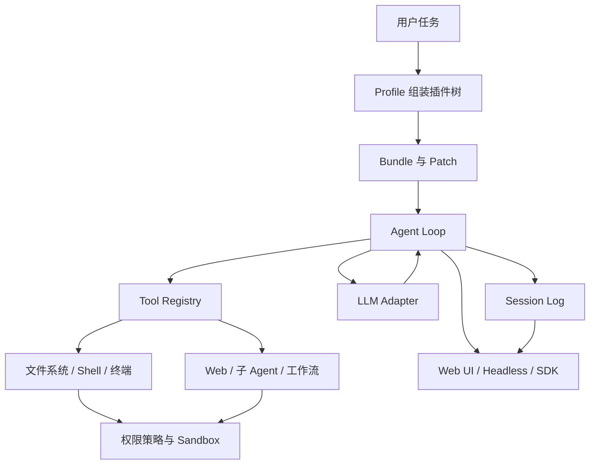
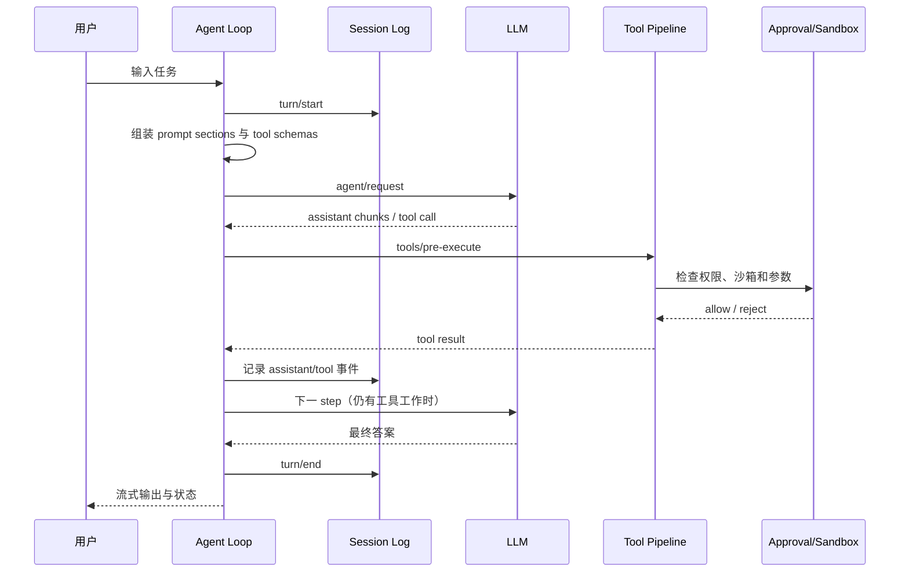

> 版本说明：本文写于 2026-08-17。DeepSeek Harness 官方仓库目前仍标记为 developer preview，命令、配置和插件接口可能发生不兼容变化。本文以官方公开的 README、架构文档和用户指南为准；Programmatic Tool Calling（下文简称 PTC）以 Anthropic 的公开定义作为主要参考。文中的 PTC 代码是概念示例，不是 DeepSeek Harness 的已发布 API。

## 先说结论

DeepSeek Harness（dsh）不是一个新模型，而是一个让模型能够稳定完成真实任务的 Agent runtime：它负责组装提示词和工具、驱动模型循环、执行文件与命令、管理权限、保存会话，以及把这些能力组织成可替换的插件树。

Programmatic Tool Calling 也不是“再加一个工具”。它改变的是工具调用的控制流：普通 tool calling 中，模型一次请求一个工具，宿主程序执行后再把结果放回下一次模型请求；PTC 中，模型先生成一段受控代码，代码在沙箱里连续调用多个工具、过滤和聚合数据，最后只把较小的结果交还给模型。

可以用两个比喻快速区分：

~~~
DeepSeek Harness = Agent 的操作系统/运行时
PTC             = Agent 执行工具批处理任务的一种调度模式
~~~

二者可以组合，但不能混为一谈。Harness 提供“在哪里运行、如何审计和如何扩展”的基础设施；PTC 决定“模型如何编排一批工具调用”。截至本文写作时，不能据此声称 dsh 已内置 Anthropic 同名的 PTC API。

## 1. 为什么需要 Harness

让模型输出一段自然语言很容易，真正让它完成一个工程任务则需要处理大量边界：

1. 模型要知道当前工作目录、可用工具和权限边界。
2. 工具调用可能失败、超时或返回非常大的结果。
3. 多轮任务需要保留可重放的会话历史，而不是只保留最后一条答案。
4. 文件、Shell、网络和子进程都具有真实副作用，必须经过审批或沙箱。
5. 用户可能在 Agent 工作时继续发消息，运行时需要定义这些消息何时进入下一步。
6. 同一套 Agent 逻辑可能需要接入不同的模型、终端后端或远程沙箱。

这些工作如果散落在一个巨大的 while 循环里，换模型、换工具或换权限策略都会牵一发动全身。Harness 的价值就是把“模型推理”和“任务执行”拆开，并提供一个可替换的组合层。

## 2. DeepSeek Harness 是什么

官方仓库将 DeepSeek Harness（dsh）定义为 DeepSeek AI 开源的 agent harness。这里的 harness 可以译成“运行框架”或“编排外壳”：它包住模型调用，同时提供工具、会话、策略和 UI 等运行时能力。

它的核心设计口号是：

> Everything is a plugin.

这并不只是把几个功能放进插件目录，而是连模型适配器、工具注册表、会话日志和 Agent Loop 本身都作为 Cordis 插件挂载到共享上下文中。插件注册服务和事件，卸载时可以撤销自己的注册和副作用。

### 2.1 从模型到可工作的 Agent

一个完整请求大致经过以下层次：

这里的关键关系是：模型只负责产生消息或工具意图；Agent Loop 负责把这些意图变成受策略约束的执行；Session Log 记录模型真正看到的上下文和工具结果。

### 2.2 Cordis：把能力挂到共享上下文

DeepSeek Harness 使用 Cordis 作为底层插件框架。可以把一个插件想成同时包含三部分：

- **Service Definition**：声明能力的接口，例如 LLM、文件系统或工具注册表。
- **Service Provider**：提供具体实现，例如 DeepSeek API、本地 Shell 或远程 E2B 沙箱。
- **Consumer**：使用该能力的 Agent、工具或 UI。

真正的“能力接缝”需要三者配合。仅仅添加一个函数并不能让能力在不同后端之间可替换。

这种设计带来一个很实用的替换关系：如果 Bash、PTY 和 LSP 都通过同一个文件系统/子进程服务访问，那么把本地 provider 换成远程 sandbox provider，消费者不必各自做一套远程分支。

### 2.3 Profile、Bundle 和 Patch

一个正在运行的 dsh 并不是固定二进制，而是启动时由多层配置组合出的插件树：

~~~
Profile
  -> 按顺序加载 Bundle
  -> profile 自己的 cordis.patch.yml
  -> 用户 home 层 patch
  -> 命令行 --patch overlay
~~~

官方提供的两个常见模板是：

- web：增加浏览器 Web UI，适合交互式工作。
- headless：不启动服务器，适合脚本或自动化流水线。

dsh-base 是 profile 的基础层，包含模型适配器、工具、持久化、沙箱、审批策略、设置、凭据和遥测等能力。Bundle 负责分发插件和配置行；Patch 可以替换某一行的完整配置，或插入一行新配置。

这使得定制 Agent 不一定要 fork 主仓库。更常见的方式是创建一个自己的 profile 或 patch：替换模型 provider，禁用某个工具，给特定 Agent 增加一个隔离的能力集合。

### 2.4 Agent Loop 和 Session Log

官方架构文档把一次执行分成 turn 和 step：

- **Turn**：从用户输入被接收开始，到 Agent 没有继续工作为止。
- **Step**：一次模型请求以及它触发的工具调用。

典型时序如下：

“模型可见就必须可记录”是这个设计的关键不变量。文件内容、工具结果或注入上下文如果最终送进模型请求，就应该能从会话日志中重建。这样才能支持恢复、分叉、回放、遥测和故障排查。

### 2.5 如何运行

从 npm 运行 Web UI：

~~~bash
npx @deepseek-ai/dsh web
~~~

默认地址是 http://127.0.0.1:3080。打开 Settings → Models 配置 DeepSeek API Key，然后选择一个工作目录，才能开始会话。

从源码运行：

~~~bash
git clone https://github.com/deepseek-ai/deepseek-harness.git
cd deepseek-harness
pnpm install
pnpm run build
pnpm dsh web
~~~

自动化场景可以选择 headless profile：

~~~bash
pnpm dsh --profile headless "总结这个仓库的主要模块，并指出测试缺口"
~~~

这里要注意三件事：

1. 启动目录会影响默认文件系统范围；不要在不清楚权限策略时直接指向敏感目录。
2. API Key、Shell 和网络访问属于真实副作用，应配置审批或沙箱。
3. developer preview 的命令和磁盘格式不保证向后兼容，升级前应阅读官方变更。

## 3. 普通 Tool Calling 是怎么工作的

先看没有 PTC 的标准流程。模型并不直接执行函数，而是返回结构化的工具意图：

~~~json
{
  "name": "get_weather",
  "arguments": {"city": "Shanghai"}
}
~~~

宿主程序验证名称和参数，调用真实函数，再把结果作为 tool_result 发起下一次模型请求：

~~~python
messages = [{"role": "user", "content": "上海今天适合跑步吗？"}]

while True:
    response = model.create(messages=messages, tools=tool_schemas)
    messages.append(response.assistant_message)

    if not response.tool_calls:
        print(response.text)
        break

    for call in response.tool_calls:
        # 宿主程序掌握真正的网络、文件和凭据权限
        result = dispatch_tool(call.name, call.arguments)
        messages.append(tool_result(call.id, result))
~~~

这个模型容易理解，也方便做逐次审批和审计，但有一个明显成本：每个工具结果都要经过宿主程序和模型 API，结果还会进入上下文。

假设模型要查询 100 个用户的订单状态，并且每个查询平均耗时 80 ms：

~~~
串行普通调用：100 次工具调用 + 最多 100 次模型往返
批量普通调用：仍可能需要把 100 个结果全部塞回上下文
~~~

实际系统通常会并发一部分调用，但“谁决定调用顺序、如何过滤和如何聚合”仍然要由模型和宿主循环反复协调。

## 4. Programmatic Tool Calling 是什么

PTC 的核心思想是让模型生成一小段程序，然后由受控执行环境中的程序调用工具。模型可以在代码里完成循环、条件判断、并发、过滤和聚合，而不是为每个元素单独生成一个 tool call。

概念流程是：

~~~
用户问题
  -> 模型生成代码
  -> 沙箱校验代码和可用工具
  -> 代码调用工具 A/B/C 多次
  -> 在沙箱内过滤、排序、聚合
  -> 只返回摘要或最终数据
  -> 模型继续推理并回答用户
~~~

关键变化在于“工具调用发生在哪里”：

| 维度 | 普通 Tool Calling | Programmatic Tool Calling |
| --- | --- | --- |
| 控制者 | 模型与宿主循环交替控制 | 模型一次生成程序，程序控制一批调用 |
| 往返次数 | 可能每个工具调用都触发模型往返 | 一段程序可包含多次工具调用 |
| 中间结果 | 通常回到模型上下文 | 可留在沙箱中处理 |
| 适合任务 | 少量、需要逐步决策的调用 | 大量独立调用、筛选和聚合 |
| 新风险 | 工具参数和权限错误 | 代码执行、资源配额和数据外泄 |

### 4.1 一个概念示例

假设有两个工具：list_repositories() 返回仓库列表，get_open_issues(repo) 返回某仓库的 issue。问题是找出“最近 30 天仍有高优先级 issue 的仓库”。

普通循环可能让模型反复生成：

~~~
调用 list_repositories
调用 get_open_issues(repo-1)
调用 get_open_issues(repo-2)
...
~~~

PTC 的概念代码可以是：

~~~python
# 概念代码：展示 PTC 的控制流，不对应 dsh 的具体 API。
repos = await tools.list_repositories()

selected = []
for repo in repos:
    issues = await tools.get_open_issues(repo["name"])
    recent_high = [
        issue for issue in issues
        if issue["priority"] == "high" and issue["age_days"] <= 30
    ]
    if recent_high:
        selected.append({
            "repo": repo["name"],
            "count": len(recent_high),
        })

return sorted(selected, key=lambda item: item["count"], reverse=True)
~~~

如果工具支持安全并发，可以进一步写成：

~~~python
repos = await tools.list_repositories()
results = await gather(
    tools.get_open_issues(repo["name"])
    for repo in repos
    if repo["archived"] is False
)

# 只把聚合后的几十行结果交回模型，而不是把全部 issue 原文放进上下文。
return summarize_recent_high_priority(results)
~~~

这里最重要的不是“让模型写任意 Python”，而是让执行器暴露一个受限工具命名空间。tools.get_open_issues 可以被记录、限流、取消和审计；代码本身不能因此获得宿主机的任意文件或网络权限。

### 4.2 PTC 为什么可能更快、更省上下文

设有 N 次工具调用，每次宿主与模型之间的固定往返开销为 L_m，工具本身平均耗时为 L_t。普通逐次调用的粗略成本可以写成：

$$
T_{normal} \approx N \times (L_m + L_t)
$$

PTC 把多个调用放进一次代码执行中，粗略变成：

$$
T_{ptc} \approx L_m + L_{sandbox} + N \times L_t
$$

当 N 较大、L_m 明显高于单次工具开销，并且调用之间可以并发或在沙箱内聚合时，PTC 更有优势。上下文方面，普通模式可能把 N 份原始结果传回模型；PTC 可以只返回过滤后的 K 份结果，其中 K 远小于 N。

但这个公式不是承诺：

- 如果只有 1～2 次调用，沙箱启动成本可能超过节省的往返。
- 如果每一步都依赖模型判断，代码无法提前展开调用。
- 如果工具自身是长耗时远程任务，模型往返不是主要瓶颈。
- 如果聚合逻辑复杂且执行器资源受限，PTC 可能增加失败重试成本。
## 5. PTC 与相邻概念的边界

### 5.1 与 MCP 的关系

MCP 主要解决“工具如何被发现、描述和连接”的协议问题；PTC 主要解决“模型如何编排一批工具调用”的执行问题。一个 MCP 工具可以被普通 tool calling 调用，也可以作为 PTC 代码中的受控函数调用。

~~~
MCP       = 工具连接/描述协议
PTC       = 工具批处理/编排控制流
Harness   = 把模型、协议、执行器、策略和会话装配起来的运行时
~~~

三者不是互斥替代品。

### 5.2 与代码解释器的关系

代码解释器通常强调让模型运行代码来处理数据、计算或生成文件；PTC 强调代码可以调用一组模型可用工具。二者可以共享沙箱，但权限模型不同：代码解释器未必能访问业务工具，PTC 也不应该默认拥有任意包安装和公网访问权限。

### 5.3 与子 Agent 的关系

子 Agent 是把问题分派给另一个有独立上下文和策略的 Agent；PTC 是在同一个执行上下文中批量编排工具。前者适合任务分解和专业角色，后者适合大量机械调用和局部聚合。它们可以嵌套，但需要明确预算、取消和结果边界。

## 6. 安全、正确性与可观测性

PTC 把“模型想调用哪个工具”扩展成“模型能生成怎样的程序”，攻击面也随之扩大。一个可用的执行器至少应考虑以下约束。

### 6.1 最小权限

不要把宿主机的 os、任意 Shell、完整网络和环境变量直接暴露给模型代码。更合理的是提供窄接口：

~~~
允许：tools.search_docs(query)
允许：tools.get_issue(id)
禁止：open('/etc/passwd')
禁止：读取 API_KEY 环境变量
禁止：任意 curl 到公网
~~~

### 6.2 资源与生命周期

为每段 PTC 程序设置：

- 最大执行时间和总工具调用数
- 并发度、内存和输出大小
- 单工具超时与整段程序超时
- 用户取消时的中断传播
- 沙箱复用和冷启动策略

超时后不能只杀掉外层进程；如果工具在远端排队，还要有取消或幂等的协议，否则重试可能造成重复写入。

### 6.3 部分失败和幂等

批量任务经常出现“97 个成功、3 个失败”。执行器需要明确返回：

~~~json
{
  "succeeded": 97,
  "failed": 3,
  "errors": [
    {"key": "repo-17", "kind": "timeout", "retryable": true}
  ],
  "partial": true
}
~~~

对于写操作，最好要求工具支持幂等键，并默认把 PTC 工具设计成只读。批量删除、发送消息或修改权限等动作应回退到逐次确认，而不是让模型代码一次执行全部副作用。

### 6.4 审计不能只记最终答案

一个可排障的记录至少要包含：

1. 模型生成的代码版本或哈希。
2. 实际调用了哪些工具、参数摘要和调用顺序。
3. 每次调用的开始/结束时间、耗时、退出码和错误类别。
4. 代码最终返回给模型的聚合结果。
5. 审批、拒绝、取消和资源限制事件。

这与 DeepSeek Harness 的 Session Log 思路是一致的：模型真正看到的内容和执行事实应该能够被重放，而不是只保留漂亮的最终回答。

## 7. 什么时候使用哪一种

### 更适合普通 Tool Calling

- 调用次数很少。
- 每一步都需要模型根据上一步结果做决策。
- 工具具有重要副作用，需要逐次展示和审批。
- 希望最容易实现、调试和解释。

### 更适合 PTC

- 有大量相互独立的查询。
- 需要在工具结果内部过滤、排序、去重或聚合。
- 中间结果很大，但最终只需要少量摘要。
- 沙箱和工具执行器已经具备限流、取消和审计能力。

### 不要为了“少几次请求”强行使用 PTC

如果任务依赖长链路推理，或者工具调用本身涉及付款、删除、发信、改权限等高风险写操作，逐次调用和人类审批通常更容易保证正确性。PTC 的目标是减少不必要的编排往返，不是绕过治理。

## 8. 一个可落地的组合方式

如果要在 Harness 类运行时中增加 PTC，建议把它设计成独立能力，而不是修改 Agent Loop 的所有分支：

~~~
PTC Service Definition
  -> PTC Provider：本地进程 / 容器 / 远程沙箱
  -> PTC Consumer：把“批量工具编排”暴露给 Agent
  -> Tool Adapter：把白名单工具映射成沙箱内函数
  -> Session/Telemetry：记录代码、调用和聚合结果
~~~

模型请求只需获得一个清晰的能力描述，例如“可以在受限沙箱中批量调用以下只读工具”。Provider 负责执行和资源限制，Consumer 负责把 PTC 结果接回 Agent Loop，Session 层负责持久化模型可见输入和输出。

这种边界的好处是：

- 本地开发可以用简单进程 provider。
- 生产环境可以换成容器、微 VM 或远程 sandbox。
- 普通 tool calling 和 PTC 可以由策略按任务选择。
- PTC 失败时可以回退为逐次调用，而不需要重写整个 Agent Loop。

## 9. 动手试验建议

如果只是了解 DeepSeek Harness，可以先启动 Web UI：

~~~bash
npx @deepseek-ai/dsh web
~~~

然后选择一个不含敏感信息的测试仓库，给 Agent 一个只读任务，例如：

~~~
总结这个仓库的主要包，列出每个包的入口文件，并指出测试覆盖的空白。
~~~

观察三个问题：

1. 模型请求和工具调用如何交替出现？
2. 工具被拒绝或失败时，会话如何继续？
3. 刷新页面后，之前的上下文和工具结果是否能恢复？

如果要验证 PTC 的思想，不需要一开始就接入真实写操作。可以实现一个只读的实验工具集：list_items、get_item、filter_items，分别比较 10、100、1000 个元素下的模型往返数、输入 token、沙箱执行时间和最终结果大小。至少记录以下指标：

~~~text
model_round_trips
tool_calls
input_tokens / output_tokens
sandbox_cold_start_ms
tool_wall_time_ms
result_bytes_to_model
partial_failure_count
~~~

只有同时观察这些指标，才能判断 PTC 是减少了真正的瓶颈，还是把成本转移到了沙箱和执行器。

## 10. 总结

DeepSeek Harness 的价值在于把 Agent 从一段模型调用代码提升为可配置、可审计、可替换的运行时：插件树负责组合能力，Agent Loop 负责推进任务，工具管线和策略负责约束副作用，Session Log 负责让模型可见的世界可重建。

PTC 则是工具编排层的一种优化模式。它允许模型把循环、并发、过滤和聚合放进受限代码执行中，从而减少模型往返和上下文污染，但同时要求更成熟的沙箱、权限、幂等、取消和审计设计。

最稳妥的工程路线通常是：先用普通 tool calling 建立清晰的工具契约和观测，再把大量、低风险、可聚合的只读任务迁移到 PTC。不要把 PTC 当作万能加速开关，也不要把“模型生成代码”误解成“模型可以直接操作宿主机”。

## 参考

1. [DeepSeek Harness 官方仓库](https://github.com/deepseek-ai/deepseek-harness)
2. [DeepSeek Harness 架构文档](https://github.com/deepseek-ai/deepseek-harness/blob/master/docs/architecture.md)
3. [DeepSeek Harness Web UI 指南](https://github.com/deepseek-ai/deepseek-harness/blob/master/docs/user/guide/index.md)
4. [Cordis：DeepSeek Harness 使用的插件框架](https://github.com/cordiverse/cordis)
5. [Anthropic：Programmatic Tool Calling](https://docs.anthropic.com/en/docs/agents-and-tools/tool-use/programmatic-tool-calling)
6. [Anthropic：Tool Use 概览](https://docs.anthropic.com/en/docs/agents-and-tools/tool-use/overview)
