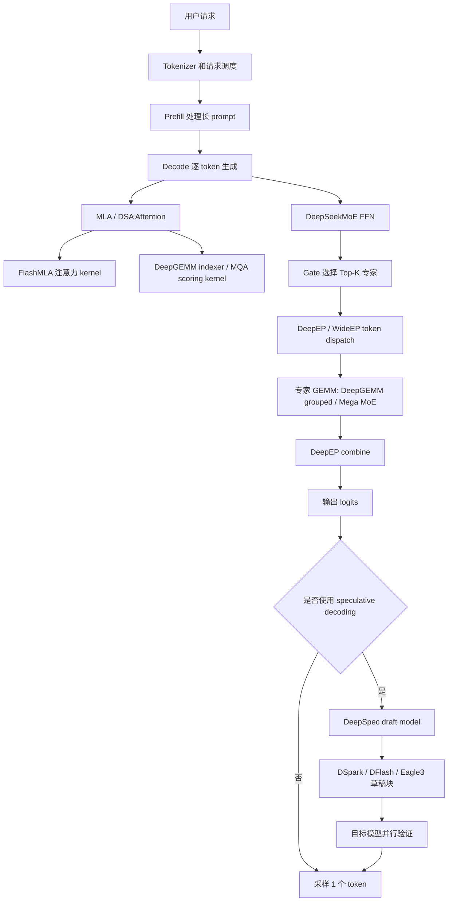
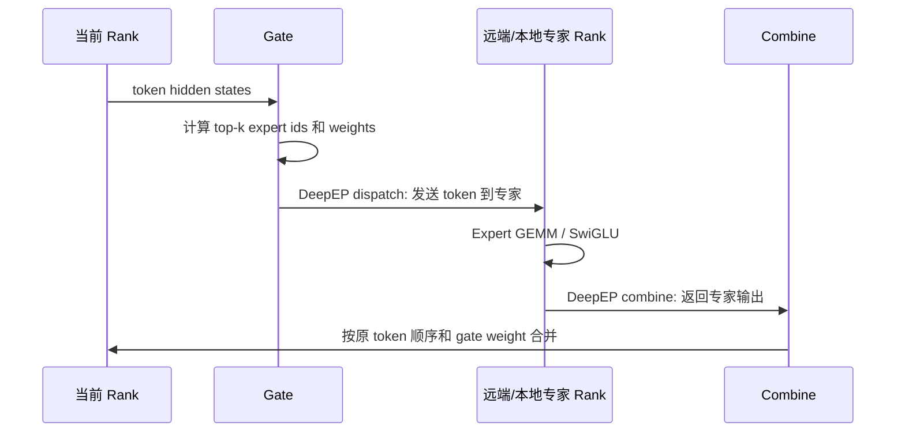
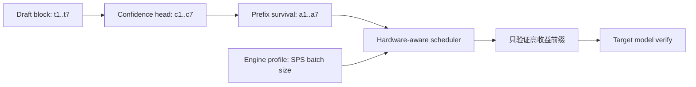
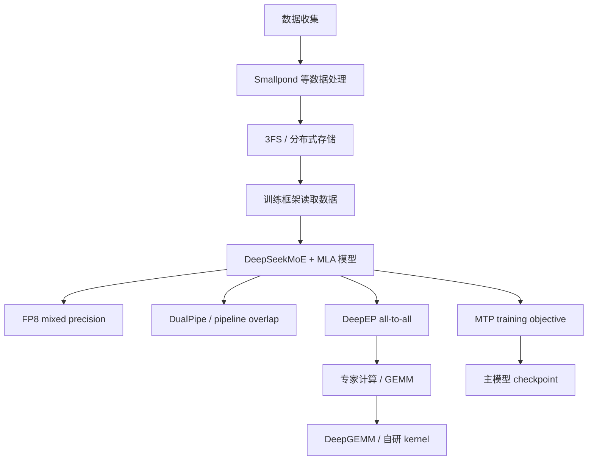
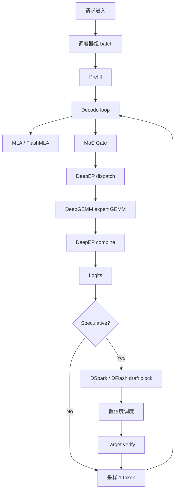

## 0. 先说结论

DeepSeek 相关技术栈不能只理解成“一个模型”。它更像一整套围绕 **MoE 大模型训练与推理** 做出来的系统工程：

- **模型层**：DeepSeek-V3 / V3.2 的核心是 MLA、DeepSeekMoE、辅助损失无关的负载均衡、MTP、DSA。
- **通信层**：DeepEP 负责 MoE expert parallelism 里的 token dispatch / combine，也就是把 token 发给对应专家、再把专家输出收回来。
- **WideEP**：可以理解成“大规模、跨节点、宽 expert parallelism”的系统形态。它不是一个独立于 DeepEP 的常见官方仓库名，而是 DeepSeek/社区语境里对更大 EP 域、更宽专家并行部署方式的说法。实际工程上通常落到 DeepEP、EPLB、路由策略、RDMA/NVLink 拓扑、负载均衡这些组件。
- **DeepGEMM**：高性能 Tensor Core GEMM / grouped GEMM / MoE kernel 库，解决“专家内部矩阵乘怎么快”的问题。
- **FlashMLA**：MLA / DSA attention kernel，解决“注意力尤其是长上下文注意力怎么快”的问题。
- **DeepSpec / DSpark / DFlash**：面向 speculative decoding。DeepSpec 是训练和评估 draft model 的工程框架；DSpark 是 DeepSeek 提出的半自回归 draft 模型与置信度调度方法；DFlash 是第三方 Z Lab 的 parallel draft 思路，DeepSpec 支持它作为算法基线和训练配方。
- **EPLB、3FS、Smallpond**：分别偏专家负载均衡、分布式文件系统、大规模数据处理，属于支撑训练/推理平台的基础设施。

如果用一句话概括：**DeepSeek 的技术路线是用 MoE 降低每 token 激活参数，用 MLA/DSA 降低 KV 和注意力成本，用 FP8/FP4/GEMM kernel 压低算力成本，用 DeepEP/WideEP 把专家并行通信做薄，用 DSpark 一次多猜几个 token 来降低自回归延迟。**

> 资料说明：本文根据 DeepSeek 官方 GitHub 仓库、DeepSeek-V3 / V3.2-Exp 论文、DeepSpec/DSpark 论文、DeepEP/DeepGEMM/FlashMLA README 等公开资料整理，时间截至 2026-07-03。DeepSeek 生态更新很快，具体 API 和性能数字以官方仓库最新版本为准。

## 1. 先建立一张总图

DeepSeek 技术栈可以按“一个 token 从请求到输出”的路径来看：



从这张图可以看到，不同项目解决的瓶颈不一样：

| 组件 | 主要问题 | 一句话解释 |
|---|---|---|
| MLA | KV Cache 太大 | 把 K/V 压到 latent 空间，只缓存更小的表示 |
| DeepSeekMoE | 大模型训练/推理太贵 | 总参数很大，但每个 token 只激活少量专家 |
| DeepEP | MoE 跨卡通信太贵 | 高性能 all-to-all，把 token 发到对应专家再收回 |
| WideEP | 专家并行规模变宽后通信/负载更复杂 | 大 EP 域下的拓扑、通信、负载均衡系统化方案 |
| DeepGEMM | GEMM 是主要算子瓶颈 | 为 FP8/FP4/BF16、grouped MoE、indexer 写定制 kernel |
| FlashMLA | 注意力 kernel 瓶颈 | 为 MLA、稀疏 MLA、FP8 KV cache 写定制 attention kernel |
| DSA | 长上下文 dense attention 太贵 | 用 lightning indexer 挑 top-k token 做细粒度稀疏注意力 |
| DeepSpec | draft model 怎么训练/评估 | speculative decoding 的数据、训练、评测框架 |
| DSpark | draft 块长了之后接受率下降、验证浪费 | 半自回归草稿 + 置信度调度验证长度 |
| DFlash | 并行 draft model | 一次生成多个草稿 token，用 target hidden states 增强 draft |

## 2. DeepSeek-V3/V3.2 的底座：MoE + MLA

### 2.1 为什么是 MoE

普通 dense 模型里，每个 token 都会经过所有 FFN 参数。模型越大，每个 token 的计算越贵。

MoE 的想法是：

1. 准备很多个专家，每个专家本质上是一个 FFN。
2. 每个 token 先经过 gate，选出 Top-K 个专家。
3. 这个 token 只送到被选中的专家。
4. 最后把这些专家输出按 gate 权重加权合并。

DeepSeek-V3 是一个 **671B 总参数、每 token 激活 37B 参数** 的 MoE 模型。也就是说，它有非常大的总容量，但单个 token 不需要跑完整 671B 参数。

一个简化版 MoE 过程如下：

```text
token hidden state
    |
    v
gate: 给每个专家打分
    |
    v
Top-K experts: 例如选 expert 3、expert 17、expert 91
    |
    v
把 token 发给这些专家计算
    |
    v
按 gate 权重合并专家输出
```

### 2.2 MoE 的第一个难点：负载均衡

MoE 最怕所有 token 都挤到少数几个专家：

- 热门专家过载，等待队列变长。
- 冷门专家空闲，GPU 利用率下降。
- 跨卡通信出现热点。
- 严重时要丢 token，影响训练或推理质量。

传统做法是在 loss 里加一个 auxiliary loss，强迫 gate 把 token 分散到不同专家。但这个辅助损失太强时，会干扰模型本来想学的语义路由。

DeepSeek-V3 的关键点是 **auxiliary-loss-free load balancing**：

- 每个专家有一个 routing bias。
- 这个 bias 只参与 Top-K 路由，不参与最终专家输出的 gate 权重。
- 如果某个专家过载，就降低它的 bias。
- 如果某个专家负载不足，就提高它的 bias。

可以把它理解成一个动态调价系统：某条路太堵，就临时提高通行成本；某条路太空，就降低成本。模型的真实专家权重仍由原始 affinity 决定，负载均衡的调节尽量不污染模型表达能力。

### 2.3 MoE 的第二个难点：通信

MoE 的专家通常分布在不同 GPU、不同机器上。一个 batch 的 token 经 gate 后，可能需要被发往很多专家所在的 rank。这个过程叫：

- **dispatch**：把 token 发到专家所在卡。
- **expert compute**：专家 FFN 做 GEMM。
- **combine**：把专家输出发回原 token 所在位置并加权合并。

这就是 DeepEP 和 WideEP 要解决的问题。

## 3. MLA：为什么 DeepSeek 的 KV Cache 更省

自回归推理时，每生成一个 token，都要和历史 token 做 attention。为了避免每步重复计算历史 K/V，系统会缓存 KV Cache。

标准 MHA 的 KV Cache 大致随下面因素线性增长：

```text
层数 × 序列长度 × KV head 数 × head_dim × dtype_size
```

上下文越长、并发越高，KV Cache 越容易把显存吃满。

**MLA（Multi-head Latent Attention）** 的核心是：不要把完整 K/V 都缓存下来，而是缓存压缩后的 latent 表示，再在计算时恢复出每个 head 需要的 K/V。DeepSeek-V3 论文里说，MLA 只需要缓存压缩后的 `c_KV` 和携带 RoPE 的 `k_R` 这类更小表示，从而显著降低 KV Cache。

直观类比：

```text
普通 MHA:
每个 token 存一大摞 K/V 原始材料

MLA:
每个 token 存一份压缩包 + 少量位置信息
需要计算时再从压缩包展开
```

MLA 的收益主要体现在：

- 长上下文时显存压力更低。
- 同样显存能容纳更多并发请求。
- decode 阶段读 KV Cache 的内存带宽压力下降。

但 MLA 也带来 kernel 实现复杂度：压缩表示、RoPE 部分、MQA/MHA 模式、FP8 KV cache、paged KV cache 都需要定制 attention kernel，所以 DeepSeek 开源了 FlashMLA。

## 4. DSA：DeepSeek-V3.2 的长上下文稀疏注意力

DeepSeek-V3.2-Exp 在 V3.1-Terminus 基础上引入了 **DSA（DeepSeek Sparse Attention）**。它的目标很明确：长上下文里，dense attention 的 $O(L^2)$ 成本太高。

DSA 由两个部分组成：

1. **Lightning Indexer**：为当前 query token 和历史 token 打一个 index score。
2. **Fine-grained token selection**：只选得分最高的 top-k 历史 token 做主 attention。

可以理解成：

```text
普通 dense attention:
当前 token 看所有历史 token

DSA:
当前 token 先用一个很便宜的 indexer 扫一遍历史
挑出最可能有用的 top-k token
主 attention 只看这 top-k 个 token
```

论文里强调，DSA 将主模型 attention 的核心复杂度从 $O(L^2)$ 降到 $O(Lk)$，其中 $k \ll L$。虽然 lightning indexer 本身仍然有 $O(L^2)$ 的打分过程，但它头数少、可用 FP8 实现，相比完整 MLA 便宜得多。

### 4.1 DSA 和 FlashMLA / DeepGEMM 的关系

DSA 不是只改模型结构，还需要 kernel 支撑：

- **DeepGEMM** 提供 V3.2 lightning indexer 的 MQA scoring kernel。
- **FlashMLA** 提供 sparse MLA prefill / decoding kernel。
- **FlashMLA** 支持 FP8 KV cache 的 sparse decoding。

所以 DSA 是算法与 kernel 的共同设计。如果只有稀疏注意力想法，没有高效 indexer 和 sparse attention kernel，端到端不一定快。

## 5. DeepEP：MoE 的高性能通信库

DeepEP 的全名在 README 里写作 DeepEveryParallel。当前重点是 **expert parallelism**，也就是 MoE 的 dispatch / combine。

### 5.1 DeepEP 解决什么

MoE 层里，token 分配很不规则：

- 每个 token 选的专家不同。
- 每个专家收到的 token 数不同。
- 专家可能跨 GPU、跨节点。
- dispatch 和 combine 都类似 all-to-all，但比普通 all-to-all 更不规则。

DeepEP 提供的是面向 MoE 的 GPU 通信 kernel，而不是普通业务 RPC。

一个 MoE 层的数据流：



### 5.2 DeepEP V2 的几个关键词

官方 README 提到 V2 的重点包括：

- **ElasticBuffer**：统一 high-throughput 和 low-latency API。
- **NCCL Gin backend**：V2 从 NVSHMEM 路线切到更轻量的 NCCL Gin backend。
- **更大 EP 域**：README 提到支持到 EP2048 级别。
- **更少 SM 占用**：V3-like legacy training 场景下，从 24 SM 降到 4-6 SM，同时保持相当或更好性能。
- **通信计算重叠**：dispatch 后可以用 `EventOverlap` 让 compute stream 等待通信完成，也可以在通信飞行期间做独立计算。
- **RDMA / NVLink 友好**：跨节点用 RDMA，节点内用 NVLink/NVSwitch。

DeepEP 的难点不是“能不能发数据”，而是：

1. 发送路径不能吃掉太多 SM，否则专家 GEMM 没资源。
2. 小 token batch 的低延迟和大 batch 的高吞吐需要不同优化。
3. 跨节点 RDMA、节点内 NVLink、rank 拓扑、虚拟通道、拥塞都要考虑。
4. token 数不均衡时仍要尽量避免尾延迟。

### 5.3 DeepEP 和 DeepGEMM 的接口关系

DeepEP 负责把 token 排列成专家需要的布局；DeepGEMM 负责专家内部 GEMM。

官方 DeepGEMM README 里有一个很关键的点：masked grouped GEMM 可以直接吃 DeepEP low-latency kernel 的输出。这说明两者不是孤立库，而是为了 MoE 推理链路共同设计。

简单说：

```text
DeepEP: token 怎么搬、怎么排、怎么收
DeepGEMM: 排好以后专家矩阵乘怎么算得最快
```

## 6. WideEP：更宽的专家并行

你提到的 `wideep`，公开资料里更常见的写法应是 **WideEP / Wide EP**，即 wide expert parallelism。

它不是像 DeepGEMM、DeepEP、FlashMLA 那样有一个同名 DeepSeek 官方主仓库的独立组件。更合理的理解是：当 MoE expert parallelism 的并行域变得很宽，跨更多 GPU、更多节点部署专家时，需要一整套“Wide EP”系统能力。

### 6.1 为什么需要 WideEP

小 EP 域时，问题相对简单：

```text
8 张卡，专家都在一个节点里
NVLink/NVSwitch 足够快
dispatch/combine 大多是节点内通信
```

WideEP 场景会变成：

```text
几十到上千 rank
专家跨节点分布
节点内 NVLink + 节点间 RDMA 混合
不同专家热度差异明显
通信路径可能拥塞
```

此时难点从“写一个 all-to-all kernel”升级成系统问题：

- 专家放在哪些 rank 上？
- gate 的 top-k 会不会总打到远端节点？
- 一次 dispatch 需要走几条 NIC？
- 是否需要限制每个 token 最多跨多少节点？
- 热门专家如何复制或迁移？
- 解码阶段单 token、小 batch 低延迟怎么保证？
- 高并发时怎样避免某个专家成为尾延迟来源？

### 6.2 WideEP 需要哪些配套组件

WideEP 可以拆成几层：

| 层 | 作用 | 典型组件 |
|---|---|---|
| 路由层 | token 选专家，控制跨节点成本 | gate、node-limited routing |
| 负载层 | 防止专家冷热不均 | auxiliary-loss-free bias、EPLB |
| 通信层 | dispatch/combine | DeepEP |
| 计算层 | grouped expert GEMM | DeepGEMM |
| 拓扑层 | 利用 NVLink/RDMA/NIC | NCCL Gin、RDMA、虚拟通道 |
| 调度层 | batch、prefill/decode、QoS | 推理引擎调度器 |

因此本文把 WideEP 作为“宽专家并行系统形态”讲，而不是把它当成一个单独 pip 包。

### 6.3 WideEP 和 node-limited routing

DeepSeek-V3 论文里提到 node-limited routing：每个 token 最多发送到有限数量的节点，从而限制跨节点通信成本。

这对 WideEP 很关键。假设一个 token 的 Top-8 专家散落在 8 个不同节点上，那么 dispatch/combine 的网络扇出非常大；如果通过路由约束让它最多去少数节点，通信更可控。

代价是：路由自由度下降，可能牺牲一点专家选择最优性。所以 WideEP 的本质是 tradeoff：

```text
模型质量 / 路由自由度
        vs
通信成本 / 尾延迟 / 系统吞吐
```

## 7. EPLB：专家并行负载均衡

EPLB 通常指 expert parallelism load balancing。它关注的是：专家分布和 token 负载如何更均匀。

DeepSeek-V3 已经在训练时通过 routing bias 做负载均衡，但推理系统还有额外问题：

- 用户请求分布实时变化。
- 不同领域 prompt 会激活不同专家。
- 长上下文、短回复、代码、数学、闲聊的专家热度不同。
- 并发变化会放大热点。

EPLB 的价值是从系统侧继续做负载治理。例如：

- 统计每个专家实际 token 量。
- 根据热度调整专家副本或放置。
- 在不破坏模型语义太多的前提下减少跨节点热点。
- 辅助调度器判断哪些 rank 可能成为瓶颈。

可以把它理解成 MoE 服务里的“流量工程”。

## 8. DeepGEMM：DeepSeek 的高性能 GEMM 库

GEMM 就是矩阵乘，LLM 里最核心的计算之一。MoE 里每个专家本质上是 MLP，主要算子仍然是 GEMM。

DeepGEMM 的定位是一个轻量、高性能、JIT 编译的 CUDA Tensor Core kernel 库。它支持：

- FP8 GEMM。
- FP4 / FP8xFP4 相关 GEMM。
- BF16。
- MoE grouped GEMM。
- masked grouped GEMM。
- V3.2 lightning indexer 的 MQA scoring kernel。
- Mega MoE：把 EP dispatch、linear1、SwiGLU、linear2、EP combine 融合/重叠。

### 8.1 为什么普通 GEMM 不够

MoE 的 expert GEMM 和普通 dense MLP 不一样：

```text
Dense FFN:
一个大矩阵乘，batch 规则，形状稳定

MoE expert:
很多专家，每个专家收到 token 数不同
每个专家矩阵形状类似，但 M 维不同
decode 阶段 token 很少，形状更碎
```

所以需要 grouped GEMM：

```text
expert 0: 37 tokens × hidden
expert 1: 4 tokens × hidden
expert 2: 0 tokens × hidden
expert 3: 91 tokens × hidden
...
```

DeepGEMM 的 contiguous grouped GEMM 适合训练 forward 或 inference prefill：把每个专家的 token 拼起来，每段对应一个专家。

masked grouped GEMM 适合 decode：CUDA graph 下 CPU 可能不知道每个专家真实 token 数，就用 mask 告诉 kernel 哪些部分有效。

### 8.2 FP8 / FP4 为什么重要

大模型训练推理的瓶颈通常是：

- Tensor Core 算力。
- HBM 显存带宽。
- 显存容量。
- 通信带宽。

FP8/FP4 的意义是：

- 同样带宽能搬更多元素。
- 同样显存能放更多权重、激活或 KV。
- Tensor Core 可用更高吞吐。

但低精度不是简单把 dtype 改成 FP8：

- 需要 scale factor。
- scale factor 的布局要适合 TMA / Tensor Core。
- 不同架构如 SM90、SM100 对格式要求不同。
- 某些部分要保留 BF16/FP32 保证精度。

DeepGEMM 的 README 提到，SM90 的 LHS scaling factor 用 FP32，SM100 使用 packed UE8M0 格式。这类细节就是 kernel 库存在的原因。

### 8.3 Mega MoE 是什么

Mega MoE 是 DeepGEMM 后续加入的更激进优化：把下面这些阶段尽量融合并重叠：

```text
EP dispatch
    +
linear 1
    +
SwiGLU
    +
linear 2
    +
EP combine
```

传统流水线里，每个阶段都有 kernel launch、同步、读写中间 buffer。Mega MoE 试图减少这些边界，让通信和 Tensor Core 计算更紧密重叠。

直观理解：

```text
普通做法:
搬 token -> 等 -> GEMM1 -> 写中间结果 -> 激活 -> GEMM2 -> 等 -> 搬回

Mega MoE:
边搬边算，尽量少落中间结果，把多段 MoE 路径压成一个更连续的执行单元
```

这类优化特别适合 MoE，因为 MoE 的通信和计算天然交替出现，边界开销很高。

## 9. FlashMLA：MLA / DSA 的注意力 kernel

FlashMLA 是 DeepSeek 的优化 attention kernel 库，服务 DeepSeek-V3 和 V3.2-Exp。

它覆盖两类核心 kernel：

- dense MLA prefill / decoding。
- sparse MLA prefill / decoding。

README 中还提到 FP8 KV cache 的 sparse decoding。它的 KV cache 格式大致是：

- NoPE 部分量化成 FP8。
- scale factor 单独存。
- RoPE 部分保留 BF16。

这说明 FlashMLA 的目标不是通用 attention 教学实现，而是服务 DeepSeek MLA 结构的生产 kernel。

### 9.1 FlashMLA 与 FlashAttention 的区别

FlashAttention 解决的是标准 attention 的 IO-aware 计算问题。FlashMLA 面对的是 DeepSeek 自己的 MLA 形态：

- K/V 不是标准完整 KV，而是 latent 表示。
- decode 阶段可能使用 MQA 模式。
- V3.2 引入 token-level sparse attention，需要 indices 指定要看的 token。
- KV cache 可能是 FP8 with scale 的特殊格式。

所以二者关系可以理解为：

```text
FlashAttention: 标准 attention 的高性能实现
FlashMLA: DeepSeek MLA / sparse MLA 的高性能实现
```

## 10. DeepSpec：speculative decoding 的训练框架

自回归生成的基本瓶颈是：每次目标模型 forward 通常只确认一个新 token。

Speculative decoding 的基本想法是：

1. 用一个小 draft model 先猜多个 token。
2. 用大 target model 一次 forward 并行验证这些 token。
3. 接受与 target 分布一致的最长前缀。
4. 一旦某个位置拒绝，后面的草稿 token 全部丢弃。
5. 这个过程可以保持目标模型分布不变，因此理论上不损质量。

简化公式：

```text
平均每 token 延迟 ≈ (draft 时间 + verify 时间) / 平均接受 token 数
```

所以优化目标有三个：

- draft model 要快。
- draft token 要准，接受长度要长。
- verify 不要浪费太多 batch capacity。

DeepSpec 是 DeepSeek 开源的 speculative decoding 训练/评估框架，包含：

- 数据准备。
- target cache 构建。
- draft model 训练。
- 评估脚本。
- Eagle3、DFlash、DSpark 三类 draft 模型支持。
- Qwen3、Gemma 等目标模型配置。

官方 README 提醒，默认 Qwen/Qwen3-4B 设置下 target cache 可能达到约 38TB，这说明 speculative decoding 的训练并不只是写个小模型，还涉及大量目标模型输出缓存。

## 11. DFlash：并行 draft model

你提到的 `dflash`，需要特别说明：**DFlash 不是 DeepSeek 原创官方项目名，而是 Z Lab 的一个 parallel draft model 方向；DeepSpec 引入了它的设计和训练配方，并发布了对应 checkpoint。**

DFlash 的核心是 parallel drafter：

- 一次 forward 生成一个 block 的多个 draft token。
- draft latency 几乎不随 block size 线性增长。
- 它会利用 target model 的 hidden states 做上下文增强，也就是 DSpark 论文里说的 KV injection。

### 11.1 DFlash 为什么快

自回归 draft：

```text
猜 token 1 -> 再猜 token 2 -> 再猜 token 3 -> ...
```

parallel draft：

```text
一次 forward 同时猜 token 1, token 2, token 3, ...
```

因此 DFlash 可以用更长 block，提高理论接受上限。

### 11.2 DFlash 的问题

并行预测的短板是 block 内 token 之间依赖弱。

例子：

```text
上下文: "没问题，"
合理续写 A: "我马上处理"
合理续写 B: "我现在看看"

并行 draft 可能每个位置独立混合多个模式：
"我现在处理"、"我马上看看" 有时能通，有时会变得别扭
```

更严重的是 speculative decoding 验证只接受最长连续前缀。第 2 个 token 错了，第 3-7 个即使不错也会被丢弃。因此并行 draft 常见问题是越到 block 后面接受率衰减越快，叫 suffix decay。

DSpark 就是在 DFlash 这类 parallel draft 的基础上补这个短板。

## 12. DSpark：半自回归草稿 + 置信度调度

DSpark 是 DeepSeek 提出的 speculative decoding 框架。论文标题是 **Confidence-Scheduled Speculative Decoding with Semi-Autoregressive Generation**。

它解决两个问题：

1. 并行 draft 缺少 block 内 token 依赖，后缀接受率掉得快。
2. 长 block 全部拿去 verify 会浪费目标模型 batch capacity。

### 12.1 半自回归生成

DSpark 把 draft 生成拆成两段：

```text
重的 parallel backbone:
一次 forward 生成每个 draft 位置的 hidden states / base logits

轻的 sequential head:
从左到右给每个位置补一个依赖前文 token 的 bias
```

也就是：

```text
final_logits[k] = base_logits[k] + prefix_dependent_bias[k]
```

这个 sequential head 可以是：

- **Markov head**：只看前一个 token。
- **RNN head**：维护一个 block 内 recurrent state，看更长前缀。

DeepSpec 代码里 `markov_head.py` 的实现非常直观：`VanillaMarkov` 用前一个 token 的 embedding 经过低秩投影生成 vocab bias，再加到 base logits 上；`RNNHead` 则用类似 GRU 的状态在 block 内逐步更新。

这就是“半自回归”的含义：

- backbone 仍然并行，保住速度。
- 输出头轻量串行，补上 token 之间的依赖。

### 12.2 置信度调度验证

即使 DSpark 一次能 draft 7 个、16 个 token，也不应该总是全部 verify。

原因是：

- 如果系统很空，verify 多几个 token 成本低，可以多试。
- 如果系统很忙，低置信度 token 会占用 target model batch capacity，拖慢其它请求。
- 不同请求的接受率不同，代码/格式化任务可能接受率高，开放聊天可能低。

DSpark 引入 confidence head，为每个 draft 位置输出一个置信度：

```text
c_k = 第 k 个 token 在前面都接受的条件下，也能被接受的概率
```

那么前 j 个 token 都存活的概率大致是：

```text
a_j = c_1 × c_2 × ... × c_j
```

调度器再根据当前推理引擎的吞吐曲线 SPS(B)，选择每个请求 verify 多长前缀，使系统期望吞吐最大。



论文报告，在 DeepSeek-V4 serving system 的线上流量中，相对 MTP-1 production baseline，DSpark 在匹配吞吐下将单用户生成速度提高了 60%-85%（V4-Flash）和 57%-78%（V4-Pro）。这类数字要注意上下文：它是特定模型、特定服务系统、特定 SLA/吞吐匹配条件下的生产结果，不等价于在任何开源推理框架上直接获得同等收益。

### 12.3 DSpark、DFlash、Eagle3 怎么比较

| 方法 | draft 方式 | 优点 | 短板 |
|---|---|---|---|
| Eagle3 | 更偏自回归/树式思路 | token 依赖强，接受率好 | draft latency 随长度增长，验证 token 可能多 |
| DFlash | 并行 block draft | 一次 forward 产多个 token，速度好 | block 内依赖弱，后缀接受率衰减 |
| DSpark | parallel backbone + sequential head | 兼顾并行速度和局部依赖 | 实现更复杂，需要 confidence 校准和调度 |

DSpark 的定位不是简单“更大的 draft model”，而是把算法和服务调度一起考虑。

## 13. MTP：DeepSeek-V3 里的多 token 预测

DeepSeek-V3 还有一个容易和 speculative decoding 混在一起的概念：**MTP（Multi-Token Prediction）**。

MTP 在训练阶段让模型在每个位置不仅预测下一个 token，还预测多个未来 token。它的目的有两个：

- 增加训练信号密度，提高数据效率。
- 让模型表征更有“预规划”能力。

DeepSeek-V3 的 MTP 是用多个顺序模块预测额外 token，并保持完整 causal chain。论文也提到，MTP 模块在推理时可以丢弃，让主模型独立工作；也可以被重新用于 speculative decoding。

区别如下：

| 概念 | 主要阶段 | 作用 |
|---|---|---|
| MTP training objective | 训练 | 改善主模型能力，并可为 speculative decoding 提供模块 |
| DSpark / DFlash | 推理加速 | 用 draft model 猜 token，再让 target model 验证 |

## 14. 3FS 与 Smallpond：数据和存储基础设施

DeepSeek 的公开 Open Infra 里还包括 3FS 和 Smallpond。这些不是模型结构本身，但对大规模训练/数据处理很重要。

### 14.1 3FS

3FS 通常指 Fire-Flyer File System，是面向 AI 训练场景的高性能分布式文件系统。它解决的问题是：

- 训练数据规模极大。
- 多节点训练需要高吞吐读取。
- checkpoint 很大，保存和恢复成本高。
- 数据预处理和训练任务共享存储压力。

对于大模型训练，存储不是“硬盘够大”就行，还要考虑：

- 顺序读吞吐。
- 随机小文件访问。
- 元数据压力。
- 多训练任务并发。
- checkpoint 写入峰值。

### 14.2 Smallpond

Smallpond 更偏数据处理框架，常和 3FS 搭配理解。它面向大规模数据预处理、清洗、转换、分析这类工作。

LLM 训练前的数据管线通常包括：

```text
原始网页 / 代码 / 书籍 / 对话
    -> 解析
    -> 去重
    -> 质量过滤
    -> 安全过滤
    -> 分桶
    -> tokenizer
    -> 训练样本格式
```

这些步骤如果用单机脚本处理会非常慢，因此需要分布式数据处理系统。

## 15. 把它们放进训练和推理链路

### 15.1 训练链路



训练侧的关键词是：**吞吐、稳定、成本**。

DeepSeek-V3 论文报告，其完整训练消耗 2.788M H800 GPU hours，并强调 FP8 mixed precision、DualPipe、跨节点 MoE 通信优化、无 token dropping 等共同降低成本。

### 15.2 推理链路



推理侧的关键词是：**首 token 延迟、decode TPS、并发容量、尾延迟、显存容量**。

不同组件对应不同瓶颈：

- KV 显存瓶颈：MLA、FP8 KV、Paged KV。
- 长上下文 attention 瓶颈：DSA、FlashMLA sparse kernel。
- MoE 通信瓶颈：DeepEP、WideEP。
- expert compute 瓶颈：DeepGEMM grouped GEMM、Mega MoE。
- 自回归串行瓶颈：MTP、DSpark、DFlash。
- 负载热点瓶颈：auxiliary-loss-free routing bias、EPLB、调度器。

## 16. 常见误解

### 16.1 “MoE 参数大，所以推理一定更慢”

不一定。MoE 总参数大，但每 token 激活参数少。推理是否快取决于：

- 激活专家数。
- 专家是否跨节点。
- dispatch/combine 成本。
- expert GEMM 是否足够大、足够规则。
- batch 和并发是否能填满 GPU。

MoE 的难点是系统工程，而不是单纯 FLOPs。

### 16.2 “DSA 是无损稀疏注意力”

不能这么说。DSA 是训练进模型结构里的稀疏注意力机制，通过 continued training 让模型适应稀疏模式。它不是对任意 dense 模型推理时随便裁掉 attention token 还能完全等价。

### 16.3 “Speculative decoding 一定无损”

经典 speculative decoding 的接受/拒绝采样规则可以保持 target distribution。但工程实现要满足条件：

- draft 分布和 target 分布都正确参与接受概率。
- 调度不能偷看未来 token 造成 selection bias。
- 采样、温度、top-p 等策略要和验证逻辑一致。

DSpark 论文中特别讨论了 non-anticipating property，说明调度器不能根据未来 candidate token 做会破坏分布的决策。

### 16.4 “DeepGEMM 可以替代 cuBLAS”

DeepGEMM 更像 DeepSeek 形态下的高性能专用 kernel 库，尤其是 FP8/FP4、MoE grouped、indexer、Mega MoE 等场景。常规 dense GEMM 仍可能使用 cuBLAS、CUTLASS、Triton 等方案。不要把它理解成所有矩阵乘的通用替代品。

### 16.5 “WideEP 是一个单独工具”

公开资料里，WideEP 更适合理解为宽专家并行系统方案，而不是一个固定 API 的单独官方仓库。实际落地要组合 DeepEP、DeepGEMM、EPLB、路由策略和集群网络。

## 17. 如果要学习，推荐路径

建议按这个顺序学：

1. **Transformer 推理基础**：prefill、decode、KV Cache、batching。
2. **MoE 基础**：gate、Top-K expert、dispatch/combine、expert parallelism。
3. **DeepSeek-V3 论文**：重点看 MLA、DeepSeekMoE、load balancing、MTP、FP8、DualPipe。
4. **DeepEP README**：理解 MoE 通信 API、ElasticBuffer、dispatch/combine。
5. **DeepGEMM README**：理解 grouped GEMM、masked layout、FP8/FP4 scale factor、Mega MoE。
6. **FlashMLA README**：理解 MLA decoding、sparse MLA、FP8 KV cache。
7. **DeepSeek-V3.2-Exp 论文**：理解 DSA、lightning indexer、top-k token selection。
8. **DeepSpec + DSpark 论文**：理解 speculative decoding、DSpark、DFlash、confidence scheduler。

## 18. 总结

DeepSeek 技术栈的核心不是某一个“神奇优化”，而是连续的瓶颈拆解：

- 参数太贵：用 MoE。
- MoE 通信太贵：用 DeepEP / WideEP 思路压 all-to-all。
- 专家计算太碎：用 DeepGEMM grouped / masked / fused kernel。
- KV Cache 太大：用 MLA。
- 长上下文 attention 太贵：用 DSA + FlashMLA + indexer kernel。
- 自回归逐 token 太慢：用 MTP / speculative decoding / DSpark。
- draft 长了又浪费验证：用 confidence-scheduled verification。
- 训练数据和 checkpoint 太大：用 3FS / Smallpond 这类基础设施。

这也是大模型系统现在的典型方向：模型架构、数值格式、kernel、通信、调度、存储一起设计。单看任何一个组件都容易低估它的价值；把它放回整条训练/推理链路，才能看出 DeepSeek 为什么会开源这么多“看似分散”的项目。

## 参考

- DeepSeek-V3 GitHub：https://github.com/deepseek-ai/DeepSeek-V3
- DeepSeek-V3 论文：https://arxiv.org/pdf/2412.19437
- DeepSeek-V3.2-Exp GitHub：https://github.com/deepseek-ai/DeepSeek-V3.2-Exp
- DeepSeek-V3.2-Exp 论文：https://github.com/deepseek-ai/DeepSeek-V3.2-Exp/blob/main/DeepSeek_V3_2.pdf
- DeepEP：https://github.com/deepseek-ai/DeepEP
- DeepGEMM：https://github.com/deepseek-ai/DeepGEMM
- FlashMLA：https://github.com/deepseek-ai/FlashMLA
- DeepSpec：https://github.com/deepseek-ai/DeepSpec
- DSpark paper：https://github.com/deepseek-ai/DeepSpec/blob/main/DSpark_paper.pdf
- DFlash：https://github.com/z-lab/dflash
- DeepSeek Open Infra Index：https://github.com/deepseek-ai/open-infra-index
