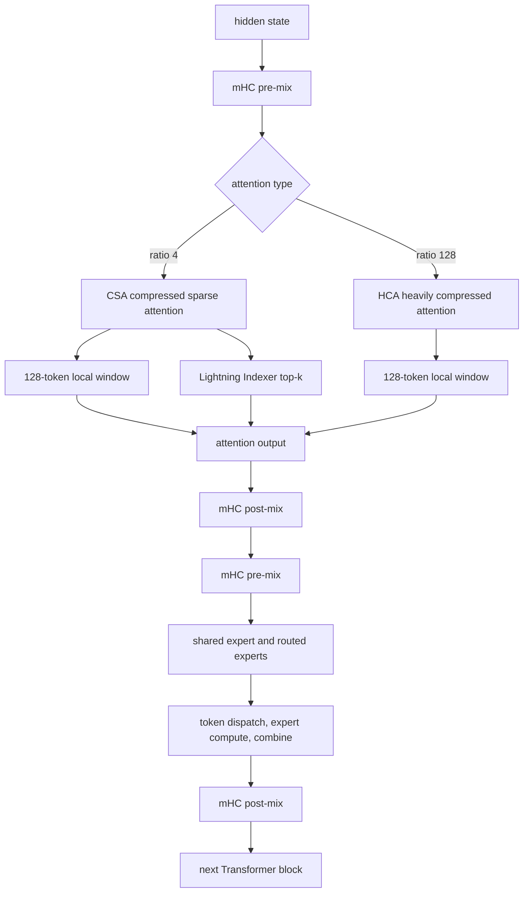
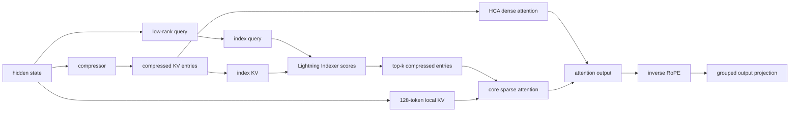
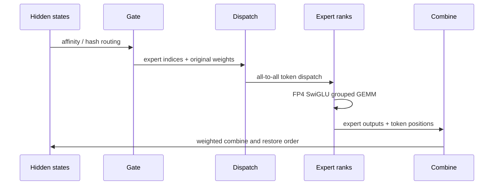

> 资料范围：截至 2026-09-04。本文以 DeepSeek 官方发布公告、官方技术报告和 `DeepSeek-V4-Pro/Flash` 的公开推理代码为一手依据。V4 的代码和权重仍可能更新，文中的配置值应以文章引用的仓库版本为准。

## 先说结论

DeepSeek-V4 不是靠一个孤立的“新 Attention”解决 1M 上下文，而是把几条成本曲线一起压低：

1. **注意力层交错使用 CSA 与 HCA**。CSA（Compressed Sparse Attention）先把历史 Key/Value 压缩，再用 Lightning Indexer 选出 top-k 压缩块；HCA（Heavily Compressed Attention）把更长的历史压成更少的块后做密集注意力。两者都保留 128 token 的滑动窗口，所以远处看摘要、近处看细节。
2. **mHC（Manifold-Constrained Hyper-Connections）替代普通残差**。残差流扩展成 4 路，动态混合矩阵通过 Sinkhorn-Knopp 投影到双随机矩阵流形，限制深层网络的增益，解决超深 MoE 网络的数值稳定性。
3. **DeepSeekMoE 继续扩大“总容量/激活容量”的差距**。Pro 约 1.6T 总参数，但每个 token 只激活约 49B；384 个 routed experts 中选 6 个，另加 1 个 shared expert。路由 bias 只参与选专家，不污染最终组合权重。
4. **硬件格式和优化器也属于架构的一部分**。主要矩阵使用 Muon，专家权重走 FP4，其他矩阵采用 FP8/BF16 混合精度，RoPE 维度保留 BF16。V4 的低 cache 和低 FLOPs 只有在这些 kernel/量化路径真正存在时才成立。

官方报告在 1M 上下文、指定实现和精度口径下给出的相对结果是：V4-Pro 单 token 推理 FLOPs 约为 V3.2 的 27%，KV cache 约为 10%；V4-Flash 分别约为 10% 和 7%。这些是报告值，不是脱离硬件、batch、分页布局和 kernel 的通用承诺。

## 1. 先把问题说清楚：为什么要改 Attention

### 1.1 自回归推理的两个成本

生成第 $t$ 个 token 时，模型需要让当前 Query 看见历史 $1 \ldots t-1$。训练时可以一次性算完整的 $QK^{\mathsf T}$，推理时却是一 token 一 token 地追加。为了避免反复重算历史 Key/Value，推理系统会保存 KV cache。

标准 MHA 中，某层每个 token 的缓存元素数近似为：

$$
\mathrm{KVElements}_{\mathrm{MHA}}
 = 2 \times n_{\mathrm{kv\_heads}} \times d_{\mathrm{head}}.
$$

若有 $L$ 层、batch 为 $B$、上下文长度为 $T$、每个元素占 $s$ 字节，则：

$$
\mathrm{Bytes}_{\mathrm{KV}}
 \approx B \times L \times T
 \times 2 n_{\mathrm{kv\_heads}} d_{\mathrm{head}} \times s.
$$

这条公式解释了长上下文服务为什么常常先被显存和带宽卡住，而不是先被矩阵乘吞吐卡住：

- $T$ 增大时，cache 线性增长；
- batch 和并发请求增大时，cache 再乘一遍；
- decode 每一步都要读取历史 cache，显存带宽成为稳定的每 token 成本。

GQA/MQA 通过减少 KV head 数来节省 cache，但它们仍然存储每个历史 token 的 K/V。MLA 的思路更激进：让历史 token 以压缩 latent 的形式存在，计算时再恢复当前 head 需要的内容。

### 1.2 V4 的核心参数

下表把官方 `config.json` 中最能影响结构和成本的字段列出来。Pro 与 Flash 共享设计，但不是同一个规模的模型。

| 参数 | DeepSeek-V4-Pro | DeepSeek-V4-Flash | 解释 |
| --- | ---: | ---: | --- |
| 总参数 | 约 1.6T | 约 284B | 官方模型说明中的规模量级 |
| 每 token 激活参数 | 约 49B | 约 13B | 稀疏 MoE 的计算容量 |
| `num_hidden_layers` | 61 | 43 | Transformer block 数 |
| `hidden_size` | 7168 | 4096 | 残差流的单路宽度 |
| `num_attention_heads` | 128 | 64 | Query head 数 |
| `head_dim` | 512 | 512 | 每个 Query head 的维度 |
| `q_lora_rank` | 1536 | 1024 | Query 低秩投影维度 |
| `n_routed_experts` | 384 | 256 | routed experts 数量 |
| `num_experts_per_tok` | 6 | 6 | 每 token 选中的 routed experts 数 |
| `n_shared_experts` | 1 | 1 | 每层始终执行的 shared expert |
| `moe_intermediate_size` | 3072 | 2048 | 单专家 SwiGLU 中间宽度 |
| `index_topk` | 1024 | 512 | CSA 的 indexer 选择数 |
| `index_n_heads` / `index_head_dim` | 64 / 128 | 64 / 128 | Lightning Indexer 的头数和维度 |
| `sliding_window` | 128 | 128 | 每层保留的局部 token 数 |
| `max_position_embeddings` | 1,048,576 | 1,048,576 | 最大上下文长度 |
| `num_nextn_predict_layers` | 1 | 1 | MTP 深度 |

为了让快速阅读时的事实边界不含糊，全文使用下面三种证据层级：

| 证据层级 | 文中标记 | 典型内容 |
| --- | --- | --- |
| 官方报告/公告 | **证据标签：官方报告** | 模型规模、训练 token 数、1M 上下文相对 FLOPs/KV cache |
| 官方推理代码观察 | **证据标签：官方代码观察** | `config.json` 字段、`compress_ratios`、`Block.forward` 的状态形状 |
| 工程解释 | **工程解释** | cache 元素估算、复杂度拆分、通信和 kernel 的部署判断 |

**证据标签：官方代码观察。** Pro 的 `compress_ratios` 以 128、128 开始，随后以 4 和 128 交错，最后一层为纯滑动窗口；Flash 的当前配置以两个纯滑动窗口层开头，再进入 4/128 交错。这说明“V4 使用混合注意力”是架构事实，但具体层表属于模型仓库配置，不能把 Pro 的层表套到 Flash。

## 2. V4 的总数据流

先看一层 Transformer block 内部发生什么，再分别展开每个部件：



## 3. CSA 与 HCA：把“远处历史”变成可检索的压缩块

### 3.1 两种压缩比例对应两种访问模式

设序列长度为 $T$，压缩比例为 $r$，压缩后的 KV entry 数量大约是 $T/r$：

$$
N_{\mathrm{compressed}} \approx \left\lceil \frac{T}{r} \right\rceil.
$$

V4 使用两种典型比例：

- **CSA：$r=m=4$**。entry 较密，适合保留中距离依赖。Lightning Indexer 为每个 query 在压缩 entry 中选 top-k，Pro 的 $k=1024$，Flash 的 $k=512$。
- **HCA：$r=m'=128$**。entry 极少，直接在压缩后的历史上做 dense attention，不再做 token 级 top-k。

两种层都拼接 128 token 的滑动窗口。于是当前 query 的可见集合可以写成：

$$
\mathcal{S}_t =
\underbrace{\{t-127,\ldots,t\}}_{\text{局部窗口}}
\cup
\begin{cases}
\mathrm{TopK}\bigl(I_{t,:}\bigr), & \text{CSA},\\
\{0,\ldots,\lceil T/128\rceil-1\}, & \text{HCA}.
\end{cases}
$$

这里的“远处”并不是原始 token，而是压缩 entry。局部窗口保留原始 token，因此标点、变量名和刚刚出现的实体不会只剩一个粗粒度摘要。

### 3.2 CSA 的 learned gated pooling

CSA 的压缩不是简单平均池化。对一个压缩块的 hidden states $H$，代码中 `Compressor` 产生两路候选：

$$
C^a = H W_{KV}^a,\qquad C^b = H W_{KV}^b,
$$

以及两路门控分数：

$$
Z^a = H W_Z^a,\qquad Z^b = H W_Z^b.
$$

将静态 bias 加到门控分数后，在两路维度上做 softmax：

$$
\alpha = \mathrm{Softmax}
\left(
\left[Z^a+B^a,\ Z^b+B^b\right]
\right).
$$

每个压缩 entry 是按 $\alpha$ 对候选内容逐维加权：

$$
\widetilde{K}
 = \sum_i \alpha_i^a C_i^a
 + \sum_i \alpha_i^b C_i^b.
$$

两路窗口有重叠，因此一个 entry 实际会看到约 $2m$ 个候选 token，但 entry 数仍约为原序列的 $1/m$。这个设计的工程含义是：压缩器可以学习“这一块中哪个 token 的某些维度更重要”，比固定平均更适合代码、表格和长文档中的异质内容。

### 3.3 Lightning Indexer：先便宜检索，再做主 Attention

CSA 的稀疏选择由一个轻量 indexer 完成。对当前 hidden state $h_t$，官方报告给出的抽象形式是：

$$
c_t^Q = h_t W_{DQ},
\qquad
q_t^I = c_t^Q W_{IUQ},
\qquad
w_t^I = h_t W^w.
$$

历史压缩 entry 经过独立的 index compressor 得到 $K_s^{I\mathrm{Comp}}$。index score 为：

$$
I_{t,s}
 =
\sum_{j=1}^{h_I}
w_{t,j}^I
\operatorname{ReLU}
\left(
q_{t,j}^I \cdot K_{s}^{I\mathrm{Comp}}
\right).
$$

其中 $h_I=64$、每个 index head 的维度为 128。实现中 index query 和压缩 KV 走 FP4 量化模拟路径，先计算所有压缩 entry 的分数，再用 `topk` 选出不超过 `index_topk` 个位置：

```python
# 形状是示意，省略并行 rank 和位置偏移
q_i = project_index_query(c_q)       # [batch, seq, 64, 128]
k_i = compressed_index_kv            # [batch, compressed_seq, 128]
score = einsum("bshd,btd->bsht", q_i, k_i)
score = (relu(score) * head_weights).sum(dim=2)
selected = score.topk(index_topk, dim=-1).indices
```

**为什么不直接对原始 token 做 top-k？** 因为 indexer 的输入已经是压缩序列，打分的长度从 $T$ 变成约 $T/4$。主 Attention 只读取选中的 entry，再加局部窗口。对 1M 上下文而言，这让主路径的读取量和矩阵乘规模都从“全历史”变成“局部 + 固定预算”。

**但它不是免费的。** Indexer 仍然要扫描所有压缩 entry，且需要额外的投影和量化 kernel。是否端到端变快，取决于 indexer 的 FP4 kernel、压缩 KV 的布局和 GPU 上的稀疏 Attention 实现。

### 3.4 HCA：更稀疏，但不做选择

HCA 把每 128 个 token 聚合为一个 KV entry，在这些 entry 上做 dense Attention。它省掉了 top-k 选择和不规则 gather，代价是远处的细节被压进更粗的摘要：

| 访问方式 | 历史表示 | 是否选择 | 适合的依赖 |
| --- | --- | --- | --- |
| CSA | 每 4 token 一个 entry | Lightning Indexer top-k | 中距离、需要检索的细节 |
| HCA | 每 128 token 一个 entry | 不选择，dense over entries | 超长距离、全局趋势 |
| 两者共同 | 128 个原始 token 的窗口 | 直接保留 | 最近的精确局部信息 |

从 Pro 的 `compress_ratios` 可以观察到：前两层使用 128 倍压缩，后面以 4/128 交错。Flash 的当前配置略有不同，说明压缩层表是可配置的，而不是模型名称本身的定义。

### 3.5 RoPE、RMSNorm 与 attention sink

V4 的压缩 Attention 还需要处理三个位置和数值细节。

**第一，RoPE 只作用在最后 64 维。** `head_dim=512`，`qk_rope_head_dim=64`，因此 Query/压缩 KV 的前 448 维承载 content，最后 64 维承载旋转位置。这样做让 content 投影可以吸收/融合，而位置部分仍保持可控的旋转结构。

**第二，core Attention 前对 Query 与压缩 KV 做 RMSNorm。** 官方实现中 `q_norm`、`kv_norm` 以及 Query 的逐 head RMS 归一化会把范数限制在可预测范围。报告还指出，加入这类归一化后，训练不再依赖 QK-Clip 作为主要的稳定化手段。

**第三，attention sink 是可学习的额外 logit。** 普通 softmax 会强迫所有概率分给某个历史 token；V4 允许一部分质量流向 sink，使实际 token 上的权重和可以小于 1：

$$
\sum_{s\in \mathcal{S}_t} a_{t,s} \le 1.
$$

在长上下文、稀疏选择或 padding 较多的场景，sink 可以吸收“当前 query 不想看任何历史”的概率质量，减少被迫关注错误 token 的现象。

由于一个压缩 entry 同时承担 key 和 value 的角色，官方代码在 Attention 输出上还会做一次逆位置旋转，才能把 value 的位置旋转还原到输出空间。这是阅读 `sparse_attn` 调用时非常容易漏掉的实现细节。

### 3.6 MQA 与 grouped output projection

V4 的 `num_key_value_heads=1`，因此 core Attention 是 shared-KV MQA：128 个 Pro Query heads 共享一组 512 维 KV。输出端没有直接把 `128 × 512` 平铺后做一个巨大 dense projection，而是先按 `o_groups=16` 分组，以 `o_lora_rank=1024` 做 grouped low-rank projection，再映射回 hidden size。

这两端的设计是配套的：

- 输入侧共享 KV，压低 cache；
- 输出侧分组低秩投影，控制 128 个大 head 的输出矩阵成本；
- Query 侧保留多头，让不同 head 仍能学习不同检索和组合模式。

### 3.7 注意力数据路径图


## 4. mHC：把深层残差流约束在可控的几何空间

### 4.1 从普通残差到 Hyper-Connections

普通 Transformer block 可以写成：

$$
x_{l+1}=x_l+F_l(x_l).
$$

Hyper-Connections（HC）把残差流扩展为 $n_{\mathrm{hc}}$ 路，并学习“从多路输入汇聚到子层”和“把子层输出写回多路”的矩阵：

$$
X_{l+1}
 =
B_l X_l
 +
C_l F_l(A_l X_l).
$$

V4 的 `hc_mult=4`，也就是每个 token 的 hidden state 在 block 内保持 4 份、每份宽度仍为 `hidden_size`。这增加了状态和混合开销，却给模型更多残差路径表达能力。

### 4.2 为什么需要 manifold constraint

如果 $B_l$ 和 $C_l$ 完全自由，61 层甚至更深的网络可能出现残差增益不断放大，训练时表现为激活爆炸、梯度异常或 batch 间数值漂移。mHC 对动态混合施加约束：

- $A$ 通过 sigmoid 变成非负且有界的 pre-mix 权重；
- $C=2\cdot\operatorname{sigmoid}(\cdot)$，限制 post-mix 的直接增益；
- $B$ 通过 `exp` 后的 Sinkhorn-Knopp 迭代投影到双随机矩阵（Birkhoff polytope）。

双随机矩阵满足：

$$
B_{ij}\ge 0,\qquad
\sum_j B_{ij}=1,\qquad
\sum_i B_{ij}=1.
$$

它的谱范数不超过 1，因此在只看线性混合的近似下，不会把残差向量的范数无限放大。官方配置 `hc_sinkhorn_iters=20`，即动态混合参数每次通过 20 次行归一化/列归一化逼近该流形。

### 4.3 代码里一次 mHC mixing 的形状

官方 `Block.hc_pre` 的输入是：

```text
x:       [batch, seq, hc_mult, hidden] = [B, S, 4, D]
hc_fn:   [mix_hc, hc_mult * hidden]
mixes:   [B, S, mix_hc]
pre:     [B, S, hc_mult]
post:    [B, S, hc_mult]
comb:    [B, S, hc_mult, hc_mult]
```

`x` 先 flatten 到 `[B, S, 4D]`，经 RMSNorm 后由动态函数生成 `mixes`，再拆成 `pre/post/comb`。`pre` 将 4 路汇聚成一个子层输入；Attention 或 MoE 返回后，`post` 和 `comb` 再把新输出与旧残差写回 4 路。

这一点很重要：mHC 不是在 Attention 后面再加一个普通残差，而是改变了每个子层的输入输出契约。部署时不能只替换一个 `residual + output` 加法，必须保留 pre/post mixing 和状态形状。

### 4.4 mHC 的代价和边界

- 额外保存 4 路 hidden state，激活内存和带宽都会增加；
- 每个 Attention/FFN 前后都要生成和应用混合权重；
- Sinkhorn 迭代本身需要 kernel 支持，朴素实现不适合直接放在高吞吐 decode 路径；
- 双随机约束主要保证线性混合的增益受控，不能替代数据、路由、量化和 optimizer 的稳定性处理。

因此 mHC 的价值不是“让每层更便宜”，而是用可控的额外开销换取超深稀疏网络的训练余量。

## 5. DeepSeekMoE：总参数做容量，Top-K 做计算

### 5.1 一层 MoE 的计算

每个 Transformer block 都包含一个 MoE FFN。对 token 表示 $x$，gate 为每个 routed expert 产生 affinity，选出 $K=6$ 个专家：

$$
\mathcal{E}(x)=
\sum_{i\in\mathrm{TopK}(x)}
g_i(x) E_i(x)
 + E_{\mathrm{shared}}(x).
$$

Pro 有 384 个 routed experts，Flash 有 256 个；两者都固定激活 6 个 routed experts 和 1 个 shared expert。shared expert 提供每个 token 都能使用的通用容量，routed experts 则学习更专门的模式。

### 5.2 affinity、负载均衡和 hash routing

V4 的 affinity 激活函数从常见的 softmax/sigmoid 路线改成：

$$
s_i(x)=\sqrt{\operatorname{Softplus}(a_i(x))}.
$$

配置中的 `topk_method=noaux_tc` 表示 auxiliary-loss-free 的路由路线。对于非 hash 层，专家 bias 只加到 top-k 选择分数：

$$
\widehat{s}_i=s_i+b_i
\quad\Longrightarrow\quad
\mathrm{TopK}(\widehat{s}),
$$

但最终组合权重仍取原始 $s_i$ 并归一化：

$$
g_i =
\frac{s_i}{\sum_{j\in\mathrm{TopK}}s_j}
\times \mathrm{route\_scale}.
$$

这意味着负载均衡控制器可以动态“调价”热门专家，却不直接改写模型认为的语义 affinity。

前 `num_hash_layers=3` 层使用 hash routing：官方代码维护一个 token ID 到专家 ID 的 `tid2eid` 表，直接根据输入 token 选择专家，不在这些层运行可学习的 top-k。这样做能让训练早期的 dispatch 更确定、负载更可控，但也把路由自由度限制在预定义表上。

### 5.3 SwiGLU 与 clamping

单个 Expert 是 SwiGLU：

$$
\mathrm{SwiGLU}(x)
 =
\mathrm{SiLU}(W_1x)
\odot
(W_3x),
\qquad
E(x)=W_2\mathrm{SwiGLU}(x).
$$

官方代码的 `swiglu_limit=10` 会对 up 分支限制在 $[-10,10]$，对 gate 分支限制上界为 10，再计算 `SiLU(gate) * up`。这是针对低精度和稀疏路由的数值保护：某个热门专家收到大量 token 时，单个极端激活不应把后续矩阵乘推到溢出区间。

### 5.4 Dispatch、expert compute、combine

MoE 真正难的部分往往不是 gate，而是 token 如何跨 GPU 流动：



在单卡示例中可以直接循环本地专家；在多卡部署中，dispatch/combine 变成不规则 all-to-all。V4 的 MegaMoE fused kernel 将 dispatch、专家 GEMM、combine 做细粒度流水重叠，减少“通信结束后才开始算”的空洞。**工程解释：** 当 batch 小、token 分布不均或跨节点链路弱时，理论上的 6 个专家激活数并不等于 6 个专家的理想吞吐。

## 6. Muon、量化和 RoPE 的精度分工

### 6.1 Muon 优化器做了什么

V4 不是把所有参数都交给同一个 AdamW。官方训练报告的分工是：

- embedding、LM head、RMSNorm、mHC 的静态 bias/gating 仍使用 AdamW；
- 其他主要矩阵参数使用 Muon；
- Muon 使用 Nesterov momentum，并用 hybrid Newton-Schulz 对动量矩阵做近似正交化。

可将一次 Muon 更新抽象为：

$$
M_t=\mu M_{t-1}+G_t,
\qquad
\widetilde{M}_t=\mathrm{NS}_{10}(M_t),
\qquad
W_{t+1}=W_t-\eta\widetilde{M}_t.
$$

这里 $\mathrm{NS}_{10}$ 表示 10 次 hybrid Newton-Schulz 迭代。实现前 8 次使用系数 $(3.4445,-4.7750,2.0315)$，后 2 次使用 $(2,-1.5,0.5)$。这些系数是工程实现细节，不应简化成“Muon 等于一次 SVD”。

### 6.2 V4 的混合精度路径

| 数据/参数 | 官方实现观察 | 为什么这样分 |
| --- | --- | --- |
| RoPE 相关最后 64 维 | BF16 | 位置旋转对相位精度敏感 |
| 非 RoPE 的压缩 KV 维度 | FP8 路径 | 降低 cache 字节数和带宽 |
| Lightning Indexer attention | FP4 量化模拟/路径 | index 只负责筛选，可接受更激进的压缩 |
| routed expert 权重 | FP4 | 专家矩阵占参数大头，节省容量 |
| 其他大部分矩阵 | FP8/BF16 混合 | 在吞吐、误差和 kernel 支持间折中 |
| norm、embedding、LM head | 多数保留 BF16/FP32 计算 | 避免累积误差放大 |

官方 `config.json` 的 `quantization_config` 使用 E4M3 FP8 activation scheme，expert dtype 为 FP4，默认计算 dtype 为 BF16。不同硬件的 FP4 格式、scale layout 和 kernel 支持可能不同，不能只看配置文件就推断实际吞吐。

## 7. 训练配方与基础设施：为什么结构能真正跑起来

### 7.1 长度课程和稀疏 attention 的引入时机

官方报告描述的训练长度课程是：

$$
4\mathrm{K}\ \rightarrow\ 16\mathrm{K}\ \rightarrow\ 64\mathrm{K}\ \rightarrow\ 1\mathrm{M}.
$$

训练先用 dense attention 预热，再在 64K 阶段引入 sparse attention。这个顺序的理由是先让模型学会稳定的 dense 表示，再让 indexer/压缩器学习“哪些远处 entry 值得读”。如果一开始就把随机初始化的 top-k 放进主路径，错误选择会同时损害梯度和路由统计。

Flash 预训练约 32T tokens，Pro 约 33T tokens。**证据标签：官方报告。** token 数是训练配方的一部分，不代表任何第三方复现只要使用同样 token 数就能得到相同结果；数据混合、并行拓扑和 kernel 实现同样重要。

### 7.2 Kernel 与确定性

V4 的系统侧有几项和模型结构直接耦合的工程：

- **MegaMoE fused kernel**：把 dispatch、expert compute、combine 重叠；
- **TileLang**：用于融合 kernel 和 host code generation；
- **batch-invariant / bitwise deterministic kernels**：尽量让 batch 形状变化不改变结果，便于训练复现和推理 prefix reuse；
- **异构 KV cache + 磁盘存储**：把共享前缀从 GPU cache 下沉到更大容量介质，需要配合 cache entry 的压缩比例和位置索引；
- **Anticipatory Routing**：在路由或负载将要失衡前提前调整，降低热门专家突然爆发的风险。

这些不是“模型多了几个参数”，却决定了 CSA 的不规则读取、MoE 的跨卡通信和 FP4/FP8 的 scale 能否在端到端链路里兑现。

### 7.3 MTP 和 1M 上下文

`num_nextn_predict_layers=1` 表示启用一层 Multi-Token Prediction（MTP）头。它可以为 speculative decoding 提供额外的预测信号，但不是“每次生成必然多出一个 token”。真正的 draft/verify 速度还取决于接受率、采样策略和服务框架。

1M 上下文也不是只把 `max_position_embeddings` 改成 1,048,576。Pro 配置还包括 YaRN 风格的 rope scaling、`compress_rope_theta=160000`、压缩层表和 sliding window；缺任何一个，位置外推、压缩 entry 对齐或 cache 索引都可能不一致。

## 8. 读官方推理代码：从配置到 forward

### 8.1 关键字段与代码入口

官方 `inference/model.py` 中的字段可以按下面方式对应：

| 代码字段 | 作用 | 在 forward 中的表现 |
| --- | --- | --- |
| `compress_ratios[layer_id]` | 选择当前层的 HCA/CSA/纯窗口模式 | 决定压缩 cache 长度和是否创建 `Indexer` |
| `index_topk` | CSA 远端压缩 entry 预算 | `index_score.topk(...)` |
| `index_n_heads`、`index_head_dim` | indexer 的 64×128 结构 | `einsum` 计算 index score |
| `window_size` | 128 token 局部窗口 | 与压缩 entry 一起拼进 sparse attention |
| `q_lora_rank` | Query 下投影宽度 | `wq_a -> q_norm -> wq_b` |
| `qk_rope_head_dim` | RoPE 尾部维度 64 | Query、KV 和输出的旋转/逆旋转 |
| `o_groups`、`o_lora_rank` | grouped output projection | 先按 group 投影再 flatten |
| `hc_mult`、`hc_sinkhorn_iters` | mHC 路数和 Sinkhorn 次数 | `hc_pre/hc_post` 的动态 mixing |
| `score_func`、`topk_method` | MoE affinity 与负载策略 | `sqrtsoftplus` + noaux top-k |

### 8.2 Attention forward 的简化版

下面是按官方变量名压缩后的逻辑，不是可直接运行的完整源码：

```python
# x: [B, S, D]
qr = q = q_norm(wq_a(x))                         # [B, S, q_lora_rank]
q = wq_b(q).view(B, S, n_heads, head_dim)       # [B, S, 128, 512]
apply_rope(q[..., -64:])

kv = kv_norm(wkv(x))                             # [B, S, head_dim]
apply_rope(kv[..., -64:])
quantize_fp8(kv[..., :-64])

local = get_window_topk_idxs(window_size=128)
if compress_ratio == 4:
    remote = indexer(x, qr).topk(index_topk=1024)
elif compress_ratio == 128:
    remote = get_compress_topk_idxs(ratio=128)

selected = concat(local, remote)
o = sparse_attn(q, compressed_or_window_kv, attn_sink, selected)
apply_inverse_rope(o[..., -64:])
o = grouped_output_projection(o, o_groups=16)
```

两个实现观察值得单独记住：

1. 纯 sliding-window 层没有压缩 KV；代码会关闭长上下文 YaRN，使用基础 `rope_theta`，因为这一层只处理固定窗口。
2. decode 阶段 cache 的布局不是“全序列一个连续 dense tensor”：局部窗口和压缩 KV 分区存放，CSA 还要保存 indexer 所需的压缩状态。做 paged cache 或 prefix reuse 时，页大小必须同时适配原始窗口和压缩比例。

## 9. 1M 上下文下的效率如何理解

### 9.1 官方相对指标

下表只复述官方报告的相对比较，基线是 DeepSeek-V3.2，场景是 1M 上下文的单 token 推理：

| 模型 | 单 token 推理 FLOPs（相对 V3.2） | KV cache（相对 V3.2） |
| --- | ---: | ---: |
| V4-Pro | 约 27% | 约 10% |
| V4-Flash | 约 10% | 约 7% |

报告还给出一个更激进的 cache 参照：与 BF16、GQA8、head dimension 128 的常见 baseline 相比，V4 在 1M 上下文的 KV cache 约为 2%。这里的“2%”同时受压缩比例、FP8 cache、head 共享方式和基线 dtype 影响，不能拿来计算任意模型的绝对显存。

### 9.2 一个元素级估算

如果只比较历史表示数量，不考虑页元数据和 padding：

$$
\mathrm{CacheEntries}_{\mathrm{V4}}
\approx
\frac{T}{r}
 + W,
\qquad W=128.
$$

CSA 层取 $r=4$，HCA 层取 $r=128$，纯窗口层只有 $W$。若非 RoPE 维度使用 FP8、RoPE 维度使用 BF16，则一个 entry 的字节数还要按维度拆开：

$$
\mathrm{BytesPerEntry}
\approx
(d-64)\cdot 1
 +64\cdot 2,
$$

这里只是假设 FP8 为 1 字节、BF16 为 2 字节。真实部署还会受到 batch、tensor parallel 分片、scale、对齐、分页和 kernel workspace 影响。

### 9.3 稀疏并不等于总复杂度自动变成 $O(Tk)$

CSA 的主 Attention 可以近似看成对 $k$ 个压缩 entry 做计算，但 indexer 仍需扫描所有压缩 entry。因此更诚实的成本分解是：

$$
\mathrm{Cost}_{\mathrm{CSA}}
\approx
\underbrace{O(T/r)}_{\text{index scan}}
 +
\underbrace{O(k)}_{\text{selected core attention}}
 +
\underbrace{O(W)}_{\text{local window}}.
$$

常数项来自 index head 数、FP4/FP8 转换和不规则 gather。只有当这些算子由融合 kernel 高效实现时，稀疏结构才会反映到端到端延迟。

## 10. 部署时应该关注什么

### 10.1 先按瓶颈选优化

| 现象 | 优先检查 | V4 中对应的机制 |
| --- | --- | --- |
| 长 prompt 让显存很快耗尽 | KV cache dtype、分页、前缀复用 | 压缩 entry、FP8 非 RoPE cache、异构 cache |
| decode 带宽高、算力利用率低 | cache 读取和 sparse gather | CSA/HCA、128 token window、FlashMLA 类 kernel |
| MoE 层 all-to-all 占时 | EP 拓扑、token 分布、dispatch overlap | MegaMoE/通信融合、负载 bias、hash routing |
| 专家 GEMM 形状碎片化 | grouped GEMM、FP4 scale、专家容量 | FP4 routed experts、融合 expert kernel |
| 深层训练不稳定 | residual 增益、路由热点、激活溢出 | mHC、Sinkhorn、Anticipatory Routing、SwiGLU clamp |

### 10.2 不要把模型配置当成完整部署方案

至少还要确认：

- 推理框架是否实现 `sparse_attn` 的压缩 KV 布局，而不是把它展开成 dense K/V；
- GPU 是否有可用的 FP4/FP8 Tensor Core kernel，scale 格式是否匹配；
- `num_key_value_heads=1`、`o_groups` 和 tensor parallel 分片是否被正确处理；
- batch-invariant kernel 与 paged cache 是否能保持 prefix reuse 的地址/索引稳定；
- 多节点 EP 是否有足够的带宽和通信重叠，否则 6 个 routed experts 的理论激活量会被 all-to-all 延迟淹没。

### 10.3 常见误读

**误读一：V4 只有一种 Attention。**

实际是按层交错的 CSA、HCA 和纯滑动窗口。Pro 与 Flash 的层表也不同。

**误读二：top-k=1024 就意味着只读 1024 个原始 token。**

Indexer 选择的是压缩 KV entry；CSA 的比例为 4，一个 entry 对应一个压缩块，不等于一个原始 token。

**误读三：routing bias 改变了专家的最终权重。**

在 noaux 路由中 bias 只参与 top-k 选择，组合权重取未加 bias 的原始 affinity。

**误读四：mHC 只是把残差加法换成矩阵乘。**

mHC 同时改变子层输入汇聚、输出写回和残差流形约束；`hc_mult=4` 会改变 block 内部状态形状。

**误读五：V4 的 1M 性能可以由参数量直接推出。**

压缩层表、FP4/FP8 kernel、通信、cache layout 和测试 batch 都会改变实际结果。官方比例只能在相同测量语境下比较。

**误读六：MTP=1 等于每步稳定生成两个 token。**

MTP 提供额外预测头；speculative decoding 仍要经过目标模型验证，接受率决定实际收益。

## 11. 总结

DeepSeek-V4 的关键不是“把某一个模块做到极致”，而是让模型结构和系统实现互相配合：

- CSA 用 4 倍压缩和 Lightning Indexer 为中距离历史建立固定检索预算；
- HCA 用 128 倍压缩保留廉价的全局上下文；
- 128 token sliding window 把最近细节从摘要中解耦出来；
- mHC 用 4 路残差和双随机矩阵约束稳定深层传播；
- MoE 把总参数变成容量，把每 token 计算限制在 6 个 routed experts + 1 个 shared expert；
- Muon、FP4/FP8/BF16 和 fused kernel 把这些结构落到可运行的硬件路径；
- 训练长度课程、确定性 kernel 和异构 KV cache 则把 1M 上下文从配置数字变成工程系统。

阅读 V4 时，最有效的方式不是只问“它有多少参数”，而是沿着一个 token 走完整条路径：它先经过哪一种压缩、indexer 读了多少 entry、残差流如何混合、被哪些专家接收、通信和量化在哪里发生。只有把这条路径串起来，1M 上下文下的 FLOPs 和 KV cache 数字才有意义。

## 参考

1. DeepSeek 官方新闻：[DeepSeek-V4 发布公告](https://api-docs.deepseek.com/zh-cn/news/news260424)
2. DeepSeek 官方新闻：[DeepSeek-V4 正式版公告](https://api-docs.deepseek.com/zh-cn/news/news260813)
3. DeepSeek 官方模型页：[DeepSeek-V4-Pro](https://huggingface.co/deepseek-ai/DeepSeek-V4-Pro)
4. DeepSeek 官方模型页：[DeepSeek-V4-Flash](https://huggingface.co/deepseek-ai/DeepSeek-V4-Flash)
5. 官方配置：[DeepSeek-V4-Pro `config.json`](https://huggingface.co/deepseek-ai/DeepSeek-V4-Pro/blob/main/config.json)
6. 官方推理实现：[DeepSeek-V4-Pro `inference/model.py`](https://huggingface.co/deepseek-ai/DeepSeek-V4-Pro/blob/main/inference/model.py)
7. 官方 kernel：[DeepSeek-V4-Pro `inference/kernel.py`](https://huggingface.co/deepseek-ai/DeepSeek-V4-Pro/blob/main/inference/kernel.py)
8. DeepSeek-V4 技术报告：[arXiv:2606.19348](https://arxiv.org/abs/2606.19348)
9. 技术报告可读版：[ar5iv HTML](https://ar5iv.labs.arxiv.org/html/2606.19348)
