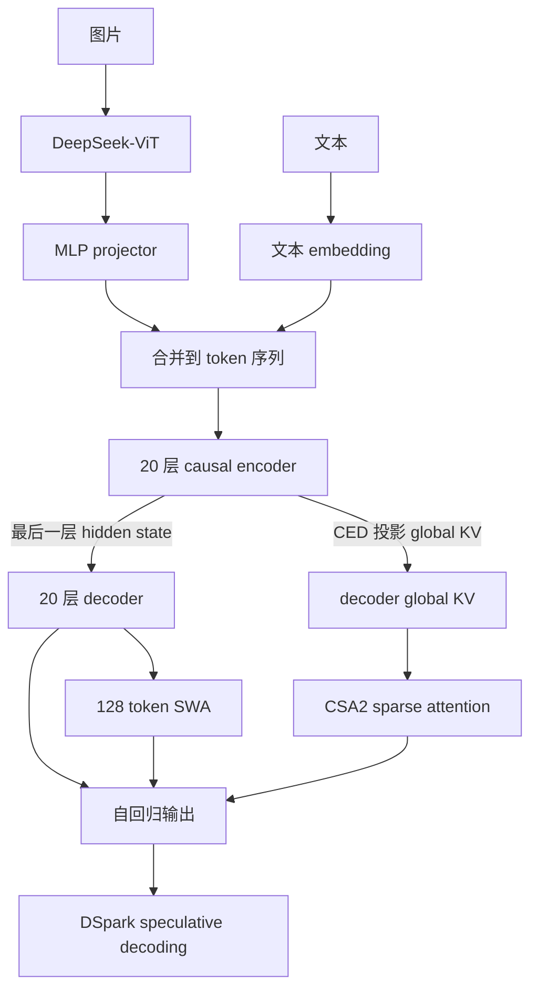

> 资料说明：本文以 DeepSeek-AI 发布的 [DeepSeek_V41_Tech_Report.pdf](https://huggingface.co/deepseek-ai/DeepSeek-V4.1-Flash/blob/main/DeepSeek_V41_Tech_Report.pdf) 为主资料，模型仓库为 [deepseek-ai/DeepSeek-V4.1-Flash](https://huggingface.co/deepseek-ai/DeepSeek-V4.1-Flash)。报告的主题是“Pushing the Limits of KV Cache Compression”，发布时间以仓库页面和报告版本为准。

## 先说结论

DeepSeek-V4.1-Flash 的变化集中在一件事上：让长时间运行的 agent 少做 prefill、少存 KV、少搬运 KV。它不是把 V4 的压缩比例调小，而是同时压缩了三个维度：

1. **层维度**：CED 把 40 层拆成 20 层 causal encoder 和 20 层 decoder。decoder 的 global KV 直接从 encoder 最后一层的 hidden state 投影得到，长前缀不必再完整跑一遍 decoder。
2. **序列维度**：CSA2（Compressed Sparse Attention 2）把 main KV 压缩，并在不同层之间复用 KV、indexer K 和 Top-K 索引。decoder 里的 Hierarchical Sparse Indexer 还把后续检索限制在候选池内。
3. **数值维度**：main KV 使用 MXFP4，SWA KV 保留 FP8。报告给出的 global KV cache 是每 token 890 字节，约为 V4-Flash 的四分之一；persistent KV cache 通过 SWA Bounded Replay 降到 V4 的约八分之一。

模型本身是多模态 MoE：backbone 参数 552B，另有 196B Engram 参数；每 token 在 prefill 阶段激活 8B，decode 阶段激活 16B。它支持最多 1M token 上下文。报告还称，context 从 4K 增长到 1M（256 倍）时，单 token decode FLOPs 只增加约四分之一。

## 1. 模型骨架：40 层分成 encoder 和 decoder

V4.1-Flash 接收文本和图片，统一转成语言 backbone 的 token 序列。图片先经过 DeepSeek-ViT，再经过 MLP projector，插入对应的 image-token 位置。

语言 backbone 有 40 个 causal Transformer layer：前 20 层是 causal encoder，后 20 层是 decoder。每层都有 global attention 和 128 token 的 Sliding Window Attention（SWA），只有 encoder 的前两层使用纯 SWA。

官方配置如下：

| 项目 | V4.1-Flash |
| --- | ---: |
| Backbone 参数 | 552B |
| Engram 参数 | 196B |
| Transformer 层 | 40（encoder 20 + decoder 20） |
| Hidden size | 5120 |
| 最大上下文 | 1,048,576 token |
| Query heads / head dim | 64 / 512 |
| CSA2 压缩比例 | encoder 2，decoder 1 |
| CSA2 top-k | 512 |
| Indexer heads / dim | 32 / 128 |
| Query compression dim | 1280 |
| Hierarchical 候选池 | 最多 2048 个 block，每个 8 个位置，共 16384 个候选位置 |
| SWA window | 128 |
| Routed experts | 384 |
| Shared experts | 1 |
| 每 token 激活 routed experts | 6 |
| 单专家中间维度 | 2304 |

encoder 的 18 个非纯 SWA 层分成三组，每组 6 层：第一层是 CSA2 Full，后五层是 Reuse。decoder 的 20 层分成五组，每组 4 层：第一组是 Full 加三层 Reuse，其余四组是 Reindex 加三层 Reuse。



## 2. CED：prefill 只把 encoder 跑完整

普通 Transformer 在 prefill 时要让每一层处理整段前缀。假设序列长度是 $N$，层数是 $L$，这部分工作量可以粗略写成 $O(NL)$。

CED 把底部 $L/2$ 层当作 causal encoder。对于 decoder 层 $l>L/2$，global attention 所需的 KV 不再从自己的 hidden state $H_l$ 计算，而是从 encoder 最后一层 $H_{L/2}$ 经过该层专属投影得到：

$$
C_l = H_{L/2}W_l^{KV},\qquad Z_l = H_{L/2}W_l^Z
$$

因此长前缀的 global KV 在 encoder 阶段一次生成，decoder 不需要再对全部 $N$ 个 token 做完整的 global KV 计算。对于 $N\gg n_{win}$ 的输入，报告给出的 prefill 复杂度近似为：

$$
O(NL)\;\longrightarrow\;O\left(N\frac{L}{2}+n_{win}\frac{L}{2}\right)\approx O\left(N\frac{L}{2}\right)
$$

SWA 是例外。它依赖每一层自己的 hidden state，所以 encoder 和 decoder 都要维护局部状态。这个代价由后文的 SWA Bounded Replay 控制在 128 token 的范围内。

## 3. CSA2：把 KV 的层维度也压缩

V4 的 CSA/HCA 主要沿序列维度压缩：多个 token 合成一个 KV entry。V4.1 的 CSA2 再沿层维度复用缓存。

CSA2 每层有三种静态模式：

| 模式 | 当前层新算什么 | 复用什么 |
| --- | --- | --- |
| Full | main KV、indexer Q/K、Top-K 索引 | 无 |
| Reindex | 当前层 indexer Q 和新的 Top-K | 最近 Full 层的 main KV、indexer K |
| Reuse | 当前层 Q、SWA KV 和 attention | 最近的 main KV、indexer K、Top-K 索引 |

三种模式都会计算当前层的 query 和 SWA KV。区别只在 global KV、indexer K 和 Top-K 索引从哪里来。

### 3.1 encoder 和 decoder 的分组

encoder 的 CSA2 压缩比例是 $m=2$。18 个 CSA2 层分成三组，每组第一层 Full，后五层 Reuse。因此一组里只有一个 layer 生成 global KV，其余层共享它。

decoder 的压缩比例是 $m=1$，也就是不沿 token 数做额外压缩，但仍然沿层复用。第一组使用 Full + 3 Reuse；之后四组使用 Reindex + 3 Reuse。Reindex 层可以换一套 Top-K 位置，同时不重复保存 main KV。

### 3.2 Hierarchical Sparse Indexer

第一层 Full 会扫描当前可见的所有 main KV，选出自己的 Top-512。它同时按 block 聚合 indexer 分数，选出最多 2048 个 block，每个 block 包含 8 个位置，于是形成最多 16384 个候选位置。

后面的 Reindex 层只在这个候选池中重新打分。候选池大小固定后，后续 indexer 的工作量不再随上下文长度线性增长。Reuse 层连 indexer 都不跑，直接使用最近一次得到的 Top-K。

这个机制有一个前提：候选池限制必须在训练阶段和推理阶段保持一致。否则训练时见过完整上下文，推理时却只能在候选池里搜索，indexer 会出现分布偏移。

CSA2 还简化了压缩器：它取消了 V4 CSA 的重叠压缩和绝对位置偏置，并直接从 main KV 投影 indexer K。实现更简单，训练和推理的中间张量也更少。

## 4. FP4 main KV：缓存格式和 attention 格式分开

V4.1-Flash 把 main KV 压成 OCP MXFP4。论文采用 E2M1 数据格式，每 16 个 channel 使用一个 E4M3 scale；不再额外使用全局 scale。attention 计算前再把缓存反量化，因此不要求 GPU 原生支持 FP4 矩阵乘。

这条路径的取舍是：

- main KV：FP4，目标是降低 HBM 和 SSD 存储量；
- SWA KV：FP8，因为局部状态对量化更敏感；
- 反量化后的 KV：使用更高精度格式参与 attention，保持硬件兼容性。

报告给出的 global KV footprint 是每 token 890 字节，约为 V4-Flash 的 1/4。这个数字指始终保存在 HBM 中的 global KV，不等于模型权重大小，也不等于一个请求的全部内存占用。

## 5. SWA Bounded Replay：不把 SWA 写进 SSD

SWA KV 只在一个活跃会话的短时间内有用。跨会话保留它会占用大量 SSD，却很少被再次读取。V4.1 的做法是：

- global KV 写入 persistent KV cache，目标保留至少 72 小时；
- SWA KV 放进每台机器约 10% host DRAM 的分布式内存池，TTL 只有几分钟；
- SWA 从内存池淘汰后，使用 bounded replay 重建，而不是把它写回 SSD。

精确重建 $L$ 层的 SWA，理论上要重放 $L\times n_{win}$ 个 token。bounded replay 只重放最近 $n_{win}=128$ 个 token，并截断 replay 段能看到的窗口：

$$
\mathrm{SWAKeys}(i)=\left[\max(s,i-W+1),\ i\right]
$$

其中 $s$ 是 replay 起点，$W$ 是窗口大小。这样重建出来的 state 不是完整前向的数学等价物，但报告实验显示质量影响很小。

对于 encoder，命中 global KV 但缺少 SWA KV 时，系统重放缓存前缀最后 128 个 token，再接着处理未缓存的 suffix。重放部分只生成 SWA KV，不覆盖已经命中的 global KV。

对于 decoder，CED 已经提供了 global KV，系统只需把 prompt 最后 128 个 token 的 encoder 输出经过 decoder，得到 decode 初始阶段需要的 SWA KV。这样可以避免把整个 decoder 前缀重新跑一遍。

这两个 replay 策略让 persistent KV cache 只保存复用价值高的 global KV。论文估算 persistent footprint 约为 V4 的 1/8。

## 6. MoE 与 Engram：容量、记忆和路由

V4.1-Flash 每个 Transformer block 都使用 DeepSeekMoE：1 个 shared expert 加 384 个 routed experts，每个 token 选 6 个 routed experts，单专家中间维度为 2304。

因为图片 token 和文本 token 的分布不同，模型为两种模态维护独立的 expert correction bias。bias 只影响专家选择，原始 routing score 仍用于组合专家输出。这样做可以分别平衡图像和文本 token 的专家负载。

Engram 是另一条参数路径。模型分配 196B Engram 参数，放在第 1 层和第 14 层（从 0 开始计数），每个模块使用 2、3、4-gram，8 个 hash head，总 embedding 维度为 2048，表项约 1600 万。Engram 的查表地址只依赖输入 token，因此可以提前从 host memory 通过 RDMA 预取；第一模块的预取可以和第一个 Transformer block 的计算重叠。

这解释了参数和激活量的差距：backbone 552B 是总容量，prefill 每 token 激活 8B，decode 激活 16B；Engram 参数是条件访问的记忆表，不会在每个 token 上全部计算。

## 7. Single-Pass mHC：减少残差流的读写

V4 的 mHC 在相邻 block 之间维护多条 residual stream。原实现需要多个 kernel，activation memory traffic 约为理想下界的两倍。

V4.1 把输入 mixing 系数延后一层使用：当前 block 消费前一个 block 产生的系数。这样 residual update、input mixing 和 coefficient prediction 可以在同一遍 tile traversal 中完成。部署 kernel Mega-mHC 的读写量达到 $(2n+2)d$，相较原始 mHC 的 $(3n+2)d$，少了一次 residual 读取。

论文的工程含义很直接：当 attention 和 MoE 都已经被压缩后，activation 的读写也可能成为瓶颈；融合 kernel 才能把结构上的节省兑现成延迟。

## 8. DSpark：用置信度决定验证长度

V4.1 不再使用 V3 的 MTP 模块，而是单独训练 DSpark 做 speculative decoding。DSpark 包含：

- 3 个 Transformer block，滑窗为 128；
- 一次前向并行生成 5 个 draft position 的 base logits；
- Markov head 建模 draft token 之间的依赖；
- confidence head 预测每个位置的接受概率；
- scheduler 根据前缀存活概率和当前引擎吞吐曲线，动态决定验证长度。

因此验证长度不是固定常数。负载高、接受率低时，scheduler 可以缩短验证；接受率高且系统有余量时，可以多验证几个 draft token。

## 9. 推理系统：EPD 解耦和少 kernel 路径

部署采用 Encoder–Prefill–Decode（EPD）解耦，把 vision encoding、prefill 和 decode 分开扩缩容，并让它们重叠执行。

在大多数 CSA2 Reuse 层，prefill 只执行约 15 个 kernel，decode 约 11 个 kernel。报告列出的关键融合实现包括 FlashMLA 的 fused-RoPE-attention-RoPE-cast、DeepGEMM 的 Mega-Gate/Mega-mHC/Mega-MoE、TileKernels 和 DeepSelect TopK。

一次带共享前缀的请求可以按这个顺序理解：

```text
1. 从 persistent cache 读取 global KV。
2. encoder 只处理未命中的 suffix，以及恢复 SWA 所需的最后 128 token。
3. CED 从 encoder 最后一层 hidden state 投影 decoder global KV。
4. decoder replay 最近 128 token，得到初始 decoder SWA KV。
5. decode 使用 CSA2 选中的 global KV + 当前层 SWA KV。
6. DSpark 生成并验证 draft token，scheduler 调整下一轮验证长度。
```

## 10. 性能数字应该怎样读

报告中的几组数字经常被混在一起：

| 指标 | V4.1-Flash 报告值 | 口径 |
| --- | ---: | --- |
| global KV cache | 890 bytes/token | 常驻 HBM 的 global KV |
| global KV 相对 V4-Flash | 约 1/4 | 相同序列长度下 |
| persistent KV 相对 V4 | 约 1/8 | global KV 持久化 + SWA bounded replay |
| 4K→1M decode FLOPs | 增加约 1/4 | context 增长 256 倍 |
| prefill 计算 | 约减少一半 | CED 长序列近似分析 |

这些不是一台 GPU 上跑出来的通用 SLA。真实部署还要测：prefix 命中率、SSD/DRAM 读带宽、SWA replay 次数、MoE 跨卡通信、DSpark 接受率、并发数和输出长度。

## 11. 和 V4-Flash 的差异

| 维度 | DeepSeek-V4-Flash | DeepSeek-V4.1-Flash |
| --- | --- | --- |
| 注意力 | CSA/HCA 混合 | 纯 CSA2，按层复用 |
| backbone 层数 | 43 | 40（20 encoder + 20 decoder） |
| hidden size | 4096 | 5120 |
| 总 backbone 参数 | 284B | 552B |
| 激活参数 | 13B | 8B prefill / 16B decode |
| MoE routed experts | 256 | 384 |
| KV 精度 | 混合 BF16/FP8 | main KV FP4，SWA KV FP8 |
| 前缀 prefill | 普通 encoder/decoder 路径 | CED，decoder global KV 来自 encoder |
| 跨层复用 | 无 | CSA2 Full/Reindex/Reuse |
| 持久化 SWA | 可选缓存策略 | 不进 persistent cache，使用 bounded replay |
| 额外模块 | V4-Flash 报告未列入这些模块 | Single-Pass mHC、Engram、DSpark |

这里的“纯 CSA2”指 global attention 主路径，不代表模型没有 SWA；V4.1 每层仍然保留 128 token 的局部窗口。

## 12. 适合什么场景，代价在哪里

V4.1-Flash 的设计更适合长前缀、频繁工具调用和多模态 agent：

- 同一批系统提示词和工具定义被反复使用；
- 上下文从几十万 token 继续增长；
- prefill 成本比单纯 decode 更突出；
- 需要在 SSD、host memory 和 HBM 之间迁移缓存。

短上下文、低并发服务未必能吃到全部收益。CSA2 的层模式、候选池、FP4 反量化和 bounded replay 都要求推理引擎配合；如果只加载权重而沿用普通 dense KV cache，文章中的 890 bytes/token 和 1/8 persistent footprint 都不会自动出现。

部署验证至少要记录：

```text
context length / prefix hit rate / replay tokens
HBM global KV bytes / host SWA pool occupancy / SSD bandwidth
MoE dispatch-combine time / DSpark acceptance rate
TTFT / ITL / output tokens per second
```

## 参考

- DeepSeek-AI，**DeepSeek-V4.1-Flash: Pushing the Limits of KV Cache Compression**：[官方 PDF](https://huggingface.co/deepseek-ai/DeepSeek-V4.1-Flash/blob/main/DeepSeek_V41_Tech_Report.pdf)
- DeepSeek-V4.1-Flash 模型仓库：[Hugging Face](https://huggingface.co/deepseek-ai/DeepSeek-V4.1-Flash)
- DeepSeek-AI，DeepSeek-V4 技术报告（用于对比 V4-Flash）：[arXiv:2606.19348](https://arxiv.org/abs/2606.19348)
- DeepSeek-AI，DeepGEMM MegaMoE：[GitHub PR #304](https://github.com/deepseek-ai/DeepGEMM/pull/304)
