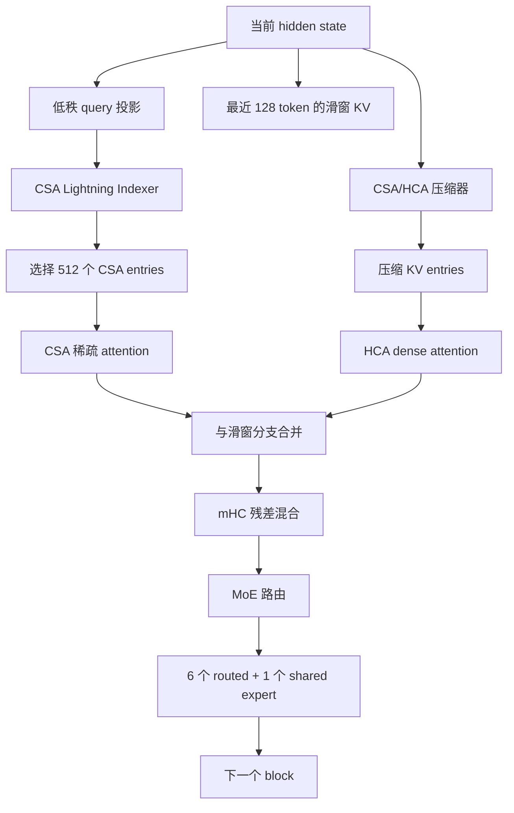

> 资料说明：本文依据 DeepSeek-AI 的技术报告《DeepSeek-V4: Towards Highly Efficient Million-Token Context Intelligence》（arXiv:2606.19348，2026-04-26）整理。报告确认了 `DeepSeek-V4-Flash`，没有确认名为“V4.1”的公开版本；因此文中把“DSK v4.1 Flash”按 V4-Flash 解读，版本号仍以官方后续发布为准。

## 先说结论

DeepSeek-V4-Flash 的目标是让一百万 token 的上下文可以用于实际服务。它从几个方向压低成本：

- 43 层 Transformer，隐藏维度 4096；总参数约 284B，每个 token 激活约 13B。
- 注意力层交错使用 CSA 和 HCA。CSA 把历史压缩后再用 Lightning Indexer 选 top-k；HCA 压得更狠，但在压缩块上做 dense attention。
- 两种注意力都保留 128 token 的滑动窗口，补回压缩后容易丢失的局部细节。
- 每层有 1 个 shared expert 和 256 个 routed experts，每个 token 选 6 个 routed experts。
- 推理时同时管理压缩 KV、滑窗 KV 和尚未凑满压缩块的 state；共享前缀还可以落盘复用。

报告给出的估算是：在 1M 上下文、相同计算口径下，V4-Flash 单 token FLOPs 约为 DeepSeek-V3.2 的 10%，KV cache 约为 7%。这是论文报告值，实际服务还会受到 GPU、batch、kernel 和存储设备的影响。

## 1. Flash 的配置到底是什么

| 项目 | V4-Flash 配置 | 作用 |
| --- | ---: | --- |
| Transformer 层数 | 43 | 决定每个 token 要经过多少个 block |
| 隐藏维度 | 4096 | 残差流宽度 |
| Query heads | 64 | 生成 query 的头数 |
| Attention head dim | 512 | 每个 query head 的维度 |
| Query compression dim | 1024 | 低秩 query 的中间维度 |
| CSA 压缩比例 $m$ | 4 | 每 4 个 token 形成一个 CSA entry |
| HCA 压缩比例 $m'$ | 128 | 每 128 个 token 形成一个 HCA entry |
| CSA indexer top-k | 512 | 每个 query 进入主 attention 的压缩 entry 数 |
| Indexer heads / dim | 64 / 128 | Lightning Indexer 的轻量检索路径 |
| 滑动窗口 | 128 | 保留最近 token 的未压缩 KV |
| Routed experts | 256 | 稀疏 MoE 的专家池 |
| 每 token 激活 routed experts | 6 | 计算时实际执行的 routed experts 数 |
| Shared experts | 1 | 每个 token 都经过的共享专家 |
| 单专家中间维度 | 2048 | SwiGLU 专家内部宽度 |
| MTP 深度 | 1 | Multi-Token Prediction 的预测层数 |
| mHC expansion | 4 | 残差流扩展路数 |

`284B` 是所有专家参数加起来的总容量，`13B` 是一次 token 路由时实际参与计算的参数量。模型总容量很大，单 token 的计算量仍可以控制在较小范围内。

## 2. 一次 decode 经过哪些路径

把一个请求看成长度为 $T$ 的前缀加上正在生成的新 token。Flash 的一个 Transformer block 大致经过这条路径：



prefill 阶段会把输入前缀按块处理，同时生成压缩 entry 和滑窗状态。decode 阶段只新增一个 token：它要读取已经压缩的远程历史、最近 128 token 的局部 KV，并把新 token 写回对应的状态缓存。压缩块尚未凑满时，尾部 token 先保存在 state cache，等凑齐后再做压缩。

## 3. CSA：先压缩，再检索

### 3.1 压缩不是平均池化

CSA 对 hidden states $H$ 计算两路候选 KV：

$$
C^a = H W^a_{KV}, \qquad C^b = H W^b_{KV}
$$

同时计算两路权重 logits：

$$
Z^a = H W^a_Z, \qquad Z^b = H W^b_Z
$$

对于每个压缩块，模型在候选的 $2m$ 个位置上做带位置偏置的 softmax，再按权重求和。$m=4$ 时，一个 CSA entry 大致概括 4 个 token；实现中的重叠窗口会让相邻 entry 共享一部分候选，因此边界更平滑。

这不是“每四个 token 取平均”。权重由当前 hidden state 和训练参数决定，块内不同位置可以有不同贡献。

### 3.2 Lightning Indexer 负责找远处的块

如果每个 query 都对全部压缩 entry 做主 attention，长上下文仍然会产生很大的读取量。CSA 先用低成本的 indexer 计算相关性：

$$
I_{t,s} = \sum_h w^I_{t,h}\,\mathrm{ReLU}(q^I_{t,h}\cdot K^{I,Comp}_s)
$$

然后取分数最高的 512 个 entry：

$$
S_t = \mathrm{TopK}(I_{t,:}, 512)
$$

主 attention 只读取 $S_t$ 中的压缩 KV。要注意，indexer 仍要扫描候选 entry；top-k 节省的是主 attention 的大维度计算和不规则 KV 读取，并不是让所有工作都变成常数时间。

### 3.3 共享 KV 和分组输出投影

CSA 生成 64 个 query heads，但压缩后的 KV 作为共享的 key/value 使用，属于 MQA 形式。这样可以避免为每个 query head 保存一份 KV。

64 个 head 的输出不会直接一次性投影回 4096 维。实现把它们分成 8 组，每组先投影到 1024 维，再合并成最终 attention 输出。这个分组步骤减少了一个巨大矩阵乘法的形状压力。

## 4. HCA：用更粗的摘要覆盖超长距离

HCA 使用 $m'=128$，每 128 个 token 聚合成一个 entry。它不再做 CSA 那样的 top-k，而是在所有 HCA entries 上做 dense attention：

$$
C^{Comp}_i = \sum_{j=128i}^{128(i+1)-1} S_j \odot C_j
$$

HCA 的优点是 entry 数量非常少，远距离读取规律，kernel 更容易做高吞吐；代价是一个 entry 覆盖的文本更长，细节会被压进摘要。CSA 与 HCA 交错使用，实际上是在两种取舍之间分工：CSA 负责可检索的中距离信息，HCA 负责便宜的全局信息。

## 5. 128 token 滑窗为什么还要保留

压缩 attention 只看完整的历史压缩块。当前 token 所在的那个块还没完成压缩时，如果完全依赖压缩结果，模型看不到同一块里的细粒度信息；而语言模型通常很依赖最近几十个 token。

因此 CSA 和 HCA 都增加一条滑动窗口分支，保存最近 128 个 token 的未压缩 KV。主 attention 结果与窗口结果一起参与后续投影。论文还加入了几项细节来稳定这条路径：

1. Query 和压缩 KV 在 core attention 前做 RMSNorm。
2. 只在 RoPE 的最后 64 个维度上应用旋转位置编码，并对 attention 输出做相应的相对位置处理。
3. 为每个 head 加可学习的 attention sink logit，让某些 query 在需要时把总注意力权重压低。

这些设计说明“压缩比例”不是唯一参数。窗口大小、位置编码和归一化方式都会影响压缩后的信息能否被模型正确使用。

## 6. MoE：13B 激活量是怎样来的

Flash 的每层包含 256 个 routed experts 和 1 个 shared expert。每个 token 由 router 选择 6 个 routed experts，随后执行：

```text
Dispatch：把 token activation 发到目标专家所在的 GPU
Linear-1：专家的上投影和 gate 投影
Activation：SwiGLU
Linear-2：专家下投影
Combine：把结果发回原 token 所在的 GPU
```

DeepSeek-V4 的实现把这些步骤拆成多个 expert wave。当前 wave 在计算时，下一 wave 做 dispatch，上一 wave 做 combine，三者重叠进行。论文在 Flash 配置上给出的理论 speedup 最高约 1.92 倍；在实际推理 workload 上，报告的加速范围是 1.50 到 1.73 倍，RL rollout 等小 batch、低延迟场景最高约 1.96 倍。

这里的数字来自论文中的 kernel 对比，不能直接当成任意集群的端到端吞吐承诺。互联带宽、功耗上限和专家负载是否均衡，都会改变结果。

## 7. 异构 KV Cache：为什么一个分页池不够

普通 dense attention 的 KV cache 可以按“每层、每个 token 固定大小”分页。Flash 的 cache 有三种不同状态：

| 缓存部分 | 保存什么 | 生命周期 |
| --- | --- | --- |
| CSA/HCA classical KV | 压缩后的 entries；CSA 还要有 indexer KV | 压缩块完成后长期存在 |
| SWA KV | 最近 128 token 的未压缩 KV | 随窗口前进而淘汰 |
| State cache | SWA 状态和 CSA/HCA 尚未压缩的尾部 hidden states | 请求级、位置相关 |

论文的布局把前两类放在不同区域：每个请求先分配固定大小的 state cache；压缩 KV 则按块分配。一个 classical cache block 覆盖的原始 token 数取 $mathrm{lcm}(m,m')$ 的倍数，保证 $m=4$ 的 CSA 和 $m'=128$ 的 HCA 可以同时对齐。

这也是它和普通 PagedAttention 的分界线：不同层的 entry 大小不同，SWA 有自己的淘汰策略，压缩分支还有“尾部未完成”状态。缓存管理器必须知道每种状态的写入、命中和回收规则。

## 8. 磁盘 KV Cache：共享前缀怎么复用

长上下文 agent 请求经常共享同一份系统提示词、工具定义或文档前缀。V4 的推理框架允许把压缩 KV 写到磁盘，命中前缀时直接读取，跳过完整 prefill。

CSA/HCA 的规则相对直接：磁盘保存完整压缩块，命中后读到最后一个完整块；最后一个不完整块仍要重新计算，因为它的未压缩尾部没有保存。

SWA 的 KV 体积大约是压缩 KV 的 8 倍，论文给出三种策略：

| 策略 | 磁盘空间 | 命中后的重算 | 适合场景 |
| --- | --- | --- | --- |
| Full SWA caching | 最大 | 几乎没有 | 存储充足、极低 TTFT |
| Periodic checkpointing | 可调 | 从最近 checkpoint 重算尾部 | 在空间和算力间折中 |
| Zero SWA caching | 最小 | 需要重算最近窗口状态 | SSD 紧张、重算便宜 |

Zero SWA caching 并不意味着重新跑完整前缀。对一个 $L$ 层模型，利用已经命中的 CSA/HCA 压缩 KV，恢复最后 128 个 SWA KV 大约只需重算 $128L$ 个 token 对应的状态。实际收益取决于 SSD 读取带宽和 GPU 重算速度，不能只看“缓存命中率”一个指标。

## 9. 精度路径也参与了 cache 预算

V4 对 attention cache 使用混合存储：RoPE 相关维度保存 BF16，其余维度使用 FP8。这样比全部使用 BF16 的 KV 表示节省接近一半空间。Lightning Indexer 的 attention 计算使用 FP4；MoE expert 权重也采用 FP4 量化感知训练。

精度选择有两个边界：

- FP4 主要降低存储和乘法成本，是否带来实际峰值 FLOPs 优势取决于硬件是否有对应原生指令。
- RoPE 维度仍保存 BF16，说明压缩和低精度不能脱离位置编码的数值误差单独讨论。

所以部署时要同时记录 `dtype`、KV layout、kernel 版本和 GPU 架构。只把模型权重转换成 FP4，并不会自动得到论文中的 1M 上下文成本。

## 10. 如何测量一套 Flash 服务是否真的有效

建议至少分开记录四类指标：

1. **Prefill**：TTFT、每秒处理 token 数、磁盘前缀命中后的重算 token 数。
2. **Decode**：单请求 ITL、并发下的 tokens/s、每步读取的 CSA/HCA/SWA 字节数。
3. **MoE**：dispatch/combine 时间、expert wave 利用率、跨卡通信占比。
4. **资源**：GPU 显存、SSD 读写带宽、page fault 或 cache eviction 次数。

测试时固定上下文长度、命中前缀比例、并发数、输出长度和精度。否则“Flash 比基线快”可能只是 batch 或 prefix 命中率不同造成的。

## 11. 常见误区和适用场景

### 误区一：把 V4-Flash 写成 V4.1

目前公开论文确认的是 V4-Flash。没有官方版本页或变更记录前，不应把“V4.1”当作已发布版本，也不应为它补写不存在的参数。

### 误区二：把 CSA 的 top-k 当成全局 top-k attention

top-k 选择对象是压缩后的 KV entry，不是原始 token。$m=4$ 时，一个 entry 对应一个压缩块，不能把 512 解释为 512 个原始 token。

### 误区三：只实现压缩 attention，忽略 cache 管理

如果 kernel 只支持 CSA/HCA 的计算，却没有 state cache、窗口淘汰和尾块重算，长上下文 prefix reuse 仍然无法正确工作。

### 什么时候值得采用

V4-Flash 的设计更适合长文档问答、代码仓库分析、长时间 agent 轨迹和共享前缀很多的服务。短上下文、低并发场景下，复杂的压缩、稀疏 gather 和异构 cache 管理可能抵不过普通 FlashAttention 的简单路径。

## 12. 小结

V4-Flash 的“Flash”不是一个单独 kernel 的名字，而是一套模型和系统协同设计：CSA 用压缩加检索保留中距离细节，HCA 用更粗摘要覆盖远距离，128 token 滑窗照顾局部依赖；MoE 用 expert wave 把通信藏在计算后面；异构 KV cache 和磁盘存储则把这些结构变成可运行的服务。

部署时，模型配置、压缩比例、cache layout、kernel、GPU 互联和 SSD 策略需要一起验证。论文中的 1M 上下文和 7% KV cache 是有前提的工程结果，不能脱离实现单独搬到另一套系统上。

## 参考

- DeepSeek-AI，**DeepSeek-V4: Towards Highly Efficient Million-Token Context Intelligence**，arXiv: [2606.19348](https://arxiv.org/abs/2606.19348)
- DeepSeek-AI，论文 PDF：<https://arxiv.org/pdf/2606.19348>
- DeepSeek-V4 官方推理代码入口（论文脚注）：<https://huggingface.co/deepseek-ai/DeepSeek-V4-Pro/tree/main/inference>
- DeepSeek DeepGEMM MegaMoE 实现（论文脚注）：<https://github.com/deepseek-ai/DeepGEMM/pull/304>
- 本博客已有背景文章：[DeepSeek-V4 架构详解：CSA/HCA、mHC 与 1M 上下文推理](./deepseek-v4-architecture-deep-dive)
