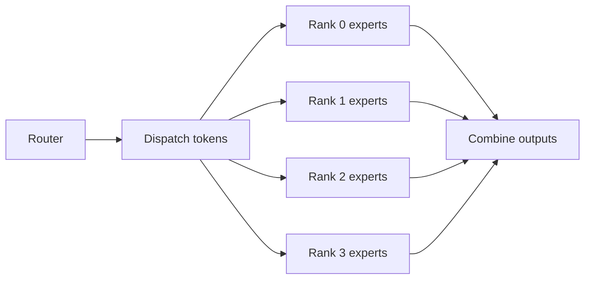
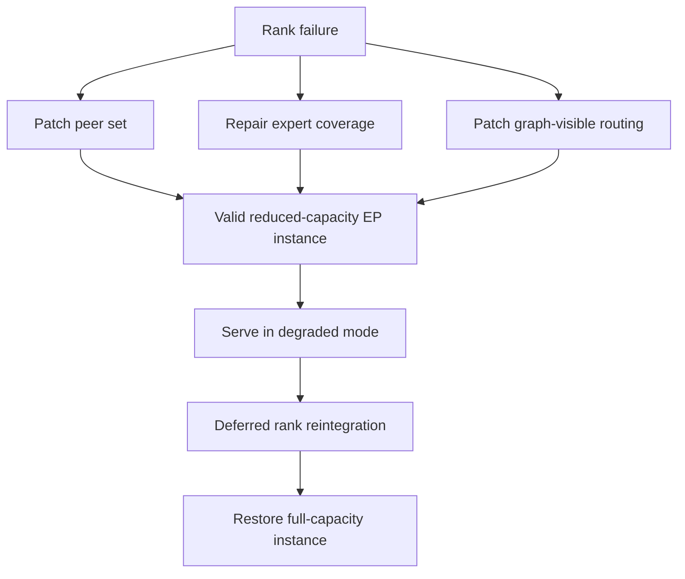
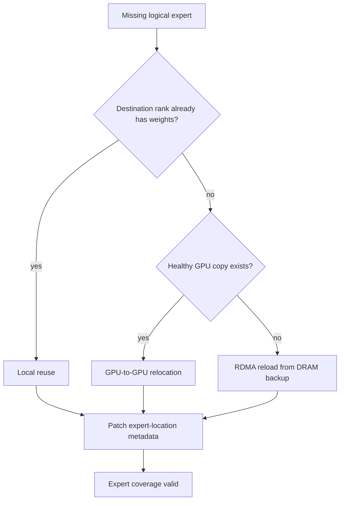
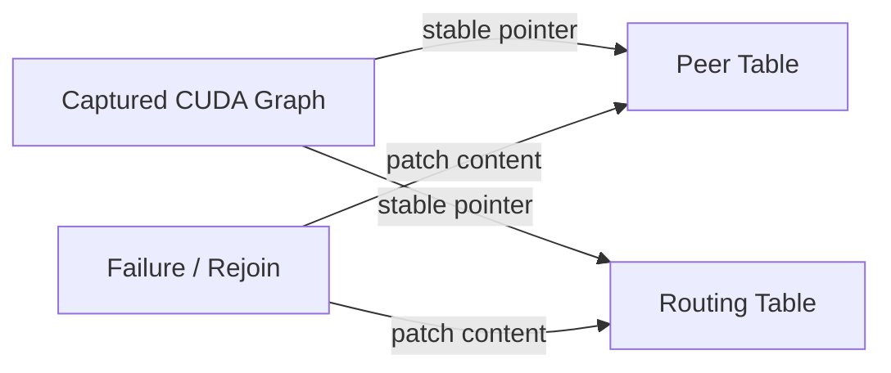
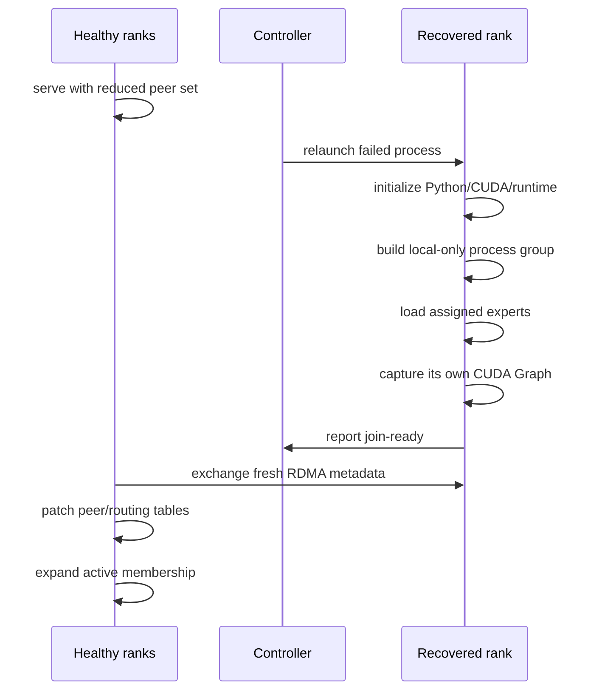

论文：Surviving Partial Rank Failures in Wide Expert-Parallel MoE Inference

作者：Xun Sun, Shaoyuan Chen, Pingchuan Ma, Yue Chen, Ziwei Yuan, Zhanhao Cao, Han Han, Shangming Cai, Teng Ma, Xuchun Shang, Xinpeng Zhao, Ke Yang, Junlin Wei, Lianzhi Lin, Yuji Liu, Feng Ren, Haoran Hu, Cheng Wan, Yingdi Shan, Yongwei Wu, Mingxing Zhang

版本说明：本文主要依据 arXiv:2605.10670v1，提交时间为 2026-05-11。论文源码显示系统实现集成在 Mooncake 和 SGLang 之上，评测使用 DeepSeek-V3 671B MoE 模型。

## 1. 先说结论

这篇论文讨论的问题很具体：

**一个大规模 MoE 推理实例用了几十张 GPU 做 Expert Parallel，如果其中一个 EP rank 挂了，服务能不能不整组重启，而是先缩容继续服务，等 rank 修好后再加回来？**

传统 EP 推理栈的问题是，rank 成员关系通常在初始化时就被固化了。它不仅影响通信 communicator，还影响专家权重放置、路由元数据、CUDA Graph 捕获时使用的指针和执行结构。于是单个 rank 故障会同时破坏三件事：

1. 通信还在尝试访问已经不可达的 peer。
2. 失败 rank 上的 logical expert 可能丢失，模型语义不完整。
3. CUDA Graph 里捕获的 dispatch/combine 路由状态和当前活跃 rank 集合不一致。

论文提出的 EEP 不是“让重启更快”，而是换了问题定义：

**部分 rank 故障容忍的核心，是让一个仍在运行的 EP instance 在 membership 变化后重新满足有效性条件。**

EEP 的做法是把 membership 从“初始化时固定的 communicator 结构”改成“运行时可修改的显式状态”。故障发生后，它只修补被故障破坏的状态：

1. 用 GPU-resident peer table 表示当前可达 peer，rank 失效时只清 active bit。
2. 用显式 expert-location metadata 和三层权重修复路径保证每个 logical expert 仍至少有一个活跃副本。
3. 让 CUDA Graph 持有稳定指针，指针指向的 peer/routing table 内容可原地更新。
4. rank 修复后，通过 deferred join 让它在旁路完成 Python、CUDA、通信端点、权重和 CUDA Graph 初始化，再短暂停顿加入活跃集合。

论文里的核心结果：

1. 静态 serving 下，EEP 相对固定 membership 的 DeepEP baseline，吞吐整体差距在 4.4% 以内；prefill-heavy workload 下约 1.4% 以内。
2. 同一 workload 下，固定 membership 的完整重启需要 348 秒。
3. 单 rank 故障时，EEP 恢复暂停约 11 秒，reintegrate 暂停约 8 秒，总离线窗口约 19 秒，并在 52 秒内恢复到故障前 95% 吞吐。
4. 1、2、4、8、16 个 rank 故障时，论文 CSV 数据里 recovery time 分别约为 10.546、10.920、9.348、5.783、6.540 秒，远低于 348 秒完整重启。

一句话概括：

**EEP 把 MoE EP 故障恢复从“重建整个分布式推理实例”改成“修复 live instance 的 peer set、expert coverage 和 graph-visible routing state”。**

## 2. 背景：为什么EP里的一个rank会拖垮整个实例

MoE 模型每个 token 通常只激活少量 expert。推理时流程大致是：

```text
token hidden states
  -> router 选择 top-k experts
  -> dispatch token 到 expert 所在 GPU
  -> expert FFN 计算
  -> combine 收回结果
  -> 继续后续 layer / decode step
```

当模型很大时，单张 GPU 放不下所有 expert，或者放得下但带宽不够，于是使用 Expert Parallelism：



这类 EP 通信在 decode critical path 上。每一层、每一个 decode step 都要完成 dispatch 和 combine。只要一个 rank 不可达，传统固定 communicator 设计就会遇到两类问题：

1. **progress 问题**：通信等待一个永远不回应的 rank，导致 kernel stall 或 collective error。
2. **correctness 问题**：即使跳过它，它上面的 expert 也消失了，模型不再是原来的 MoE。

所以不能简单说“少一张卡就少一点吞吐”。在 MoE EP 里，少一张卡可能意味着某些 logical expert 根本不可达。

## 3. 论文把问题定义成Live EP Validity

论文最重要的抽象是 live EP validity。一个正在运行的 EP instance 要继续服务，至少要满足三个条件：

1. **Peer-set validity**：通信目标只能是当前活跃且可达的 rank。
2. **Expert-coverage validity**：每个 logical expert 至少在一个活跃 rank 上可达。
3. **Graph-visible routing validity**：CUDA Graph 捕获到的 dispatch/combine 使用的 peer 和 routing 状态，必须匹配当前 membership 和 expert placement。

传统系统把这三类状态绑在一起：

```text
process group / communicator
  + expert placement
  + routing metadata
  + CUDA Graph captured pointers
  = 初始化时固定的一整套EP配置
```

rank 一挂，整套配置都失效。系统没有办法只替换其中某个局部状态，只能走全量重启：进程重新启动、模型重新加载、通信重新建连、JIT warmup、CUDA Graph recapture。

EEP 的思路是拆开这些状态：



这个定义很工程化：故障恢复不是“机器恢复了没有”，而是“当前活跃 rank 集合上的 EP instance 是否重新有效”。

## 4. EEP的第一层：GPU上的可变Peer Table

EEP 通信层的关键结构是 GPU-resident peer table。每个 rank 在 GPU memory 里维护一个按 rank index 排列的表，表项包含：

1. 这个 peer 是否 active。
2. intra-node NVLink/IPC 路径需要的地址。
3. inter-node RDMA 路径需要的 queue pair、work queue、completion queue、doorbell 等元数据。
4. 远端 buffer、memory key 等 transport metadata。

简化后可以理解成：

```text
peer_table[rank] = {
  active: 0 or 1,
  local_nvlink_reachable: true or false,
  ipc_buffer_pointer,
  rdma_qp_context,
  remote_buffer_descriptor
}
```

dispatch kernel 不再把 membership 写死在 communicator 里，而是在 GPU 上查表：

```text
for each token and destination rank:
  entry = peer_table[destination_rank]
  if entry.active == 0:
      skip
  else if entry uses NVLink:
      write through IPC path
  else:
      post RDMA work request from GPU
      ring NIC doorbell from GPU
```

这有两个意义。

第一，membership 变化变成改表：

```text
rank failed      -> peer_table[rank].active = 0
rank reintegrate -> refresh RDMA metadata, active = 1
```

第二，CUDA Graph 不需要重新捕获。Graph 捕获的是“kernel 读 peer_table 这个稳定指针”，不是某个固定 peer set。只要表的地址不变，表内容可以在 forward pass 之间被 patch。

## 5. 为什么必须放在GPU侧做

EP dispatch/combine 是细粒度、高频通信。每个 decode step、每个 MoE layer 都要执行。如果每次都让 CPU 查询 membership、准备通信、再通知 GPU，会把 host orchestration 放回 critical path。

论文基于 GPUDirect RDMA / IBGDA 这类能力：GPU kernel 可以直接访问映射到 GPU 地址空间的 NIC work queue 和 doorbell，从 GPU 侧发起 RDMA。这样 membership 判断、发送、信号更新、polling 都可以留在 GPU 侧。

故障检测也沿用通信进度机制：每轮通信后，rank 之间通过 GPU memory 里的 signal counter 或 RDMA atomic 更新进度；接收方在 kernel 内等待对应计数。如果超时，例如论文实现里当前是 1 秒，就把对应 peer 标成 inactive，并在 kernel 退出后把故障报告给 host。

这不是通用拜占庭容错，也不处理所有网络分区。论文明确假设 fail-stop 故障：进程、GPU、host 或 link 变得不可达；活着的 rank 仍健康，并且多数 rank 继续运行。

## 6. 第二层：修复Expert Coverage

只修 peer table 还不够。因为失败 rank 上可能有一部分 logical expert。继续服务前，必须保证每个 logical expert 至少有一个活跃位置。

EEP 在 SGLang 层维护显式 expert-location metadata：

```text
logical expert id
  -> one or more physical locations
  -> each physical location belongs to a rank / slot
```

故障后，系统重新计算 surviving ranks 上的 repaired placement，然后按三层路径补齐权重。

### 6.1 本地复用

如果目标 rank 本来就有这个 expert 的权重，只需要更新 placement metadata，必要时调整 GPU memory layout。这是最便宜的路径。

### 6.2 GPU到GPU搬运

如果目标 rank 没有该 expert，但另一个健康 rank 上仍有副本，就从健康 rank 直接 GPU-to-GPU relocation。论文强调这里按 batch transfer schedule 处理，因为一次故障通常会影响多个 expert，逐个搬会浪费带宽和调度开销。

### 6.3 从DRAM备份恢复

如果所有 GPU-resident 副本都随失败 rank 丢了，就不能再从 GPU 拷贝。直接从分布式文件系统读 checkpoint 又太慢。

EEP 因此加了一个 DRAM-backed expert backup service：每个节点有一个 backup manager，把负责的 expert 权重预加载到 pinned、RNIC-registered 的 CPU DRAM 里，并提供 expert id 到地址和大小的描述表。修复路径需要某个 expert 时，可以通过 RDMA 直接读到 GPU parameter tensor。

论文的 DeepSeek-V3 671B 设置里，4 个节点各自约保存 167.5GB 模型权重备份在 DRAM。这是很典型的系统取舍：用 CPU 内存换故障恢复时间。



## 7. 第三层：CUDA Graph稳定但内容可变

CUDA Graph 的收益来自把 launch sequence、kernel 参数结构、指针身份捕获下来，后续 replay 减少 CPU overhead。问题也在这里：如果 membership 或 routing 被编码进 graph 结构，rank 变化就要 recapture。

EEP 的原则是：

```text
graph structure: stable
pointer identity: stable
table content: mutable
```

也就是 CUDA Graph 里只保留指向 peer table 和 routing table 的稳定指针。rank 故障或加入时，不换指针，不换 kernel graph，只 patch table 内容。

可以把它理解成：



这就是为什么论文反复强调它不是 communicator shrink 的简单包装。NCCL communicator shrink 能改变通信层成员，但应用层还要处理 expert placement、routing metadata、CUDA Graph 捕获状态。EEP 的目标是把这些状态都设计成可被 live patch 的 runtime state。

## 8. Rank Reintegration：恢复rank在旁边热身，健康rank继续服务

只支持缩容是不完整的。生产服务里，失败 rank 可能被进程管理器重启，或者机器恢复。系统希望它重新加入，让吞吐恢复。

传统分布式初始化会要求所有 rank 一起参与 process group setup、metadata exchange、barrier、模型加载、CUDA Graph capture。这样修复 rank 回来时，健康 rank 也要停下来陪它重新初始化，等于第二次长暂停。

EEP 的 deferred join 做法是：



关键点是：恢复 rank 的重初始化成本没有消失，而是从健康 rank 的 serving critical path 上移开了。健康 rank 只在最终加入时付一个较短的 patch 和 membership 扩展窗口。

## 9. 实验环境和工作负载

论文实验环境：

1. 6 个 compute nodes。
2. 每节点 8 张 NVIDIA GPU，节点内 NVLink。
3. 每节点 8 条 400Gbps Mellanox RoCE 跨节点链路。
4. Ubuntu 24.04.2 LTS，CUDA 12.9，NVIDIA driver 535.161.08，Mellanox OFED 23.10。
5. PyTorch 2.8.0，Python 3.12。
6. 模型：DeepSeek-V3，671B parameters，256 experts。
7. 实现规模：约 10K 行，其中通信、修复、reintegration 控制路径约 7.6K 行，SGLang 集成约 2.3K 行。

静态性能实验有两类 workload：

1. decode-heavy：1024 input / 1024 output，并发 32 到 256。
2. prefill-heavy：4096 input / 256 output，并发 32 到 256。

故障恢复和 reintegration 实验使用：

1. 256 input / 4096 output。
2. closed-loop，最大并发 512。
3. rank failure 通过 `SIGKILL` GPU process 注入。
4. baseline 是同硬件上的固定 membership 完整重启，因为固定 EP backend 不支持部分故障恢复。

## 10. 静态Serving开销：额外查表基本不是瓶颈

论文关注的第一个问题是：把 membership 做成可变表，会不会让正常 serving 变慢？

从论文 CSV 数据看，decode-heavy 输出吞吐如下：

| 并发 | EEP output tok/s | DeepEP output tok/s | EEP相对DeepEP |
|---:|---:|---:|---:|
| 32 | 469.93 | 450.30 | +4.36% |
| 64 | 869.43 | 868.73 | +0.08% |
| 128 | 1450.71 | 1470.92 | -1.37% |
| 256 | 2488.94 | 2567.32 | -3.05% |

prefill-heavy 输出吞吐如下：

| 并发 | EEP output tok/s | DeepEP output tok/s | EEP相对DeepEP |
|---:|---:|---:|---:|
| 32 | 345.84 | 341.22 | +1.35% |
| 64 | 387.16 | 386.93 | +0.06% |
| 128 | 435.18 | 435.02 | +0.04% |
| 256 | 469.71 | 466.39 | +0.71% |

结论很直观：EP serving 的主要成本在跨 GPU dispatch/combine、expert compute、batching 和 memory movement。多一次 GPU 侧表项读取，相对这些成本很小。只要这个表不把 CPU 放回关键路径，稳态开销就能压住。

## 11. 故障恢复：从348秒重启变成秒级修复

论文的 full restart baseline 是 348 秒。EEP 的 recovery 数据如下：

| 失败rank数 | recovery总时间(s) | metadata(s) | GPU P2P(s) | weight load(s) | 恢复后吞吐(tok/s) |
|---:|---:|---:|---:|---:|---:|
| 1 | 10.546 | 0.203 | 6.973 | 2.002 | 6499.72 |
| 2 | 10.920 | 1.041 | 6.344 | 2.198 | 6130.60 |
| 4 | 9.348 | 0.039 | 6.007 | 2.114 | 5963.46 |
| 8 | 5.783 | 0.051 | 2.906 | 1.846 | 5876.45 |
| 16 | 6.540 | 2.121 | 1.849 | 2.155 | 3997.64 |

健康基线吞吐约 7182.67 output tok/s。恢复后吞吐占比约为：

| 失败rank数 | 恢复后吞吐占健康基线 |
|---:|---:|
| 1 | 90.49% |
| 2 | 85.35% |
| 4 | 83.03% |
| 8 | 81.82% |
| 16 | 55.66% |

这里需要注意两个点。

第一，recovery 总时间并不随失败 rank 数单调增加。原因是不同 failure scale 下 repaired placement、GPU relocation、DRAM reload 的比例不同，系统瓶颈会变。

第二，论文说“恢复后仍 productive”，不是说吞吐完全不降。16 个 rank 故障时吞吐约剩 55.66%，这已经是明显降级。但它仍比 348 秒完全不可用更符合服务可用性目标。

## 12. Expert修复来源的变化

论文 CSV 还给了 expert repair source mix：

| 失败rank数 | 本地复用 | GPU relocation | DRAM reload |
|---:|---:|---:|---:|
| 1 | 9.81% | 88.79% | 1.39% |
| 2 | 9.96% | 87.11% | 2.92% |
| 4 | 9.83% | 83.74% | 6.42% |
| 8 | 7.84% | 78.94% | 13.23% |
| 16 | 5.85% | 53.61% | 40.53% |

这组数据验证了设计直觉：

1. 小规模故障时，大部分 expert 仍能从健康 GPU 副本搬过来。
2. 故障规模越大，所有 GPU 副本一起丢失的概率越高，DRAM reload 比例上升。
3. DRAM backup 不是稳态数据路径，而是极端情况下避免从文件系统恢复的兜底路径。

从工程角度看，这个结果也提醒：如果生产环境不愿为每个节点预留大量 pinned CPU DRAM，EEP 的恢复时间会发生变化。论文里的秒级恢复依赖这个备份服务。

## 13. Reintegration结果：两段短暂停顿，而不是一段长宕机

单 rank 故障时，论文展示的端到端曲线是：

```text
正常服务
  -> rank failure
  -> recovery pause 约 11s
  -> reduced-capacity serving plateau
  -> reintegration pause 约 8s
  -> 恢复接近故障前吞吐
```

固定 membership baseline 是一段 348 秒完整不可用窗口。

更大故障规模下，论文图注给出的第二段 reintegration zero-throughput window 为：

| 失败rank数 | reintegration窗口 |
|---:|---:|
| 1 | 4s |
| 2 | 6s |
| 4 | 9s |
| 8 | 15s |
| 16 | 15s |

这个实验验证的是 Tension 3：修复 rank 加回来的时候，健康 rank 没有被迫重新走完整初始化，也没有重新 capture CUDA Graph。它们只需要在 forward pass 边界 patch peer/routing table，并扩展 active membership。

## 14. 和NCCL Shrink、DeepEP、普通弹性扩缩容的区别

这篇论文容易被误读成“做了一个 elastic communicator”。但它真正强调的是 end-to-end EP validity。

### 14.1 NCCL Shrink还不够

NCCL 近年确实有 RAS、communicator shrink、communicator replacement 等能力。这些能力能帮助通信层从失败 communicator 中恢复，但 MoE EP 推理还有上层状态：

1. 失败 rank 上的 expert 怎么补齐？
2. router 和 dispatcher 的 expert-location metadata 怎么更新？
3. CUDA Graph 里捕获的路由和指针怎么保持有效？
4. rank 回来时，健康 rank 是否要参与重新初始化？

EEP 的贡献在于把这些一起纳入故障恢复合同。

### 14.2 DeepEP关注高效dispatch/combine，不负责live repair

DeepEP 这类 EP backend 优化的是静态 EP group 上的 token dispatch/combine。它可以非常快，但并不天然解决 membership 变化后的 expert coverage 和 graph-visible state 修复。

EEP 在稳态性能上接近 DeepEP，说明它试图保留 EP fast path，同时加入 membership elasticity。

### 14.3 普通弹性扩缩容不是同一个问题

planned scaling 可以允许较重的控制面操作，比如 drain、reload、rebalance、barrier。故障恢复不一样：rank 是突然消失的，正在处理的请求会失败，服务需要尽快在剩余 rank 上恢复一个语义完整的实例。

所以 EEP 不是泛泛的 autoscaling，而是面向 fail-stop partial rank failure 的在线修复。

## 15. 局限和工程取舍

这篇论文的系统价值很明显，但也有一些边界条件。

### 15.1 故障模型较克制

EEP 处理 fail-stop，不处理 Byzantine failure、silent data corruption，也不解决复杂网络分区。超时被当作失败，瞬时慢节点如果超过阈值也可能触发收缩。

这在推理服务里是合理取舍：先让系统对明确不可达的 rank 有快速恢复路径，而不是把所有分布式系统故障一次性解决。

### 15.2 in-flight请求直接失败

论文说明故障时正在执行的请求会被报告失败，需要客户端重试。EEP 不在内部 buffer 或 replay 这些请求。

这简化了恢复路径，但也意味着上层必须有明确的 request retry / idempotency 策略。对流式输出接口来说，用户体验还需要 API 层处理。

### 15.3 DRAM backup吃内存

DeepSeek-V3 671B 下，每个节点约 167.5GB DRAM 备份。这个成本不小，尤其是服务集群还要跑 tokenizer、调度、cache metadata、监控等进程。

是否值得，要看业务对 availability 和 recovery time 的要求。如果可以接受分钟级重启，DRAM backup 可能太贵；如果大 MoE 服务必须保持高可用，这个成本就更合理。

### 15.4 Placement修复后可能有负载不均

故障后系统追求的是“快速恢复有效实例”，不是立刻找到最优负载均衡状态。reduced-capacity plateau 的吞吐下降来自 rank 减少，也可能来自 expert placement 的局部不均衡。

论文的 reintegration 也没有把 load-driven rebalance 放在 join 关键路径上。这是对的：故障恢复路径应该优先短、确定、可验证，复杂 rebalance 可以后置。

### 15.5 依赖较强的通信和硬件能力

EEP 的设计假设有 GPU-initiated RDMA、RNIC 注册内存、NVLink、RoCE 等能力。它适合大规模、高速网络、MoE serving 集群。对单机、小模型、慢网络或没有 GPUDirect RDMA 的环境，这套设计未必能完整落地。

## 16. 我认为最值得借鉴的设计点

这篇论文真正有启发的是三层状态拆分：

```text
故障恢复不要问：
  怎么把整个系统重启得更快？

而要问：
  当前 live instance 失效的是哪几类状态？
  能不能只修这些状态？
  修完后如何判定 instance 再次有效？
```

对很多推理系统问题，这个思路都适用。例如：

1. KV cache worker 故障时，哪些 prefix / block 仍有效，哪些需要重算？
2. PD 分离里 decode worker 故障时，P/D routing 和 KV ownership 如何修复？
3. 多副本 serving 里某个 replica lagging 时，membership 和 routing metadata 是否能原地调整？
4. CUDA Graph 或编译缓存相关系统里，哪些内容必须稳定，哪些内容可以通过间接表可变？

EEP 给出的答案是：把经常变化的东西从固定结构里拿出来，用显式 runtime state 表示；让 fast path 读这个 state，但不要让变化迫使 fast path 重新构建。

## 17. 总结

EEP 解决的是大 MoE 推理服务里的一个现实问题：wide Expert Parallel 越大，单个 rank 故障越常见，而传统固定 membership 设计会把局部故障放大成整个推理实例宕机。

它的核心机制可以压缩成三句话：

1. **通信层**：用 GPU-resident peer table 表示 membership，rank 故障和恢复都变成原地改表。
2. **模型层**：用 expert-location metadata 和 local / GPU / DRAM 三层修复路径保证 logical expert 覆盖完整。
3. **运行时层**：用稳定指针 + 可变表内容保持 CUDA Graph 有效，并用 deferred join 把恢复 rank 的初始化移出健康 rank critical path。

从结果看，它把同一 workload 下 348 秒完整重启，变成秒级 recovery 和短 reintegration 窗口；稳态吞吐相对 DeepEP 也基本持平。

这篇论文的价值不只是 MoE fault tolerance。它展示了一种很实用的系统设计方法：**把“固定初始化配置”改造成“可验证、可修复、可热更新的运行时状态”，从而让大规模推理服务在局部故障下继续保持有效。**

## 参考

1. arXiv:2605.10670 - Surviving Partial Rank Failures in Wide Expert-Parallel MoE Inference: https://arxiv.org/abs/2605.10670
2. 论文 PDF: https://arxiv.org/pdf/2605.10670
3. Mooncake GitHub: https://github.com/kvcache-ai/Mooncake
4. SGLang GitHub: https://github.com/sgl-project/sglang
5. DeepEP GitHub: https://github.com/deepseek-ai/DeepEP
