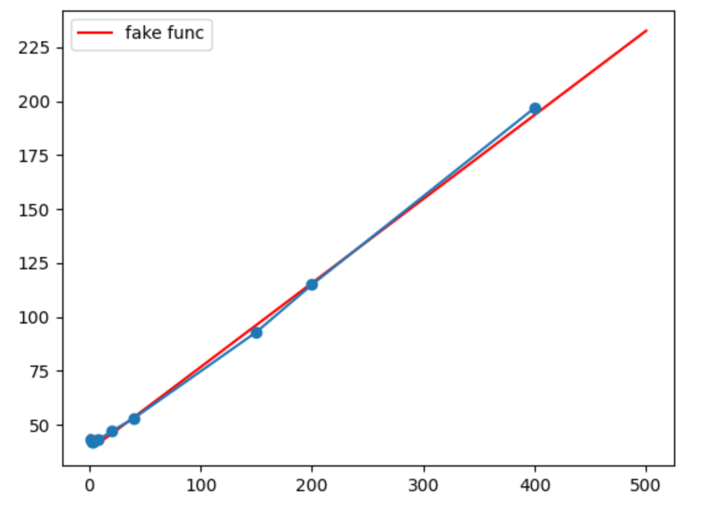

文本块长度：L1

Basic prompt长度：L2

一条Prompt包含的文本块数量：x

总的文本块数量：n

那么一共有$n/x$条prompt

对于一条prompt的推理，比较严谨的一种时间复杂度为(N为prompt长度，d为特征维度，$\alpha$、$\beta$为常量系数，$bias$为潜在的可能和x有关的时间开销)：

$\alpha N^2d(点积计算)+\beta Nd^2（线性层变换）+ bias$

总共的时间复杂度：

$$
L1\approx 300 \\
L2\approx 20 \\
n=400\\
$$

$$
(\alpha d(xL1 + L2)^2  + \beta d^2( xL1+L2 ) +bias)\cdot n / x \\
= n( ( \alpha d L1^2)x + ( \alpha d L2^2 + \beta d^2 L2)/x + 2\alpha d L1L2 + \beta d^2L1 + bias/x )\\
\approx 400( 90000\alpha dx + ( 400\alpha d +20\beta d^2 +bias)/x + 12000\alpha d + 300\beta d^2)
$$

只需考虑变量x，本质是一种形如$y=ax+b/x+c$的函数

根据前面测试的样本拟合得到的函数：

$$
y = 0.39x + 5.72/x + 37.72
$$

红色线条为拟合函数，蓝色线条为测得的样本，横坐标为x（一个prompt所包含的文本块数量），纵坐标为时间（秒）

    

为使拟合成立，需要满足以下条件：

令$a=160000\alpha d, b=8000\beta d^2, c=400bias$

$$
225a=0.39 \\
a + b + c=5.72\\
30a +15b=37.72 \\
$$

解得

$$
a\approx 0.00173\\
b\approx 2.518 \\
c\approx 3.2 \\
$$

说明是存在一种可行解的，即结果上存在x=1和x=4两者吞吐差不多的可能，并且在x增大时所呈现的趋势也符合分析得到的函数，而之前分析得到的3.6倍差距并没有考虑到实际的常量系数关系
