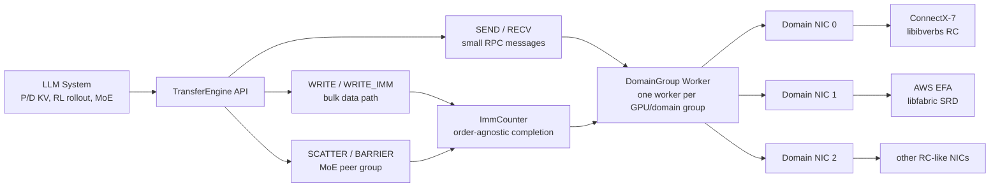
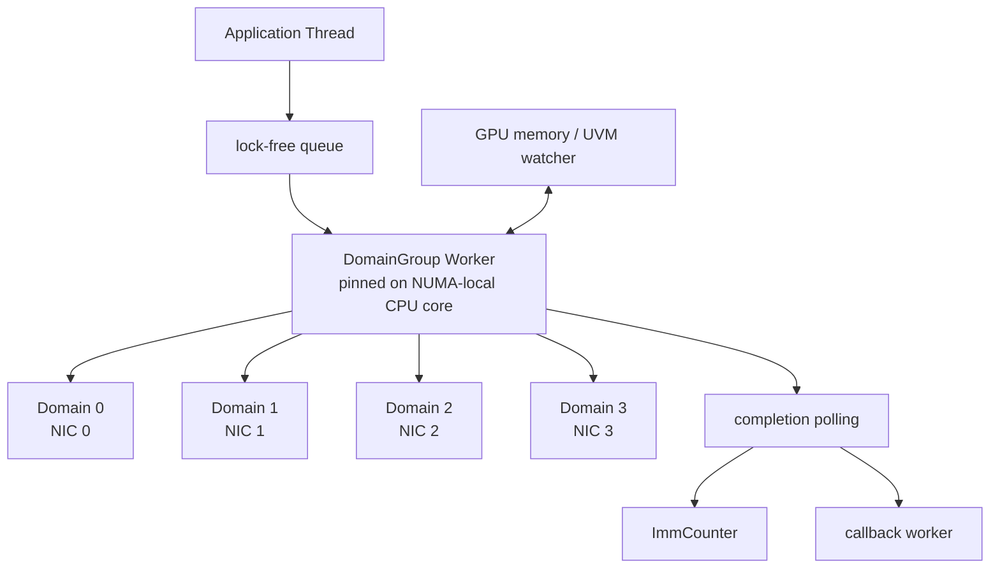
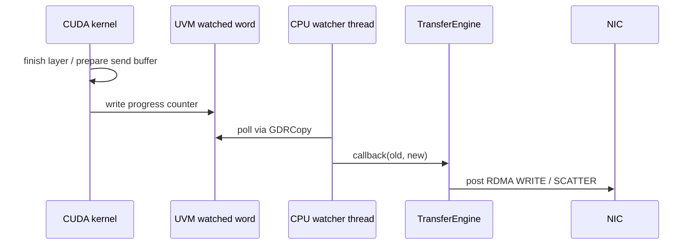
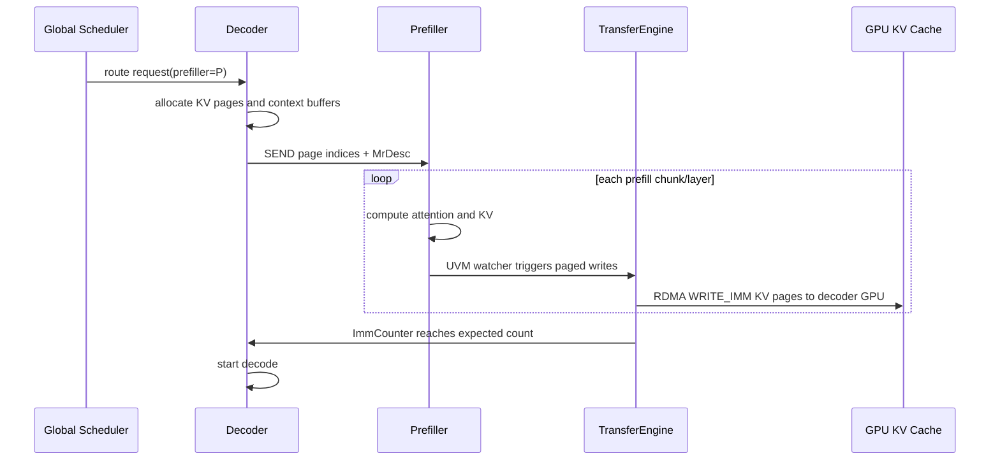
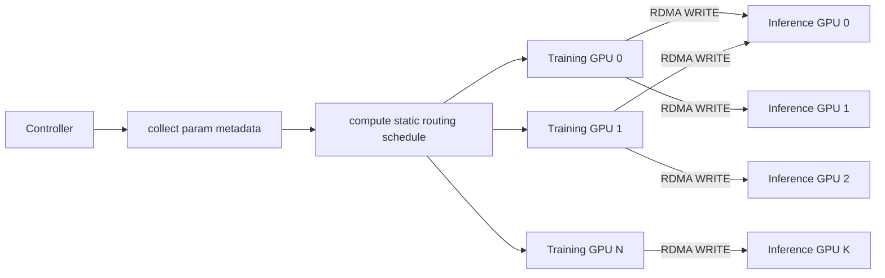
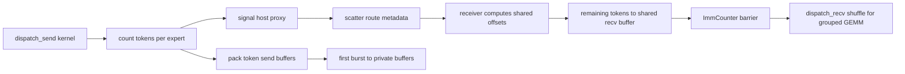

## 1. 先说结论

版本说明：本文写于 2026-06-12，主要参考 arXiv 上的 `fabric-lib: RDMA Point-to-Point Communication for LLM Systems` v2，论文标注日期为 2026-04-13，并结合 Perplexity AI 开源仓库 `perplexityai/pplx-garden` 的 fabric-lib 文档整理。fabric-lib 是一个还在快速演进的系统，尤其是 EFA、NIXL、DeepEP、云厂商 RDMA NIC 支持都变化很快，生产使用要以实际 commit、驱动、libfabric/libibverbs 版本和实例拓扑为准。

一句话概括：

**fabric-lib 不是又一个 NCCL 替代品，而是 Perplexity 为新一代 LLM 系统补的一层“可靠但不要求有序”的 RDMA 点对点通信抽象。它把 NVIDIA ConnectX-7 和 AWS EFA 这两类语义很不一样的网卡统一到同一套 TransferEngine API 下面，用 WRITE_IMM + ImmCounter 作为跨硬件的完成通知机制，再在上面实现 P/D 分离 KV 传输、RL 权重同步、MoE dispatch/combine。**

这篇论文的核心价值有三点：

1. 它把 LLM serving 里越来越重要的 **非 collective 通信** 单独拎了出来。P/D 分离、MoE expert routing、异步 RL rollout 权重更新，都不是传统 all-reduce/all-gather/broadcast 能舒服表达的模式。
2. 它没有选择只服务 ConnectX + IBGDA 的最强路径，而是选择了更“云原生”的抽象边界：**可靠即可，不假设网络传输有序**。这让 AWS EFA 的 SRD 协议也能进入同一套上层系统。
3. 它用三个真实生产场景证明这层抽象不是玩具：400 Gbps 级别带宽、1T 参数模型约 1.3 秒权重更新、ConnectX-7 上超过 DeepEP decode latency、EFA 上第一次给出可用的 MoE 低延迟实现。

如果只记一个心智模型，可以这样理解：

```text
NCCL / torch.distributed:
    适合固定成员、固定模式、强同步的 collective。

fabric-lib TransferEngine:
    适合动态 peer、稀疏目标、变长数据、one-sided 写入、无需全局 world 的 P2P 通信。

DeepEP:
    针对 MoE all-to-all 极致优化，但强绑定 ConnectX / IBGDA / mlx5。

fabric-lib:
    牺牲一部分“只为单一硬件榨干最后几微秒”的自由，换取 ConnectX 与 EFA 之间的可移植生产路径。
```

先放一张总图：



## 2. 为什么 collective 不够用了

传统大模型训练和推理长期依赖 collective 通信：

1. tensor parallel 需要 all-reduce / reduce-scatter。
2. data parallel 需要 all-reduce 梯度或参数同步。
3. pipeline parallel 需要相邻 stage 之间的 send/recv，但成员关系和顺序通常比较固定。
4. serving 框架可以把同构 worker 放进同一个 process group，用 NCCL 或 torch.distributed 管起来。

这些模式的共同点是：**参与者相对固定，操作顺序相对固定，buffer shape 相对固定**。

LLM serving 的新模式正在打破这些前提。

P/D 分离里，请求先由 prefiller 处理长 prompt，再把 KV cache 交给 decoder 持续 decode。prefiller 和 decoder 的匹配可能由全局调度器动态决定，不一定属于同一个固定通信 world。每个请求的 prompt 长度不同，KV 页数量也不同。

MoE 推理里，每个 token 只路由到少数 expert。每一轮 dispatch/combine 的目标 rank 和数据量取决于路由结果，是稀疏、动态、变长的。强行用 dense collective 表达，会多传大量空数据。

异步 RL fine-tuning 里，训练集群和推理 rollout 集群分离。每个训练 step 后要把新权重推给推理 GPU。如果按 Rank0 聚合再广播，很容易被少数 NIC 限速；如果做全局通信组，又会把训练和推理的生命周期绑得太死。

所以论文真正的问题不是“RDMA 比 TCP 快”这种常识，而是：

**能不能给 LLM 系统提供一套足够低延迟、足够高带宽、支持 GPU memory、支持动态 peer、还能跨 ConnectX 和 EFA 的 P2P 数据面？**

fabric-lib 的答案是：只抽象两类各家 RDMA NIC 都能较好支持的能力。

1. 两边参与的 `SEND/RECV`：用于小消息、控制消息、RPC 风格交互。
2. 单边 `WRITE_IMM`：发送方直接把数据写到接收方注册内存，同时带一个 32-bit immediate 值作为完成通知。

它刻意不把 `READ`、atomic、全局有序性放进核心依赖里。因为这些能力不是所有硬件都高效，也不是 EFA/ConnectX 之间最稳的公共交集。

## 3. fabric-lib 的抽象边界：可靠，但不要求有序

论文把 RDMA transport 做了一个很关键的重新取舍。

ConnectX 常用 RC，也就是 Reliable Connection。它提供可靠传输、连接语义和有序交付。很多高性能库会直接依赖这些强语义，把软件协议做得很薄。

EFA 的 SRD 则更像云环境里的另一条路线：可靠、connectionless，但不保证有序。它可以靠多路径和云网络特性做扩展，但如果上层系统假设消息按发送顺序抵达，就会出现语义不匹配。

fabric-lib 的选择是：

```text
不要依赖 ConnectX RC 的有序性；
把 ConnectX 也降到“可靠但无序”的抽象来用；
这样 EFA SRD 与 ConnectX RC 才能共享同一套上层协议。
```

这个选择很重要。它把问题从“如何封装所有 RDMA 功能”变成“LLM P2P 系统真正需要哪些最小语义”。

论文中的 transport 能力可以压缩成下面这张表：

| 能力 | ConnectX RC | EFA SRD | fabric-lib 核心抽象 |
| --- | --- | --- | --- |
| 可靠传输 | 支持 | 支持 | 依赖 |
| 有序交付 | 支持 | 不支持 | 不依赖 |
| connection 语义 | 支持 | 不支持 | 不暴露给上层 |
| SEND/RECV | 支持 | 支持 | 暴露 |
| WRITE_IMM | 支持 | 支持 | 暴露 |
| READ / Atomic | 支持 | 支持或部分支持 | 不作为关键路径 |

这就是论文标题里 “point-to-point communication” 的实际含义：不是把 collective 做快，而是给动态、稀疏、跨节点、跨硬件的 peer-to-peer 数据流一个可移植的最小语义层。

## 4. TransferEngine 架构

fabric-lib 的核心组件叫 TransferEngine。论文里的 API 是伪代码，但已经能看出它的边界：

```rust
trait TransferEngine {
  fn main_address() -> NetAddr;

  fn reg_mr(ptr, len, device) -> (MrHandle, MrDesc);

  fn submit_send(addr: NetAddr, msg: &[u8], cb: fn () -> ());
  fn submit_recvs(len: u64, cnt: u64, cb: fn (&[u8]) -> ());

  fn expect_imm_count(imm: u32, count: u32, cb: fn () -> ());

  fn submit_single_write(len: u64, imm: Option<u32>,
      src: (MrHandle, Offset), dst: (MrDesc, Offset), done: OnDone);

  fn submit_paged_writes(page_len: u64, imm: Option<u32>,
      src: (MrHandle, Pages), dst: (MrDesc, Pages), done: OnDone);

  fn add_peer_group(addrs: Vec<NetAddr>) -> PeerGroupHandle;
  fn submit_scatter(...);
  fn submit_barrier(...);

  fn alloc_uvm_watcher(cb: fn(u64, u64) -> ()) -> NonNull<u64>;
}
```

这套接口里有几个设计点值得单独拆开。

### 4.1 Memory Region：注册内存是所有 zero-copy 的起点

RDMA 不能随便访问任意虚拟地址。发送方和接收方都需要先把 host buffer 或 GPU buffer 注册成 memory region。注册后本地拿到 `MrHandle`，远端可以拿到可序列化的 `MrDesc`，里面包含远端地址、rkey 和每个 NIC 对应的访问描述。

这一步让上层可以做两件事：

1. 把 `MrDesc` 通过普通控制消息发给 peer。
2. 后续数据面直接走 one-sided WRITE，不再让接收方参与每次数据搬运。

在 P/D KV 传输里，decoder 先分配好目标 KV pages，把目标描述符和 page index 发给 prefiller。prefiller 计算完每层 KV 后，直接把对应页写进 decoder GPU memory。

### 4.2 DomainGroup：一个 GPU 对多个 NIC

TransferEngine 的线程模型围绕 `DomainGroup` 展开。一个 worker 负责一个 GPU 相关的 domain group，内部可以管理 1 到 4 个 NIC。

这个设计是为了兼容不同硬件拓扑：

1. ConnectX-7 场景里，一个 400 Gbps NIC 就可能给一个 GPU 提供足够带宽。
2. AWS p5 场景里，常见拓扑是每个 GPU 聚合多个 100 Gbps EFA。
3. p5en 这类实例可以是每 GPU 两个 200 Gbps EFA。

如果 API 只暴露“一个 GPU 对一个 NIC”，EFA 上就很难打满 400 Gbps。fabric-lib 把 NIC 聚合和分片留在 TransferEngine 内部，上层只提交一次 paged write 或 scatter。



worker 被 pin 到设备所在 NUMA node 的 CPU core 上，domain 相关数据也在 pin 之后分配，减少跨 NUMA 内存访问。跨线程通信走 lock-free queue。这个工程细节决定了它不是一个简单的 RDMA wrapper，而是在按微秒级 tail latency 优化。

### 4.3 ImmCounter：无序传输下的完成通知

`WRITE_IMM` 会把 payload 写到远端 memory region，同时在接收端 completion queue 里产生一个 immediate value。fabric-lib 在接收端维护 `ImmCounter`：每收到一个 immediate，就给对应 key 的计数器加一。

上层可以这样表达同步：

```text
decoder 知道一个请求会收到 N 个 KV page writes；
prefiller 每个 WRITE_IMM 都带同一个 imm；
decoder 调用 expect_imm_count(imm, N, callback)；
当 ImmCounter 累积到 N，decoder 再开始 decode。
```

这个机制不要求消息顺序。只要最终收到 N 个完成事件，就能推进状态机。对 EFA SRD 这种 unordered transport 来说，这比“等待第 i 个包之后再等第 i+1 个包”稳得多。

这里有一个容易忽略的正确性问题：payload 写的是 GPU memory，immediate completion 由 CPU 侧观察。如果 CPU 先看到 completion，GPU 是否一定能看到数据？

论文的解释依赖两个事实：

1. RDMA 规范要求 `WRITE_IMM` 的数据 payload 先于 immediate 发出。
2. host-proxy 架构中，CPU 在看到 ImmCounter 达标后，再通过 kernel launch 或 GDRCopy 更新 GPU 可见 flag；这些 CPU-to-GPU 事务会排在先前 NIC-to-GPU writes 之后。

也就是说，fabric-lib 不要求 GPU 自己直接 poll NIC completion，而是通过 CPU proxy 和 PCIe ordering 把完成事件转成 GPU 可见状态。

### 4.4 UVM Watcher：让 GPU 进度驱动网络传输

P/D KV 传输和 MoE kernel 都需要“GPU 算到某个点后，CPU 立刻提交 RDMA 操作”。CUDA Graph 场景里不能随便插 host callback。fabric-lib 用 `alloc_uvm_watcher` 分配一块 Unified Virtual Memory，GPU kernel 更新这个 word，CPU 线程用 GDRCopy 轮询它。

这有点像一个轻量的 GPU-to-CPU doorbell：



论文里 UVM watcher 在 CUDA Graph 下的 callback latency 很低：Rust callback p50 约 6.2 us，p99 约 12.6 us；Python callback p50 约 9.3 us，p99 约 20.4 us，但最大值会到毫秒级，说明 Python 适合控制面或低频路径，不适合极致 tail latency 的关键路径。

## 5. 硬件后端：EFA 和 ConnectX 的不同优化

fabric-lib 的上层抽象统一，但底层 backend 仍然是硬件特化的。

### 5.1 AWS EFA：libfabric + SRD，多 NIC 聚合

EFA 通过 libfabric 暴露 SRD。fabric-lib 为每个 NIC 建一个 domain，再把多个 domain 放进同一个 domain group。由于 EFA 的一些行为与标准 RDMA 细节不同，例如 zero-sized immediate write 仍需要有效 descriptor，fabric-lib 在所有传输上都强制使用有效描述符。

为了降低提交成本，EFA backend 会做 work request templating：把 libfabric descriptor 中不变的字段预先填好并保留，真正提交时只填变化部分。

EFA 的特点是可用、云上容易获得、支持多路径，但小消息和提交延迟会更吃亏。论文里 256 KiB single write 在 EFA 上只有 54 Gbps，而 ConnectX-7 是 116 Gbps；但 paged write 到 64 KiB 时，EFA 可以到 364 Gbps，接近 400 Gbps 级别。

### 5.2 ConnectX-7：libibverbs + RC，主动放弃有序依赖

ConnectX backend 走 libibverbs。每个 peer 会用 UD queue pair 做 RC handshake，然后建立两组 RC queue pair：

1. 一组用于 `SEND/RECV`。
2. 一组用于 `WRITE/WRITE_IMM`。

分开的原因是 receive completion 和 write immediate completion 都会消耗 work request，如果混在同一条有序队列里，上层高层语义会互相干扰。

ConnectX backend 还用了两个典型优化：

1. WR chaining：最多把 4 个 work request 通过 `next` 指针连起来，减少 doorbell 次数。
2. `IBV_ACCESS_RELAXED_ORDERING`：允许 NIC 和 GPU memory 之间的 PCIe transaction 更宽松地乱序，提高延迟表现。

从工程角度看，这套设计很务实：上层统一语义，底层并不假装硬件没有差异。真正的可移植性不是“同一份 backend 跑所有网卡”，而是“同一份应用协议跑在各自调优过的 backend 上”。

## 6. 场景一：P/D 分离中的 KV Cache 传输

P/D 分离的基本流程是：

1. 调度器为请求选择一个 prefiller 和一个 decoder。
2. 请求先发给 decoder。
3. decoder 预分配目标 KV pages 和额外上下文 buffer，例如 hidden states、logits。
4. decoder 用 `SEND` 把目标 `MrDesc`、page indices、请求元信息发给 prefiller。
5. prefiller 执行 chunked prefill，每层算完后通过 UVM watcher 触发 `submit_paged_writes`。
6. prefiller 把 KV pages 直接 RDMA WRITE 到 decoder GPU memory。
7. decoder 通过 `expect_imm_count` 等待所有层/页完成，然后开始 decode。



这里的关键不是“能传 KV”，而是这些生产细节：

1. **按层传输**：prefill 不必等所有层都算完才传，层级 pipeline 可以把网络传输隐藏在后续计算后面。
2. **支持 CUDA Graph**：UVM watcher 可以在 CUDA Graph 场景下工作，不破坏高性能推理路径。
3. **支持不同 KV layout**：MLA 可能复制 compressed KV；GQA 需要按 page offset 和 stride 选择 heads；KV layout 要尽量让连续 heads 对应连续内存，减少小 write。
4. **取消语义必须严谨**：decoder 取消请求后，prefiller 必须确认不再有 pending remote write，否则 decoder 复用 KV page 会被迟到的 RDMA write 污染。
5. **故障检测靠 heartbeat**：如果 prefiller 不响应，decoder timeout 后取消请求，因为后续 KV 已经不可能安全抵达。

评测里，Qwen3-235B、H200、TP4、每 GPU 2x200 Gbps EFA，P/D KV transfer 对 TTFT 的影响如下：

| Seqlen | 非分离 TTFT | 分离 TTFT | 每层 compute | 每层 transfer |
| --- | ---: | ---: | ---: | ---: |
| 4K | 214 ms | 260 ms | 2.267 ms | 0.661 ms |
| 8K | 433 ms | 501 ms | 4.578 ms | 0.952 ms |
| 16K | 929 ms | 1042 ms | 9.860 ms | 1.610 ms |
| 32K | 2179 ms | 2317 ms | 13.295 ms | 1.606 ms |
| 64K | 5681 ms | 5852 ms | 20.344 ms | 1.611 ms |
| 128K | 16735 ms | 17056 ms | 34.895 ms | 1.609 ms |

论文认为 TTFT slowdown 主要不是 KV transfer 本身，而是他们的 inference engine 为最后一个 input token 做了一次额外 decode pass。因为每层 transfer 大约 0.6 到 1.6 ms，而每层 compute 随序列长度增长到 35 ms，网络传输基本被计算隐藏了。

这对做 P/D 架构的人有一个直接启发：**KV 传输优化不只看总带宽，更要看能否按层、按 chunk 及时启动，让 transfer 落进 compute overlap 窗口。**

## 7. 场景二：RL rollout 的权重更新

异步 RL fine-tuning 的典型架构是训练 GPU 和推理 GPU 分离：

```text
training cluster:
    负责 PPO/GRPO/其他 RL 更新，产生新权重

inference rollout cluster:
    负责用当前策略生成样本

每隔一个或多个 training step:
    training 把新权重推给 inference
```

很多系统会走 Rank0 聚合再广播：

```text
training ranks -> training subgroup Rank0 -> inference subgroup Rank0 -> inference ranks
```

这个路径的问题是 Rank0 NIC 变成瓶颈，而且训练/推理两边要形成较重的 collective 通信关系。

fabric-lib 的 P2P 方案是：

1. controller 收集训练 GPU 和推理 GPU 的参数 metadata，包括 name、shape、dtype、DTensor sharding。
2. controller 计算静态 transfer schedule：哪个 training GPU 把哪个 parameter slice 发给哪个 inference GPU。
3. schedule 广播给 training workers。
4. 每个 training step 后，training GPU 直接 one-sided RDMA WRITE 到 inference GPU memory。
5. inference 节点不需要主动参与每个权重 shard 的接收逻辑。



论文评测的是 Kimi-K2-1T 量级：256 张训练 GPU 上的 BF16 权重，传到 128 张推理 GPU 的 FP8 权重布局。它把每个参数 tensor 的传输拆成四个 pipeline stage：

1. 如果 FSDP offload 到 CPU，先做 H2D memcpy。
2. 参数准备：`full_tensor()` 还原完整 tensor，做 projection fusion，必要时量化。
3. RDMA transfer：zero-copy WRITE 到远端推理 GPU memory。
4. GLOO barrier：在 mesh group 之间做全局同步。

单 rank 的 latency breakdown：

| 操作 | 时间 | 平均每次 | 次数 |
| --- | ---: | ---: | ---: |
| Total | 1233 ms | - | - |
| Memcpy H2D | 184 ms | 378 us | 487 |
| full_tensor() | 518 ms | 532 us | 974 |
| Fuse projections | 18 ms | 37 us | 487 |
| Quantize | 88 ms | 137 us | 647 |
| RDMA submit | 26 ms | 23 us | 1144 |
| Waiting for other ranks | 357 ms | - | - |
| Remaining | 42 ms | - | - |

这个表的重点是：**RDMA 数据传输不是主要瓶颈**。真正贵的是 FSDP unshard、rank 间等待和参数准备。RDMA transfer 大多被 pipeline overlap 掉，只剩约 42 ms 没有被隐藏。

这说明在 RL 权重更新里，优化方向不是单纯追求更快的单次 write latency，而是：

1. schedule 要让所有 NIC 都参与，不要 Rank0 限速。
2. 参数准备、H2D、量化、RDMA 要 pipeline。
3. 临时 GPU memory 要有 watermark，避免多个 `full_tensor()` 同时爆显存。
4. 静态 sharding metadata 很重要，能让每步更新少走控制面。

## 8. 场景三：MoE dispatch/combine

MoE all-to-all 是这篇论文里最有意思也最容易误读的部分。

DeepEP 的强项是基于 ConnectX、IBGDA 和 mlx5，把 GPU 发起 RDMA 做到极低延迟。fabric-lib 的 MoE kernel 走的是另一条路线：**GPU 准备数据，CPU host proxy 通过 GDRCopy 观察 GPU 进度，再提交 RDMA scatter/barrier**。

按直觉，host proxy 一定比 GPU-initiated RDMA 慢。但论文的实验显示，在跨节点 decode 场景里，bulk transfer、pipeline 和更少 per-token 网络操作可以抵消这部分 proxy overhead，ConnectX-7 上甚至超过 DeepEP。

### 8.1 Dispatch 的数据路径

dispatch 要把本 rank 的 tokens 按 expert routing 发给目标 ranks。fabric-lib 的做法分成两轮：

1. GPU kernel 先统计每个 expert 的 token count，并把 routing info 通过 UVM/GDRCopy 交给 host proxy。
2. host proxy 用 TransferEngine 先 scatter routing info，同时 GPU 把一小段 tokens 先写入每个 peer 的 private buffer。
3. 接收方拿到 routing info 后，就知道每个发送方应该写入 shared receive buffer 的哪个连续区间。
4. 剩余 tokens 再被 scatter 到 shared buffer。
5. RDMA 处理跨节点，NVLink 处理同节点 peer。
6. receiver kernel 等 ImmCounter 确认 RDMA 完成后，把 receive buffer 里的 tokens shuffle 成 grouped GEMM 需要的布局。



为什么要 private buffer？因为 routing info 很小但有延迟。如果完全等 routing info 到达后再传 token，首包延迟更高。先投机性地把少量 token 放入每个源私有 buffer，可以隐藏 route exchange 的延迟。论文的 ablation 显示 private buffer 太小会让 p50 decode latency 明显变差，尤其 EFA 因 route exchange 更慢，对 private token 数更敏感。

### 8.2 Combine 的数据路径

combine 反过来把 expert 输出按原 token 位置聚合回去。dispatch 阶段已经集中处理过 routing 信息，所以 combine 可以复用 offset 信息，直接做一次 scatter。

它的流程是：

1. grouped GEMM 或 shared expert 执行期间，host proxy 预先准备 combine scatter 命令。
2. GPU sender 把要返回的 token 打包到 send buffer。
3. 同节点走 NVLink，跨节点走 RDMA scatter。
4. receiver 等待所有 token 到达后，本地计算加权平均。

DeepEP 在 prefill combine 上有一个强优化：在发送节点做 sender-side partial sum，减少 RDMA bytes。但这会影响累加精度和确定性，因为不是全程固定顺序 fp32 accumulation。fabric-lib 更偏保守，代价是 prefill 场景下 combine latency 可能不如 DeepEP。

### 8.3 MoE 结果怎么看

端到端 DeepSeek-V3 decode speed，EP=DP=64：

| Cluster | Kernel | batch=2 | batch=8 | batch=32 |
| --- | --- | ---: | ---: | ---: |
| H200 EFA | Ours | 66.752 | 56.459 | 32.003 |
| H200 EFA | pplx-kernels | 20.972 | 11.607 | 4.903 |
| H100 CX-7 | Ours | 78.420 | 67.666 | 36.066 |
| H100 CX-7 | DeepEP | 73.758 | 65.785 | 36.253 |

这张表有两个重点：

1. EFA 上 fabric-lib 相比基于 NVSHMEM 的 pplx-kernels 有 3 到 6 倍提升，让 EFA 上的 real-time MoE 推理变得可行。
2. ConnectX-7 上，host proxy 方案居然可以匹配或略超 DeepEP，说明 decode 的瓶颈不只在“谁更早发第一个 packet”，还在 bulk transfer、packet 数、pipeline 和 combine 设计。

microbenchmark 里 decode 延迟大致是：

| EP | Ours EFA dispatch/combine | Ours CX7 dispatch/combine | DeepEP CX7 dispatch/combine |
| --- | ---: | ---: | ---: |
| EP64 | 406 us / 286 us | 311 us / 190 us | 327 us / 180 us |
| EP32 | 342 us / 236 us | 267 us / 155 us | 286 us / 160 us |
| EP16 | 243 us / 216 us | 186 us / 110 us | 203 us / 124 us |
| EP8 | 64 us / 53 us | 65 us / 52 us | 72 us / 43 us |

prefill 延迟则更复杂。DeepEP 在部分 EP 配置下更快，尤其 combine 侧受益于 sender-side partial sum；fabric-lib decode-optimized kernel 没有为 4096-token prefill 做 chunking，buffer memory overhead 也限制了一些部署形态。

所以这篇论文不是说 fabric-lib 在所有 MoE 场景全面打败 DeepEP，而是说：

```text
decode、小 batch、跨节点、需要 EFA 可移植性:
    fabric-lib 的 host proxy + bulk scatter 路径很有竞争力。

纯 ConnectX、只追求单硬件极限、允许依赖 IBGDA/mlx5:
    DeepEP 仍然是非常强的 baseline。

prefill、大 token chunk、能接受 sender-side partial sum:
    DeepEP 的一些专用优化仍有优势。
```

## 9. 基础性能：single write 与 paged write

论文把 TransferEngine 和 NIXL v0.6.1 做了对比，并用底层硬件 benchmark 作为 peak reference。结论是：大块 single write 需要 16 MiB 以上才容易打满；paged write 在 32 KiB 到 64 KiB 级别就能接近峰值。

关键数据：

| 操作 | 大小 | EFA | ConnectX-7 |
| --- | ---: | ---: | ---: |
| Single WRITE | 64 KiB | 16 Gbps | 44 Gbps |
| Single WRITE | 256 KiB | 54 Gbps | 116 Gbps |
| Single WRITE | 1 MiB | 145 Gbps | 245 Gbps |
| Single WRITE | 32 MiB | 336 Gbps | 378 Gbps |
| Paged WRITE | 1 KiB | 17 Gbps / 2.11M ops/s | 91 Gbps / 11.10M ops/s |
| Paged WRITE | 8 KiB | 138 Gbps / 2.10M ops/s | 320 Gbps / 4.89M ops/s |
| Paged WRITE | 16 KiB | 274 Gbps / 2.08M ops/s | 367 Gbps / 2.80M ops/s |
| Paged WRITE | 64 KiB | 364 Gbps / 0.69M ops/s | 370 Gbps / 0.71M ops/s |

这解释了三个上层现象：

1. KV page 传输很适合 paged write。32 KiB page size 加上多页批量，足够靠近峰值。
2. RL 权重传输消息远大于 saturation point，所以带宽不是主要问题。
3. MoE decode 的 256 KiB 左右 single write 在 EFA 上还没有充分打满，因此 EFA decode latency 会落后 ConnectX，但差距没有达到带宽差距那么夸张，因为 decode 还受 CPU proxy、route exchange、kernel shuffle 等影响。

## 10. CPU host proxy 的代价到底多大

很多人看到 host proxy 会直接认为它不可能低延迟。论文的 ablation 给了更细的数字。

EP64 MoE all-to-all 的 CPU overhead breakdown：

| 事件 | 线程 | p50 | p90 | p99 | p99.9 |
| --- | --- | ---: | ---: | ---: | ---: |
| app 调用到 enqueue 完成 | App | 0.120 us | 0.156 us | 2.019 us | 3.484 us |
| worker enqueue 完成 | Worker | 0.855 us | 1.036 us | 1.450 us | 5.050 us |
| posting first WRITE 前 | Worker | 0.441 us | 0.535 us | 0.736 us | 4.889 us |
| posting last WRITE 后，EFA | Worker | 27.886 us | 30.240 us | 39.176 us | 43.323 us |
| posting last WRITE 后，CX-7 | Worker | 8.502 us | 9.151 us | 12.310 us | 14.474 us |

从 app call 到第一笔 RDMA WRITE 的 p50 低于 1.5 us。真正贵的是给多个 peer post 所有 WR，且 EFA/libfabric 的提交成本明显高于 ConnectX/libibverbs。

不同 EP 下 scatter 所有 WR 的 post time：

| NIC | EP8 | EP16 | EP32 | EP64 |
| --- | ---: | ---: | ---: | ---: |
| EFA p50 | 3.081 us | 6.536 us | 13.374 us | 27.886 us |
| CX-7 p50 | 0.842 us | 1.926 us | 4.140 us | 8.502 us |

这说明 host proxy 的代价不是不可控的常数，而是大致随 peer 数量线性增长。EP64 时 EFA 的 28 us p50 已经不能忽略，但在 decode 总延迟几百微秒的背景下仍可接受；ConnectX 的 8.5 us 则很小。

## 11. 和 NIXL、Mooncake、NVSHMEM、DeepEP 的关系

这篇论文容易被读成“Perplexity 做了一个替代所有通信库的东西”。更准确的定位应该是：

### 11.1 fabric-lib vs NCCL / torch.distributed

NCCL 是 collective 的强者。固定 world、固定 op、GPU 间高吞吐 collective，它仍然是主路径。fabric-lib 补的是动态 P2P、稀疏 peer、paged write、异构网卡可移植性。

这两者是互补关系，不是简单替代关系。

### 11.2 fabric-lib vs NIXL

NIXL 也是 LLM inference transfer library，目标和 fabric-lib 有重叠。论文里提到 NIXL 基于 UCX，v0.6.1 时 EFA 支持还比较 preliminary；fabric-lib 的生产 EFA 实现更早、更完整。基础带宽上，两者在许多大小下接近，fabric-lib 略快。

长期看，NIXL 的优势可能是生态和 NVIDIA 推动，fabric-lib 的优势是 Perplexity 用真实 MoE/P-D/RL 场景把 API 和 backend 打穿。

### 11.3 fabric-lib vs Mooncake

Mooncake 关注 disaggregated inference 和 KV transfer/store，是 P/D 架构的重要系统工作。但论文认为 Mooncake 的 RDMA transfer engine 没有 EFA 支持。fabric-lib 更强调跨 ConnectX/EFA 的最小 RDMA P2P 抽象。

### 11.4 fabric-lib vs NVSHMEM

NVSHMEM 提供 symmetric heap、GPU/host initiated 通信和丰富 PGAS 风格接口，但论文指出其在 EFA 上性能退化明显。fabric-lib 没有试图提供完整 PGAS 编程模型，而是围绕 LLM 数据路径做少量高效原语。

### 11.5 fabric-lib vs DeepEP

DeepEP 是 MoE dispatch/combine 的强 baseline，优势是 ConnectX + IBGDA 上极低延迟。fabric-lib 的差异是：

1. 支持 EFA。
2. 不依赖 GPU-initiated RDMA。
3. 使用 CPU host proxy，但通过 bulk transfer 和 overlap 把额外开销压下去。
4. 在 decode inter-node 场景里可以匹配或超过 DeepEP。
5. 在 prefill 和纯 ConnectX 极限场景下，DeepEP 仍有专用优化优势。

## 12. 这篇论文真正贡献了什么

我认为 fabric-lib 的贡献不在“发明了 RDMA WRITE_IMM”，而在这几个系统取舍：

1. **抽象边界选得小**：只依赖可靠无序、SEND/RECV、WRITE_IMM 和 immediate counter，不把 READ/atomic/order 放进关键语义。
2. **把多 NIC per GPU 当成一等公民**：这对 EFA 很关键，也更符合云实例现实。
3. **把完成通知做成可组合的 ImmCounter**：它是 P/D KV、MoE barrier、one-sided 权重更新的共同同步原语。
4. **接受 host proxy，但严肃优化 proxy**：NUMA pinning、lock-free queue、WR templating、WR chaining、UVM watcher、GDRCopy 都是为了把 CPU 参与的成本限制在微秒级。
5. **用生产场景反推 API**：KV transfer、RL weight update、MoE all-to-all 覆盖了 paged write、large bulk write、scatter/barrier 三类完全不同的通信形态。

这个设计对做 LLM serving 系统的人有一个很实际的启发：不要一上来就问“我能不能把 NCCL 用在这个场景”。先问：

```text
参与者是否动态？
数据量是否稀疏或变长？
接收方是否需要主动参与？
是否必须跨云厂商或跨 NIC 类型？
是否可以接受可靠但无序？
完成通知能否用计数器表达？
```

如果这些答案偏向动态、稀疏、单边写、跨硬件，那么 fabric-lib 这类 P2P transfer engine 会比 collective 更自然。

## 13. 局限和风险

fabric-lib 的设计很有现实价值，但也有明显边界。

第一，它不是通用分布式系统通信层。它假设上层已经处理了 discovery、routing、request lifecycle、错误恢复、调度策略。TransferEngine 给的是数据面原语，不是完整服务框架。

第二，取消和故障语义很复杂。P/D KV 传输里，只要远端 WRITE 可能还在路上，本地 KV page 就不能复用。真正生产实现需要 request-level cancellation token、heartbeat、timeout、pending operation drain 和明确的确认协议。

第三，host proxy 的 tail latency 仍然要小心。Rust callback 很稳，Python callback max latency 可以到毫秒级；EFA 的 WR posting p99/p99.9 也会随 EP 增长。关键路径必须尽量留在 Rust/C++/CUDA 侧。

第四，抽象虽然可移植，但 backend 仍需要硬件调优。ConnectX 的 relaxed ordering、WR chaining、RC QP 拆分，EFA 的 libfabric descriptor 模板、多 NIC 聚合，都不是自动来的。未来支持 eRDMA、Broadcom、AMD NIC，大概率还是要写专门 backend。

第五，MoE prefill 不是 fabric-lib 当前最强项。论文自己也指出 decode-optimized kernel 在 prefill 上受 buffer memory 和 lack of chunking 限制；DeepEP 的 sender-side partial sum 在一些 prefill combine 场景更快。

第六，论文评测基于 Perplexity 自研 inference engine，不是 vLLM/SGLang/TensorRT-LLM 的开箱即用结果。把同样收益迁移到其他引擎，需要适配 KV layout、scheduler、CUDA Graph、allocator、error handling 和 MoE kernel pipeline。

## 14. 对 vLLM / SGLang / llm-d 生态的启发

如果把 fabric-lib 放到当前推理生态里看，它很像一个底层拼图：

```text
Router / Scheduler:
    负责选择 prefiller、decoder、expert placement、rollout worker。

Inference Engine:
    负责 batch、attention、KV cache manager、CUDA Graph、MoE kernel 调用。

TransferEngine:
    负责把动态 P2P 数据流用 RDMA 高效搬过去。
```

对 vLLM KV Connector 来说，fabric-lib 这类库可以成为 NIXL/Mooncake 之外的另一种 backend。scheduler 侧仍然决定哪些 blocks 需要 load/store，worker 侧仍然在 attention 前后挂钩，但实际数据面可以走 paged WRITE_IMM 和 ImmCounter。

对 llm-d 这类 Kubernetes serving stack 来说，fabric-lib 说明了一个方向：P/D 分离不只是调度器和 Router 的问题，还要求底层 transfer layer 支持动态 peer、弹性扩缩容和跨云网络硬件。否则上层调度再聪明，也会卡在通信 world 初始化、固定 membership 或某个云厂商 NIC 不支持上。

对 MoE serving 来说，论文也提示了一个折中：如果业务只跑 ConnectX 集群，DeepEP 这类硬件特化库可能最合适；如果要在 AWS EFA 上跑大规模 MoE，或者希望同一套引擎能跨云部署，那么“略微牺牲硬件专用性，换可移植低延迟 P2P”可能更重要。

## 15. 总结

fabric-lib 把一个正在变得越来越重要的问题讲清楚了：现代 LLM 系统的通信不再只有 collective。P/D 分离需要动态 KV page 写入，RL rollout 需要跨集群权重推送，MoE 需要低延迟稀疏 all-to-all。它们共同需要的是一套能跨硬件、能操作 GPU memory、能支持 one-sided、能表达完成通知的 P2P transfer layer。

它的核心设计是可靠但无序的 TransferEngine：用最小公共 RDMA 能力统一 ConnectX-7 和 EFA，用 ImmCounter 替代顺序假设，用 DomainGroup 聚合多 NIC，用 UVM watcher/GDRCopy/host proxy 把 GPU 进度和网络提交接起来。

这篇论文最值得借鉴的不是某一个 benchmark 数字，而是抽象边界：

```text
只抽象上层真正需要、并且各类云 RDMA NIC 都能高效提供的能力；
把硬件差异封装在 backend；
把系统复杂度留给更接近业务语义的层处理。
```

如果未来 LLM serving 越来越走向 P/D 分离、wide expert parallelism、异步训练-推理协同和多云部署，这类 P2P RDMA transfer engine 会成为和 collective library 同等重要的基础设施。

## 参考

1. `fabric-lib: RDMA Point-to-Point Communication for LLM Systems`, arXiv: https://arxiv.org/abs/2510.27656
2. Perplexity AI `pplx-garden` GitHub 仓库: https://github.com/perplexityai/pplx-garden
3. `pplx-garden/docs/fabric-lib.md`: https://github.com/perplexityai/pplx-garden/blob/main/docs/fabric-lib.md
4. Perplexity Research 文章 `RDMA Point-to-Point Communication for LLM Systems`: https://research.perplexity.ai/articles/rdma-point-to-point-communication-for-llm-systems
5. DeepEP: https://github.com/deepseek-ai/DeepEP
6. NVIDIA NIXL: https://github.com/ai-dynamo/nixl
