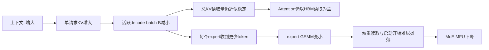
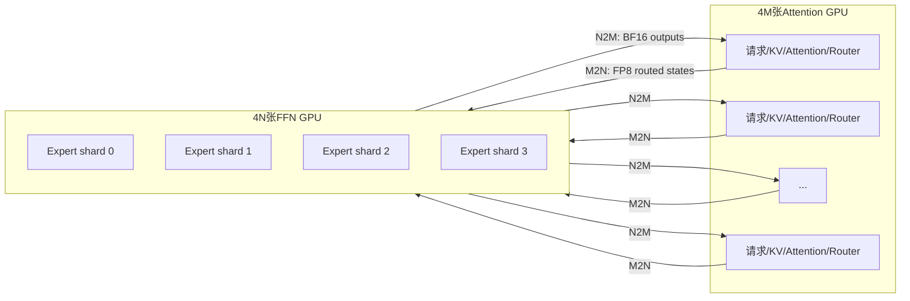
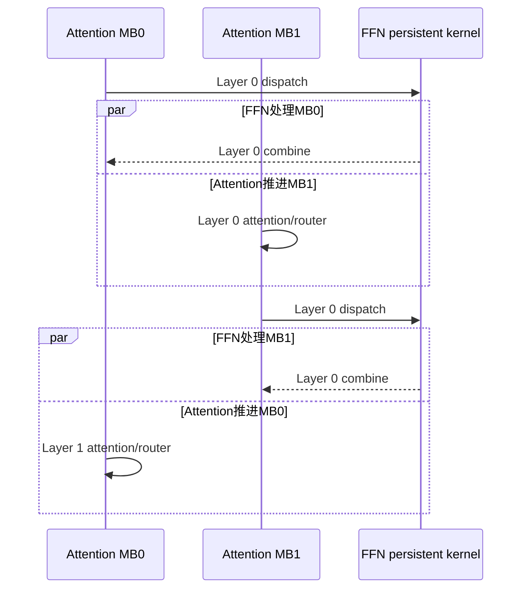
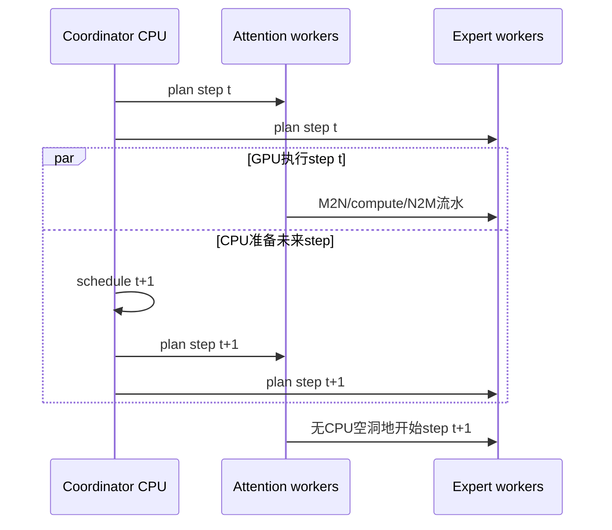

> 版本说明：本文基于Hao AI Lab于2026-07-06发布的FastAFD技术文章，以及2026-07-08的开源仓库commit `3c71619`整理。GB200 NVL72上的1.35-1.45倍结果来自作者实测；Vera Rubin + LPX/LPU部分是建立在若干假设上的预测，不是硬件实测。本文没有本地复现多节点GB200实验。

## 1. 先说结论

FastAFD解决的是一个很具体、但会随上下文增长而变严重的MoE推理矛盾：

1. Attention需要为每个活跃请求保存KV Cache，长上下文会压缩decode batch。
2. MoE FFN需要足够多的token聚合到各个expert，batch太小会让expert GEMM效率快速下降。
3. colocated部署把两者绑在同一批GPU、同一个batch上，Attention能容纳的请求数直接决定MoE能看到多少token。

FastAFD沿用MegaScale-Infer和Step-3已经证明过的Attention-FFN Disaggregation（AFD）思路，但把它做到了单个GB200 NVL72 NVLink域内：

- Attention GPU保存请求状态、KV Cache和少量dense权重，运行attention、router与sampling。
- FFN GPU保存占模型参数90%以上的expert权重，聚合多个Attention GPU的token并运行MoE。
- 两侧每层交换激活，而不是迁移KV Cache或修改模型数学。

真正让这个拆分在强大的Blackwell colocated基线上仍然有收益的，不是“拆开”这一个动作，而是三项runtime机制：

1. GPU常驻的M2N/N2M通信路径，避免CPU轮询进入每层关键路径。
2. MegaMoE式融合和FFN侧persistent kernel，减少dispatch、expert GEMM、combine之间的启动与同步。
3. 两个microbatch加跨step调度重叠，把通信、FFN计算和CPU控制面藏在Attention执行期间。

作者在Qwen3-235B-A22B-FP8和MiniMax-M2.5-FP8上报告的最佳每GPU decode吞吐提升为：

| 模型 | 上下文 | 最佳M:N | 相对vLLM colocated基线 |
|---|---:|---:|---:|
| Qwen3-235B-A22B | 8K | 7:1 | 1.41x |
| Qwen3-235B-A22B | 16K | 11:1 | 1.44x |
| MiniMax-M2.5 | 8K | 17:1 | 1.45x |
| MiniMax-M2.5 | 16K | 17:1 | 1.35x |

这里最容易误读的一点是：**主要收益来自Attention GPU释放expert权重后多装了约1.5倍请求，而不是单个decode step突然快了1.5倍。** FastAFD还要为不直接承载请求的FFN GPU付出拓扑税，因此能得到1.35-1.45倍，依赖于FFN和通信不把step拖长。

一句话概括：

**FastAFD用空间解耦让Attention多装KV、让FFN聚合更多token，再用时间重叠把每层跨角色通信藏起来。**

## 2. 为什么长上下文会“饿死”MoE

### 2.1 decode中的两类工作负载

一个典型MoE Transformer层可以粗略看成：

```text
hidden states
  -> norm / QKV projection
  -> attention读取历史KV
  -> output projection / residual
  -> router为每个token选择top-k experts
  -> dispatch到expert
  -> expert FFN
  -> combine
  -> 下一层
```

Attention和MoE对batch的需求并不相同。

decode attention每一步都要读取此前所有token的KV。设每个GPU的KV预算为常数`C`，平均上下文长度为`L`，每请求KV占用近似与`L`成正比，那么活跃batch上限近似满足：

$$
B(L) \cdot L \approx C
$$

上下文从8K增加到16K时，如果其他条件不变，能常驻的请求数大致减半。

MoE FFN则不同。每个decode请求当前只贡献一个token，router再把token分给top-k experts。粗略地说，每个expert能收到的token数为：

$$
n_{\text{expert}} \approx \frac{B \cdot k}{E}
$$

其中`B`是当前token数，`k`是每token激活的expert数，`E`是参与路由的expert总数。`B`减小时，每个expert的矩阵乘`M`维变小：权重仍要读取，kernel仍要启动，路由与通信仍要执行，但可用于摊薄固定成本的token更少。

### 2.2 为什么Attention利用率较稳，MoE利用率却下降

在固定KV预算的实验中，`B(L) * L`近似不变。Attention读取的总KV字节数也大致不变，因此这个HBM带宽受限阶段的执行时间和MFU不会随上下文剧烈变化。

MoE看到的却只是当前step的`B(L)`个token。上下文越长，batch越小，expert GEMM越碎，MoE MFU越低。



这不是“MoE计算量变多”，恰恰是有效计算太少，硬件吃不饱。

### 2.3 增大EP为什么不能根治

Expert Parallelism增大后，每张GPU只保存更少的expert权重，因此本地权重读取会下降，本地token也会集中到更少的expert上。这通常能改善MoE latency。

但在colocated系统中，Attention已经决定了总batch。增大EP只是在更多GPU之间重新切分同一批token：

- 它没有增加每GPU Attention能接纳的请求。
- 它没有增加进入整个MoE层的token总数。
- dispatch与combine通信不会消失。
- 当本地expert权重流量不再是瓶颈后，EP收益会趋于平坦。

所以EP是在固定耦合关系里优化切分，AFD则直接解除“Attention batch等于FFN输入规模”这一耦合。

## 3. AFD到底拆了什么

AFD不修改router、不改变top-k、不近似expert计算，也不是Prefill-Decode分离。它改变的是模块放置和资源所有权。

| 所有权/工作 | Attention worker | FFN worker |
|---|---|---|
| 请求状态与生命周期 | 是 | 否 |
| KV Cache | 是 | 否 |
| Attention | 是 | 否 |
| Dense projection、norm、residual | 是 | 否 |
| MoE router/top-k | 是 | 否 |
| Expert权重 | 否 | 是 |
| Expert GEMM与激活 | 否 | 是 |
| Sampling | 是 | 否 |

对FastAFD评估的两个大MoE模型，expert参数占总参数90%以上。Attention GPU不再保存expert shard后，大量HBM可以转为KV Cache容量；FFN GPU则专门持有expert权重并聚合来自多个Attention GPU的路由token。

### 3.1 M:N布局

沿用MegaScale-Infer记号：

- `M`：Attention节点数。
- `N`：FFN节点数。
- GB200 NVL72每节点4张GPU。

FastAFD实验固定`N=1`，即4张FFN GPU；`M`从若干Attention节点中选择。每张Attention GPU是一个数据并行lane，FFN侧4卡采用EP=4。



`M2N`表示多个Attention节点向`N`个FFN节点dispatch，`N2M`表示FFN结果返回原Attention节点。这个边界存在于每一个MoE层，所以如果串行执行，通信开销会被层数放大。

## 4. Microbatch流水：拆分后的第一道生死线

设一个microbatch在单层上的：

- Attention侧时间为`T_a`。
- FFN侧时间为`T_e`。
- 单向通信时间为`T_c`。
- 模型有`L`个MoE层。
- 一个decode batch切成`m`个microbatch。

理想流水的稳态周期由慢的一侧决定：

$$
T_f = \max(T_a, T_e)
$$

MegaScale-Infer给出的简化step模型为：

$$
T_{\text{step}} = (T_a + T_e + 2T_c) + T_f(mL - 1)
$$

关键不是把`m`调得越大越好。更多microbatch能创造更多重叠机会，也会重复执行小kernel、metadata处理和边界启动。

FastAFD在GB200上实测`mb=2`最好：

- `mb=1`无法完全隐藏dispatch、FFN和combine。
- `mb=2`已经隐藏双向通信。
- `mb=3/4`没有隐藏更多工作，反而让小kernel开销按`m`增加。



原文的三阶段理想模型用于解释条件，`mb=2`则是融合kernel和实际NVLink流水上的测量结论。不能脱离硬件、kernel粒度和模型形状，把“两批永远最优”当成通用常数。

## 5. FastAFD的runtime架构

公开代码不是从零写的新服务框架，而是基于Mini-SGLang扩展的角色化runtime。主要对象可以归为四层：

```text
python/minisgl/
  afd_coordinator.py          # 集中式调度、step plan、跨step overlap
  afd_scheduler.py            # 每个Attention DP lane的请求与KV调度
  afd_protocol.py             # AG/EG plan和command/reply数据结构
  afd_attention_runtime.py    # AG侧请求、KV page、token pool、metadata
  afd_attention_worker.py     # AG侧模型执行、microbatch流水、CUDA graph
  afd_expert_worker.py        # EG侧expert流水与persistent launch
  moe/megamoe_m2n_afd.py      # 角色化MegaMoE adapter
  kernel/megamoe_m2n_mega.py  # MegaMoE JIT绑定
  models/*_afd.py             # Qwen/MiniMax/GLM的AFD stage模型
```

### 5.1 Coordinator只管计划，不逐层指挥

每个step需要决定：

- 哪些请求运行、哪些结束。
- KV table和page如何分配或释放。
- batch如何padding并切成microbatch。
- 使用哪个CUDA Graph bucket。
- Attention/FFN peer与通信buffer slot是什么。

这些信息被编码到`AfdAGStepPlan`和`AfdEGStepPlan`。其中AG计划包含KV与sampling信息，EG计划很小，因为FFN worker不拥有请求状态，路由也是由AG计算并随数据传递的。

更重要的是，协议注释明确规定：协调器每个`step, microbatch`只发一次命令，worker随后在GPU上完成整个layer loop。逐层次序由M2N/N2M collective自然锁步，不需要每层都回CPU做RPC。

这使控制面复杂度与decode step数量相关，而不是再乘上模型层数。

### 5.2 AG拥有真正的请求状态

`AfdAttentionRuntime`维护：

- request到KV page的映射。
- token pool和每个请求的token位置。
- CUDA attention metadata。
- sampling与generated-token writeback位置。
- pinned host staging ring，用异步H2D避免每step同步拷贝。

这说明“FFN无状态”不是说整个系统无状态，而是把所有会随请求演进的状态集中在Attention侧。FFN只需按当前层收到的路由结果执行。

### 5.3 EG是角色专用执行器

FFN worker加载expert权重，并在每个step中服务所有层与microbatch lane。公开实现支持persistent MegaMoE路径，也保留按层pipeline路径用于其他配置或fallback。

这种设计的好处是FFN GPU不必在attention、通信和expert之间切换角色；代价是它不能直接接纳请求，而且它的资源成本必须计入吞吐分母。

## 6. 为什么把通信控制也放在GPU上

### 6.1 与RDMA集群的选择不同

MegaScale-Infer和StepMesh面对的是跨节点RDMA网络，使用CPU网络线程或CPU侧传输库控制通信可以节省GPU SM，同时payload仍通过GPUDirect RDMA进入显存。

FastAFD面对的是一个72 GPU的NVLink/NVSwitch域。作者选择复用DeepEP的GPU dispatch/combine kernel，让payload和控制都留在GPU：

- 没有CPU post/poll进入每层关键路径。
- CUDA event负责依赖。
- decode主体可以进入CUDA Graph。
- 通信kernel可以与其他GPU工作并行。

代价是真实的：Attention侧边界kernel占用Blackwell 148个SM中的24个，约16%。这项开销只有在通信被融合并与计算重叠时才值得。

### 6.2 如何把非对称AFD映射到对称DeepEP

DeepEP原本假设所有rank都拥有expert，也都参与发送和接收。AFD两类rank角色不对称：

- AG只在dispatch时发送，在combine时接收。
- EG只在dispatch时接收，在combine时发送。

FastAFD没有重写整套通信协议，而是做了一层adapter：

1. 把所有AG和EG rank放进一个process group。
2. 给AG映射一段永远不会被router选择的dummy expert slots。
3. 把真实expert id重映射到EG rank拥有的slot区间。
4. 继续使用DeepEP式对称buffer与事件协议。

这是一个很实用的工程选择：用expert-id布局表达角色，而不是再维护一套全新的collective。

## 7. MegaMoE：融合的不是一个GEMM，而是整个边界

普通分段MoE路径可能包含：

```text
quantize
-> pack/group tokens
-> dispatch
-> wait/event
-> grouped GEMM 1
-> SwiGLU
-> grouped GEMM 2
-> combine
-> scatter/reduce
```

decode时每个expert的token很少，多个kernel launch、临时buffer和同步点会变得显眼。MegaMoE的目标是把通信与expert计算融合到同一个GPU执行体中。

FastAFD进一步按角色拆成两种kernel：

### 7.1 Attention侧kernel

单个layer、单个microbatch执行一次融合launch：

1. 将hidden states量化为FP8。
2. 发布路由metadata和对称buffer位置。
3. 让FFN侧拉取payload。
4. 等待FFN写回BF16 expert结果。
5. 对top-k结果做reduce，恢复该层输出。

### 7.2 FFN侧persistent kernel

一个persistent kernel服务一个decode step中的所有MoE层和所有活跃microbatch lane：

1. 从多个AG拉取FP8 token。
2. 根据expert分组。
3. 执行带SwiGLU的expert GEMM。
4. 将BF16结果推回各来源AG的combine buffer。
5. 通过descriptor table切换到下一层权重。

所以FFN侧不再为每层、每microbatch重新launch。角色专用是这种融合成立的前提：如果同一张GPU还要在层间运行Attention，就无法让一个kernel长期占有整个FFN执行循环。

### 7.3 通信量为什么约为每hidden element 3 bytes

每次边界传输大致是：

- AG到EG：FP8，1 byte/element。
- EG回AG：BF16，2 bytes/element。

因此不计metadata与对齐时约为：

$$
V_{\text{boundary}} \approx 3 \cdot N_{\text{routed hidden elements}}
$$

这也是Rubin预测中使用“约3 bytes per hidden element”的来源。

### 7.4 公开实现的kernel约束

源码显示当前MegaMoE M2N路径并非任意模型都能直接套用：

- hidden size和MoE intermediate size需要满足特定对齐。
- FP8 expert权重主要按128x128 block scale处理。
- persistent EG kernel最多支持4个microbatch lane。
- 当前只覆盖有限的shared-expert形态。
- 不同模型仍有专门的tile、expected-token和prefetch调优。

所以“支持新MoE模型”不仅是补一个Hugging Face config，还可能需要重新处理权重格式、路由语义和kernel形状。

## 8. Zero-overhead scheduling：CPU不能出现在step缝隙里

CUDA Graph可以降低GPU launch开销，但如果每次graph replay后都等待CPU准备下一步，GPU时间线仍会出现空洞。

FastAFD采用跨step固定lead：当前step在GPU执行时，coordinator已经调度并下发后续step。公开代码中overlap loop最多维护3个pending step；Attention worker也使用ahead command与staging ring，避免当前step结束后才开始准备下一次H2D metadata。



消融结果说明这不是小修小补：在Qwen3-235B、4节点、8K配置中，关闭跨step overlap后，step从32.826 ms增长到42.612 ms，吞吐下降23%，甚至落到colocated基线以下。

## 9. 吞吐提升的恒等式

FastAFD文章最有解释力的部分不是某个kernel，而是把speedup拆成三个可以独立审计的因子。

### 9.1 colocated基线

设vLLM每张GPU常驻`B_v`个请求，decode step时间为`T_v`，则每GPUdecode吞吐为：

$$
Q_v = \frac{B_v}{T_v}
$$

### 9.2 FastAFD

FastAFD有`4M`张Attention GPU，每张常驻`B_a`个请求；还有`4N`张不承载请求但必须计入成本的FFN GPU。于是：

$$
Q_a = \frac{4M \cdot B_a}{4(M+N) \cdot T_a}
= \frac{B_a}{T_a} \cdot \frac{M}{M+N}
$$

两者相除：

$$
\boxed{
S = \frac{B_a}{B_v}
\cdot \frac{M}{M+N}
\cdot \frac{T_v}{T_a}
}
$$

三个因子分别是：

1. **Batch expansion** `B_a/B_v`：移走expert权重后，多出来的KV容量。
2. **FFN-node tax** `M/(M+N)`：FFN GPU不直接生成请求token，但计入总GPU数。
3. **Latency ratio** `T_v/T_a`：拆分、通信和流水后，整个decode step相对多快。

前两项分别由显存和拓扑决定，runtime优化只能改善第三项，并确保FFN不暴露到关键路径。

### 9.3 四组实验的容量变化

FastAFD在四组工作负载中都把每Attention GPU的resident batch扩大到1.5倍：

| 模型 | 上下文 | vLLM每GPU | FastAFD每Attention GPU |
|---|---:|---:|---:|
| Qwen3-235B | 8K | 64 | 96 |
| Qwen3-235B | 16K | 32 | 48 |
| MiniMax-M2.5 | 8K | 48 | 72 |
| MiniMax-M2.5 | 16K | 24 | 36 |

这直接解释了为什么文章说“收益是capacity，不是latency”。以Qwen 8K、`M:N=7:1`为例，仅容量和拓扑就给出：

$$
1.5 \times \frac{7}{8} = 1.3125
$$

最终实测1.41倍意味着：

$$
\frac{T_v}{T_a} = \frac{1.41}{1.3125} \approx 1.074
$$

也就是FastAFD step只比vLLM快约6.9%，绝大部分吞吐提升来自同一张Attention GPU多承载了50%的请求。

同样反推四组结果：

| 工作负载 | 容量×拓扑 | 实测speedup | 隐含`T_v/T_a` | 直观解释 |
|---|---:|---:|---:|---|
| Qwen 8K, 7:1 | 1.3125 | 1.41 | 1.074 | AFD step约快6.9% |
| Qwen 16K, 11:1 | 1.3750 | 1.44 | 1.047 | AFD step约快4.5% |
| MiniMax 8K, 17:1 | 1.4167 | 1.45 | 1.024 | AFD step约快2.3% |
| MiniMax 16K, 17:1 | 1.4167 | 1.35 | 0.953 | AFD step约慢4.9%，容量仍覆盖开销 |

最后一行尤其重要：AFD不要求step一定更短。只要容量收益大于FFN税和额外延迟，它仍能提高每GPU吞吐。

## 10. 如何从vLLM基线预测FastAFD

把colocated step拆成：

$$
T_v = T_{\text{FMHA}} + T_{\text{dense}} + T_{\text{moe}}
$$

其中：

- `T_FMHA`是主要受KV读取量影响的大Attention kernel。
- `T_dense`包含projection、router、norm、KV更新、cast和其他小kernel。
- `T_moe`包含expert、dispatch与combine，是AFD试图从AG关键路径移走的部分。

如果FFN完全隐藏，FastAFD暴露的只是Attention侧。设batch扩大`r=B_a/B_v`倍、microbatch数为`m`：

$$
T_a \approx rT_{\text{FMHA}} + mT_{\text{dense}}
$$

原因是：

- FMHA是HBM带宽受限的大kernel，batch扩大`r`倍意味着KV读取量近似扩大`r`倍。
- dense部分包含很多小kernel，更接近按microbatch重复，而不是随batch线性高效放大。

代入`r=1.5`、`m=2`和实际`M:N`，作者只用vLLM step decomposition就预测出：

| 工作负载 | 实测 | 预测 |
|---|---:|---:|
| MiniMax-M2.5 8K | 1.45x | 1.45x |
| MiniMax-M2.5 16K | 1.35x | 1.38x |
| Qwen3-235B 8K | 1.41x | 1.41x |
| Qwen3-235B 16K | 1.44x | 1.44x |

预测误差来自`T_a`近似，作者称Nsight Systems中的step period误差在约2%内。这个模型有用，是因为它提供了部署前的判断方法：先profile现有colocated基线，再判断移走MoE是否值得，而不是先造完整AFD集群再碰运气。

## 11. 为什么目标不是`T_a = T_e`

MegaScale-Infer的理想流水强调Attention与FFN平衡。FastAFD给出了更保守的放置准则：

$$
T_e \le T_a
$$

即选择**仍能让FFN隐藏的最大`M`**。

原因在于边界两边代价不对称。

### 11.1 FFN有余量时

如果`T_e < T_a`，FFN会有空闲，但step仍由Attention决定。多加一个Attention节点只会让FFN节点税继续下降：

$$
\text{tax}=\frac{N}{M+N}
$$

当`N=1`时，从7:1到17:1，FFN占总GPU比例从12.5%降到5.6%。FFN的少量闲置是有界成本。

### 11.2 FFN暴露时

如果`T_e > T_a`，FFN成为每个decode step的瓶颈。再增加Attention节点会发送更多路由token，`T_e`继续增长，所有请求每一步都变慢。这是随`M`放大的成本。

所以在边界附近，向“FFN稍有余量”一侧偏更稳健。模型、batch和上下文波动一旦把严格平衡点推向`T_e>T_a`，代价远高于预留一点FFN slack。

这也解释了最佳拓扑不同：

- MiniMax每token约激活10B参数，一个FFN节点能在测量范围内隐藏到17:1。
- Qwen每token激活22B参数，更早进入FFN受限区，8K最佳7:1、16K最佳11:1。

## 12. 实验结果应该怎样读

### 12.1 实验设置

作者评估的是同步、稳态、decode-only窗口：

- 硬件：GB200 NVL72，同一72 GPU NVLink/NVSwitch域。
- 模型：Qwen3-235B-A22B-FP8、MiniMax-M2.5-FP8。
- prompt：从网页真实文本中随机采样并pack到8K或16K。
- KV显存比例：约0.85，尽量接近可运行的最大decode batch。
- FastAFD：`M`个Attention节点、1个FFN节点、mb=2。
- vLLM：单个4 GPU节点，DP=4、EP=4，启用DeepEP和DeepGEMM。
- 指标：每step生成token数 / step latency / 总GPU数。

FastAFD的分母包含不承载请求的4张FFN GPU，这是公平口径中非常关键的一点。

### 12.2 结果不是端到端在线服务speedup

文章明确没有覆盖：

- prefill latency。
- 在线请求到达和动态batch。
- mixed prefill/decode干扰。
- TTFT、ITL和SLO达标goodput。
- 请求迁移与故障恢复。
- admission control和负载不均衡。
- speculative decoding与PD disaggregation组合。

因此1.35-1.45倍应读作：**在作者的长上下文、满KV、同步稳态decode实验中，每总GPU的decode吞吐提升。** 它不能直接替换成线上QPS、用户延迟或集群TCO提升。

### 12.3 基线很强，但范围仍有限

vLLM基线启用了DeepEP与DeepGEMM，并选择作者找到的最佳EP=4，不是朴素基线。不过它只在一个4卡节点上测量，再依据独立DP节点的每GPU吞吐不变来比较大规模FastAFD。

这个口径对稳态独立DP是合理的，但仍没有纳入大规模线上系统的入口、调度、负载倾斜和故障域成本。

## 13. 三项消融分别证明了什么

| 机制 | 移除后的结果 | 它保护的条件 |
|---|---|---|
| MegaMoE融合 | 8节点step latency在Qwen下降44%、MiniMax下降42% | 让`T_e`足够小，FFN保持隐藏 |
| 跨step调度重叠 | Qwen 4节点8K从32.826ms增至42.612ms，吞吐损失23% | 消除CUDA Graph replay之间的CPU空洞 |
| `mb=2` | `mb=1`隐藏不足，`mb=3/4`增加重复小kernel | 用最少切分覆盖双向通信 |

这三者不是可有可无的独立“优化点”。拆分本身增加了边界，它们共同把新增边界压回关键路径之外。文章中关闭调度重叠后性能低于colocated基线，说明只实现功能正确的AFD并不会自动更快。

## 14. Vera Rubin + LPX/LPU预测

文章最后把AFD从“同类GPU的角色分工”推广成“异构硬件边界”：Rubin GPU负责KV密集的Attention，LPX/LPU负责权重与计算密集的FFN/MoE。

必须先强调：这部分没有实机，所有数字都是projection。

### 14.1 MoE-only offload

如果LPX/LPU上的MoE和通信完全隐藏，Rubin侧暴露时间为：

$$
T_{\text{Rubin}} = T_{\text{FMHA}} + T_{\text{dense}}
$$

在文章假设下，batch扩张对吞吐和Attention时间的线性影响相互抵消，speedup简化为：

$$
S_{\text{MoE-only}} \approx
\frac{T_{\text{FMHA}}+T_{\text{dense}}+T_{\text{moe}}}
{T_{\text{FMHA}}+T_{\text{dense}}}
=\frac{1}{1-f_{\text{moe}}}
$$

按GB200 vLLM测得的step组成，预测为1.57-1.75倍：

| 工作负载 | FMHA | Dense | MoE | MoE隐藏后的预测 |
|---|---:|---:|---:|---:|
| MiniMax 8K | 43.4% | 16.2% | 40.5% | 1.68x |
| MiniMax 16K | 48.2% | 15.3% | 36.4% | 1.57x |
| Qwen 8K | 41.4% | 15.7% | 43.0% | 1.75x |
| Qwen 16K | 42.4% | 16.0% | 41.6% | 1.71x |

### 14.2 Dense + MoE offload上界

更激进的边界把dense path也移到LPX：Rubin只暴露Attention，理论上：

$$
S_{\text{dense+MoE}} \approx
\frac{T_{\text{FMHA}}+T_{\text{dense}}+T_{\text{moe}}}
{T_{\text{FMHA}}}
=\frac{1}{f_{\text{FMHA}}}
$$

对应上界为2.07-2.42倍。但这比FastAFD当前边界更激进：每层dense依赖也跨设备，payload与同步链更长，只要不能完全重叠，收益就会被吃掉。

### 14.3 预测成立需要哪些假设

文章的Rubin数字至少依赖：

1. Rubin-only的FMHA:dense:MoE比例与GB200相近。
2. Attention、dense和MoE在新硬件上没有出现完全不同的相对加速。
3. 两个LPX rack提供的256GB SRAM足以放约230GB FP8 checkpoint。
4. LPX kernel效率足够接近用于估算的compute能力。
5. 传输和软件调度能完全隐藏。
6. 统计“每Rubin GPU吞吐”时不把LPX数量、成本和功耗归一化进分母。
7. 线上动态负载不会频繁打破隐藏条件。

最后两项尤其影响经济性。GB200实验认真计算了FFN-node tax，Rubin预测却有意不按LPX成本归一化，所以它更像架构上界，不是TCO结论。

两种边界的真正合同是：

$$
T^{\text{LPU}}_{\text{moe}} + T_{\text{transport}}
\le T^{\text{Rubin}}_{\text{FMHA}} + T^{\text{Rubin}}_{\text{dense}}
$$

以及更激进的：

$$
T^{\text{LPU}}_{\text{dense}} + T^{\text{LPU}}_{\text{moe}} + T_{\text{transport}}
\le T^{\text{Rubin}}_{\text{FMHA}}
$$

预测的价值不在“未来一定有1.75倍”，而在于给出了可以用实机逐项验证的隐藏不等式。

## 15. 开源代码成熟度与限制

FastAFD的开源价值在于它不是只有论文图的概念系统：仓库包含server、Ray worker、集中式scheduler、AFD协议、角色化模型、MegaMoE/DeepEP/DeepGEMM kernel、正确性对齐脚本和大规模实验preset。

但它目前仍明确是serving prototype：

- 官方验证平台是aarch64、CUDA 13.0、PyTorch 2.10.0和特定NCCL版本。
- quickstart与正确性主路径使用Qwen3-30B-A3B；论文规模preset面向Qwen3-235B和MiniMax-M2.5。
- AFD coordinator当前只接受`cache_type='naive'`，还不是完整prefix/radix cache serving。
- 生产级online arrival、SLO调度、迁移、容错和混合流量不在当前结果内。
- 大规模preset依赖已有Ray GPU cluster和共享模型快照。
- 高性能kernel对模型shape、量化格式和Blackwell架构有明显绑定。

因此它目前最适合两类用途：

1. 研究和验证Attention-FFN分离、M:N布局与融合通信kernel。
2. 在同构NVLink大域或未来异构机架上，作为生产runtime设计的可检查原型。

直接把它当成通用vLLM替代品并不符合当前代码边界。

## 16. 什么时候值得考虑AFD

### 适合

- 模型绝大多数权重位于MoE experts。
- 长上下文使KV Cache成为batch容量上限。
- colocated profile显示MoE小batch利用率很差。
- 多个Attention worker可以通过高带宽scale-up fabric聚合到同一FFN池。
- 有能力做GPU通信、CUDA Graph和模型专用kernel调优。
- 工作负载以高吞吐稳态decode为主。

### 不一定适合

- dense模型或expert权重占比不高。
- 短上下文下colocated batch已经足够大。
- 跨角色只能走高延迟、低带宽网络，且CPU/GPU控制开销无法隐藏。
- 请求量太小，FFN聚合后仍然没有足够token。
- 业务主要瓶颈是prefill、TTFT或在线调度，而不是steady-state decode。
- 为AFD增加的专用GPU、功耗和运维成本高于吞吐收益。

### 最小评估流程

不必先实现完整AFD。可以先从现有colocated系统拿到四组数据：

1. 模型权重、运行时buffer和KV Cache的显存分解。
2. `T_FMHA`、`T_dense`、`T_moe`的step profile。
3. context length变化时resident batch和MoE MFU。
4. 目标fabric上的单向激活传输时间`T_c`。

然后估计batch expansion、FFN-node tax与隐藏条件。如果容量与拓扑两项乘积已经小于1，或者`T_e + transport`明显无法隐藏，就没有必要先投入复杂runtime开发。

## 17. 总结

FastAFD最值得记住的不是“MoE拆开能快1.45倍”，而是下面这条完整因果链：

```text
长上下文
-> KV Cache压缩decode batch
-> colocated MoE每expert token不足
-> AFD把请求/KV与expert权重分开放置
-> Attention GPU多装约1.5倍请求
-> FFN GPU聚合多个Attention worker的token
-> M2N/N2M引入逐层通信边界
-> GPU通信 + MegaMoE + mb=2 + 跨step overlap隐藏边界
-> 在计算FFN GPU成本后，每GPUdecode吞吐提升1.35-1.45倍
```

它同时给出了一个比“追求完美平衡”更实用的部署原则：选择让`T_e <= T_a`成立的最大`M`。FFN稍有余量只是有界的资源税，FFN一旦暴露却会拖慢每个step。

对未来异构硬件，AFD也许比某个具体kernel更持久：它定义了一条清晰的软件边界，让KV容量与Attention带宽跟随GPU，让大规模权重和FFN计算跟随另一类加速器。但所有漂亮的投影最终仍要回到同一个问题：远端路径能否被本地剩余工作完全隐藏。

## 参考

1. Hao AI Lab, [FastAFD: Open-Source Large-Scale Attention-FFN Disaggregation on Blackwell NVL72](https://haoailab.com/blogs/fastafd/)
2. Hao AI Lab, [FastAFD GitHub repository](https://github.com/hao-ai-lab/FastAFD)
3. Ruidong Zhu et al., [MegaScale-Infer: Serving Mixture-of-Experts at Scale with Disaggregated Expert Parallelism](https://arxiv.org/abs/2504.02263)
4. StepFun Team, [Step-3 is Large yet Affordable: Model-system Co-design for Cost-effective Decoding](https://arxiv.org/abs/2507.19427)
5. NVIDIA, [GB200 NVL72](https://www.nvidia.com/en-us/data-center/gb200-nvl72/)
6. DeepSeek-AI, [DeepEP](https://github.com/deepseek-ai/DeepEP)
7. DeepSeek-AI, [DeepGEMM](https://github.com/deepseek-ai/DeepGEMM)
8. StepFun Team, [StepMesh](https://github.com/stepfun-ai/StepMesh)
9. vLLM Team, [vLLM](https://github.com/vllm-project/vllm)
10. NVIDIA, [Inside NVIDIA Groq 3 LPX](https://developer.nvidia.com/blog/inside-nvidia-groq-3-lpx-the-low-latency-inference-accelerator-for-the-nvidia-vera-rubin-platform/)
11. NVIDIA, [Inside the NVIDIA Vera Rubin Platform](https://developer.nvidia.com/blog/inside-the-nvidia-rubin-platform-six-new-chips-one-ai-supercomputer/)
