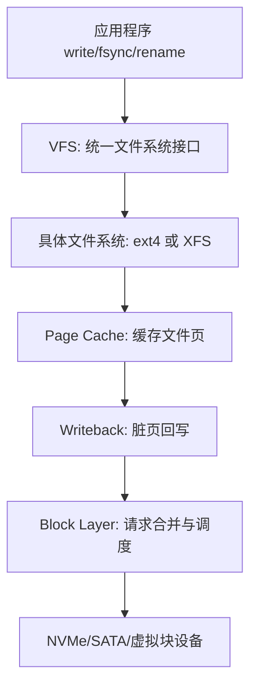
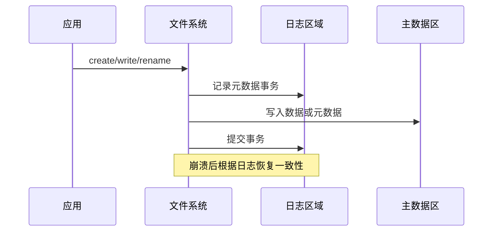
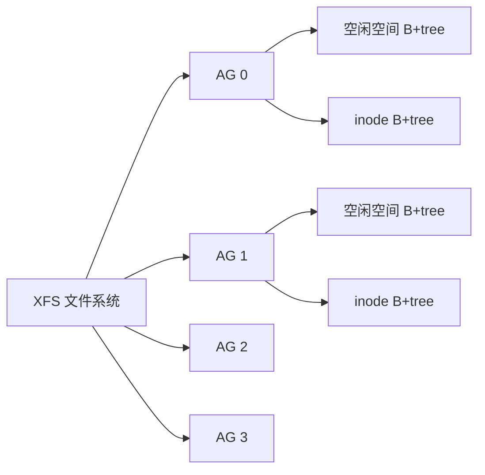

本文只讨论文件系统本身，不依赖某个具体项目。以 Linux 上最常见的 ext4 和 XFS 为例，先从“文件系统到底在解决什么问题”讲起，再往下看 inode、目录、页缓存、extent、日志、空间分配和运维选型。

版本说明：本文基于 Linux kernel 文档中 ext4、XFS、page cache、writeback、VFS 相关文档，以及 `man` 手册中的常用工具行为整理。文件系统实现会随内核演进，具体挂载参数和工具输出请以当前发行版为准。

## 先说结论

文件系统不是“把文件名翻译成磁盘地址”这么简单。它至少同时解决四个问题：

- 命名：把 `/home/a.txt` 这样的路径变成一个具体文件对象。
- 布局：把文件内容放到块设备的哪些物理块上。
- 一致性：断电、宕机、写到一半时，如何避免元数据损坏。
- 性能：如何利用页缓存、延迟分配、预分配、批量提交等机制减少随机 IO。

ext4 和 XFS 都是成熟的日志型文件系统，但性格不同：

- ext4 更像 Linux 默认通用文件系统：结构简单、兼容性好、工具链成熟，适合系统盘、小到中等规模数据盘、普通服务器。
- XFS 更偏向高并发、大文件、大目录、大容量场景：并行分配能力强，元数据伸缩性好，常用于数据库、对象存储、日志平台和大数据本地盘。
- 如果你不知道怎么选，普通 Linux 根分区选 ext4 通常没问题；大容量数据盘、高并发写入、上 TB 甚至更大规模的生产数据目录，优先考虑 XFS。

## 文件系统在 Linux IO 栈里的位置

应用并不会直接操作 ext4 或 XFS 的内部结构。一次普通写文件大致会经过：



VFS 是 Linux 的抽象层。应用看到的是 `open()`、`read()`、`write()`、`rename()`、`fsync()` 这些统一接口，VFS 再把操作转发给具体文件系统。

所以同样的 `write(fd, buf, len)`，落到 ext4 和 XFS 后，内部会使用不同的 inode 结构、分配器、日志格式和回写策略。但应用一般不需要知道这些差异，除非你开始关心性能、崩溃一致性、碎片、容量上限和恢复时间。

## 从路径到 inode

假设程序打开：

```text
/var/log/app/access.log
```

文件系统并不是拿完整字符串一次性查找，而是逐级解析目录项：

```text
/ -> var -> log -> app -> access.log
```

每一级目录本质上都是“名字到 inode 编号”的映射。inode 才是文件对象的核心身份，里面保存权限、属主、时间戳、大小、链接计数，以及文件数据块的索引信息。

可以用下面的命令观察：

```shell
ls -li access.log
stat access.log
```

其中 `ls -i` 显示的数字就是 inode number。文件名不在 inode 里，文件名在目录项里。这也是为什么硬链接可以成立：多个目录项可以指向同一个 inode。

```shell
echo hello > a.txt
ln a.txt b.txt
ls -li a.txt b.txt
```

此时 `a.txt` 和 `b.txt` 的 inode 编号相同。删除其中一个名字时，文件内容不会马上消失；只有 inode 的链接计数归零，并且没有进程继续打开它，空间才会真正释放。

## 页缓存：为什么写文件不等于马上写盘

Linux 的普通 buffered IO 默认会经过 page cache。应用调用 `write()` 后，数据通常先写进内存里的页缓存，并把这些页标记为 dirty page。之后内核的 writeback 机制再异步把脏页写回块设备。

这带来一个非常重要的结论：

```text
write() 成功 != 数据已经落盘
```

如果进程只调用 `write()`，机器马上断电，刚写入的数据可能还在内存里。要提高持久化语义，需要显式调用：

```shell
fsync(fd)
fdatasync(fd)
sync
```

区别可以粗略理解为：

- `fsync(fd)`：把文件数据和必要元数据都刷到稳定存储。
- `fdatasync(fd)`：尽量只刷数据和保证读取该数据所需的元数据。
- `sync`：请求系统把所有脏数据刷出去，范围更大，通常更重。

很多“文件系统丢数据”的误解，其实来自应用没有正确使用 `fsync()`。文件系统日志主要保护元数据一致性，不等价于每次 `write()` 都强持久化。

## 块、extent 和碎片

传统文件系统会把文件切成固定大小的数据块。例如常见块大小是 4 KiB。一个 1 GiB 文件如果逐块记录位置，需要大量索引项。

现代文件系统通常用 extent 表示连续空间：

```text
逻辑文件偏移 0 开始，连续 65536 个块，放在磁盘物理块 100000 开始的位置
```

这样一个 extent 就可以描述很大一段连续数据。ext4 和 XFS 都使用 extent 思路。extent 的好处是：

- 元数据更少。
- 顺序读写更容易合并。
- 大文件布局更紧凑。
- 碎片少时性能更接近设备顺序吞吐。

碎片的本质是：文件的逻辑连续区域被分散到很多物理位置。机械硬盘上碎片会导致寻道开销明显增加；SSD 上没有机械寻道，但碎片仍会增加元数据查询、BIO 数量和写放大压力。

## 日志：文件系统如何面对宕机

日志型文件系统的关键目的不是“保证用户数据永不丢”，而是“保证文件系统元数据不会因为写到一半而进入不可理解状态”。

一个典型例子是创建文件：

```text
1. 分配 inode
2. 分配目录项
3. 更新目录大小和时间戳
4. 更新位图或空闲空间结构
```

如果系统在第 2 步和第 3 步之间断电，磁盘上可能留下半更新状态。日志机制会把一组元数据修改组织成事务，重启后通过 replay 或 rollback 让文件系统回到一致状态。



这里要分清“元数据一致性”和“用户数据持久化”。如果你写入一个文件后没有 `fsync()`，崩溃恢复后文件系统结构可能是好的，但新写的数据不一定存在。

## ext4 的核心机制

ext4 是 ext2/ext3 的后继者，保留了很强的兼容性，同时引入 extent、延迟分配、多块分配和日志增强。

### 块组与局部性

ext4 把磁盘空间划分为 block group。每个块组里有自己的块位图、inode 位图、inode 表和数据块区域。这样做的好处是局部性好：目录、inode、文件数据尽量放得近一些，减少寻址成本。

粗略可以画成：

```text
Block Group 0
  superblock / group descriptors / bitmaps / inode table / data blocks

Block Group 1
  backup metadata / bitmaps / inode table / data blocks
```

ext4 后来又引入 flex block group，把多个块组作为更大的分配单元看待，减少大文件分配时被小块组边界限制。

### extent tree

ext4 用 extent tree 记录文件逻辑块到物理块的映射。小文件的 extent 信息可以直接放在 inode 中；文件变大后，会扩展成树结构。

相比老式间接块索引，extent tree 对大文件更友好。比如一个连续的 1 GiB 文件，不需要记录 262144 个 4 KiB 块的位置，只需要少量 extent 条目。

### delayed allocation

延迟分配是 ext4 性能的重要来源。应用写入数据时，文件系统可以先不急着决定具体物理块，而是等到脏页回写时再统一分配。

这样可以看到更完整的写入形态：

```text
应用连续写 1 GiB
  -> page cache 里积累脏页
  -> writeback 时统一分配一大段连续空间
  -> 得到更少 extent、更少碎片
```

代价是，崩溃前还没分配和落盘的数据更依赖应用是否调用 `fsync()`。这不是 ext4 独有问题，而是 buffered IO 和延迟分配共同带来的语义边界。

### journaling mode

ext4 常见有三类日志模式：

- `data=ordered`：默认常见模式。元数据写入日志，相关数据块通常会在元数据提交前写出，避免崩溃后新文件指向旧垃圾数据。
- `data=writeback`：不保证数据先于元数据写出，性能可能更好，但崩溃后的数据语义更弱。
- `data=journal`：数据和元数据都写日志，持久化语义更强，但写放大明显，一般不作为默认选择。

生产环境通常不要为了“感觉更快”随便切到 `writeback`。如果应用依赖 rename 替换、写临时文件再原子发布等模式，应该按正确顺序 `fsync(file)` 和 `fsync(dir)`。

## XFS 的核心机制

XFS 最早来自 SGI IRIX，后来进入 Linux。它从设计上就面向大容量、高并发和大文件。

### allocation group

XFS 的关键概念是 allocation group，简称 AG。可以把一个 XFS 文件系统看成多个相对独立的分配区域。每个 AG 有自己的空闲空间和 inode 管理结构，多个线程可以在不同 AG 上并行分配。



这个设计使 XFS 在多核、多线程、大目录和大文件场景下更容易扩展。相比“全局大锁 + 单一空闲空间结构”，AG 能减少竞争。

### B+tree everywhere

XFS 大量使用 B+tree 管理元数据，例如空闲空间、inode、extent 映射等。B+tree 的优势是规模变大后仍能保持较稳定的查找和更新复杂度。

这也是 XFS 适合大文件系统的重要原因之一。一个包含海量文件或大量 extent 的文件系统，如果元数据结构不能扩展，性能会很快被目录查找、空闲空间搜索和 inode 分配拖垮。

### delayed logging

XFS 的日志机制经过长期演进。现代 XFS 使用 delayed logging，把多个元数据变更聚合、排序并批量写入日志，减少同步写日志的压力。

简单理解：

```text
很多小的元数据修改
  -> 在内存中合并成更紧凑的日志项
  -> 批量写入日志
  -> 减少日志 IO 和锁竞争
```

这类优化对高并发元数据工作负载很重要，例如大量创建、删除、rename、truncate。

### reflink 与 CoW

现代 XFS 支持 reflink，也就是复制文件时共享底层数据块，只有写入修改时才进行 copy-on-write。典型命令是：

```shell
cp --reflink=auto src.img dst.img
```

如果底层文件系统支持 reflink，复制大文件可以非常快，因为一开始只复制元数据映射，不复制全部数据块。虚拟机镜像、容器镜像和快照类工作负载会受益。

注意：reflink 是否启用取决于创建文件系统时的特性和发行版默认值。要看当前文件系统能力，应该用 `xfs_info` 和实际命令验证。

## ext4 与 XFS 对比

下面的表是工程选型视角的粗略总结：

| 维度 | ext4 | XFS |
|---|---|---|
| 默认使用场景 | 系统盘、通用数据盘 | 大容量数据盘、高并发写入、大文件 |
| 元数据组织 | block group、extent tree、日志 | allocation group、大量 B+tree、日志 |
| 扩展性 | 足够好，通用性强 | 大规模和并行场景更强 |
| 在线扩容 | 支持 | 支持 |
| 在线缩容 | 常见工具支持 ext4 shrink，但要谨慎离线操作 | 通常不支持 shrink |
| 小文件 | 表现稳定，适合通用场景 | 也可以，但优势不一定明显 |
| 大文件/大目录 | 可以胜任 | 通常更有优势 |
| 恢复工具 | `fsck.ext4`/`e2fsck` | `xfs_repair`，挂载时日志恢复 |
| 日常命令 | `tune2fs`、`dumpe2fs`、`resize2fs` | `xfs_info`、`xfs_growfs`、`xfs_repair` |

不要把这个表理解成“ext4 慢，XFS 快”。文件系统性能非常依赖工作负载：

- 顺序大文件写：设备吞吐、预分配、extent 连续性影响大。
- 小文件随机创建删除：目录结构、日志提交、inode 分配影响大。
- 数据库：通常还要考虑 direct IO、`fsync()` 频率、barrier、设备 cache。
- 容器镜像：reflink、overlayfs、目录规模和元数据性能会更关键。

## 一个具体写入流程

以 `echo "hello" >> log.txt` 为例，忽略 shell 细节后，文件系统内部大致发生：

```text
1. 路径查找：找到当前目录 inode，再找到 log.txt 的 inode。
2. 权限检查：确认进程可以写入。
3. 写入页缓存：把 hello 追加到文件对应的 page cache。
4. 标记脏页：文件数据页变 dirty。
5. 更新内存元数据：文件大小、mtime 等可能变化。
6. 日志事务：需要持久化的元数据变化进入文件系统日志。
7. 后台回写：writeback 把脏页写到块设备。
8. 提交日志：元数据事务提交，崩溃后可恢复。
```

如果命令返回后马上断电，结果取决于数据和元数据是否已经写出，以及应用是否做了同步。很多日志系统会选择批量 `fsync()`，在吞吐和丢失窗口之间做权衡。

## 常用观察命令

查看文件系统类型：

```shell
findmnt -no FSTYPE,TARGET,SOURCE /
df -T
lsblk -f
```

查看 ext4 信息：

```shell
sudo tune2fs -l /dev/nvme0n1p2
sudo dumpe2fs -h /dev/nvme0n1p2
```

查看 XFS 信息：

```shell
xfs_info /mount/point
sudo xfs_db -r /dev/nvme0n1p2 -c 'sb 0' -c 'p'
```

查看文件 extent：

```shell
filefrag -v large-file.dat
```

观察脏页和回写：

```shell
cat /proc/meminfo | grep -E 'Dirty|Writeback'
sysctl vm.dirty_ratio vm.dirty_background_ratio
```

## 常见误区

### 误区一：日志文件系统就不会丢数据

日志主要保护元数据一致性。用户数据是否持久化，要看写入模式、挂载选项、回写时机和应用是否调用 `fsync()`。

### 误区二：SSD 上不用关心碎片

SSD 没有机械寻道，但碎片仍会增加元数据复杂度和 IO 请求数量。对大文件顺序读写、备份、扫描类任务，extent 连续性仍有意义。

### 误区三：XFS 一定比 ext4 快

XFS 在大规模、高并发和大文件场景常有优势，但小型系统盘、简单工作负载下 ext4 的差距可能更小，甚至更省心。选型要看 workload，不要只看 benchmark 标题。

### 误区四：`fsync()` 太慢，所以不用

不用 `fsync()` 是在选择更弱的崩溃语义。正确做法不是无脑删掉同步，而是调整批量大小、目录同步策略、日志分组、数据库参数或存储硬件。

## 选型建议

我会按下面的方式做保守选择：

- 桌面 Linux、普通根分区、小型云主机：ext4。
- 需要在线扩容、容量较大但工作负载普通：ext4 或 XFS 都可以，按团队熟悉度选。
- 大容量数据盘、日志平台、对象存储、本地大数据目录：优先 XFS。
- 大量虚拟机镜像、容器镜像、快照复制：关注 XFS reflink 或其他支持 CoW/reflink 的方案。
- 明确需要缩容文件系统：谨慎选择 XFS，因为它通常不能 shrink。
- 数据库目录：先看数据库官方建议，再决定 ext4/XFS、direct IO、挂载参数和 `fsync()` 策略。

生产环境里，比“选 ext4 还是 XFS”更重要的是：

- 是否有备份和恢复演练。
- 是否知道应用的 `fsync()` 语义。
- 是否监控磁盘延迟、队列深度、写放大、空间耗尽和 inode 耗尽。
- 是否在真实 workload 下测试过。

## 小结

文件系统是一个夹在应用语义和块设备之间的复杂系统。它要把路径名、权限、目录、inode、extent、页缓存、日志、空间分配和崩溃恢复揉在一起，并且还要尽量快。

ext4 的优势是稳定、通用、生态成熟；XFS 的优势是面向大规模和并发的元数据设计。理解它们的关键不是背命令，而是抓住几条主线：

- 文件名通过目录项指向 inode。
- inode 通过 extent 找到文件数据。
- 普通 IO 先进入 page cache，再由 writeback 写盘。
- 日志保护元数据一致性，但不自动保证每次写入都持久化。
- ext4 以 block group 和通用兼容性见长。
- XFS 以 allocation group、B+tree 和大规模并发能力见长。

理解这些之后，再看 `fsync()`、`filefrag`、`xfs_info`、`tune2fs`、`mount` 参数和各种性能现象，就不会只停留在“玄学调参”了。

## 参考

- Linux kernel docs: ext4 Data Structures and Algorithms, https://docs.kernel.org/filesystems/ext4/
- Linux kernel docs: ext4 admin guide, https://docs.kernel.org/admin-guide/ext4.html
- Linux kernel docs: XFS Filesystem Disk Structures, https://docs.kernel.org/filesystems/xfs/
- Linux kernel docs: XFS delayed logging design, https://docs.kernel.org/filesystems/xfs/xfs-delayed-logging-design.html
- Linux kernel docs: VFS, https://docs.kernel.org/filesystems/vfs.html
- Linux kernel docs: Page Cache, https://docs.kernel.org/mm/page_cache.html
- Linux kernel docs: Writeback, https://docs.kernel.org/filesystems/writeback.html
- man-pages: `fsync(2)`, `open(2)`, `stat(2)`
- xfsprogs manual pages: `xfs_info(8)`, `xfs_repair(8)`, `xfs_growfs(8)`
- e2fsprogs manual pages: `tune2fs(8)`, `dumpe2fs(8)`, `resize2fs(8)`, `e2fsck(8)`
