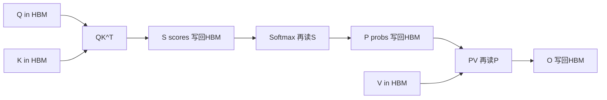
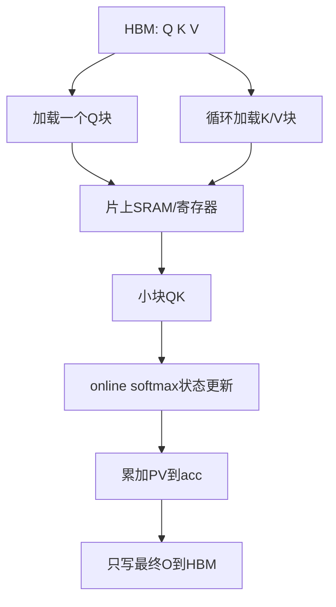
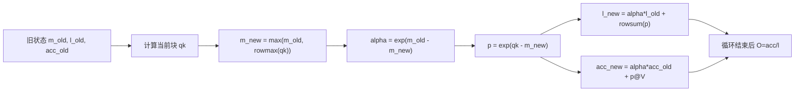
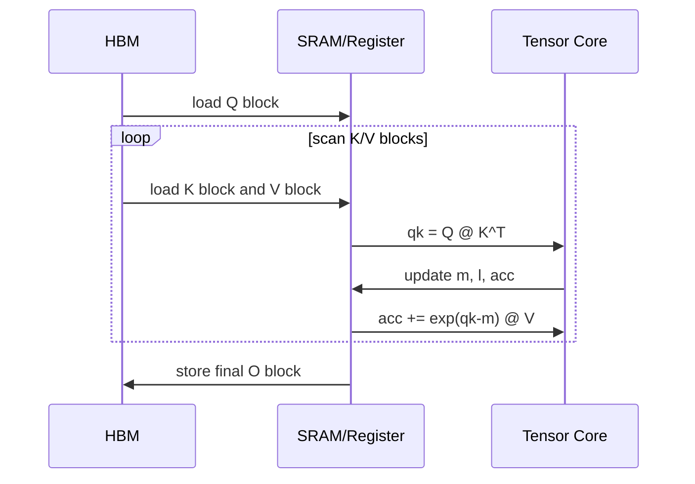
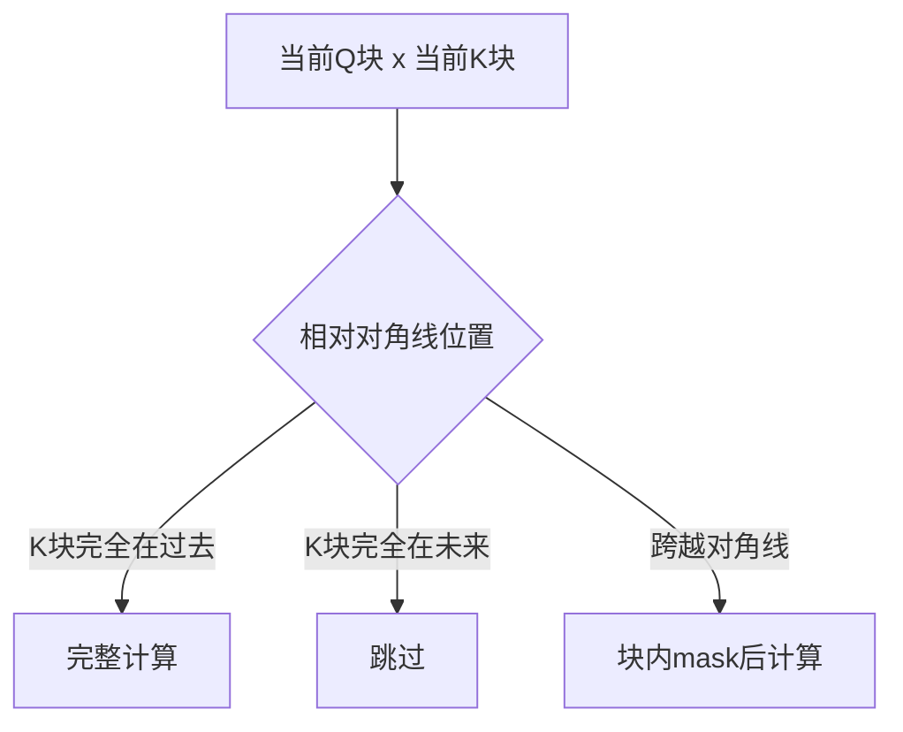
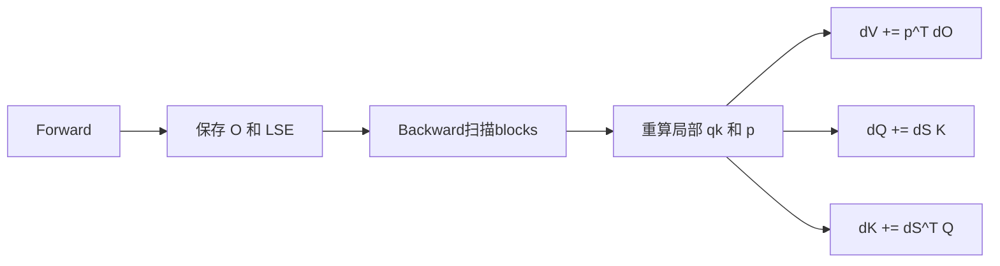
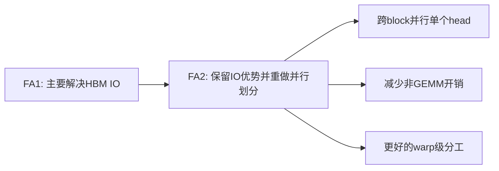
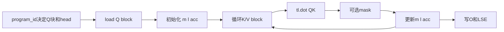
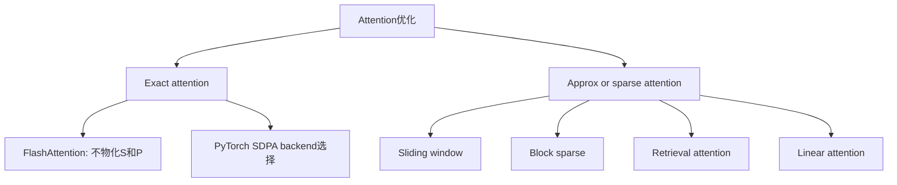
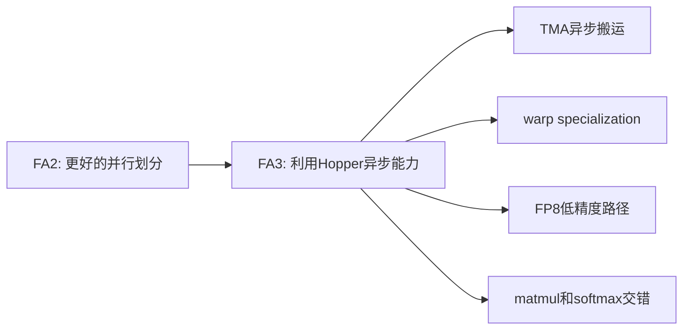

## 版本说明

本文写于 2026-05-13，主要参考 FlashAttention、FlashAttention-2、FlashAttention-3 论文，Dao-AILab 官方 `flash-attention` 仓库，以及 Triton 官方 fused attention tutorial。官方仓库当前已经列出 FlashAttention-4（CuTeDSL，面向 Hopper / Blackwell），但理解算法本身最关键的仍是 FlashAttention v1 的 IO-aware tiling 和 FlashAttention-2 的并行划分，因此正文以 FA1/FA2 和 Triton 写法为主，最后补充 FA3/FA4 的演进方向。

## 先说结论

FlashAttention 不是近似 attention。它计算的仍然是标准的 scaled dot-product attention：

$$
O = \mathrm{softmax}\left(\frac{QK^T}{\sqrt{d}} + M\right)V
$$

它快的核心原因不是把 $O(N^2)$ 的算术复杂度变成 $O(N)$，而是减少 GPU HBM 与片上 SRAM 之间的读写次数。普通 attention 会显式物化 $S=QK^T$ 和 $P=\mathrm{softmax}(S)$ 两个 $N \times N$ 矩阵；FlashAttention 用分块计算和 online softmax，让每个 query block 逐块扫描 key/value block，只保留每行 softmax 所需的最大值 $m$、归一化分母 $l$ 和输出累加器 $acc$。

最重要的三句话：

- 计算量仍然接近 $O(N^2d)$，但中间 attention matrix 不落 HBM。
- 显存占用从 attention score 级别的 $O(N^2)$ 降到输出和少量统计量级别的 $O(Nd)$。
- online softmax 是正确性的关键：它允许分块处理 logits，同时得到和一次性 softmax 相同的结果。

## 普通Attention慢在哪里

设 batch/head 维度先忽略，只看单个 head：

- $Q \in \mathbb{R}^{N \times d}$
- $K \in \mathbb{R}^{N \times d}$
- $V \in \mathbb{R}^{N \times d}$
- $S = QK^T \in \mathbb{R}^{N \times N}$
- $P = \mathrm{softmax}(S)$
- $O = PV$

普通实现通常是三步：

```python
scores = q @ k.transpose(-1, -2) * scale
scores = scores.masked_fill(mask, -float("inf"))
prob = torch.softmax(scores, dim=-1)
out = prob @ v
```

这段代码看起来很直接，但对长序列非常不友好。假设 $N=8192$，单个 head 的 `scores` 有 $8192^2 \approx 6710$ 万个元素。即使只用 FP16，一个矩阵也需要约 128MB。训练时还要保存 softmax 结果或额外统计量用于反向传播，多 head、多 batch 后中间显存很快成为瓶颈。

更关键的是 GPU 的计算单元很快，HBM 读写相对昂贵。普通 attention 的数据路径类似这样：



问题不只是 `scores` 大，而是 `scores/prob` 需要被写回 HBM 又读回来。attention 的中间矩阵是 $N^2$，当 $N$ 变长时，IO 成本会迅速盖过计算本身。

## GPU内存层级与IO-aware

FlashAttention 的论文标题里有一个关键词：IO-awareness。这里的 IO 不是磁盘 IO，而是 GPU 内存层级之间的数据搬运。

简化看：

- HBM：容量大，带宽高，但相对片上 SRAM 慢。
- SRAM / shared memory / registers：容量小，但访问快。
- Tensor Core：负责高吞吐矩阵乘。

FlashAttention 的目标是让大矩阵 $S$ 和 $P$ 不出现在 HBM 中。每次只把一个 $Q$ block、一个 $K$ block、一个 $V$ block 放到片上，计算当前小块对输出的贡献，然后把贡献合并到累加器。



这个设计遵循一个非常朴素的原则：既然最终只需要 $O$，中间的 $S$ 和 $P$ 就不应该作为完整矩阵写回全局内存。

## 分块Attention的基本结构

把序列维度分块：

- 每次处理 $B_M$ 行 query，记作 $Q_i$。
- 每次扫描 $B_N$ 行 key/value，记作 $K_j,V_j$。
- 对每个 $Q_i$，从左到右扫描全部 $K_j,V_j$ block。

普通分块 attention 的伪代码可以写成：

```text
for each query block Qi:
    acc = 0
    softmax_state = empty
    for each key/value block Kj, Vj:
        Sij = Qi @ Kj.T
        Pij = softmax_piece(Sij, softmax_state)
        acc = merge(acc, Pij @ Vj, softmax_state)
    Oi = finalize(acc)
```

难点在于 `softmax_piece`。softmax 的分母依赖整行所有 key：

$$
\mathrm{softmax}(x_i)=\frac{e^{x_i}}{\sum_j e^{x_j}}
$$

如果只看一个 block，我们不知道全局最大值和全局分母。FlashAttention 能正确分块的核心就是 online softmax。

## Online Softmax

先看一行 logits $x = [x_1,x_2,\dots,x_N]$。稳定 softmax 通常写成：

$$
m = \max_j x_j
$$

$$
l = \sum_j e^{x_j-m}
$$

$$
\mathrm{softmax}(x_j)=\frac{e^{x_j-m}}{l}
$$

如果把 logits 分成多个块，第一个块算出：

$$
m_1 = \max(x^{(1)}), \quad l_1 = \sum_{j \in block1} e^{x_j-m_1}
$$

第二个块算出局部最大值 $m_{block}$。合并时新的全局最大值：

$$
m_2 = \max(m_1, m_{block})
$$

旧分母要换到新的指数基准：

$$
l_2 = l_1 e^{m_1-m_2} + \sum_{j \in block2} e^{x_j-m_2}
$$

这就是 online softmax 的关键。最大值变了，旧的分母和旧的输出累加器都乘一个校正因子即可。

对 attention 输出也一样。输出不是只要 softmax 分母，还要：

$$
O = \sum_j \frac{e^{x_j-m}}{l} V_j
$$

FlashAttention 在循环中维护未除以最终分母的累加器：

$$
acc = \sum_j e^{x_j-m}V_j
$$

当从旧最大值 $m_{old}$ 更新到新最大值 $m_{new}$ 时：

$$
\alpha = e^{m_{old}-m_{new}}
$$

$$
acc_{new} = \alpha \cdot acc_{old} + P_{block}V_{block}
$$

$$
l_{new} = \alpha \cdot l_{old} + l_{block}
$$

最后：

$$
O = \frac{acc}{l}
$$

完整状态转移如下：



这里 `exp` 可以是自然底，也可以像 Triton tutorial 里为了效率使用 `exp2`，只要 scale 相应换成 $\log_2(e)$ 相关形式即可。

## 一个小数值例子

假设某一行 logits 分两块：

$$
x^{(1)}=[1,2], \quad x^{(2)}=[3,0]
$$

第一块：

$$
m_1=2
$$

$$
l_1=e^{1-2}+e^{2-2}=e^{-1}+1
$$

第二块局部最大值是 3，合并后：

$$
m_2=3
$$

旧分母校正：

$$
l_1 e^{m_1-m_2}=(e^{-1}+1)e^{-1}=e^{-2}+e^{-1}
$$

新块贡献：

$$
e^{3-3}+e^{0-3}=1+e^{-3}
$$

所以：

$$
l_2=e^{-2}+e^{-1}+1+e^{-3}
$$

这正好等于一次性对 $[1,2,3,0]$ 以最大值 3 做稳定 softmax 的分母。输出累加器也用同样的 $\alpha=e^{m_1-m_2}$ 校正，因此分块结果与完整 softmax 一致。

## FlashAttention Forward流程

单 head forward 的算法可以概括为：

```text
for each block row i:
    load Qi
    m = [-inf] * BM
    l = [0] * BM
    acc = zeros(BM, d)

    for each block col j:
        load Kj, Vj
        qk = Qi @ Kj.T * scale
        apply mask if causal or padding

        m_new = max(m, rowmax(qk))
        p = exp(qk - m_new)
        alpha = exp(m - m_new)

        acc = acc * alpha + p @ Vj
        l = l * alpha + rowsum(p)
        m = m_new

    Oi = acc / l
```

注意这里的 `p` 只是当前 block 的概率分子，不是完整 softmax 概率。它不会作为 $N \times N$ 矩阵写回 HBM。



## Causal Mask怎么处理

自回归模型中，第 $r$ 个 query 不能看到未来 token，所以需要 causal mask：

$$
S_{r,c} =
\begin{cases}
S_{r,c}, & c \le r \\
-\infty, & c > r
\end{cases}
$$

分块之后，mask 可以按 block 分三类：

- 完全在对角线左下方：整个 block 可见，不需要逐元素 mask。
- 完全在对角线右上方：整个 block 不可见，可以跳过。
- 跨过对角线：需要在 block 内做逐元素 mask。

这也是高性能实现常把 causal forward 拆成不同 stage 的原因：能跳过的跳过，能避免逐元素 mask 的路径就避免。



## Backward为什么更复杂

Forward 只需要输出 $O$，但 backward 要计算 $dQ,dK,dV$。普通 attention backward 依赖 softmax 概率 $P$：

$$
dV = P^T dO
$$

$$
dP = dO V^T
$$

$$
dS = P \odot (dP - \mathrm{rowsum}(dP \odot P))
$$

$$
dQ = dS K
$$

$$
dK = dS^T Q
$$

FlashAttention 不保存完整 $P$，所以 backward 需要重算局部 $QK^T$ 和局部 $P$。为了重算稳定，forward 通常保存每行的 softmax log-sum-exp 或等价统计量，比如：

$$
\mathrm{LSE} = m + \log(l)
$$

有了 LSE，backward 扫描每个 block 时可以重建：

$$
P_{ij} = e^{S_{ij}-\mathrm{LSE}_i}
$$

这样仍然不需要把完整 $P$ 存下来。代价是 backward 多做一部分重算，但省掉了大量显存读写，通常是值得的。



## FlashAttention-2改进了什么

FlashAttention v1 解决了 IO 问题，但还不是非常接近 GEMM 的效率。FlashAttention-2 主要改进的是工作划分：

- 减少非矩阵乘的 FLOPs。比如把一些 rescale、mask、边界处理从热路径中移开。
- 增加并行度。长序列或小 batch/head 场景下，单个 head 的计算也可以跨 thread block 切分，避免 occupancy 不足。
- 改进 warp 级工作分配，减少 shared memory 读写和 warp 间同步。

可以把 FA1 和 FA2 的差别理解成：



算法正确性还是来自 tiling + online softmax；FA2 的重点是让这个算法更像高效 GEMM kernel 那样喂满硬件。

## Triton代码视角

Triton 官方 fused attention tutorial 明确说明它实现的是 FlashAttention v2 algorithm。下面写一个简化版 forward kernel 骨架，重点看数据流，不追求可直接运行。

```python
@triton.jit
def flash_fwd_kernel(Q, K, V, O, LSE, stride_qh, stride_qm, stride_qd,
                     stride_kh, stride_kn, stride_kd,
                     stride_vh, stride_vn, stride_vd,
                     stride_oh, stride_om, stride_od,
                     n_ctx: tl.constexpr,
                     scale: tl.constexpr,
                     BLOCK_M: tl.constexpr,
                     BLOCK_N: tl.constexpr,
                     HEAD_DIM: tl.constexpr,
                     CAUSAL: tl.constexpr):
    pid_m = tl.program_id(0)       # query block id
    pid_h = tl.program_id(1)       # batch/head id, simplified

    offs_m = pid_m * BLOCK_M + tl.arange(0, BLOCK_M)
    offs_n = tl.arange(0, BLOCK_N)
    offs_d = tl.arange(0, HEAD_DIM)

    q = tl.load(Q + pid_h * stride_qh
                  + offs_m[:, None] * stride_qm
                  + offs_d[None, :] * stride_qd)

    m = tl.full((BLOCK_M,), -float("inf"), tl.float32)
    l = tl.zeros((BLOCK_M,), tl.float32)
    acc = tl.zeros((BLOCK_M, HEAD_DIM), tl.float32)

    for start_n in range(0, n_ctx, BLOCK_N):
        k = tl.load(K + pid_h * stride_kh
                      + (start_n + offs_n)[:, None] * stride_kn
                      + offs_d[None, :] * stride_kd)
        v = tl.load(V + pid_h * stride_vh
                      + (start_n + offs_n)[:, None] * stride_vn
                      + offs_d[None, :] * stride_vd)

        qk = tl.dot(q, tl.trans(k)) * scale

        if CAUSAL:
            mask = offs_m[:, None] >= (start_n + offs_n[None, :])
            qk = tl.where(mask, qk, -float("inf"))

        m_new = tl.maximum(m, tl.max(qk, axis=1))
        p = tl.exp(qk - m_new[:, None])
        alpha = tl.exp(m - m_new)

        acc = acc * alpha[:, None] + tl.dot(p.to(v.dtype), v)
        l = l * alpha + tl.sum(p, axis=1)
        m = m_new

    out = acc / l[:, None]
    tl.store(O + pid_h * stride_oh
               + offs_m[:, None] * stride_om
               + offs_d[None, :] * stride_od,
             out)
    tl.store(LSE + pid_h * n_ctx + offs_m, m + tl.log(l))
```

这段骨架对应前面的数学状态：

- `m`：每个 query 行当前见过的最大 logit。
- `l`：以当前 `m` 为基准的 softmax 分母。
- `acc`：以当前 `m` 为基准的输出分子。
- `alpha`：当最大值更新时，对旧状态做 rescale。
- `LSE`：保存给 backward 重建局部概率。

Triton 官方 tutorial 中的真实实现会更复杂，例如：

- 使用 `tl.range` 和编译期常量控制 loop unroll / pipeline。
- 对 causal attention 分 stage，减少无效 block 和 mask 开销。
- 使用 `exp2` 代替 `exp`，配合提前调整 scale。
- 对 Hopper/Blackwell、FP8、warp specialization 做不同路径。
- 使用 tensor descriptor 或 block pointer 组织更友好的内存访问。

理解真实代码时，不要先陷入所有硬件特化分支，而应该先抓住这条主线：



## 为什么Triton适合解释FlashAttention

FlashAttention 官方高性能 kernel 通常用 CUDA/CUTLASS/CuTe 等更底层的工具实现，性能更好，但阅读门槛也高。Triton 的好处是：

- 代码仍然接近 Python，适合理解分块逻辑。
- `tl.dot` 能直接映射到高效矩阵乘路径。
- program/block 的映射比 CUDA thread/warp 更抽象，容易看清算法。
- 能展示真实 kernel 里必须关心的 stride、mask、dtype、block size。

但 Triton 不是魔法。写得慢的 Triton kernel 也会很慢。FlashAttention 这类 kernel 的性能依赖：

- `BLOCK_M/BLOCK_N/HEAD_DIM` 是否适合硬件。
- register 压力是否过高。
- shared memory / SRAM 使用是否合理。
- mask 和边界处理是否污染热路径。
- pipeline 是否能重叠加载和计算。
- backward 是否减少原子加和重复写。

## IO和显存复杂度直觉

普通 attention forward 的中间存储至少包含：

$$
S \in \mathbb{R}^{N \times N}, \quad P \in \mathbb{R}^{N \times N}
$$

所以显存中间量是 $O(N^2)$。

FlashAttention 的 forward 中间状态主要是：

$$
m \in \mathbb{R}^{N}, \quad l \in \mathbb{R}^{N}, \quad O \in \mathbb{R}^{N \times d}
$$

训练时为了 backward 保存 LSE，也只是 $O(N)$。所以显存占用近似是 $O(Nd+N)$，不再保存 $O(N^2)$ 的 attention matrix。

注意这里说的是中间存储，不是算术复杂度。所有 query 和 key 的两两内积仍然要算，所以 dense attention 的计算量仍是：

$$
O(N^2d)
$$

这解释了一个常见误解：FlashAttention 让长上下文更可行，但它不等于稀疏 attention，也不会从根本上消除 $N^2$ 计算。如果序列长度继续增大到极端规模，仍然需要 sliding window、block sparse、retrieval attention、linear attention、KV cache 压缩等其他方法配合。

## 与稀疏Attention的区别

FlashAttention 是 exact attention kernel 优化；稀疏 attention 是改变 attention pattern。



FlashAttention 可以和某些稀疏 pattern 结合，但概念上不同：

- FlashAttention：结果和 dense attention 一样，优化 IO 和 kernel fusion。
- Sparse attention：减少某些 query-key 对的计算，可能改变模型输出。

## FlashAttention-3和硬件异步

FlashAttention-3 主要面向 Hopper GPU，例如 H100。FA3 的关注点不是重新发明 online softmax，而是利用新硬件能力：

- Tensor Core 和 TMA 的异步能力。
- warp specialization，把数据搬运和计算职责分给不同 warp。
- 交错 block-wise matmul 和 softmax，减少等待。
- FP8 路径中的 block quantization 和数值误差控制。

可以理解成：



到 FA3/FA4 这一层，算法解释已经不够了，还要进入具体架构：Hopper 的 TMA、WGMMA、barrier、producer-consumer pipeline、CuTe/CuTeDSL 的 layout 和 pipeline 表达。对大多数读者来说，先掌握 FA1/FA2 的 tiling 与 online softmax，再看 FA3/FA4 会顺很多。

## 实际使用建议

在 PyTorch 中，通常不需要自己手写 FlashAttention kernel。优先使用框架或库提供的路径：

- PyTorch `torch.nn.functional.scaled_dot_product_attention` 会根据硬件、dtype、mask 等条件选择后端。
- `flash-attn` 官方包适合需要直接调用高性能 attention 或集成到自定义模型时使用。
- xFormers、vLLM、TensorRT-LLM、SGLang 等推理/训练框架通常已经集成相应 kernel。
- 自己写 Triton kernel 更适合研究、教学或特殊 attention pattern。

需要关注的限制：

- head dimension 支持范围。官方仓库中 FA2 CUDA 路径支持到 head dim 256，但不同版本和 backward/dropout 条件会有差异。
- dtype。常见高性能路径是 FP16/BF16，FA3/FA4 进一步支持 FP8 路径。
- GPU 架构。FA2 覆盖 Ampere/Ada/Hopper；FA3 更偏 Hopper；FA4 面向 Hopper/Blackwell。
- mask 类型。标准 causal mask 最容易优化，任意复杂 mask 可能退化。
- dropout。训练时 dropout 会增加 forward/backward 状态和随机数处理。
- deterministic backward。确定性要求可能牺牲性能。

## 常见误区

**误区一：FlashAttention把复杂度从 $O(N^2)$ 变成 $O(N)$。**

不是。它主要降低 IO 和中间显存，不改变 dense attention 的两两计算本质。

**误区二：FlashAttention是近似算法。**

标准 FlashAttention 是 exact attention。只要 mask、scale、dtype 路径一致，数学上等价于普通 attention。数值上会因为计算顺序和精度有微小差别。

**误区三：只要用了FlashAttention，长上下文就没有瓶颈。**

不是。prefill 的 $N^2$ 计算还在；decode 阶段主要瓶颈又转向 KV cache 读写、batching、调度和 memory bandwidth。

**误区四：Triton版一定和官方CUDA版一样快。**

不一定。Triton 很适合表达 kernel，但极致性能仍依赖硬件特化、pipeline、layout、寄存器控制和编译器表现。

## 读代码时的检查清单

看一个 FlashAttention kernel，可以按这个顺序读：

1. `program_id` 如何映射到 batch/head/query block。
2. `BLOCK_M/BLOCK_N/HEAD_DIM` 是多少，是否有 autotune。
3. Q/K/V/O 的 stride 和 layout 是什么。
4. 内层循环如何扫描 K/V block。
5. causal/padding mask 在哪里做，是否分 stage。
6. 是否维护 `m/l/acc` 或等价的 LSE 状态。
7. 是否保存 LSE 给 backward。
8. backward 是否重算局部 logits/prob。
9. 是否使用 `exp2`、FP8、warp specialization、TMA 等硬件特化路径。
10. 输出写回是否 coalesced，边界处理是否只影响尾块。

如果代码里看不到 online softmax 状态，或者仍然把完整 $N \times N$ attention matrix 写到全局内存，那它就不是本文讨论的 FlashAttention 主路径。

## 小结

FlashAttention 的本质是：在不改变 attention 结果的前提下，把 softmax attention 改写成一个 IO-aware 的分块流式算法。它用 online softmax 解决分块 softmax 的正确性问题，用 kernel fusion 避免 $S$ 和 $P$ 落 HBM，用合理的 GPU 工作划分提高吞吐。

理解它时建议抓住四层：

- 数学层：stable softmax 可以用 $m,l$ 增量合并。
- 算法层：对每个 query block 扫描 K/V block，维护 `m/l/acc`。
- 系统层：避免 $N^2$ 中间矩阵读写 HBM。
- kernel层：用 Triton/CUDA/CuTe 把 block、warp、pipeline、mask 和 dtype 映射到硬件。

这也是为什么 FlashAttention 成为现代 LLM 训练和推理的基础组件：它没有牺牲模型质量，却把 attention 的真实瓶颈从“显存中间矩阵爆炸”推回到了更接近硬件上限的矩阵乘与内存流水线上。

## 参考

- FlashAttention: Fast and Memory-Efficient Exact Attention with IO-Awareness: https://arxiv.org/abs/2205.14135
- FlashAttention-2: Faster Attention with Better Parallelism and Work Partitioning: https://arxiv.org/abs/2307.08691
- FlashAttention-3: Fast and Accurate Attention with Asynchrony and Low-precision: https://arxiv.org/abs/2407.08608
- FlashAttention-4: Algorithm and Kernel Pipelining Co-Design for Asymmetric Hardware Scaling: https://arxiv.org/abs/2603.05451
- Dao-AILab flash-attention official repository: https://github.com/Dao-AILab/flash-attention
- Triton Fused Attention tutorial: https://triton-lang.org/main/getting-started/tutorials/06-fused-attention.html
