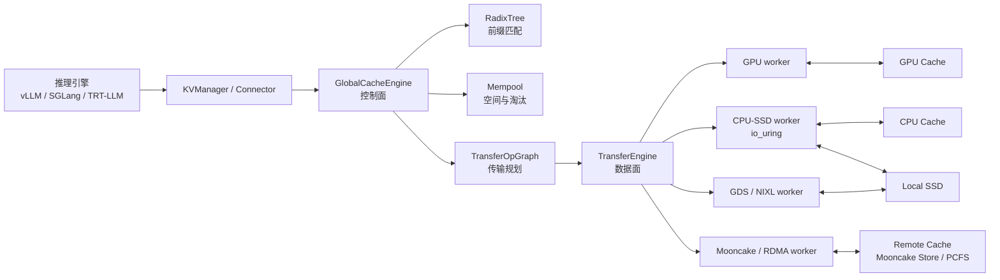
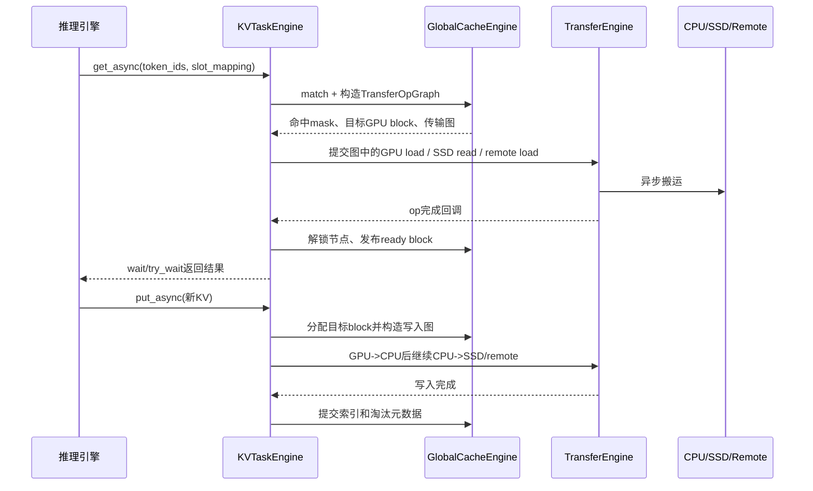
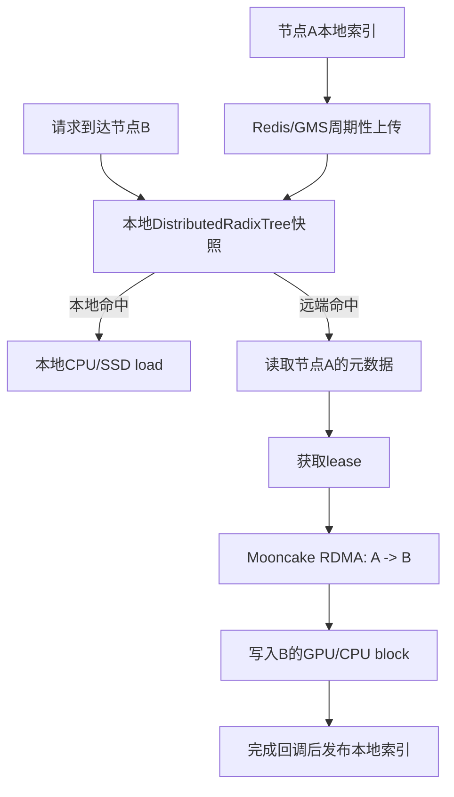

> 版本说明：本文以2026-09-04拉取的`taco-project/FlexKV`主分支提交`016c2903b93a1002e1c50eaf17fb9a537e970b34`为实现基线。FlexKV仍在快速演进，文中的功能和配置应以实际安装版本、GPU/驱动和推理框架版本为准。

## 1. 先说结论

FlexKV是一个面向大模型推理的KV Cache Store和多级缓存管理系统。它把原本只能放在GPU显存里的KV Cache按block组织起来，放入CPU内存、本地SSD以及可选的远端存储，并在请求到来时做前缀匹配、传输规划和异步搬运。

它解决的核心问题是：**GPU显存是最贵、最紧张的缓存层，但长上下文和多轮对话又要求尽量复用已经计算过的KV。** 没有外置缓存时，显存不足会导致KV被驱逐，下一次命中同一前缀只能重新prefill；有了FlexKV，热数据留在GPU，温数据落到CPU/SSD，跨节点数据还可以通过Mooncake和RDMA复用。

从源码结构看，FlexKV的关键分工是：

1. `StorageEngine`负责各层缓存的内存、文件和句柄。
2. `GlobalCacheEngine`负责RadixTree前缀索引、匹配结果、block分配、淘汰和传输图规划，是控制面。
3. `TransferEngine`和各种worker负责真正执行GPU、CPU、SSD、GDS及远端之间的数据搬运，是数据面。
4. `KVTaskEngine`把一次get/put/prefetch拆成可等待、可取消、可回调的异步任务，并在传输完成后提交索引变更。

一句话概括设计：**把“这个前缀有没有、应该搬哪些block”与“这些字节怎样搬”分开，再用异步任务把搬运时间和模型计算重叠起来。**

## 2. 为什么要把KV Cache外置

### 2.1 KV Cache是什么

对一个已经prefill了$T$个token的请求，解码第$T+1$个token时，注意力层需要读取前面token的$K$和$V$。这些中间结果就是KV Cache。粗略地说，单层缓存大小与下面几项成正比：

$$
\mathrm{bytes} \approx T \times L \times 2 \times H_{kv} \times D \times \mathrm{sizeof(dtype)}
$$

其中$L$是层数，$H_{kv}$是KV head数量，$D$是head size，2代表K和V。上下文越长、并发请求越多，KV就越容易先耗尽GPU显存。

### 2.2 重新计算的代价

假设系统把每个请求的前缀按16个token分成block。某个系统提示词加历史对话共有1600个token，对应100个block：

```text
第一次请求：GPU计算1600 token，产生100个KV block
请求结束：GPU空间紧张，100个block被驱逐
第二次相同前缀：没有外置缓存，只能再次计算1600 token
```

如果把这100个block异步放到CPU或SSD，第二次请求只需要加载命中的前缀，再计算新增token。外置缓存不能减少首次prefill的计算，也不能在缓存未命中时凭空加速；它减少的是**重复prefill和GPU显存占用**。

## 3. 总体架构：控制面、数据面和存储层



`StorageEngine`不决定请求该走哪一层。它根据`ModelConfig`和`CacheConfig`创建对应的`StorageHandle`，处理KV布局、allocator和文件/映射资源；`TransferEngine`拿这些handle执行操作；`GlobalCacheEngine`只需要知道逻辑block和每层的物理block如何对应。

这种边界很重要：替换SSD实现或增加一种远端后端，原则上不需要改RadixTree的前缀匹配；调整淘汰策略，也不应该把I/O细节塞进调度器。

## 4. block和KV布局：缓存能否复用的基础

### 4.1 block hash和前缀树

`SequenceMeta`把token序列按`tokens_per_block`分块，并为每个完整block生成hash。连续前缀的hash依次插入RadixTree，树节点保存：

- block hash及对应的物理block ID；
- 是否已经完成写入（`ready`）；
- lock引用，防止正在传输的节点被淘汰；
- `last_access_time`、`hit_count`和`grace_time`等淘汰信息；
- 分布式复用所需的租约元数据；
- 在DeepSeek-V4等场景下的SWA sidecar状态。

例如两个请求有如下token前缀：

```text
请求A: [h0, h1, h2, h3, h4]
请求B: [h0, h1, h2, h3, h9]

最长公共前缀 = h0..h3
可复用block数 = 4
```

`match_prefix`返回最长可用前缀，但“树中存在”不等于“数据已经可读”：正在put的节点会先以unready状态存在，传输完成回调确认后才发布为ready。这避免了请求读取半写入的block。

### 4.2 GPU、CPU和SSD布局必须兼容

`KVCacheLayout`显式记录层数、block数、每block token数、head维度、KV维度和布局类型。当前实现支持`LAYERFIRST`、`BLOCKFIRST`和vLLM新布局使用的`LAYERBLOCK`；CPU/SSD/remote之间要求采用兼容布局。

在普通单组KV中，一个block仍保持原始tensor形状。多组KV（例如不同层组、不同head size或不同dtype）则使用`BLOCKFIRST`的byte-flat布局，把每组在一个block中的字节区间拼接起来。这样做的代价是布局计算更复杂，但能覆盖异构KV group和压缩sidecar，而不要求所有组拥有相同shape。

布局不是一个可以忽略的配置细节：如果GPU侧stride与CPU/SSD侧解释不一致，传输可能成功而恢复出的KV数值错误。因此`StorageEngine`初始化时会校验layout，GDS和远端路径还必须满足各自的对齐约束。

## 5. get、put和prefetch的生命周期



### 5.1 get：先匹配，再搬运

`KVManager.get_async`接收token、GPU slot mapping和可选的token mask。`KVTaskEngine.create_get_task`调用`GlobalCacheEngine.get`，后者完成以下工作：

1. 根据token生成block hash并在每个缓存层匹配。
2. 选择最长可用前缀，区分GPU已有数据、CPU命中、SSD命中和remote命中。
3. 为缺失的GPU block分配临时空间，并生成从源层到目标层的`TransferOpGraph`。
4. 对被读取的RadixTree节点增加lock，避免传输期间被淘汰。
5. 在图完成回调中发布新层级的索引；失败或取消时释放临时block，而不是发布坏数据。

调用方可以在模型计算下一部分token的同时等待传输图推进。`prefetch_async`则把匹配和加载提前发起，等真正进入prefill时再通过任务ID同步，从而把“查索引+I/O”移到更早的时间窗口。

### 5.2 put：写入和后续计算重叠

put的目标是把本轮产生的KV保存到外置缓存。GPU到CPU的copy可以异步发起，主推理流继续处理后续计算；CPU到SSD或remote的写入由TransferEngine后台worker完成。

索引提交必须晚于数据写入完成。源码中的deferred insert和完成回调就是为了解决这个时序：先保留物理block和任务状态，所有消费者成功后再把节点标记为ready。如果写入失败，节点不会成为下一次请求的可复用前缀。

### 5.3 取消、失败和回收

传输不是单个同步memcpy，而是一个可能包含多个op、多个worker和多个层级的图。任务状态会经历`READY`、`RUNNING`、`COMPLETED`或失败/取消路径；图级失败需要等待已发出的子op排空，才能安全回收buffer和锁引用。

工程上要特别关注两个指标：

- **逻辑命中但传输失败**：说明索引存在，却没有产生可用数据，通常是远端、I/O或资源问题。
- **任务完成但索引未发布**：说明传输回调或一致性保护阻止了发布，不能简单把“完成数”当成“可复用block数”。

## 6. 淘汰策略：不是只有一个LRU

CPU、SSD和remote各自有容量上限。空间不足时，FlexKV先在索引和mempool层面选择节点，执行的是逻辑淘汰：移除可匹配的索引和物理block映射，真正的数据覆盖或文件复用由后续分配发生时完成。

当前配置支持：

| 策略 | 行为 | 适合场景 |
| --- | --- | --- |
| LRU | 驱逐最久未访问节点 | 通用前缀缓存 |
| LFU | 优先驱逐命中次数少的节点，同频率按LRU | 热点长期稳定 |
| SLRU | 命中达到阈值进入Protected段 | 抵抗一次性请求的扫描污染 |
| FIFO/FILO | 按创建时间驱逐最老/最新节点 | 有明确生命周期的批处理 |
| MRU | 驱逐最近访问节点 | 特殊循环扫描工作负载 |

LRU还可以配置`hit_reward_seconds`：每次命中给节点增加保护时间，让高频命中节点更难被驱逐。默认值为0时是标准LRU；这个参数只对LRU有意义，不能误以为会改变LFU或SLRU的排序。

主动淘汰由利用率阈值和`evict_ratio`控制。例如`evict_start_threshold=0.7`、`evict_ratio=0.05`表示缓存达到70%占用时开始主动回收，每次至少处理约5%的block，减少频繁小批量淘汰的管理开销。生产环境应结合命中率和I/O延迟调参，而不是只看缓存使用率。

## 7. 传输层使用的技术

### 7.1 多进程、多线程和传输图

`TransferEngine`使用独立的传输进程和worker，任务通过队列提交，完成事件再回传到任务管理器。不同worker覆盖GPU-CPU、CPU-SSD、CPU-remote、GDS以及Mooncake等路径；多卡、DP和PP拓扑会影响GPU handle分组和图的扇出方式。

这种异步设计把模型执行和I/O解耦，但也带来资源生命周期要求：CUDA IPC或fabric handle、pinned host buffer、文件描述符和远端注册区都必须在所有相关op完成后释放。关闭服务时要先停止新任务、等待完成队列，再释放映射，否则容易出现进程退出后仍有DMA访问。

### 7.2 io_uring：让SSD I/O批量排队

SSD路径在C++层封装了`io_uring`，支持普通`read/write`以及`readv/writev`。请求先填充submission queue entry，达到批量阈值后提交；完成侧批量读取completion queue entry并统计错误。

队列深度由`FLEXKV_IOURING_ENTRIES`控制，文档建议值为512。`io_uring`减少了每个I/O的系统调用往返，并允许多个block并发读写；但它不能突破SSD本身的带宽和队列能力，队列开太大还会增加内存和尾延迟。应同时观察提交数、完成数、队列满次数和CQE错误。

### 7.3 GDS和NIXL：减少CPU中转

GPU Direct Storage（GDS）允许支持的GPU、驱动和文件系统直接在GPU与SSD之间搬运数据，绕过传统的GPU→CPU→SSD路径。FlexKV通过`GDSTransferWorker`处理这条路径，并保留兼容模式以便GDS不可用时回退。

GDS不是打开一个环境变量就能获得收益：需要安装NVIDIA GDS组件、正确挂载文件系统、满足GPU/驱动支持矩阵，并选择一致的SSD布局。`FLEXKV_ENABLE_GDS=1`只表示启用构建/运行路径，部署前仍应使用GDS检查工具验证真实链路。

NIXL是另一种GPU-SSD传输后端，当前配置对它有额外限制，例如需要GDS，并且某些路径要求每节点有效TP大小为1。不能把GDS、NIXL和分布式KV共享随意同时打开；配置校验会拒绝互相冲突的组合。

### 7.4 HugePage和压缩

CPU缓存可以使用HugePage backing，减少页表开销并改善大块内存注册；Mooncake external memory registration还涉及mapping对齐和MR大小上限。FlexKV也集成了nvcomp相关压缩策略，在GPU-CPU或CPU-SSD之间用压缩换带宽，代价是额外的压缩/解压计算。

是否启用压缩要看链路：当PCIe或网络是瓶颈、GPU计算有空闲时可能受益；当CPU已经饱和或数据本身难压缩时，压缩反而增加延迟。应以端到端TTFT、每请求传输字节数和P99为准。

## 8. 分布式KV Cache复用：索引和数据分开

单机多级缓存只能复用本机数据。多节点serving时，请求可能被路由到没有本地KV的节点，因此FlexKV提供分布式索引和远端传输：

1. 每个节点维护全局索引的本地快照，查询优先在本地完成，避免每次prefix match都访问中心服务。
2. 本地索引周期性上传到Global Meta Store，官方示例使用Redis保存元数据。
3. 节点从GMS拉取其他节点的元数据，重建远端前缀索引，并记录数据所在节点和物理范围。
4. 读取远端block时使用租约机制，保证传输期间源数据不会被驱逐或失效。
5. 实际字节传输由Mooncake Transfer Engine通过RDMA完成，Redis只承担元数据，不承载大块KV数据。



这里的快照模型牺牲了一点元数据新鲜度，换取查询路径的低延迟。租约和ready状态则弥补了“快照可能落后”带来的一致性风险：快照告诉你可能存在，最终仍要由远端传输结果确认哪些block真的可用。

## 9. 与推理框架的集成

### 9.1 vLLM

从vLLM `v0.17.2`起，`FlexKVConnectorV1`已进入vLLM官方主干。当前推荐安装`vLLM >= 0.17.2`，通过KV transfer config启用，不再对vLLM源码打patch：

```bash
export FLEXKV_CPU_CACHE_GB=32

VLLM_USE_V1=1 python -m vllm.entrypoints.cli.main serve Qwen3/Qwen3-32B \
  --tensor-parallel-size 8 \
  --enable-prefix-caching \
  --kv-transfer-config \
  '{"kv_connector":"FlexKVConnectorV1","kv_role":"kv_both"}'
```

启用SSD时，可使用YAML配置CPU容量、SSD容量、目录和GDS开关：

```yaml
cpu_cache_gb: 32
ssd_cache_gb: 1024
ssd_cache_dir: /data0/flexkv_ssd/;/data1/flexkv_ssd/
enable_gds: false
```

旧版vLLM仍有对应patch，但应将FlexKV版本、vLLM版本、GPU布局和`tokens_per_block`一起验证。尤其是vLLM版本变化可能改变GPU KV tensor布局，不能只升级Python包而不重新检查layout。

### 9.2 SGLang和TensorRT-LLM

SGLang `v0.5.16`及更高版本已原生提供FlexKV backend，可通过`--enable-flexkv`启用CPU/SSD offloading；DeepSeek-V4等异构KV group还需要匹配的SGLang适配版本。TensorRT-LLM也有独立adapter，某些场景通过远端transfer进程避免和TensorRT-LLM的MPI初始化冲突。

框架集成的共同边界是：推理引擎拥有GPU KV tensor和请求调度，FlexKV负责外置缓存的match、load、store和完成通知。集成代码需要正确传递slot mapping、token mask、namespace以及DP/TP/PP拓扑；这些字段错位时，缓存可能“命中”但写入错误的GPU位置。

## 10. 监控和排障应该看什么

设置`FLEXKV_ENABLE_METRICS=1`后，FlexKV可以暴露Prometheus指标，覆盖Python和C++关键路径。建议至少关注：

- 各缓存层的命中、未命中和可复用block数；
- CPU/SSD/remote利用率和淘汰数量；
- get、put、prefetch的任务耗时和失败数；
- GPU-CPU、SSD、RDMA各路径的字节数、吞吐和P99；
- io_uring提交/完成/CQE错误及队列过载；
- 远端租约失败、索引刷新延迟和Mooncake传输结果。

常见误判包括：

1. **只看缓存命中率**：命中但传输慢，端到端TTFT仍可能变差。
2. **只看SSD带宽**：小block、随机I/O和队列不足会让平均带宽看起来很低，应该同时看I/O大小和队列深度。
3. **把远端索引命中当成数据命中**：分布式快照是可能性判断，lease和实际RDMA结果才决定可用前缀。
4. **用单请求基准代表线上收益**：FlexKV的价值通常来自重复前缀、多轮对话和显存压力；没有复用机会时，外置层只增加管理和传输成本。

## 11. 什么时候值得使用

适合考虑FlexKV的场景：

- 长上下文、多轮对话或大量共享system prompt，重复前缀明显；
- GPU显存限制了并发，但CPU内存或本地SSD有容量；
- 多节点serving需要跨实例复用KV；
- 已经有RDMA、GDS或高性能SSD基础设施，并且愿意维护这些依赖。

不适合直接启用的场景：

- 请求几乎没有重复前缀，缓存命中率低；
- 机器没有稳定的SSD/RDMA/GDS环境，只能走拥塞的CPU或网络路径；
- 对P99极其敏感，却没有为异步I/O、预取和失败重试留出调优空间；
- 推理框架版本、KV布局或TP/PP拓扑尚未与FlexKV adapter验证。

上线前应先做一组可解释的对照实验：固定模型和请求集，分别测无外置缓存、CPU缓存、CPU+SSD以及分布式远端缓存，记录TTFT、每秒输出token、GPU显存、缓存命中率、传输P50/P99和失败率。不要只用“平均延迟下降”作为结论。

## 12. 总结

FlexKV的价值不在于实现了一个更快的`memcpy`，而在于把KV Cache变成一个有索引、有生命周期、有多级存储和异步任务语义的系统组件：

- RadixTree回答“这个请求前缀能复用到哪里”；
- StorageEngine回答“每一层的block如何存放和解释”；
- TransferEngine回答“这些block如何并发搬运”；
- KVTaskEngine回答“任务何时完成、失败如何回收、索引何时发布”；
- Mooncake、RDMA、io_uring、GDS和HugePage分别优化不同的物理瓶颈。

因此，评估FlexKV时应该把它看成推理系统的一条缓存数据路径，而不是一个独立的存储插件。只有请求复用率、缓存容量、传输链路和框架布局同时匹配，它才会把“重新prefill”变成一次可控的异步load。

## 参考

- [FlexKV仓库（固定到本文版本）](https://github.com/taco-project/FlexKV/tree/016c2903b93a1002e1c50eaf17fb9a537e970b34)
- [FlexKV README](https://github.com/taco-project/FlexKV/blob/016c2903b93a1002e1c50eaf17fb9a537e970b34/README.md)
- [FlexKV中文README](https://github.com/taco-project/FlexKV/blob/016c2903b93a1002e1c50eaf17fb9a537e970b34/README_zh.md)
- [vLLM适配说明](https://github.com/taco-project/FlexKV/blob/016c2903b93a1002e1c50eaf17fb9a537e970b34/docs/vllm_adapter/README_zh.md)
- [分布式KV Cache复用说明](https://github.com/taco-project/FlexKV/blob/016c2903b93a1002e1c50eaf17fb9a537e970b34/docs/dist_reuse/README_zh.md)
- [配置参考](https://github.com/taco-project/FlexKV/blob/016c2903b93a1002e1c50eaf17fb9a537e970b34/docs/flexkv_config_reference/README_zh.md)
- [淘汰策略说明](https://github.com/taco-project/FlexKV/blob/016c2903b93a1002e1c50eaf17fb9a537e970b34/docs/eviction_policy/README_zh.md)
- [GDS使用指南](https://github.com/taco-project/FlexKV/blob/016c2903b93a1002e1c50eaf17fb9a537e970b34/docs/gds/README_zh.md)
- [StorageEngine源码](https://github.com/taco-project/FlexKV/blob/016c2903b93a1002e1c50eaf17fb9a537e970b34/flexkv/storage/storage_engine.py)
- [GlobalCacheEngine源码](https://github.com/taco-project/FlexKV/blob/016c2903b93a1002e1c50eaf17fb9a537e970b34/flexkv/cache/cache_engine.py)
- [TransferEngine源码](https://github.com/taco-project/FlexKV/blob/016c2903b93a1002e1c50eaf17fb9a537e970b34/flexkv/transfer/transfer_engine.py)
- [vLLM合入FlexKVConnectorV1的PR #34328](https://github.com/vllm-project/vllm/pull/34328)
- [SGLang原生FlexKV backend的PR #29701](https://github.com/sgl-project/sglang/pull/29701)
- [Mooncake Transfer Engine](https://github.com/kvcache-ai/Mooncake)
