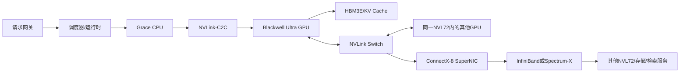
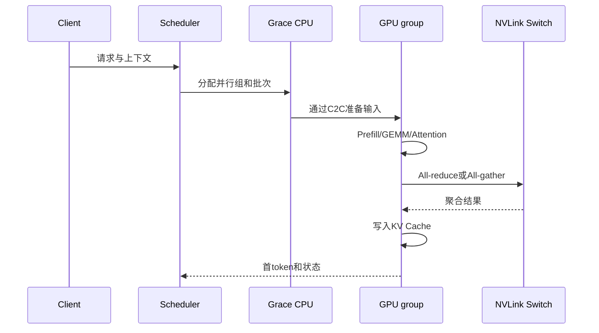
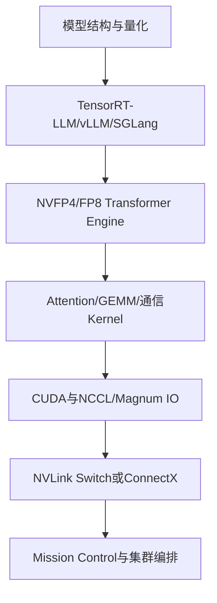

## 1. 先说结论

版本说明：本文按 2026-08-15 访问的 NVIDIA 官方 GB300 NVL72、Blackwell Architecture、NVLink、NVLink-C2C 和 ConnectX 资料整理。用户所说的“NV72”通常是 **NVL72** 的简称；NVIDIA 的正式产品名是 **GB300 NVL72**。如果这里的 NV72 指的是别的厂商内部型号，需要以具体型号为准。

先把最容易混淆的关系说清楚：

```text
Blackwell Ultra     一代 GPU 架构/产品家族
B300                Blackwell Ultra GPU 的具体 GPU 产品名（语境中常这样称呼）
GB300               Grace CPU + Blackwell Ultra GPU 的平台/系统代号
NVL72               把 72 个 GPU 放进一个 NVLink 域的机架级形态
GB300 NVL72         完整的液冷、网络、管理和软件交付平台
```

因此，**GB300 是“算什么”的问题，NVL72 是“如何把很多 GPU 组织成一台机器”的问题**。二者不是两个互相竞争的 GPU 型号，而是不同抽象层次的名称。

NVIDIA 当前公布的 GB300 NVL72 规格是：

| 项目 | 官方规格 | 应该怎样理解 |
| --- | ---: | --- |
| GPU | 72 个 Blackwell Ultra GPU | 计算和 HBM3E 的主体 |
| CPU | 36 个 Arm Grace CPU | 负责主机控制、数据准备、通信和部分预处理 |
| NVLink 带宽 | 130 TB/s | 72 GPU scale-up 域内的聚合通信带宽 |
| Fast memory | 37 TB | GPU HBM3E 与 CPU 内存的系统级快速内存口径 |
| GPU memory | 20 TB，最高 576 TB/s | 72 张 GPU 的 HBM3E 容量和带宽汇总 |
| CPU memory | 17 TB LPDDR5X，14 TB/s | 36 个 Grace CPU 的内存汇总 |
| CPU 核心 | 2,592 个 Arm Neoverse V2 核 | 36 个 CPU 的总核心数 |
| 网络 | 每个 GPU 800 Gb/s ConnectX-8 | 用于跨 NVL72 的 scale-out 网络 |
| 散热 | 全液冷 | 解决高密度 GPU、NVLink 和电源带来的热流 |

这组数字说明它的产品目标不是“把一张更快的卡插进服务器”，而是把 **推理时计算、GPU 间通信、内存容量、网络和运维** 一起设计成一个 AI 工厂积木。

## 2. 为什么会出现 GB300

大模型推理的瓶颈已经从单纯的矩阵乘法，逐渐变成了一个组合问题：

1. Test-time scaling 会为一个问题生成多个候选轨迹，再进行验证或投票，单位请求需要更多 token 和更多计算。
2. Reasoning 模型的输出更长，KV cache 生命周期更长，显存容量和带宽同时承压。
3. MoE 模型的专家路由带来大量 all-to-all，GPU 算力提升后，通信更容易成为 step time 的主导项。
4. Agent 工作流会频繁调用模型、工具和检索系统，用户更关心首 token 延迟、每用户 token/s 和尾延迟，而不是离线峰值 FLOPS。

传统的“单机 8 GPU + InfiniBand”仍然可以扩展，但跨节点的 collective 通信需要经过 NIC、交换机和网络协议栈。模型越大、并行组越大，通信比例越高，GPU 越容易在等待其他 GPU。

GB300 的思路是把最紧密的 GPU 通信留在一个硬件定义的 NVLink 域内，再用标准的 InfiniBand 或 Ethernet 向外扩展。这样可以把系统拆成两个明显不同的部分：

```text
scale-up：一个 NVL72 内部，追求低延迟、全互联和集体通信效率
scale-out：多个 NVL72 之间，追求可扩展、可路由、可运维和故障隔离
```

这也是为什么“GPU 的理论 FLOPS”不能单独代表 GB300 NVL72 的实际价值。对长上下文推理和 MoE 来说，通信、内存和调度经常比一个 GEMM kernel 的峰值更重要。

## 3. 从芯片、节点到机架：四个层次

### 3.1 Blackwell Ultra GPU：算力和内存层

Blackwell 架构的基础 GPU 采用两个 reticle-limited die，并通过 10 TB/s 芯片间互连组成一个统一 GPU。Blackwell Ultra 在此基础上加强了 Tensor Core 和内存系统，NVIDIA 官方给出的相对 Blackwell GPU 的指标是：

1. AI compute FLOPS 提升 1.5 倍。
2. attention-layer acceleration 提升 2 倍。
3. HBM3E 容量提升到上一代的 1.5 倍。

这里的“2 倍 attention”不等于所有 Transformer 推理都严格 2 倍。它是 Tensor Core/Transformer Engine 针对 attention 相关工作负载的架构级能力，最终吞吐仍受序列长度、batch、KV cache、量化、内存访问和软件实现影响。

Blackwell Ultra 的关键方向是 NVFP4。它使用微缩放（microscaling）控制量化误差，让权重或激活可以用更低位宽参与计算。低精度的价值不是把 FP16 简单替换成 4 bit，而是要同时满足：

```text
量化格式       -> 可接受的数值误差
Transformer Engine -> 缩放、累加和混合精度策略
TensorRT-LLM/vLLM -> kernel、调度和模型支持
验证集          -> 质量回归和异常输入覆盖
```

如果软件没有使用 NVFP4 的 kernel，或者模型的误差预算不允许更激进的量化，那么 GPU 上“支持 FP4”并不会自动转化成线上收益。

### 3.2 Grace CPU：主机和数据通路层

GB300 NVL72 不是 72 张孤立的加速卡。官方配置的 36 个 Grace CPU 负责主机侧控制、数据准备、通信协同和系统服务。Grace CPU 与 GPU 之间通过 NVLink-C2C 这类高带宽、缓存一致性的 chip-to-chip 互连连接，目标是减少 PCIe 路径和额外内存拷贝带来的开销。

一个实际请求的大致数据路径可以画成：



这张图的重点是：**C2C、NVLink 和数据中心网络是三种不同的连接**。C2C 解决 CPU-GPU 芯片内/板级协同；NVLink 解决机架内 GPU scale-up；ConnectX 和外部网络解决机架间 scale-out。把它们都叫“带宽”会掩盖延迟、协议、拓扑和故障域的差异。

### 3.3 GPU 节点：每个 CPU 带两个 GPU 的系统级组合

官方整机规格给出 72 GPU 和 36 Grace CPU，因此系统级上是每个 Grace CPU 对应两个 GPU 的组合。不同 OEM 的主板、线缆、供电和服务处理可能不同，不能仅凭这个比例画出完全准确的板级拓扑；但对软件和容量规划而言，可以把它看成 36 个 CPU-GPU 计算节点，再由 NVLink Switch 连接成一个 72 GPU 域。

这个组合比“CPU 服务器外挂 GPU”更适合以下场景：

1. GPU 需要频繁访问 CPU 准备好的输入或元数据。
2. 推理服务要在 GPU 计算与 CPU 侧 tokenizer、检索、路由之间快速切换。
3. 运行时需要在节点内完成进程编排、健康检查和故障隔离。

### 3.4 NVL72 机架：把 72 张 GPU 组织成一个 scale-up 域

NVL72 的 “72” 指的是一个 NVLink 域里有 72 个 GPU，而不是显存只有 72 GB，也不是单张 GPU 的型号。第五代 NVLink Switch 为这个域提供总计 130 TB/s 的 GPU 通信带宽；NVIDIA 的架构页面还给出单 GPU 最高 1.8 TB/s 互连带宽的口径。

可以把 NVL72 想成一台“拆成多块板卡的巨大加速器”：模型并行组可以跨节点放置，但在域内仍然通过 NVLink 进行高带宽通信。它对 tensor parallel、pipeline parallel、expert parallel 和大规模 all-reduce 都更友好。

## 4. 130 TB/s 到底意味着什么

130 TB/s 是 NVL72 交换域的聚合带宽，不是某个请求能独占的 130 TB/s，也不是外部网络的吞吐。为了避免误读，需要区分三种数字：

| 数字 | 层次 | 用途 |
| ---: | --- | --- |
| 1.8 TB/s | 单 GPU 的第五代 NVLink 互连带宽口径 | GPU 与 NVLink Switch 的 scale-up 通路 |
| 130 TB/s | 72 GPU NVLink 域聚合带宽 | 域内 all-reduce、all-gather、all-to-all 等 |
| 800 Gb/s | 每 GPU 的 ConnectX-8 网络连接 | 跨 NVL72 的 scale-out、存储和服务访问 |

一个简单的容量估算是：如果一次通信需要在 72 个 GPU 之间交换 1 TB 数据，理想下界约为：

$$
T_{ideal} = \frac{1\ \mathrm{TB}}{130\ \mathrm{TB/s}} \approx 7.7\ \mu s
$$

但真实 collective 还要付出拓扑调度、协议、同步、数据分片、kernel 启动、拥塞和不均衡的成本。因此这个计算只能帮助建立数量级直觉，不能用来承诺端到端延迟。

对于 MoE all-to-all，关键指标也不只是峰值带宽，还包括：

1. 每个 expert 的 token 分布是否均衡。
2. 是否出现 incast 或热点链路。
3. 交换机 buffer 和流控是否足够。
4. 通信与 GEMM 是否能够重叠。
5. 某个慢 rank 是否拖住整个 collective。

## 5. GB300 NVL72 的内存账本

### 5.1 20 TB HBM3E 能装下什么

官方规格给出 20 TB GPU memory。平均到 72 张 GPU：

$$
\frac{20\ \mathrm{TB}}{72} \approx 277.8\ \mathrm{GB/GPU}
$$

这个结果与 Blackwell Ultra GPU 约 288 GB 级 HBM3E 的产品语境一致；官方整机页面采用的是总量口径，因此部署时仍应以具体 SKU、可用容量和保留区为准。

对推理而言，HBM 不只存权重：

```text
权重 + 量化元数据
KV cache
激活和临时workspace
通信buffer
CUDA graph、运行时和安全余量
```

例如一个 500B 参数模型即使使用 4 bit 权重，裸权重也接近 250 GB；加入 scale、对齐、KV cache 和运行时空间后，仍然需要跨多张 GPU 切分。NVL72 的价值在于这些分片之间有高带宽、低延迟的域内通信，而不是“20 TB 可以无条件装下任何 20 TB 模型”。

### 5.2 37 TB fast memory 不等于 37 TB HBM

官方同时列出 37 TB fast memory、20 TB GPU memory 和 17 TB CPU LPDDR5X。阅读规格时不要把 37 TB 当成 GPU HBM：

```text
20 TB GPU HBM3E     -> GPU kernel 直接使用的高带宽显存
17 TB CPU LPDDR5X   -> Grace CPU 侧内存
37 TB fast memory   -> 两者的系统级快速内存总和
```

CPU 内存可以用于权重 staging、数据预取、分页或分层缓存，但访问路径、带宽和延迟与 HBM 不同。把冷数据放在 CPU 内存可能节省 HBM，却会把问题转化为 C2C、预取和调度问题。

### 5.3 KV cache 的容量例子

假设某模型每 token、每层的 K/V 状态共占用 256 KB，保留 1,000,000 个 token 的理论 KV 容量就是：

$$
1{,}000{,}000 \times 256\ \mathrm{KB} \approx 256\ \mathrm{GB}
$$

这还没有计算权重、激活、碎片、prefix cache 和复制。实际服务通常会采用 tensor parallel、KV 量化、分页管理、prefix sharing 或上下文分层存储。GB300 的大 HBM 容量让更长上下文和更大的并发 batch 更容易实现，但并不替代 KV cache 管理策略。

## 6. 算力规格怎样读：稀疏与稠密不能混用

NVIDIA GB300 NVL72 页面列出以下 Tensor Core 汇总值：

| 精度 | 官方汇总口径 |
| --- | ---: |
| FP4 Tensor Core | 1,440 PFLOPS（稀疏） |
| FP8/FP6 Tensor Core | 720 PFLOPS |
| INT8 Tensor Core | 24 POPS |
| FP16/BF16 Tensor Core | 360 PFLOPS |
| TF32 Tensor Core | 180 PFLOPS |
| FP32 | 6 PFLOPS |
| FP64 / FP64 Tensor Core | 100 TFLOPS |

官方脚注说明 Tensor Core 指标默认包含稀疏性，页面部分行同时给出稠密口径。因此比较 GB300、GB200、H100 或其他加速器时，必须同时记录：

1. precision：FP4、FP8、BF16 还是 FP16。
2. sparse/dense：是否启用了 2:4 或其他结构化稀疏。
3. workload：GEMM、attention、decode、prefill 还是完整服务。
4. batch 和序列长度：尤其要区分 ISL、OSL 和并发数。
5. 是否计入通信、tokenizer、采样和数据搬运。

只拿一个 PFLOPS 数字做横向结论，通常会得到错误的采购判断。

## 7. 一次推理请求在 NVL72 中怎样流动

### 7.1 Prefill

Prefill 把输入上下文批量送入模型，主要工作是大矩阵乘、attention 和 KV cache 写入。此时更容易受算力、HBM 带宽和跨 GPU 的张量并行通信影响。



### 7.2 Decode

Decode 每次通常只处理一个或少量新 token，但需要读取历史 KV。随着上下文变长，decode 常从 compute-bound 变成 memory-bandwidth-bound。此时更重要的是：

1. HBM 容量是否能容纳 KV cache。
2. HBM 带宽能否支撑高并发读取。
3. batch 是否足以摊薄 kernel 和通信开销。
4. scheduler 能否把不同长度请求合并而不牺牲尾延迟。

### 7.3 Test-time scaling 和 disaggregation

NVIDIA 官方性能页面用 DeepSeek-R1 的 ISL=32K、OSL=8K 场景展示 GB300 NVL72，并注明使用 FP4 Dynamo disaggregation。这个注释非常重要：它不是“裸硬件跑一个模型”的结果，而是 GPU、低精度、推理运行时和 prefill/decode 分离共同作用的系统结果。

可以把 disaggregation 理解为：

```text
Prefill集群：擅长吞吐，快速建立长上下文KV
Decode集群：擅长低延迟，反复读取KV并生成token
中间层：通过高速网络传递请求状态和KV元数据
```

在这种模式下，NVL72 内部的 NVLink 负责紧密的模型并行，NVL72 之间的 ConnectX 网络负责服务池之间的 scale-out。调度器必须同时考虑 KV 所在位置、网络拥塞和用户尾延迟。

## 8. 网络：800 Gb/s 不是 NVLink 的替代品

GB300 NVL72 每个 GPU 配置 800 Gb/s 的 ConnectX-8 网络连接，可以选择 NVIDIA Quantum-X800 InfiniBand 或 Spectrum-X Ethernet。这个网络主要用于：

1. 多个 NVL72 之间的模型并行或数据并行。
2. 存储、检索、数据加载和检查点。
3. Prefill/Decode disaggregation 的状态交换。
4. 监控、管理和故障切换。

它和 130 TB/s NVLink 域的职责不同：

| 维度 | NVLink/NVLink Switch | ConnectX-8 + IB/Ethernet |
| --- | --- | --- |
| 作用 | 机架内 scale-up | 机架间 scale-out |
| 连接对象 | 72 GPU 域 | NVL72、存储和服务 |
| 典型通信 | TP、EP、all-reduce、all-gather | 跨机架 collective、KV 传输、checkpoint |
| 优化重点 | 低延迟、全互联、SHARP | 路由、拥塞控制、RDMA、故障域 |
| 设计边界 | 一个 NVL72 | 多机架集群和数据中心网络 |

如果模型并行组被错误地放到跨 NVL72 的链路上，NVLink 的优势会被外部网络延迟稀释；如果所有请求都依赖外部存储，HBM 的优势又会被数据准备和 I/O 隐藏。部署时要先画清并行组和数据路径，再决定 GPU、机架和网络拓扑。

## 9. 软件栈：硬件峰值要经过哪些层

GB300 NVL72 的可用性能大致经过以下链路：



每一层都可能成为瓶颈：

1. 模型层：算子不支持 NVFP4，或量化造成质量下降。
2. 运行时层：batching、paged KV、prefix cache 和 speculative decoding 没有针对长上下文调优。
3. Kernel 层：attention 融合不足，或 decode 小 batch 无法填满 Tensor Core。
4. 通信层：NCCL 拓扑识别错误、collective 不重叠或出现慢 rank。
5. 集群层：GPU 健康、液冷、电力和网络故障没有统一编排。

Mission Control 的定位就是把 72-GPU NVLink 域、工作负载、设施和韧性管理放在同一个运维面上。它不能替代应用层 profiling，但可以减少“硬件健康、调度和基础设施状态各自为政”的问题。

## 10. GB300 NVL72 与 GB200 NVL72 的关系

两者都采用 72 GPU、36 Grace CPU、第五代 NVLink 和液冷机架级设计，所以容易被简单地看成“换代改名”。更准确的区别是：

| 维度 | GB200 NVL72 | GB300 NVL72 |
| --- | --- | --- |
| GPU 家族 | Blackwell GPU | Blackwell Ultra GPU |
| 产品重点 | 大规模训练、实时万亿参数推理 | Test-time scaling、AI reasoning、agentic inference |
| GPU HBM3E | 官方 GB200 页面给出 13.4 TB 汇总 | 官方 GB300 页面给出 20 TB 汇总 |
| attention/AI FLOPS | Blackwell 基线 | 相对 Blackwell 约 2x attention、1.5x AI FLOPS |
| 系统形态 | 72 GPU NVLink 域、全液冷 | 72 GPU NVLink 域、全液冷 |
| 软件关键字 | FP4、Transformer Engine、NCCL | NVFP4、Dynamo disaggregation、reasoning serving |

这张表的数字来自两代产品各自的官方网页，不能把不同页面的 sparse/dense 或测试条件直接拼成一张统一 benchmark。GB300 的真实优势更可能出现在长上下文、推理时扩展、低精度和高并发服务，而不是所有训练任务都同比例加速。

## 11. NVIDIA 宣传的 50x 应该怎样解读

GB300 NVL72 官方页面给出相对 Hopper 的 10x user responsiveness、5x TPS/MW throughput，并将二者组合为最高 50x AI factory output。页面同时注明 DeepSeek-R1 的 ISL/OSL、FP4 Dynamo disaggregation、H100 FP8 in-flight batching 和“projected performance subject to change”。

因此这组数字应当解读为 **特定软硬件系统配置下的 AI 工厂输出指标**，而不是单个 GPU 的通用速度倍率。做采购或容量规划时，至少要复现实验中的：

```text
模型版本和量化格式
输入/输出长度
并发请求数和调度策略
prefill/decode 是否分离
首token延迟、端到端延迟和tokens/s定义
功耗测量边界
是否使用稀疏Tensor Core
```

如果只拿“50x”去和一个 H100 的离线 FP16 tokens/s 对比，结论没有可比性。更可靠的指标是单位功耗、单位机架、单位成本下的有效吞吐，以及 P95/P99 尾延迟。

## 12. 适合什么，不适合什么

### 适合

1. 长上下文、长输出和 reasoning token 很多的在线推理。
2. 需要跨多 GPU 做 tensor/expert parallel 的大模型。
3. MoE all-to-all 比例高、单机 8 GPU 已经出现通信瓶颈的服务。
4. 需要 prefill/decode 分离和高并发 agent 工作流的 AI 工厂。
5. 可以承担液冷、电力、网络和集群运维复杂度的云或大型企业。

### 不一定适合

1. 小模型、低并发、上下文很短的服务，单卡或小型服务器更简单。
2. 主要运行传统 HPC 或通用 CPU 任务，无法利用 NVLink 域的场景。
3. 机房没有液冷、电力和高带宽网络配套的环境。
4. 模型和推理栈还没有验证 FP4/NVFP4 精度与 kernel 支持的团队。
5. 只需要偶发离线 batch，且可以接受较长完成时间的任务。

## 13. 部署和压测清单

如果要评估真实的 GB300 NVL72，而不是阅读规格表，可以按下面的顺序做：

1. 先固定模型、量化格式、ISL/OSL、并发和质量验收集。
2. 分别测 prefill、decode、混合流量和长上下文，记录 TTFT、TPOT、E2E latency、吞吐和 P99。
3. 做 1、2、8、36、72 GPU 的强扩展和弱扩展测试，观察通信占比。
4. 对 TP、PP、EP 的不同切分方式做拓扑感知调度，确认并行组是否留在 NVL72 内。
5. 用 NCCL、NVLink 和 ConnectX counters 检查链路利用率、重传、拥塞和慢 rank。
6. 对 HBM、CPU 内存、KV cache、workspace 和通信 buffer 做完整容量账本。
7. 注入 GPU、NVLink、NIC、交换机和液冷告警，验证降级、重试、迁移和数据一致性。
8. 把性能换算成 tokens/s/W、tokens/s/机架、tokens/s/美元，而不是只看 PFLOPS。

一个可复用的报告表格是：

| 场景 | 并行方式 | ISL/OSL | 并发 | TTFT | TPOT | P99 | tokens/s/W |
| --- | --- | ---: | ---: | ---: | ---: | ---: | ---: |
| 短上下文 decode | TP | 4K/512 |  |  |  |  |  |
| 长上下文 prefill | TP/PP | 32K/1K |  |  |  |  |  |
| MoE serving | EP/TP | 8K/2K |  |  |  |  |  |
| reasoning + disaggregation | TP/EP | 32K/8K |  |  |  |  |  |

## 14. 最后总结

GB300 的关键升级不应只被概括成“更强的 Blackwell”。它针对的是一个已经变化的工作负载：模型会花更多 token 思考，服务要承受更长上下文和更高并发，MoE 和 agent 工作流让通信与调度越来越重要。

NVL72 的关键也不只是“72 张卡塞进一架机柜”。它通过第五代 NVLink Switch 把 72 GPU 组成一个 130 TB/s 的 scale-up 域，再通过 ConnectX-8 和 InfiniBand/Ethernet 向外扩展；液冷、电力、内存、软件和运维是这个产品的一部分，而不是机架外的附属选项。

可以用三句话记住它：

1. **GB300 解决单个 Blackwell Ultra 平台如何为 reasoning 提供更多算力、显存和 CPU 协同。**
2. **NVL72 解决 72 个 GPU 如何在一个低延迟 NVLink 域内协同。**
3. **真正的线上收益取决于模型量化、KV cache、并行策略、通信拓扑、调度和功耗，而不是规格表上的单个峰值数字。**

## 参考

1. [NVIDIA GB300 NVL72 官方产品页](https://www.nvidia.com/en-us/data-center/gb300-nvl72.md)
2. [NVIDIA Blackwell Architecture 官方介绍](https://www.nvidia.com/en-us/data-center/technologies/blackwell-architecture.md)
3. [NVIDIA NVLink and NVLink Switch 官方介绍](https://www.nvidia.com/en-us/data-center/nvlink.md)
4. [NVIDIA NVLink-C2C 官方介绍](https://www.nvidia.com/en-us/data-center/nvlink-c2c.md)
5. [NVIDIA ConnectX-8 SuperNIC Datasheet](https://resources.nvidia.com/en-us-accelerated-networking-resource-library/connectx-datasheet-c)
6. [NVIDIA GB200 NVL72 官方产品页](https://www.nvidia.com/en-us/data-center/gb200-nvl72.md)
7. [NVIDIA Blackwell Ultra Datasheet 入口](https://resources.nvidia.com/en-us-blackwell-architecture/blackwell-ultra-datasheet)
