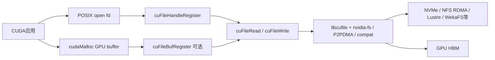
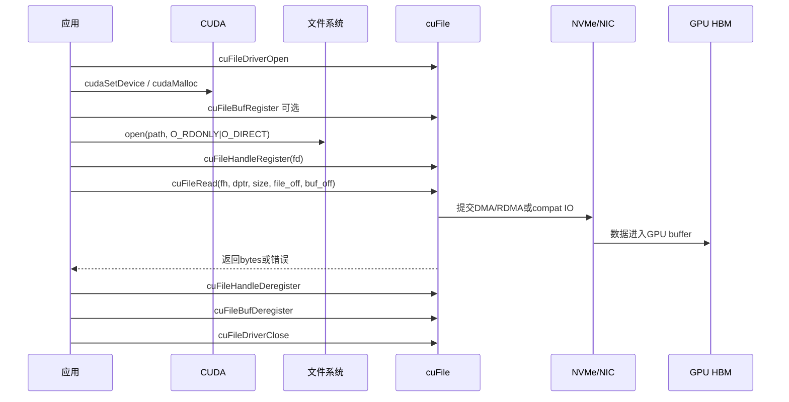
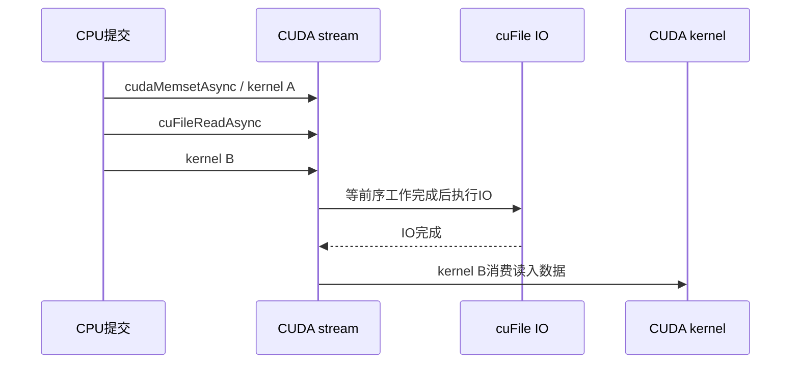
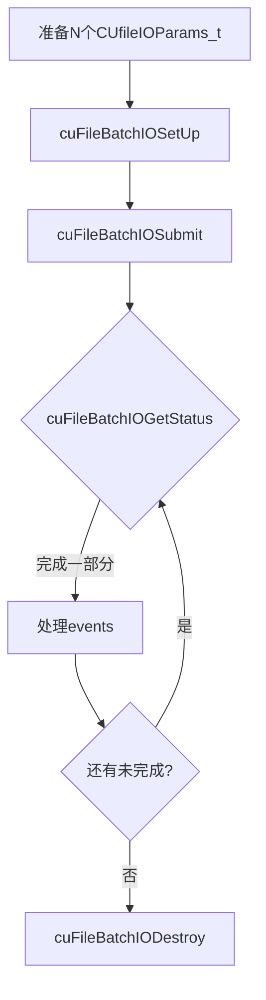

## 1. 先说结论

版本说明：本文参考的是2026-05-20访问的NVIDIA GPUDirect Storage文档。NVIDIA文档页当前有一个需要注意的版本差异：Release Notes页面显示GDS `v1.17`，而API Reference、Configuration Guide、Best Practices Guide、Overview Guide等页面显示`v1.16`。本文会把相对稳定的机制、API语义、配置参数和官方最佳实践讲清楚；生产环境仍要以本机CUDA Toolkit、`libcufile.so`、`nvidia-fs.ko`、内核、文件系统和存储厂商文档为准。

GPUDirect Storage，简称GDS，解决的是一个很具体的问题：

```text
GPU程序要把数据读入/写出存储系统，
传统路径经常绕过CPU内存和CPU拷贝，
GDS希望让存储侧DMA引擎直接读写GPU显存。
```

传统读取路径常见是：

```text
NVMe / NIC / Storage Controller
  -> CPU DRAM bounce buffer
  -> GPU HBM
```

GDS目标路径是：

```text
NVMe / NIC / Storage Controller
  -> GPU HBM
```

但这句话很容易被误解。GDS不是“所有文件IO都会自动直通GPU”，也不是“用了cuFile就一定零拷贝”。它需要硬件拓扑、驱动、文件系统、打开方式、对齐、buffer注册、配置参数共同满足条件。条件不满足时，cuFile可能失败，也可能在兼容模式下退回POSIX路径和bounce buffer。

最实用的结论：

1. `cuFileHandleRegister`是必须的，它把普通`fd`转换为cuFile可用的`CUfileHandle_t`，同时检查这个文件和挂载点是否适合GDS。
2. `cuFileBufRegister`是可选但很关键的性能工具。复用的4KB对齐GPU buffer应该提前注册；一次性大buffer、非对齐IO、小BAR空间压力场景不一定应该注册。
3. `cuFileRead/cuFileWrite`是同步接口，简单但并发需要靠线程或上层IO pipeline。
4. `cuFileReadAsync/cuFileWriteAsync`把IO放入CUDA stream，适合和kernel、memcpy等CUDA工作按stream顺序编排。
5. Batch API适合多个小的、非连续offset的IO，能够用一次提交减少CPU成本，再用`cuFileBatchIOGetStatus`轮询完成。
6. `/etc/cufile.json`不是装饰配置，它决定日志、兼容模式、poll mode、最大IO切块、bounce buffer、pinned memory、RDMA路由、P2PDMA、文件系统特定fallback等行为。
7. 官方最佳实践的核心不是“永远注册buffer”，而是“把注册成本从热路径移出去，并避免注册无法直接使用的buffer”。
8. 评估GDS性能时必须确认实际路径：`gdscheck -p`、`cufile.log`、`/proc/driver/nvidia-fs/stats`、`gds_stats`、`nvidia-smi dmon`、`iostat`要一起看。

## 2. GDS到底在系统里做什么

从应用角度看，GDS暴露的是`cuFile` API。应用仍然用POSIX `open`打开文件，但后续不再用`read`把数据读进CPU内存，而是用`cuFileRead`把文件内容读到GPU buffer。

一个最小概念图如下：



这里有三层容易混淆：

| 层次 | 作用 | 例子 |
|---|---|---|
| 应用API | 描述“哪个文件offset到哪个buffer offset” | `cuFileRead(fh, dptr, size, file_off, buf_off)` |
| cuFile库 | 检查路径、管理注册、切分IO、选择GDS/compat路径 | `libcufile.so`、`/etc/cufile.json` |
| 内核/设备/文件系统 | 真正执行DMA/RDMA/POSIX IO | `nvidia-fs.ko`、NVMe、NIC、Lustre、NFS RDMA |

GDS的价值是减少CPU数据面参与，而不是完全不要CPU。CPU仍然负责控制面：打开文件、注册handle、提交IO、维护映射、处理完成状态。真正被优化的是数据面：大块数据不再必须经过CPU DRAM做中转。

## 3. 传统路径、GDS路径和兼容路径

普通GPU程序从文件读数据，通常需要这样做：

```text
pread(fd, host_buf, size, offset)
cudaMemcpy(device_buf, host_buf, size, cudaMemcpyHostToDevice)
```

这会带来两个问题：

1. 文件数据先进入CPU内存，再进GPU显存，多一次数据移动。
2. CPU、内存带宽、NUMA、缓存污染和线程调度都可能成为瓶颈。

GDS希望变成：

```text
cuFileRead(fh, device_buf, size, file_offset, device_offset)
```

底层如果真的走GDS direct path，数据由存储侧DMA/RDMA能力进入GPU显存。对于本地NVMe，DMA引擎靠近NVMe；对于远端RDMA文件系统，NIC参与数据搬运。

但是还有第三种路径：compatibility mode。

```text
cuFileRead API
  -> libcufile判断GDS路径不适合
  -> POSIX pread / pwrite
  -> CPU bounce buffer
  -> GPU buffer
```

兼容模式的意义是让应用仍然可以用cuFile API跑起来，尤其在文件系统或mount还没支持GDS时便于功能测试。但它不是GDS性能路径。调性能时如果没确认实际模式，很容易得到“用了cuFile但和普通IO差不多”的结果。

## 4. GDS成立的关键条件

GDS性能依赖四类条件。

第一，硬件拓扑。GPU和NVMe/NIC最好在同一个PCIe switch或至少路径足够近。如果IO设备和GPU跨CPU socket、跨root complex，流量可能绕回CPU root port，带宽和延迟都会受影响。

第二，系统设置。x86_64裸机场景下，官方最佳实践通常建议禁用PCIe ACS和IOMMU，因为它们会让P2P流量绕过不理想的路径。Grace Hopper平台有例外，不能简单照搬x86建议。

第三，文件系统和驱动。GDS需要底层文件系统或块设备支持对应路径。常见检查入口是：

```bash
/usr/local/cuda/gds/tools/gdscheck.py -p
lsmod | rg 'nvidia_fs|nvidia_peermem'
cat /proc/driver/nvidia-fs/stats
```

第四，应用IO模式。GDS喜欢大块、对齐、可预注册、可并发的IO。非对齐、小碎片、一次性buffer、频繁注册/注销，很容易把收益吃掉。

## 5. cuFile基本生命周期

一个典型同步读流程：



对应伪代码：

```cpp
#include <fcntl.h>
#include <unistd.h>
#include <cuda_runtime.h>
#include <cufile.h>

int fd = -1;
void* d_buf = nullptr;
CUfileHandle_t cf_handle = nullptr;

CUfileError_t st = cuFileDriverOpen();
if (st.err != CU_FILE_SUCCESS) {
    // cuFileGetErrorString(st)可用于打印错误
    return -1;
}

cudaSetDevice(0);
cudaMalloc(&d_buf, size);

// 可选：复用buffer时建议放在热路径外提前注册
st = cuFileBufRegister(d_buf, size, 0);
if (st.err != CU_FILE_SUCCESS) {
    return -1;
}

fd = open(path, O_RDONLY | O_DIRECT);
if (fd < 0) {
    return -1;
}

CUfileDescr_t desc = {};
desc.handle.fd = fd;
desc.type = CU_FILE_HANDLE_TYPE_OPAQUE_FD;

st = cuFileHandleRegister(&cf_handle, &desc);
if (st.err != CU_FILE_SUCCESS) {
    return -1;
}

ssize_t n = cuFileRead(cf_handle, d_buf, size, file_offset, 0);
if (n < 0) {
    // n通常是负的CUfileOpError枚举值或IO错误
    return -1;
}

cuFileHandleDeregister(cf_handle);
close(fd);
cuFileBufDeregister(d_buf);
cudaFree(d_buf);
cuFileDriverClose();
```

注意这个例子故意保留了清理路径的顺序。实际工程里要用RAII或`goto cleanup`统一释放资源，避免错误分支泄漏cuFile handle、GPU memory、fd和注册映射。

## 6. Driver API：进程级初始化和调参

### 6.1 cuFileDriverOpen / cuFileDriverClose

`cuFileDriverOpen()`打开进程内的GDS driver session。官方文档说它是可选的，因为第一次`cuFileHandleRegister`、`cuFileRead`、`cuFileWrite`或`cuFileBufRegister`也可以隐式初始化。但官方最佳实践建议进程启动时显式调用一次，避免第一次IO承担初始化延迟。

`cuFileDriverClose()`释放driver session资源。如果还有注册buffer没有注销，close会隐式注销；如果还有in-flight IO，close过程中的IO会收到错误。工程上不要依赖进程退出或driver close隐式清理，清理路径里应该显式调用：

```text
cuFileBufDeregister
cuFileHandleDeregister
cuFileDriverClose
```

`cuFileDriverOpen()`会读取JSON配置。默认是`/etc/cufile.json`，也可以用环境变量覆盖路径：

```bash
export CUFILE_ENV_PATH_JSON=/opt/myapp/cufile.json
```

这对容器和多应用调参很重要：不同应用可以用不同日志目录、compat mode和性能参数，而不是都改系统默认配置。

### 6.2 cuFileDriverGetProperties

`cuFileDriverGetProperties(cuFileDrvProps_t* props)`用来查询driver属性，例如：

1. NVFS主次版本。
2. poll threshold。
3. max direct IO size。
4. feature flags。
5. max device cache size。
6. per-buffer cache size。

这不是常规业务逻辑每次都要调用的API，但适合在启动日志里打印一次，便于确认运行时和预期配置是否一致。

示例：

```cpp
cuFileDrvProps_t props = {};
CUfileError_t st = cuFileDriverGetProperties(&props);
if (st.err == CU_FILE_SUCCESS) {
    fprintf(stderr, "GDS nvfs=%u.%u max_direct_io=%zu per_buffer_cache=%u\n",
            props.nvfs.major_version,
            props.nvfs.minor_version,
            props.nvfs.max_direct_io_size,
            props.per_buffer_cache_size);
}
```

### 6.3 进程内覆盖cufile.json参数

cuFile提供若干driver setter，用来在当前进程内覆盖JSON配置：

| API | 作用 | 对应配置思路 |
|---|---|---|
| `cuFileDriverSetPollMode(bool, size_t)` | 控制小IO是否poll等待完成 | `properties.use_poll_mode`、`poll_mode_max_size_kb` |
| `cuFileDriverSetMaxDirectIOSize(size_t)` | 设置单次底层direct IO切块上限 | `properties.max_direct_io_size_kb` |
| `cuFileDriverSetMaxCacheSize(size_t)` | 控制内部GPU bounce buffer cache上限 | `properties.max_device_cache_size_kb` |
| `cuFileDriverSetMaxPinnedMemSize(size_t)` | 控制当前进程可pin/map的GPU memory上限 | `properties.max_device_pinned_mem_size_kb` |

经验上不要在业务代码里到处动态改这些值。更好的方式是：

1. 用`cufile.json`表达环境默认值。
2. 应用启动时打印实际属性。
3. 只有在明确要为该进程覆盖策略时，在`cuFileDriverOpen`后集中调用setter。
4. 把调参记录和benchmark结果一起保存。

## 7. File Handle API：把fd变成cuFile handle

### 7.1 CUfileDescr_t

Linux上最常见描述符写法：

```cpp
CUfileDescr_t desc = {};
desc.type = CU_FILE_HANDLE_TYPE_OPAQUE_FD;
desc.handle.fd = fd;
```

`fd`仍由POSIX `open`创建。CUDA 12.2 / GDS 1.7之前只支持`O_DIRECT`；CUDA 12.2 / GDS 1.7之后，cuFile也支持非`O_DIRECT` fd，但如果你追求GDS direct path，`O_DIRECT`仍然是表达“我希望走直接IO”的关键方式。非`O_DIRECT`更容易进入compat或文件系统自己的路径。

### 7.2 cuFileHandleRegister

`cuFileHandleRegister(CUFileHandle_t* fh, CUfileDescr_t* descr)`做三件事：

1. 把OS fd包装成OS无关的`CUfileHandle_t`。
2. 检查文件、挂载点、打开方式、文件系统是否支持GDS。
3. 缓存检查结果，让后续IO少做重复判断。

官方最佳实践强调：每个fd只创建一个cuFile handle。同一个handle可以被多个线程共享。不要每次IO都register/deregister handle。

错误排查时，`cuFileHandleRegister`失败经常意味着：

1. 文件系统不支持GDS。
2. mount没有启用direct IO或GDS需要的能力。
3. `/dev/nvidia-fs*`权限不对，容器里没有暴露设备。
4. `nvidia-fs.ko`、CUDA driver、`libcufile.so`版本不匹配。
5. mount或设备被`cufile.json` denylist屏蔽。

### 7.3 cuFileHandleDeregister

`cuFileHandleDeregister(fh)`释放cuFile内部为该文件handle保存的资源。只调用`close(fd)`不等于释放cuFile资源。正确顺序通常是：

```text
等待所有该fh上的IO完成
cuFileHandleDeregister(fh)
close(fd)
```

如果关闭fd后还继续用`fh`，行为不可取；如果不deregister，资源会拖到driver close或进程退出才释放。

## 8. Buffer API：注册GPU/Host buffer

### 8.1 cuFileBufRegister

`cuFileBufRegister(const void* bufPtr_base, size_t size, int flags)`把已有buffer注册给cuFile使用。这个buffer可以是GPU memory，也可以是host memory。对于GPU buffer，注册的核心是让第三方DMA/RDMA设备能访问GPU虚拟地址对应的物理/BAR映射。

注册有成本，官方文档明确说`cuFileBufRegister`的性能成本显著，应尽可能提前注册并摊销。也就是说，下面这种写法通常不理想：

```cpp
for (...) {
    cuFileBufRegister(d_buf + off, chunk, 0);
    cuFileRead(fh, d_buf + off, chunk, file_off, 0);
    cuFileBufDeregister(d_buf + off);
}
```

更好的写法是：

```cpp
cuFileBufRegister(d_buf, total_size, 0);

for (...) {
    cuFileRead(fh, d_buf, chunk, file_off, dev_off);
}

cuFileBufDeregister(d_buf);
```

关键点：如果注册的是`d_buf`，调用`cuFileRead`时`bufPtr_base`也必须传同一个`d_buf`，偏移用最后一个参数`bufPtr_offset`表达。不要传`d_buf + off`去“看起来更直观”：

```cpp
// 不推荐：注册base是d_buf，但IO base变成了d_buf + 4096
cuFileBufRegister(d_buf, total_size, 0);
cuFileRead(fh, static_cast<char*>(d_buf) + 4096, size, file_off, 0);

// 推荐：base保持一致，偏移走bufPtr_offset
cuFileRead(fh, d_buf, size, file_off, 4096);
```

原因是cuFile用base pointer匹配注册记录。base不一致时，可能无法使用已注册buffer，转而使用内部buffer或其他路径。

### 8.2 cuFileBufDeregister

`cuFileBufDeregister(bufPtr_base)`释放注册映射。它接收的也应该是注册时的base pointer。工程上常见错误是：

```cpp
cuFileBufRegister(d_buf, total_size, 0);
cuFileBufDeregister(static_cast<char*>(d_buf) + off); // 错
```

应该是：

```cpp
cuFileBufDeregister(d_buf);
```

### 8.3 什么时候应该注册buffer

官方最佳实践可以归纳成这张表：

| 场景 | 是否建议注册 | 原因 |
|---|---|---|
| 4KB对齐、反复复用的中间GPU buffer | 建议 | 注册成本可摊销，避免内部bounce buffer和额外D2D拷贝 |
| 大buffer只填充一次，例如一次性读checkpoint | 不一定 | 注册大范围会增加启动延迟，也可能占用大量BAR资源 |
| 每个线程处理固定分片，buffer长期复用 | 建议按线程或整体注册 | 只要CUDA context正确，偏移用`bufPtr_offset`表达 |
| 文件offset、buffer offset、size经常不4KB对齐 | 通常不建议 | GDS可能仍要用内部aligned bounce buffer，注册收益低 |
| GPU BAR空间小，进程多，注册总量大 | 谨慎或不注册 | 容易BAR memory exhaustion |
| 小IO但buffer复用 | 需要benchmark | 小IO受提交/完成开销影响大，Batch API可能更重要 |

## 9. 同步IO API：cuFileRead和cuFileWrite

同步API签名：

```cpp
ssize_t cuFileRead(
    CUfileHandle_t fh,
    void* bufPtr_base,
    size_t size,
    off_t file_offset,
    off_t bufPtr_offset);

ssize_t cuFileWrite(
    CUfileHandle_t fh,
    const void* bufPtr_base,
    size_t size,
    off_t file_offset,
    off_t bufPtr_offset);
```

参数语义：

| 参数 | 含义 |
|---|---|
| `fh` | `cuFileHandleRegister`得到的handle |
| `bufPtr_base` | GPU或host buffer base；注册buffer时必须等于注册base |
| `size` | 本次IO字节数 |
| `file_offset` | 文件中的起始offset |
| `bufPtr_offset` | 相对`bufPtr_base`的buffer偏移 |

返回值：

1. `>= 0`：实际读写字节数。
2. `< 0`：错误，通常要结合`CUfileOpError`、`cufile.log`和统计信息看。

同步API适合：

1. 单线程或已有线程池的简单IO pipeline。
2. 大块顺序读写。
3. 先把功能路径跑通。
4. 上层已经有自己的任务调度，不想把IO放进CUDA stream。

同步API不自动解决并发问题。如果要打满多块NVMe或多个文件，需要上层增加并发，例如多个线程、多个文件handle、多个GPU buffer、合理queue depth。

### 9.1 写入持久性

`cuFileWrite`写的是文件数据。和普通direct IO一样，文件系统元数据、崩溃一致性、落盘保证仍然要按文件系统语义处理。需要崩溃后确认数据存在时，要用`fsync(2)`或打开文件时使用合适的同步标志。不要把`cuFileWrite`理解成“返回成功就一定持久化到介质”。

## 10. Stream Async API：把IO纳入CUDA stream

Stream API的核心是：

```cpp
CUfileError_t cuFileStreamRegister(CUstream stream, unsigned flags);

CUfileError_t cuFileReadAsync(
    CUfileHandle_t fh,
    void* bufPtr_base,
    size_t* size_p,
    off_t* file_offset_p,
    off_t* bufPtr_offset_p,
    ssize_t* bytes_read_p,
    CUstream stream);

CUfileError_t cuFileWriteAsync(
    CUfileHandle_t fh,
    void* bufPtr_base,
    size_t* size_p,
    off_t* file_offset_p,
    off_t* bufPtr_offset_p,
    ssize_t* bytes_written_p,
    CUstream stream);

CUfileError_t cuFileStreamDeregister(CUstream stream);
```

它和同步API最大的差别不是“函数名多了Async”，而是IO和CUDA stream里的其他工作有顺序关系：



典型用法：

```cpp
cudaStream_t stream;
cudaStreamCreateWithFlags(&stream, cudaStreamNonBlocking);

// 最理想：size、file offset、buffer offset都已知且4KB对齐
cuFileStreamRegister(stream, CU_FILE_STREAM_FIXED_AND_ALIGNED);

size_t io_size = 4 * 1024 * 1024;
off_t file_off = 0;
off_t buf_off = 0;
ssize_t bytes_done = 0;

CUfileError_t st = cuFileReadAsync(
    fh, d_buf, &io_size, &file_off, &buf_off, &bytes_done, stream);
if (st.err != CU_FILE_SUCCESS) {
    return -1;
}

my_kernel<<<grid, block, 0, stream>>>(static_cast<float*>(d_buf));
cudaStreamSynchronize(stream);

if (bytes_done < 0) {
    // IO执行阶段失败
}

cuFileStreamDeregister(stream);
cudaStreamDestroy(stream);
```

`cuFileStreamRegister`的flags很重要：

| flag | 含义 |
|---|---|
| `0x0` | IO参数到执行时才被认为有效 |
| `0x1` | buffer offset在提交时已知 |
| `0x2` | file offset在提交时已知 |
| `0x4` | size在提交时已知 |
| `0x8` | buffer offset、file offset、size都是4KB对齐 |
| `0xf` | 所有输入都对齐且提交时已知，官方说明性能最好 |

如果没有用flag声明参数在提交时固定，`size_p`、`file_offset_p`、`bufPtr_offset_p`这些指针指向的值可能到stream实际执行时才被读取。也就是说，你不能随便把它们放在很快失效的栈变量里，然后期待异步执行时仍然正确。稳妥做法：

1. 如果参数提交时就确定，使用固定参数flag。
2. 参数对象生命周期至少覆盖IO执行完成。
3. `bytes_read_p`/`bytes_written_p`使用合适的host pinned/registered内存，尤其当设备侧需要访问这些状态时。
4. 多stream并发时，每个stream维护自己的参数和完成状态区域。

Stream API适合：

1. IO之后立刻接kernel消费数据。
2. kernel产出数据之后立刻写文件。
3. 需要用CUDA事件、stream同步表达依赖。
4. 多stream并发把IO和计算重叠。

官方最佳实践也提醒：小于1MB的IO使用stream async可能有更高执行延迟；想并行提交通常需要多个stream；如果频繁同步stream，CPU利用率也会上升。

## 11. Batch API：多个IO一次提交

Batch API适合一批小IO、多个非连续offset、多个buffer、多个文件混合提交。它的模式是“同步提交，异步完成”。

核心API：

```cpp
CUfileError_t cuFileBatchIOSetUp(CUfileBatchHandle_t* batch_idp, int max_nr);

CUfileError_t cuFileBatchIOSubmit(
    CUfileBatchHandle_t batch_idp,
    unsigned nr,
    CUfileIOParams_t* iocbp,
    unsigned int flags);

CUfileError_t cuFileBatchIOGetStatus(
    CUfileBatchHandle_t batch_idp,
    unsigned min_nr,
    unsigned* nr,
    CUfileIOEvents_t* iocbp,
    struct timespec* timeout);

CUfileError_t cuFileBatchIOCancel(CUfileBatchHandle_t batch_idp);
void cuFileBatchIODestroy(CUfileBatchHandle_t batch_idp);
```

典型流程：



伪代码：

```cpp
CUfileBatchHandle_t batch = nullptr;
std::vector<CUfileIOParams_t> params(batch_size);
std::vector<CUfileIOEvents_t> events(batch_size);

for (int i = 0; i < batch_size; ++i) {
    params[i] = {};
    params[i].mode = CUFILE_BATCH;
    params[i].fh = handles[i];
    params[i].opcode = CUFILE_READ;
    params[i].u.batch.devPtr_base = buffers[i];
    params[i].u.batch.size = chunk_size;
    params[i].u.batch.file_offset = offsets[i];
    params[i].u.batch.devPtr_offset = 0;
}

cuFileBatchIOSetUp(&batch, batch_size);
cuFileBatchIOSubmit(batch, batch_size, params.data(), 0);

unsigned completed = 0;
while (completed < batch_size) {
    unsigned nr = batch_size;
    CUfileError_t st = cuFileBatchIOGetStatus(
        batch, 1, &nr, events.data(), nullptr);
    if (st.err != CU_FILE_SUCCESS) {
        break;
    }
    for (unsigned i = 0; i < nr; ++i) {
        // 检查events[i]里每个IO的状态、错误、bytes
    }
    completed += nr;
}

cuFileBatchIODestroy(batch);
```

几个容易踩坑的点：

1. `max_nr`要在允许范围内，受`properties.io_batchsize`或相关配置影响。
2. `cuFileBatchIOSubmit`里的`flags`当前保留，应设为0。
3. `cuFileBatchIOGetStatus`返回成功只表示查询API成功，不代表每个IO都成功；每个IO要看event里的状态和错误。
4. batch内部的IO可能相互重排，不要依赖batch数组顺序表达数据依赖。
5. `min_nr`不一定要等于batch size。设小一点可以边完成边补充新IO，形成持续pipeline。
6. 取消API不保证一定取消已经在执行的IO，必须按返回状态处理。

## 12. Stats API：让性能路径可观测

较新的GDS版本提供cuFile统计API，例如：

```cpp
cuFileStatsSetLevel(level);
cuFileStatsStart();
cuFileStatsStop();
cuFileStatsGet(...);
cuFileStatsReset();
```

统计等级越高，性能影响越大。建议：

1. 功能验证和压测阶段打开。
2. 生产默认关闭或低等级。
3. 压测时记录统计等级，否则不同run不可比。
4. 结合`/proc/driver/nvidia-fs/stats`和`cufile.log`一起看。

如果目标是判断有没有走GDS路径，单看应用吞吐不够。你至少应该看：

```bash
/usr/local/cuda/gds/tools/gdscheck.py -p
cat /proc/driver/nvidia-fs/stats
nvidia-smi dmon
iostat -x 1
```

对于compat mode，还可以用`strace`、`perf`、`ftrace`、BPF工具观察POSIX `pread/pwrite`路径。

## 13. cufile.json总览

默认配置文件是：

```text
/etc/cufile.json
```

常见结构：

```json
{
  "logging": {
    "dir": "/var/log",
    "level": "ERROR"
  },
  "profile": {
    "nvtx": false,
    "cufile_stats": 0
  },
  "execution": {
    "max_io_queue_depth": 128,
    "max_io_threads": 4,
    "parallel_io": true,
    "min_io_threshold_size_kb": 8192,
    "max_request_parallelism": 4
  },
  "properties": {
    "max_direct_io_size_kb": 16384,
    "max_device_cache_size_kb": 131072,
    "max_device_pinned_mem_size_kb": 33554432,
    "use_poll_mode": false,
    "poll_mode_max_size_kb": 4,
    "allow_compat_mode": false,
    "rdma_dev_addr_list": []
  },
  "fs": {
    "generic": {
      "posix_unaligned_writes": false
    },
    "lustre": {
      "posix_gds_min_kb": 0
    }
  },
  "blacklist": {
    "drivers": [],
    "devices": [],
    "mounts": [],
    "filesystems": []
  }
}
```

实际文件会随CUDA/GDS版本和安装包变化。下面按类别解释最常用参数。

## 14. logging和profile参数

| 参数 | 常见默认 | 作用 |
|---|---:|---|
| `logging.dir` | 当前工作目录或配置值 | `cufile.log`输出目录 |
| `logging.level` | `ERROR` | 日志等级，常见有`ERROR/WARN/INFO/DEBUG/TRACE` |
| `profile.nvtx` | `false` | 是否生成NVTX trace，便于Nsight观察 |
| `profile.cufile_stats` | `0` | 是否打开cuFile IO stats，0表示关闭 |
| `profile.io_batchsize` | `128` | 文档表中列出的batch上限相关参数 |

建议：

1. 平时保持`ERROR`，否则热路径日志会显著影响性能。
2. 排障时再开`INFO/DEBUG/TRACE`。
3. 如果要确认compat mode，官方排障文档提到`TRACE`日志里能看到类似`cufile IO mode: POSIX`的信息，但这类热路径日志不能长期打开。
4. 容器里最好用`CUFILE_ENV_PATH_JSON`指定应用自己的配置和日志目录，避免多个容器写同一个位置。

示例：

```bash
export CUFILE_ENV_PATH_JSON=/opt/myapp/cufile.json
export CUFILE_LOGFILE_PATH=/tmp/cufile_$$.log
```

## 15. execution参数

`execution`组控制cuFile内部并行IO执行策略。不同版本字段可能略有差异，常见参数包括：

| 参数 | 含义 | 调参方向 |
|---|---|---|
| `max_io_queue_depth` | 内部work queue深度 | IO pipeline不够深时可能受限 |
| `max_io_threads` | 每GPU用于并行IO的host线程数 | 增大可提高并发，也会增加CPU开销 |
| `parallel_io` | 是否启用parallel IO | 大IO切分并行时需要 |
| `min_io_threshold_size_kb` | 超过多大IO才考虑切分 | 太小会增加调度开销 |
| `max_request_parallelism` | 单个请求最大并行度 | 多盘/多路径时可能有收益 |

调参顺序建议：

1. 先确认单IO大小、文件系统、NVMe/NIC拓扑。
2. 再看应用是否提交足够并发。
3. 最后才调内部并行度。

如果应用本身只有一个同步线程，每次只发一个小IO，盲目调大`max_io_threads`通常不会带来根本改善。

## 16. properties参数：最核心的一组

### 16.1 max_direct_io_size_kb

`properties.max_direct_io_size_kb`表示cuFile向底层GDS driver发出的单个direct IO chunk上限，单位KB，通常要求4KB对齐。官方示例默认是`16384`，也就是16MB。

如果应用请求一次`cuFileRead(..., 128MB, ...)`，cuFile可能按`max_direct_io_size_kb`切成多个底层请求：

```text
应用请求: 128MB
max_direct_io_size_kb: 16MB
底层chunk: 8个16MB请求，顺序或并行取决于其他配置
```

调大它的潜在收益：

1. 减少进入IO stack的请求数量。
2. 大块顺序IO吞吐可能更高。

代价：

1. 每个注册buffer可能需要更多系统内存或shadow buffer相关资源。
2. 多线程、多buffer场景下总资源占用上升。

官方最佳实践倾向于：默认值对很多负载已经不错，除非存储厂商建议或实测证明收益明显，否则不要随意改。

### 16.2 max_device_cache_size_kb和per_buffer_cache_size

当应用没有注册buffer，或遇到非对齐IO，cuFile可能使用内部GPU bounce buffer。`max_device_cache_size_kb`控制每个GPU内部bounce buffer cache总量；`per_buffer_cache_size`控制单个内部buffer大小。官方最佳实践文档给过一个典型默认关系：总cache 128MB，单buffer 1MB，对应128个内部bounce buffers。

这解释了为什么“不注册buffer也能跑”，但性能不一定好：

```text
storage -> GDS内部已注册GPU bounce buffer -> D2D copy -> 应用GPU buffer
```

如果IO很大且buffer一次性使用，不注册可能省掉巨大注册成本；如果同一个小中间buffer反复复用，不注册就可能反复走内部bounce buffer和额外D2D copy。

GDS v1.17 Release Notes还提到更细的bounce buffer sizing和`gpu_bounce_buffer_slab_config`。这说明NVIDIA仍在增强不同模式下的bounce buffer可调性。生产调参时要看当前安装版本的默认`cufile.json`，不要只照旧文档字段。

### 16.3 max_device_pinned_mem_size_kb

这个参数限制当前进程可pin/map的GPU memory上限，和`cuFileBufRegister`直接相关。

如果注册失败、BAR资源紧张或多进程抢资源，排查路径是：

```bash
cat /proc/driver/nvidia-fs/stats
```

然后看active pinned memory、shadow buffer、错误计数等信息。大模型训练/推理系统里，一个节点可能多个进程、多张GPU、多套缓存同时运行，注册上限需要和整体资源规划一起考虑。

### 16.4 use_poll_mode和poll_mode_max_size_kb

poll mode控制小IO完成等待方式：

| 参数 | 含义 |
|---|---|
| `use_poll_mode` | 是否启用poll等待IO完成 |
| `poll_mode_max_size_kb` | 小于等于该大小的IO使用poll |

poll的典型权衡：

1. 小IO延迟可能降低。
2. CPU忙等成本上升。
3. 对多租户节点不一定友好。

适用场景：

1. 低延迟优先。
2. IO size很小。
3. CPU资源充足。
4. benchmark证明p99或平均延迟有收益。

不适用场景：

1. 吞吐型大IO。
2. CPU已经紧张。
3. 多进程共享节点。

### 16.5 allow_compat_mode和force_compat_mode

`allow_compat_mode`允许cuFile在GDS路径不支持时退回POSIX路径。排障文档还提到可以通过`CUFILE_FORCE_COMPAT_MODE`强制compat。

两种策略：

| 策略 | 配置 | 适合场景 |
|---|---|---|
| 严格GDS | `allow_compat_mode=false` | 性能验证、生产关键路径，宁可失败也不要悄悄变慢 |
| 兼容优先 | `allow_compat_mode=true` | 功能测试、异构环境、文件系统支持不完全 |

我更建议在性能敏感系统里默认严格。因为最危险的是“程序没报错，但悄悄走CPU路径”，这种问题很难从业务层发现。

### 16.6 use_pci_p2pdma和block:nvme:use_pci_p2pdma

较新GDS版本引入了NVMe P2PDMA相关支持。`use_pci_p2pdma`或`block:nvme:use_pci_p2pdma`这类参数表示优先使用内核P2PDMA路径，而不是传统`nvidia-fs`路径。

不要盲目打开。官方配置文档强调：只有当底层NVMe、内核、文件系统确实支持P2PDMA时才应启用，否则IO可能失败，并且不一定自动退回`nvidia-fs`路径。

检查点：

```bash
uname -r
/usr/local/cuda/gds/tools/gdscheck.py -p
lspci -tv
cat /proc/cmdline
```

### 16.7 RDMA相关参数

网络文件系统或用户态文件系统常见参数包括：

| 参数 | 含义 |
|---|---|
| `rdma_dev_addr_list` | 客户端可用于RDMA的IPv4地址列表 |
| `rdma_load_balancing_policy` | RDMA memory registration的负载均衡策略 |
| `rdma_dynamic_routing` | 网络文件系统场景下动态路由 |
| `rdma_dynamic_routing_order` | 动态路由优先级 |
| `gds_rdma_write_support` | RDMA存储GDS写支持 |
| `io_priority` | 相对计算流的IO优先级，常见`default/low/med/high` |

这些参数高度依赖文件系统和集群拓扑。例如WekaFS、IBM Spectrum Scale、Lustre、NFS over RDMA都有自己的配置要求。不要只改cuFile端，NIC、RDMA栈、mount参数、服务端能力也要一起核对。

## 17. fs和blacklist参数

### 17.1 fs.generic.posix_unaligned_writes

`fs.generic.posix_unaligned_writes=true`表示遇到非对齐写时走POSIX路径，而不是强行走`cuFileWrite`。原因是非对齐写可能触发read-modify-write，GDS路径不一定更优。

如果你的写模式经常不是4KB对齐，先修应用布局通常比打开fallback更重要。比如把文件格式设计成：

```text
header: 4KB
tensor0: 4KB aligned
tensor1: 4KB aligned
metadata: 单独文件或尾部padding
```

不要把频繁更新的小metadata和大tensor数据混在同一条GDS写路径里。

### 17.2 fs.lustre.posix_gds_min_kb

Lustre、Amazon FSx for Lustre、EXAScaler等场景可能有`posix_gds_min_kb`。含义是小于等于某个阈值的IO走POSIX路径。官方文档提到小IO如4KB/8KB时，设置阈值可能更好。

这背后的逻辑很简单：

```text
GDS的注册、路径判断、DMA提交也有固定成本。
当IO太小，固定成本可能比节省的一次拷贝更贵。
```

### 17.3 blacklist

`blacklist`可以按driver、device、mount、filesystem禁用cuFile路径。排查“为什么某个mount不走GDS”时要检查：

```json
"blacklist": {
  "drivers": [],
  "devices": [],
  "mounts": [],
  "filesystems": []
}
```

这在共享集群里很有用。管理员可能故意屏蔽某些mount，避免未经验证的存储路径被GDS访问。

## 18. O_DIRECT、对齐和文件系统语义

GDS和`O_DIRECT`关系很深。CUDA 12.2 / GDS 1.7之后支持非`O_DIRECT` fd，但官方O_DIRECT文档仍然强调：GDS要获得显著收益，通常需要底层路径能利用direct IO。

对齐至少包括四个维度：

| 对齐项 | 为什么重要 |
|---|---|
| `file_offset` | direct IO通常要求文件offset按块对齐 |
| `size` | IO大小不对齐可能需要补齐或fallback |
| `bufPtr_base` | GPU VA不对齐可能无法直接DMA到目标范围 |
| `bufPtr_offset` | 即使base对齐，偏移不对齐也会破坏最终地址对齐 |

官方最佳实践把非对齐IO列为不建议注册buffer的场景。原因是即使你注册了整个大buffer，非对齐IO仍可能通过内部GPU bounce buffer完成，然后再D2D copy到应用buffer。注册大buffer的成本付了，直接路径的收益却没有拿到。

### 18.1 文件格式设计建议

如果你在设计模型checkpoint、KV cache offload文件、embedding cache、tensor shard文件，建议从一开始就按GDS友好格式设计：

1. 大tensor按4KB或更高粒度对齐。
2. metadata和小对象不要插在大数据流中间。
3. 每个record包含长度时，把payload起点padding到4KB。
4. 顺序读写优先于大量随机小读。
5. 给并发读取保留分片边界，不要让多个线程争同一个非对齐区域。

一个简单布局：

```text
0KB      4KB      4KB + aligned tensor0      ...
+--------+--------+--------------------------+
| header | index  | tensor payload blocks    |
+--------+--------+--------------------------+
```

## 19. API选择：同步、线程池、Batch、Stream

官方Best Practices给了按场景选API的思路。可以浓缩成：

| 场景 | 推荐API | 原因 |
|---|---|---|
| 单线程、大文件、大buffer，先跑通功能 | `cuFileRead/Write` | 简单直接 |
| 应用已有IO线程池，64KB以上中等/大IO | 同步API + 线程池 | 提交延迟低，工程改动小 |
| 多个小于64KB的非连续IO | Batch API | 批量提交降低CPU成本，可异步收完成 |
| IO依赖CUDA kernel或被kernel消费 | Stream Async API | 用CUDA stream表达依赖 |
| 多stream并发读写多个buffer | Stream Async API + 多stream | 可和计算重叠，利用并发 |

实际系统里常见组合：

```text
checkpoint加载:
  大块顺序读 -> 同步API或线程池

KV cache offload:
  多块固定大小block -> Batch API或多stream async

训练数据pipeline:
  大块prefetch -> 同步API + 多线程 + 注册环形buffer

GPU生成数据写出:
  kernel -> cuFileWriteAsync -> event/stream sync
```

## 20. 性能最佳实践：官方建议背后的原因

### 20.1 初始化放到热路径外

`cuFileDriverOpen`、`cuFileHandleRegister`、`cuFileBufRegister`都可能做检查、打开driver、建立映射、分配资源。热路径应该只做：

```text
提交IO
等待完成
处理数据
```

不要在每个batch、每个request、每个token里重复register/deregister。

### 20.2 注册可复用buffer，不注册一次性大buffer

注册收益来自摊销：

$$
\mathrm{avg\_cost} = \frac{\mathrm{registration\_cost}}{\mathrm{reuse\_count}} + \mathrm{io\_cost}
$$

如果`reuse_count = 1`，注册成本完全由一次IO承担；如果`reuse_count = 1000`，注册成本基本可以忽略。

典型好模式：

```text
创建N个4MB GPU staging buffers
全部cuFileBufRegister
循环:
  buffer[i] <- cuFileRead
  kernel处理buffer[i]
退出:
  全部cuFileBufDeregister
```

典型坏模式：

```text
每次读一个新地址
注册100MB
读100MB
注销100MB
下一次换地址重复
```

### 20.3 避免非对齐IO

非对齐IO可能导致：

1. 内部GPU bounce buffer。
2. D2D copy。
3. POSIX read-modify-write。
4. 文件系统fallback。
5. 性能波动和尾延迟上升。

GDS系统里，4KB对齐是底线，不是优化项。

### 20.4 不要盲目关闭compat mode

严格性能验证时应该关闭compat mode，避免悄悄fallback。但在应用开发初期，开启compat mode有助于把业务逻辑跑通。

推荐流程：

1. 开发阶段：`allow_compat_mode=true`，日志开到`INFO`或短期开`DEBUG`。
2. 性能验证：`allow_compat_mode=false`，错误直接暴露。
3. 生产阶段：按业务要求选择。性能关键路径建议严格；功能优先路径可允许fallback但必须打日志和指标。

### 20.5 用primary CUDA context

官方Best Practices提到，某些场景下cuFile会通过GPU bounce buffer产生D2D copy，这些copy会提交到primary CUDA context上的stream。如果应用的大量kernel跑在另一个CUDA context，可能干扰D2D copy launch并增加延迟。使用CUDA runtime API的应用默认使用primary context，通常没问题。复杂多context应用需要特别小心。

### 20.6 拓扑优先于微调参数

如果GPU和NVMe/NIC拓扑很差，调`max_direct_io_size_kb`通常救不了根本问题。先看：

```bash
lspci -tv
nvidia-smi topo -m
/usr/local/cuda/gds/tools/gdscheck.py -p
```

目标是让GPU与NVMe/NIC尽量靠近，减少跨socket、跨root complex路径。

### 20.7 默认参数先作为baseline

官方配置文档明确倾向于：`max_direct_io_size_kb`、`max_device_cache_size_kb`、`max_device_pinned_mem_size_kb`这些默认值对很多负载已经工作良好。除非存储厂商建议或实测证明，否则不要先改配置再压测。

正确顺序：

```text
默认配置跑baseline
确认路径是GDS而不是compat
固定数据集、IO size、并发、GPU、mount
一次只改一个参数
记录吞吐、平均延迟、p99、CPU、GPU PCIe RX/TX、NVMe util
```

## 21. Benchmark方法

GDS自带`gdsio`，适合快速验证。一个典型读测试：

```bash
/usr/local/cuda/gds/tools/gdsio \
  -f /mnt/nvme/testfile \
  -d 0 \
  -w 1 \
  -s 10G \
  -i 1M \
  -x 0
```

参数含义会随版本略有差异，实际以`gdsio -h`为准。测试时关注：

| 指标 | 解释 |
|---|---|
| throughput | 是否接近设备/拓扑上限 |
| IOPS | 小IO场景是否达到预期 |
| latency / p99 | 小IO、batch、stream场景尤其重要 |
| CPU utilization | GDS收益之一是降低CPU参与 |
| GPU PCIe RX/TX | `nvidia-smi dmon`可观察GPU PCIe流量 |
| NVMe util / await | `iostat -x`看设备是否打满 |
| nvidia-fs stats | 看GDS driver侧错误和资源 |

不要只用一个数字判断GDS是否有效。比如吞吐低可能是：

1. 没走GDS路径。
2. NVMe本身慢。
3. GPU/NVMe跨socket。
4. IO size太小。
5. queue depth不够。
6. buffer反复注册。
7. 文件系统fallback。
8. CPU调度或日志等级影响。

## 22. 常见错误和排查路径

### 22.1 cuFileHandleRegister失败

排查：

```bash
/usr/local/cuda/gds/tools/gdscheck.py -p
mount | rg '<mount>'
cat /etc/cufile.json
ls -l /dev/nvidia-fs*
dmesg | rg -i 'nvidia-fs|gds|cufile'
```

重点看：

1. 文件系统是否支持GDS。
2. mount是否支持direct IO。
3. fd是否以预期方式打开。
4. mount/device/filesystem是否被blacklist。
5. 容器里是否有`/dev/nvidia-fs*`权限。

### 22.2 性能很低但没有报错

第一怀疑compat mode或内部bounce buffer。

检查：

```bash
cat /proc/driver/nvidia-fs/stats
rg -n 'POSIX|compat|fallback|error' cufile.log
nvidia-smi dmon
iostat -x 1
```

如果`TRACE`日志显示走POSIX，说明不是GDS direct path。回头检查`allow_compat_mode`、文件系统支持、对齐、mount和驱动。

### 22.3 注册buffer失败或资源耗尽

可能原因：

1. 注册总量超过`max_device_pinned_mem_size_kb`。
2. BAR空间不足。
3. 多进程竞争。
4. 注册范围太大。
5. 未及时deregister。

处理：

1. 减小注册buffer数量或大小。
2. 复用固定staging buffer。
3. 检查`/proc/driver/nvidia-fs/stats`。
4. 对一次性大buffer改成不注册。
5. 调整`max_device_pinned_mem_size_kb`前先确认系统资源。

### 22.4 非对齐导致性能抖动

确认：

```text
file_offset % 4096 == 0
size % 4096 == 0
reinterpret_cast<uintptr_t>(bufPtr_base) % 4096 == 0
bufPtr_offset % 4096 == 0
```

修复优先级：

1. 改文件格式和分片布局。
2. 引入对齐staging buffer。
3. 小metadata走普通POSIX路径，大payload走GDS。
4. 最后再考虑`posix_unaligned_writes`或compat fallback。

### 22.5 fork之后行为异常

官方API说明明确提醒：cuFile库初始化后不应该再`fork`，子进程中的API行为未定义。多进程程序应该：

1. fork之前不要初始化cuFile。
2. 子进程里独立`cuFileDriverOpen`、打开文件、注册handle和buffer。
3. 不要跨进程共享cuFile handle。

## 23. GDS在AI系统里的典型用法

### 23.1 Checkpoint加载

模型checkpoint通常是大文件、大块顺序读，适合GDS。但有两个注意点：

1. 如果每个tensor只读一次，注册整个最终权重buffer不一定收益最大。
2. 更常见的高效方式是使用少量注册staging buffer，读入后由GPU kernel重排、解压或转换到最终布局。

路径：

```text
NVMe -> registered GPU staging buffer -> GPU transform kernel -> model weights
```

### 23.2 KV cache offload

LLM推理里KV cache block通常大小固定，生命周期长，适合设计成对齐块：

```text
block_size = 2MB 或 4MB
file_offset = block_id * block_size
buf_offset = slot_id * block_size
```

这种场景适合：

1. 预注册GPU cache staging slots。
2. Batch API提交多个block读写。
3. 或用多stream async把IO和attention计算重叠。

### 23.3 GPU数据预处理流水线

如果数据解码、过滤、增强都在GPU上做，GDS收益会更明显，因为数据第一次被“真正处理”的位置就是GPU：

```text
storage -> GPU input buffer -> GPU decode/augment -> training batch
```

如果数据进入GPU后马上又要回CPU处理，GDS意义就下降了。

## 24. 一个工程化封装建议

不要把cuFile调用散落在业务代码里。可以封装成四类对象：

```text
GdsDriver
  负责cuFileDriverOpen/Close、属性打印、stats开关

GdsFile
  持有fd和CUfileHandle_t
  负责open、cuFileHandleRegister、deregister、close

GdsBuffer
  持有void*、size、是否registered
  负责cudaMalloc、cuFileBufRegister、deregister、cudaFree

GdsIoExecutor
  提供read/write/readAsync/batchRead
  负责错误转换、指标和日志
```

RAII风格可以避免泄漏：

```cpp
class GdsFile {
public:
    GdsFile(const char* path, int flags) {
        fd_ = open(path, flags, 0644);
        if (fd_ < 0) throw std::runtime_error("open failed");

        CUfileDescr_t desc = {};
        desc.type = CU_FILE_HANDLE_TYPE_OPAQUE_FD;
        desc.handle.fd = fd_;

        CUfileError_t st = cuFileHandleRegister(&fh_, &desc);
        if (st.err != CU_FILE_SUCCESS) {
            close(fd_);
            throw std::runtime_error("cuFileHandleRegister failed");
        }
    }

    ~GdsFile() {
        if (fh_) cuFileHandleDeregister(fh_);
        if (fd_ >= 0) close(fd_);
    }

    CUfileHandle_t handle() const { return fh_; }

private:
    int fd_ = -1;
    CUfileHandle_t fh_ = nullptr;
};
```

真实工程里还要处理移动构造、错误字符串、日志、`fsync`、metrics和线程安全。

## 25. 生产上线检查清单

上线前建议逐项确认：

1. `gdscheck -p`显示目标设备/文件系统支持预期模式。
2. `nvidia-fs.ko`、`libcufile.so`、CUDA driver版本匹配。
3. 容器内有`/dev/nvidia-fs*`和GPU设备权限。
4. GPU与NVMe/NIC拓扑满足性能目标。
5. x86_64裸机ACS/IOMMU按官方建议配置；Grace Hopper按平台文档处理。
6. 文件以预期flag打开，`O_DIRECT`语义明确。
7. `file_offset`、`size`、`bufPtr_base`、`bufPtr_offset`满足4KB对齐。
8. 注册buffer复用，注册/注销不在热路径。
9. `allow_compat_mode`策略明确，性能环境建议关闭或至少监控fallback。
10. 日志等级生产为`ERROR`，排障时短期开高等级。
11. 统计和benchmark脚本能区分GDS direct path与compat path。
12. 写路径需要持久化时显式`fsync`或使用合适同步语义。
13. 不在cuFile初始化后`fork`并复用状态。
14. 多线程共享handle时，buffer/context/offset管理清楚。
15. 压测记录吞吐、IOPS、p99、CPU、GPU PCIe、NVMe util、nvidia-fs stats。

## 26. 总结

GDS/cuFile是一套面向GPU应用的高性能文件IO接口。它的核心价值是让存储和GPU显存之间的数据路径尽量避开CPU bounce buffer，从而提高带宽、降低延迟并减少CPU负担。

但GDS不是一个“打开就自动变快”的开关。真正影响效果的是：

1. 硬件拓扑是否支持高效P2P/RDMA路径。
2. 文件系统和驱动是否支持GDS。
3. 应用IO是否大块、对齐、可并发。
4. buffer注册是否被正确摊销。
5. `/etc/cufile.json`是否符合工作负载。
6. 是否确认没有悄悄走compat/POSIX路径。

对应用开发者来说，最稳的路线是：先用同步API跑通，再用`gdscheck`和stats确认路径；然后把注册移出热路径，调整文件布局和对齐；最后根据IO形态选择Batch API或Stream Async API，把IO并发和CUDA计算流水线做起来。

## 参考

1. NVIDIA GPUDirect Storage Docs Hub: <https://docs.nvidia.com/gpudirect-storage/>
2. NVIDIA GPUDirect Storage Release Notes: <https://docs.nvidia.com/gpudirect-storage/release-notes/index.html>
3. GDS cuFile API Reference: <https://docs.nvidia.com/gpudirect-storage/api-reference-guide/index.html>
4. GPUDirect Storage Benchmarking and Configuration Guide: <https://docs.nvidia.com/gpudirect-storage/configuration-guide/index.html>
5. GPUDirect Storage Best Practices Guide: <https://docs.nvidia.com/gpudirect-storage/best-practices-guide/index.html>
6. GPUDirect Storage O_DIRECT Requirements Guide: <https://docs.nvidia.com/gpudirect-storage/o-direct-guide/index.html>
7. GPUDirect Storage Overview Guide: <https://docs.nvidia.com/gpudirect-storage/overview-guide/index.html>
8. GPUDirect Storage Design Guide: <https://docs.nvidia.com/gpudirect-storage/design-guide/index.html>
9. GPUDirect Storage Installation and Troubleshooting Guide: <https://docs.nvidia.com/gpudirect-storage/troubleshooting-guide/index.html>
10. NVIDIA MagnumIO GDS samples: <https://github.com/NVIDIA/MagnumIO/tree/main/gds/samples>
