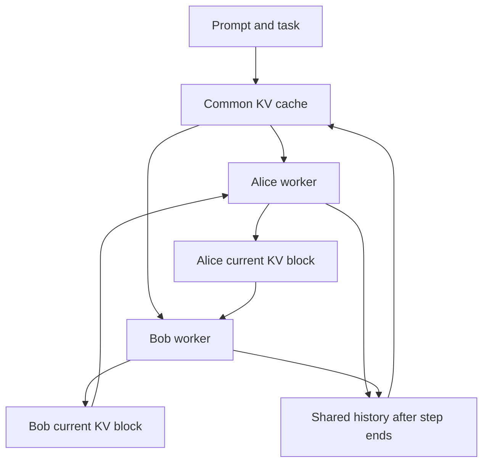
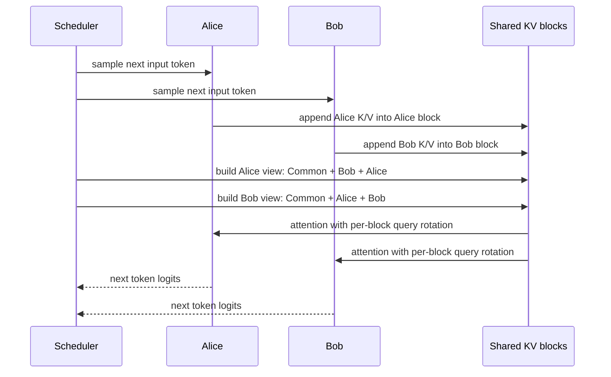
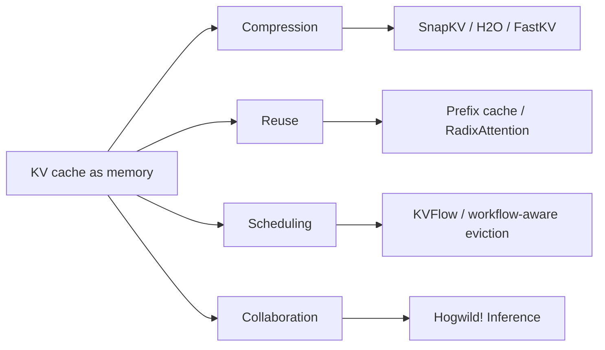

论文：Hogwild! Inference: Parallel LLM Generation via Concurrent Attention

作者：Gleb Rodionov, Roman Garipov, Alina Shutova, George Yakushev, Erik Schultheis, Vage Egiazarian, Anton Sinitsin, Denis Kuznedelev, Dan Alistarh

会议：NeurIPS 2025

版本说明：本文主要依据 NeurIPS 2025 conference PDF 和 arXiv:2504.06261v4，代码参考官方 GitHub 实现。

## 1. 先说结论

Hogwild! Inference 讨论的是一个很有意思的问题：

**能不能让多个同一个 LLM 的推理线程并行生成，并且通过共享 KV cache 实时看到彼此的中间思考，从而像多人协作一样更快完成复杂推理？**

传统多 Agent 或 parallel reasoning 方法通常会先规定协作框架：

1. Self-Consistency：多个模型独立解题，最后投票或汇总。
2. Debate / discussion：多个 Agent 分轮讨论。
3. Skeleton-of-Thought：先把问题拆成子任务，再并行求解，最后合并。
4. PASTA 一类异步子任务方法：主 Agent 派发后台线程，之后收集结果。

这些方法的问题是：**协作策略通常是外部写死的**。如果问题天然能拆分，SoT 很有效；如果问题不能马上拆分，或者初始计划中途被推翻，固定框架就容易浪费算力。

Hogwild! Inference 的思路更激进：不预设具体协作方式，而是让多个 worker 同时生成 token，并通过一个共享、动态更新的 attention cache 互相可见。模型自己决定要不要分工、互相检查、换路线、停止重复工作。

一句话概括：

**Hogwild! Inference 把“多 Agent 的文本通信”下沉到了 KV cache 层，让多个推理线程通过 concurrent attention 共享正在生成的记忆。**

它的核心贡献有三点：

1. 提出共享 KV cache 的并发注意力机制，让多个 worker 在 decode 时互相 attend 到彼此的生成内容。
2. 利用 RoPE 的旋转性质做位置重排，避免把其他 worker 的 token 重新 prefill / re-encode。
3. 证明现有 reasoning model 在不额外 fine-tuning 的情况下，已经能在这种共享 cache 设置下进行一定程度的协作。

这篇论文不是传统意义上的 KV cache 压缩，也不是 speculative decoding。它更像是一个新的 inference-time parallelism 抽象：**把并行算力用于生成多个互相可见的 reasoning stream，而不是只服务于单条序列的加速。**

## 2. 背景：为什么 LLM 推理难并行

LLM 的 decode 是强自回归的：

```text
token_1 -> token_2 -> token_3 -> ... -> token_T
```

每一步都要依赖前面生成的 token。即使 GPU 很强，单个请求的 decode 也常常受限于“每步只能生成一个 token”的顺序性。

这和 prefill 不一样。prefill 阶段可以一次性处理整段 prompt，矩阵乘法规模大，GPU 利用率比较高；decode 阶段每步 query 很少，虽然可以复用 KV cache，但单请求很难吃满硬件。

复杂推理任务又经常需要很长的 test-time compute。例如数学题、代码题、工具调用、多步骤规划，模型可能要生成几千甚至上万 token 才能收敛到答案。于是瓶颈变成：

```text
需要更多思考 token
        +
每条思考链又是顺序生成
        =
延迟高
```

已有方法通常有两条路线。

第一条是“多尝试提升正确率”。例如 Self-Consistency 让多个模型独立生成多条 CoT，最后投票。这能提升质量，但不一定降低单题延迟，因为每条链都在重复解完整问题。

第二条是“显式拆任务提速”。例如 Skeleton-of-Thought 先生成大纲，再把子任务分给不同线程。这在任务可拆分时很好，但问题是很多推理任务一开始并不知道正确拆法。初始计划如果错了，后面并行执行的子任务也会一起跑偏。

Hogwild! Inference 的切入点是：人类合作通常不是先写死一个框架再执行，而是在做题过程中不断看队友进展、调整分工、纠错、停止重复劳动。论文想测试的是：LLM 是否也能在类似环境中自组织协作。

## 3. 方法总览

Hogwild! Inference 中有多个 worker。它们使用同一份模型权重，但每个 worker 都有自己的当前生成状态。同时，系统维护一个共享的 KV cache 结构。

可以把它想象成一个多人聊天室：

1. 所有人都看到同一个题目和系统提示。
2. Alice 正在写自己的下一段推理。
3. Bob 也在同时写自己的下一段推理。
4. Alice 生成下一个 token 时，可以 attend 到 Bob 当前已经生成的 token。
5. Bob 生成下一个 token 时，也可以 attend 到 Alice 当前已经生成的 token。

整体数据流大致如下：



这里的关键不是“多个 Agent 互相发文本消息”，而是每个 worker 的 attention 直接能看到其他 worker 的 KV 表示。文本消息当然仍然存在，但通信路径变成：

```text
other worker tokens -> other worker KV -> current worker attention
```

而不是：

```text
other worker complete answer -> concatenate into prompt -> re-prefill
```

这就是论文标题里的 concurrent attention。

## 4. 共享 KV cache 的基本问题

普通单序列 decode 的 KV cache 很简单：

```text
Prompt KV + Generated KV
```

第 $t$ 个 token 的 query attend 到前 $t-1$ 个 token 的 key/value。所有 token 的位置也是线性的。

但多个 worker 共享 cache 后，问题马上变复杂。以两个 worker 为例：

```text
Common prompt: C
Alice current tokens: A
Bob current tokens: B
```

从 Alice 的视角，她希望看到：

```text
C + B + A
```

因为 Alice 要继续生成自己的 token，所以她自己的当前段落应该在最后，其他人的当前进展在前面。

从 Bob 的视角，他希望看到：

```text
C + A + B
```

同一块 Alice KV、Bob KV，在不同 worker 视角下处于不同位置。更麻烦的是，随着 Alice 和 Bob 不断生成 token，相对距离也在变化。

最直接但很慢的做法是：每次把别人的 token 放到新的位置后重新编码一遍。这样相当于不断 re-prefill 历史内容，开销会非常高。论文提到，如果 $n$ 个 Agent 每步各生成一个 token，再为每个 Agent 重新编码其他 Agent 的 token，复杂度会膨胀到很不划算的程度。

Hogwild! Inference 的核心工程问题就是：

**同一份 KV 能不能在不同 worker 的位置视图里复用，而不是反复重算？**

答案依赖 RoPE。

## 5. RoPE 位置重排：不旋转旧 KV，只旋转当前 query

大多数现代 decoder-only LLM 使用 RoPE，也就是 rotary position embedding。简化理解，RoPE 会把 query/key 按位置 $i$ 做一个旋转：

$$
\rho(x, i)
$$

注意力分数依赖 query 和 key 的点积：

$$
\rho(q, i_q) \cdot \rho(k, i_k)
$$

RoPE 的重要性质是：注意力主要关心相对位置差。也就是说，把 query 和 key 同时旋转同一个偏移，点积关系不变。

Hogwild! Inference 用这个性质做 cache block 的“虚拟位置重排”。

假设有三个 cache block：Common、Alice、Bob。对某个 worker 来说，这些 block 需要被放到不同的起始位置。朴素做法是把整个 block 的 key 全部重新旋转到新位置：

```text
rotate all old keys -> attention
```

但旧 key 可能有几千甚至几万 token，每层都重转很贵。论文的做法是反过来：

```text
keep old keys in block-local position
rotate current query differently for each block
```

直觉是：如果某个 key block 没有被真的搬到位置 $i_k$，那就把当前 query 的角度调整成“看起来这个 block 在 $i_k$ 的位置”。这样只需要旋转当前步的 query，而不是旋转全部历史 key。

论文中的等价关系可以写成：

$$
\rho(q, i_q)
\left[
\rho(A, i_k^A) \oplus \rho(B, i_k^B) \oplus \rho(C, i_k^C)
\right]
=
\left[
\rho(q, i_q - i_k^A)A
\oplus
\rho(q, i_q - i_k^B)B
\oplus
\rho(q, i_q - i_k^C)C
\right]
$$

其中 $\oplus$ 表示拼接。左边是“把每个 KV block 旋转到目标位置”；右边是“KV block 保持原样，对每个 block 使用不同旋转后的 query”。

这一步很关键，因为它让共享 KV cache 成为一个轻量操作：

1. 每个 worker 的 KV block 只存一份。
2. block 内部位置从 0 开始存储。
3. 每个 worker forward 时，根据自己的视角计算 block 的相对偏移。
4. 对当前 query 做多份 RoPE rotation。
5. 对不同 block 执行 attention，最后在 softmax 加权中聚合。

这和 PagedAttention 的思想有点像：都是把 KV cache 切成块，然后让请求按某种逻辑视图访问这些块。但 Hogwild! Inference 的特殊点是：**同一批 worker 会以不同位置视图同时访问同一组 KV block**。

## 6. Cache layout：为什么要像群聊一样组织思考

如果只把每个 worker 的全部输出拼成一大块，短任务没有问题。但长推理会遇到一个现实问题：worker 越写越长，其他 worker 的最新信息可能离当前 token 很远。

例如 Alice 已经写了 4000 个 token，Bob 的最新想法在 Alice 的长上下文前面，Alice 继续生成时可能不再关注 Bob 的更新。

论文因此设计了类似群聊的 cache layout。每个 worker 的生成被切成 step，通常是一段自然语言推理，类似一个段落。当某个 worker 完成一个 step，比如生成了双换行，系统会把这个 step 移入 shared history，然后该 worker 开始新的 step。

主布局由三部分组成：

1. Common Cache：系统提示、任务描述、已经完成的历史 reasoning steps。
2. Other workers：其他 worker 当前还没完成的 step。
3. Current worker：当前 worker 自己正在继续写的 step。

从 Alice 视角看：

```text
Common history
Bob current unfinished step
Alice current unfinished step
```

从 Bob 视角看：

```text
Common history
Alice current unfinished step
Bob current unfinished step
```

这样做有两个好处：

1. 已完成的推理步骤被组织成公共聊天历史，方便后续 worker 对齐上下文。
2. 未完成的当前 step 也能 token-wise 可见，降低协作延迟。

论文在附录里比较了三种 layout：

| Layout | 特点 | 问题 |
| --- | --- | --- |
| Contiguous | 每个 worker 的输出各自连续存放 | 长推理时最新信息距离可能变远 |
| Interleaved / step-wise | 只有完成一个 step 后才进入公共历史 | 协作延迟更高 |
| Combined / token-wise | 既有公共历史，又能看到未完成 step | 论文主方法 |

消融结果显示，这几个设计都有效：contiguous 在短 budget 下还可以，长 budget 会落后；non-instant step-wise 小 budget 下明显弱，因为同步太慢；去掉“是否重复工作”的协作 prompt 也会降低效果。

## 7. Prompting：模型不是天然知道该怎么协作

共享 KV cache 只是给模型提供通信通道，不保证模型会主动合作。因此论文用了 zero-shot prompting，而不是训练模型。

prompt 主要有两部分。

第一部分是系统提示，告诉模型：

1. 你会和另一个 assistant 同时解决问题。
2. 你们能看到彼此过去和当前的思考。
3. 你们应该避免重复工作。
4. 可以分工、互相检查、尝试不同路线、响应对方建议。

第二部分是定期插入一个类似 s1 的自检提示：

```text
Wait, am I doing redundant work? (yes/no):
```

论文观察到，reasoning model 有时会太专注于自己正在写的内容，忽略其他 worker 已经纠正错误或完成了子任务。但当系统直接问它“你是不是在做重复工作”时，它经常能识别冗余并调整策略。

这个点很重要：Hogwild! Inference 目前不是一个完全“自然涌现”的协作系统，它仍然依赖 prompt 把模型拉回协作状态。论文也认为未来可以通过 fine-tuning 或 RL 让模型更适应这种并发推理格式。

## 8. 推理流程

Hogwild! Inference 每一步会把所有 worker 当成一个 batch 一起 forward。区别在于，普通 batch 中每个样本只看自己的 KV cache；Hogwild! batch 中每个 worker 会按自己的视角看公共 cache 和其他 worker cache。

简化流程如下：



当某个 worker 完成一个 reasoning step：

1. 系统把它当前 block 的内容移动到 common history 的末尾。
2. 通过 RoPE offset 修正它在新历史位置中的表示。
3. 清空该 worker 的 current block。
4. 给它插入新的段落 header，例如 `Alice [3]:`。

从应用层看，这像多个 Agent 在聊天室里同时打字；从 kernel 层看，这是多个 query 对一组可重排 KV block 做 attention。

## 9. 实现细节：为什么不是简单拼 prompt

如果用普通 serving 系统模拟 Hogwild! Inference，一种办法是每个 worker 每次生成时都把别人的最新文本拼进 prompt，然后重新 prefill。但这会带来三类开销：

1. 重复 prefill 其他 worker 的 token。
2. 每个 worker 维护一份不同顺序的 KV，显存重复。
3. 同步粒度通常是文本段落或轮次，无法 token-wise 实时可见。

论文的实现则把 Hogwild! cache 拆成 block：

```text
common block
worker_1 current block
worker_2 current block
...
worker_n current block
```

每个 block 包含所有 transformer layer 的 K/V。block 内 token 永远按局部位置存储：

```text
0, 1, 2, ..., len(block)-1
```

真正的位置视图在 attention 时动态计算。对每个 worker，需要知道每个 block 在它视图中的起始位置，然后生成对应的 query rotation。

论文基于 Flash-Decoding 思路实现了自定义 GPU kernel。关键不是按 block 粗暴分配 SM，因为不同 block 长度可能很不均衡；更合理的是按 KV entries 做负载均衡，再做 partial result reduction。

性能上，论文在 NVIDIA L40S + QwQ-32B-AWQ 上报告：

| Workers | Tokens/s, 1024 cache | Tokens/s, 4096 cache | Tokens/s, 16384 cache |
| --- | ---: | ---: | ---: |
| 1 | 19.3 | 20.1 | 19.7 |
| 2 | 36.1 | 36.3 | 36.1 |
| 4 | 66.3 | 68.9 | 69.1 |

生成固定 token 数的总时间也近似缩短：

| Workers | 1024 tokens | 4096 tokens | 16384 tokens |
| --- | ---: | ---: | ---: |
| 1 | 52.3s | 206.5s | 853.5s |
| 2 | 29.9s | 114.6s | 454.4s |
| 4 | 16.7s | 61.3s | 239.2s |

这说明在 32B 量化模型上，多 worker 不只是“多生成几条链”，也确实提高了硬件利用率。当然这不是免费午餐：attention kernel 和 setup 都有额外常数开销，只是长上下文和多 worker 下整体仍然划算。

## 10. 实验：模型真的会协作吗

论文主要评估两个问题：

1. 质量：相同 sequential forward pass budget 下，Hogwild! 是否更快达到正确答案？
2. 速度：真实时间上，多 worker 的 kernel 是否有足够吞吐提升？

实验模型包括 QwQ-32B、Phi-4-Reasoning-Plus、Qwen3 系列、DeepSeek-R1 等。任务包括：

1. GSM8k x 5 synthetic task
2. LIMO 数学推理
3. LiveCodeBench 代码生成
4. OlympiadBench 数学和物理
5. AIME 2025

### 10.1 GSM8k x 5： sanity check

这个任务把 5 道互不相关的 GSM8k 题合成一个样本，要求模型返回 5 个答案。它天然适合分工，所以是测试“系统有没有被 KV 操作弄坏”的 sanity check。

结果符合直觉：

1. Hogwild! workers 能够分工求解。
2. Skeleton-of-Thought 也表现很好，因为任务确实容易拆。
3. Self-Consistency 也能有收益，因为多条尝试中可能有一条更快或更准。

这个实验不能证明 Hogwild! 对复杂任务必然有效，但说明共享 KV cache 和 RoPE 重排没有破坏模型基本推理能力。

### 10.2 LIMO：没有明显拆分方式的数学题

LIMO 是论文的主实验之一，包含 817 道现代 reasoning model 需要较长思考才能稳定解决的数学题。这类题不一定能一开始拆成独立子问题，很适合检验动态协作。

论文的结论是：

1. Hogwild! Inference 在相同 forward pass budget 下更快达到正确答案。
2. worker 数从 2 增加到 3、4 时，短到中等 budget 下通常进一步提升。
3. Self-Consistency 有一定收益，但不如共享 cache 的协作方式。
4. Skeleton-of-Thought 在复杂数学题上无法总是拆出好子任务，因此收益有限。

更有意思的是模型大小差异。Qwen3-1.7B 和部分 4B 模型在 Hogwild! 设置下不稳定，容易被协作格式干扰；更大的模型更容易表现出有效协作。

这说明 Hogwild! 的效果依赖模型本身的 instruction following、reasoning 和 social coordination 能力。共享 cache 只是提供了通信带宽，模型还得知道如何使用它。

### 10.3 LiveCodeBench / OlympiadBench / AIME

在代码和奥赛类任务上，论文也观察到 Hogwild! 的收益，但不是所有设置都压倒性领先。

LiveCodeBench 上，Self-Consistency 在某些情况下也很强，因为代码生成可以从多次独立尝试中受益。Hogwild! 的优势在于 worker 可以实时参考彼此，例如一个 worker 写思路，另一个 worker 检查边界条件或修正实现方向。

OlympiadBench 的扩展 budget 结果也值得看。以 QwQ-32B 在 OlympiadBench-Math 上为例，Hogwild! 在 2048 budget 时是 52.0，baseline 是 40.89；到 16384 budget 时，Hogwild! 是 75.26，baseline 是 74.81。

这说明 Hogwild! 的最大优势往往出现在较短或中等 budget：它能更快到达一个好答案。随着 baseline 有足够长时间慢慢思考，差距会变小。

物理任务上也类似，较小 budget 下 Hogwild! 更明显。例如 OlympiadBench-Phys 在 2048 budget 下，Hogwild! 是 27.12，baseline 是 22.89；4096 budget 下，Hogwild! 是 33.20，baseline 是 26.0。

### 10.4 协作能力评分

论文还用 GPT-4o 作为 judge，对生成 trace 的协作程度打分，分数 1 到 6：

1. 1 表示基本没有协作。
2. 3 表示基本任务拆分。
3. 6 表示理想协作，但实验中几乎没有达到。

比较三种设置：

1. No sync：独立生成，不能看彼此。
2. Step-wise：只能看完成的 step。
3. Token-wise：完整 Hogwild!，能实时看未完成 step。

结果显示，token-wise Hogwild! 的协作分数最高，step-wise 次之，no sync 最低。这和直觉一致：实时看到对方正在写什么，比等对方写完一整段再同步更利于协作。

## 11. 和相关方法的区别

### 11.1 对比 Self-Consistency

Self-Consistency 是多条独立思考链：

```text
Solution A
Solution B
Solution C
        -> vote / aggregate
```

它的通信发生在最后。优点是简单、鲁棒、无需改 serving engine。缺点是重复劳动多，worker 之间无法中途纠错。

Hogwild! 是多条共享思考链：

```text
Alice token stream <-> shared KV <-> Bob token stream
```

它的通信发生在生成过程中。理论上能减少重复劳动，也能中途调整策略。但它需要改 attention cache 和 kernel，实现复杂度高。

### 11.2 对比 Skeleton-of-Thought

SoT 的流程是：

```text
plan -> split subtasks -> solve in parallel -> merge
```

它适合一开始就能拆分的问题，比如“分别回答 5 个独立小题”。但如果问题需要探索、纠错、推翻初始计划，SoT 的固定计划就会受限。

Hogwild! 不要求提前拆分。worker 可以先讨论策略，也可以一个尝试代数路线、另一个尝试几何路线，中途再根据彼此进展合流。

### 11.3 对比 speculative decoding / Medusa / EAGLE

Speculative decoding、Medusa、EAGLE 这类方法主要目标是加速同一条输出序列：

```text
更快生成同一个 answer stream
```

Hogwild! 的目标是并行探索多个可交互的 reasoning stream：

```text
多个 worker 同时思考并互相影响
```

因此它不是 speculative decoding 的替代品。论文也提到未来可以研究二者结合：例如每个 worker 内部用 speculative decoding，加速单 worker token 生成；worker 之间再用 Hogwild! 共享 reasoning memory。

### 11.4 对比普通多 Agent 框架

普通多 Agent 框架通常在文本层同步：

```text
Agent A writes a message
Agent B reads the message
Agent B writes a reply
```

Hogwild! 在 KV 层同步：

```text
Agent A generates token K/V
Agent B attends to these K/V immediately
```

这带来更低延迟和更细粒度通信，但也带来一个问题：模型原本不是在这种“看别人未完成句子”的格式上训练的。因此 prompt 和未来 fine-tuning 都很关键。

## 12. 论文的真正价值

我认为这篇论文最有价值的地方不是“它在某个 benchmark 上提升了多少点”，而是提出了一个新的 serving 抽象：

**KV cache 不一定只能是一条请求自己的历史，也可以成为多个推理线程共享、重排、协作的工作区。**

这会打开一些很有意思的方向。

第一，inference-time compute 可以从“加长单条 CoT”变成“组织多条可通信 CoT”。过去我们常说 test-time scaling，就是让模型想更久。Hogwild! 提示我们，也可以让模型“多人一起想”，而且通信可以发生在 attention 层。

第二，Agent 系统和 serving engine 的边界会变模糊。以前 Agent 框架多在应用层编排 prompt、工具和消息；Hogwild! 把一部分协作机制推进到推理内核。未来 serving system 可能不仅调度请求，还调度 reasoning workers、shared memory 和协作拓扑。

第三，KV cache 的语义变丰富了。Prefix cache、PagedAttention、RadixAttention 主要关注复用和内存管理；Hogwild! 关注“同一份 KV 在不同逻辑视图中的重排”。这可能和未来的可编辑上下文、异步人机协作、共享工具状态结合。

## 13. 局限性

Hogwild! Inference 目前还有不少限制。

### 13.1 需要修改 inference engine

这不是只改 prompt 就能在现有 API 上完整复现的方法。真正的 Hogwild! 需要：

1. 自定义 KV cache layout。
2. per-block query RoPE rotation。
3. 支持多个 worker 交叉 attention 的 attention kernel。
4. 调度 worker step、history merge、cache reset。

官方代码提供了 PyTorch 实现和 fast inference kernels，但要集成到 vLLM / SGLang 这类生产 serving 系统，还需要较多工程工作。

### 13.2 小模型不稳定

论文结果显示，小模型尤其是 Qwen3-1.7B 在这种协作格式下不稳定。原因可能有几种：

1. 小模型理解复杂系统提示的能力较弱。
2. 小模型更容易被其他 worker 的未完成文本干扰。
3. 小模型缺乏动态分工和纠错能力。
4. 训练数据里缺少这种 token-wise 协作格式。

这意味着 Hogwild! 更适合作为强 reasoning model 的推理扩展，而不是直接套到所有小模型上。

### 13.3 长上下文和 worker 数扩展仍有问题

worker 数越多，生成速度越快，但上下文也增长更快。如果模型原本支持的有效上下文有限，多个 worker 很快就会把窗口填满。论文中 6 worker 在某些设置下短 budget 更好，但长 budget 饱和或变差。

这不是单纯 kernel 优化能解决的问题，还涉及：

1. 如何压缩或整理 shared history。
2. 如何让 worker 忘掉无用步骤。
3. 如何避免多人重复写低价值 token。
4. 如何设计更好的协作协议。

### 13.4 协作评价依赖 LLM-as-a-Judge

论文用 GPT-4o 评估 collaborativeness。这个指标能提供线索，但可复现性和客观性有限。更理想的评估应该结合：

1. trace 中的显式引用行为。
2. 重复工作减少比例。
3. 错误被其他 worker 纠正的次数。
4. 最终答案质量和真实延迟。
5. 人类标注的一致性。

### 13.5 Chain-of-thought 可见性本身有产品风险

Hogwild! 让多个 worker 共享中间推理，这在研究上很自然。但在实际产品中，完整 CoT 未必应该暴露或保留。未来如果部署类似机制，可能要把“共享工作区”设计成隐藏状态、摘要状态或结构化 scratchpad，而不是直接保存和展示完整自然语言思考。

## 14. 什么时候适合用

适合 Hogwild! Inference 的场景：

1. 单个问题很难，需要较长 reasoning budget。
2. 问题可能存在多条解法，适合并行探索。
3. 中途纠错和动态分工有价值。
4. 有足够 GPU 资源，单请求延迟比总吞吐更重要。
5. 使用较强的 reasoning model，能理解协作提示。

不太适合的场景：

1. 简单问答或短输出，decode 本身不长。
2. 任务可以稳定拆成固定 DAG，普通并行 workflow 已经足够。
3. 模型较小，容易被多 worker 上下文干扰。
4. serving stack 无法修改 attention / KV cache。
5. 对可复现性、确定性、审计有很强要求。

## 15. 一个简化例子

假设题目是：

```text
求一个复杂几何题的最终数值答案。
```

普通单 Agent 可能这样做：

```text
尝试代数法 -> 卡住 -> 换几何法 -> 发现漏条件 -> 回退 -> 重新整理
```

Self-Consistency 会生成多条完整解法：

```text
Agent 1: 代数法完整做一遍
Agent 2: 几何法完整做一遍
Agent 3: 坐标法完整做一遍
最后汇总
```

Hogwild! 更像：

```text
Alice: 我先用坐标系设点。
Bob: 我检查是否有对称性，可能能降维。
Alice: 看到 Bob 的对称性观察，改用更简单坐标。
Bob: Alice 的方程里符号有误，第二项应为负。
Alice: 修正后得到候选答案。
Bob: 用边界条件验证，答案一致。
```

它的优势不是“有更多答案可以投票”，而是 worker 在生成过程中互相改变了对方的轨迹。

## 16. 和 KV cache 研究的联系

这篇论文和近期 KV cache 系统论文可以放在一个更大的图里看。



以前很多工作问的是：

1. KV cache 能不能少存一点？
2. 相同 prefix 的 KV 能不能复用？
3. 显存不够时该淘汰谁？
4. KV cache 如何跨 GPU 搬运？

Hogwild! 问的是另一个问题：

**KV cache 能不能作为多个推理线程之间的共享通信介质？**

这让 KV cache 从“性能优化数据结构”变成了“协作状态数据结构”。

## 17. 总结

Hogwild! Inference 是一篇很值得关注的 LLM inference 论文。它把多 Agent 协作、test-time scaling、KV cache 和 attention kernel 连在了一起。

它的关键思想是：

1. 多个 worker 使用同一模型并行生成。
2. worker 之间共享动态更新的 KV cache。
3. 每个 worker 通过不同 cache layout 看到公共历史、其他 worker 当前进展和自己的当前 step。
4. 用 RoPE 的旋转性质避免重算旧 KV，只对当前 query 做 per-block rotation。
5. 让模型通过 prompt 自己决定如何协作。

实验说明，强 reasoning model 确实能在这种设置下表现出分工、纠错、引用对方观察、停止重复工作等行为，并且在不少复杂任务上更快达到正确答案。

但它也不是即插即用的万能方法。它需要自定义 serving engine，对小模型和长上下文仍不稳定，协作能力还主要依赖 prompt。更现实的判断是：

**Hogwild! Inference 提供了一个新的研究方向：把 LLM 推理从单条自回归序列，扩展成多个共享注意力记忆的并发推理线程。**

如果未来模型能针对这种格式训练，serving 系统也能原生支持共享 KV workspace，那么“多个模型实例边想边互相看”的推理方式，可能会成为长推理任务的一种重要加速路线。

## 参考

1. NeurIPS 2025 paper: https://proceedings.neurips.cc/paper_files/paper/2025/file/4293727fc48c60b4adfe7a8e44f6a446-Paper-Conference.pdf
2. NeurIPS abstract page: https://proceedings.neurips.cc/paper_files/paper/2025/hash/4293727fc48c60b4adfe7a8e44f6a446-Abstract-Conference.html
3. arXiv:2504.06261: https://arxiv.org/abs/2504.06261
4. Official implementation: https://github.com/eqimp/hogwild_llm
