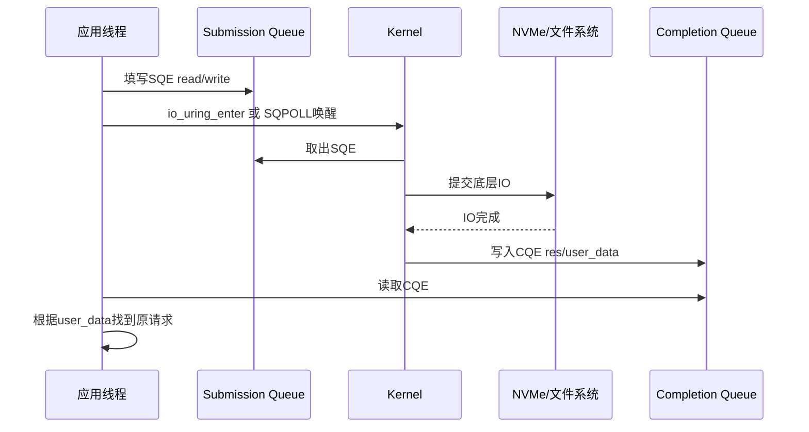
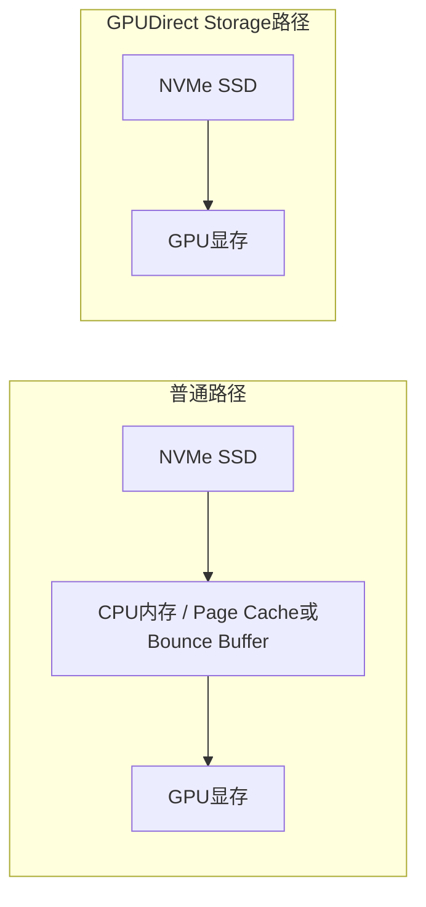

## 1. 先说结论

版本说明：本文参考的是2026-05-08访问的Linux man-pages `io_uring(7)`、fio官方文档和NVIDIA GPUDirect Storage cuFile API Reference。IO栈和GDS行为都和内核版本、文件系统、驱动、CUDA/GDS版本、NVMe拓扑强相关，实际测试要以本机环境为准。

这篇文章讲三件事：

1. Linux `io_uring`为什么比传统同步IO更适合高性能异步IO。
2. NVMe IO测试里，IOPS、bandwidth、latency、queue depth、block size这些指标到底怎么看。
3. GPUDirect Storage，也就是GDS里，cuFile API是怎么让NVMe数据进GPU显存的。

先给一个总览。

| 主题 | 核心问题 | 关键概念 |
|---|---|---|
| `io_uring` | 应用如何低开销提交大量异步IO | SQ、CQ、SQE、CQE、in-flight IO、SQPOLL |
| NVMe测试 | 如何判断盘、系统、IO路径的性能 | IOPS、BW、latency、iodepth、bs、numjobs、p99 |
| GDS/cuFile | 如何让存储直接读写GPU memory | `cuFileDriverOpen`、`cuFileHandleRegister`、`cuFileBufRegister`、`cuFileRead/Write` |

一句话概括：

**高性能IO不是单纯“读一次有多快”，而是看应用能否持续提交足够多的请求，让设备队列保持忙碌，同时又控制好平均延迟和尾延迟。**

## 2. 从最普通的read开始

最简单的读文件代码可能是：

```c
char buf[4096];
int fd = open("data.bin", O_RDONLY);
read(fd, buf, 4096);
```

这很直观：

1. 应用调用`read`。
2. 进入内核。
3. 内核发起磁盘IO。
4. 如果数据没准备好，线程睡眠。
5. 数据回来后，线程被唤醒。
6. `read`返回。

这种方式叫同步阻塞IO。

优点：

1. 简单。
2. 容易理解。
3. 适合低并发、低性能要求。

缺点：

1. 一个线程一次通常只能等一个IO。
2. 每个IO都要系统调用。
3. 线程阻塞和唤醒有开销。
4. 很难把高速NVMe打满。

NVMe设备很快。单个IO的延迟可能几十微秒，但设备内部可以同时处理很多请求。如果应用一次只发一个请求，设备大部分能力没有用上。

## 3. 为什么需要异步IO

异步IO的基本想法是：

```text
不要提交一个IO就傻等。
而是连续提交多个IO，让设备同时处理。
之后再批量收完成事件。
```

比如同步方式：

```text
submit IO 1
wait IO 1 done
submit IO 2
wait IO 2 done
submit IO 3
wait IO 3 done
```

异步方式：

```text
submit IO 1
submit IO 2
submit IO 3
submit IO 4

wait completions
```

这会让多个IO同时在设备里飞行，也就是in-flight。

这个in-flight数量，fio里通常叫`iodepth`，硬件/驱动里常说queue depth。

## 4. io_uring是什么

`io_uring`是Linux的异步IO接口。

它的核心不是“又多了一个read API”，而是引入了用户态和内核态共享的环形队列。

官方man page里说，io_uring使用shared ring buffers作为用户态和内核态沟通的主要方式。

它有两个核心队列：

1. Submission Queue，简称SQ。
2. Completion Queue，简称CQ。

直白理解：

```text
SQ:
  应用把想做的IO请求放进去。

CQ:
  内核把已经完成的IO结果放进去。
```

每个提交项叫：

```text
SQE = Submission Queue Entry
```

每个完成项叫：

```text
CQE = Completion Queue Entry
```

## 5. io_uring的基本流程

一个典型io_uring流程是：



图里要注意：应用不是每个IO都同步等待设备完成，而是把请求放进SQ，再从CQ里收完成事件。

```text
1. io_uring_setup 创建ring
2. mmap SQ/CQ共享内存
3. 应用拿一个SQE
4. 填入opcode、fd、buffer地址、长度、offset
5. 提交SQE
6. 内核执行IO
7. 内核写入CQE
8. 应用读取CQE，检查结果
```

可以画成：

```text
应用线程
  |
  | 写SQE
  v
Submission Queue  ---->  Kernel  ----> NVMe / FS / Network
                                      |
                                      v
Completion Queue <---- CQE -----------+
  ^
  | 读CQE
  |
应用线程
```

一个SQE里通常要描述：

1. 做什么操作：read、write、fsync、accept等。
2. 对哪个fd操作。
3. buffer地址在哪里。
4. IO大小是多少。
5. 文件offset是多少。
6. `user_data`是什么。

`user_data`很重要。因为异步IO可能乱序完成，应用必须知道这个CQE对应哪个请求。

例如：

```text
提交顺序:
  IO A
  IO B
  IO C

完成顺序:
  IO B
  IO A
  IO C
```

所以每个SQE要带一个ID：

```text
sqe->user_data = request_id
```

收到CQE后：

```text
cqe->user_data
```

就能知道完成的是谁。

## 6. io_uring为什么高效

传统系统调用模式是：

```text
每个IO:
  syscall enter
  kernel处理
  syscall return
```

io_uring把提交和完成都放到共享ring里，减少了来回系统调用和数据复制。

它的高效主要来自：

1. SQ/CQ是共享内存。
2. 一次可以提交多个SQE。
3. 一次可以收多个CQE。
4. 支持固定文件、固定buffer，减少重复注册开销。
5. 支持SQPOLL，减少提交时系统调用。
6. 支持多种异步操作，不只是磁盘读写。

### 6.1 SQPOLL是什么

SQPOLL是Submission Queue Polling。

普通模式下，应用放了SQE后，要通过`io_uring_enter`告诉内核：

```text
我放请求了，你来处理。
```

SQPOLL模式下，内核有一个polling线程盯着SQ。

应用把SQE放进去后，内核线程会自己发现并提交。

好处：

1. 减少系统调用。
2. 降低提交延迟。
3. 高IOPS场景更有用。

代价：

1. 需要一个CPU核或内核线程持续poll。
2. 空闲时也可能消耗CPU。
3. 配置和权限更复杂。

所以SQPOLL不是无脑开启。它适合极致低延迟/高IOPS场景。

## 7. io_uring和NVMe队列的关系

io_uring是Linux应用和内核之间的提交/完成机制。

NVMe本身也有队列：

```text
NVMe Submission Queue
NVMe Completion Queue
```

两者不是同一个东西。

可以理解成两层队列：

```text
应用
  -> io_uring SQ/CQ
  -> Linux block layer / filesystem
  -> NVMe driver queue
  -> NVMe controller
```

应用看到的是io_uring队列。

NVMe设备看到的是NVMe队列。

中间还有：

1. VFS
2. 文件系统
3. page cache或direct IO
4. block layer
5. IO scheduler
6. NVMe driver

所以如果fio里设置：

```text
iodepth=64
```

并不等于NVMe设备内部某个队列一定正好深度64。

它表示fio尽量保持64个IO in-flight。中间层可能合并、拆分、阻塞或重排。

## 8. NVMe测试最核心的指标

NVMe测试里最常见指标：

1. IOPS
2. bandwidth
3. latency
4. queue depth
5. block size
6. utilization
7. CPU usage
8. percentile latency

### 8.1 IOPS

IOPS是每秒完成多少个IO。

$$
\mathrm{IOPS} = \frac{\mathrm{completed\ IOs}}{\mathrm{seconds}}
$$

例如：

```text
1秒完成1,000,000个4K随机读
IOPS = 1M
```

IOPS适合看小块随机IO。

比如：

```text
4K randread
4K randwrite
```

### 8.2 Bandwidth

Bandwidth是吞吐带宽。

$$
\mathrm{BW} = \mathrm{IOPS} \times \mathrm{BlockSize}
$$

例如：

```text
1M IOPS * 4KB = 4GB/s
```

如果是：

```text
100K IOPS * 128KB = 12.8GB/s
```

所以IOPS不能单独看，必须和block size一起看。

小块IO看IOPS，大块顺序IO看带宽。

### 8.3 Latency

latency是一个IO从发出到完成的时间。

fio里常见三个延迟：

1. `slat`
2. `clat`
3. `lat`

#### slat

`slat`是submission latency。

大致表示fio从创建IO到把IO提交给ioengine所花的时间。

对异步ioengine，它包括queue/commit相关时间。

如果`slat`高，说明应用侧提交路径有压力，例如：

1. CPU不够。
2. ioengine开销大。
3. 系统调用/锁/内存管理开销高。
4. 提交batch设置不合理。

#### clat

`clat`是completion latency。

大致表示IO提交出去后，到fio收回完成事件的时间。

这是最常看的设备/系统IO完成延迟。

如果`clat`高，可能是：

1. 设备本身慢。
2. queue depth太高排队。
3. 文件系统或block layer慢。
4. 写入触发GC或flush。
5. 混合读写互相干扰。

#### lat

`lat`是total latency。

fio文档里说，total latency是：

$$
\mathrm{lat} = \mathrm{slat} + \mathrm{clat}
$$

也就是从fio创建IO到IO完成的总时间。

### 8.4 平均延迟和尾延迟

只看平均延迟很危险。

比如两个盘平均延迟都是100us：

```text
盘A:
  p50 = 90us
  p99 = 150us
  p99.9 = 300us

盘B:
  p50 = 50us
  p99 = 5ms
  p99.9 = 50ms
```

平均值可能差不多，但盘B对在线服务很危险。

所以要看：

1. p50
2. p95
3. p99
4. p99.9
5. max

对存储系统，尾延迟经常比平均值更重要。

## 9. Queue Depth是什么

Queue depth表示同时在飞的IO数量。

fio里对应：

```text
iodepth
```

官方fio文档说，`iodepth`是要保持in flight的IO units数量。

例如：

```text
iodepth=1
```

表示一次只挂一个IO。

```text
iodepth=64
```

表示尽量保持64个IO同时在飞。

### 9.1 为什么queue depth提高后吞吐会上升

单个IO延迟假设是100us。

如果iodepth=1，那么理论最大IOPS约为：

$$
\frac{1}{100us} = 10000\ \mathrm{IOPS}
$$

即使设备能做100万IOPS，你也只能做到约1万，因为你每次都等。

如果iodepth=64：

$$
\frac{64}{100us} = 640000\ \mathrm{IOPS}
$$

这就是queue depth的意义：

**用并发IO隐藏单个IO延迟。**

### 9.2 Little's Law

IO系统里经常可以用Little's Law直觉理解：

$$
L = \lambda W
$$

其中：

1. $L$是系统里的in-flight请求数，也就是queue depth。
2. $\lambda$是吞吐，也就是IOPS。
3. $W$是平均响应时间，也就是latency。

换一下：

$$
\mathrm{IOPS} \approx \frac{\mathrm{QueueDepth}}{\mathrm{Latency}}
$$

这只是近似，但很有用。

例子：

```text
latency = 100us
QD = 32
```

理论吞吐：

$$
\frac{32}{100us} = 320K\ \mathrm{IOPS}
$$

如果你想达到1M IOPS，平均latency还是100us，那么需要：

$$
QD = 1M \times 100us = 100
$$

这解释了为什么高速NVMe测试必须提高iodepth和numjobs。

### 9.3 queue depth太高的代价

queue depth不是越高越好。

QD提高后：

1. 设备更忙，吞吐上升。
2. 但排队也更严重。
3. 平均延迟可能上升。
4. p99/p99.9可能明显变差。

可以这样理解：

```text
低QD:
  延迟低，但吞吐可能打不满。

中等QD:
  吞吐接近峰值，延迟还能接受。

过高QD:
  吞吐提升不明显，但尾延迟明显变差。
```

所以测试NVMe时，要扫iodepth：

```text
iodepth=1,2,4,8,16,32,64,128,256
```

观察：

1. IOPS何时接近平台峰值。
2. latency从哪里开始明显上升。
3. p99从哪里开始不可接受。

## 10. Block Size是什么

Block size，也就是fio里的：

```text
bs
```

表示每个IO请求大小。

常见：

```text
4k
8k
16k
128k
1m
```

不同bs测试不同能力。

### 10.1 4K随机读

```text
bs=4k
rw=randread
```

主要看：

1. IOPS。
2. 小IO延迟。
3. 控制器处理能力。
4. block layer开销。

### 10.2 128K/1M顺序读

```text
bs=128k
rw=read
```

或：

```text
bs=1m
rw=read
```

主要看：

1. 带宽。
2. PCIe链路能力。
3. 文件系统连续读能力。
4. 多盘聚合能力。

### 10.3 为什么大bs带宽高

每个IO都有固定开销。

如果bs很小：

```text
每4KB做一次提交/完成
```

开销很高。

如果bs很大：

```text
每1MB做一次提交/完成
```

单位数据的管理开销更低。

所以大块顺序读更容易打满带宽。

但大bs也会增加单个IO延迟。

## 11. numjobs是什么

fio的`numjobs`表示克隆多少个job。

例如：

```bash
fio --name=randread --numjobs=4 --iodepth=32
```

总in-flight IO大致是：

$$
\mathrm{TotalDepth} = \mathrm{numjobs} \times \mathrm{iodepth}
$$

也就是：

$$
4 \times 32 = 128
$$

为什么需要numjobs？

因为单个线程可能提交不够快。

多job可以：

1. 利用多个CPU core。
2. 触发多个硬件/软件队列。
3. 更容易打满设备。

但numjobs也不是越多越好：

1. CPU竞争会上升。
2. 文件系统锁竞争会上升。
3. NUMA不合理会变慢。
4. latency可能变差。

## 12. direct=1为什么重要

fio测试NVMe通常会用：

```text
direct=1
```

它表示使用direct IO，绕过page cache。

如果不用direct IO，读可能命中Linux page cache。

结果就变成测内存，而不是测NVMe。

例如第一次读：

```text
NVMe -> page cache -> user buffer
```

第二次读同样数据：

```text
page cache -> user buffer
```

这时速度可能非常高，但不是盘的真实性能。

所以测试设备性能时，通常要：

```text
direct=1
```

并且测试文件大小要大于内存或至少避免cache命中。

## 13. fio测试例子

### 13.1 4K随机读IOPS

```bash
fio --name=randread4k \
  --filename=/dev/nvme0n1 \
  --rw=randread \
  --bs=4k \
  --ioengine=io_uring \
  --direct=1 \
  --iodepth=64 \
  --numjobs=4 \
  --time_based=1 \
  --runtime=60 \
  --group_reporting=1
```

关注：

1. `IOPS`
2. `clat`平均值
3. `clat` percentiles
4. CPU usage
5. disk util
6. achieved IO depths

解释：

```text
bs=4k:
  小随机IO

iodepth=64:
  每个job保持64个IO在飞

numjobs=4:
  总深度约256
```

如果IOPS很低，但latency也很低，可能是iodepth不够。

如果IOPS不再提高，但latency继续上升，说明已经过了最佳QD。

### 13.2 1M顺序读带宽

```bash
fio --name=seqread1m \
  --filename=/dev/nvme0n1 \
  --rw=read \
  --bs=1m \
  --ioengine=io_uring \
  --direct=1 \
  --iodepth=32 \
  --numjobs=1 \
  --time_based=1 \
  --runtime=60 \
  --group_reporting=1
```

关注：

1. bandwidth。
2. clat。
3. PCIe是否打满。
4. CPU是否成为瓶颈。

顺序读通常不需要特别多numjobs，一个job配合足够iodepth可能就能打满。

### 13.3 QD扫描

不要只测一个点。

可以扫：

```bash
for qd in 1 2 4 8 16 32 64 128 256; do
  fio --name=randread4k \
    --filename=/dev/nvme0n1 \
    --rw=randread \
    --bs=4k \
    --ioengine=io_uring \
    --direct=1 \
    --iodepth=$qd \
    --numjobs=1 \
    --time_based=1 \
    --runtime=30 \
    --group_reporting=1
done
```

然后画出：

```text
x轴: iodepth
y轴1: IOPS
y轴2: p99 latency
```

你会看到：

```text
IOPS先上升，然后趋于平
latency通常持续上升，尤其尾延迟
```

合理的运行点不是IOPS最大点，而是吞吐和尾延迟都能接受的点。

## 14. 如何读fio输出

fio输出里常见：

```text
read: IOPS=850k, BW=3320MiB/s
slat (usec): min=..., avg=...
clat (usec): min=..., avg=...
lat  (usec): min=..., avg=...
clat percentiles (usec):
  50.00th=...
  99.00th=...
  99.90th=...
```

### 14.1 先看是否打满设备

看：

1. IOPS/BW是否接近设备规格。
2. disk util是否接近100%。
3. CPU是否满。
4. achieved iodepth是否真的达到设置值。

如果设置`iodepth=128`，但fio输出的IO depth分布显示大部分在`<=1`，说明测试没有真正把队列打起来。

常见原因：

1. 使用了同步ioengine。
2. 没有`direct=1`导致异步行为受限。
3. numjobs太少。
4. 文件系统/设备限制。

fio文档也提醒：提高`iodepth`对同步ioengine基本没用。

### 14.2 再看latency

重点看：

1. avg
2. p99
3. p99.9
4. max

如果平均值很好但p99很差，要小心。

对在线系统，p99通常比平均值更重要。

### 14.3 看slat和clat谁高

如果`slat`高：

```text
应用提交IO慢
CPU/系统调用/ioengine/锁可能是瓶颈
```

如果`clat`高：

```text
IO完成慢
设备/队列/文件系统/写放大可能是瓶颈
```

如果`lat`明显大于`clat`，说明提交侧开销不可忽略。

## 15. NVMe测试常见坑

### 15.1 测到了page cache

没有`direct=1`，或者测试文件太小，可能测到内存。

现象：

1. 带宽离谱高。
2. 第二次比第一次快很多。
3. disk util不高。

### 15.2 iodepth没有真正生效

使用同步ioengine时，`iodepth`可能没意义。

要检查fio输出的IO depth distribution。

### 15.3 QD太高导致尾延迟爆炸

为了追求峰值IOPS，把`iodepth`设很高。

结果：

```text
IOPS提升不多
p99/p99.9大幅变差
```

线上服务不能只追峰值。

### 15.4 NUMA/PCIe拓扑不对

NVMe挂在某个CPU socket下。

GPU也挂在某个PCIe root complex下。

如果应用线程跑在另一个socket，路径可能跨NUMA。

现象：

1. CPU开销高。
2. latency变差。
3. GDS带宽不稳定。

测试前应该看：

```bash
lspci -tv
nvidia-smi topo -m
numactl -H
```

### 15.5 温度和SLC cache

很多SSD有SLC cache和热降频。

短时间测试可能很好。

长时间写入可能掉速。

所以写测试要看：

1. runtime够不够长。
2. 是否跨过SLC cache。
3. 盘温度。
4. steady-state表现。

## 16. GDS解决什么问题

普通GPU数据加载路径通常是：



普通路径多经过一次CPU内存。GDS的目标是让storage到GPU memory的路径更短，减少CPU参与和额外拷贝。

普通GPU数据加载路径通常是：

```text
NVMe -> CPU内存 -> GPU显存
```

也就是：

1. 先读到host memory。
2. 再用PCIe/NVLink拷到GPU memory。

这有几个问题：

1. 多一次内存拷贝。
2. CPU参与多。
3. CPU内存带宽成为瓶颈。
4. latency增加。

GPUDirect Storage希望路径变成：

```text
NVMe -> GPU显存
```

尽量绕过CPU bounce buffer。

NVIDIA的cuFile API就是GDS给应用使用的接口。

## 17. cuFile基本流程

一个典型GDS读流程：

```text
1. cuFileDriverOpen
2. open文件
3. cuFileHandleRegister
4. cudaMalloc分配GPU buffer
5. cuFileBufRegister注册GPU buffer
6. cuFileRead把文件读到GPU buffer
7. cuFileBufDeregister
8. cuFileHandleDeregister
9. close文件
10. cuFileDriverClose
```

### 17.1 cuFileDriverOpen / Close

```c
cuFileDriverOpen();
...
cuFileDriverClose();
```

这是初始化/关闭cuFile driver状态。

通常程序启动时open，退出时close。

### 17.2 cuFileHandleRegister

先用普通Linux API打开文件：

```c
int fd = open(path, O_RDONLY | O_DIRECT);
```

然后注册成cuFile handle：

```c
CUfileDescr_t desc;
memset(&desc, 0, sizeof(desc));
desc.handle.fd = fd;
desc.type = CU_FILE_HANDLE_TYPE_OPAQUE_FD;

CUfileHandle_t fh;
cuFileHandleRegister(&fh, &desc);
```

NVIDIA文档说，`cuFileHandleRegister`是required，会做额外检查，并把结果缓存起来，让后续cuFile操作更快。

用完要：

```c
cuFileHandleDeregister(fh);
```

只`close(fd)`不等于释放cuFile内部资源。

### 17.3 cuFileBufRegister

先分配GPU memory：

```c
void* d_buf;
cudaMalloc(&d_buf, size);
```

再注册：

```c
cuFileBufRegister(d_buf, size, 0);
```

文档明确说，`cuFileBufRegister`有显著性能成本，应该提前注册，并把成本摊销掉。

直白理解：

```text
不要每次读4KB都注册/反注册buffer。
应该启动时或buffer pool初始化时注册好。
```

用完：

```c
cuFileBufDeregister(d_buf);
```

### 17.4 cuFileRead / cuFileWrite

同步读：

```c
ssize_t ret = cuFileRead(
    fh,
    d_buf,
    size,
    file_offset,
    devPtr_offset);
```

参数意思：

1. `fh`：cuFile文件句柄。
2. `d_buf`：GPU或host buffer基地址。
3. `size`：读多少字节。
4. `file_offset`：从文件哪里读。
5. `devPtr_offset`：写到buffer基地址之后的哪个偏移。

注意`file_offset`和`devPtr_offset`不是一个东西。

例子：

```text
file_offset = 1GB
devPtr_offset = 0
```

表示：

```text
从文件1GB位置开始读
写到GPU buffer开头
```

如果：

```text
file_offset = 1GB
devPtr_offset = 4MB
```

表示：

```text
从文件1GB位置开始读
写到GPU buffer + 4MB的位置
```

文档还强调：如果使用registered buffer，`bufPtr_base`必须是注册时的base address。

也就是说：

```c
cuFileBufRegister(d_buf, size, 0);
cuFileRead(fh, d_buf + 4096, read_size, off, 0); // 不推荐/可能不按注册buffer路径
```

正确方式是：

```c
cuFileRead(fh, d_buf, read_size, off, 4096);
```

## 18. GDS同步API和异步API

`cuFileRead`和`cuFileWrite`是同步API。

调用返回时，IO已经完成或报错。

新版本GDS也有stream/async相关API，例如：

```text
cuFileReadAsync
cuFileWriteAsync
cuFileStreamRegister
```

stream API支持把IO放进CUDA stream顺序里。

直白理解：

```text
同步cuFileRead:
  CPU调用后等待IO完成。

cuFileReadAsync:
  把IO排到stream相关流程里，允许和GPU计算更好地重叠。
```

实际是否可用，要看CUDA/GDS版本和头文件。

测试时不要只看API名字，要确认：

1. 当前CUDA版本。
2. GDS版本。
3. `libcufile.so`。
4. 头文件里是否有对应声明。
5. 驱动和`nvidia-fs.ko`状态。

## 19. GDS测试指标怎么看

GDS测试也要看：

1. bandwidth
2. IOPS
3. latency
4. CPU usage
5. GPU copy/compute overlap
6. 是否走了真正GDS路径

### 19.1 关键不是只看带宽

假设两种路径：

```text
路径A:
  NVMe -> CPU memory -> GPU
  带宽 10GB/s
  CPU占用高

路径B:
  NVMe -> GPU
  带宽 10GB/s
  CPU占用低
```

只看带宽，两者一样。

但路径B更好，因为CPU被释放出来，数据路径更短，也更容易和GPU计算流水化。

### 19.2 小IO不一定适合GDS

cuFile文档提到，不使用`cuFileBufRegister`时，small IO可能性能不好，因为内部注册buffer会带来额外开销。

即使用注册buffer，小IO也可能受：

1. 提交开销。
2. 文件系统开销。
3. 对齐要求。
4. NVMe最小IO粒度。
5. GPU page mapping。

影响。

所以GDS更常见收益场景是：

1. 大块数据加载。
2. 深度学习训练数据集。
3. 数据分析/ETL。
4. checkpoint读写。
5. 大规模embedding/向量数据流。

### 19.3 对齐很重要

Direct IO和GDS通常对对齐敏感。

要关注：

1. 文件offset是否4K对齐。
2. IO size是否4K对齐。
3. buffer地址是否满足要求。
4. 文件系统是否支持。

不对齐可能导致：

1. fallback。
2. 内部bounce buffer。
3. 性能明显下降。
4. 直接报错。

## 20. GDS和io_uring的关系

`io_uring`和GDS不是同一层东西。

`io_uring`：

```text
Linux通用异步IO提交/完成接口
```

GDS/cuFile：

```text
NVIDIA提供的GPU memory和storage之间的IO路径/API
```

它们都解决IO效率，但路径不同。

普通io_uring读文件到CPU memory：

```text
NVMe -> CPU memory
```

再拷到GPU：

```text
CPU memory -> GPU memory
```

cuFile读文件到GPU memory：

```text
NVMe -> GPU memory
```

如果做GPU训练/推理数据加载，GDS更直接。

如果做普通服务端文件IO、网络IO、日志、KV存储，io_uring更通用。

## 21. 一个GDS读文件例子

伪代码：

```c
cuFileDriverOpen();

int fd = open("data.bin", O_RDONLY | O_DIRECT);

CUfileDescr_t desc;
memset(&desc, 0, sizeof(desc));
desc.type = CU_FILE_HANDLE_TYPE_OPAQUE_FD;
desc.handle.fd = fd;

CUfileHandle_t fh;
cuFileHandleRegister(&fh, &desc);

void* d_buf;
cudaMalloc(&d_buf, 128 * 1024 * 1024);

cuFileBufRegister(d_buf, 128 * 1024 * 1024, 0);

ssize_t n = cuFileRead(
    fh,
    d_buf,
    128 * 1024 * 1024,
    0,
    0);

// GPU kernel can consume d_buf here.

cuFileBufDeregister(d_buf);
cudaFree(d_buf);

cuFileHandleDeregister(fh);
close(fd);

cuFileDriverClose();
```

这个例子里，数据目标是GPU buffer `d_buf`。

如果GDS路径可用，数据可以绕过CPU bounce buffer，直接进入GPU memory。

## 22. GDS测试常见坑

### 22.1 没有真的走GDS路径

可能原因：

1. 文件系统不支持。
2. NVMe和GPU拓扑不支持P2P路径。
3. `nvidia-fs.ko`没加载。
4. 驱动版本不匹配。
5. IO不对齐。
6. buffer没注册或走了compat path。

要用NVIDIA工具检查，例如：

```bash
gdscheck -p
```

还要看日志：

```text
/var/log/cufile.log
```

### 22.2 每次IO都注册buffer

错误方式：

```text
for each IO:
  cudaMalloc
  cuFileBufRegister
  cuFileRead
  cuFileBufDeregister
  cudaFree
```

这样测出来的不是GDS读性能，而是注册/释放开销。

正确方式：

```text
初始化buffer pool
注册buffer
循环复用buffer做IO
程序结束时反注册
```

### 22.3 IO太小

4K小IO可能无法体现GDS优势。

GDS更适合大块流式读写。

可以测试：

```text
4K
64K
128K
1M
4M
```

观察带宽和CPU占用变化。

### 22.4 CPU和GPU/NVMe拓扑不对

即使GDS可用，拓扑不合理也会影响性能。

要确认：

1. GPU和NVMe是否在同一PCIe root complex附近。
2. 是否跨NUMA。
3. PCIe链路是否降速。
4. 是否经过ACS/IOMMU导致P2P受限。

## 23. IO性能分析的基本方法

遇到IO性能不符合预期，不要直接猜。

可以按这个顺序查：

### 23.1 先确认测试目标

你要测的是：

1. 设备峰值带宽？
2. 4K随机IOPS？
3. 单IO最低延迟？
4. p99尾延迟？
5. GDS到GPU的端到端带宽？
6. CPU占用？

不同目标用不同参数。

### 23.2 再确认是否绕过缓存

对NVMe测试：

```text
direct=1
测试文件足够大
避免page cache
```

对GDS：

```text
确认是否走GDS path
确认没有compat fallback
```

### 23.3 扫block size和queue depth

不要只测一个点。

建议至少扫：

```text
bs: 4K, 16K, 128K, 1M
iodepth: 1, 4, 16, 64, 128
numjobs: 1, 4, 8
```

### 23.4 看平均和尾延迟

只看IOPS/BW不够。

要看：

```text
avg clat
p99 clat
p99.9 clat
max clat
```

### 23.5 看CPU和拓扑

如果设备没打满：

1. CPU是不是满了？
2. fio进程跑在哪个NUMA node？
3. NVMe中断在哪个CPU？
4. GPU和NVMe是否跨socket？
5. 文件系统是否成为瓶颈？

## 24. fio参数组合速查

### 24.1 测最低延迟

```bash
fio --name=lat \
  --filename=/dev/nvme0n1 \
  --rw=randread \
  --bs=4k \
  --ioengine=io_uring \
  --direct=1 \
  --iodepth=1 \
  --numjobs=1 \
  --time_based=1 \
  --runtime=30
```

目标：

```text
看单IO延迟
```

### 24.2 测随机读峰值IOPS

```bash
fio --name=iops \
  --filename=/dev/nvme0n1 \
  --rw=randread \
  --bs=4k \
  --ioengine=io_uring \
  --direct=1 \
  --iodepth=128 \
  --numjobs=4 \
  --time_based=1 \
  --runtime=60 \
  --group_reporting=1
```

目标：

```text
看设备小IO吞吐上限
```

### 24.3 测顺序读带宽

```bash
fio --name=bw \
  --filename=/dev/nvme0n1 \
  --rw=read \
  --bs=1m \
  --ioengine=io_uring \
  --direct=1 \
  --iodepth=32 \
  --numjobs=1 \
  --time_based=1 \
  --runtime=60 \
  --group_reporting=1
```

目标：

```text
看大块吞吐和PCIe带宽
```

### 24.4 测尾延迟

```bash
fio --name=tail \
  --filename=/dev/nvme0n1 \
  --rw=randread \
  --bs=4k \
  --ioengine=io_uring \
  --direct=1 \
  --iodepth=32 \
  --numjobs=4 \
  --time_based=1 \
  --runtime=120 \
  --percentile_list=50:90:95:99:99.9:99.99 \
  --group_reporting=1
```

目标：

```text
看p99/p99.9是否稳定
```

## 25. 总结

IO性能要分层看。

第一层是应用提交层。`io_uring`通过SQ/CQ共享ring，让应用能低开销提交和收割大量异步IO。

第二层是设备执行层。NVMe需要足够queue depth才能打满，但QD太高会增加排队和尾延迟。

第三层是测试指标层。IOPS、bandwidth、latency必须结合block size、iodepth、numjobs一起看。

第四层是GPU数据路径。GDS/cuFile让数据可以从storage直接进入GPU memory，减少CPU bounce buffer和额外拷贝。

最重要的判断是：

**IO测试不是追一个最大数字，而是找到目标负载下吞吐、平均延迟、尾延迟、CPU开销和资源占用之间的平衡点。**

一句话概括：

**io_uring解决“怎么高效提交很多IO”，NVMe指标告诉你“设备和系统实际承受了什么”，GDS/cuFile解决“数据怎么更直接地进入GPU”。**

## 26. 参考

1. Linux man-pages：io_uring(7)，https://man7.org/linux/man-pages/man7/io_uring.7.html
2. fio官方文档，https://fio.readthedocs.io/en/master/fio_doc.html
3. NVIDIA GPUDirect Storage cuFile API Reference，https://docs.nvidia.com/gpudirect-storage/api-reference-guide/index.html
4. NVIDIA GPUDirect Storage Best Practices Guide，https://docs.nvidia.com/gpudirect-storage/best-practices-guide/index.html
