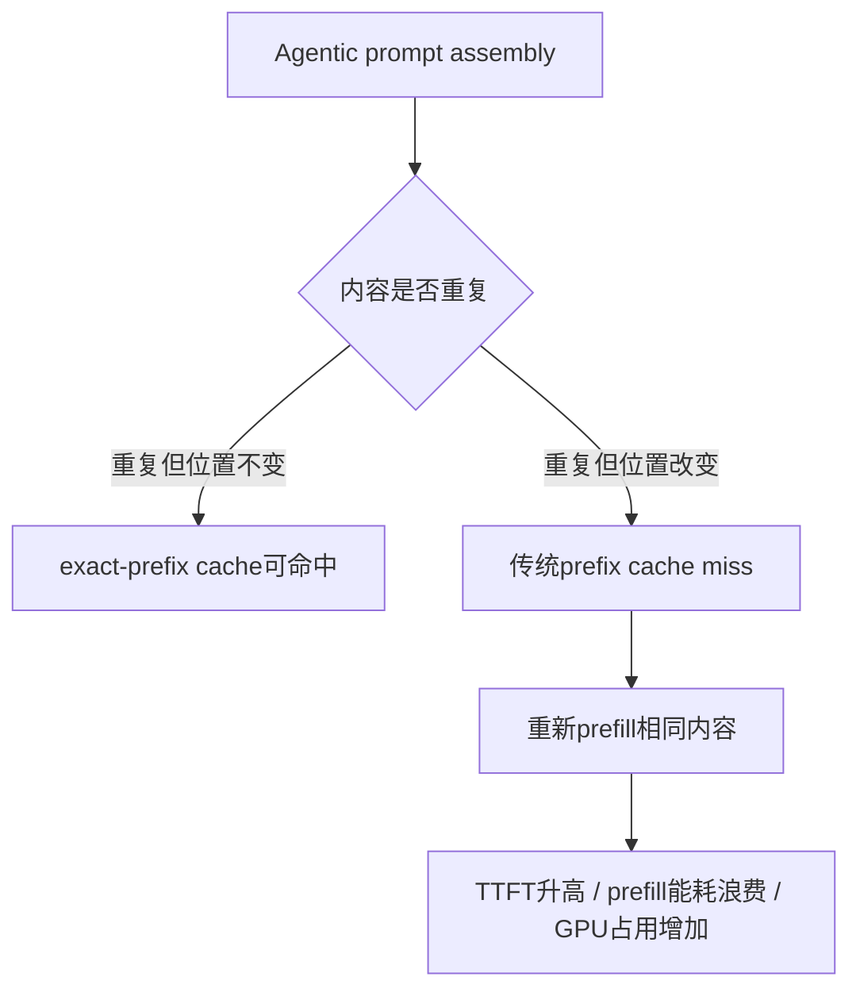
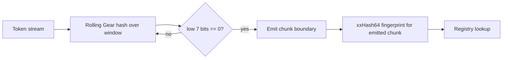

> 本文基于 arXiv:2605.05696v1《Irminsul: MLA-Native Position-Independent Caching for Agentic LLM Serving》整理，论文提交日期为 2026-05-07，本文阅读日期为 2026-06-04。Irminsul仍是论文系统和参考脚手架，文中明确说明恢复率测量运行在 observer mode，端到端TTFT还依赖FlashMLA中融合的$\delta$-rotation kernel。

# 1 先说结论

这篇论文的核心观点可以压缩成一句话：

**Agentic场景下，很多token内容没有变，只是位置变了；传统prefix cache按“从位置0开始的完全前缀”复用KV，所以一旦前面插入或重排内容就失效。MLA把KV拆成位置无关的$c_{KV}$和很小的RoPE位置片段$k_r$，因此可以按内容hash复用大部分KV，只对64维$k_r$做位置修正。**

Irminsul做的事情不是简单地把SGLang RadixAttention换成另一个cache，而是在原有exact-prefix命中之后，继续对剩余tail做内容寻址：

1. 先走SGLang已有RadixCache，能命中的完整前缀仍然直接复用。
2. 对未命中的tail做CDC，也就是content-defined chunking，把token切成按内容稳定的变长块。
3. 用chunk内容的hash去查注册表，而不是用绝对位置或固定block offset。
4. 如果命中，直接复用MLA的$c_{KV}$，并把缓存中的$k_r$按新旧位置差$\delta$旋转到目标位置。
5. 如果没有命中，就正常prefill并把新chunk写入内容hash注册表。

论文最有价值的地方在于它把“位置无关缓存”从一个通用系统优化问题，重新落到模型结构上解释：GQA/MHA当然也能做PIC，但它们的K整体被RoPE位置纠缠，需要对完整$d_K$做修正；MLA天然把位置相关部分压到了64维$k_r$，所以PIC的修正成本小很多。

重要结果：

- 在Toolathlon、CC-Bench、Hermes agent traces上，真实agentic轨迹存在大量“相同内容、不同位置”的token复用机会；Toolathlon within-session p95可到48%。
- 离线结构探针里，CDC+fallback比固定block hashing多找出约3.8到4.8倍复用。
- 位置不变性ROC显示，MLA的$c_{KV}$ AUC约0.77，说明同内容不同位置仍能稳定相似；RoPE片段$k_r$ AUC约0.43，说明不能直接复用，必须旋转修正。
- 能源实验显示，softmax attention架构中的cache hit能节省大量prefill能耗：GQA约86%，MLA约63%，MHA约66%；而Mamba2/GDN/KDA这类hybrid SSM/linear架构几乎没有收益。
- 在agent_meta这类“很早插入少量metadata，导致后面大段共享内容整体位移”的模式下，Irminsul在exact-prefix之外额外恢复77.2%到82.7%的prompt tokens。

我的判断：这篇论文最重要的贡献不是“实现了一个缓存表”，而是把MLA的表示分解、RoPE代数修正、agentic prompt组装模式和serving cache设计串成了一条完整路径。它也很诚实地留下了边界：端到端TTFT还没闭环、对MHA的安全性不作主张、对DeepSeek-V4 HCA这类跨token聚合结构不能直接适用。

# 2 问题背景：prefix cache为什么在agentic场景下失效

传统LLM serving里，prefix cache非常有效。假设两个请求是：

```text
请求1: [system prompt][tool schema][history][user A]
请求2: [system prompt][tool schema][history][user B]
```

前面大段完全相同，第二个请求只需要prefill不同后缀，已有前缀的KV可以直接复用。SGLang的RadixAttention和vLLM的prefix cache都在利用这个事实。

但agentic workflow的prompt不是静态拼接出来的。每一轮可能有：

- 系统提示词和agent metadata。
- 工具schema。
- 检索文档。
- 工具调用结果。
- 历史压缩结果。
- 多agent之间的中间状态。
- 动态排序后的RAG上下文。

这些片段的内容可能完全一样，但位置经常变化。例如：

```text
请求1: [SYS][DOC-A][DOC-B][DOC-C][TOOL][USER]
请求2: [SYS'][DOC-A][DOC-B][DOC-C][TOOL][USER']
请求3: [SYS][DOC-C][DOC-A][DOC-B][TOOL][USER'']
```

从人类视角看，`DOC-A/B/C`没有变。但从prefix cache视角看：

- 请求2在开头`SYS`变成`SYS'`，byte 0就分叉，后面全部无法命中。
- 请求3虽然`SYS`命中，但文档顺序变化后，prefix match很快结束。

这就是论文开头那句口号的含义：**Cache what you mean, not where you put it.** 要缓存“内容本身”，而不是“它在prompt的哪个绝对位置出现”。

用图表示就是：



Irminsul要解决的是第二条路径：内容重复，但位置变了。

# 3 PIC是什么：Position-Independent Caching

PIC，全称Position-Independent Caching，可以理解为：

**缓存的key不再只由“从位置0开始的token前缀”决定，而是由某段内容本身决定；当这段内容出现在新位置时，系统把缓存KV修正到新位置后复用。**

但是这里有一个关键问题：Transformer里的KV真的能换位置复用吗？

对于带RoPE的注意力，Key不是纯内容函数。简化地说，一个token在位置$p$的key会被旋转：

$$
K(p) = R(p)K_{\text{content}}
$$

如果把位置$p_{\text{src}}$算出来的K直接塞到位置$p_{\text{tgt}}$使用，就相当于把旧位置的旋转角度带到了新位置。它不是随机噪声，而是系统性错误。

所以PIC必须回答两个问题：

1. **如何找到相同内容？** 固定block hash容易因为offset不同而错过。
2. **如何修正位置？** 直接复用旧KV会错。

已有PIC系统如CacheBlend、EPIC、MEPIC、KV-Packet、SemShareKV主要面向GQA/MHA路径。它们可以修正或重算一部分token，但GQA的问题是：K整体都带位置纠缠，修正宽度是完整$d_K$。这在高吞吐serving里成本很重。

Irminsul的切入点是：MLA的KV结构刚好把这个问题拆开了。

# 4 MLA为什么适合位置无关缓存

MLA，全称Multi-Head Latent Attention。它的一个核心设计是：不要为每个token存完整K/V，而是存压缩后的latent KV。

论文关注的是生产里常见的absorbed-matmul MLA形式。每个token的KV行可以理解为两部分：

```text
KV row = [c_KV, k_r]
```

其中：

- $c_{KV}$：512维，position-free latent，论文也称NoPE部分。它携带主要内容信息，不带RoPE位置旋转。
- $k_r$：64维，RoPE key slice，携带位置相关信息。

完整K可以抽象成：

$$
K = [W^{UK}c_{KV}, k_r]
$$

V完全由$c_{KV}$派生。对于absorbed-matmul MLA，$W^{UK}$会被折叠进query投影，attention可以直接在$c_{KV}$上执行。因此Serving系统实际缓存和复用的重点就是：

1. 89%左右的$c_{KV}$可以按内容直接复用。
2. 11%左右的$k_r$不能直接复用，但可以闭式旋转修正。

如果某个chunk原来在位置$p_{\text{src}}$，现在出现在位置$p_{\text{tgt}}$，定义：

$$
\delta = p_{\text{tgt}} - p_{\text{src}}
$$

因为RoPE旋转满足组合关系：

$$
R(\delta)R(p_{\text{src}})=R(p_{\text{tgt}})
$$

所以可以把缓存中的$k_{r,\text{base}}$旋转到新位置：

$$
k_{r,\text{rotated}} = R(\delta)k_{r,\text{base}}
$$

这就是论文里的$\delta$-rotation。

和GQA对比：

| 架构 | 可直接位置无关复用的部分 | 必须位置修正的部分 | 修正代价 |
| --- | --- | --- | --- |
| GQA/MHA + RoPE | V相对安全，但K不可直接复用 | 完整K | $O(Nd_K)$ |
| MLA | $c_{KV}$，约512维 | $k_r$，64维 | $O(64N)$ |

这也是论文强调的结构性差异：不是GQA不能做PIC，而是MLA把PIC修正成本降到了更适合生产serving的级别。

# 5 Irminsul的整体serve path

Irminsul不是替代exact-prefix cache，而是在它后面补一个内容寻址层。

```mermaid
flowchart TD
    A[Incoming prompt tokens T] --> B[Standard RadixCache prefix match]
    B --> C[Exact-prefix KV output]
    B --> D[Unmatched tail]
    D --> E[CDC split into content-defined chunks]
    E --> F{hash(chunk) hits registry?}
    F -->|yes| G[Load cached c_KV and k_r_base]
    G --> H[delta = p_tgt - p_src]
    H --> I[Rotate k_r by R(delta)]
    I --> J[Append reused KV]
    F -->|no| K[Normal prefill chunk]
    K --> L[Insert hash -> c_KV, k_r_base, p_src]
    L --> J
    C --> M[Final KV for request]
    J --> M
```

对应伪代码可以写成：

```text
prefix, tail = prefix_match(T)
segments = CDC(tail)
kv_out = prefix.kv

for each segment s at target position p:
    if p < 32:
        kv = prefill(s)              # first-chunk carve-out
    elif registry[xxhash(s)] hits:
        c_KV, k_r_base, p_src = registry[xxhash(s)]
        delta = p - p_src
        k_r = R(delta) * k_r_base
        kv = (c_KV, k_r)
    else:
        kv = prefill(s)
        registry[xxhash(s)] = (c_KV, k_r_base, p)

    kv_out.append(kv)
```

这里有几个容易忽略的点：

- exact-prefix仍然是第一优先级，因为它零风险、零额外查找修正。
- Irminsul只处理tail中“prefix cache没吃到”的部分。
- 内容hash注册表保存的是chunk内容对应的$c_{KV}$、基准$k_r$和源位置$p_{\text{src}}$。
- 论文认为$\delta$-rotation可以融合进FlashMLA的HBM到SRAM加载路径，这样不会增加额外HBM带宽。
- 参考脚手架为了测量恢复率，在observer mode里记录would-be hit，不真正reroute KV；所以论文没有报告完整treatment TTFT。

# 6 CDC：为什么不用固定block hash

如果把tail按固定128 token切块并hash，听起来很简单，但agentic prompt的问题正是“offset不同”。

例如同一段文档前面多插入了13个token：

```text
请求1: [......][DOC starts at offset 1024][...]
请求2: [.............][DOC starts at offset 1037][...]
```

固定block边界会发生错位。即使文档内容一样，切出来的block也可能是：

```text
请求1 block: DOC token 0..127
请求2 block: DOC token 13..140
```

hash自然不同。

CDC，content-defined chunking，不按绝对offset切块，而是用滚动hash在内容中找边界。论文使用Gear-hash滚动状态，在低7位满足mask条件时发出边界，期望chunk大小约128 token，并把chunk长度限制在$[32,512]$。

简化流程如下：



论文还提到一个重要工程细节：如果滚动hash状态被不同prefix污染，同一共享区域仍可能切出不同边界。因此Irminsul默认使用S2策略，也就是prompt assembler在共享区域前后插入64 token的CDC boundary marker，让滚动状态重置到确定状态。

这个marker不是零成本API控制信号，而是模型能看到的普通token序列，会消耗上下文长度。它换来的好处是：共享区域的CDC边界不再依赖前面动态内容。论文的负控结果很直接：有marker时内容hash matching能到约77%，没有marker时会塌到约1%。

如果服务方不能控制prompt assembly，则使用S1 fallback：CDC chunk miss后，把chunk再切成固定128 token子窗口做二次hash查找。这更像离线恢复策略，热路径更复杂，但适合第三方网关或回放日志。

# 7 First-chunk carve-out：为什么前32个token要普通prefill

PIC还有一个安全问题：attention sink。

Softmax attention里，很多模型会把一部分attention mass集中到序列开头位置。EPIC这类系统会重算chunk边界token，避免错误的chunk-start sink。Irminsul重新测了这个现象，结论是：

**对论文测的MLA和GQA模型，sink更像sequence-start-local，而不是chunk-start-local。**

也就是说，真正特殊的是绝对位置0附近，而不是每个chunk自己的开头。论文测量了chunk内前$k=32$个token吸收attention的比例。当chunk放在$p=32$以后，MLA/GQA的sink ratio迅速降到接近$p \ge 1024$的baseline。MHA则不同，局部chunk-start sink更明显。

因此Irminsul采用first-chunk carve-out：

- 对绝对位置$p < 32$的token，不走PIC，正常prefill。
- 后续chunk可以用内容hash + $\delta$-rotation复用。
- 因为CDC最小chunk size被限制为32，这覆盖了最坏的sequence-start sink区域。

这也是论文只对MLA安全性作主张、不对MHA作主张的原因之一。MHA的sink形态在它们实验里不同，如果要做MHA-PIC，可能还需要EPIC式chunk-boundary recompute或其他机制。

# 8 位置不变性ROC：怎么证明$c_{KV}$能复用

论文没有只靠直觉说“$c_{KV}$不带位置所以可复用”，而是做了一个threshold-free ROC测试。

实验方式：

1. 选500个content blocks。
2. 把它们放到5个绝对位置：0、512、1024、2048、3584。
3. 同内容不同位置的pair作为positive。
4. 不同内容随机位置的pair作为negative。
5. 用cosine similarity扫阈值，算AUC。

解释：

- AUC大于0.5：内容信号强于位置噪声，说明这个tensor适合内容寻址复用。
- AUC小于0.5：位置纠缠压过内容信号，直接复用会比随机还糟。

论文报告的关键结果：

| 组件 | AUC结论 | 含义 |
| --- | --- | --- |
| MLA $c_{KV}$ / NoPE latent | 约0.77到0.78 | 同内容不同位置仍相似，适合复用 |
| MLA $k_r$ / RoPE slice | 约0.43 | 不能直接复用，必须$\delta$-rotation |
| GQA raw K | Qwen3-32B约0.453 | K整体位置纠缠 |
| MHA raw K | DS-MoE-16B约0.402 | K整体位置纠缠 |
| V | 约0.71到0.76 | V不被RoPE旋转，但只有V不够 |

这张表是论文的逻辑支点之一。它说明：

- 只复用V没有用，因为attention需要位置正确的K。
- GQA/MHA的K可以通过完整旋转或边界重算处理，但代价大。
- MLA的$c_{KV}$是大头，天然位置无关；小头$k_r$可闭式修正。

# 9 能耗实验：缓存命中到底省不省

位置无关缓存只有在cache hit能省实际成本时才有意义。论文用NVML能耗计数测了不同架构在三类事件下的prefill能耗：

- miss：完整prefill。
- exact_hit：完整缓存命中。
- partial_recompute：部分重算，论文表里展示50%重算。

核心结果：

| 架构 | 模型 | miss能耗 | hit能耗 | hit节省 |
| --- | --- | ---: | ---: | ---: |
| GQA | Qwen3-32B | 262.3 J | 37.5 J | 86% |
| MLA | DSv2-Lite + JoyAI-Flash均值 | 47.1 J | 17.2 J | 63% |
| MHA | DS-MoE-16B | 45.2 J | 15.3 J | 66% |
| Mamba2 | Nemotron-3-Nano-30B-A3B | 47.6 J | 47.7 J | 0% |
| GDN | Qwen3.6-35B-A3B | 44.1 J | 43.9 J | 0% |
| KDA | Kimi-Linear-48B-A3B | 37.5 J | 37.4 J | 0% |

这里要避免一个误读：**MLA不是让cache hit开始省能耗的原因。**

GQA/MHA只要真的命中，也能省大量prefill能耗。MLA的优势在于：让“位置改变后的内容命中”更便宜、更容易落到生产latency budget里。换句话说：

- softmax attention决定cache hit有没有节能价值。
- MLA的KV分解决定position-shifted hit的修正成本是否足够低。

hybrid SSM/linear架构的问题是，很多层的状态不是token-indexed KV，不能像attention KV那样按token append/fork/reuse。所以即使有局部attention层，整体prefill仍要重跑 recurrent pass，PIC收益接近0。

# 10 恢复率实验：Irminsul能多命中多少

论文最直接的系统结果是Table 3：Irminsul在exact-prefix之外还能恢复多少prompt tokens。

注意这张表里的TTFT是baseline observer mode的TTFT，不是完整Irminsul treatment TTFT。

| Pattern | Model | exact-prefix | Irminsul额外恢复 | 总缓存比例 | baseline TTFT |
| --- | --- | ---: | ---: | ---: | ---: |
| agent_meta | DSv2-Lite | 1.9% | 77.2% | 79.1% | 325 ms |
| agent_meta | JoyAI-48B | 1.5% | 82.7% | 84.3% | 582 ms |
| sysvar | DSv2-Lite | 73.7% | 26.3% | 100% | 302 ms |
| compact | DSv2-Lite | 99.5% | 0.4% | 99.9% | 268 ms |
| rerank | DSv2-Lite | 99.9% | 0.04% | 99.9% | 274 ms |
| tool_variants | DSv2-Lite | 99.96% | 0.04% | 100% | 283 ms |

这张表最值得看的不是最大值，而是分区诊断：

**Irminsul的边际价值，取决于prompt第一次变化发生在哪里。**

如果变化发生得很早，比如前面插入agent metadata，后面大段共享内容整体位移：

```text
请求1: [meta A][shared body......]
请求2: [meta B longer][shared body......]
```

exact-prefix几乎吃不到，Irminsul价值很大。

如果变化发生得很晚，前面长前缀已经完全一样：

```text
请求1: [long shared prefix......][small variant][tail]
请求2: [long shared prefix......][small variant'][tail]
```

RadixCache已经命中了大部分，Irminsul额外收益自然很小。

所以部署前可以先看两个统计：

1. first-variation position：第一次变化离prompt开头多远。
2. variation-set cardinality：变化片段的种类和排列有多复杂。

越早变化、后面共享体越大，Irminsul越有价值。

# 11 质量实验：$\delta$-rotation不能写错

Irminsul的安全性主要靠两层证据：

1. 数值误差：bf16下$\delta$-rotation的relative L2误差约$4.7 \times 10^{-3}$，不累积，低于或接近生产中可接受的KV量化扰动量级。
2. 输出一致性：对比full prefill、PIC和naive reuse，在QA、GovReport、NIAH等任务上测KL、argmax-match和greedy first-divergence。

论文报告：PIC在绝大多数cell里优于naive reuse，或者与其接近；Moonlight-16B、DSv2-Lite、JoyAI-48B等native MLA-MoE都在测试中覆盖。JoyAI-48B的NIAH里，PIC needle recall与full prefill同为0.820，KL从naive的0.624降到0.484。

但这里最重要的工程提醒是RoPE频率不能错。

不同模型的rotary embedding参数不同。论文在TransMLA-4B上做了一个case study：如果用朴素plain RoPE base=10000 fallback，PIC会塌到argmax-match 0.125、KL 3.51，比naive reuse还差；自动检测模型真实rotary class后，恢复到argmax-match 0.888、KL 0.054。

因此真正实现时，$\delta$-rotation不是“套个公式”就完事，至少要检查：

- 模型使用哪种rotary embedding类。
- `inv_freq`是否和模型配置一致。
- 是否有attention scaling。
- 是否存在transformers版本回退到错误RoPE实现的风险。
- 新模型的$\theta$是否在手工reference上过一遍。

# 12 和SGLang RadixAttention的关系

可以把SGLang现有prefix cache看成第一层索引：

```text
key = token sequence prefix from position 0
value = KV pool indices
```

Irminsul加的是第二层索引：

```text
key = content hash of CDC chunk
value = (c_KV, k_r_base, p_src)
```

两者不是互斥关系：

- exact-prefix命中：直接复用，最稳。
- exact-prefix miss的tail：再尝试content-addressed chunk复用。
- novel chunk：正常prefill并写入registry。

从SGLang角度看，Irminsul更像扩展RadixAttention的cache miss处理路径，而不是替换radix tree。论文也明确说是extends SGLang's radix cache。

更具体地说，传统RadixCache负责“这个请求从开头到哪里和历史完全一样”。Irminsul负责“剩下的部分里，有哪些片段虽然换了位置但内容已经算过”。

# 13 适用场景

我认为Irminsul最适合下面这些场景：

- 多agent系统里，公共工具schema、系统提示词、检索文档在不同agent或不同轮次中反复出现。
- RAG系统中，文档内容相同，但因为rerank、过滤、拼接模板变化导致位置改变。
- Coding agent中，长历史、文件片段、工具输出被压缩或重排。
- 同一服务承载大量相似任务，跨session有共享文档、共享规则、共享模板。
- 使用DeepSeek-V2/V3/R1、Moonlight/Kimi-K2、JoyAI-Flash这类absorbed-matmul MLA模型。

不太适合的情况：

- 请求之间主要只是共享长前缀，现有prefix cache已经接近100%命中。
- 内容重复很少，或者重复片段很短，CDC/hash/registry管理成本不划算。
- 主要模型是hybrid SSM/linear，prefill无法通过token KV缓存明显省掉。
- 使用非absorbed MLA，运行时仍要把$c_{KV}$上投影成完整K，收益曲线可能接近GQA。
- 使用DeepSeek-V4 HCA这类跨token聚合结构。论文指出HCA会消解Irminsul依赖的per-token identity，不能直接套用。

# 14 局限性和我认为需要继续看的问题

这篇论文的边界写得比较清楚，读的时候不要把结果外推过头。

## 14.1 端到端TTFT还没有真正闭环

论文恢复率实验运行在observer mode：记录would-be hit，但不真正reroute KV。因此Table 3的TTFT是baseline TTFT，不能直接当成Irminsul上线后的TTFT。

作者认为生产版应把$\delta$-rotation融合进FlashMLA load path，避免额外HBM带宽。但这部分在论文中还是follow-up。实际部署时最关键的benchmark应该是：

- p50/p95 TTFT。
- decode吞吐是否受影响。
- registry lookup和CDC开销。
- KV pool碎片和驱逐开销。
- 多租户/多LoRA/多模型隔离成本。

## 14.2 CDC marker消耗上下文长度

S2策略需要在共享区域周围插入64 token marker。它不是免费元数据，而是模型可见文本。需要评估：

- marker对模型输出是否有语义干扰。
- 多个共享区域时上下文开销是否可接受。
- prompt模板是否能稳定插入marker。
- 对第三方prompt或用户原始输入是否可控。

如果不能控制prompt assembly，就要用S1 fallback，热路径复杂度会变高。

## 14.3 内容hash注册表的工程问题还很多

论文重点在机制可行性，生产系统还要处理：

- hash collision如何防护。
- registry如何跨请求、跨进程、跨GPU共享。
- KV生命周期和eviction policy。
- chunk粒度和显存碎片的权衡。
- 与paged attention block size如何协调。
- speculative decoding、LoRA、adapter、quantization、prompt cache salt等命名空间隔离。

这些问题不是否定Irminsul，但决定它能否从论文系统变成线上runtime的一部分。

## 14.4 安全性目前主要覆盖MLA

论文对MHA明确保守：MHA的attention sink在实验里更像chunk-local，Irminsul的first-chunk carve-out不足以覆盖。GQA虽然能做PIC，但修正完整K的代价更大，已经有其他PIC系统路线。

因此这篇论文的强结论应该限定为：

**对absorbed-matmul MLA，内容寻址 + $c_{KV}$复用 + $k_r$的$\delta$-rotation是一条很自然的PIC路径。**

不要泛化成“所有Transformer都可以无代价位置无关缓存”。

# 15 一个简单例子：为什么$\delta$-rotation有效

假设某个chunk第一次出现时从位置100开始。缓存注册表保存：

```text
hash(DOC-A chunk) -> (c_KV, k_r_base, p_src=100)
```

下一次同一个chunk出现在位置350。直接复用$c_{KV}$没问题，因为它不带绝对位置。$k_r$需要从位置100修正到位置350：

$$
\delta = 350 - 100 = 250
$$

于是：

$$
k_r(350) = R(250) k_r(100)
$$

反过来，如果chunk从位置360移动到位置110：

$$
\delta = 110 - 360 = -250
$$

就做负方向旋转：

$$
k_r(110) = R(-250) k_r(360)
$$

这个修正只发生在64维$k_r$上，而不是完整K上。这就是MLA-native PIC的性能直觉。

# 16 总结

Irminsul把agentic LLM serving里的一个常见浪费讲清楚了：很多prefill不是在计算新信息，而是在不同位置重复计算同一段内容。传统prefix cache只能捕捉“从开头完全一样”的复用；agentic prompt更需要“内容一样但位置不同”的复用。

论文的关键链条是：

1. Agentic workload确实存在大量position-shifted reuse。
2. 固定block hash会因为offset错位漏掉复用，CDC更适合按内容切块。
3. MLA把KV拆成位置无关$c_{KV}$和64维RoPE片段$k_r$。
4. $c_{KV}$可直接内容寻址复用，$k_r$通过$\delta$-rotation修正。
5. 对absorbed-matmul MLA，这把PIC的 per-hit 修正成本压到$O(64N)$。
6. 收益主要出现在“变化点很早，后面共享体很大”的agentic prompt。

如果未来推理框架要更好地服务agentic workload，cache key很可能不能只停留在prefix层面。Irminsul给出的方向是：把serving cache从“字符串前缀缓存”推进到“内容寻址的KV对象缓存”，并让模型结构承担一部分可复用性的设计责任。

# 参考

- Bole Ma, Jan Eitzinger, Harald Köstler. [Irminsul: MLA-Native Position-Independent Caching for Agentic LLM Serving](https://arxiv.org/abs/2605.05696), arXiv:2605.05696v1, 2026.
- 论文PDF：[https://arxiv.org/pdf/2605.05696](https://arxiv.org/pdf/2605.05696)
- DeepSeek-AI. [DeepSeek-V2: A Strong, Economical, and Efficient Mixture-of-Experts Language Model](https://arxiv.org/abs/2405.04434), 2024.
- DeepSeek-AI. [FlashMLA: Efficient MLA decoding kernel](https://github.com/deepseek-ai/FlashMLA), 2025.
- SGLang项目：[https://github.com/sgl-project/sglang](https://github.com/sgl-project/sglang)
