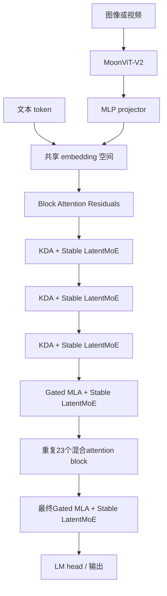
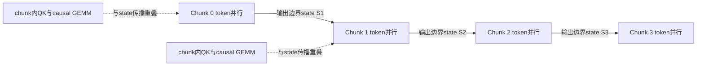
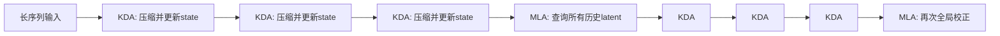
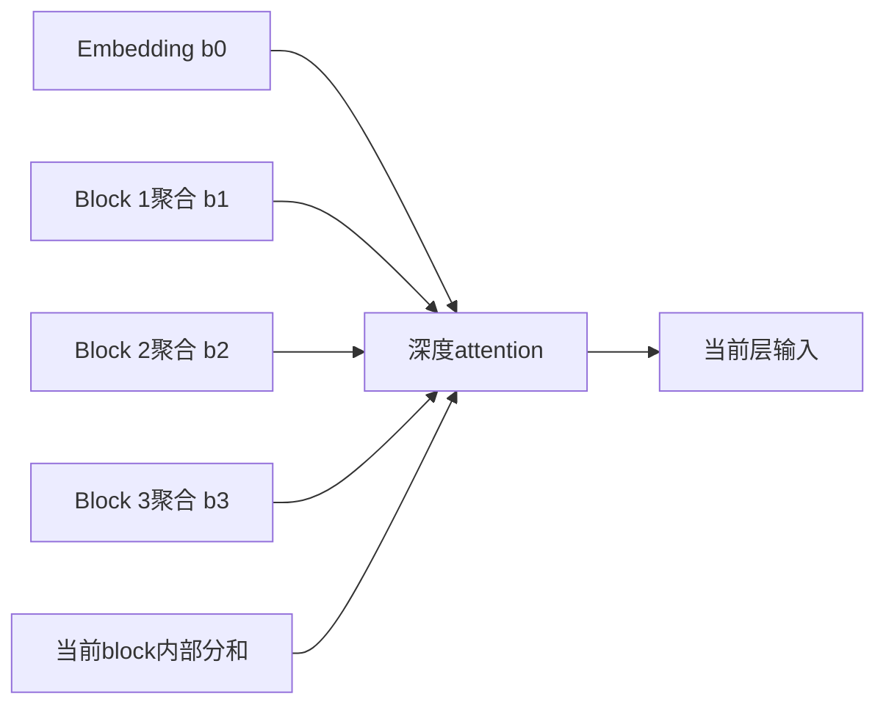
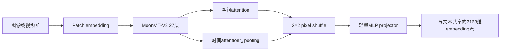
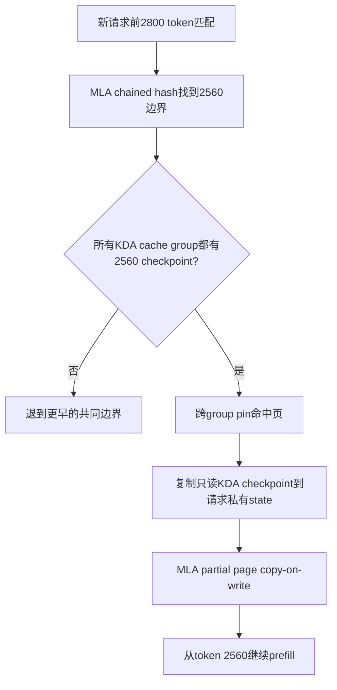

> 版本说明：本文基于Moonshot AI官方Kimi K3技术报告、官方仓库`3cb39df`（报告更新于2026-08-06）、官方技术博客和部署文档整理。架构、训练和系统数据来自官方报告；带有“估算”“推导”字样的内容是本文根据公开维度计算的结果。本文没有复现2.8T模型的训练、1M上下文评测或多机推理，官方benchmark也不应直接等同于跨厂商、同预算、同harness的独立比较。

## 1. 先说结论

Kimi K3不是简单地把Kimi K2放大到2.8T参数。它的核心思路是沿三个方向分别解决信息流和计算成本问题：

1. **序列方向**：用69层Kimi Delta Attention（KDA）把长历史压进固定大小的递归状态，每隔三层插入一层Gated MLA恢复全局token-to-token检索能力。
2. **深度方向**：用Attention Residuals（AttnRes）让当前层从embedding和前面多个block的输出中选择信息，而不是把所有历史层都压进一条普通残差流。
3. **宽度方向**：用Stable LatentMoE让896个routed expert在3584维latent空间工作，每个token只激活16个；两个shared expert继续走7168维全宽路径。
4. **模态方向**：用从零训练的401M参数MoonViT-V2把图像和视频映射进同一个token流，从预训练开始就与语言骨干联合优化。
5. **部署方向**：只把占参数大头的MoE expert权重量化为MXFP4，expert输入激活使用MXFP8；KDA state、MLA latent KV、AttnRes状态和MoE通信则分别设计专用缓存与kernel。

官方给出的模型规模是2.78T总参数、104.2B激活参数、93层、1,048,576 token上下文。这里必须先澄清三个最容易被误读的数字：

- **2.8T不是每个token都计算2.8T参数**。MoE每层只选择16/896个routed expert，并始终运行2个shared expert；官方口径下每token激活约104B参数。
- **1M上下文不意味着每层都做1M长度的softmax attention**。四分之三的attention层是线性递归KDA，只有四分之一左右是全局MLA。
- **“相对Kimi K2约2.5倍scaling efficiency”不是推理吞吐提升2.5倍**。它表示官方拟合的缩放律中，达到相同验证损失所需的训练计算量约降到原来的1/2.5，是架构、数据和训练recipe的合并结果。

一句话概括：

**Kimi K3用KDA压缩时间轴，用AttnRes打开深度轴，用LatentMoE稀疏扩展宽度轴，再用周期性MLA弥补递归状态的全局检索上限。**

## 2. 先建立整机视图

### 2.1 关键配置

| 项目 | Kimi K3公开配置 | 含义 |
|---|---:|---|
| 总参数 | 2.78T，通常写作2.8T | 决定权重存储、加载和跨设备切分难度 |
| 激活参数 | 104.2B，通常写作104B | 更接近单token前向计算规模，但不等于精确FLOPs |
| Transformer层 | 93 | 69层KDA + 24层Gated MLA |
| Dense层 | 1 | 其余层使用MoE通道混合 |
| 模型宽度 | 7168 | 主干hidden state维度$d$ |
| Attention heads | 96 | 报告没有在摘要表中进一步给出全部head内部维度 |
| LatentMoE宽度 | 3584 | routed path只有主干宽度的一半 |
| Expert hidden | 3072 | 每个expert的中间维度 |
| Routed experts | 896 | 每层可选专家池 |
| 每token选择 | 16 | 稀疏度为$896/16=56$ |
| Shared experts | 2 | 每个token都会经过的全宽公共路径 |
| 词表 | 160K | 与Kimi K2相同 |
| 上下文 | 1,048,576 | 通过NoPE、KDA和渐进长上下文训练实现 |
| 激活函数 | SiTU-GLU | 对SwiGLU两条乘法支路做平滑限幅 |
| 视觉编码器 | MoonViT-V2，401M，27层 | 从零开始与LLM联合训练 |
| 部署量化 | expert权重MXFP4，expert激活MXFP8 | 非expert模块保留更高精度 |
| MTP | 1层 | 后训练为EAGLE-3风格draft model |

### 2.2 93层是怎样排出来的

K3重复23次“3层KDA + 1层Gated MLA”：

$$
23 \times (3 + 1) = 92
$$

骨干末尾再放一层Gated MLA，保证最终输出前一定经过全局attention：

$$
69\ \text{KDA} + 23\ \text{periodic MLA} + 1\ \text{final MLA} = 93
$$

每个attention层后都有通道混合模块；配置表列出1个Dense层，其余约92层使用Stable LatentMoE。为了描述AttnRes，93层又按每12层组成一个深度block，共8个block，最后一个不满12层；再把embedding算作一个可检索源，一共有9个block级来源。



这个图里有两个不同含义的“block”：

- hybrid attention block是`3×KDA + 1×MLA`，描述序列混合方式。
- AttnRes block是最多12个Transformer层，描述深度方向的信息聚合和缓存单位。

不要把二者混为一谈。

## 3. KDA：把无限增长的历史变成固定大小的状态

### 3.1 从普通attention的成本说起

标准causal attention在decode第$t$个token时，需要读取之前$t-1$个token的K/V。即使使用FlashAttention和PagedAttention，它仍然有两个随长度增长的事实：

1. 每个请求的KV Cache容量近似为$O(T)$。
2. decode每一步读取历史KV的工作近似为$O(T)$。

当上下文来到1M token，这种增长会同时压缩并发数、增加HBM流量，并让跨节点缓存迁移变得昂贵。

线性attention的另一条路线是把历史压成固定大小矩阵：

$$
S_t = S_{t-1} + k_t v_t^\top, \qquad \tilde{o}_t = S_t^\top q_t
$$

这样decode只保留$S_t$，不再保留每个历史token的完整K/V。但简单累加会不断覆盖、污染旧记忆，也缺少可控遗忘。KDA在此基础上加入delta rule和逐key-channel forget gate。

### 3.2 KDA的递推式

对单个head，令：

- $q_t,k_t \in \mathbb{R}^{d_k}$；
- $v_t \in \mathbb{R}^{d_v}$；
- $S_t \in \mathbb{R}^{d_k \times d_v}$；
- $\alpha_t \in (0,1)^{d_k}$是逐key channel保留率；
- $\beta_t \in (0,1)$是当前token的写入强度。

先对旧状态逐channel衰减，再做delta-rule写入，可以写成：

$$
\bar{S}_{t-1} = \mathrm{Diag}(\alpha_t)S_{t-1}
$$

$$
S_t = \bar{S}_{t-1} + \beta_t k_t\left(v_t - \bar{S}_{t-1}^{\top}k_t\right)^\top
$$

等价地：

$$
S_t = \left(I-\beta_t k_tk_t^\top\right)\mathrm{Diag}(\alpha_t)S_{t-1}
      + \beta_t k_tv_t^\top
$$

最终读取：

$$
\tilde{o}_t=S_t^\top q_t
$$

直觉可以分成四步：

1. $\alpha_t$决定旧记忆的不同key channel保留多少。
2. 用当前$key$从旧状态读出预测值$\bar{S}_{t-1}^{\top}k_t$。
3. 只把真实$v_t$与预测值的误差写回，而不是无条件叠加$v_t$。
4. 当前$q_t$再从更新后的状态读取输出。

delta rule的重要意义是“写入纠错”：如果当前$key$对应的内容已经被状态准确表示，就少写；如果预测错误，就沿$key$方向修正状态。

### 3.3 K3怎样产生$q/k/v/\alpha/\beta$

KDA不是只换了attention公式，它还给这些量设计了专门的数据路径：

- $q/k/v$先做线性投影、ShortConv和Swish。
- $q/k$额外做L2 normalization，控制点积和递推尺度。
- $\beta$由输入经过线性层和Sigmoid得到。
- $\alpha$先通过低秩投影与head-specific bias得到逐channel logit，再映射成保留率。
- 递推输出做head-wise RMSNorm，随后经过输入相关的full-rank gate。

输出门为：

$$
y_t=W_o\left[\mathrm{Sigmoid}(W_gx_t)\odot
\mathrm{RMSNorm}(\tilde{o}_t)\right]
$$

相对Kimi Linear，K3把低秩输出门换成full-rank投影，让每个token能独立控制所有输出channel。

### 3.4 为什么要给decay设置下界

KDA训练和prefill不能真的逐token串行跑。官方采用chunkwise算法：chunk之间传递$S$，chunk内部把token交互改写成带因果下三角mask的矩阵乘。

问题出在累计衰减。设一个chunk内从位置$i$到$j$的累计保留率为：

$$
\gamma^{i\rightarrow j}=\prod_{r=i}^{j}\alpha_r
$$

并行改写里会出现$1/\gamma$。如果单步$\alpha$可以无限接近0，多个token相乘后$\gamma$会下溢，而倒数会溢出。Kimi Linear需要在log space计算，并对16-token对角tile走显式position-pair路径；这条路径难以充分使用Tensor Core。

K3把log-decay改为有界映射：

$$
g_t=g_{\min}\,\mathrm{Sigmoid}(e^A z_t),\qquad
\alpha_t=\exp(g_t),\qquad g_{\min}=-5
$$

因此：

$$
e^{-5}<\alpha_{t,j}<1
$$

16个token tile的累计log-decay落在$(-80,0)$，倒数小于$e^{80}$，仍在BF16动态范围内。于是对角和非对角causal tile都能转为dense Tensor Core GEMM。

这是一个典型的算法与kernel共同设计：**数学上限制遗忘门的最小值，换来数值范围可控和统一的Tensor Core执行路径。**

### 3.5 Chunkwise KDA到底并行了什么



它不是消除了递推依赖，而是把依赖提升到chunk边界：

- chunk内部：并行计算token间的intra-chunk贡献。
- chunk之间：按顺序传递固定大小的recurrent state。
- FlashKDA：把token-parallel阶段与head-parallel recurrence重叠，减少串行阶段让SM空闲的时间。

### 3.6 跨卡KDA Context Parallelism

普通softmax attention做context parallel时，需要交换随序列长度增长的KV block。KDA只需交换固定大小状态，但它的状态更新不是简单相加。

对一个序列片段，KDA的作用可以抽象成仿射变换：

$$
S_{\text{out}}=M_{\text{segment}}S_{\text{in}}+widetilde{S}_{\text{segment}}
$$

其中：

- $M_{\text{segment}}$表示这个片段对进入状态的累计衰减与修正；
- $\widetilde{S}_{\text{segment}}$表示从零状态开始时，该片段自己产生的状态。

不同rank可以先独立算出自己的$(M,\widetilde{S})$，再通过all-gather和prefix scan按顺序组合。仿射变换的组合满足结合律：

$$
(M_2,b_2)\circ(M_1,b_1)
=\left(M_2M_1,\ M_2b_1+b_2\right)
$$

所以KCP同步的是固定大小片段摘要，而不是长度为$T$的KV序列。官方报告称这实现了线性compute scaling。

### 3.7 固定大小不等于没有成本

KDA state对序列长度是$O(1)$，但对层数、head数和$d_kd_v$仍然很大：

$$
\text{StateBytes}
\approx L_{\text{KDA}}\times H\times d_k\times d_v\times \text{dtype bytes}
$$

报告没有在模型摘要表里公开足够的head内部维度，不能仅凭7168和96 heads准确计算每请求state字节数。工程上应避免把“常数状态”误解为“可以忽略的状态”。官方SGLang部署文档甚至直接把KDA state pool称为并发上限之一。

## 4. Gated MLA：周期性恢复全局内容检索

### 4.1 MLA缓存的不是完整多头K/V

Multi-head Latent Attention先把token hidden state压缩为latent：

$$
c_t=W_cx_t
$$

推理时缓存$c_t$，attention计算再通过up-projection恢复content key和value。相对为每个head分别缓存K/V，latent cache显著降低每token缓存大小。

K3的MLA与K2/K2.5有两个关键差异：

1. **所有MLA层都使用NoPE**，query和key不加显式位置编码。
2. **输出增加full-rank channel gate**：

$$
y_t=W_o\left[\mathrm{Sigmoid}(W_gx_t)\odot\tilde{o}_t\right]
$$

位置和近因信息主要由中间的KDA递推携带，MLA负责不受限的全局内容交互。没有RoPE也意味着扩展到1M时不需要重调RoPE base或使用YaRN插值。

### 4.2 为什么不能全用KDA

固定大小$S_t$必然是对历史的有损压缩。序列越长，需要被同一个状态表达的事实、代码符号、视觉元素和工具轨迹越多。递推模型擅长持续更新和局部/近因模式，但很难保证任意早期细节都能按内容精确取回。

全局MLA保留逐token latent，使当前token能直接和任意历史位置做内容匹配。K3用3:1比例进行职责分工：

| 维度 | KDA | Gated MLA |
|---|---|---|
| 历史表示 | 固定大小递归矩阵 | 随token增长的latent序列 |
| decode状态增长 | $O(1)$ | $O(T)$ |
| 单步历史读取 | 与$T$无关 | 随$T$增长 |
| 信息性质 | 压缩、递归、带遗忘 | 全局、逐位置、内容寻址 |
| 位置机制 | decay、gate与递推隐式编码 | NoPE，由KDA提供位置敏感上下文 |
| 主要作用 | 低成本长程状态传播 | 周期性恢复高容量全局交互 |



### 4.3 训练kernel里的一个精度细节

报告指出，FlashAttention存在有偏舍入误差，因此K3训练时把attention output保留为FP32。FP32输出tile会把片上空间翻倍，官方kernel没有简单接受这个成本，而是让输出tile与KV staging buffer重叠复用shared memory，释放空间以加深KV pipeline。

这说明“模型使用低精度训练”并不代表所有中间量都一刀切到低精度；误差敏感位置仍可能保留FP32。

## 5. Attention Residuals：在深度方向做attention

### 5.1 普通残差为什么像深度方向的RNN

标准Transformer层近似为：

$$
h_{l+1}=h_l+f_l(h_l)
$$

第$l$层能看到的所有早期信息都被压进单个$h_l$。这和RNN把整个时间历史压进一个state很相似：路径短、实现简单，但当前层不能直接选择“我要embedding、第三个block还是第七个block的表示”。

AttnRes把attention的思想旋转90度：token位置不变，在layer depth上选择历史表示。

### 5.2 Full AttnRes

对第$l$层，定义可学习pseudo-query：

$$
q_l=w_l
$$

embedding和每个前序层输出作为key/value，key先做RMSNorm：

$$
\phi(q_l,k_i)=\exp\left(q_l^\top\mathrm{RMSNorm}(k_i)\right)
$$

$$
\alpha_{i\rightarrow l}
=\frac{\phi(q_l,k_i)}{\sum_{j=0}^{l-1}\phi(q_l,k_j)},
\qquad
h_l=\sum_{i=0}^{l-1}\alpha_{i\rightarrow l}v_i
$$

这里有两个细节：

- pseudo-query是每层学习的参数，不是为每个token临时生成的query。
- attention weight仍然依赖当前token在各历史层的表示，因为key/value随token而变。

网络深度不到100，所以$O(L^2d)$算术不是最大问题；真正昂贵的是保留所有层输出需要$O(Ld)$activation memory，并且pipeline parallel时要跨stage传这些表示。

### 5.3 Block AttnRes

K3不保留全部93层输出，而是每12层聚合成一个block representation。第$n$个block内部维护部分和，跨block只对这些聚合表示做attention：



这样把保存与通信开销从$O(Ld)$降为$O(Nd)$。K3采用8个最多12层的block，加上embedding一共9个来源。block内的顺序部分和与block间的并行attention用online softmax合并。

推理实现也围绕内存流量优化：

- prefill对activation使用sequence parallel，避免每个TP rank都复制block representation。
- decode把inter-block kernel放到side stream，与主stream的独立计算重叠。
- intra-block合并、partial-sum更新和后续RMSNorm融合进前一个TP all-reduce。

AttnRes不是“免费跳连”。它用更直接的深度检索换来额外activation状态、内存读取和并行实现复杂度。

## 6. Stable LatentMoE：896个专家为什么还能选16个

### 6.1 先把full width和routed width分开

普通MoE把7168维token发送给每个被选expert。如果expert池和top-k同时增大，dispatch通信、expert输入流量和权重读取都会变重。

LatentMoE把路径拆为：

- 两个shared expert直接处理$x\in\mathbb{R}^{7168}$，承载通用变换。
- routed path先用$W_{\downarrow}$把$x$压到$z\in\mathbb{R}^{3584}$。
- router从896个latent expert中选择16个。
- 聚合后做RMSNorm，再用$W_{\uparrow}$升回7168维。

$$
z=W_{\downarrow}x
$$

$$
u=\sum_{i\in T_{16}(x)}p_iE_i^{\text{routed}}(z)
$$

$$
y=\sum_{j=1}^{2}E_j^{\text{shared}}(x)
+W_{\uparrow}\mathrm{RMSNorm}(u)
$$

先降到一半宽度，top-16才不会把16份7168维通信和expert计算直接压到系统上。

### 6.2 2.8T参数主要在哪里

把一个routed expert粗略视为GLU的三块矩阵，忽略bias和其他小项，则单expert参数约为：

$$
3\times3584\times3072\approx33.0\ \text{M}
$$

每个MoE层的896个routed expert约为：

$$
896\times33.0\ \text{M}\approx29.6\ \text{B}
$$

如果约92个MoE层都采用这个结构，仅routed expert粗估就约为：

$$
92\times29.6\ \text{B}\approx2.72\ \text{T}
$$

这只是根据公开维度做的量级估算，不是官方逐tensor参数清单，但它解释了2.78T从哪里来：**绝大多数参数在每层896个latent expert的权重里。**

对一个token，routed path只激活16个expert，单层相关expert权重粗估为：

$$
16\times33.0\ \text{M}\approx528\ \text{M}
$$

再加两个shared expert、attention、router、latent projection、embedding和其他dense模块，才构成官方104.2B activated parameters口径。不能把528M乘层数直接当成精确激活参数，因为shared expert内部维度、首个dense层和各attention投影也必须计入。

### 6.3 为什么原始LatentMoE在这个规模会不稳定

K3把expert池扩大到896，且每token选择16个。官方观察到两类问题：

1. routed path形成$W_{\downarrow}\rightarrow$ gated expert FFN $\rightarrow W_{\uparrow}$，接近连续四次矩阵乘，内部activation容易爆炸。
2. 近千个expert让原有auxiliary-loss-free动态bias难以及时平衡负载，可能出现过热expert和dying expert。

Stable LatentMoE用了三个修复。

### 6.4 修复一：up-projection前做RMSNorm

不同token选到不同expert，routing weight也不同，聚合结果$u$的尺度会波动。K3在$W_{\uparrow}$之前加入RMSNorm，使升维投影看到更稳定的输入。报告称这不仅改善训练稳定性，也持续改善validation loss和下游评测。

### 6.5 修复二：SiTU-GLU同时限制两条支路

SwiGLU近似为：

$$
\mathrm{Swish}(W_gx)\odot W_ux
$$

两条乘法支路都无界。当两个大坐标相乘时，低精度训练很容易产生outlier或overflow。

K3提出Sigmoid Tanh Unit GLU：

$$
\mathrm{SiTU\mbox{-}GLU}(x)=
\left[\beta_1\tanh\left(\frac{W_gx}{\beta_1}\right)
\odot\mathrm{Sigmoid}(W_gx)\right]
\odot
\left[\beta_2\tanh\left(\frac{W_ux}{\beta_2}\right)\right]
$$

其中$\beta_1=4$、$\beta_2=25$。在原点附近，tanh近似线性，所以它保留SwiGLU的局部形状；大输入时两条支路分别平滑饱和，逐元素输出绝对值上界为：

$$
|f(x)|\le\beta_1\beta_2=100
$$

它不是硬clamp，梯度和函数仍然连续。

### 6.6 修复三：Quantile Balancing

K3 router先得到原始分数：

$$
s_i=\mathrm{Sigmoid}(W_rx_i)
$$

Top-k选择时加入每个expert的bias $b$：

$$
T_i=\operatorname{argtopk}(s_i+b)
$$

但真正的mixture weight不含$b$：

$$
p_{i,j}=\frac{s_{i,j}}{\sum_{r\in T_i}s_{i,r}},\qquad j\in T_i
$$

这意味着bias只改变“派给谁”，不直接改变expert输出的混合比例，也不进入router的梯度优化。

旧方法每步按负载高低给bias加减固定$\gamma$，会在“响应慢”和“来回振荡”之间取舍。Quantile Balancing直接问：如果本batch有$m$个token、$n$个expert、每token选$k$个，那么每个expert目标负载应为：

$$
q=\frac{mk}{n}
$$

对每个token多取一个Top-$(k+1)$ cutoff $\alpha_i$，再根据expert $j$的margin $s_{i,j}-\alpha_i$的$(1-k/n)$分位数设置下一步bias，使恰好约$q$个margin跨过门槛。更新只在下一step生效，避免用当前batch计算的bias反过来改变当前batch路由。

大规模训练无法收集数百万margin做精确quantile，因此每个rank先做直方图，再all-reduce bin count，从全局直方图估计quantile。通信量只有每expert几百个bin。训练结束后bias冻结，推理不再动态更新。

### 6.7 MoonEP解决的是执行负载，不是router数学

即使QB让长期路由更平衡，单个microbatch和单层仍可能在EP rank之间不均衡。MoonEP允许在线规划并迁移少量冗余expert，使每个rank收到相同的$S\times K$ token数：

- 当前microbatch根据router输出规划冗余expert位置。
- forward前prefetch冗余expert。
- backward把冗余expert梯度reduce回home rank。
- 每rank最多预留$E/R$个冗余expert slot，官方给出总能找到平衡方案的证明。
- 完全平衡后各rank shape静态已知，可去掉每层host同步，并使用zero-copy permute/unpermute路径。

QB解决“模型学到的路由是否健康”，MoonEP解决“这一轮实际执行是否让某些设备等另一些设备”。两者处在不同层次。

## 7. MoonViT-V2：原生多模态不是外挂视觉塔

### 7.1 从零训练，而不是从SigLIP接入

Kimi K2.5使用对比学习预训练的视觉编码器。K3改为让MoonViT-V2从随机初始化开始，与LLM一起用next-token prediction训练。

官方给出的原因首先是稳定性：把SigLIP初始化的MoonViT-3D接到LLM后，vision tower长期有更高gradient norm和频繁spike；从零训练的MoonViT-V2更稳定。其次，语言建模目标可以让视觉表示更关注OCR、代码结构、UI细节等下一token预测真正需要的线索，而不是只优化全局图文语义对齐。

官方消融称，从零训练版本在视觉评测上能匹配SigLIP初始化基线，因此在K3规模下，对比预训练不再是必要初始化条件。这个结论应限定在其数据、规模和训练recipe内，不能直接推广成“小模型也不需要视觉预训练”。

### 7.2 视觉路径

MoonViT-V2公开配置为：

- 401M参数、27层、patch size 14、12个attention heads。
- 使用RMSNorm，移除linear和attention projection的所有bias。
- 图像与视频完全共享参数。
- 视频attention拆成frame内spatial attention和frame间temporal attention。
- temporal pooling沿时间维压缩视频token。
- projector前做$2\times2$ pixel shuffle downsampling，视觉token数降为四分之一。
- 支持最高3584×3584像素输入，放入同一个1M上下文。



所谓“原生”具体指：视觉和文本从pre-training起就在同一个next-token objective中联合优化，不是先训练纯文本LLM，再额外做一个视觉alignment stage。

## 8. Per-Head Muon与长上下文训练

### 8.1 为什么Muon按head正交化

K3延续K2，对矩阵参数使用Muon optimizer。Muon会对momentum matrix做Newton-Schulz orthogonalization。若把整个Q/K/V projection当成一块，不同attention head的gradient scale会相互竞争：大尺度head主导更新方向，小尺度head得到的归一化不足。

K3把Q/K/V momentum按head拆开，分别正交化：

- 各head更新尺度更平衡。
- 大规模训练更稳定。
- 对较窄的per-head矩阵跑Newton-Schulz，也略微降低optimizer开销。

训练系统没有在每个DP rank all-gather完整参数再做Muon，而是让rank只通过P2P取回自己负责参数的shard，并按model chunk让通信与正交化流水重叠。

### 8.2 NoPE怎样扩到1M

K3所有MLA层都没有RoPE，KDA通过递推、decay和gate隐式表达顺序。因此从64K扩到1M不需要修改位置编码参数。

但NoPE只解决“位置参数不阻碍外推”，不等于模型天然会使用1M上下文。官方仍然做了四阶段curriculum：

```text
pre-training: 8K -> 64K
cooldown:    256K -> 1M
```

长上下文数据还经过：

- exact/fuzzy deduplication和质量过滤；
- 视频frame perceptual hash去重；
- 长文档、长视频上采样；
- 拼接和重排多模态文档/子任务，使答案依赖分散在整个1M窗口的信息。

最后一项很重要：仅把短文档填充或拼长，模型可能仍只学局部模式；训练样本必须真的要求跨长距离整合信息。

## 9. 部署感知后训练：MXFP4与MTP

### 9.1 不是全模型FP4

K3从SFT开始，在整个SFT和RL阶段执行quantization-aware training：

- MoE routed expert权重：MXFP4。
- expert输入activation：MXFP8。
- attention projection、LatentMoE的$W_{\downarrow}/W_{\uparrow}$、shared expert和router：更高精度。

这样做的依据是routed expert占绝大多数权重内存，量化它们收益最大；把数值敏感且参数占比较小的模块也压到FP4，风险高而节省有限。

RL rollout和训练使用同一量化scheme，减少训练策略与实际部署推理之间的数值偏差。

粗略看，2.78T参数若全部按4 bit保存，纯权重下界也约为：

$$
2.78\times10^{12}\times0.5\ \text{byte}\approx1.39\ \text{TB}
$$

实际部署还需要scale、非expert高精度权重、runtime buffer、KDA state、MLA cache和通信空间，所以不能用“1.39TB除以单卡显存”直接得出可靠卡数。

### 9.2 MTP怎样变成draft model

K3预训练包含一个结构类似backbone block的MTP层。后训练时把它改造成EAGLE-3风格单层draft model：

- target model冻结，只更新draft层和feature-fusion projection。
- draft融合target低、中、高层feature。
- 训练时unroll 7步，使后续step使用draft自己的历史输出，贴近推理时递归draft。

这为speculative decoding提供了原生起点，但KDA让回滚比普通KV模型复杂：draft token可能被拒绝，而recurrent state已经原地前进。

官方推理kernel不为每个draft位置复制整份KDA state，而是缓存更小的projected input。验证后，在片上重放被接受token，重建正确state，并把verified token和bonus token的state写回。短卷积、输入归一化、gate、KDA recurrence和输出归一化被融合进同一个recurrent kernel。

## 10. 推理系统真正要管理两种cache

### 10.1 KDA state与MLA KV不能用同一语义

| 属性 | KDA cache | MLA cache |
|---|---|---|
| 内容 | 每个KDA组的recurrent state/checkpoint | 每个token的压缩latent KV |
| 随长度增长 | running state固定；checkpoint按策略稀疏保存 | 线性增长 |
| 更新 | 原地递推；共享checkpoint只读 | 追加token/page |
| prefix复用 | 必须命中有完整KDA checkpoint的边界 | 可按token hash block匹配 |
| speculative rollback | 重放projected input恢复state | 丢弃未接受token对应页即可 |
| P/D传输 | 固定状态，可能需按不同TP重排 | 传输匹配的latent pages |

K3官方实现没有因此写两套allocator，而是统一**物理管理**、保留不同**逻辑语义**：

- KDA state和MLA KV page使用相同字节大小的paged pool。
- 共用allocation、reference count、eviction和transfer框架。
- KDA页里各head连续存储，每个head byte stream是最小跨节点传输单位。
- prefill/decode采用不同TP度数时，在传输路径完成重布局，不在GPU上额外shuffle。

统一pool不是把KDA伪装成普通KV，而是让两种page共享生命周期基础设施。

### 10.2 为什么物理block和hash block必须解耦

KDA checkpoint很大，不能每几个token保存一次。官方物理block因此可能覆盖1024到6144 token。如果prefix hash也被迫使用同样粒度，会产生严重浪费：

- 短于一个物理block的请求永远不能命中。
- chunked prefill在填满大block前没有可复用prefix。
- 对话只差少量后缀，也可能重算数千token。

K3把粒度拆开：

- physical block：例如6144 token，负责实际分配和容纳KDA checkpoint。
- hash block：例如512 token，负责prefix identity和细粒度匹配。
- KDA checkpoint：只在部分hash endpoint保存，通常保留conversation turn边界。

官方例子中，一个请求前2800 token与缓存相同：

$$
B=2560=5\times512
$$

即使2560位于一个6144-token物理block内部，也可以命中5个hash block，恢复该边界的KDA checkpoint，对MLA partial block做copy-on-write，再从2560继续prefill，而不是重算$[0,2560)$。



### 10.3 并发一致性约束

当一个partial block既是共享cache entry，又是某请求的增长点时，会出现三个实际故障模式：

1. 某个cache group分配私有副本时，可能淘汰另一个group刚命中的页，所以必须先跨所有group pin全部命中页，再做任何分配。
2. GPU copy在forward前才真正执行，新分配或刚注册的block可能仍含旧owner数据，所以copy落地前不能参与匹配。
3. 只有所有KDA group都存在同边界checkpoint时才能恢复；淘汰任一group的checkpoint，必须原子失效其siblings。

这也是为什么“统一一个cache key，然后每层自己尽力命中”会产生静默错误。混合attention模型的prefix hit是一个跨cache-group事务。

## 11. 从kernel到集群：架构决定系统形状

### 11.1 KDA kernel分三个regime

| Regime | 主要矛盾 | K3方案 |
|---|---|---|
| training/prefill | chunk内并行与chunk间串行交替 | FlashKDA重叠token-parallel和head recurrence |
| 超长prefill | TP只切head，单rank head少时SM空闲 | 单卡SM级context parallel切sequence segment |
| decode/spec decode | state每步原地更新，拒绝draft难回滚 | 缓存projected input并片上replay |

### 11.2 Stable LatentMoE kernel

官方实现针对latent path做了三项融合：

1. latent down-projection与router融合为一个GEMM。
2. latent权重跨rank切分，并用multimem store把output all-gather融合进GEMM epilogue。
3. 通信与shared expert等其他operator重叠。

小batch decode时，expert group GEMM接近“流式读权重”的memory-bound问题。K3使用基于WarpDecode的token-centric kernel：每个warp负责一个output neuron，lane team分别处理不同expert，最后warp-wide reduction；权重还会离线重排，减少runtime dequantization成本。

### 11.3 1M agent负载需要cache affinity

报告给出的典型coding请求是：已有400K token prefix，新一轮只增加4K token。此时prefix miss要重算400K，成本相对hit不是小幅波动，而是数量级差异。

官方集群调度因此采用：

- cache-aware affinity：把session路由到持有其prefix cache的cluster。
- consistent hashing双归属：primary服务，secondary在primary故障时接管；secondary平时不复制cache，故障后重新prefill。
- budget-based admission：短于2K和长达1M的请求分开预算，避免一批超长请求让全站短请求TTFT失控。

这说明1M模型的生产调度单位不能只是“一个request”。session prefix的驻留位置已经成为路由状态。

## 12. K3相对K2到底改变了什么

| 项目 | Kimi K2 | Kimi K3 | 主要代价/收益 |
|---|---:|---:|---|
| 总参数 | 1.04T | 2.78T | 权重容量和EP规模大幅上升 |
| 激活参数 | 32.6B | 104.2B | 单token计算也明显变重 |
| 层数 | 61 | 93 | 深度增加52% |
| 主干宽度 | 7168 | 7168 | 不靠扩大hidden width完成全部扩展 |
| Attention | 61 MLA | 69 KDA + 24 MLA | 用固定state支撑长上下文，保留周期性全局检索 |
| Routed expert | 384 | 896 | 专门化空间扩大 |
| Top-k | 8 | 16 | 每token组合更多专家，但需要latent path |
| Shared expert | 1 | 2 | 增强公共全宽变换 |
| Expert hidden | 2048 | 3072 | 单expert容量上升 |
| 训练上下文 | 128K | 1M | 8倍增长，训练与服务基础设施显著复杂化 |
| 激活函数 | SwiGLU | SiTU-GLU | 用平滑上界换低精度稳定性 |
| 视觉 | 无原生ViT | 401M MoonViT-V2 | 从pre-training开始原生多模态 |

K3保持7168主干宽度，却同时增加层数、head数、expert池、top-k、shared expert和上下文。这种shape说明扩展重点不是简单“把每层做宽”，而是让token、layer、expert三个轴都拥有更强、但更稀疏或更可压缩的信息通道。

## 13. 怎样正确理解2.5× scaling efficiency

官方在held-out OOD validation data上重新搜索batch size、learning rate、tokens-per-parameter ratio和model shape，并为cosine decay与WSD分别寻找最优超参数。拟合结果显示，K3 family达到相同validation loss所需FLOPs约为K2 family的1/2.5。

这个结果包含：

- KDA + periodic MLA；
- Block AttnRes；
- Stable LatentMoE；
- 数据清洗、合成与采样变化；
- Per-Head Muon、cosine schedule等训练recipe。

报告没有把2.5×完整拆成每个组件的独立贡献，所以不能说“KDA本身带来2.5×”或“LatentMoE让推理快2.5×”。

更严谨的表达是：

> 在Moonshot针对K2与K3模型族拟合的训练缩放律中，K3整套架构、数据和训练方案在相同验证损失下约节省2.5倍训练FLOPs。

## 14. 架构的真实代价与边界

### 14.1 KDA是压缩，不是无损记忆

固定大小state不可能无损容纳无限历史。周期性MLA正是对此的补偿。实际1M recall还取决于训练数据、任务分布、global layer密度和上下文管理，不能从context window数字直接推出。

### 14.2 混合attention让runtime更复杂

普通Transformer主要管理一种KV Cache；K3同时管理KDA running state、KDA checkpoint、MLA latent pages、AttnRes block representation和spec decode projected input。统一allocator可以减少重复代码，但一致性、回收、P/D传输和回滚语义更难。

### 14.3 2.8T open weight仍是重型集群模型

MXFP4只显著降低expert权重内存，并没有消除：

- 约1.39TB的4-bit纯权重量级下界；
- 非expert高精度权重和量化metadata；
- 896 expert带来的EP all-to-all；
- KDA state与MLA cache；
- 高并发下的state pool压力。

它不是普通工作站或少量消费卡的实用本地模型。

### 14.4 Benchmark高度依赖harness和budget

官方表格混用了Kimi Code、Claude Code、Codex等harness，不同模型还可能采用不同reasoning effort、fallback和工具配置。报告已给出很多脚注，但headline score仍不能脱离评测协议单独比较。

### 14.5 Preserved thinking history是产品契约

K3后训练采用保留思考历史模式。多轮对话和tool call需要把API返回的完整assistant message原样带回，包括`reasoning_content`与`tool_calls`。中途从另一个模型切换到K3，或丢弃历史reasoning，官方称生成质量可能高度不稳定。

这不是模型矩阵结构的一部分，却是架构能力能否在agent harness里正确工作的接口约束。

### 14.6 许可证不是标准MIT/Apache 2.0

Kimi K3 License允许使用、修改、分发、微调和创建衍生作品，但包含额外条件：特定收入规模的Model-as-a-Service商业使用需要另行与Moonshot签约；达到特定月活或月收入门槛的商业产品需要显著展示“Kimi K3”。部署前应读原始许可证，不能只把它归类成“开源模型所以可无限制商用”。

## 15. 最后总结

理解Kimi K3，可以记住四个互相咬合的设计：

1. **KDA把时间历史压成固定state**，通过delta rule、channel-wise decay、lower-bounded gate和FlashKDA把1M序列变得可训练、可prefill、可decode。
2. **周期性Gated MLA保留全局逐token检索**，避免纯递归状态在超长历史中成为唯一信息瓶颈。
3. **Block AttnRes在深度方向做选择性读取**，把“只能逐层累加”的残差流变成对embedding和历史block的可学习路由。
4. **Stable LatentMoE在宽度方向稀疏扩容**，用3584维latent expert、RMSNorm、SiTU-GLU和Quantile Balancing支撑896选16的极稀疏结构。

MoonViT-V2、Per-Head Muon、MXFP4 QAT、MoonEP、KDA-aware prefix cache和fleet scheduler不是外围补丁，而是让上述结构在3T参数、1M上下文和长程agent负载下真正运行起来的共同条件。

因此K3最值得研究的地方，不是“2.8T比1T更大”，而是它把模型架构、数值稳定性、GPU kernel、并行训练、prefix cache和集群调度放进了同一套约束中设计。

## 参考

- Kimi K3官方仓库：https://github.com/MoonshotAI/Kimi-K3
- Kimi K3 Technical Report：https://github.com/MoonshotAI/Kimi-K3/blob/main/k3_tech_report.pdf
- Kimi K3官方技术博客：https://www.kimi.com/blog/kimi-k3
- Kimi K3 License：https://github.com/MoonshotAI/Kimi-K3/blob/main/LICENSE
- Kimi Linear与KDA：https://github.com/MoonshotAI/Kimi-Linear
- FlashKDA：https://github.com/MoonshotAI/FlashKDA
- Attention Residuals论文：https://arxiv.org/abs/2602.10604
- MoonEP：https://github.com/MoonshotAI/MoonEP
- vLLM Kimi K3 recipe：https://recipes.vllm.ai/moonshotai/Kimi-K3
- SGLang Kimi K3 cookbook：https://docs.sglang.io/cookbook/autoregressive/Moonshotai/Kimi-K3
