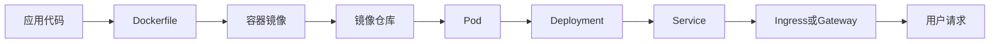
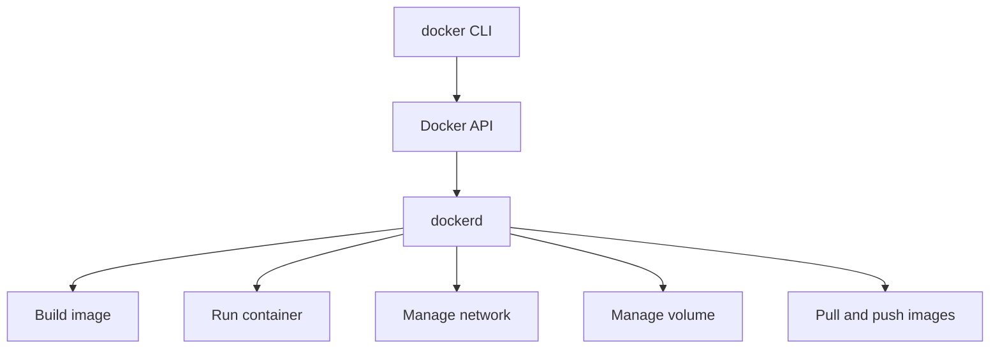
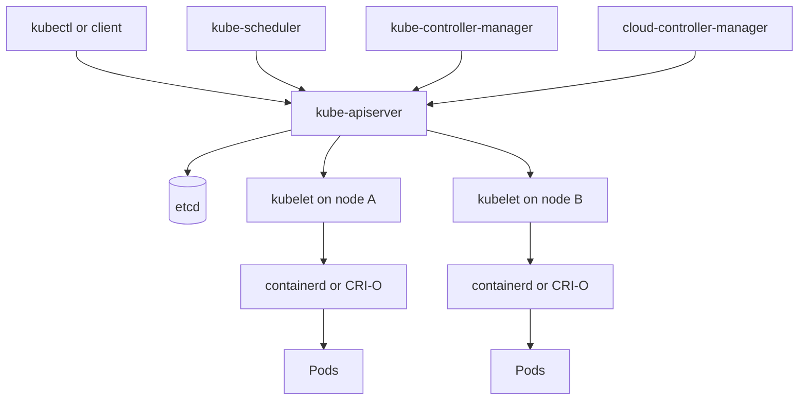
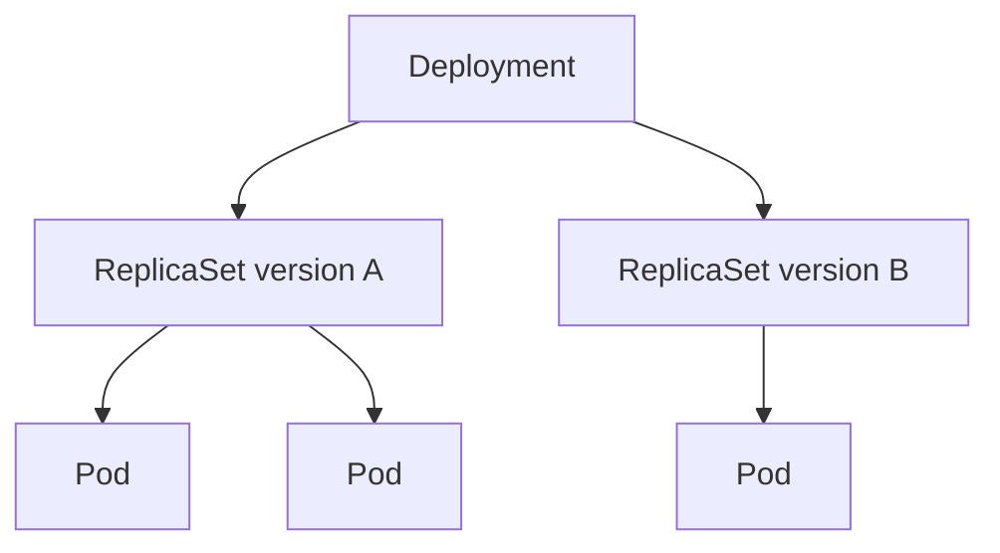
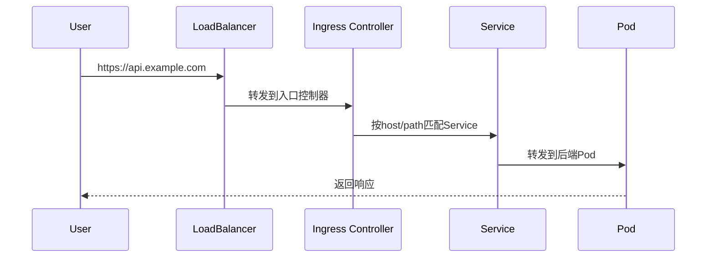
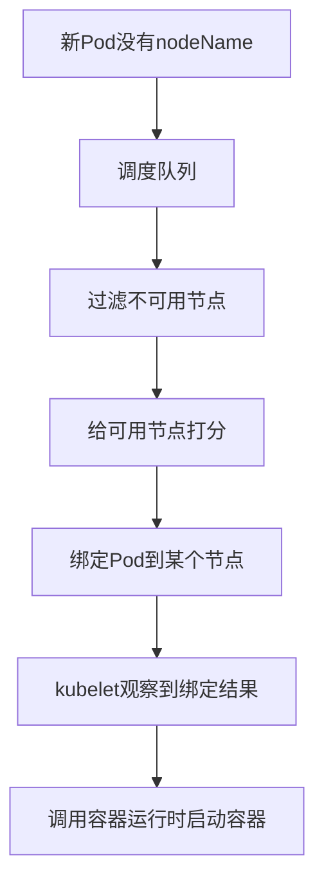
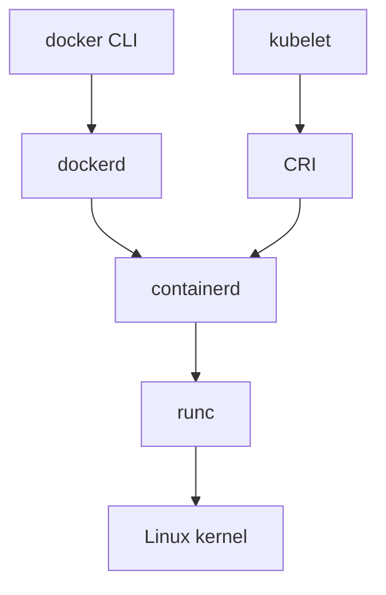
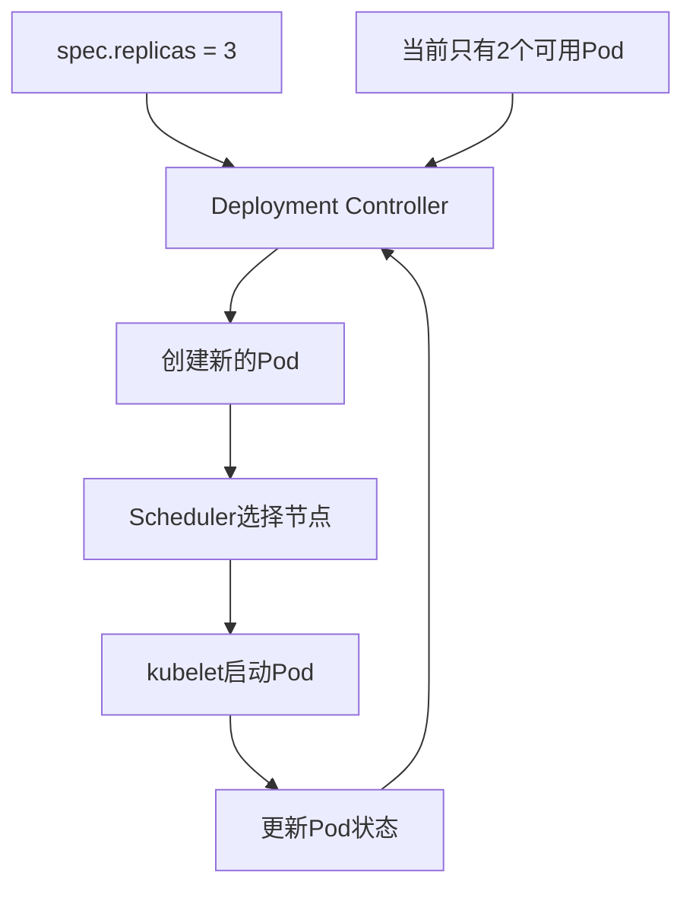

## 1. 先说结论

版本说明：本文写于2026-06-05，主要参考Docker官方文档和Kubernetes官方文档当前版本页面。Kubernetes官网当前文档导航已经展示到`v1.36`，但实际生产环境仍要以你集群里的版本为准：

```bash
kubectl version
kubectl get nodes -o wide
kubectl describe node <node-name>
```

如果只记一句话：

**Docker解决的是“怎么把一个应用和它的运行环境打包成镜像，并在一台机器上以容器运行”；Kubernetes解决的是“怎么在一组机器上持续、可靠、可扩缩地运行很多容器化应用”。**

更具体一点：

1. Docker的核心抽象是`Image`和`Container`。
2. Kubernetes的核心抽象是`Pod`，而不是Container。
3. Docker偏向单机开发、构建、分发、调试。
4. Kubernetes偏向集群调度、声明式部署、服务发现、弹性伸缩、自愈和发布。
5. Kubernetes现在仍然运行容器，但不再要求节点上必须用Docker Engine。生产集群里常见运行时是`containerd`或`CRI-O`。
6. Docker镜像依然可以被Kubernetes使用，因为镜像格式已经标准化，Kubernetes关心的是OCI镜像和CRI运行时，不是你本地用不用`docker build`。
7. 容器不是轻量虚拟机。容器本质上是被Linux内核隔离和限制的一组进程。
8. Kubernetes也不是“更高级的Docker命令行”。它是一个围绕API对象、控制器、调度器和状态收敛构建出来的分布式控制系统。

本文会按这条主线展开：



## 2. 为什么需要容器

先从最朴素的问题开始。

假设你写了一个Web服务：

1. 需要Python 3.12。
2. 需要`uvicorn`。
3. 需要`libpq`。
4. 需要环境变量`DATABASE_URL`。
5. 需要监听`8000`端口。

在你的电脑上能跑，不代表同事电脑、CI机器、测试服务器、生产服务器都能跑。常见问题包括：

1. Python版本不一致。
2. 系统库缺失。
3. 依赖版本冲突。
4. 配置文件路径不同。
5. 启动命令写在人的记忆里，没有固化。
6. 生产环境和开发环境差异太大。

容器的目标就是把“应用需要的用户态环境”打包起来，让它变成一个可分发、可重复启动的单元。

注意这里说的是“用户态环境”，不是整个操作系统。容器通常共享宿主机内核，所以Linux容器不能直接带一个完全独立的Linux内核。它不像虚拟机那样模拟硬件、启动完整OS。

## 3. 容器不是虚拟机

虚拟机大致是这样：

```text
物理机/云主机
  -> Hypervisor
    -> VM 1: Guest OS + Kernel + App
    -> VM 2: Guest OS + Kernel + App
```

容器大致是这样：

```text
Linux宿主机
  -> Linux Kernel
    -> Container 1: App + 用户态依赖
    -> Container 2: App + 用户态依赖
```

所以容器有几个典型特点：

1. 启动快，因为不是启动完整操作系统。
2. 镜像通常更小，因为不需要打包内核。
3. 密度高，一台机器可以跑更多实例。
4. 隔离不等于虚拟化安全边界，内核仍然共享。
5. 对内核特性敏感，例如cgroups、namespaces、capabilities、seccomp、AppArmor、SELinux。

容器的隔离主要来自Linux内核能力：

1. `pid namespace`：容器内看到自己的进程树。
2. `net namespace`：容器内有自己的网络栈、网卡、路由表。
3. `mnt namespace`：容器内看到自己的挂载视图。
4. `uts namespace`：隔离hostname。
5. `ipc namespace`：隔离进程间通信资源。
6. `user namespace`：隔离用户和用户组映射。
7. `cgroups`：限制CPU、内存、IO等资源。
8. `capabilities`：把root权限拆成更细粒度的能力。
9. `seccomp`：限制系统调用。

一个容器看起来像“小机器”，但本质是“一组被隔离、被限制、带着自己文件系统视图的进程”。

## 4. Docker到底是什么

Docker不是一个单独概念，它至少包含几层东西：

1. Docker CLI：也就是`docker`命令。
2. Docker daemon：也就是`dockerd`，负责构建、运行、管理容器对象。
3. Docker Engine：通常指CLI、daemon、API等组合。
4. Dockerfile：描述镜像如何构建。
5. Docker Image：镜像，是可分发的只读模板。
6. Docker Container：容器，是镜像的运行实例。
7. Docker Registry：镜像仓库，例如Docker Hub、Harbor、GitHub Container Registry。
8. Docker Compose：本地多容器编排工具。
9. Docker Desktop：桌面开发环境，包含daemon、CLI、Compose等组件。

Docker官方文档把Docker描述为开发、分发和运行应用的开放平台。它的一个核心价值是把应用和基础设施分离，使应用可以以容器为单位交付。

可以把Docker理解成：

```text
Dockerfile负责定义环境
docker build负责生成镜像
docker push负责分发镜像
docker run负责启动容器
docker logs/exec/inspect负责调试容器
```

## 5. Docker架构

Docker典型架构如下：



当你执行：

```bash
docker run -p 8080:80 nginx:1.27
```

大致发生这些事：

1. `docker` CLI把请求发给`dockerd`。
2. `dockerd`检查本地有没有`nginx:1.27`镜像。
3. 如果没有，就从镜像仓库拉取镜像。
4. 创建容器的可写层。
5. 创建或连接网络。
6. 配置端口映射。
7. 设置namespace和cgroup。
8. 启动容器进程。
9. 把容器状态记录下来。

所以`docker run`不是“启动一个二进制”这么简单，它背后包括镜像、文件系统、网络、资源控制和生命周期管理。

## 6. 镜像是什么

镜像是一个只读模板，用来创建容器。

最简单的理解：

```text
镜像 = 文件系统内容 + 元数据 + 默认启动配置
```

例如一个Python Web服务镜像可能包含：

1. 基础Linux发行版用户态文件。
2. Python解释器。
3. Python依赖。
4. 应用代码。
5. 默认工作目录。
6. 默认环境变量。
7. 默认启动命令。

镜像不是一个大压缩包那么简单。镜像由多层layer组成：

```text
python:3.12-slim
  layer 1: Debian slim基础文件
  layer 2: Python运行时
  layer 3: apt安装的系统依赖
  layer 4: pip/uv安装的Python依赖
  layer 5: 应用代码
  layer 6: 镜像元数据
```

分层的好处：

1. 构建可以复用缓存。
2. 拉取可以复用已有层。
3. 多个镜像可以共享基础层。
4. 小改动不需要重新传输全部内容。

坏处也很明显：

1. 如果Dockerfile顺序写得不好，缓存容易失效。
2. 每层都会留下历史，删除文件不一定减少最终镜像体积。
3. 敏感信息写进镜像层后很难真正清理。

## 7. 容器是什么

容器是镜像的运行实例。

镜像是静态的，容器是动态的。类比一下：

```text
镜像像class
容器像object
```

一个镜像可以启动多个容器：

```bash
docker run -d --name web-1 nginx:1.27
docker run -d --name web-2 nginx:1.27
docker run -d --name web-3 nginx:1.27
```

它们来自同一个镜像，但运行状态不同：

1. PID不同。
2. IP不同。
3. 日志不同。
4. 可写层不同。
5. 生命周期不同。

容器停止后，本地可写层还在；容器删除后，如果没有挂载volume或bind mount，容器内写入的数据通常就没了。

```bash
docker stop web-1
docker start web-1
docker rm web-1
```

这也是为什么数据库不应该只把数据写在容器可写层里，而应该用volume、云盘或外部存储。

## 8. Dockerfile怎么写

一个典型Dockerfile：

```dockerfile
FROM python:3.12-slim

WORKDIR /app

COPY requirements.txt .
RUN pip install --no-cache-dir -r requirements.txt

COPY . .

EXPOSE 8000

CMD ["python", "-m", "uvicorn", "main:app", "--host", "0.0.0.0", "--port", "8000"]
```

每条指令含义：

1. `FROM`：选择基础镜像。
2. `WORKDIR`：设置工作目录。
3. `COPY`：把文件复制进镜像。
4. `RUN`：在构建阶段执行命令，生成新镜像层。
5. `EXPOSE`：声明容器内服务端口，不等于自动映射到宿主机。
6. `CMD`：容器默认启动命令。

构建：

```bash
docker build -t my-api:0.1.0 .
```

运行：

```bash
docker run --rm -p 8000:8000 my-api:0.1.0
```

访问：

```bash
curl http://localhost:8000
```

## 9. Dockerfile里的RUN、CMD、ENTRYPOINT

这三个最容易混：

1. `RUN`：构建镜像时执行。
2. `CMD`：容器启动时的默认命令，可以被`docker run IMAGE <command>`覆盖。
3. `ENTRYPOINT`：容器启动时固定执行的入口，常用于把镜像做成一个可执行程序。

例子：

```dockerfile
FROM alpine:3.20
RUN apk add --no-cache curl
CMD ["curl", "--version"]
```

`RUN apk add`发生在`docker build`阶段。容器启动时默认执行`curl --version`。

再看：

```dockerfile
FROM alpine:3.20
ENTRYPOINT ["curl"]
CMD ["--version"]
```

这时：

```bash
docker run image
```

等价于：

```bash
curl --version
```

而：

```bash
docker run image https://example.com
```

等价于：

```bash
curl https://example.com
```

## 10. 构建缓存和镜像体积

Docker构建缓存按层复用。Dockerfile顺序会显著影响构建速度。

不推荐：

```dockerfile
FROM python:3.12-slim
WORKDIR /app
COPY . .
RUN pip install --no-cache-dir -r requirements.txt
CMD ["python", "main.py"]
```

问题是任何源码改动都会导致`COPY . .`这一层变化，后面的依赖安装也要重新执行。

更推荐：

```dockerfile
FROM python:3.12-slim
WORKDIR /app
COPY requirements.txt .
RUN pip install --no-cache-dir -r requirements.txt
COPY . .
CMD ["python", "main.py"]
```

这样只有`requirements.txt`变化时才重新安装依赖。

常见最佳实践：

1. 使用合适的`.dockerignore`。
2. 把依赖文件和源码复制拆开。
3. 尽量使用明确版本tag，不要在生产里长期用`latest`。
4. 不要把密钥写进镜像。
5. 使用多阶段构建减少运行时镜像体积。
6. 一个容器通常只跑一个主进程。
7. 用非root用户运行应用。
8. 构建产物和运行时依赖分离。

多阶段构建示例：

```dockerfile
FROM golang:1.23 AS builder
WORKDIR /src
COPY go.mod go.sum ./
RUN go mod download
COPY . .
RUN CGO_ENABLED=0 go build -o /out/server ./cmd/server

FROM gcr.io/distroless/static-debian12
COPY --from=builder /out/server /server
USER nonroot:nonroot
ENTRYPOINT ["/server"]
```

第一阶段有编译器，第二阶段只带运行需要的二进制。

## 11. Docker网络

容器网络最常见的是`bridge`模式。

```bash
docker network ls
docker network inspect bridge
```

默认情况下，容器在自己的network namespace里，有自己的IP。宿主机通过网桥和NAT让容器访问外部网络。

端口映射：

```bash
docker run -p 8080:80 nginx
```

含义是：

```text
宿主机 8080 -> 容器 80
```

注意：

1. 容器内应用要监听`0.0.0.0`，只监听`127.0.0.1`时外部通常访问不到。
2. `EXPOSE 80`只是镜像元数据声明，不会自动开放端口。
3. `-p`才是实际端口发布。
4. 多容器应用最好创建自定义network，容器之间可以通过名字访问。

示例：

```bash
docker network create app-net
docker run -d --name db --network app-net postgres:16
docker run -d --name api --network app-net my-api:0.1.0
```

此时`api`容器里可以访问`db:5432`。

## 12. Docker存储

容器文件系统分两类：

1. 镜像层：只读。
2. 容器可写层：随容器存在，删除容器后消失。

持久化通常有两种方式：

1. volume：Docker管理的位置。
2. bind mount：把宿主机指定目录挂进容器。

volume示例：

```bash
docker volume create pgdata
docker run -d \
  --name postgres \
  -e POSTGRES_PASSWORD=example \
  -v pgdata:/var/lib/postgresql/data \
  postgres:16
```

bind mount示例：

```bash
docker run --rm \
  -v "$PWD":/app \
  -w /app \
  node:22 \
  npm test
```

区别：

1. volume更适合持久数据，由Docker管理。
2. bind mount更适合开发调试，把本地代码挂进去。
3. bind mount依赖宿主机路径，跨机器可移植性差。
4. 容器里的文件权限要和宿主机用户、UID、GID关系一起考虑。

## 13. Docker Compose

Docker Compose用于描述本地多容器应用。

例如：

```yaml
services:
  api:
    build: .
    ports:
      - "8000:8000"
    environment:
      DATABASE_URL: postgres://postgres:example@db:5432/app
    depends_on:
      - db

  db:
    image: postgres:16
    environment:
      POSTGRES_PASSWORD: example
      POSTGRES_DB: app
    volumes:
      - pgdata:/var/lib/postgresql/data

volumes:
  pgdata:
```

启动：

```bash
docker compose up -d
```

查看：

```bash
docker compose ps
docker compose logs -f api
```

删除：

```bash
docker compose down
```

Compose适合：

1. 本地开发。
2. 单机测试。
3. CI里快速拉起依赖服务。
4. 小型内部工具。

Compose不擅长：

1. 跨机器调度。
2. 自动故障迁移。
3. 大规模服务发现。
4. 复杂滚动发布。
5. 多租户资源治理。

这些就是Kubernetes要解决的问题。

## 14. 为什么需要Kubernetes

如果只有一台机器，`docker run`和`docker compose`就能解决很多问题。

但生产环境常常面对这些问题：

1. 有几十台、几百台机器。
2. 一个服务要运行多个副本。
3. 某台机器宕机后，服务要自动迁移。
4. 发布新版本时不能中断服务。
5. 要按CPU、内存、GPU等资源调度。
6. 服务之间需要稳定访问地址。
7. 配置和密钥要统一管理。
8. 日志、指标、探针、健康检查要标准化。
9. 不同团队要共享同一个集群。
10. 要限制每个团队能用多少资源。

Kubernetes就是为这些问题设计的。

它的基本思想是：

**用户声明期望状态，控制器持续把实际状态调到期望状态。**

例如你声明：

```text
我希望my-api始终有3个副本在运行。
```

Kubernetes就会不断观察：

1. 当前是不是3个副本？
2. 如果只有2个，就创建1个。
3. 如果有4个，就删除1个。
4. 如果某个节点挂了，就在别的节点补一个。
5. 如果镜像版本变了，就按策略滚动替换。

这叫声明式系统，也叫控制循环。

## 15. Kubernetes架构总览

Kubernetes集群分为两类节点：

1. Control Plane：控制平面。
2. Worker Node：工作节点。



核心组件：

1. `kube-apiserver`：所有API请求入口。
2. `etcd`：保存集群状态。
3. `kube-scheduler`：给新Pod选择节点。
4. `kube-controller-manager`：运行各种控制器。
5. `cloud-controller-manager`：对接云厂商负载均衡、节点、路由、磁盘等能力。
6. `kubelet`：每个节点上的代理，负责让Pod真正运行起来。
7. `container runtime`：真正创建和运行容器，例如containerd、CRI-O。
8. `kube-proxy`或替代组件：实现Service网络转发。
9. CNI插件：实现Pod网络，例如Calico、Cilium、Flannel。
10. CSI插件：实现存储卷，例如云盘、Ceph、NFS。

## 16. Kubernetes的对象模型

Kubernetes里几乎一切都是API对象。

常见对象：

1. `Pod`：最小调度单元。
2. `ReplicaSet`：保证Pod副本数量。
3. `Deployment`：管理无状态应用滚动发布。
4. `StatefulSet`：管理有状态应用。
5. `DaemonSet`：每个节点运行一个Pod，常用于日志、监控、网络插件。
6. `Job`：一次性任务。
7. `CronJob`：定时任务。
8. `Service`：给一组Pod提供稳定访问入口。
9. `Ingress`：HTTP/HTTPS七层入口规则。
10. `ConfigMap`：非敏感配置。
11. `Secret`：敏感配置。
12. `PersistentVolume`：集群里的持久存储资源。
13. `PersistentVolumeClaim`：应用对存储的申请。
14. `Namespace`：逻辑隔离空间。
15. `ServiceAccount`：Pod访问Kubernetes API时使用的身份。
16. `Role`、`ClusterRole`、`RoleBinding`、`ClusterRoleBinding`：RBAC权限控制。

Kubernetes对象通常包含：

```yaml
apiVersion: apps/v1
kind: Deployment
metadata:
  name: my-api
  labels:
    app: my-api
spec:
  replicas: 3
  selector:
    matchLabels:
      app: my-api
  template:
    metadata:
      labels:
        app: my-api
    spec:
      containers:
        - name: api
          image: ghcr.io/example/my-api:0.1.0
```

几个关键词：

1. `apiVersion`：API版本。
2. `kind`：对象类型。
3. `metadata`：名称、标签、注解等元数据。
4. `spec`：期望状态。
5. `status`：实际状态，由系统写入。

用户一般写`spec`，Kubernetes控制器更新`status`。

## 17. Pod：Kubernetes最小调度单元

Kubernetes不是直接调度单个容器，而是调度Pod。

Pod可以包含一个或多个容器。一个Pod里的容器共享：

1. 网络命名空间。
2. Pod IP。
3. localhost。
4. 部分volume。
5. 生命周期边界。

一个最简单的Pod：

```yaml
apiVersion: v1
kind: Pod
metadata:
  name: nginx
  labels:
    app: nginx
spec:
  containers:
    - name: nginx
      image: nginx:1.27
      ports:
        - containerPort: 80
```

创建：

```bash
kubectl apply -f pod.yaml
```

查看：

```bash
kubectl get pods
kubectl describe pod nginx
kubectl logs nginx
```

为什么需要Pod这一层？

因为有些容器天然应该作为一个整体调度：

1. 主应用容器。
2. sidecar日志采集容器。
3. service mesh代理容器。
4. 本地辅助容器。

它们需要在同一台机器上、共享网络、共享volume，并且作为一个部署单元存在。

Pod不是一个持久身份很强的东西。对于无状态服务，Pod经常被创建、删除、替换。不要把Pod IP当作稳定地址。

## 18. Deployment：管理无状态应用

生产里一般不直接创建裸Pod，而是创建Deployment。

Deployment负责：

1. 创建ReplicaSet。
2. 通过ReplicaSet维持Pod副本数。
3. 支持滚动更新。
4. 支持回滚。
5. 支持扩缩容。

示例：

```yaml
apiVersion: apps/v1
kind: Deployment
metadata:
  name: my-api
spec:
  replicas: 3
  selector:
    matchLabels:
      app: my-api
  strategy:
    type: RollingUpdate
    rollingUpdate:
      maxUnavailable: 1
      maxSurge: 1
  template:
    metadata:
      labels:
        app: my-api
    spec:
      containers:
        - name: api
          image: ghcr.io/example/my-api:0.1.0
          ports:
            - containerPort: 8000
```

对象关系：



滚动发布时，Deployment会逐步增加新ReplicaSet的Pod，减少旧ReplicaSet的Pod。

常用命令：

```bash
kubectl apply -f deployment.yaml
kubectl rollout status deployment/my-api
kubectl rollout history deployment/my-api
kubectl rollout undo deployment/my-api
kubectl scale deployment/my-api --replicas=5
```

Deployment适合无状态服务，例如API、Web、worker。

不适合直接管理需要稳定网络身份和稳定存储身份的数据库。数据库通常要考虑StatefulSet、Operator或托管数据库。

## 19. Service：给Pod一个稳定入口

Pod会变化，IP也会变化。Service解决的是：

**如何给一组动态Pod提供稳定访问入口。**

Service通过selector选择Pod：

```yaml
apiVersion: v1
kind: Service
metadata:
  name: my-api
spec:
  type: ClusterIP
  selector:
    app: my-api
  ports:
    - port: 80
      targetPort: 8000
```

含义：

```text
访问Service my-api:80 -> 转发到 app=my-api 的Pod的8000端口
```

常见Service类型：

1. `ClusterIP`：集群内部访问，默认类型。
2. `NodePort`：在每个节点开一个端口，对外暴露。
3. `LoadBalancer`：请求云厂商创建负载均衡器。
4. `ExternalName`：把Service映射到外部DNS名称。

Service不是反向代理本身。它更像稳定虚拟IP和服务发现机制。具体数据转发可能由iptables、IPVS、eBPF或其他实现完成。

## 20. Ingress：HTTP入口

Service通常解决集群内访问。如果要从集群外访问HTTP服务，常见做法是Ingress。

Ingress对象描述规则：

```yaml
apiVersion: networking.k8s.io/v1
kind: Ingress
metadata:
  name: my-api
spec:
  rules:
    - host: api.example.com
      http:
        paths:
          - path: /
            pathType: Prefix
            backend:
              service:
                name: my-api
                port:
                  number: 80
```

但只创建Ingress对象不够，你还需要Ingress Controller，例如Nginx Ingress Controller、Traefik、HAProxy、云厂商Ingress Controller等。

请求链路：



现在Kubernetes社区也在推进Gateway API。可以粗略理解为：Ingress偏简单HTTP入口，Gateway API试图用更清晰的角色模型描述更多L4/L7流量管理能力。

## 21. ConfigMap和Secret

应用配置不应该都写死在镜像里。

镜像应该尽量做到：

```text
同一个镜像 + 不同配置 = 不同环境行为
```

ConfigMap用于非敏感配置：

```yaml
apiVersion: v1
kind: ConfigMap
metadata:
  name: my-api-config
data:
  APP_ENV: production
  LOG_LEVEL: info
```

注入环境变量：

```yaml
apiVersion: apps/v1
kind: Deployment
metadata:
  name: my-api
spec:
  replicas: 3
  selector:
    matchLabels:
      app: my-api
  template:
    metadata:
      labels:
        app: my-api
    spec:
      containers:
        - name: api
          image: ghcr.io/example/my-api:0.1.0
          envFrom:
            - configMapRef:
                name: my-api-config
```

Secret用于敏感信息：

```yaml
apiVersion: v1
kind: Secret
metadata:
  name: my-api-secret
type: Opaque
stringData:
  DATABASE_URL: postgres://user:password@db:5432/app
```

注入：

```yaml
env:
  - name: DATABASE_URL
    valueFrom:
      secretKeyRef:
        name: my-api-secret
        key: DATABASE_URL
```

注意：

1. Secret不是天然等于强加密保险箱。
2. 默认情况下，Secret以Kubernetes对象形式存储在etcd中。
3. 生产环境应开启etcd静态加密、严格RBAC、审计日志。
4. 更高要求可以接入外部密钥系统，例如Vault、云厂商Secret Manager。
5. 不要把Secret提交进Git。

## 22. Volume、PV、PVC和StorageClass

Pod本身是易失的。Pod重建后，容器可写层通常不是你应该依赖的持久存储。

Kubernetes存储核心对象：

1. `Volume`：挂载到Pod里的卷。
2. `PersistentVolume`，简称PV：集群级持久存储资源。
3. `PersistentVolumeClaim`，简称PVC：应用对存储资源的申请。
4. `StorageClass`：动态创建存储的类别。

PVC示例：

```yaml
apiVersion: v1
kind: PersistentVolumeClaim
metadata:
  name: data
spec:
  accessModes:
    - ReadWriteOnce
  resources:
    requests:
      storage: 20Gi
  storageClassName: fast-ssd
```

在Pod中使用：

```yaml
apiVersion: v1
kind: Pod
metadata:
  name: app
spec:
  containers:
    - name: app
      image: busybox:1.36
      command: ["sh", "-c", "while true; do date >> /data/log.txt; sleep 5; done"]
      volumeMounts:
        - name: data
          mountPath: /data
  volumes:
    - name: data
      persistentVolumeClaim:
        claimName: data
```

访问模式常见有：

1. `ReadWriteOnce`：通常只能被一个节点读写挂载。
2. `ReadOnlyMany`：多个节点只读挂载。
3. `ReadWriteMany`：多个节点读写挂载。
4. `ReadWriteOncePod`：限制单个Pod读写挂载。

不要误解PVC：

1. PVC不是数据库备份。
2. PVC不是跨区域高可用。
3. PVC不是自动解决数据一致性。
4. Stateful应用要额外设计备份、恢复、主从、仲裁、故障转移。

## 23. Scheduler：Pod如何被放到节点上

当你创建Deployment后，真正需要调度的是Pod。

调度过程简化如下：



过滤阶段会考虑：

1. 节点是否Ready。
2. CPU、内存、临时存储是否满足request。
3. 端口是否冲突。
4. nodeSelector、nodeAffinity。
5. taints和tolerations。
6. volume是否能挂载到该节点。
7. 拓扑约束。

打分阶段会考虑：

1. 资源利用率。
2. 亲和性偏好。
3. Pod分布。
4. 镜像本地性。
5. 自定义调度插件。

调度器只决定“放在哪里”。真正启动容器的是目标节点上的kubelet。

## 24. Requests和Limits

Kubernetes资源配置非常重要。

示例：

```yaml
resources:
  requests:
    cpu: "500m"
    memory: "512Mi"
  limits:
    cpu: "1"
    memory: "1Gi"
```

含义：

1. `requests.cpu`：调度时认为这个容器至少需要多少CPU。
2. `requests.memory`：调度时认为这个容器至少需要多少内存。
3. `limits.cpu`：容器最多能用多少CPU，超出会被限流。
4. `limits.memory`：容器最多能用多少内存，超出可能被OOMKilled。

CPU单位：

```text
1 = 1个CPU核心
500m = 0.5个CPU核心
100m = 0.1个CPU核心
```

内存单位：

```text
Mi = 1024^2 bytes
Gi = 1024^3 bytes
M  = 1000^2 bytes
G  = 1000^3 bytes
```

QoS等级：

1. `Guaranteed`：每个容器都设置CPU和内存request/limit，且request等于limit。
2. `Burstable`：至少有一个request或limit，但不满足Guaranteed。
3. `BestEffort`：没有设置request和limit。

节点资源紧张时，BestEffort最容易被驱逐，Guaranteed最稳定。

常见错误：

1. 不设置requests，导致调度器低估资源。
2. memory limit太小，应用频繁OOMKilled。
3. CPU limit太小，延迟尖刺明显。
4. JVM、Go、Python等运行时没有感知容器限制或配置不当。
5. 把limit当作“预留资源”，其实request才是调度预留依据。

## 25. 健康检查：liveness、readiness、startup

Kubernetes探针用于判断容器状态。

三种常见探针：

1. `startupProbe`：应用是否启动完成。
2. `readinessProbe`：应用是否可以接流量。
3. `livenessProbe`：应用是否需要重启。

示例：

```yaml
livenessProbe:
  httpGet:
    path: /healthz
    port: 8000
  initialDelaySeconds: 10
  periodSeconds: 10

readinessProbe:
  httpGet:
    path: /ready
    port: 8000
  periodSeconds: 5

startupProbe:
  httpGet:
    path: /healthz
    port: 8000
  failureThreshold: 30
  periodSeconds: 2
```

区别：

1. `readinessProbe`失败：Pod从Service后端摘掉，但容器不一定重启。
2. `livenessProbe`失败：kubelet重启容器。
3. `startupProbe`存在时，启动探针成功前，其他探针通常不会生效。

常见错误：

1. liveness检查依赖数据库，数据库短暂抖动导致应用被集体重启。
2. readiness过早成功，应用还没加载缓存就开始接流量。
3. startupProbe缺失，慢启动服务被liveness杀掉。
4. 探针接口本身太重，健康检查变成额外负载。

实践建议：

1. liveness只检查进程是否进入不可恢复状态。
2. readiness检查依赖是否足以处理请求。
3. 慢启动应用加startupProbe。
4. 探针接口要轻量、稳定、超时明确。

## 26. Kubernetes和Docker的关系

这是最容易混的地方。

历史上，很多人学习Kubernetes时，节点上装的是Docker Engine。kubelet通过dockershim对接Docker。

后来Kubernetes移除了内置dockershim。原因不是“Docker镜像不能用了”，也不是“Kubernetes不运行容器了”，而是：

**Kubernetes通过CRI标准接口对接容器运行时，不需要内置维护一层专门适配Docker Engine的shim。**

现在常见链路是：

```text
kubelet -> CRI -> containerd -> runc -> Linux kernel
```

而Docker Engine内部也常用containerd：

```text
docker CLI -> dockerd -> containerd -> runc -> Linux kernel
```

所以二者关系可以画成：



关键结论：

1. 你本地仍然可以用Docker构建镜像。
2. 镜像推到仓库后，Kubernetes可以拉取并运行。
3. Kubernetes节点上不一定安装Docker Engine。
4. 在Kubernetes节点上排障容器运行时，常用`crictl`、`ctr`、`nerdctl`，不一定能用`docker ps`。
5. Docker Compose文件不能直接等价于Kubernetes YAML。可以转换，但语义不完全一致。

## 27. CRI、OCI、CNI、CSI分别是什么

云原生里很多缩写，最重要的几个：

### 27.1 OCI

OCI是Open Container Initiative，定义了容器镜像格式和运行时规范。

你可以粗略理解：

```text
OCI Image Spec: 镜像应该长什么样
OCI Runtime Spec: 容器运行时应该怎么创建容器
```

`runc`就是典型OCI runtime实现。

### 27.2 CRI

CRI是Container Runtime Interface，是Kubernetes的容器运行时接口。

kubelet不想直接适配每一种运行时，于是定义标准接口：

```text
kubelet -> CRI -> container runtime
```

常见CRI运行时：

1. containerd。
2. CRI-O。

### 27.3 CNI

CNI是Container Network Interface，负责容器网络插件标准。

Kubernetes通过CNI插件给Pod配置网络。

常见插件：

1. Calico。
2. Cilium。
3. Flannel。
4. Weave Net。

### 27.4 CSI

CSI是Container Storage Interface，负责存储插件标准。

Kubernetes通过CSI插件挂载云盘、分布式存储、本地盘等。

常见场景：

1. AWS EBS。
2. GCE Persistent Disk。
3. Azure Disk。
4. Ceph RBD。
5. NFS。

## 28. 从代码到线上服务的完整链路

假设你有一个API服务。

第一步，写Dockerfile：

```dockerfile
FROM python:3.12-slim
WORKDIR /app
COPY requirements.txt .
RUN pip install --no-cache-dir -r requirements.txt
COPY . .
CMD ["python", "-m", "uvicorn", "main:app", "--host", "0.0.0.0", "--port", "8000"]
```

第二步，构建镜像：

```bash
docker build -t ghcr.io/example/my-api:0.1.0 .
```

第三步，本地运行：

```bash
docker run --rm -p 8000:8000 ghcr.io/example/my-api:0.1.0
```

第四步，推送镜像：

```bash
docker push ghcr.io/example/my-api:0.1.0
```

第五步，写Deployment：

```yaml
apiVersion: apps/v1
kind: Deployment
metadata:
  name: my-api
spec:
  replicas: 3
  selector:
    matchLabels:
      app: my-api
  template:
    metadata:
      labels:
        app: my-api
    spec:
      containers:
        - name: api
          image: ghcr.io/example/my-api:0.1.0
          ports:
            - containerPort: 8000
          resources:
            requests:
              cpu: "200m"
              memory: "256Mi"
            limits:
              memory: "512Mi"
          readinessProbe:
            httpGet:
              path: /ready
              port: 8000
            periodSeconds: 5
          livenessProbe:
            httpGet:
              path: /healthz
              port: 8000
            periodSeconds: 10
```

第六步，写Service：

```yaml
apiVersion: v1
kind: Service
metadata:
  name: my-api
spec:
  selector:
    app: my-api
  ports:
    - name: http
      port: 80
      targetPort: 8000
```

第七步，写Ingress：

```yaml
apiVersion: networking.k8s.io/v1
kind: Ingress
metadata:
  name: my-api
spec:
  rules:
    - host: api.example.com
      http:
        paths:
          - path: /
            pathType: Prefix
            backend:
              service:
                name: my-api
                port:
                  number: 80
```

第八步，应用：

```bash
kubectl apply -f deployment.yaml
kubectl apply -f service.yaml
kubectl apply -f ingress.yaml
```

第九步，观察发布：

```bash
kubectl rollout status deployment/my-api
kubectl get pods -l app=my-api
kubectl get svc my-api
kubectl get ingress my-api
```

这就是从代码到Kubernetes服务的最小完整路径。

## 29. Kubernetes控制循环

Kubernetes真正重要的不是YAML，而是控制循环。

以Deployment为例：



这是一种持续收敛模型：

1. 用户写期望状态。
2. API Server保存对象。
3. Controller观察对象。
4. Controller发现实际状态和期望状态不一致。
5. Controller发起动作。
6. 动作改变实际状态。
7. 状态更新回API Server。
8. 下一轮继续检查。

这也是为什么Kubernetes里很多操作不是“立即完成”，而是“提交期望状态后异步收敛”。

## 30. 标签和选择器

Kubernetes里对象之间很多关系不是通过硬编码名称，而是通过label selector。

Deployment创建Pod时给Pod加标签：

```yaml
metadata:
  labels:
    app: my-api
    version: v1
```

Service选择这些Pod：

```yaml
selector:
  app: my-api
```

这意味着：

```text
Service并不关心Pod叫什么名字，只关心Pod是否带有匹配标签。
```

好处：

1. Pod可以随时重建。
2. Service后端自动变化。
3. 可以用标签做灰度、分组、环境隔离。

常见错误：

1. Deployment的`spec.selector.matchLabels`和`template.metadata.labels`不一致。
2. Service selector写错，导致Service没有Endpoints。
3. 多个应用用了相同label，Service流量打到错误Pod。

排查：

```bash
kubectl get pods --show-labels
kubectl get endpoints my-api
kubectl describe svc my-api
```

## 31. Namespace

Namespace提供逻辑隔离。

常见用法：

1. 按环境分：`dev`、`staging`、`prod`。
2. 按团队分：`team-a`、`team-b`。
3. 按系统分：`monitoring`、`ingress-nginx`、`kube-system`。

创建：

```bash
kubectl create namespace dev
```

使用：

```bash
kubectl get pods -n dev
kubectl apply -n dev -f deployment.yaml
```

注意：

1. Namespace不是强安全隔离边界。
2. 配合RBAC、ResourceQuota、NetworkPolicy才更完整。
3. 某些资源是集群级别的，不属于某个Namespace，例如Node、PersistentVolume、ClusterRole。

## 32. RBAC和ServiceAccount

Kubernetes API需要权限控制。

核心对象：

1. `ServiceAccount`：身份。
2. `Role`：某个Namespace内的权限。
3. `ClusterRole`：集群级权限。
4. `RoleBinding`：把Role绑定给用户、组或ServiceAccount。
5. `ClusterRoleBinding`：把ClusterRole绑定给主体。

示例：允许某个ServiceAccount读取ConfigMap。

```yaml
apiVersion: v1
kind: ServiceAccount
metadata:
  name: config-reader
  namespace: app
---
apiVersion: rbac.authorization.k8s.io/v1
kind: Role
metadata:
  name: read-configmaps
  namespace: app
rules:
  - apiGroups: [""]
    resources: ["configmaps"]
    verbs: ["get", "list", "watch"]
---
apiVersion: rbac.authorization.k8s.io/v1
kind: RoleBinding
metadata:
  name: config-reader-binding
  namespace: app
subjects:
  - kind: ServiceAccount
    name: config-reader
    namespace: app
roleRef:
  kind: Role
  name: read-configmaps
  apiGroup: rbac.authorization.k8s.io
```

最小权限原则：

1. 不要随便给`cluster-admin`。
2. Pod默认ServiceAccount权限要收紧。
3. CI/CD的kubeconfig要限制范围。
4. 生产集群开启审计日志。

## 33. NetworkPolicy

默认情况下，很多Kubernetes网络插件允许Pod之间互通。

NetworkPolicy用于限制Pod入站和出站流量。但它是否生效取决于CNI插件是否支持。

示例：只允许`app=frontend`访问`app=api`的8000端口。

```yaml
apiVersion: networking.k8s.io/v1
kind: NetworkPolicy
metadata:
  name: allow-frontend-to-api
spec:
  podSelector:
    matchLabels:
      app: api
  policyTypes:
    - Ingress
  ingress:
    - from:
        - podSelector:
            matchLabels:
              app: frontend
      ports:
        - protocol: TCP
          port: 8000
```

注意：

1. NetworkPolicy是白名单模型。
2. 没有策略选择的Pod通常保持默认行为。
3. 一旦某个Pod被Ingress策略选中，未显式允许的入站流量会被拒绝。
4. DNS、监控、健康检查等流量要一起考虑。

## 34. StatefulSet、DaemonSet、Job和CronJob

Deployment不是唯一工作负载类型。

### 34.1 StatefulSet

StatefulSet适合需要稳定身份的应用：

1. 稳定Pod名称。
2. 稳定网络身份。
3. 稳定PVC。
4. 有序创建、更新、删除。

典型场景：

1. ZooKeeper。
2. Kafka。
3. etcd。
4. 某些数据库集群。

但很多数据库在Kubernetes上运行并不简单，往往需要Operator管理备份、故障转移、扩容和版本升级。

### 34.2 DaemonSet

DaemonSet确保每个符合条件的节点运行一个Pod。

典型场景：

1. 日志采集Agent。
2. 监控Agent。
3. CNI组件。
4. 节点级安全Agent。

### 34.3 Job

Job适合一次性任务：

1. 数据迁移。
2. 批处理。
3. 离线计算。
4. 初始化任务。

### 34.4 CronJob

CronJob适合定时任务：

1. 每天清理临时数据。
2. 定时生成报表。
3. 周期性同步数据。

## 35. HPA：自动扩缩容

Horizontal Pod Autoscaler，简称HPA，用于按指标自动调整副本数。

常见按CPU扩容：

```yaml
apiVersion: autoscaling/v2
kind: HorizontalPodAutoscaler
metadata:
  name: my-api
spec:
  scaleTargetRef:
    apiVersion: apps/v1
    kind: Deployment
    name: my-api
  minReplicas: 3
  maxReplicas: 20
  metrics:
    - type: Resource
      resource:
        name: cpu
        target:
          type: Utilization
          averageUtilization: 60
```

注意：

1. HPA通常依赖metrics-server或自定义指标系统。
2. CPU利用率基于requests计算。
3. 没有设置CPU request时，CPU HPA很容易不符合预期。
4. 扩容不是瞬时的，镜像拉取、Pod启动、readiness都需要时间。
5. 对突发流量，除了HPA，还要考虑队列、限流、缓存和预热。

## 36. Docker和Kubernetes命令对照

一些常见操作的对应关系：

```text
Docker单机                         Kubernetes集群
------------------------------------------------------------
docker run                         kubectl create/apply
docker ps                          kubectl get pods
docker logs                        kubectl logs
docker exec                        kubectl exec
docker inspect                     kubectl describe / kubectl get -o yaml
docker stop                        kubectl delete pod 或缩容
docker build                       docker build / buildkit / kaniko / buildpacks
docker push                        推送到镜像仓库
docker compose up                  kubectl apply -f 多个资源
docker network                     CNI + Service + NetworkPolicy
docker volume                      PV + PVC + CSI
```

但不要机械类比：

1. Kubernetes删除Pod后，Deployment可能马上创建新Pod。
2. Kubernetes里日志通常还要接入集中日志系统。
3. Kubernetes里服务发现通过Service和DNS完成。
4. Kubernetes里容器排障不一定用Docker命令。

## 37. 常见排障路径

Pod起不来时：

```bash
kubectl get pods
kubectl describe pod <pod>
kubectl logs <pod>
kubectl logs <pod> --previous
kubectl get events --sort-by=.lastTimestamp
```

常见状态：

1. `Pending`：还没调度或资源不足。
2. `ContainerCreating`：镜像拉取、volume挂载、网络创建中。
3. `ImagePullBackOff`：镜像拉取失败。
4. `CrashLoopBackOff`：容器反复崩溃。
5. `OOMKilled`：内存超限被杀。
6. `Running`但`Ready`为0：readinessProbe失败。

Service访问不通：

```bash
kubectl get svc
kubectl get endpoints <service>
kubectl describe svc <service>
kubectl get pods --show-labels
```

检查：

1. Service selector是否匹配Pod label。
2. targetPort是否等于容器实际监听端口。
3. Pod readiness是否成功。
4. 应用是否监听`0.0.0.0`。
5. NetworkPolicy是否拦截。

Ingress访问不通：

```bash
kubectl get ingress
kubectl describe ingress <ingress>
kubectl get pods -n ingress-nginx
kubectl logs -n ingress-nginx <controller-pod>
```

检查：

1. 是否安装Ingress Controller。
2. DNS是否指向入口负载均衡器。
3. TLS证书是否正确。
4. host/path是否匹配。
5. 后端Service是否有Endpoints。

节点异常：

```bash
kubectl get nodes
kubectl describe node <node>
kubectl top node
kubectl top pod -A
```

检查：

1. 节点是否Ready。
2. 磁盘是否满。
3. 容器运行时是否正常。
4. kubelet是否正常。
5. CNI是否正常。

## 38. 常见误区

### 38.1 “容器里能跑就代表生产没问题”

不一定。生产还需要：

1. 资源限制。
2. 健康检查。
3. 日志采集。
4. 配置管理。
5. 密钥管理。
6. 网络策略。
7. 发布策略。
8. 备份恢复。
9. 监控告警。

### 38.2 “Kubernetes会自动让应用高可用”

Kubernetes能重启容器、重建Pod、迁移副本，但它不能自动修复应用内部设计问题。

例如：

1. 单副本服务仍然可能中断。
2. 应用启动慢，滚动发布仍可能有空窗。
3. 数据库没有复制和备份，Pod重建不能保证数据安全。
4. 应用不支持优雅退出，发布时仍可能丢请求。

### 38.3 “Secret就是安全的”

Secret比ConfigMap更适合表达敏感数据，但不是万事大吉。要关注：

1. etcd加密。
2. RBAC。
3. 审计。
4. Secret挂载范围。
5. 外部密钥系统。

### 38.4 “latest镜像最方便”

`latest`在开发时方便，在生产里危险：

1. 不可复现。
2. 回滚困难。
3. 不知道实际运行哪个版本。
4. 节点缓存可能导致不同节点运行不同内容。

生产推荐使用不可变版本：

```text
ghcr.io/example/my-api:2026-06-05-abc123
```

更严格可以使用镜像digest：

```text
ghcr.io/example/my-api@sha256:<digest>
```

### 38.5 “Pod里多放几个容器更省事”

一个Pod多个容器适合强耦合场景，例如sidecar。不要把前端、后端、数据库随便塞进一个Pod。

判断标准：

1. 是否必须同生命周期？
2. 是否必须同节点？
3. 是否必须共享localhost？
4. 是否必须共享volume？

如果答案是否，通常应该拆成不同Deployment和Service。

## 39. 生产实践清单

镜像方面：

1. 使用明确版本tag。
2. 开启镜像漏洞扫描。
3. 不在镜像里放密钥。
4. 使用`.dockerignore`。
5. 尽量非root运行。
6. 使用多阶段构建。
7. 控制镜像体积。

Pod方面：

1. 设置requests。
2. 谨慎设置limits，尤其CPU limit。
3. 配置readinessProbe。
4. 慢启动服务配置startupProbe。
5. 支持优雅退出，处理SIGTERM。
6. 设置合理`terminationGracePeriodSeconds`。

Deployment方面：

1. 配置滚动发布策略。
2. 至少两个副本。
3. 配置PodDisruptionBudget。
4. 使用HPA前先设置requests。
5. 发布后观察`rollout status`。

网络方面：

1. Service selector要明确。
2. Ingress Controller要纳入监控。
3. 生产启用NetworkPolicy。
4. DNS和证书自动化。

安全方面：

1. 最小权限RBAC。
2. Secret不要进Git。
3. 开启审计。
4. 限制特权容器。
5. 使用Pod Security Admission。
6. 镜像签名和准入控制按需引入。

存储方面：

1. 明确StorageClass。
2. 数据库要有备份恢复演练。
3. PVC扩容策略要提前确认。
4. 不要把本地临时盘当可靠存储。

可观测性方面：

1. 日志集中收集。
2. 指标采集。
3. 告警规则。
4. 分布式追踪。
5. 事件和审计日志保留。

## 40. 什么时候用Docker，什么时候用Kubernetes

适合只用Docker或Compose：

1. 本地开发环境。
2. 单机小服务。
3. CI测试依赖。
4. 学习容器基础。
5. 没有高可用要求的内部工具。

适合Kubernetes：

1. 多服务、多副本。
2. 多机器调度。
3. 需要滚动发布和回滚。
4. 需要自愈和弹性伸缩。
5. 多团队共享基础设施。
6. 需要标准化服务发现、配置、密钥、存储、网络策略。
7. 已经有云原生生态需求，例如Prometheus、Argo CD、Istio、Cilium、Cert Manager。

不适合一上来就用Kubernetes：

1. 团队没有运维能力。
2. 服务很少，单机就够。
3. 没有监控和排障体系。
4. 数据库状态管理没有经验。
5. 只是为了“看起来先进”。

Kubernetes很强，但它也引入复杂性。它适合解决“规模和协作复杂性”，不是用来掩盖应用本身的工程问题。

## 41. 推荐学习路径

如果从零学，建议顺序：

1. Linux基础：进程、文件系统、网络、权限。
2. Docker基础：镜像、容器、Dockerfile、网络、volume。
3. Docker Compose：多容器本地开发。
4. Kubernetes核心对象：Pod、Deployment、Service、Ingress。
5. 配置和存储：ConfigMap、Secret、PV、PVC。
6. 调度和资源：requests、limits、nodeSelector、taints、affinity。
7. 发布和稳定性：滚动发布、探针、HPA、PDB。
8. 安全：RBAC、ServiceAccount、NetworkPolicy、Pod Security。
9. 可观测性：日志、指标、事件、Tracing。
10. GitOps和平台工程：Helm、Kustomize、Argo CD、Flux。

每一步都建议动手：

```bash
# Docker
docker build -t hello:dev .
docker run --rm -p 8080:8080 hello:dev
docker logs <container>
docker exec -it <container> sh

# Kubernetes
kubectl apply -f deployment.yaml
kubectl get pods -o wide
kubectl describe pod <pod>
kubectl logs -f <pod>
kubectl exec -it <pod> -- sh
kubectl rollout status deployment/<name>
```

不要只背对象定义。Kubernetes最重要的是理解：

1. 期望状态在哪里。
2. 实际状态在哪里。
3. 哪个控制器负责收敛。
4. 失败时状态卡在哪一步。

## 42. 最后总结

Docker和Kubernetes不是互相替代的关系，而是处在不同层次：

```text
Docker更靠近开发者和单机容器生命周期
Kubernetes更靠近集群调度和生产运行时治理
```

Docker让应用可以被打包成标准镜像，Kubernetes让这些镜像可以在集群里以声明式方式稳定运行。

掌握这套体系时，最关键的不是背命令，而是建立模型：

1. 容器是被隔离和限制的进程。
2. 镜像是创建容器的只读模板。
3. Registry是镜像分发中心。
4. Pod是Kubernetes最小调度单元。
5. Deployment管理Pod副本和发布。
6. Service给动态Pod提供稳定入口。
7. Ingress或Gateway负责外部HTTP入口。
8. ConfigMap和Secret把配置从镜像里拆出来。
9. PV和PVC把存储生命周期从Pod里拆出来。
10. Scheduler、Controller、kubelet共同完成状态收敛。
11. CRI、OCI、CNI、CSI让运行时、镜像、网络、存储都能插件化。

理解这些以后，再看Helm、Operator、Service Mesh、GitOps、Serverless on Kubernetes，就不会觉得它们是魔法。它们大多是在Kubernetes对象模型和控制循环之上继续抽象。

## 参考

1. Docker Docs: What is Docker? https://docs.docker.com/get-started/docker-overview/
2. Docker Docs: What is a container? https://docs.docker.com/get-started/docker-concepts/the-basics/what-is-a-container/
3. Docker Docs: Building best practices https://docs.docker.com/build/building/best-practices/
4. Kubernetes Docs: Overview https://kubernetes.io/docs/concepts/overview/
5. Kubernetes Docs: Cluster Architecture https://kubernetes.io/docs/concepts/architecture/
6. Kubernetes Docs: Container Runtimes https://kubernetes.io/docs/setup/production-environment/container-runtimes/
7. Kubernetes Docs: Pods https://kubernetes.io/docs/concepts/workloads/pods/
8. Kubernetes Docs: Deployments https://kubernetes.io/docs/concepts/workloads/controllers/deployment/
9. Kubernetes Docs: Service https://kubernetes.io/docs/concepts/services-networking/service/
10. Kubernetes Docs: Ingress https://kubernetes.io/docs/concepts/services-networking/ingress/
11. Kubernetes Docs: ConfigMaps https://kubernetes.io/docs/concepts/configuration/configmap/
12. Kubernetes Docs: Secrets https://kubernetes.io/docs/concepts/configuration/secret/
13. Kubernetes Docs: Persistent Volumes https://kubernetes.io/docs/concepts/storage/persistent-volumes/
14. Kubernetes Blog: Dockershim Removal FAQ https://kubernetes.io/blog/2022/02/17/dockershim-faq/
