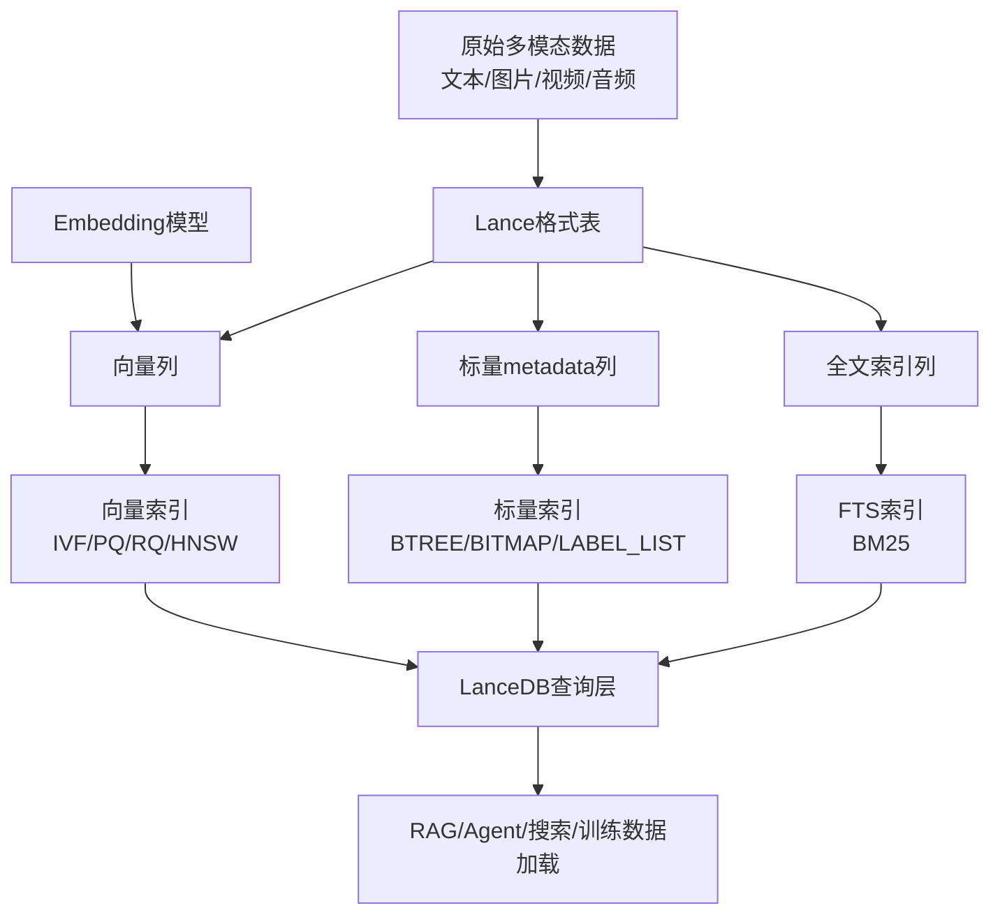
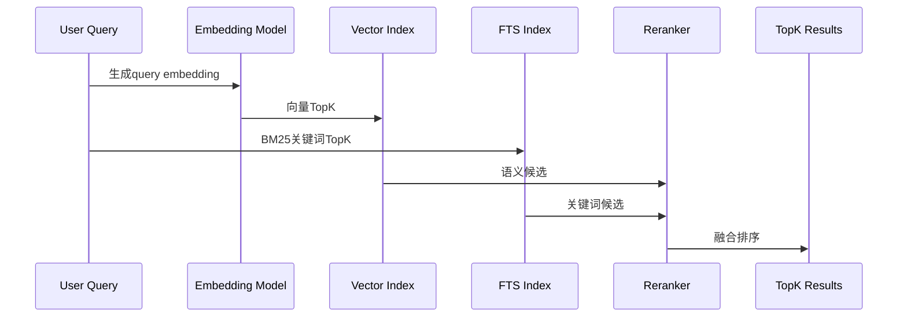

## 版本说明

本文调研时间为2026年5月19日，主要参考LanceDB官方文档、LanceDB与Lance GitHub仓库、PyPI/npm/crates.io包源、Lance格式文档以及2025年的Lance/LanceDB研究论文。LanceDB和底层Lance格式仍在快速演进，尤其是SDK、索引类型、Enterprise能力和存储格式参数，生产使用前应以官方文档和对应SDK版本为准。

截至调研时，不同包源显示的版本节奏并不完全一致：

- Python包`lancedb`在PyPI上的最新版本为`0.30.2`，上传时间为2026年3月31日。
- TypeScript包`@lancedb/lancedb`在npm上的latest为`0.29.0`，并已有`0.29.1-beta.0`。
- Rust crate `lancedb`在crates.io上的最新稳定版本为`0.29.0`，发布时间为2026年5月13日。
- 底层Lance格式crate `lance`在crates.io上的最新版本为`6.0.0`，发布时间为2026年5月11日，Git tag中已经有`v7.0.0-beta.*`预发布标签。

因此不能简单说“LanceDB当前版本是X”。更准确的说法是：LanceDB是一个由Lance格式、Rust核心、Python/TypeScript/Rust SDK、OSS本地模式、Cloud/Enterprise服务端能力共同组成的项目族。

## 先说结论

LanceDB最值得关注的点不是“又一个向量数据库”，而是它把向量搜索、全文搜索、结构化过滤、多模态对象、版本管理和训练数据访问放在同一个Lance lakehouse格式上。它的核心判断是：AI应用的数据层不应该只保存embedding，也应该保存原始文本、图片、视频、音频、特征列、索引和版本历史。

如果只做小规模RAG demo，LanceDB OSS的体验很轻：本地目录就是数据库，Python里`connect()`后创建表、写入数据、建索引、查询即可。但如果要做大规模在线服务，要注意OSS和Enterprise的边界：OSS中向量索引、标量索引更新、compaction、cleanup通常需要手动调用`optimize()`或按计划维护；Enterprise才提供更多自动索引、远程表、多租户、安全、服务端运维和后台维护能力。

我的评价是：

- 适合：多模态检索、RAG知识库、图片/视频/文档embedding管理、离线训练数据集、需要版本回溯的数据评测、希望用对象存储承载AI数据湖的团队。
- 不适合：强事务OLTP、复杂多表SQL、极低延迟且完全内存化的KV场景、希望所有分布式运维都由开源单机库自动解决的场景。
- 最大特点：存储格式和检索能力深度绑定。很多向量数据库把存储当普通KV或LSM问题处理，而LanceDB的路线是先做适合AI/多模态的列式格式Lance，再在其上做向量/全文/标量索引和表级版本管理。

## LanceDB是什么

官方README把LanceDB称为“Multimodal AI Lakehouse”。这句话比“vector database”更接近它现在的定位。传统向量数据库通常关心三件事：向量写入、ANN索引、TopK查询。LanceDB当然也做这些，但它还试图覆盖更多AI数据生命周期：

- 存储：向量、文本、图片、视频、音频、点云、metadata可以放在同一张表里。
- 检索：支持向量搜索、全文搜索、结构化过滤、混合搜索和rerank。
- 数据演进：可以后续增加embedding列、特征列、标注列，而不必重写大对象。
- 版本：表操作生成新版本，可以checkout、restore、tag，用于可复现实验和审计。
- 生态：与Arrow、Pandas、Polars、DuckDB、PyTorch、LangChain、LlamaIndex等工具对接。

一个简化的定位图如下：



这也解释了LanceDB为什么强调“disk-first”和“lakehouse”。它不是只为内存中的热embedding服务，而是希望把大规模AI数据直接放在本地盘、EBS/EFS或S3/GCS/Azure Blob这类对象存储上，再通过索引和列式读取降低查询开销。

## Lance格式是底座

理解LanceDB必须先理解Lance。Lance是一个面向多模态AI的开放lakehouse格式，官方把它拆成几层规格：

- 文件格式：保存列数据，强调随机访问和选择性读取。
- 表格式：管理fragment、manifest、删除、schema evolution和ACID提交。
- 索引格式：向量、标量、全文和系统索引作为表级对象存在。
- catalog/namespace：负责表发现、注册和跨引擎协作。

与Parquet这类通用列式格式相比，Lance的目标不是替代所有分析场景，而是补足AI/ML工作负载的痛点。典型痛点包括：

- 随机访问：训练、采样、检索常常需要按row id或候选集合读少量样本，而不是顺序扫完整表。
- 大对象：图片、视频、音频这类blob不适合被迫拆到独立对象再靠外部路径维护。
- 多阶段特征：今天只有原图和文本，明天增加CLIP embedding，后天增加人工标注或reranker分数，如果每次都重写全表成本很高。
- 索引共存：同一份数据需要向量索引、全文索引、标量过滤索引和版本历史，而不是在多个系统之间反复ETL。

Lance表把数据组织为fragment。每次写入通常生成新的fragment和新的版本；删除并不立刻重写数据文件，而是记录删除信息；更新本质上也会产生新版本。这种不可变文件 + 元数据提交的方式非常适合对象存储和版本管理，但也带来维护问题：写入次数多了之后，小fragment、旧版本、未更新索引都会积累，需要compaction、cleanup和reindex。

## 表、版本和一致性

LanceDB的表并不是“一个可变文件”。每次创建、追加、更新、删除都会产生表的新版本。版本有几个直接用途：

- reproducibility：实验可以固定在某个表版本上，避免数据悄悄变化。
- rollback：错误写入后可以restore到旧版本。
- audit：可以列出版本、时间戳、tag，追踪数据变动。
- reader isolation：读者可以继续读旧版本，写者提交新版本。

示例代码大致如下：

```python
import lancedb

db = lancedb.connect("./demo-lancedb")
table = db.create_table(
    "docs",
    data=[
        {"id": 1, "text": "hello lance", "vector": [0.1, 0.2]},
        {"id": 2, "text": "hello database", "vector": [0.2, 0.3]},
    ],
    mode="overwrite",
)

print(table.version)

table.add([{"id": 3, "text": "new document", "vector": [0.3, 0.4]}])
print(table.list_versions())

table.tags.create("baseline", 1)
table.checkout("baseline")
table.checkout_latest()
```

一致性上要区分同一个进程内的表对象和多个进程/客户端。LanceDB OSS提供`read_consistency_interval`控制读操作多久检查一次其他writer的新版本：

- 默认不自动刷新其他进程写入。
- 设置为0秒时，每次读都检查更新，freshness最强，但会增加元数据访问成本。
- 设置为非零间隔时，在间隔过后刷新，属于eventual consistency。
- 也可以手动调用`checkout_latest()`刷新到最新版本。

这个设计本质上是“版本化表 + 可配置读新鲜度”，而不是传统数据库里每条读写都走中心化事务协调器。它换来的好处是本地/对象存储部署轻，坏处是开发者必须理解表对象可能停留在旧版本。

## 写入路径和数据维护

LanceDB的写入性能很大程度上取决于写入批次。官方性能建议里强调：不要逐行调用`add()`。每次`add()`都会产生一次提交和新的fragment，逐行写入会制造大量小fragment，后续查询和维护都会变慢。

更合理的方式是：

```python
import pyarrow as pa

batch = pa.Table.from_pylist([
    {"id": 1, "text": "a", "vector": [0.1, 0.2]},
    {"id": 2, "text": "b", "vector": [0.2, 0.3]},
])

table.add(batch)
```

如果数据是流式生成的，例如边读文件边调用embedding模型，可以传入`RecordBatch`迭代器，但每个batch仍应有足够行数，避免单行batch。

`merge_insert()`支持upsert/条件插入，但它比纯`add()`慢得多，因为需要查找已有数据并做匹配。官方建议在join key上建立标量索引，否则匹配步骤会退化成全列扫描：

```python
table.create_scalar_index("doc_id")

(
    table.merge_insert("doc_id")
    .when_matched_update_all()
    .when_not_matched_insert_all()
    .execute(new_rows)
)
```

长期运行的表需要维护三类东西：

- compaction：合并小fragment，减少扫描时需要打开的文件和元数据。
- cleanup/pruning：删除过旧版本引用不到的文件，真正回收磁盘空间。
- index update：把新增数据补进已有向量/全文/标量索引。

在OSS中，`table.optimize()`把这些维护动作打包在一起，默认保留7天旧版本，也可以指定更短保留窗口：

```python
from datetime import timedelta

table.optimize()
table.optimize(cleanup_older_than=timedelta(days=1))
```

需要注意，compaction本身不一定马上省磁盘。它会先写出新的紧凑文件，而旧文件还可能被旧版本引用，只有cleanup清理旧版本后空间才会释放。

## 向量索引

LanceDB支持两大类ANN结构：IVF和HNSW。但在LanceDB里，HNSW不是完全独立的顶层索引，而是作为IVF分区内部的子索引出现。也就是说，查询先通过IVF找到若干候选分区，再在分区内用HNSW或量化结构做近似搜索。

常见索引类型包括：

| 索引 | 特点 | 适用场景 |
| --- | --- | --- |
| `IVF_FLAT` | 分区后保存原始向量，不量化 | 二进制向量、Hamming距离，或小数据高召回 |
| `IVF_PQ` | IVF + Product Quantization | 通用默认选择，维度较小如`<=256`时常有较好精度 |
| `IVF_RQ` | IVF + RaBitQ量化 | 高维向量、强压缩、降低索引体积 |
| `IVF_HNSW_FLAT` | IVF分区内HNSW，不量化 | 追求高召回、能接受索引开销 |
| `IVF_HNSW_SQ` | IVF + HNSW + Scalar Quantization | unfiltered查询下较好的召回/延迟折中 |
| `IVF_HNSW_PQ` | IVF + HNSW + PQ | 分区内图搜索和压缩结合 |

构建索引示例：

```python
table.create_index(
    metric="cosine",
    vector_column_name="vector",
    index_type="IVF_PQ",
    num_partitions=256,
    num_sub_vectors=64,
)
```

查询时的重要参数包括：

- `limit(k)`：返回TopK。
- `nprobes`：扫描多少IVF分区；越大召回通常越高，延迟也越高。
- `minimum_nprobes` / `maximum_nprobes`：过滤场景下允许自适应扩大扫描分区。
- `ef`：HNSW搜索时的探索宽度。
- `refine_factor`：先取更多量化候选，再读原始向量重新打分，提高量化索引召回。
- `bypass_vector_index()`：绕过ANN做flat scan，适合抽样评估recall@k，不适合生产大表查询。

一个常见的调参流程是：先用flat scan得到小样本ground truth，再比较ANN结果：

```python
query = [0.1, 0.2, 0.3]
k = 10

truth = set(
    table.search(query)
    .bypass_vector_index()
    .limit(k)
    .to_pandas()["id"]
)

ann = set(
    table.search(query)
    .nprobes(20)
    .refine_factor(10)
    .limit(k)
    .to_pandas()["id"]
)

recall_at_k = len(truth & ann) / k
```

过滤查询是向量数据库最容易踩坑的地方。LanceDB默认使用pre-filter，即先应用`where(...)`，再在满足条件的集合里做向量搜索；post-filter则先向量TopK，再过滤。pre-filter更符合“结果必须满足条件”的语义，post-filter可能更快，但可能返回少于`limit`甚至0条。

```python
(
    table.search(query)
    .where("lang = 'zh' AND year >= 2024")
    .limit(20)
    .to_pandas()
)
```

如果过滤列没有标量索引，系统仍要扫描对应列判断条件；如果过滤很常见，就应该建立标量索引。

## 标量索引和全文搜索

LanceDB不是只有向量索引。它的混合检索能力依赖三类索引配合。

标量索引用于metadata过滤和upsert key匹配，主要类型是：

- `BTREE`：适合高基数字段，如id、时间戳、字符串、数值范围查询。
- `BITMAP`：适合低基数字段，如类别、布尔值、状态。
- `LABEL_LIST`：适合`List<T>`列，支持`array_has_any` / `array_has_all`一类查询。

```python
table.create_scalar_index("doc_id")
table.create_scalar_index("category", index_type="BITMAP")
```

全文搜索使用BM25。默认配置适合多数英文关键词检索；如果要支持短语查询，需要启用token位置并保留停用词，但这样会显著增加索引体积和构建时间：

```python
table.create_fts_index("text")

results = (
    table.search("vector database", query_type="fts")
    .limit(10)
    .to_pandas()
)
```

FTS支持tokenizer、language、stemming、stop words、ngram等参数。中文场景需要特别关注分词器选择，例如`jieba/*`相关配置需要对应模型文件存在。否则“全文检索能跑”和“中文召回符合预期”不是一回事。

## 混合搜索和Rerank

很多RAG场景单靠向量搜索不够。向量搜索擅长语义相似，但对专有名词、编号、错误码、函数名、产品型号等精确词不稳定；BM25擅长关键词匹配，但不懂同义表达。LanceDB的hybrid search把两者结合起来，再用reranker融合排序。

基本流程是：



Python示例：

```python
from lancedb.rerankers import RRFReranker

reranker = RRFReranker()

results = (
    table.search(
        "flower moon",
        query_type="hybrid",
        vector_column_name="vector",
        fts_columns="text",
    )
    .rerank(reranker)
    .limit(10)
    .to_pandas()
)
```

LanceDB默认常用RRF（Reciprocal Rank Fusion）融合，也提供Cohere、Cross Encoder、ColBERT、Jina、VoyageAI等reranker集成。实际生产里，hybrid search通常不是“向量 + BM25直接平均分”这么简单，因为两边分数尺度不同；用rank fusion或cross-encoder重排更稳。

## 多向量检索

LanceDB还支持multivector search，即一行数据可以包含多个向量。这对ColBERT、ColPaLi这类late-interaction模型很重要。传统单向量检索把整篇文档压成一个embedding，容易丢失局部细节；late-interaction保留多个token或patch级向量，查询时用MaxSim计算相关性：

$$
\mathrm{MaxSim}(Q, D) = \sum_{i=1}^{|Q|} \max_{j=1}^{|D|} \mathrm{sim}(q_i, d_j)
$$

其中$Q$是查询的多个向量，$D$是文档的多个向量。它能更细粒度地匹配“查询词”和“文档局部片段”，但代价也明显更高：暴力扫描复杂度会随着行数、每行向量数、查询向量数一起增长。

因此multivector表比普通单向量表更需要尽早建索引。官方文档也提醒，目前multivector搜索只支持`cosine`距离，向量值类型支持`float16`、`float32`、`float64`。

## 存储后端取舍

LanceDB的一个重要差异是存储后端很灵活。官方文档把后端大致分为五类：

| 后端 | 延迟 | 成本 | 扩展 | 适合 |
| --- | --- | --- | --- | --- |
| S3/GCS/Azure Blob | 最高，p95可能较高 | 最低 | 容量几乎无限 | 大规模数据湖、离线/近线检索 |
| EFS/GCS Filestore/Azure File | 中等 | 中等 | 多节点共享 | 多实例共享数据，延迟要求不极端 |
| MinIO/WekaFS等 | 取决于集群 | 中高 | 取决于供应商 | 私有云/自建存储 |
| EBS/云盘 | 较低 | 较高 | 不易多实例共享 | 单节点低延迟服务 |
| 本地SSD/NVMe | 最低 | 运维成本高 | 需要分片/复制 | 极低延迟、可接受自管备份 |

这类设计的本质是存算分离和不可变fragment。对象存储上的延迟肯定不如本地NVMe，但容量、成本和横向扩展更好；本地盘最快，但要自己解决复制、备份、故障迁移和扩容。LanceDB没有消除这些物理事实，只是让同一个数据格式可以覆盖更多部署形态。

有几个存储相关参数值得注意：

- `new_table_enable_v2_manifest_paths`：对象存储上版本很多时，减少打开表时的listing成本；但会影响老客户端兼容。
- `new_table_enable_stable_row_ids`：让row id在compaction、delete、merge后保持稳定，适合外部系统依赖row id关联的场景。
- `new_table_data_storage_version`：选择底层数据格式版本；新表一般使用`stable`，只有兼容老reader时才考虑`legacy`。

## 与其他向量数据库的区别

可以从三个维度比较LanceDB、Milvus/Qdrant/Weaviate这类服务型向量数据库，以及pgvector这类数据库扩展。

第一，部署模型不同。LanceDB OSS更像一个嵌入式/本地优先的数据层，目录、文件系统或对象存储就是数据库位置；Milvus、Qdrant、Weaviate更像独立服务；pgvector则依附PostgreSQL。前者集成简单，后者在线服务能力和多租户控制通常更完整。

第二，存储语义不同。LanceDB的重点是“向量 + 原始多模态数据 + 版本 + lakehouse格式”。很多向量数据库更关注在线ANN服务，原始对象通常在外部对象存储，数据库只保存路径、metadata和embedding。pgvector则继承PostgreSQL事务和SQL生态，但面对大规模多模态blob、训练随机访问、对象存储lakehouse时不是它的主战场。

第三，运维边界不同。LanceDB OSS把很多维护动作交给应用侧，例如索引更新、compaction和cleanup；服务型数据库通常有后台任务和集群控制面；PostgreSQL则有成熟的VACUUM、WAL、replication生态，但向量索引和高维检索不是它最原生的能力。

一个粗略选择建议：

- 已有PostgreSQL、数据量不大、强依赖SQL/事务：优先试pgvector。
- 要独立在线向量服务、需要多租户、分布式集群、成熟运维控制面：评估Milvus、Qdrant、Weaviate等。
- 数据是多模态/训练集/对象存储，想保留版本、原始对象和embedding在同一格式里：重点评估LanceDB/Lance。
- 只做个人或小团队RAG、本地部署、Python优先：LanceDB OSS非常方便。

## 常见坑

**把LanceDB当成只追加不维护的文件夹。** 小批量频繁写入会制造大量版本和fragment，查询越来越慢。需要批量写入并定期`optimize()`。

**建了索引后忘记新增数据未必已经进索引。** LanceDB会把索引结果和未索引数据的flat scan合并，保证结果覆盖所有数据，但未索引行多了延迟会上升。用`index_stats()`检查`num_unindexed_rows`，并定期reindex/optimize。

**过滤列没有标量索引。** 向量搜索很快，但`where`条件如果要扫大列，整体仍然慢。高频过滤字段、upsert join key都应该建标量索引。

**把post-filter当成严格过滤。** post-filter先TopK再过滤，可能返回少于`limit`的结果。只要过滤条件是业务契约，默认用pre-filter。

**混合搜索不做评估。** BM25、向量和reranker的最优组合依赖数据。尤其中文、代码、专有名词、表格文档，需要分别测召回率和最终答案质量。

**忽略OSS和Enterprise差异。** OSS本地表暴露`to_pandas()`、`to_arrow()`和`to_lance()`，Enterprise RemoteTable不完全一样。为了可迁移，尽量通过`search()`和`query()`写业务路径。

**用`to_pandas()`导出大表。** 这会一次物化结果，容易爆内存。训练、导出、迁移应该按batch迭代。

## 一个实践模板

如果从零构建一个文档RAG知识库，可以按下面的思路落地：

```python
import lancedb
import pyarrow as pa

db = lancedb.connect("./rag-lancedb")

schema = pa.schema([
    pa.field("doc_id", pa.string()),
    pa.field("chunk_id", pa.string()),
    pa.field("source", pa.string()),
    pa.field("lang", pa.string()),
    pa.field("text", pa.string()),
    pa.field("vector", pa.list_(pa.float32(), 768)),
])

table = db.create_table("chunks", schema=schema, mode="overwrite")

# 批量写入，不要逐行add
table.add(pa.Table.from_pylist(rows))

# 高频过滤和upsert字段
table.create_scalar_index("doc_id")
table.create_scalar_index("lang", index_type="BITMAP")

# 全文检索
table.create_fts_index("text")

# 向量索引
table.create_index(
    vector_column_name="vector",
    metric="cosine",
    index_type="IVF_PQ",
)

# 混合检索
results = (
    table.search(
        "如何配置向量索引",
        query_type="hybrid",
        vector_column_name="vector",
        fts_columns="text",
    )
    .where("lang = 'zh'")
    .select(["doc_id", "chunk_id", "text", "source"])
    .limit(20)
    .to_pandas()
)

# 大批写入或定期维护
table.optimize()
```

生产化时至少补上四件事：

- 查询评估集：测recall@k、MRR、答案引用命中率，而不是只看demo样例。
- 索引监控：定期看`index_stats()`和查询计划。
- 维护任务：批量写入后触发`optimize()`，设置合理cleanup保留窗口。
- 版本策略：重要数据版本打tag，例如`prod-2026-05-19`，避免cleanup误删可复现实验基线。

## 总结

LanceDB的核心价值在于把AI应用的数据问题从“向量TopK服务”扩展到“多模态、可版本化、可检索、可训练的数据湖表”。它背后的Lance格式提供了随机访问、不可变fragment、表版本、索引对象和对象存储友好的基础，因此LanceDB天然适合RAG、多模态搜索、训练数据管理和embedding迭代。

它的代价也来自同一套设计：OSS模式下开发者要理解版本、fragment、索引更新和compaction；对象存储部署要接受更高尾延迟；混合检索质量需要自己评估；服务化能力很多属于Enterprise范畴。换句话说，LanceDB不是“免运维的万能向量数据库”，而是一个很有特色的AI lakehouse检索层。如果你的数据不仅是embedding，而是带着原始多模态内容、metadata、版本和训练需求，LanceDB值得重点关注。

## 参考

- [LanceDB官方文档](https://docs.lancedb.com/)
- [LanceDB GitHub仓库](https://github.com/lancedb/lancedb)
- [Lance格式官方文档](https://lance.org/)
- [Lance GitHub仓库](https://github.com/lance-format/lance)
- [LanceDB Vector Indexes文档](https://docs.lancedb.com/indexing/vector-index)
- [LanceDB Scalar Indexes文档](https://docs.lancedb.com/indexing/scalar-index)
- [LanceDB Full-Text Search文档](https://docs.lancedb.com/indexing/fts-index)
- [LanceDB Hybrid Search文档](https://docs.lancedb.com/search/hybrid-search)
- [LanceDB Consistency文档](https://docs.lancedb.com/tables/consistency)
- [LanceDB Versioning文档](https://docs.lancedb.com/tables/versioning)
- [LanceDB Storage Architecture文档](https://docs.lancedb.com/storage)
- [LanceDB Performance Tips文档](https://docs.lancedb.com/performance)
- [Lance: Efficient Random Access in Columnar Storage through Adaptive Structural Encodings](https://arxiv.org/abs/2504.15247)
