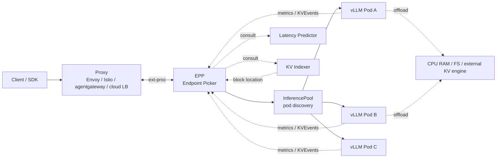
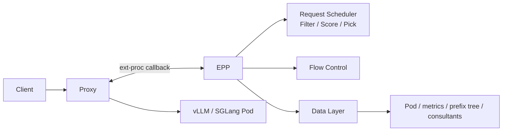
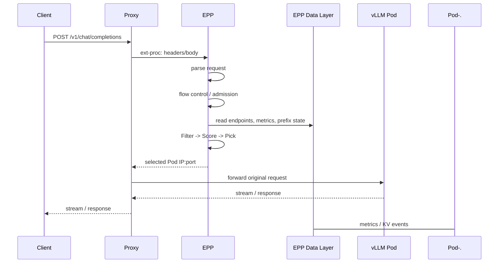
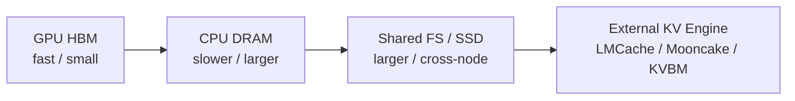
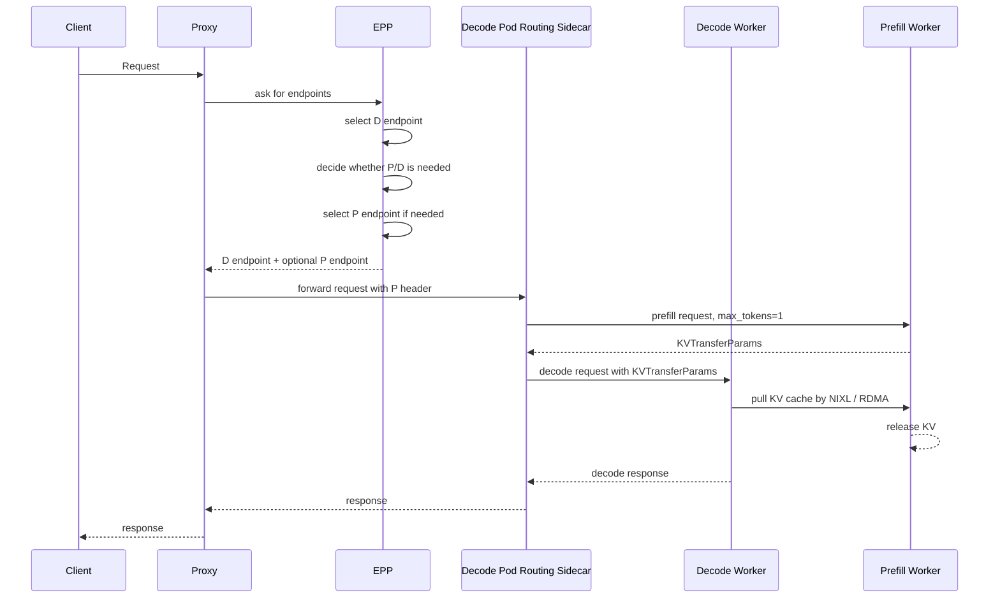
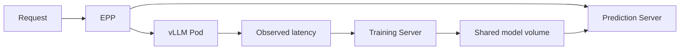
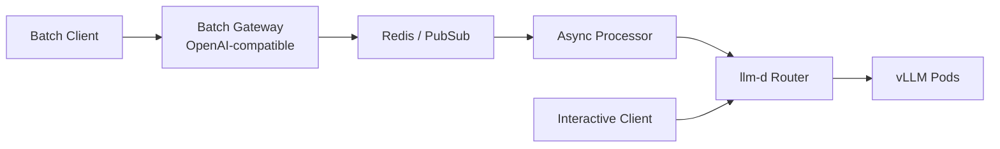

## 1. 先说结论

版本说明：本文写于 2026-06-05，主要参考 llm-d 官方仓库 `v0.7.0` release 和 `v0.7.0` tag 文档。`v0.7.0` 在 GitHub 上的发布时间是 2026-05-12；我本地阅读的 tag 对应提交是 `a47c3bd4e296c54b25f957f314317c974ad4ebbb`，提交时间是 2026-05-12 14:40:21 -0400。llm-d 发展很快，尤其是 Router/EPP、KV offload、P/D disaggregation 和 batch gateway 这些模块，生产使用时要以实际安装的 chart、镜像、CRD 版本为准。

一句话概括：

**llm-d 不是另一个推理引擎，而是一个运行在 Kubernetes 上、面向生产 LLM serving 的分布式调度和编排层。它把 vLLM/SGLang 这样的 model server、Gateway API Inference Extension、智能路由、KV cache 管理、P/D 分离、流控、扩缩容和批处理组合成一套可部署的推理栈。**

更具体地说：

1. vLLM 负责单个或一组 GPU 上的模型执行、continuous batching、PagedAttention、prefix cache、KV connector。
2. Kubernetes 负责 Pod、Service、资源调度、弹性伸缩、Gateway/API 生态。
3. llm-d 在两者之间补上生产推理最缺的一层：**请求应该去哪个推理实例、什么时候进去、是否要分成 prefill/decode 两段、如何复用跨请求 KV cache、什么时候扩容、如何保护交互请求不被 batch 请求拖垮。**
4. llm-d 的核心入口叫 **llm-d Router**。Router 由两部分组成：Proxy 和 Endpoint Picker，也就是 EPP。
5. Proxy 是数据面，通常是 Envoy、Istio、agentgateway 或云厂商兼容 Gateway 的 L7 代理。
6. EPP 是决策面，通过 `ext-proc` 协议被 Proxy 调用；它解析请求、做流控、维护端点状态、跑 Filter → Score → Pick 插件链，最后返回应该转发到哪个 model server Pod。
7. `InferencePool` 是 Kubernetes CRD，作用类似“LLM 优化版 Service”：它定义同一个模型/配置下有哪些 model server Pod 可供 EPP 选择，以及 Gateway 如何连到 EPP。
8. llm-d 最有价值的能力不是“把 vLLM 部署起来”，而是 **把 scale-out 后才出现的问题系统化解决**：prefix cache 命中率、长 prompt 和 decode 互相干扰、KV cache 工作集超过 HBM、请求成本差异巨大、多租户公平、SLO-aware routing、异构硬件扩缩容。
9. v0.7.0 release 里，项目默认部署体验改成 standalone mode，也就是 Router 自带通用 proxy；生产环境仍然更推荐完整 Gateway 方案。
10. v0.7.0 的组件版本并不全等于 `0.7.0`：例如 release 表里 `vllm-project/vllm` wheel 是 `v0.19.1`，`llm-d-inference-scheduler` 镜像是 `v0.8.0`，`llm-d-kv-cache` 库是 `v0.8.0`。不要把项目 release 号当作所有组件的语义版本。
11. v0.7.0 还把 llm-d CUDA 镜像升级到 CUDA 13.0.2；如果使用这些 CUDA 镜像，宿主机需要 NVIDIA driver 580 或更新版本。

先放一张总图：



如果只记一个心智模型，可以这样理解：

```text
vLLM / SGLang:   怎么在一个推理实例里高效算模型
Kubernetes:      怎么调度和管理容器、网络、资源
llm-d:           怎么让一组推理实例像一个高性能、可控、可扩展的LLM服务
```

## 2. llm-d为什么存在

单机 vLLM 很强，但生产 LLM 服务的问题通常不是“某一个 Pod 能不能跑模型”，而是这些问题：

1. 同一个模型有 10 个副本，请求应该发给哪个？
2. 多轮对话会反复带上同一个系统 prompt 和历史上下文，怎么让后续请求打到已有 prefix cache 的副本？
3. 一个 100 token prompt 和一个 100k token prompt 都是一个 HTTP request，普通 round-robin 完全看不出成本差异。
4. prefill 是大矩阵计算，decode 更偏显存带宽和 KV 读取；长 prefill 会影响正在 decode 的请求，怎么隔离？
5. GPU HBM 不够保存所有 KV cache，能不能把冷 KV 下沉到 CPU RAM 或共享存储？
6. batch/offline 请求吞吐优先，chat/agent 请求延迟优先，两类流量共用集群时怎么做公平和保护？
7. Kubernetes HPA 只看 CPU/GPU 利用率或普通 QPS 时太迟钝，能不能用 queue depth、running request、KV cache pressure、SLO 这类推理信号扩缩容？
8. DeepSeek-R1 这类 MoE 大模型要跨节点 expert parallel，网络、拓扑、P/D 分离和 KV 传输怎么编排？

llm-d 的目标就是把这些生产问题变成可配置、可组合、可观测的架构模块。

这也是为什么它的官方 README 把能力分成几类：

1. Intelligent Routing：prefix-cache-aware、load-aware、predicted-latency routing。
2. Advanced KV-Cache Management：KV index、KV offload、tiered prefix cache。
3. Serving Large Models：P/D disaggregation、wide expert parallelism。
4. Operational Excellence：flow control、SLO-aware autoscaling。
5. Batch Processing：OpenAI-compatible batch API 和 async processing。

注意这里的关键词是 **above model servers**。llm-d 不替代 vLLM，而是把 vLLM 这类引擎变成集群级服务。

## 3. 核心架构：Router、InferencePool、Model Server

llm-d 的 core architecture 主要围绕三个概念：

1. llm-d Router
2. InferencePool
3. Model Server

### 3.1 llm-d Router

Router 是推理请求的智能入口。它不是一个单体组件，而是由 Proxy 和 EPP 组成：



Proxy 做网络数据面的事：

1. 接收 HTTP/gRPC 请求。
2. TLS、连接管理、HTTPRoute/Gateway 接入。
3. 在请求转发前调用 EPP。
4. 根据 EPP 返回的端点，把原始请求转发给某个 model server Pod。

EPP 做 LLM-aware 决策：

1. 解析 OpenAI HTTP、vLLM gRPC 或自定义协议请求。
2. 根据 priority、fairness、saturation 做流控。
3. 从 InferencePool 里拿候选 Pod。
4. 读取 Pod metrics，例如 queue depth、running requests、KV cache utilization。
5. 读取 prefix cache 状态或 KV index。
6. 可选调用 latency predictor、KV indexer、tokenizer 这类 consultant sidecar。
7. 运行 Filter → Score → Pick 插件链。
8. 返回选中的 Pod 地址。

老文档或 release 表里有时还会出现 `llm-d-inference-scheduler` 这个名字。v0.7 文档明确把术语收敛为：

1. **llm-d Router**：完整入口，包括 Proxy + EPP。
2. **llm-d Endpoint Picker (EPP)**：真正做路由智能的组件。
3. **Request Scheduler**：EPP 内部做候选端点过滤、打分、选择的子模块。

### 3.2 InferencePool

`InferencePool` 是 Gateway API Inference Extension 里的 CRD。可以把它理解成 “Service + LLM routing metadata”。

它有两个角色：

1. 对 EPP：告诉 EPP 怎么发现可选的 model server Pod。
2. 对 Gateway controller：告诉 Gateway/Proxy 这个 pool 对应的 EPP 服务在哪里，怎么通过 `ext-proc` 调它。

一个简化的关系是：

```text
HTTPRoute backendRef -> InferencePool
InferencePool selector -> model server Pods
InferencePool endpointPickerRef -> EPP Service
Proxy ext-proc -> EPP
EPP selected endpoint -> concrete Pod IP:port
```

`InferencePool` 典型做法是用 label selector 选择同一个 namespace 下的 model server Pods。Pod 扩容、缩容、ready 状态变化时，EPP 通过 Kubernetes watch 动态更新候选列表。

这一层很关键，因为 LLM 推理的“负载均衡单位”不再只是 Service 后面的一组 endpoints，而是带有模型、角色、cache、队列、KV 状态的 endpoints。

### 3.3 Model Server

Model Server 是真正执行模型的引擎。llm-d 默认重点集成 vLLM，也提到 SGLang 等后端。

llm-d 不想重写这些能力：

1. GPU/TPU/HPU 上的模型执行。
2. PagedAttention。
3. continuous batching。
4. prefix caching。
5. KV cache connector。
6. tensor parallel、expert parallel、pipeline/distributed executor。
7. OpenAI-compatible API。

llm-d 要的是 model server 对外暴露足够的状态和控制点，让 Router 可以在集群层面做更好的决策。例如：

1. `/metrics` 暴露 queue depth、running requests、KV cache usage。
2. vLLM 发出 KVEvents，描述 block stored / removed / all cleared。
3. vLLM 支持 KV transfer config，用 NIXL 做 P/D 间 KV 传输。
4. vLLM 支持 OffloadingConnector，把 KV cache 下沉到 CPU 或共享存储。

## 4. 普通请求路径：EPP到底怎么选Pod

在最常见的 aggregated serving 模式下，一个请求只会落到一个 model server Pod 上。请求路径大概是：



EPP 内部的 Request Scheduler 是插件化的：

1. **Filter**：先缩小候选集。例如只选 ready Pod、只选 decode role Pod、只选 prefix cache match 超过阈值的 Pod。
2. **Score**：给候选 Pod 打分。例如 prefix match 高分、queue depth 低高分、KV cache utilization 低高分、预测 TTFT 更低高分。
3. **Pick**：从分数里选最终 Pod。不是所有场景都适合 argmax，weighted random 可以避免所有请求瞬间堆到当前最高分 Pod。

最简单的 optimized baseline 通常组合两类信号：

1. Prefix-aware scheduling：请求尽量去已有相同 prefix cache 的 Pod。
2. Load-aware scheduling：同时考虑 queue depth、running requests、KV cache utilization，避免热点。

为什么不能只看 cache？

假设 Pod A 有 95% prefix 命中，但它已经排了很多长请求；Pod B 没有 cache，但非常空。对一个短 SLO 请求来说，Pod B 重算 prefill 可能仍然更快。这就是 llm-d 后面引入 predicted latency 的原因：静态权重很难同时兼顾 cache locality 和实时负载。

## 5. Prefix cache aware routing：llm-d最核心的收益点

LLM 服务和普通 HTTP 服务最大区别之一是：请求之间可能共享大量前缀。

例如 agent 系统里，很多请求都有同一个系统 prompt：

```text
system prompt: 2000 tokens
tool specs:    3000 tokens
history:       1000 tokens
new question:    50 tokens
```

如果第 2 轮、第 3 轮请求被 round-robin 发到不同 vLLM Pod，那么每个 Pod 都要重新 prefill 那几千个共享 token。scale-out 越多，cache 反而越分散。

llm-d 的 prefix-cache-aware routing 目标是：

```text
不要把请求平均发到每个副本；
要把共享 prefix 的请求尽量发到已经保存该 prefix KV cache 的副本。
```

v0.7 文档里有两种实现。

### 5.1 Approximate prefix cache routing

Approximate 实现比较轻量，不依赖 tokenizer sidecar，也不要求 model server 发 KVEvents。

大概流程：

1. EPP 按字符/token 比例估算 token。
2. 把 prompt 拆成固定大小 block。
3. 用 rolling hash 建一个 prefix hash chain。
4. EPP 本地维护一个 LRU：某个 prefix hash 最近被送到哪个 Pod。
5. scorer 根据匹配 block 比例给 Pod 打分。
6. 请求路由后，EPP 假设这个 Pod 未来会持有这个 prefix。

优点：

1. 部署简单。
2. 没有 ZMQ、tokenizer、KV indexer 依赖。
3. 对简单同质 workload 已经能明显优于 round-robin。

缺点：

1. 它看到的是“EPP 认为的 cache 状态”，不是 model server 真实状态。
2. Pod 因 HBM 压力 evict 了 KV，EPP 可能不知道。
3. 字符估算 token 对多语言、多模态、特殊 tokenizer、LoRA 等场景不够准。

### 5.2 Precise prefix cache routing

Precise 实现更像生产级全局 KV cache 索引。

组件包括：

1. tokenizer / token producer：把请求精确 token 化。
2. vLLM/SGLang KVEvents：model server 在 KV block 创建、删除、清空时发事件。
3. KV-Cache Indexer：维护全局 `block key -> pods / tiers` 映射。
4. precise-prefix-cache-scorer：对候选 Pod 计算最长连续 prefix 命中长度。

这里有一个很重要的细节：**KV block 必须是连续前缀才可复用。**

假设请求 block 是：

```text
[B0, B1, B2, B3, B4]
```

三个 Pod 的 cache 状态：

```text
Pod A: B0 B1 B2 B3 --  命中4个连续block
Pod B: B0 B1 -- -- --  命中2个连续block
Pod C: -- -- B2 B3 B4  命中0个可用prefix
```

Pod C 虽然有后面的 block，但没有 B0/B1。由于 causal attention 依赖前序状态，后面的 block 不能单独作为 prefix 命中使用，所以分数是 0。

KVEvents 通常包括三类：

1. `BlockStored`：某些 block 已经创建并位于某个设备层级。
2. `BlockRemoved`：某些 block 被 evict。
3. `AllBlocksCleared`：某个 Pod 清空所有 KV cache，例如权重 rollout 或重启。

事件传递有两种形态：

1. Centralized：所有 model server publish 到 EPP 监听的 ZMQ endpoint。适合单 EPP。
2. Pod discovery：每个 model server Pod bind 自己的 ZMQ socket，多个 EPP 副本分别订阅每个 Pod。适合 active-active EPP。

Indexer backend 也有几种：

1. In-memory：默认，两级 LRU，延迟最低。
2. Cost-aware memory：Ristretto，按字节预算，更适合 entry 大小变化明显的多模态/LoRA 场景。
3. Redis / Valkey：外部存储，适合很长生命周期或持久索引，但多一次网络访问。

### 5.3 Speculative indexing解决什么问题

一个现实问题是：EPP 做出路由决策后，Pod 真正完成 prefill 并发出 `BlockStored` 事件需要一点时间。

如果两个相同 prefix 的请求几乎同时到来：

```text
t0: request A -> EPP选择Pod 1
t1: request B到达
t2: Pod 1才发出BlockStored事件
```

在 `t1` 时，KV indexer 还不知道 Pod 1 将持有这个 prefix。request B 可能被发到 Pod 2，导致重复 prefill。

Speculative indexing 的做法是：在路由决策之后，scorer 先在 index 里插入短 TTL 的预测项，表示“这个 Pod 很快会有这些 block”。如果后续 `BlockStored` 事件到达，预测被确认；如果没有到达，TTL 到期删除。v0.7 文档里的默认 TTL 是 2 秒。

## 6. KV offloading：把KV工作集扩到HBM之外

Prefix-aware routing 解决“请求该去哪里复用 cache”。KV offloading 解决“cache 能活多久、能放多大”。

GPU HBM 很贵也有限。多轮对话、agent workflow、长上下文请求会让 KV cache 工作集远大于单卡 HBM。如果没有 offloading，vLLM 只能按 LRU 把旧 KV evict 掉，后续请求再来就要重算 prefill。

llm-d 的 KV offloading 方向是把 KV block 下沉到更便宜的层级：



v0.7 文档里主要讲两类 integration pattern。

### 6.1 vLLM native OffloadingConnector

Native path 走 vLLM 的 `OffloadingConnector`。

CPU offloading 可以用类似参数开启：

```bash
--kv-offloading-backend native --kv-offloading-size 100
```

含义是给每个 vLLM instance 配一块 CPU RAM 缓冲区。被 GPU HBM evict 的 KV block 不直接丢掉，而是异步搬到 CPU RAM。后续请求命中时，从 CPU 拉回 GPU 通常比重新 prefill 快得多。

CPU offloading 的特点：

1. 低复杂度，不需要外部存储服务。
2. 每个节点/实例局部有效。
3. 适合高频复用、短期冷却、preemption recovery。
4. 前提是 CPU memory 资源要真正申请足够，否则 Kubernetes 调度和节点内存压力会出问题。

### 6.2 llm-d filesystem backend

Storage offloading 用 `llmd_fs_backend` 接到 vLLM OffloadingConnector。KV block 被存成文件，路径挂在共享文件系统上，例如 Lustre、CephFS、IBM Storage Scale、本地或网络 POSIX filesystem。

简化配置类似：

```yaml
args:
  - "--kv-transfer-config"
  - |
    {
      "kv_connector": "OffloadingConnector",
      "kv_role": "kv_both",
      "kv_connector_extra_config": {
        "spec_name": "SharedStorageOffloadingSpec",
        "spec_module_path": "llmd_fs_backend.spec",
        "shared_storage_path": "/mnt/kv-cache/",
        "block_size": 256,
        "threads_per_gpu": 64
      }
    }
volumeMounts:
  - name: kv-cache
    mountPath: /mnt/kv-cache
```

Storage offloading 的价值：

1. cache 可以跨 Pod、跨节点共享。
2. Pod 重启后 cache 不一定丢。
3. 新扩容 Pod 可以读取已有共享 KV，减少冷启动后的 cache miss。
4. 工作集上限从 HBM/CPU RAM 扩到共享存储容量。

代价也明显：

1. 读路径需要等待存储 I/O。
2. 对网络和文件系统吞吐/延迟非常敏感。
3. block size 需要调。大 block I/O 更高效，但需要更长 prefix 才能命中。
4. 文档明确提到 FS backend 不负责清理/eviction，存储容量管理需要底层系统或外部 controller。

### 6.3 out-of-tree KV engines

llm-d 也把 LMCache、Mooncake、NVIDIA KVBM 这类外部 KV cache engine 视为 connector pattern。

这类架构一般是：

```text
vLLM/SGLang/TRT-LLM
  -> KV connector API
  -> third-party connector adapter
  -> external KV engine
  -> CPU / local disk / remote store
```

它的优势是能力更灵活，能独立做索引、memory management、远程存储、controller、eviction。缺点是部署复杂度、版本兼容和排障成本都更高。

llm-d 在这里的统一点是：只要 connector 能通过 KVEvents 或等价机制把 cache mutation 暴露出来，EPP/KV indexer 就可以继续做 prefix-aware routing。

## 7. P/D disaggregation：把prefill和decode拆开

LLM 推理有两个阶段：

1. Prefill：处理输入 prompt，算出历史 token 的 KV cache。通常更偏 FLOPs-bound。
2. Decode：逐 token 生成输出，每步读取历史 KV。长上下文时更偏 memory bandwidth-bound。

Aggregated serving 里，一个 Pod 同时处理 prefill 和 decode。问题是长 prompt prefill 可能阻塞正在进行的 decode，导致交互请求的 ITL/TPOT 抖动。

P/D disaggregation 把两类工作拆到不同实例：

1. Prefill worker：专门处理 prompt prefill。
2. Decode worker：专门处理 decode。
3. 两者之间通过 NIXL/RDMA 传 KV cache。

请求流大概是：



llm-d 里 P/D 不是写死一个策略，而是 EPP 的 `disagg-profile-handler` 组合两个 profile：

1. decode-profile：先选 decode endpoint。
2. decider：判断这个请求是否值得走 P/D。例如 decode Pod 上未缓存 suffix 很大时才拆。
3. prefill-profile：如果需要 P/D，再选 prefill endpoint。

Pod 角色通过 label 区分：

```text
llm-d.ai/role=prefill
llm-d.ai/role=decode
llm-d.ai/role=prefill-decode
```

P/D 的收益：

1. 长 prefill 不再直接干扰 decode。
2. prefill 和 decode 可以用不同 TP/DP/资源形态。
3. 对 MoE DP/EP 部署尤其重要，可以减少 pipeline bubble，并让 decode 走更合适的算子格式。

P/D 的前提：

1. 节点之间最好有 RDMA。官方文档明确说 NIXL 可以 fallback 到 TCP，但 TCP 主要适合测试和开发，不适合高性能生产。
2. KV transfer 协议、model server 参数、sidecar、网络、安全策略都要配对。
3. P/D 本身会引入一次或多次额外 RPC 和 KV transfer，短 prompt/短输出不一定划算。

## 8. Predicted latency scheduling：从启发式走向在线预测

只看 queue depth、running requests、KV utilization 这类指标有一个问题：它们是粗粒度负载，不直接等于这个请求的 TTFT/TPOT。

例如：

1. 一个 10 token prompt 和一个 10k token prompt 都让 queue depth 加 1。
2. prefix cache 命中率会随 traffic pattern 变化，静态权重很容易漂。
3. TTFT 和 TPOT 的优化方向可能冲突。TTFT 偏向 cache locality，TPOT 偏向 spread load。
4. 用户可能给每个请求不同 SLO，启发式 scorer 很难回答“这个 Pod 能不能在 300ms TTFT 内完成”。

llm-d 的 Latency Predictor 用在线训练的 XGBoost 模型预测候选 Pod 上的 TTFT 和 TPOT。

架构是：



EPP 在热路径上对每个候选 endpoint 请求预测。预测输入包括：

1. KV cache usage。
2. input length。
3. queue depth。
4. running requests。
5. prefix cache match。
6. input tokens in flight。
7. tokens generated。

预测失败时，EPP 会 fallback 到由 KV cache utilization、queue depth、prefix match 组成的启发式组合，而不是直接丢请求。

Latency Predictor 有几个限制要注意：

1. 它假设同一个 pool 是 homogeneous 的，也就是 GPU 类型、模型权重、serving 配置一致。
2. 异构硬件、混合模型变体、prefill/decode 混在一个 pool 里，会让模型把不同 regime 混为一谈，预测不准。
3. 每个请求需要对候选 Pod 做预测，预测服务本身也要扩容。官方文档给出的参考是单个 prediction sidecar 在 `c4-standard-192` 节点上大约支撑 300 QPS 的 prediction work；总预测量近似是 `cluster QPS × pod count`。
4. 如果要训练真正的 TTFT/TPOT，streaming mode 和非 streaming mode 要配对；混合 workload 需要谨慎。

预测调度里比较有意思的两个插件：

1. `prefix-cache-affinity-filter`：当某些 endpoint prefix match 超过阈值时，倾向保留 cache-warm endpoints；但如果 warm Pod 预测 TTFT 明显更差，可以打破亲和。
2. `slo-headroom-tier-filter` / `latency-scorer`：根据 `SLO - predicted latency` 计算 headroom，选择刚好满足或最有余量的 endpoint。

这说明 llm-d 的 routing 方向不是简单“cache 优先”或“负载均衡优先”，而是根据请求特征和实时状态动态选择。

## 9. Flow control：不要让后端被请求淹没

普通负载均衡器通常会尽快把请求转给后端。但 LLM 请求很慢，后端一旦被塞爆，队列延迟会拖垮所有用户。

EPP 的 Flow Control 子系统负责 admission、queue、dispatch：

1. SaturationDetector 判断 pool 是否饱和，例如基于 active in-flight requests、queue depth、KV cache utilization。
2. 如果饱和，EPP 可以把请求先放在内存队列里，而不是继续打到 model server。
3. Priority bands 区分实时交互和低优先级 batch。
4. FairnessPolicy 防止一个租户或一个 flow 抢占所有 dispatch 机会。
5. OrderingPolicy 决定同一个 flow 内部的顺序，例如 FIFO 或 SLO-based。

可以把它想成 LLM 推理入口的“压力阀”：

```text
没有flow control:
client burst -> proxy -> model servers overloaded -> all requests tail latency explode

有flow control:
client burst -> EPP queue/admission -> controlled dispatch -> latency isolation/fairness
```

这对多租户平台尤其重要。batch summarization、离线 embedding、interactive chat 如果直接共用同一组 GPU，低优先级长任务很容易把实时请求拖慢。

## 10. Autoscaling：用推理信号扩缩容

LLM serving 的扩缩容不能只看 CPU 或普通 QPS。一个低 QPS 长上下文 workload 可能比高 QPS 短请求更重；KV cache pressure 也会影响是否需要更多副本。

llm-d v0.7 文档里讲两个方向：

### 10.1 HPA/KEDA

HPA/KEDA 适合简单同质部署。它用 EPP 暴露的 demand-side metrics 扩缩容，例如：

1. EPP queue depth。
2. active request count。

优点：

1. Kubernetes 原生，复杂度低。
2. 单模型、同质硬件、每个模型独立扩容时够用。

缺点：

1. 对 pending pods 不敏感。
2. 对有限 GPU 资源只会先到先得。
3. 很难保证强 latency SLO。
4. 不能全局优化多个 model variant 的资源分配。

### 10.2 Workload Variant Autoscaler

WVA 是更复杂的全局优化器。它可以考虑：

1. 不同模型。
2. 不同硬件。
3. 不同 serving topology。
4. prefill/decode 角色。
5. KV cache utilization。
6. model server queue depth。
7. SLO 目标。
8. accelerator inventory 有限时的公平分配。

它的目标不是“每个 Deployment 自己 HPA”，而是在有限资源里决定：

```text
该在哪些硬件上放哪些模型变体？
每个变体该放几个副本？
怎样满足更多SLO或降低成本？
```

如果是单模型、同构 GPU、部署刚起步，HPA/KEDA 更现实。如果是 model-as-a-service、多硬件、多 quantization、多拓扑，WVA 才开始有价值。

## 11. Wide Expert Parallelism：大MoE模型的集群形态

DeepSeek-R1 这类 MoE 模型很难靠单节点解决。Wide Expert Parallelism 的思路是用 data parallel + expert parallel，把专家层跨多节点铺开。

llm-d 的 wide-ep guide 以 DeepSeek-R1-0528 为例，默认配置里 prefill data parallelism 是 16、decode data parallelism 是 16、总 GPU 是 32。文档提到验证过的环境包括：

1. 32xH200 + InfiniBand。
2. GKE 上 32xH200 + RoCE。
3. GKE 上 32xB200 + RoCE。

关键依赖是网络。WideEP 里的 DeepEP backend 需要 All-to-All RDMA 连接。如果网络只允许同 rail NIC 通信而不是全互联，会失败。

这里 llm-d 的价值不是发明 EP，而是把这些东西组合进 Kubernetes 可部署路径：

1. LeaderWorkerSet 管理多 Pod 组成的一个逻辑推理副本。
2. Router/EPP 区分 prefill/decode role。
3. P/D disaggregation 用 NIXL 做 KV transfer。
4. Gateway/InferencePool 把多副本暴露成统一服务。
5. benchmark template 和 monitoring 提供可复现实验路径。

这类部署对普通小模型过重，但对 DeepSeek-R1、GPT-OSS-120B 这类大模型推理是实际需求。

## 12. Batch Gateway和Async Processor

llm-d v0.7 也覆盖离线/batch 推理。

它有两个组件：

1. Batch Gateway：提供 OpenAI-compatible Batch API，例如 `/v1/batches`、`/v1/files`，负责提交、追踪、管理 batch inference job。
2. Async Processor：从 Redis、Google Pub/Sub 等队列拉取单个 inference request，再发给 llm-d Router，并根据系统指标调整 dispatch rate。

两者可以单独部署，也可以组合。组合时，Batch Gateway 负责 API/job 管理，Async Processor 负责带流控地把任务推进 Router。

这解决的是另一个生产问题：**离线任务也想吃 GPU，但不能把在线交互任务打爆。**

最合理的形态是：



Async Processor 可以根据 Router/EPP 的指标调节发送速度，让 batch workload 成为“可让路”的后台流量。

## 13. 部署形态：Standalone Mode和Gateway Mode

v0.7 release 提到一个 UX 变化：默认部署改为 standalone mode，用通用 proxy 降低 gateway 配置难度；生产仍建议完整 Gateway。

### 13.1 Standalone Mode

Standalone Mode 通常是 Router 自带 proxy sidecar。优点是：

1. 上手简单。
2. 不需要先把 Istio/agentgateway/Gateway provider 全部配好。
3. 适合 quickstart、POC、benchmark、单团队集群。

缺点是：

1. 和企业已有 ingress/gateway/service mesh 集成较弱。
2. TLS、WAF、认证、跨 namespace 路由、统一流量治理等能力要另行处理。
3. 大生产环境最后通常还是会接入正式 Gateway。

### 13.2 Gateway Mode

Gateway Mode 通过 Gateway API / HTTPRoute / InferencePool 接入已有 Gateway provider。

优点：

1. Kubernetes-native。
2. 适合多团队、多 namespace、多模型服务。
3. 能复用 Istio、agentgateway、GKE L7 LB 等基础设施。
4. 更接近生产流量治理方式。

缺点：

1. 初始配置复杂。
2. Gateway API Inference Extension、provider 版本、HTTPRoute、InferencePool、EPP service 引用要全部对齐。

v0.7 release 表里的相关版本包括：

1. Gateway API Inference Extension chart：`v1.5.0`。
2. Gateway API：`v1.5.1`。
3. Istio：`1.29.1`。
4. agentgateway：release 表写的是 `v2.2.1`。

实际安装时要以对应 guide 和 chart 参数为准。

## 14. llm-d和KServe、Ray Serve、Triton是什么关系

容易混淆的地方是：llm-d 不是一个通用模型服务框架，也不是训练/推理统一平台。

粗略比较：

| 系统 | 更像什么 | llm-d相对关系 |
|---|---|---|
| vLLM | 单实例/分布式推理引擎 | llm-d 默认重点编排的 model server |
| SGLang | 推理引擎和 serving runtime | llm-d 可集成的 model server |
| Triton | 通用推理服务器 | llm-d 更专注 LLM routing/KV/P-D |
| KServe | Kubernetes 上模型服务 CRD/平台 | llm-d 可以补充 LLM-aware routing 和优化路径 |
| Ray Serve | Python/Ray 生态分布式 serving | llm-d 更 Kubernetes/Gateway/API-native |
| Dynamo | NVIDIA 推理/分布式运行时方向 | llm-d 里引用 NIXL 等能力，定位不完全相同 |

最准确的说法是：

**llm-d 是 Kubernetes-native 的 LLM inference serving stack，重点解决多副本、多阶段、多层 KV cache、多租户和高性能路由问题。**

## 15. 什么时候该用llm-d

适合用 llm-d 的场景：

1. 你已经在 Kubernetes 上跑 vLLM/SGLang，且需要 scale-out。
2. 多轮对话、agent、RAG 有大量共享 prefix，round-robin 导致 cache 命中率低。
3. 长 prompt 和短交互请求混跑，decode latency 抖动明显。
4. KV cache 工作集明显超过 HBM，想用 CPU RAM 或共享存储延长 cache 生命周期。
5. 需要 P/D disaggregation 或 MoE wide EP。
6. 多租户、多优先级流量需要 flow control 和 fairness。
7. 需要基于 queue depth、KV pressure、SLO 的扩缩容。
8. 希望有 benchmarked well-lit path，而不是从零拼 Helm/YAML。

暂时不适合或要谨慎的场景：

1. 单机单卡或只有一个 vLLM Pod，Router/EPP 带来的收益有限。
2. 只是开发测试，不需要 Gateway、流控、扩缩容。
3. Kubernetes 基础设施不成熟，团队还没有能力排查 CRD、Gateway、network policy、RDMA、storage、Prometheus。
4. 异构池里想直接用 predicted latency。官方文档明确说 predictor 假设 homogeneous pool。
5. 没有 RDMA 却想上高性能 P/D。TCP fallback 只能作为开发测试。
6. 对最低复杂度优先的小服务，直接 vLLM + 普通 Service 可能更合理。

## 16. 读源码/文档时的模块地图

如果要继续深入，可以按这个顺序读：

```text
1. README.md
   看项目定位、release news、performance highlights。

2. docs/architecture/README.md
   看 Router / InferencePool / Model Server 三件套。

3. docs/architecture/core/router/README.md
   看 Router = Proxy + EPP。

4. docs/architecture/core/router/epp/README.md
   看 EPP 的 Request Handler、Flow Control、Request Scheduler、Data Layer。

5. docs/architecture/advanced/kv-management/
   看 prefix routing、KV indexer、KV offloader。

6. docs/architecture/advanced/disaggregation/
   看 P/D 请求编排和 NIXL KV transfer。

7. docs/architecture/advanced/latency-predictor.md
   看在线 XGBoost latency prediction。

8. docs/well-lit-paths/
   看 optimized baseline、precise prefix cache、tiered prefix cache、P/D、WideEP、autoscaling、batch。

9. guides/
   看实际 Helm/Kustomize values 和可运行 recipe。
```

llm-d 官方仓库本身更像 meta repo。很多核心代码在子仓库里：

1. `llm-d/llm-d-inference-scheduler`：Router/EPP 相关。
2. `llm-d/llm-d-kv-cache`：KV index/offload connector 相关库。
3. `llm-d/llm-d-latency-predictor`：预测延迟的训练和推理服务。
4. `llm-d-incubation/batch-gateway`：batch gateway。

## 17. 一个实践落地路径

如果我是从已有 vLLM Kubernetes 服务迁移到 llm-d，会按这个顺序：

### 17.1 先做optimized baseline

目标不是一开始就上 P/D 和 KV offload，而是先让 Router 接管流量。

验收指标：

1. 请求能通过 Router 正常进 vLLM。
2. EPP 能发现 InferencePool endpoints。
3. `/metrics` 能被抓到。
4. prefix-aware + load-aware routing 相比 round-robin 有收益。
5. 故障时能判断是 Proxy、EPP、InferencePool 还是 model server 问题。

### 17.2 再上precise prefix cache

当 approximate routing 不够准时，引入 tokenizer 和 KVEvents。

重点验证：

1. tokenizer 和模型版本一致。
2. KVEvents 是否稳定送到 indexer。
3. EPP 多副本时事件订阅模式是否正确。
4. speculative indexing 是否开启。
5. prefix cache hit 对 TTFT 的实际收益。

### 17.3 然后考虑KV offloading

如果 cache eviction 是瓶颈，先从 CPU offloading 开始。它复杂度低，收益通常更直接。

当需要跨节点共享或持久化时，再考虑 shared filesystem backend。

重点验证：

1. CPU memory request/limit 足够。
2. GPU-CPU transfer 对 compute 是否有干扰。
3. storage offload 的读延迟是否真的低于 recompute。
4. block size 是否适合典型 prefix 长度。
5. 存储清理/容量上限是否有外部机制。

### 17.4 最后上P/D、WideEP和WVA

P/D 和 WideEP 是高收益高复杂度功能。上之前要先有：

1. 稳定 RDMA。
2. 清晰的 prefill/decode workload 特征。
3. 完整 tracing/metrics。
4. 可重复 benchmark。
5. 明确 SLO。

WVA 也是类似。没有多个 model variants 或异构资源时，不要为了“高级”而上。

## 18. 常见误区

### 18.1 “llm-d会让单个请求变快”

不一定。llm-d 主要优化的是集群级吞吐、tail latency、cache reuse、资源利用率和服务稳定性。单个冷请求的模型计算仍然由 vLLM/SGLang 决定。

### 18.2 “有了prefix cache routing就不需要load balancing”

错。cache-warm Pod 可能已经过载。生产路由必须同时看 cache affinity 和 load，甚至进一步看 predicted latency。

### 18.3 “KV offload一定比重算快”

不一定。CPU RAM 通常有优势，但 shared storage 的收益取决于 prefix 长度、block size、网络和文件系统。短 prompt 从存储拉 KV 可能不划算。

### 18.4 “P/D分离适合所有模型”

不一定。P/D 的收益来自阶段隔离和资源专用化，但它引入 KV transfer 和 sidecar 编排。短 prompt、低并发、小模型可能得不偿失。

### 18.5 “Predicted latency可以直接用于异构池”

不建议。v0.7 文档明确说 predictor 假设 homogeneous inference pool。异构硬件或不同 serving 配置混在一起，会让模型学习到错误关系。

### 18.6 “llm-d就是Helm chart集合”

不是。它确实提供 well-lit path 和部署 recipe，但核心是 Router/EPP 的决策框架、KV cache 管理体系和推理工作负载的控制面。

## 19. 总结

llm-d 的定位可以总结成三句话：

1. **它站在 vLLM/SGLang 之上，解决 scale-out LLM serving 的路由、KV、流控和编排问题。**
2. **它站在 Kubernetes/Gateway API 之内，用 CRD、Gateway、Pod discovery、metrics、autoscaling 把推理系统变成云原生服务。**
3. **它的核心价值在生产复杂度：prefix cache 命中、P/D 分离、KV offloading、latency prediction、flow control、autoscaling、batch 和 wide EP 都是单 Pod 推理之外的问题。**

如果你的服务还在单实例阶段，先把 vLLM 参数、模型量化、batching、KV cache 调清楚。如果你已经进入多副本、多租户、长上下文、多轮对话、P/D 或大 MoE 模型阶段，llm-d 值得认真研究。

## 参考

1. llm-d GitHub README: [https://github.com/llm-d/llm-d](https://github.com/llm-d/llm-d)
2. llm-d v0.7.0 release: [https://github.com/llm-d/llm-d/releases/tag/v0.7.0](https://github.com/llm-d/llm-d/releases/tag/v0.7.0)
3. llm-d Architecture: [https://llm-d.ai/docs/architecture](https://llm-d.ai/docs/architecture)
4. InferencePool architecture: [https://llm-d.ai/docs/architecture/core/inferencepool](https://llm-d.ai/docs/architecture/core/inferencepool)
5. llm-d Router architecture: [https://llm-d.ai/docs/architecture/core/router](https://llm-d.ai/docs/architecture/core/router)
6. EPP architecture: [https://llm-d.ai/docs/architecture/core/router/epp](https://llm-d.ai/docs/architecture/core/router/epp)
7. KV Cache Management: [https://llm-d.ai/docs/architecture/advanced/kv-management](https://llm-d.ai/docs/architecture/advanced/kv-management)
8. Prefix-Cache Aware Routing: [https://llm-d.ai/docs/architecture/advanced/kv-management/prefix-cache-aware-routing](https://llm-d.ai/docs/architecture/advanced/kv-management/prefix-cache-aware-routing)
9. KV-Cache Indexer: [https://llm-d.ai/docs/architecture/advanced/kv-management/kv-indexer](https://llm-d.ai/docs/architecture/advanced/kv-management/kv-indexer)
10. KV-Cache Offloading: [https://llm-d.ai/docs/architecture/advanced/kv-management/kv-offloader](https://llm-d.ai/docs/architecture/advanced/kv-management/kv-offloader)
11. Disaggregated Serving: [https://llm-d.ai/docs/architecture/advanced/disaggregation](https://llm-d.ai/docs/architecture/advanced/disaggregation)
12. Latency Predictor: [https://llm-d.ai/docs/architecture/advanced/latency-predictor](https://llm-d.ai/docs/architecture/advanced/latency-predictor)
13. Autoscaling: [https://llm-d.ai/docs/architecture/advanced/autoscaling](https://llm-d.ai/docs/architecture/advanced/autoscaling)
14. Batch Inference: [https://llm-d.ai/docs/architecture/advanced/batch](https://llm-d.ai/docs/architecture/advanced/batch)
15. llm-d well-lit paths: [https://llm-d.ai/docs/well-lit-paths](https://llm-d.ai/docs/well-lit-paths)
