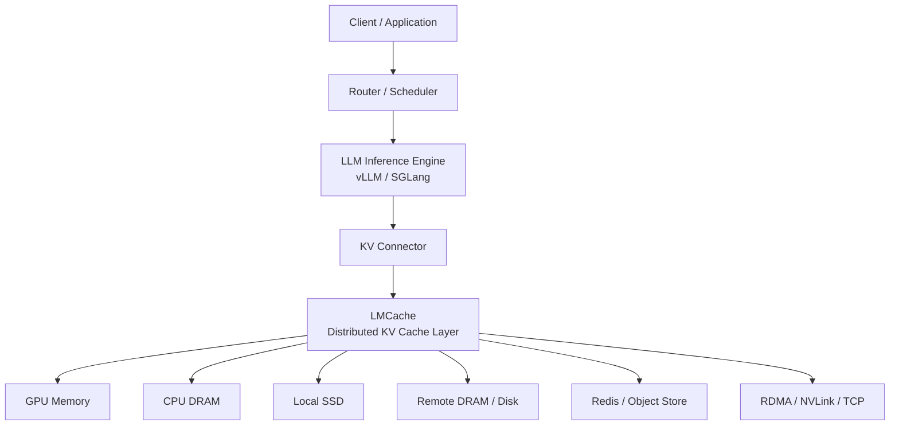
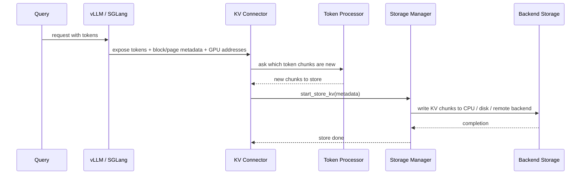
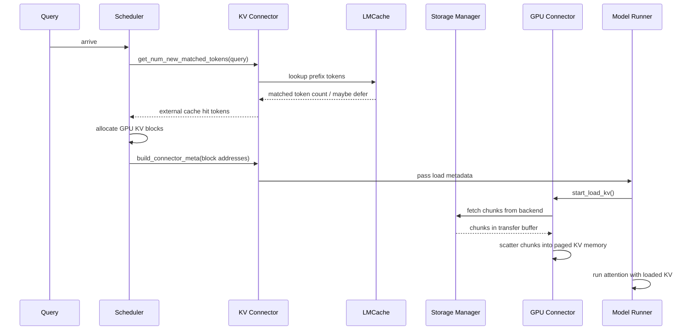
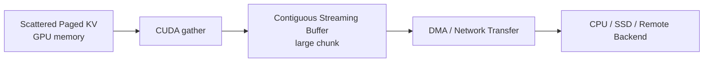
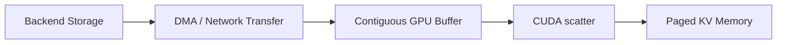
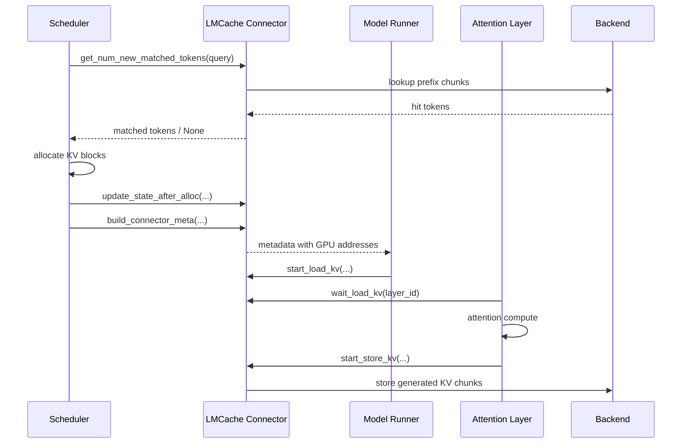
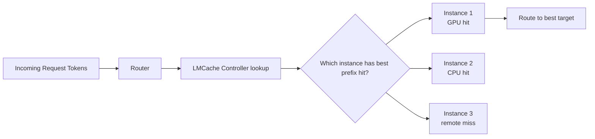

> 版本说明：本文基于 arXiv:2510.09665v2《LMCache: An Efficient KV Cache Layer for Enterprise-Scale LLM Inference》整理。论文 v1 提交于 2025-10-08，v2 修订于 2025-12-05。本文重点解析论文中的系统动机、架构设计、接口、性能优化、评测结果和生产经验，不讨论本地 PegaFlow 项目实现。

## 1. 先说结论

LMCache 这篇论文的核心观点很明确：

**KV Cache 不应该只被看成推理引擎内部的一块 GPU 显存，而应该被提升为一个可以跨请求、跨实例、跨存储层管理的“LLM 原生数据层”。**

传统推理系统里，KV cache 的生命周期基本绑定在一个请求和一个推理引擎实例里：

1. prefill 阶段计算 prompt 的 K/V。
2. decode 阶段复用同一个请求里已经算好的 K/V。
3. 请求结束后，KV 通常被释放或者只在 GPU prefix cache 里短暂保留。

LMCache 要解决的是更大的系统问题：

1. **跨请求复用**：多个请求共享长前缀时，不要重复 prefill。
2. **跨引擎复用**：一个 vLLM/SGLang 实例算出来的 KV，另一个实例也能加载。
3. **跨存储层迁移**：KV 可以在 GPU、CPU、SSD、远端内存、对象存储、Redis 等后端之间移动。
4. **P/D 分离传输**：prefill GPU 生成 KV，decode GPU 读取 KV，降低 decode 被 prefill 干扰的概率。
5. **显式控制**：上层 router、scheduler、运维系统可以 lookup、move、pin、clear、compress KV。

论文最值得抓住的不是“用了某个缓存技巧”，而是它把 KV cache 从推理引擎的内部副产品，抽象成了一个可寻址、可迁移、可调度、可压缩的系统资源。

从结果看，LMCache 在论文评测中给出几类关键收益：

| 场景 | 论文中的主要结论 |
|---|---|
| 单节点 CPU offloading | 相比基础 vLLM、vLLM native CPU offloading 和商业服务，TTFT 降低 1.9-8.1 倍；在相同 TTFT 下吞吐提升 2.3-14 倍 |
| 真实 trace | 在五个模型上，高 QPS 下 TTFT 至少降低 3.7-6.8 倍，ITL 降低 19%-58% |
| 远端集中式存储 | 相同 TTFT 下吞吐提升 1.3-3 倍 |
| P/D disaggregation | 相比 vLLM native PD，平均 TTFT 降低 1.53-1.84 倍，平均 ITL 降低 1.12-1.66 倍 |
| CPU 加载带宽 | LMCache 达到约 400Gbps，vLLM native CPU offloading 约 88Gbps |

但这篇论文也传递了一个很重要的限制：**加载 KV 不总是比重新 prefill 更快。** 当远端带宽低、上下文短、模型 prefill 本身很快时，load 可能反而更慢。因此真实系统需要做 adaptive decision：算一次和加载一次，哪个更划算。

## 2. KV Cache为什么会变成“存储层”问题

先从最基本的 decoder-only Transformer 推理说起。

对一个 token 生成过程来说，每一层 attention 都需要历史 token 的 Key 和 Value。假设请求已经有 $T$ 个历史 token，第 $T+1$ 个 token 的 decode 如果从头计算所有历史 K/V，会浪费大量计算。因此推理系统会缓存历史 token 的 K/V：

```text
prefill: 输入 prompt，一次性计算 prompt 中所有 token 的 KV
decode : 每生成一个新 token，只计算新 token 的 KV，并读取历史 KV 做 attention
```

KV cache 的大小可以粗略写成：

$$
\mathrm{KVSize} \approx 2 \times L \times T \times H_{kv} \times B
$$

其中：

1. $2$ 表示 K 和 V 两份张量。
2. $L$ 是模型层数。
3. $T$ 是 token 数。
4. $H_{kv}$ 是每个 token 的 KV 隐藏维度。
5. $B$ 是每个元素的字节数，例如 FP16/BF16 是 2 字节，量化后更小。

上下文越长、并发越高、模型越大，KV cache 越快变成显存瓶颈。长上下文、RAG、代码助手、多轮会话和 agent 工作流让这个问题更突出，因为大量请求会反复携带相似的系统提示词、文档、工具说明、会话历史或检索片段。

一个简单例子：

```text
请求1: [公司知识库文档A 12000 tokens][问题: 总结风险]
请求2: [公司知识库文档A 12000 tokens][问题: 给出审计建议]
请求3: [公司知识库文档A 12000 tokens][问题: 提取合同条款]
```

如果三个请求都重新 prefill 这 12000 tokens，GPU 会重复做大量相同计算。理想情况是：

1. 请求1算出文档A前缀的 KV。
2. 系统把这段 KV 存起来。
3. 请求2和请求3只加载这段 KV，再计算各自的短问题部分。

这就是 cross-query KV reuse。

再看 P/D 分离：

```text
prefill worker: 处理长 prompt，生成 prompt KV
decode worker : 读取 prompt KV，专注低延迟逐 token 生成
```

这里 KV cache 必须从 prefiller 传到 decoder。它已经不是一个“本请求内的显存优化”，而是两个推理实例之间的通信数据。

所以 LMCache 的动机可以概括为：

**只要 KV cache 需要跨请求、跨 worker 或跨存储层复用，它就必须拥有类似存储系统的能力：命名、查找、迁移、驱逐、固定、压缩和高效传输。**

## 3. 论文观察到的真实趋势

论文用 LMCache 真实部署中的 usage tracker 数据说明了几个趋势。

第一，存储的 KV cache 总量在增长，而且超过 GPU memory 的部分也在增长。这说明只靠 GPU 显存保留缓存不现实。很多 KV 必须被 offload 到 CPU、磁盘、远端内存或对象存储。

第二，超过 GPU capacity 的 token 也在被复用。论文用 “average reuse per token” 描述存储 token 被再次访问的次数，并观察到复用在增长。这意味着 offload 到 GPU 外部的 KV 并不是冷数据垃圾，而是有机会被加载回来继续创造价值。

第三，生产里前缀复用不只来自固定 system prompt。论文提到一些企业用户在真正上线后才发现 prefix cache hit ratio 很高，例如公司 G 生产环境里约 50% 命中。原因是现代应用存在大量“动态可复用上下文”：

1. coding assistant 的历史对话和代码上下文。
2. chat 应用的多轮历史。
3. RAG 中重复出现的文档片段。
4. agent 工作流中的工具说明、任务模板和中间状态。

这点很关键。过去很多人以为 prefix cache 只适合“固定 prompt + 多个问题”的 benchmark，但论文认为真实企业工作负载里可复用上下文比想象中多。

## 4. LMCache放在系统里的位置

论文把 LMCache 放在推理引擎和后端存储/网络之间。



这个位置决定了 LMCache 的角色不是替代 vLLM 或 SGLang，而是补齐推理引擎和外部存储/网络之间的 KV movement layer。

从模块看，论文里的 LMCache end-to-end workflow 包括这些核心组件：

| 组件 | 职责 |
|---|---|
| KV Connector | 对接 vLLM/SGLang，拿到 token、block/page、GPU 地址和调度元数据 |
| Token Processor | 判断哪些 token 已经命中、哪些 token 需要新存储 |
| Storage Manager | 管理向后端存储的保存、查找、读取 |
| GPU Connector | 负责 GPU paged memory 和 LMCache buffer 之间的数据搬运 |
| Transfer Channel | 封装 CPU/GPU/SSD/网络之间的数据传输 |
| Memory Allocator | 管理中间 buffer 和存储后端的内存分配 |
| Event Manager | 管理异步 load/store 事件，支持 pipeline |
| Cache Controller | 维护全局 KV metadata，提供 lookup/move/pin/clear/compress 等控制 API |
| LMCache Worker | 每个实例本地的控制面代理，向 controller 汇报 admit/evict 等状态 |

换句话说，LMCache 有两条路径：

1. **数据面**：真的搬 KV。
2. **控制面**：知道 KV 在哪里、能不能用、该不该迁移、要不要 pin。

## 5. Store与Retrieve流程

论文把最常见的两个流程拆成 store 和 retrieve。

### 5.1 Store：把新算出来的KV存出去

当新请求进入推理引擎，系统需要决定哪些 token 的 KV 是新产生的，需要保存到 LMCache 后端。



注意这里不是每生成一个 token 就马上写出。LMCache 会做 delayed decode KV storing：decode 过程中积累到一定 chunk 后再批量写，避免大量小写。

### 5.2 Retrieve：命中后把KV加载回GPU

当一个请求共享了已有前缀，系统要把命中部分从 LMCache 后端加载回 GPU paged KV memory。



论文里一个细节很重要：`get_num_new_matched_tokens` 可以返回 `None`。这表示 LMCache 可能让 vLLM 先把这个请求放回 waiting queue，处理别的请求，同时让当前请求的 I/O 和其他请求的计算重叠。这个设计把 KV loading 从“阻塞式等待”变成了调度层可感知的异步行为。

## 6. 三个系统挑战

LMCache 论文把难点归纳为三个。

### 6.1 Paged memory导致小IO太多

vLLM、SGLang 这类高吞吐推理引擎通常使用 paged attention / paged KV memory。它们把 KV cache 拆成小 page，例如 vLLM 一个 page 常常对应 16 个 token 的某一层 KV。论文提到一些常见模型的 KV page 大小大约在 20KB 到 63KB 范围内。

这种设计对 GPU 显存管理和 continuous batching 很友好，但对存储/网络传输不友好。因为你会面对大量小块 I/O：

```text
层数 L = 80
每层 page 数 = 很多
每个 page 只有几十 KB
一次长上下文 load/store = 大量小 copy / 小网络消息
```

小 I/O 的问题是带宽打不满。论文引用的 RCCL/UCCL 传输结果显示，message size 从 64KB 增大到 16MB 时，吞吐从 4GB/s 提升到约 49GB/s，之后基本饱和。

这解释了为什么“能搬”不等于“搬得快”。如果 KV movement 按 page 粒度直接做，即使网络或 PCIe 理论带宽很高，实际有效带宽也会很低。

### 6.2 推理引擎演进太快

LMCache 需要接入 vLLM 和 SGLang，但这些引擎变化非常快。新模型、新 attention kernel、新硬件后端、新 KV layout 都可能改变 KV cache 在 GPU memory 里的形状和地址组织。

论文举的方向包括：

1. Sliding Window Attention。
2. Multi-Head Latent Attention。
3. 新 attention kernel 的 KV layout 改动。
4. scheduler-worker 分离带来的接口边界变化。

如果 LMCache 每次都直接侵入引擎内部实现，就会被上游变化拖垮。因此它需要一个标准化 connector，把“推理引擎内部如何管理 KV”与“外部 KV cache 层如何 load/store/move”解耦。

### 6.3 缺少KV管理API

只做自动缓存还不够。真实生产系统里，router、scheduler、运维系统、业务应用都可能需要显式控制 KV。

比如：

1. Router 想知道哪个实例已经有某段前缀 KV，从而把请求路由过去。
2. 金融文档服务想 pin 热门报告的 KV，避免被驱逐。
3. Agent 平台想对某段 KV 做压缩，再跨节点迁移。
4. 扩缩容时，一个实例即将下线，需要把重要 KV move 到别的实例。
5. 切换模型或租户时，需要 clear 某些 KV。

这就是 LMCache controller API 的价值。

## 7. 性能优化：LMCache为什么快

论文的优化可以分成三类：批量化、计算与 I/O 重叠、减少拷贝。

### 7.1 Chunk而不是Page

LMCache 不直接以推理引擎的小 page 为传输单位，而是把多个 page、甚至跨层的数据聚合成更大的 chunk。论文提到默认 chunk size 是 256 tokens，且可配置。

简化过程如下：



加载时反过来：



这正是论文里 CPU loading bandwidth 能从 vLLM native CPU offloading 的 88Gbps 提高到 LMCache 400Gbps 的关键原因之一：传输粒度更大，CUDA memcpy / DMA / 网络消息的固定开销被摊薄。

### 7.2 Layer-wise pipelining

LMCache 支持按层流水线加载。它不是等所有层 KV 都加载完再开始计算，而是让第 $i+1$ 层的加载与第 $i$ 层的计算重叠。

```mermaid
gantt
    title Layer-wise KV Load and Compute Pipeline
    dateFormat X
    axisFormat %s
    section Layer 1
    load L1    :0, 1
    compute L1 :1, 3
    section Layer 2
    load L2    :1, 2
    compute L2 :3, 5
    section Layer 3
    load L3    :3, 4
    compute L3 :5, 7
```



真实实现中会使用不同 CUDA stream 区分计算和数据搬运。这样做有两个好处：

1. 只需要一个固定大小的 GPU buffer，例如一层 KV 的 buffer，而不是为完整上下文所有层准备一大块临时空间。
2. I/O 延迟可以隐藏在模型计算后面，降低端到端延迟。

论文 Figure 13 展示了 request asynchronization 后，KV loading 可以与 prefill/decode computation 重叠，端到端 delay 降低约 1.46 倍。

### 7.3 请求级异步预取

很多时候，请求进入 scheduler 后不会立刻执行，因为 GPU 正在处理其他请求。LMCache 利用这段排队时间预取 KV：

```text
请求到达 -> scheduler waiting queue -> LMCache 先从远端拉到本地 CPU/GPU buffer -> 请求真正执行时少等 I/O
```

这也是 `get_num_new_matched_tokens` 允许返回 `None` 的原因之一。它让 connector 不只是回答“命中多少 token”，还可以影响调度：这个请求先等等，我去做 I/O；你先跑其他更合适的请求。

### 7.4 最小化数据拷贝

多后端写入时，如果每个目标都复制一份 KV，中间内存压力会很大。LMCache 用引用计数管理共享数据：同一份 KV 被多个传输任务读写时，不马上复制，任务完成后递减计数，计数为 0 再释放。

这类机制在存储系统里很常见，但放到 KV cache movement 里很重要，因为 KV cache 本身非常大。

### 7.5 Dynamic Offloading

论文还讨论了 dynamic offloading。现代推理引擎会维护一批 GPU free pages。朴素策略是把所有 free pages 都复制到 CPU，但这会浪费 CPU 内存和带宽。LMCache 只复制一段窗口，用三个指针管理：

| 指针 | 含义 |
|---|---|
| Start pointer | free-page region 起点 |
| Current pointer | 已经 offload 到 CPU 的位置 |
| End pointer | 计划 offload 的终点 |

核心 tradeoff 是 duplication window 的大小：

1. 窗口小：少复制，节省资源，但请求申请较多 page 时更容易 stall。
2. 窗口大：更少 stall，但复制更多，浪费带宽和 CPU 内存。

这说明 KV offload 不是“越积极越好”，而是在 GPU page allocation latency、offload bandwidth、CPU memory 占用之间做平衡。

## 8. Connector接口：LMCache与vLLM/SGLang的解耦点

论文第 6 节是我认为最值得工程实现者关注的部分。LMCache 需要推理引擎暴露标准化 connector，使外部 KV cache 能参与调度和模型执行。

论文列出的核心接口如下。

| 接口 | 所在阶段 | 作用 |
|---|---|---|
| `get_num_new_matched_tokens(query)` | scheduler | 查询 LMCache 后端命中多少 token；也可返回 `None` 表示先延迟该请求 |
| `update_state_after_alloc(query, blocks, num_external_blocks)` | scheduler | GPU block 分配后记录哪些 block 需要从外部加载 |
| `build_connector_meta(scheduler_output)` | scheduler | 构造 worker/model runner 所需的 KV transfer metadata，包括 GPU page 地址 |
| `start_load_kv(kv_pointers)` | model runner | inference 前开始从低层存储加载 KV |
| `wait_load_kv(kv_pointers, layer_id)` | model runner / attention 前 | 等待当前层 KV 可用 |
| `start_store_kv(kv_pointer)` | model runner | computation 后开始把新 KV offload 到低层存储 |
| `wait_store_kv(kv_pointer, layer_id)` | model runner / attention 后 | 等待当前层 KV store 完成 |

这个接口拆分很有意思，因为它遵循 vLLM 的 scheduler 和 worker/model runner 分离：

1. Scheduler 侧关心“命中多少 token、要不要分配 GPU blocks、怎么影响调度”。
2. Model runner 侧关心“具体在哪个 layer load/store、什么时候 wait、KV page 地址是什么”。

如果把这两个层次混在一起，connector 很容易变成一个巨大 invasive patch。LMCache 的接口设计让外部 KV 层既能影响调度，又不强行接管模型执行。

简化生命周期如下：



论文还强调这个 API 在 vLLM 中已经运行超过六个月，并被 Dynamo、llm-d、AIBrix、vLLM production stack 等项目或公司 connector 采用。这说明它不是单纯的论文接口，而是已经进入生态协作。

## 9. Controller API：把KV变成可管理对象

LMCache controller 是集中式元数据管理组件。它维护全局 KV cache 状态，让上层系统可以做 cache-aware routing、migration、P2P sharing、clear、pin、compression 等操作。

论文把 API 分成 internal 和 external 两类。

### 9.1 Internal API

| API | 作用 |
|---|---|
| `batched_admit(hashes, inst_id, device)` | 某实例把 KV 写入某设备后，批量上报 |
| `batched_evict(hashes, inst_id, device)` | 某实例驱逐 KV 后，批量上报 |
| `batched_p2p_lookup(hashes)` | 某实例本地 miss 后，向 controller 查询其他 peer 是否有 KV |

这些接口主要服务 LMCache 实例之间的元数据同步。

### 9.2 External API

| API | 作用 |
|---|---|
| `lookup(tokens)` | 查询给定 tokens 的 KV 在哪些实例和设备上存在 |
| `move(src, dst, tokens)` | 把某段 KV 从源实例/设备迁移到目标实例/设备 |
| `clear(tokens, inst_id, device)` | 删除某实例某设备上的 KV |
| `pin(tokens, inst_id, device)` / `unpin(...)` | 固定或取消固定某段 KV |
| `compress(tokens, inst_id, device, method)` / `decompress(...)` | 对指定 KV 做压缩或解压 |

这些 API 让上层系统可以把 KV cache 当成一类数据资产。

例如 cache-aware routing：



又如扩缩容迁移：

```text
instance-A 即将下线
controller.lookup 找到重要 KV
controller.move((A, CPU), (B, CPU), tokens)
router 后续把相关请求导向 instance-B
controller.clear(tokens, A, CPU)
```

这类能力是推理引擎内置 GPU prefix cache 通常不提供的，因为它们的目标是单实例内的显存复用，而不是分布式 KV 生命周期管理。

## 10. 评测结果怎么读

论文评测覆盖三类常见部署：

| 场景 | 说明 |
|---|---|
| CPU Offload | 单节点，KV offload 到 CPU DRAM |
| Central Storage | 通过以太网连接集中式远端存储后端 |
| PD | prefiller 和 decoder 通过 NVLink 连接，做 P/D disaggregation |

模型包括 Llama-3.1-8B、Llama-3.1-70B、Qwen2.5-Coder-32B、Qwen2.5-72B、Qwen3-Coder-480B-A35B-FP8 等。硬件主要是 8xH100，单节点和多节点按模型需要分配 GPU。指标包括：

1. **TTFT**：time to first token，主要反映 prefill 或加载前缀 KV 的延迟。
2. **ITL**：inter-token latency，反映 decode 阶段每 token 间隔。
3. **Throughput / QPS**：在相同 TTFT 下能支撑的请求率。

### 10.1 单节点CPU Offload

论文用多轮 Q&A / 文档分析 workload 做测试。默认每个 query 含约 10K tokens 上下文和短问题，输出最多 100 tokens；Llama-3.1-8B 因为模型较小，输入设为 20K tokens。LMCache 最大使用 500GB CPU memory。

关键结果：

1. 低 QPS 下，LMCache 的 TTFT 比 baselines 小 1.9-8.1 倍。
2. 相同 TTFT 下，吞吐比最强 baseline 高 2.3-14 倍。
3. ITL 也有改善，论文报告相对最佳 baseline 在 QPS=1 时降低 7%-92%。

原因不是“CPU 比 GPU 快”，而是：

1. GPU prefix cache 容量有限，很多可复用 KV 留不住。
2. CPU memory 容量大，可以保留更多长上下文 KV，提高 hit ratio。
3. LMCache 的 chunk-level transfer 比 vLLM native CPU offloading 的 page-level transfer 更能打满带宽。

### 10.2 真实Trace

论文还使用公司 F 和公司 G 的真实输入/输出 token 分布构造 trace。由于没有公司 F 的 proprietary model，作者用五个开源模型重放分布，并把原本几天的 trace 拉伸/压缩到一小时内完成。

结果：

1. 公司 F trace 上，高 QPS 下 TTFT 至少降低 4.4-6.6 倍，ITL 降低 34%-58%。
2. 公司 F/G 多模型结果中，TTFT 降低 3.7-6.8 倍，ITL 降低 19%-58%。

这部分说明 LMCache 不只是 synthetic “固定 prompt” workload 下有效，在真实请求长度分布下也有效。

### 10.3 远端集中式存储

远端存储通过 15Gbps 网络连接 GPU instance。论文使用 LongBench 的 TriviaQA，并按 vLLM 官方 benchmark 脚本生成 Poisson 到达的请求。

结果是相同 TTFT 下吞吐提升 1.3-3 倍。

这里要注意一个反直觉点：远端存储延迟和带宽都比本地 CPU memory 差，但它可以存更多 KV，因此 hit ratio 更高。是否收益取决于：

```text
收益 = 避免 prefill 的计算时间 - 远端加载 KV 的时间 - 额外调度/传输开销
```

如果上下文很长，prefill 很贵，远端 load 就可能划算。如果上下文很短，模型 prefill 很快，load 可能不划算。

论文在 sensitivity study 里给出一个典型判断：在 32Gbps 网络下，KV loading 只有在输入超过 256K tokens 时才优于 naive prefill；在 64Gbps 或 128Gbps 下，loading 在所有测试长度上都优于 prefill。

### 10.4 P/D Disaggregation

P/D 场景中，LMCache 与 vLLM native PD disaggregation 对比。输入 8K tokens，输出 200 tokens。

论文结果：

1. 95th percentile TTFT 明显更低。
2. 平均 TTFT 降低 1.53-1.84 倍。
3. 平均 ITL 降低 1.12-1.66 倍。

原因还是传输粒度。vLLM native PD 用 NIXL 按 paged KV memory 地址直接从 prefiller 拷贝到 decoder。当 KV 在 prefiller GPU memory 中分散时，传输粒度细、带宽利用率低。LMCache 先把 chunked prefill 产生的 KV 拷到连续 buffer，再传给 decoder，对端再 scatter 到 paged memory，整体传输更高效。

论文的 component-wise breakdown 也说明，prefill/decode 计算时间在两者中相同，差距主要来自 KV transmission latency。

### 10.5 SGLang结果

虽然论文主要评测 vLLM，但也给出 SGLang 集成结果。Qwen3-32B 在两张 H100、TP=2 下：

1. SGLang + LMCache CPU offloading 相比无 offloading 有更高吞吐、更低平均 TTFT 和端到端延迟。
2. 相比 SGLang native CPU offloading，LMCache 性能接近。
3. 但 SGLang native CPU offloading 缺少 LMCache 这种分布式、多层级存储后端能力。

这部分说明 LMCache 的价值不完全在单节点 CPU offload 的绝对性能，而在跨引擎、跨后端的统一 KV layer。

## 11. 一个实用判断：什么时候应该Load KV，什么时候应该Prefill

读完论文后，我认为最实用的工程判断是这个不等式：

$$
T_{\mathrm{load}} + T_{\mathrm{scatter}} + T_{\mathrm{control}} < T_{\mathrm{prefill\_saved}}
$$

只有左边小于右边，加载 KV 才值得。

更具体地说：

```text
应该 load KV:
- 长上下文，例如几十K到几百K tokens
- prefix hit ratio 高
- 后端带宽足够高
- 模型 prefill 成本高
- 请求排队时间可以用于异步预取
- P/D 分离中必须跨 worker 传 KV

应该重新 prefill:
- 上下文短
- 命中 token 少或命中不连续
- 网络带宽低
- 后端 load tail latency 不稳定
- 模型小，prefill 本身很快
- KV layout 转换和 scatter 开销大于收益
```

一个粗略例子：

```text
请求A命中 100K tokens
从远端加载 + scatter 需要 800ms
重新 prefill 100K tokens 需要 4s
=> load 值得

请求B命中 2K tokens
从远端加载 + scatter 需要 120ms
重新 prefill 2K tokens 需要 60ms
=> 重新 prefill 更好
```

这也是为什么 controller、scheduler 和 connector 必须协同。KV cache 系统不能只是存储层单方面决定“命中就加载”，它需要把命中长度、存储位置、带宽、当前队列、SLO 和模型 prefill 成本放在一起判断。

## 12. 生产经验里最值得记住的点

论文第 9 节很有价值，因为它来自生产部署，不只是 benchmark。

### 12.1 远端存储不一定慢

传统直觉认为远端对象存储只适合降低成本，不适合降低延迟。但论文提到，随着 S3 Express 等远端存储性能提升，一些用户从自己的远端对象存储加载 KV，相比完整 prefill 获得了 22%-32% 更低 TTFT。

这说明 KV cache 的存储层级不能只按“本地快、远端慢”做静态判断，而要看：

1. 远端后端的实际吞吐。
2. 上下文长度。
3. 模型 prefill 速度。
4. hit ratio。
5. 是否能预取。

### 12.2 Context truncation会显著降低prefix hit

很多生产系统为了控制上下文长度，会保留最近 tokens，截断旧 tokens。这个策略对模型上下文窗口友好，但对 prefix cache 不友好。

原因是 prefix cache 依赖从开头开始匹配。如果你把前面的 tokens 删掉，只保留最近上下文，那么新的请求 token 序列不再与之前缓存的前缀对齐。

论文提到公司 F 的真实 trace 中，truncation 让 prefix cache hit ratio 从约 85% 降到约 45%。

这对 agent 和 chat 系统尤其重要。上下文工程不只是“把最相关内容塞进窗口”，还要考虑缓存可复用性。频繁动态插入、删除、重排上下文，都会破坏 KV reuse。

### 12.3 容器化比源码级集成更符合企业使用

论文提到许多企业用户只使用官方 Docker image，而不会深入改 LMCache 源码。这个观察很现实：推理基础设施在 Kubernetes 上运行，企业更关心稳定镜像、配置、监控和回滚，而不是每次都自己 patch runtime。

这也解释了为什么 LMCache 重视和 vLLM/SGLang 的 connector API 兼容，而不是做一个只适合研究 prototype 的灵活接口。

### 12.4 Python仍然可以承担控制层

论文提到行业有转向 Rust/C++ 的趋势，但 LMCache 仍选择 Python 加精心优化的底层路径。这不是说 Python 数据搬运本身快，而是把性能关键路径下沉到 CUDA、DMA、传输库、后端存储接口，把 Python 留在 orchestration 和快速迭代层。

这个取舍可以总结为：

1. 高频大数据搬运：必须靠底层高性能实现。
2. 控制逻辑、connector、生态适配：Python 的迭代速度和 ML 生态优势仍然重要。

## 13. LMCache与其他方案的边界

论文比较了几类相关工作。

### 13.1 推理框架内置Prefix Cache

vLLM/SGLang 内置 prefix cache 的优势是和 runtime 紧密结合，GPU 内命中很快。缺点是通常受限于单实例、单节点或 GPU memory，缺少统一的分布式存储与控制 API。

LMCache 不是替代内置 prefix cache，而是扩展它：

```text
GPU 内 prefix cache: 最高速、容量小、生命周期短
LMCache: 层级存储、容量大、可跨实例、可管理
```

### 13.2 存储系统或分布式对象缓存

Mooncake、Redis、InfiniStore、3FS 等可以提供后端存储能力，但它们本身不理解 vLLM/SGLang 的 paged KV layout、layer-wise loading、GPU page 地址、scheduler hooks 和 attention 前后的时机。

LMCache 的定位是 glue layer：

```text
推理引擎内部KV布局 <-> 高效数据搬运 <-> 多种存储/网络后端
```

### 13.3 研究型KV优化

很多论文研究 prefix caching、KV compression、PD disaggregation、token dropping 等，但常常是 prototype，和生产引擎/后端生态绑定较弱。LMCache 的特点是更强调工程可落地：connector 稳定、后端多、控制 API 明确、和 vLLM/SGLang 生态协作。

## 14. 我对这篇论文的理解

这篇论文真正重要的地方不是某一个数字，而是它提出了一个推理系统设计方向：

**未来 LLM inference 不会只是“请求进来、模型跑完、请求结束”。它会更像一个持久化、缓存感知、数据可迁移的计算系统。**

在这个系统里：

1. KV cache 是一类可复用中间数据。
2. Router 需要知道 KV 在哪里。
3. Scheduler 需要知道 load 和 prefill 哪个更划算。
4. Engine 需要暴露标准 connector，而不是封闭 KV layout。
5. Storage layer 需要理解 chunk、page、layer、GPU buffer 和异步事件。
6. 应用层的 context engineering 会直接影响 KV hit ratio。

换句话说，KV cache 正在从一个 kernel/runtime 优化点，变成一个跨应用、跨调度、跨存储、跨网络的系统抽象。

这也解释了为什么 LMCache 同时强调三件事：

1. **Performance**：没有高带宽 load/store，一切复用都可能被 I/O 拖垮。
2. **Interface**：没有 connector，就跟不上 vLLM/SGLang 的快速演进。
3. **Control API**：没有显式管理，上层 router 和业务系统无法真正利用 KV。

## 15. 实践建议

如果要在生产系统里评估 LMCache 或类似 KV cache layer，我会按下面顺序看。

### 15.1 先看 workload 是否真的可复用

需要统计：

1. prefix hit ratio。
2. matched tokens 分布，而不是只看命中请求比例。
3. 命中的 KV 当前在 GPU、CPU、SSD 还是远端。
4. 多轮会话、RAG 文档、agent 模板是否稳定。
5. context truncation / reranking / prompt rewriting 是否破坏前缀。

### 15.2 再看load与prefill的交叉点

需要测：

1. 不同 context length 的 prefill time。
2. 不同后端的 load + scatter time。
3. 不同网络带宽下的 tail latency。
4. chunk size 对吞吐和延迟的影响。
5. 异步预取能隐藏多少 I/O。

最后得到类似这样的策略：

```text
if backend == local_cpu and matched_tokens > 4K:
    load
elif backend == remote and bandwidth >= 64Gbps and matched_tokens > 8K:
    load
elif backend == remote and matched_tokens > 256K:
    load
else:
    prefill
```

真实阈值不能照抄，要按模型、硬件、后端、SLO 实测。

### 15.3 最后看控制面是否接得上

一个 KV cache layer 要在企业环境里有用，不能只提供 runtime 插件。还要回答：

1. Router 能不能 lookup KV 位置？
2. 扩缩容时能不能 move KV？
3. 热门文档能不能 pin？
4. 租户或模型切换时能不能 clear？
5. 压缩是否可控、可回滚、可观测？
6. 命中、加载延迟、失败、驱逐是否有指标？

这些问题比单次 benchmark 数字更决定长期可用性。

## 16. 总结

LMCache 论文可以浓缩成一句话：

**企业级 LLM 推理里，KV cache 已经大到、贵到、可复用到必须被当成一等公民管理。**

它的贡献不是简单的 CPU offload，而是一套完整 KV cache layer：

1. 通过 chunk-level transfer、layer-wise pipelining、异步预取和最小拷贝提高数据搬运效率。
2. 通过 connector API 解耦 vLLM/SGLang 快速变化的内部 KV layout。
3. 通过 controller API 让 KV 支持 lookup、move、pin、clear、compress 等显式操作。
4. 通过多层级后端支持跨请求、跨实例、跨 P/D worker 的 KV 复用。

这篇论文对做推理系统的人最大的提醒是：不要只问“这个请求怎么最快跑完”，还要问“这个请求产生的中间状态，未来能不能被别人复用”。当答案是肯定的，KV cache 就不再只是显存里的临时张量，而是推理集群里的共享数据资产。

## 参考

1. Yuhan Liu, Yihua Cheng, Jiayi Yao, et al. [LMCache: An Efficient KV Cache Layer for Enterprise-Scale LLM Inference](https://arxiv.org/abs/2510.09665), arXiv:2510.09665v2, 2025-12-05.
2. 论文 PDF：[https://arxiv.org/pdf/2510.09665](https://arxiv.org/pdf/2510.09665)
3. LMCache GitHub：[https://github.com/LMCache/LMCache](https://github.com/LMCache/LMCache)
