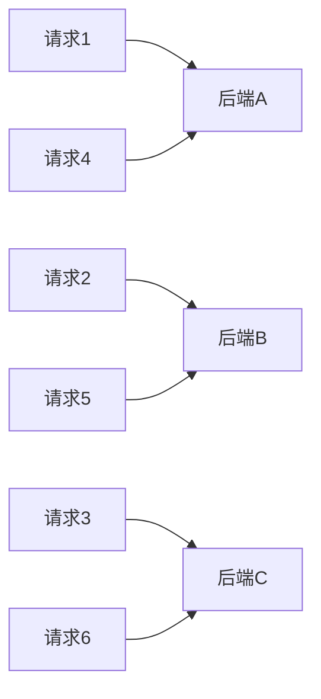
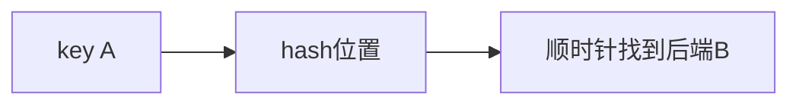
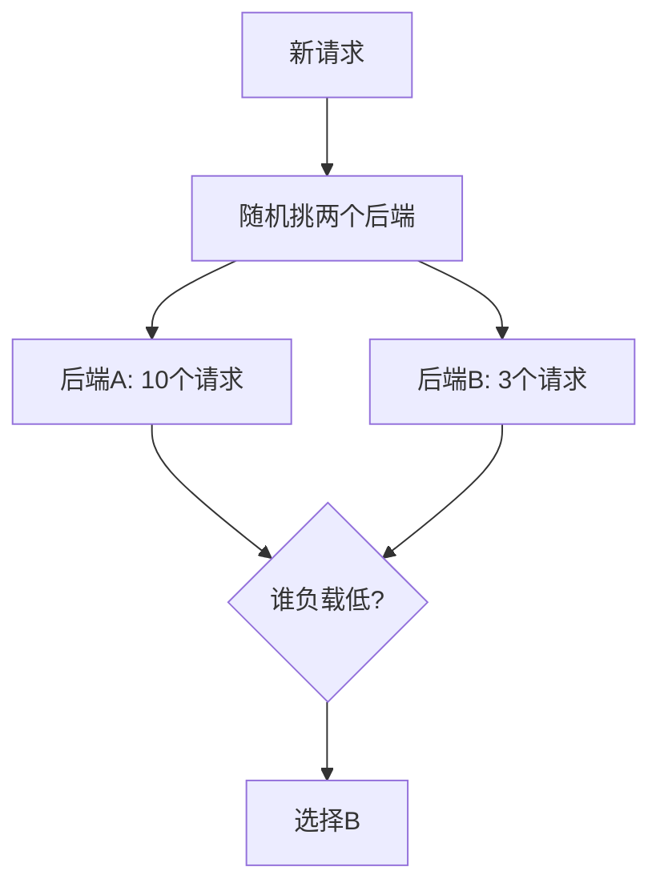
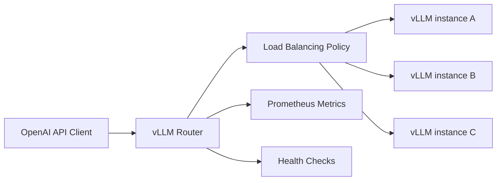
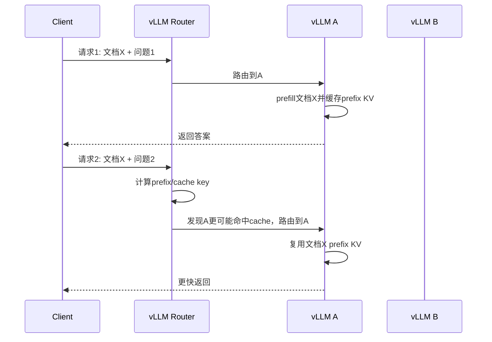
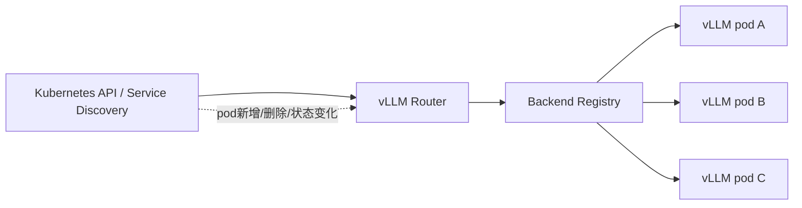
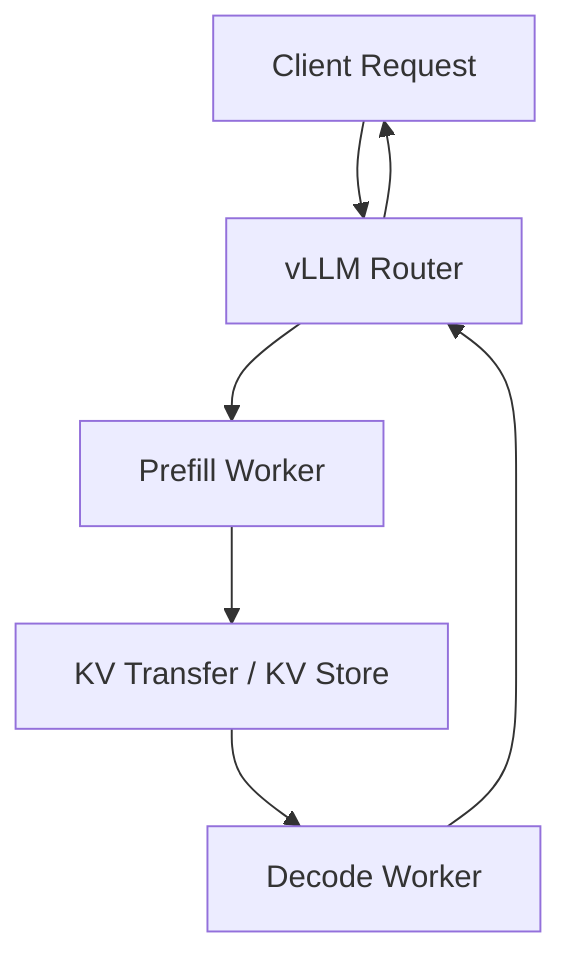
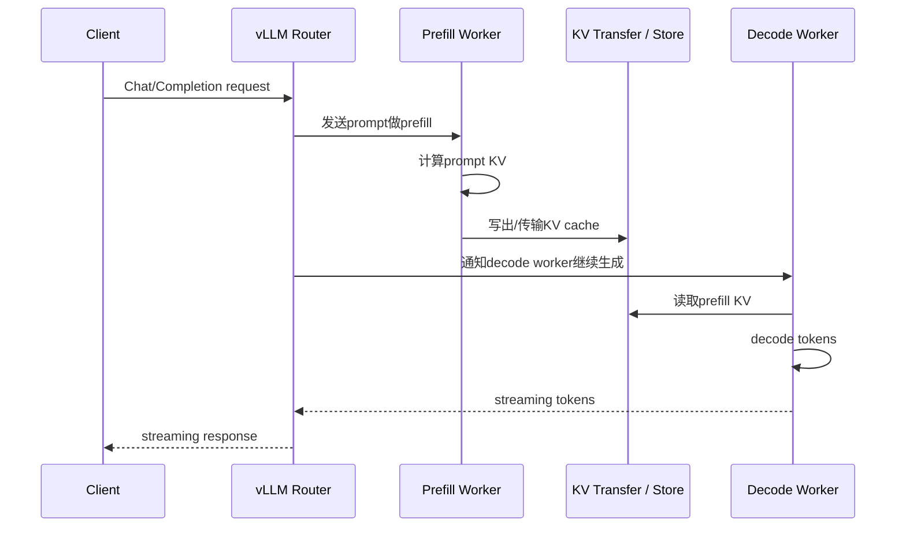
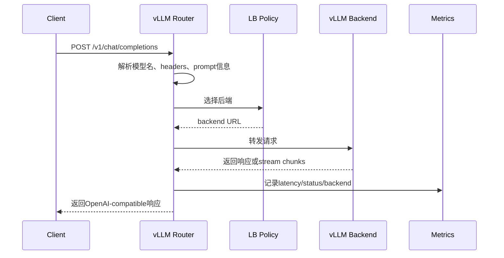

## 1. 先说结论

版本说明：本文参考的是2026-05-08访问的`vllm-project/router` GitHub仓库和官方文档。这个项目仍在快速发展，具体参数、API和策略实现要以你实际部署的版本为准。

负载均衡的核心不是“平均分请求”这么简单，而是：

**把请求分到最合适的后端，同时控制延迟、吞吐、缓存命中、故障隔离和扩缩容影响。**

常见策略可以先这样理解：

| 策略 | 核心思想 | 优点 | 缺点 | 适合场景 |
|---|---|---|---|---|
| round robin | 轮流发给每个后端 | 简单、均匀 | 不看负载、不看请求大小 | 后端能力接近、请求差异小 |
| random | 随机选后端 | 简单、无状态 | 短时间可能不均匀 | 后端多、请求较均匀 |
| consistent hash | 同一key尽量落到同一后端 | cache友好、扩缩容扰动小 | 不看实时负载，可能热点倾斜 | 有prefix cache、会话粘性 |
| power of two | 随机挑两个，选更空的 | 负载均衡效果好、开销低 | 默认不关心cache命中 | 后端负载波动明显 |
| cache aware | 结合负载和cache命中 | LLM prefix cache友好 | 需要后端cache状态，复杂 | vLLM长前缀/RAG/多轮对话 |

对LLM serving来说，负载均衡比普通HTTP服务更复杂，因为一个请求的成本差别非常大。

例如：

```text
请求A:
  prompt 100 tokens
  output 20 tokens

请求B:
  prompt 100000 tokens
  output 500 tokens
```

它们都只是一个HTTP请求，但成本完全不是一个量级。

并且LLM服务还有一个特殊点：**KV cache / prefix cache**。

如果两个请求共享很长前缀，把它们路由到同一个vLLM实例，第二个请求可能复用第一个请求的KV cache，节省大量prefill成本。

所以LLM负载均衡不只是看：

```text
哪个后端请求数少？
```

还要看：

```text
哪个后端可能已经缓存了这个前缀？
哪个后端KV cache压力小？
哪个后端队列短？
哪个后端健康？
```

`vllm-project/router`就是为这个问题做的一个Rust高性能路由层。它可以放在多个vLLM实例前面，对外提供OpenAI-compatible接口，对内把请求路由到合适的vLLM后端。

## 2. 负载均衡到底在均衡什么

初学者很容易以为负载均衡就是：

```text
请求1 -> 后端A
请求2 -> 后端B
请求3 -> 后端C
请求4 -> 后端A
```

这只是最简单的情况。

真正要均衡的东西包括：

1. 请求数量。
2. token数量。
3. prefill计算量。
4. decode计算量。
5. GPU显存和KV cache。
6. 后端队列长度。
7. 请求延迟。
8. 缓存命中率。
9. 故障和重试。
10. 扩缩容时的流量迁移。

对普通Web服务，一个请求可能成本差异不大。

对LLM服务，一个请求成本可能差1000倍。

比如：

```text
短请求:
  prompt 50 tokens
  output 20 tokens
  prefill很小，decode也很短

长上下文请求:
  prompt 128K tokens
  output 1000 tokens
  prefill巨大，KV cache巨大，decode也慢
```

如果只按请求数均衡，后端看起来每个实例都收到10个请求，但实际负载可能完全不均匀。

## 3. LLM服务里的特殊负载

LLM请求成本大致可以拆成：

$$
\mathrm{Cost}
\approx
\mathrm{PrefillCost}
+ \mathrm{DecodeCost}
+ \mathrm{KVCacheCost}
$$

### 3.1 PrefillCost

prefill和prompt长度强相关。

prompt越长，prefill越贵。

近似理解：

```text
prompt 1K:
  比较便宜

prompt 128K:
  非常贵
```

如果有prefix cache命中，prefill成本会下降。

### 3.2 DecodeCost

decode和输出长度强相关。

每生成一个token，都要跑一次模型。

输出越长，decode占用后端时间越久。

### 3.3 KVCacheCost

KV cache和上下文长度、并发请求数相关。

长上下文请求不仅计算贵，还会占用大量显存。

如果一个后端已经有很多长请求，继续给它发请求可能导致：

1. queue变长。
2. KV cache不够。
3. preemption增加。
4. TPOT变差。

所以LLM负载均衡不能只看QPS。

## 4. Round Robin

Round robin是最简单的负载均衡策略。

假设有3个后端：

```text
A, B, C
```

请求按顺序轮流分配：

```text
请求1 -> A
请求2 -> B
请求3 -> C
请求4 -> A
请求5 -> B
请求6 -> C
```

可以画成：



### 4.1 优点

1. 实现非常简单。
2. 不需要后端状态。
3. 长时间看，请求数量比较均匀。
4. 故障排查容易。

### 4.2 缺点

round robin只均衡请求数量，不均衡请求成本。

例如：

```text
后端A:
  收到10个短请求

后端B:
  收到10个长上下文请求
```

请求数一样，但B可能已经爆了。

另一个问题是cache。

如果请求有共享前缀：

```text
请求1: 文档X + 问题A
请求2: 文档X + 问题B
请求3: 文档X + 问题C
```

round robin可能分成：

```text
请求1 -> 后端A
请求2 -> 后端B
请求3 -> 后端C
```

三个后端各自prefill一次文档X，prefix cache完全没复用。

### 4.3 适合场景

round robin适合：

1. 后端能力相同。
2. 请求成本差异不大。
3. 不依赖cache命中。
4. 追求简单可靠。

不适合：

1. LLM长短请求混合。
2. prefix cache非常重要。
3. 后端负载差异大。

## 5. Random

Random策略就是随机选一个后端。

```text
请求 -> random(A, B, C)
```

### 5.1 优点

1. 实现简单。
2. 不需要全局计数器。
3. 后端很多时，长期看还算均匀。
4. 不容易因为计数器竞争成为瓶颈。

### 5.2 缺点

短时间内可能不均匀。

例如随机结果可能是：

```text
A, A, A, A, B, C
```

这会让A短时间压力变大。

random也不看cache，不看实时负载。

### 5.3 适合场景

1. 后端很多。
2. 请求成本差异较小。
3. 不想维护状态。
4. 可以接受短时间波动。

## 6. Weighted Round Robin

如果后端能力不同，可以加权。

例如：

```text
A: 8卡H100
B: 4卡A100
C: 4卡A100
```

可以给权重：

```text
A weight = 2
B weight = 1
C weight = 1
```

路由大致变成：

```text
A, A, B, C, A, A, B, C
```

优点：

1. 能表达后端能力差异。
2. 仍然简单。

缺点：

1. 权重是静态的。
2. 不知道后端实时忙不忙。
3. 仍然不cache aware。

对LLM serving，如果某些后端模型并行度不同、GPU数量不同、max_model_len不同，weighted策略会比普通round robin合理。

## 7. Least Connections / Least Requests

Least connections选择当前连接数或请求数最少的后端。

```text
后端A: 10个请求
后端B: 5个请求
后端C: 7个请求

新请求 -> B
```

直觉是：

```text
谁当前请求少，就给谁。
```

### 7.1 优点

1. 比round robin更能感知实时负载。
2. 对长连接服务有用。
3. 后端处理时间差异较大时，比单纯轮询好。

### 7.2 缺点

对LLM来说，请求数仍然不是完整负载。

例如：

```text
后端A:
  2个128K长上下文请求

后端B:
  10个短请求
```

least requests会认为A更空，但A可能更忙。

所以更好的指标应该是：

1. running requests。
2. waiting queue。
3. in-flight tokens。
4. KV cache usage。
5. estimated latency。

这也是LLM router要比普通HTTP LB更聪明的原因。

## 8. Consistent Hash

Consistent hash，一致性哈希，解决的是另一个问题：

**如何让同一个key尽量落到同一个后端，并且扩缩容时只迁移少量key。**

### 8.1 普通hash的问题

最简单的hash路由：

$$
\mathrm{backend} = \mathrm{hash}(key) \bmod N
$$

如果有3个后端：

```text
N = 3
```

当扩容到4个后端：

```text
N = 4
```

几乎所有key的取模结果都会变。

这会导致：

1. 大量cache失效。
2. 大量会话迁移。
3. 后端负载瞬间抖动。

### 8.2 一致性哈希环

consistent hash把hash空间看成一个环。

后端节点放到环上：



更完整地想象：

```text
0 ------------------------------------------------ 2^32
|      backend A      backend B       backend C     |
```

一个key hash到环上后，顺时针找到第一个后端。

扩容时，只影响新节点附近的一部分key。

### 8.3 虚拟节点

如果每个真实后端只在环上放一个点，分布可能不均匀。

所以通常用虚拟节点：

```text
backend A -> A#1, A#2, A#3, ...
backend B -> B#1, B#2, B#3, ...
```

这样key分布更均匀。

### 8.4 为什么LLM需要consistent hash

LLM场景里，consistent hash常用于：

1. 会话粘性。
2. prefix cache粘性。
3. 用户级路由。
4. 文档级路由。

例如RAG服务：

```text
请求1: document_id = doc123, question = A
请求2: document_id = doc123, question = B
```

如果路由key是`doc123`，两个请求会落到同一个后端，更容易复用doc123的prefix cache。

### 8.5 缺点

consistent hash不看实时负载。

如果某个key特别热：

```text
doc_hot
```

它可能一直打到同一个后端，形成热点。

所以consistent hash cache友好，但不一定负载均衡。

## 9. Power of Two Choices

Power of two choices是非常实用的策略。

流程：

```text
1. 随机选两个后端
2. 比较它们的负载
3. 选择更空的那个
```

画一下：



为什么只选两个就有效？

因为random可能一头撞到最忙节点。

power of two给了你一次比较机会，能显著降低最坏负载。

### 9.1 优点

1. 不需要扫描所有后端。
2. 比random和round robin更能避开热点。
3. 实现成本低。
4. 后端很多时也能扩展。

### 9.2 缺点

1. 需要知道被选中后端的负载指标。
2. 默认不考虑cache命中。
3. 负载指标选错会误判。

对LLM来说，比较指标可以是：

1. running请求数。
2. waiting队列长度。
3. 当前tokens数。
4. KV cache使用率。
5. 估计完成时间。

如果只看请求数，仍然会被长短请求差异误导。

## 10. Cache-aware Load Balancing

cache-aware策略的目标是：

**不要只选最空后端，还要选可能命中cache的后端。**

对LLM来说，最重要的cache通常是prefix cache。

### 10.1 为什么prefix cache重要

假设两个请求：

```text
请求A:
  [系统提示 + 100页文档 + 问题1]

请求B:
  [系统提示 + 100页文档 + 问题2]
```

如果B路由到A所在后端，且A的前缀KV还在，那么B可以复用：

```text
系统提示 + 100页文档
```

只需要prefill问题部分。

如果路由到另一个后端，就要重新prefill整个文档。

差距可能是：

```text
命中prefix:
  prefill 20 tokens

未命中prefix:
  prefill 100000 tokens
```

这不是一点点优化，而是数量级差异。

### 10.2 cache-aware需要什么信息

cache-aware路由至少要知道：

1. 请求的cache key。
2. 哪些后端可能有这个key。
3. 后端当前负载。
4. cache命中收益。
5. 如果后端很忙，是否还值得为了cache命中等它。

所以它通常要在两个目标之间权衡：

$$
\mathrm{Score}
= \alpha \cdot \mathrm{LoadCost}
- \beta \cdot \mathrm{CacheBenefit}
$$

如果cache收益很大，即使后端稍微忙一点，也值得去。

如果后端已经爆了，cache命中也不一定值得。

### 10.3 cache-aware的难点

1. cache状态可能过期。
2. prefix hash计算有开销。
3. 后端可能刚刚evict了对应KV。
4. 热点key可能集中到一个后端。
5. 需要和health/retry/circuit breaker配合。

所以cache-aware不是简单的consistent hash。

consistent hash是：

```text
同一个key固定去同一个后端
```

cache-aware是：

```text
根据cache命中可能性和当前负载综合选择
```

## 11. vLLM Router是什么

`vllm-project/router`是vLLM官方生态里的一个独立router项目。

它是用Rust写的高性能服务，放在多个vLLM实例前面。

整体结构可以这样看：



对客户端来说，它像一个OpenAI-compatible入口。

对后端来说，它负责把请求分发到多个vLLM server。

### 11.1 它解决什么问题

如果你只有一个vLLM实例：

```text
client -> vLLM
```

不需要router。

如果你有多个vLLM实例：

```text
client -> ?
          -> vLLM A
          -> vLLM B
          -> vLLM C
```

就需要一个入口决定请求去哪。

这个入口可以是Nginx、Envoy、K8s Service，也可以是vLLM Router。

vLLM Router的特殊价值是：

1. 知道LLM请求。
2. 支持多种LLM-aware负载均衡策略。
3. 支持cache-aware routing。
4. 支持PD disaggregation。
5. 支持Kubernetes service discovery。
6. 有Prometheus metrics。
7. 有health checks、retries、circuit breaker。

## 12. vLLM Router支持哪些负载均衡策略

根据当前文档，它支持：

1. `round_robin`
2. `random`
3. `consistent_hash`
4. `power_of_two`
5. `cache_aware`

启动示例类似：

```bash
vllm-router \
  --static-backends "http://vllm-1:8000,http://vllm-2:8000" \
  --policy round_robin
```

或者：

```bash
vllm-router \
  --static-backends "http://vllm-1:8000,http://vllm-2:8000" \
  --policy power_of_two
```

### 12.1 round_robin

适合先跑起来。

优点：

1. 简单。
2. 可预测。
3. 不需要cache状态。

缺点：

1. 不懂LLM负载。
2. 不懂prefix cache。
3. 不懂实时队列。

### 12.2 consistent_hash

适合需要粘性的场景。

比如：

```text
同一个conversation_id
同一个tenant_id
同一个document_id
```

尽量打到同一个后端。

这样可以提高cache复用。

### 12.3 power_of_two

适合负载波动明显的场景。

它比round robin更能避开忙节点，但还没有cache-aware那么复杂。

### 12.4 cache_aware

适合LLM prefix cache收益大的场景。

例如：

1. RAG长文档。
2. Agent多轮共享上下文。
3. 多用户共享同一系统prompt。
4. 批量问题问同一份文档。

## 13. vLLM Router的cache-aware为什么有用

vLLM本身有Automatic Prefix Caching。

但prefix cache默认是每个vLLM实例本地的。

假设有3个后端：

```text
vLLM A
vLLM B
vLLM C
```

请求1把文档X发到A：

```text
A缓存了文档X的prefix KV
```

请求2也带文档X。

如果router发到B：

```text
B没有文档X的KV
重新prefill
```

如果router发到A：

```text
A可能命中文档X的prefix KV
省掉大量prefill
```

cache-aware routing就是让router更倾向于把请求2发到A。

画一下：



这对长上下文尤其重要。

如果文档X是100K tokens，cache命中可能省掉巨大prefill成本。

## 14. vLLM Router和Kubernetes

当前README提到，router支持Kubernetes service discovery。

这意味着后端实例不一定要手写死。

普通静态配置是：

```text
router启动时写死:
  http://vllm-1:8000
  http://vllm-2:8000
  http://vllm-3:8000
```

这种方式简单，但有明显问题：

1. 后端扩容后，router不知道新实例。
2. 后端缩容后，router可能还会发请求给不存在的实例。
3. 某个pod重建后IP变了，静态列表失效。
4. 需要人工改配置或重启router。

service discovery解决的是：

**router自动发现当前可用的后端实例。**

在K8s里，vLLM实例可能会扩缩容：

```text
vllm-0
vllm-1
vllm-2
```

扩容后：

```text
vllm-3
vllm-4
```

router需要发现这些实例，并更新后端列表。

可以画成：



这里`Backend Registry`可以理解为router内部维护的后端列表：

```text
backend_id
url
model
health状态
负载统计
是否可接收请求
```

这时负载均衡策略的差异会体现出来：

1. round robin：新节点加入后开始轮询。
2. consistent hash：只迁移一部分key到新节点。
3. cache-aware：还要考虑新节点没有cache，刚开始可能不适合承接cache-sensitive流量。

### 14.1 服务发现和负载均衡的关系

服务发现回答的是：

```text
现在有哪些后端？
```

负载均衡回答的是：

```text
当前请求应该发给哪个后端？
```

健康检查回答的是：

```text
这个后端现在还能不能用？
```

这三件事不要混在一起。

完整流程通常是：

```text
service discovery发现后端列表
health check过滤坏后端
load balancing在健康后端里选一个
```

### 14.2 扩容时会发生什么

假设原来有两个后端：

```text
A, B
```

扩容后加入C：

```text
A, B, C
```

不同策略表现不同。

round robin：

```text
新请求开始均匀分给A/B/C
```

优点是新节点马上分流。

缺点是C是冷cache，刚开始prefix cache命中率低。

consistent hash：

```text
只有一部分key迁移到C
```

优点是大部分key还在原后端，cache扰动小。

缺点是C预热慢一些。

cache-aware：

```text
如果请求在A/B有cache，继续偏向A/B
如果没有cache或A/B太忙，才给C
```

优点是能兼顾cache和负载。

缺点是实现复杂，需要cache和负载信号。

### 14.3 缩容时会发生什么

假设C要下线。

router必须：

1. 不再给C发新请求。
2. 等C上的旧请求完成，或者让它们失败/迁移。
3. 更新后端列表。
4. 让负载均衡策略重新分配流量。

对LLM服务来说，缩容比普通HTTP更敏感，因为请求可能是长连接streaming。

如果一个streaming请求已经从C开始输出：

```text
token1 token2 token3 ...
```

中途迁移到另一个后端通常很难，因为另一个后端没有完全相同的decode状态和KV cache。

所以更合理的方式是：

```text
drain:
  C不接新请求
  C继续跑完已有请求
  完成后再移除
```

这就是为什么生产路由层需要健康状态、drain状态和后端生命周期管理。

## 15. vLLM Router和PD Disaggregation

PD disaggregation是prefill/decode分离。

直白理解：

```text
prefill worker:
  负责处理长prompt，生成KV cache

decode worker:
  负责根据KV cache生成输出tokens
```

为什么要分离？

因为prefill和decode的资源特征不同。

prefill：

1. 计算密集。
2. 大矩阵乘多。
3. 对TTFT影响大。

decode：

1. 每步小batch token。
2. 频繁读KV cache。
3. 对TPOT和吞吐影响大。

如果混在一个实例里，长prefill可能影响decode。

router可以作为入口协调不同worker类型。

简化流程：



这只是概念图。真实系统里还涉及KV transfer、connector、调度、失败恢复等。

### 15.1 为什么普通router不够

普通负载均衡只需要选一个后端：

```text
request -> backend
```

PD分离不是这样。

一个请求可能要经历两个阶段：

```text
request -> prefill worker -> decode worker
```

prefill worker算完prompt后，会产生KV cache。

decode worker要继续生成token，必须拿到这份KV cache。

所以router不只是转发HTTP请求，还要参与协调：

1. 选哪个prefill worker。
2. 选哪个decode worker。
3. prefill产生的KV怎么传到decode。
4. 如果某个阶段失败，怎么重试。
5. streaming响应怎么返回给客户端。

### 15.2 PD分离的资源视角

prefill worker适合：

1. 大batch prefill。
2. 高算力。
3. 长prompt吞吐。
4. TTFT优化。

decode worker适合：

1. 长时间维持decode batch。
2. 大KV cache容量。
3. 稳定TPOT。
4. 低延迟持续输出。

这两种worker的瓶颈不同。

prefill更像：

```text
compute-bound
```

decode更像：

```text
memory / KV bandwidth bound
```

所以分开后可以分别扩容。

例如：

```text
长prompt很多，TTFT高:
  增加prefill workers

输出很长，TPOT高:
  增加decode workers
```

如果混在一起，你只能整体扩容，成本更高。

### 15.3 PD分离的请求流程

更细一点的流程：



这里最关键的资源是KV cache。

如果KV传输慢，PD分离收益会被吃掉。

所以PD分离要看：

1. prefill耗时。
2. decode耗时。
3. KV transfer耗时。
4. worker之间网络带宽。
5. KV cache大小。
6. 请求是否足够长，值得分离。

### 15.4 PD分离适合什么场景

适合：

1. 长prompt多。
2. prefill和decode互相干扰明显。
3. 需要独立扩展prefill/decode资源。
4. 有高带宽KV传输路径。
5. 请求规模足够大，能摊销系统复杂度。

不适合：

1. 短prompt短output。
2. 单机小规模服务。
3. KV transfer比prefill节省还贵。
4. 运维复杂度不值得。

### 15.5 PD分离下的负载均衡更难

普通策略只给一个后端打分。

PD分离要给两类后端打分：

```text
prefill candidates:
  哪个prefill worker最适合处理prompt？

decode candidates:
  哪个decode worker最适合继续生成？
```

还要考虑KV路径：

```text
prefill worker P 到 decode worker D 的KV传输是否快？
```

所以一个合理的score可能要考虑：

$$
\mathrm{Score}(P, D)
= \mathrm{PrefillLoad}(P)
+ \mathrm{KVTransferCost}(P, D)
+ \mathrm{DecodeLoad}(D)
- \mathrm{CacheBenefit}(D)
$$

这就是PD分离对router提出的新要求。

## 16. Health Check、Retry、Circuit Breaker

生产环境里，router不能只会转发。

它还要处理后端故障。

### 16.1 Health Check

router定期检查后端是否健康。

如果某个后端挂了：

```text
不要继续发请求给它
```

健康检查通常不只是TCP端口通不通。

对LLM后端，更关心：

1. HTTP服务是否可用。
2. 模型是否加载完成。
3. GPU是否可用。
4. 后端是否过载。
5. 是否处于drain状态。
6. 是否支持当前请求的模型。

一个后端可能端口还活着，但已经不适合接新请求：

```text
GPU OOM频繁
KV cache长期满
请求队列爆炸
正在优雅下线
模型还没加载完
```

这类状态都应该影响路由。

### 16.2 Retry

如果请求发到某个后端失败，可以重试到其他后端。

但LLM请求重试要小心：

1. 非流式请求比较容易重试。
2. 流式请求已经输出一部分后，重试语义复杂。
3. 重试会增加后端负载。
4. 如果失败是全局过载，重试可能雪上加霜。

### 16.3 Circuit Breaker

circuit breaker断路器的作用是：

```text
某个后端连续失败太多，就暂时切断它。
过一段时间再试探恢复。
```

这能避免router不断把请求打到坏节点。

## 17. Metrics为什么重要

router如果没有metrics，很难调。

你至少要知道：

1. 每个后端收到多少请求。
2. 每个后端失败率。
3. 每个后端延迟。
4. 路由策略选择了哪个后端。
5. cache-aware命中情况。
6. retry次数。
7. circuit breaker打开次数。

vLLM Router提供Prometheus metrics。

有了metrics，才能判断：

```text
策略是否真的均衡？
cache-aware是否真的提升命中？
power_of_two是否降低热点？
consistent_hash是否造成热点key？
```

## 18. 具体例子：RAG问答应该用什么策略

假设业务是RAG问答：

```text
用户上传一份长文档
然后连续问多个问题
```

请求：

```text
docA + question1
docA + question2
docA + question3
```

如果用round robin：

```text
question1 -> backend 1
question2 -> backend 2
question3 -> backend 3
```

每个后端都要prefill docA。

如果用consistent hash，key为`doc_id`：

```text
hash(docA) -> backend 2
question1 -> backend 2
question2 -> backend 2
question3 -> backend 2
```

prefix cache命中更好。

但如果docA非常热门，backend 2会成为热点。

这时cache-aware更合理：

```text
优先找有docA cache的后端
但如果它太忙，也可以选择其他后端
```

所以RAG场景一般不建议裸round robin。

## 19. 具体例子：普通聊天应该用什么策略

普通聊天可能有conversation_id。

同一个会话的后续请求通常包含历史消息。

如果同一个conversation打到同一后端，prefix cache更可能命中。

可以用：

```text
consistent_hash(conversation_id)
```

但要注意：

1. 超活跃用户可能造成热点。
2. 后端故障后，会话会迁移，cache会丢。
3. 如果会话上下文经常被完整重传，cache-aware更有意义。

## 20. 具体例子：批处理离线任务

离线批处理通常不太在意单请求延迟，更在意吞吐。

如果请求之间没有共享prefix：

```text
power_of_two
```

通常不错。

原因：

1. 能避开忙节点。
2. 不需要复杂cache状态。
3. 扩展性好。

如果请求之间共享大前缀，比如同一系统prompt或同一文档，则可以考虑cache-aware。

## 21. 路由策略怎么选

可以按这个顺序：

### 21.1 先问：请求有没有共享上下文

如果没有：

```text
power_of_two 或 round_robin
```

如果有：

```text
consistent_hash 或 cache_aware
```

### 21.2 再问：后端负载差异大不大

如果后端负载差异小：

```text
round_robin可以接受
```

如果负载差异大：

```text
power_of_two更好
```

### 21.3 再问：prefix cache收益大不大

如果prefix很短：

```text
没必要为了cache牺牲负载均衡
```

如果prefix很长：

```text
cache-aware优先级提高
```

### 21.4 再问：是否频繁扩缩容

如果频繁扩缩容，consistent hash比普通hash更稳。

因为它减少key迁移。

## 22. 负载均衡和公平性

cache-aware可能带来一个问题：

```text
有cache的后端越来越热
```

例如热门文档docA一直命中backend A。

backend A会越来越忙。

这时需要策略做平衡：

1. 如果cache收益很大，继续发给A。
2. 如果A已经太忙，牺牲cache，发给B。
3. 也可以复制热点cache到多个后端。

这就是cache-aware的核心取舍：

$$
\mathrm{CacheBenefit}
\quad vs \quad
\mathrm{LoadCost}
$$

## 23. 负载均衡和尾延迟

很多策略平均吞吐看起来差不多，但尾延迟不同。

round robin在请求成本差异大时，可能让某些后端积累长请求。

consistent hash可能让热点key集中。

power of two通常能降低最大负载，因此尾延迟更稳。

cache-aware如果设计不好，也可能为了cache命中把请求发到忙节点，导致尾延迟变差。

所以评估路由策略要看：

1. 平均延迟。
2. p95。
3. p99。
4. p99.9。
5. cache hit rate。
6. 每个后端queue length。
7. 每个后端tokens/s。

不能只看QPS。

## 24. 一个完整请求路径

以OpenAI-compatible chat completion为例：



如果是cache-aware，中间会多一步：

```text
计算prefix/cache key
查询或估计哪些后端可能命中
结合负载选择后端
```

## 25. 初学者常见误区

### 25.1 “round robin一定最公平”

不一定。

它只对请求数量公平，不对token数量、耗时、KV cache占用公平。

### 25.2 “consistent hash就是负载均衡”

不完全。

consistent hash主要解决key稳定性和cache粘性，不保证实时负载均衡。

### 25.3 “cache-aware一定最快”

不一定。

如果为了cache命中把请求发到非常忙的后端，可能更慢。

### 25.4 “power of two太简单，不如复杂策略”

不一定。

power of two在大规模系统里非常实用，开销小，效果好。很多时候它比全局扫描所有后端更划算。

### 25.5 “普通HTTP LB足够做LLM路由”

有时够，有时不够。

如果只是多个无状态短请求，Nginx/Envoy可能够。

如果要考虑prefix cache、KV cache、PD分离、LLM后端状态，专门的LLM router更合适。

## 26. 总结

负载均衡策略没有绝对最好，只有适合场景。

round robin简单，但不懂负载差异和cache。

random简单，但短时间可能不均匀。

consistent hash适合会话粘性和cache复用，但可能热点倾斜。

power of two用很低成本避开忙节点，适合负载波动场景。

cache-aware最适合LLM长前缀和RAG场景，但实现更复杂，也要防止热点。

vLLM Router的价值在于：

1. 它不是普通HTTP反向代理。
2. 它知道后端是vLLM serving实例。
3. 它支持多种LLM相关路由策略。
4. 它能利用prefix cache相关信息。
5. 它提供health、retry、circuit breaker、metrics、service discovery等生产能力。

一句话概括：

**普通负载均衡关心“请求发给谁”，LLM负载均衡还要关心“这个请求会消耗多少tokens、是否能命中KV/prefix cache、后端GPU和KV cache现在是否撑得住”。vLLM Router就是围绕这些LLM serving问题做的路由层。**

## 27. 参考

1. vLLM Router GitHub，https://github.com/vllm-project/router
2. vLLM Router Load Balancing 文档，https://github.com/vllm-project/router/blob/main/docs/load_balancing/README.md
3. vLLM Automatic Prefix Caching 文档，https://docs.vllm.ai/en/latest/features/automatic_prefix_caching.html
4. The Power of Two Choices in Randomized Load Balancing，经典负载均衡理论方向
