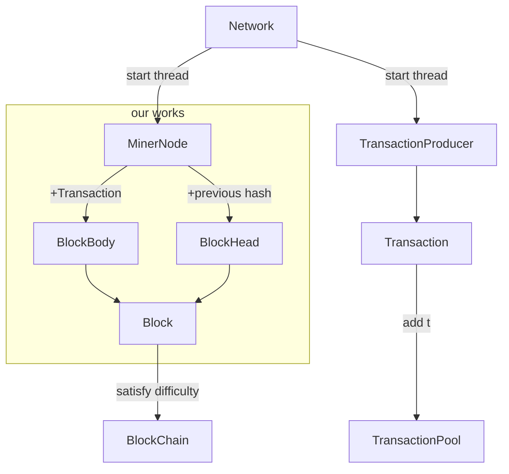

## Minichain 代码结构

```mermaid
flowchart
    subgraph our works
    MinerNode --+Transaction--> BlockBody
    MinerNode --+previous hash--> BlockHead
    BlockBody --> Block
    BlockHead --> Block
    end
    Block --satisfy difficulty--> BlockChain

    TransactionProducer --> Transaction --add to--> TransactionPool

    Network --start thread--> MinerNode
    Network --start thread--> TransactionProducer
```

需要实现的部分即MinerNode生成Block的部分

## 生成Merkle树根
此部分借助 Queue 实现
