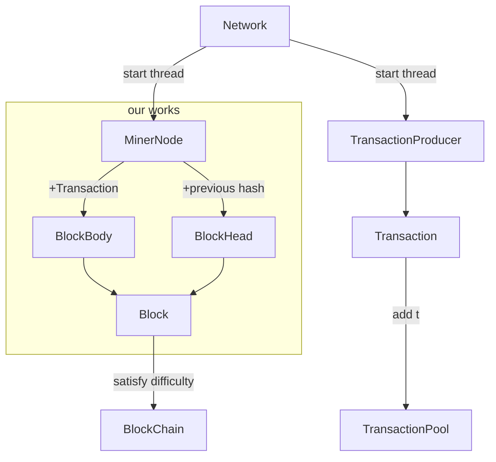
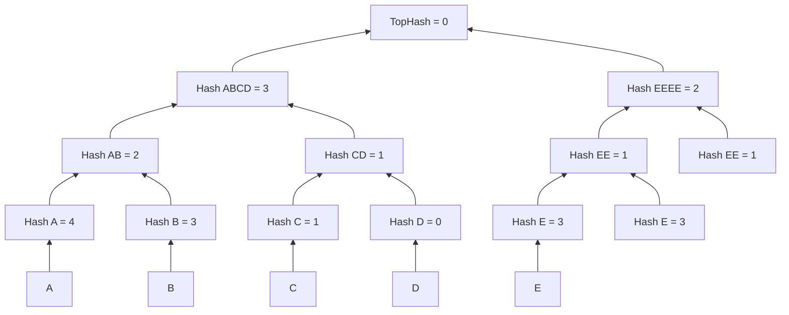

# 挖矿模拟

## Minichain 代码结构

需要实现的部分即MinerNode生成Block的部分

## 生成Merkle树根

此部分借助 Queue 实现

## 习题

### Q1

1. 分别对D01/D02/D03/D04作哈希得到哈希值
2. 拼接D01和D02的哈希值，再作哈希得到Hash11，对D03和D04拼接，再作哈希得到Hash12
3. 最后拼接Hash11和Hash12，做哈希得到最终的TopHash

### Q2

构造过程如下

### Q3

TransactionProducer 作为生产者，每次生产一个Transaction，然后放入TransactionPool

当TransactionPool达到最大值，通知挖矿进程MinerNode，会将所有的Transaction取出，然后计算Merkle树根的值，加上前一个区块的哈希值，以及一个随机数nonce得到区块头，并与所有的Transaction组成的区块体结合构成一个区块

计算整个区块体的哈希值，挖矿进程通过不断随机nonce值使得哈希值满足难度系数（前n位为0），则将其加入区块链（前一个区块的后面）

# 交易模拟

## 签名，验签，UTXO
