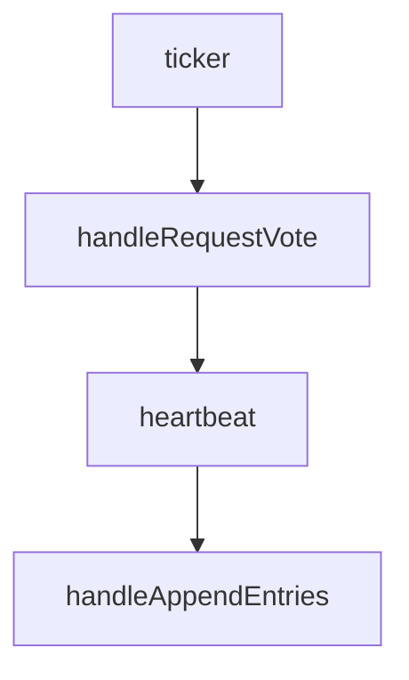

> 刷完CMU15445，继续开坑6824

# 课程笔记

公开课最新只放了2021版的，所以笔记也是基于此，但是Lab做的是2024版的。

不同于CMU15445，课程没有PPT，但是官网放了官方笔记

和学习CMU15445时一样，本笔记只记录关键词

## Introduction

- why distributed
  - connect(sharing)
  - increase parallelism
  - tolerate faults
  - achieve security(isolate)
- history
  - dns/email
  - datacenters(web)
  - cloud computing

## RPC and threads

- using channels/using mutex+cond
- sync.Mutex / sync.NewCond / cond.Broadcast / cond.Wait
- remote procedure call
- client -> stub -> stub -> server

## GFS

About GFS: https://zhuanlan.zhihu.com/p/354450124

- fault tolerance -> replication -> consistency
- ideal consistency
- gfs: big/fast/global
- gfs client/master/chunkserver
- master
  - filename -> array of chunk handles
  - chunkhandle -> version number/list of chunk servers
  - log + checkpoints
- relax consistency model
  - if some success, but some is error. Retry, but the success will write twice

## Primary/backup replication

About VM-FT: https://www.cnblogs.com/brianleelxt/p/13245754.html

- state transfer / replicated state machine(physical/logical)

## Raft

About Raft:

- https://www.cnblogs.com/brianleelxt/p/13251540.html
- https://www.cnblogs.com/xybaby/p/10124083.html
- https://docs.qq.com/doc/DY0VxSkVGWHFYSlZJ

- prev pattern: single point of failure
- majority rule
- no split brain(using term) / maybe split vote(using election timeouts)
- logs may cliverge

# 项目思路

## MapReduce

Master为Worker分配任务，输入数据(来自GFS)，Map将中间数据存储在本地，Reducer通过remote的方式获取，最后输出到GFS

当worker在一定时间内没有反应，就认为出了故障，此时重新执行，并且这个worker上执行成功的所有map都得重新执行(认为这个worker无法被访问了)

Map和Reduce可能重复运行，但是结果是不变的

Map过程为生成一组KeyValue对，然后对Key做partition将结果分到nReduce个桶中

Reduce读取这个桶下的所有中间文件，将所有KeyValue对按照Key排序，然后得到每组`Key[Values]`传入用户reduce函数得到结果

### 文件结构

给出的`main/mrsequential.go`为单线程mapreduce参考文件

需要实现伪分布式mapreduce，主线程为`main/mrcoordinator.go`和`main/mrworker.go`

在本次实验中，map的结果存储为文件，不用考虑reducer对文件的remote调用

另外在`mrapps`目录下放置了很多mapreduce的应用文件(例如`wc.go`)，以插件的形式加载

需要修改的是`mr`目录下文件

### 整体思路

- 一个任务包括任务类型、任务编号、输入文件名
- Coordinator初始化时即分配好Map任务
- Worker初始化后先向Coordinator获得一个worker_id，然后向Coordinator请求任务，拿到任务并执行成功后，通知Coordinator
- 若任务已完成，不再接受其他此任务的成功完成，同时将记录Map任务完成后生成的中间文件名
- Worker生成中间文件命名为`mr-X-Y-W`，分别为Map任务编号，Reduce任务编号，Worker编号
- 每次分配任务都开一个后台线程，睡眠10s然后检查任务是否完成，否则将任务重新添加
- 通过Channel添加和分配任务、通过WaitGroup判断任务完成阶段（Map->Reduce->Finish）

### 结果

任务的容错处理比较简单，只要10s内没有结果就再安排一次任务，这样可能多个Worker同时执行同一个任务，由于Map中间文件名已经通过Worker编号标识，并且Coordinator只认首次完成成功的结果，所以不会造成冲突，而对于Reduce来说，由于每次Reduce的结果都一样，可能有多个Reduce同时写一个输出文件，但是结果不会受到影响

`sh test-mr-many.sh 500` 运行500次没出现故障

## Raft

实验仅需修改`raft.go`文件，测试代码位于`raft/test_test.go`

### Part A: leader election

阅读测试代码，首先根据论文图2完善raft相关结构，然后在Make函数中进行初始化。

另外由于测试要求1s不超过几十次心跳发送，所以设置心跳发送间隔为100ms，选举超时设置为300\~600ms，同时设置ticker每10ms检查是否需要进行选举。

具体步骤为，ticker每10s检查超时，如果超时则变为candidate，重置时间，给自己投票，然后广播发起选举，为每个节点启动一个goroutine，发起RequestVote RPC调用，见函数handleRequestVote

在handleRequestVote中，处理RPC调用的reply，如果得票超过半数，则变为leader，否则如果遇到新的term，则从candidate变为follower。变为leader后启动heartbeat goroutine。

在heartbeat中，每100s为每个节点启动一个goroutine，发送不包括entries的AppendEntries RPC调用，见函数handleAppendEntries。

在handleAppendEntries中，处理RPC调用的reply，如果遇到新的term，则从leader变为follower。

函数调用关系为：

然后就是RPC函数过程，对于RequestVote来说，如果request的term更大，则更新状态（follower，term），同时重置超时时间，返回voteGranted为true，否则只返回false

对于AppendEntries来说，如果request的term更大或相等，则更新状态（follower，term），同时重置超时时间，返回success为true，否则只返回false。

测试结果如下：

    

