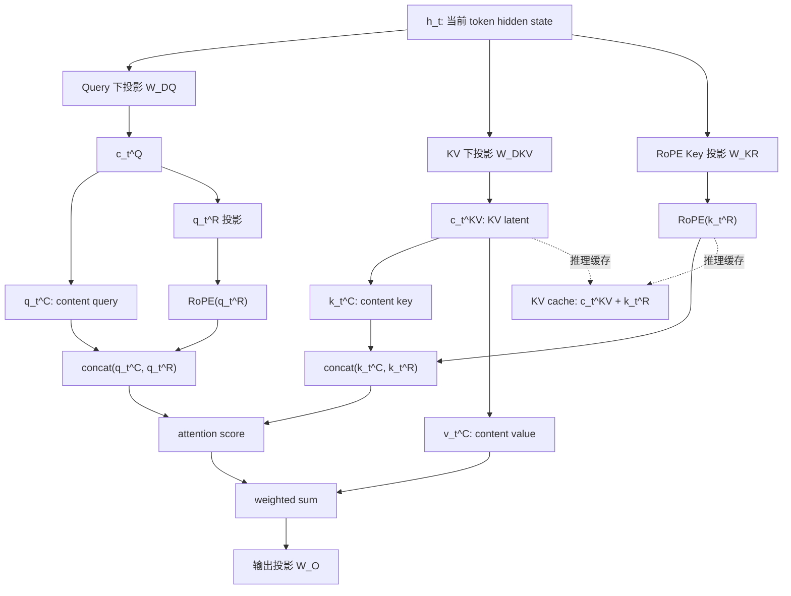
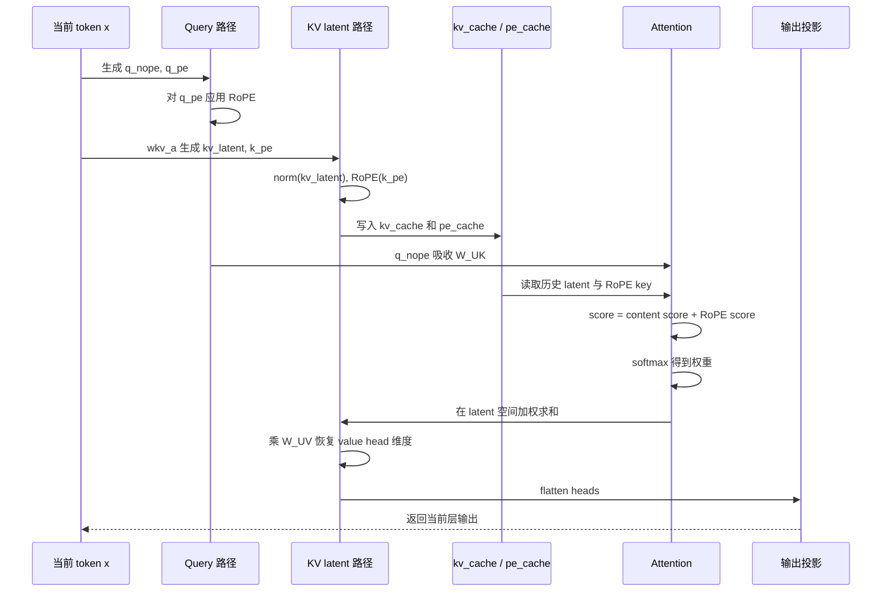

## 先说结论

MLA（Multi-head Latent Attention，多头潜变量注意力）可以理解为一种面向大模型推理的 Attention 结构改造：它不再为每一层、每一个历史 token、每一个 attention head 都缓存完整的 Key 和 Value，而是把 Key/Value 共同压缩到一个低维 latent 向量里，推理时只缓存这个 latent 向量和一小段携带 RoPE 位置信息的 key。

它主要解决的是 KV cache 太大的问题。对于长上下文和大 batch 推理，显存里最大的常驻数据之一就是 KV cache。传统 MHA 每个 token 每层要缓存完整的所有 head 的 K/V；MLA 则把缓存对象改成：

$$
\mathrm{cache}_{MLA} = c_t^{KV} + k_t^R
$$

其中 $c_t^{KV}$ 是 Key/Value 的联合压缩潜变量，$k_t^R$ 是解耦出来的 RoPE key。DeepSeek-V2 论文给出的结论是，MLA 在显著降低 KV cache 的同时，能力可以强于 MHA；DeepSeek-V2 官方 README 也提到，DeepSeek-V2 相比 DeepSeek 67B 将 KV cache 减少 93.3%，最大生成吞吐提升到 5.76 倍。

本文主要参考 DeepSeek-V2 论文、DeepSeek-V3 技术报告和 DeepSeek-V3 官方推理代码。文中的代码示例不是完整源码复制，而是按官方 `inference/model.py` 的变量名和张量形状抽象出来的推理路径。

## 为什么 KV Cache 是问题

自回归大模型生成第 $t$ 个 token 时，需要看见前面 $1...t-1$ 的历史 token。为了避免每生成一个 token 都重新计算所有历史 token 的 Key 和 Value，推理系统会把每层的历史 K/V 缓存下来，这就是 KV cache。

普通 MHA 中，第 $t$ 个 token 在某一层会生成：

$$
Q_t, K_t, V_t \in \mathbb{R}^{n_h \times d_h}
$$

其中 $n_h$ 是 attention head 数，$d_h$ 是每个 head 的维度。推理时需要缓存历史所有 token 的 $K$ 和 $V$，所以每个 token 每层的缓存元素数约为：

$$
2 n_h d_h
$$

如果有 $l$ 层，则每个 token 的总缓存元素数为：

$$
2 n_h d_h l
$$

这会直接限制：

- 最大上下文长度：上下文越长，缓存线性增长。
- 最大 batch size：batch 越大，缓存按 batch 复制。
- 吞吐：显存带宽和显存容量都会成为瓶颈。
- 服务成本：同样显卡能承载的并发请求更少。

MQA 和 GQA 的思路是减少 KV head 数。例如 MQA 让所有 query head 共享一组 K/V，GQA 让一组 query head 共享一组 K/V。它们能省缓存，但常见代价是表达能力下降。MLA 的目标更激进：不是简单减少 head，而是让 K/V 先经过联合低秩压缩，只缓存压缩后的潜变量。

## MLA 的核心结构

MLA 的核心是低秩 Key-Value 联合压缩。对某一层第 $t$ 个 token 的 hidden state $h_t$，先做一次下投影：

$$
c_t^{KV} = W^{DKV}h_t
$$

其中：

- $h_t \in \mathbb{R}^{d}$ 是当前层输入。
- $c_t^{KV} \in \mathbb{R}^{d_c}$ 是压缩后的 KV latent。
- $d_c \ll n_h d_h$，所以它比完整 K/V 小很多。
- $W^{DKV}$ 是把 hidden state 压到 latent 空间的矩阵。

如果按朴素公式展开，Key 和 Value 可以从这个 latent 中恢复：

$$
k_t^C = W^{UK}c_t^{KV}
$$

$$
v_t^C = W^{UV}c_t^{KV}
$$

这里上标 $C$ 表示 content 部分，也就是不直接携带 RoPE 位置信息的内容向量。注意 MLA 不是说没有 Key/Value，而是说推理缓存里不直接存完整 Key/Value；完整 K/V 可以由 latent 和上投影矩阵恢复，或者在优化实现中被矩阵吸收掉。

Query 侧也可以做低秩压缩：

$$
c_t^Q = W^{DQ}h_t
$$

$$
q_t^C = W^{UQ}c_t^Q
$$

Query 压缩主要降低训练激活显存，并不直接减少 KV cache，因为推理时历史 token 缓存的是 K/V，不是 Q。

## RoPE 为什么要解耦

MLA 里最容易忽略的问题是 RoPE。RoPE 会把位置编码通过旋转矩阵注入到 Query 和 Key 中，这个旋转矩阵和 token 位置有关。

如果直接对由 latent 恢复出来的 $k_t^C$ 使用 RoPE，会出现一个问题：$W^{UK}$ 和 RoPE 的位置旋转矩阵耦合在一起。推理优化原本希望把 $W^{UK}$ 吸收到 Query 投影中，避免显式恢复所有历史 Key；但 RoPE 是位置相关的矩阵，矩阵乘法又不可交换，因此这个吸收会被破坏。

DeepSeek 的做法是把 Key/Query 拆成两部分：

- content 部分：$q_t^C, k_t^C$，来自低秩 KV latent，不直接承载 RoPE。
- positional 部分：$q_t^R, k_t^R$，专门承载 RoPE。

完整的 Query 和 Key 是拼接结果：

$$
q_{t,i} = [q_{t,i}^{C}; q_{t,i}^{R}]
$$

$$
k_{t,i} = [k_{t,i}^{C}; k_t^{R}]
$$

其中 $i$ 表示第 $i$ 个 attention head。$k_t^R$ 是所有 head 共享的一段 RoPE key，而 $q_{t,i}^R$ 是每个 head 各自的 RoPE query。

这样做以后，推理时真正需要缓存的是：

$$
c_t^{KV}
$$

和：

$$
k_t^R
$$

因此每个 token 每层的缓存元素数变成：

$$
d_c + d_h^R
$$

其中 $d_h^R$ 是 RoPE 解耦部分的维度。DeepSeek-V2 论文中给出的配置是 $d_c = 4d_h$，$d_h^R = \frac{d_h}{2}$，因此 MLA 每层每 token 的缓存约为：

$$
d_c + d_h^R = 4d_h + \frac{1}{2}d_h = \frac{9}{2}d_h
$$

如果 MHA 是 $2n_hd_h$，当 $n_h$ 很大时，MLA 的节省非常明显。

## 结构图

下面这张图可以把 MLA 的数据路径串起来：



从图里可以看出，MLA 并不是把 attention 简化成一个低维向量相似度。它仍然保留多头注意力，只是把历史 K/V 的缓存形式换成 latent，并把位置编码从 content key 中拆出去。

## 结合 DeepSeek 推理代码看 MLA

DeepSeek-V3 官方推理代码中，`MLA` 模块的关键配置包括：

```text
n_heads = 16
kv_lora_rank = 512
qk_nope_head_dim = 128
qk_rope_head_dim = 64
v_head_dim = 128
```

这些名字和论文公式的关系大致是：

| 代码变量 | 含义 | 对应概念 |
| --- | --- | --- |
| `kv_lora_rank` | KV latent 维度 | $d_c$ |
| `qk_nope_head_dim` | 不带 RoPE 的 Q/K content 维度 | $q^C, k^C$ 的每 head 维度 |
| `qk_rope_head_dim` | 解耦 RoPE 维度 | $q^R, k^R$ 的维度 |
| `v_head_dim` | Value 每 head 维度 | $v^C$ 的每 head 维度 |
| `wkv_a` | 从 hidden state 产生 latent KV 和 RoPE key 原料 | $W^{DKV}$ 与 $W^{KR}$ 的实现入口 |
| `wkv_b` | 从 latent KV 展开 content K/V | $W^{UK}, W^{UV}$ 的合并实现 |
| `kv_cache` | 优化实现缓存的 latent KV | $c_t^{KV}$ |
| `pe_cache` | 优化实现缓存的 RoPE key | $k_t^R$ |

官方代码里有两个 attention 实现分支：

- `naive`：显式恢复并缓存完整 `k_cache` 和 `v_cache`。
- 优化分支：只缓存 `kv_cache` 和 `pe_cache`，并通过矩阵吸收避免显式构造完整历史 K/V。

可以把 `forward` 抽象成如下伪代码：

```python
# x: [batch, seqlen, dim]
q = project_query(x)
q = q.view(batch, seqlen, n_heads, qk_nope_dim + qk_rope_dim)
q_nope, q_pe = split(q)
q_pe = rope(q_pe)

kv_and_pe = wkv_a(x)
kv_latent, k_pe = split(kv_and_pe)
k_pe = rope(k_pe)

if naive:
    full_kv = wkv_b(norm(kv_latent))
    k_nope, v = split(full_kv)
    k = concat(k_nope, broadcast(k_pe))
    cache(k, v)
    score = dot(concat(q_nope, q_pe), k_cache)
    out = score @ v_cache
else:
    q_nope_absorbed = q_nope @ W_UK
    cache(norm(kv_latent), k_pe)
    score = dot(q_nope_absorbed, kv_cache) + dot(q_pe, pe_cache)
    latent_out = score @ kv_cache
    out = latent_out @ W_UV

return output_projection(out)
```

这里最关键的是优化分支的两步：

第一，content 部分的 attention score 不显式计算 $k^C = W^{UK}c^{KV}$，而是利用结合律：

$$
q^C \cdot (W^{UK}c^{KV})
=
(q^CW^{UK}) \cdot c^{KV}
$$

所以代码里先把 `q_nope` 乘上 `wkv_b` 中 Key 对应的权重，得到已经吸收了 $W^{UK}$ 的 query，然后再和 `kv_cache` 做点积。

第二，Value 部分也不显式取出所有历史 token 的 $v^C = W^{UV}c^{KV}$，而是先对 latent 做加权求和：

$$
\sum_j a_j (W^{UV}c_j^{KV})
=
W^{UV}\sum_j a_j c_j^{KV}
$$

所以代码里先计算：

$$
\mathrm{latent\_out} = A \cdot C^{KV}
$$

再乘上 `wkv_b` 中 Value 对应的权重，恢复到每个 head 的 value 维度。

RoPE 部分不能这样吸收，所以代码额外保存 `pe_cache`，attention score 由两部分相加：

$$
\mathrm{score}
=
(q^CW^{UK}) \cdot c^{KV}
+
q^R \cdot k^R
$$

这正好对应代码中的两个 `einsum`：一个处理 content latent，一个处理 RoPE position。

## 一个实际推理示例

下面用 DeepSeek-V3 开源推理配置里的维度做一个具体例子。假设：

```text
batch = 1
当前 decode seqlen = 1
历史长度 start_pos = 1024
n_heads = 16
dim = 2048
kv_lora_rank = 512
qk_nope_head_dim = 128
qk_rope_head_dim = 64
v_head_dim = 128
```

### 第一步：当前 token 进入 MLA

当前 token 的输入：

$$
x \in \mathbb{R}^{1 \times 1 \times 2048}
$$

Query 投影后：

$$
q \in \mathbb{R}^{1 \times 1 \times 16 \times 192}
$$

因为：

$$
qk\_head\_dim = 128 + 64 = 192
$$

然后拆成：

$$
q_{nope} \in \mathbb{R}^{1 \times 1 \times 16 \times 128}
$$

$$
q_{pe} \in \mathbb{R}^{1 \times 1 \times 16 \times 64}
$$

其中 `q_nope` 是 content query，`q_pe` 是需要应用 RoPE 的 query。

### 第二步：生成 KV latent 和 RoPE key

`wkv_a(x)` 产生：

$$
kv\_and\_pe \in \mathbb{R}^{1 \times 1 \times (512 + 64)}
$$

拆成：

$$
kv\_latent \in \mathbb{R}^{1 \times 1 \times 512}
$$

$$
k_{pe} \in \mathbb{R}^{1 \times 1 \times 64}
$$

然后对 $k_{pe}$ 应用 RoPE。注意它不是每个 head 一份，而是共享的 RoPE key，所以缓存形状不带 head 维度：

$$
pe\_cache \in \mathbb{R}^{batch \times max\_seq\_len \times 64}
$$

### 第三步：写入缓存

在优化实现中，当前 token 只写入：

$$
kv\_cache[:, 1024:1025] = norm(kv\_latent)
$$

和：

$$
pe\_cache[:, 1024:1025] = k_{pe}
$$

此时可见历史长度变成 1025，参与 attention 的缓存为：

$$
kv\_cache[:, :1025] \in \mathbb{R}^{1 \times 1025 \times 512}
$$

$$
pe\_cache[:, :1025] \in \mathbb{R}^{1 \times 1025 \times 64}
$$

如果是 MHA 或 naive MLA 缓存完整 K/V，则每层每个 token 缓存元素数大致是：

$$
16 \times (192 + 128) = 5120
$$

其中 192 是完整 Key 的维度，128 是 Value 的维度。

优化 MLA 每层每个 token 缓存元素数是：

$$
512 + 64 = 576
$$

所以在这个配置下，单 token 单层缓存元素数约为 MHA 风格完整 K/V 的：

$$
\frac{576}{5120} = 11.25\%
$$

也就是缓存元素数减少约 88.75%。这只是按 DeepSeek-V3 开源推理代码示例配置计算的单层单 token 元素数对比，实际端到端显存还会受到层数、精度、量化、并行切分、框架缓存布局等影响。

### 第四步：计算 attention score

优化分支不会显式恢复所有历史 token 的完整 Key。它先把 `q_nope` 乘上 `wkv_b` 中对应 Key 的那部分权重：

$$
q_{nope}^{absorb} \in \mathbb{R}^{1 \times 1 \times 16 \times 512}
$$

然后 content score 为：

$$
score_C
\in
\mathbb{R}^{1 \times 1 \times 16 \times 1025}
$$

计算逻辑是：

$$
score_C = q_{nope}^{absorb} \cdot kv\_cache
$$

RoPE score 为：

$$
score_R = q_{pe} \cdot pe\_cache
$$

总分数：

$$
score = (score_C + score_R) \times scale
$$

然后经过 causal mask 和 softmax 得到 attention 权重：

$$
A \in \mathbb{R}^{1 \times 1 \times 16 \times 1025}
$$

### 第五步：得到输出

Value 侧也先在 latent 空间做加权求和：

$$
z = A \cdot kv\_cache
$$

形状为：

$$
z \in \mathbb{R}^{1 \times 1 \times 16 \times 512}
$$

再乘上 `wkv_b` 中 Value 对应的权重，把 latent 输出恢复到 value head 维度：

$$
o \in \mathbb{R}^{1 \times 1 \times 16 \times 128}
$$

最后 flatten head 维度并经过输出投影：

$$
u \in \mathbb{R}^{1 \times 1 \times 2048}
$$

这就是一个 decode step 中 MLA 的完整推理路径。

## 推理流程图



## 和 MHA、GQA、MQA 的区别

可以从“缓存什么”这个角度理解几种 attention：

| 机制 | 缓存内容 | 每 token 每层缓存规模 | 主要取舍 |
| --- | --- | --- | --- |
| MHA | 每个 head 的完整 K 和 V | $2n_hd_h$ | 表达能力强，缓存最大 |
| GQA | 每组共享 K/V | $2n_gd_h$ | 缓存下降，能力通常介于 MHA 和 MQA 之间 |
| MQA | 所有 query head 共享一组 K/V | $2d_h$ | 缓存最小之一，但表达能力可能受损 |
| MLA | KV latent + 解耦 RoPE key | $d_c + d_h^R$ | 大幅降缓存，同时尽量保留多头表达能力 |

MLA 的特别之处在于，它不是简单让多个 head 共享同一个 K/V，而是让所有 head 的 K/V 信息共同进入一个 latent 表示。各 head 仍然可以通过不同的上投影矩阵从 latent 中取出自己需要的 content key/value。

## 为什么矩阵吸收很关键

如果 MLA 只是“缓存 latent，使用时恢复完整 K/V”，那缓存确实省了，但每一步 decode 都可能要为所有历史 token 恢复 K/V，计算开销会很大。矩阵吸收是 MLA 推理高效的关键。

对 Key 来说，原本的 content score 是：

$$
q^C \cdot k^C
=
q^C \cdot W^{UK}c^{KV}
$$

利用结合律，变成：

$$
(q^CW^{UK}) \cdot c^{KV}
$$

这样历史侧只需要保留 $c^{KV}$。

对 Value 来说，原本输出是：

$$
\sum_j A_j W^{UV}c_j^{KV}
$$

变成：

$$
W^{UV}\sum_j A_jc_j^{KV}
$$

这样可以先在 latent 空间聚合，再恢复到 value 维度。

但是 RoPE 的位置旋转矩阵和 token 位置有关，不能简单吸收，所以 MLA 才需要解耦 RoPE，把位置相关部分单独缓存为 $k^R$。

## MLA 的收益和限制

MLA 的收益主要体现在推理：

- KV cache 显著变小，长上下文更友好。
- 同样显存下可以支持更大的 batch size。
- 缓存读写带宽压力降低，有利于提升 decode 吞吐。
- 保留多头结构，不像 MQA 那样把 K/V 共享压到极致。

它也有一些代价：

- 结构比 MHA/GQA/MQA 更复杂，实现需要处理 latent、RoPE 解耦和矩阵吸收。
- 需要训练阶段配合这种结构，不能把任意 MHA 模型无损替换成 MLA。
- 推理框架需要理解 MLA 的缓存布局，否则容易退化成 naive 实现。
- RoPE 解耦让缓存不再只是一个 latent，还必须额外保存 position key。

所以 MLA 不是一个“推理时外挂的 KV 压缩算法”，而是模型结构本身的一部分。它需要从训练开始就采用这种 attention 结构，推理系统再利用它的结构性质减少缓存。

## 小结

MLA 的关键点可以压缩成三句话：

第一，MLA 用低秩 latent $c_t^{KV}$ 联合表示 Key 和 Value，推理时主要缓存 latent，而不是完整 K/V。

第二，RoPE 会破坏矩阵吸收，所以 MLA 把 content 部分和 positional 部分拆开，只让一小段 $k_t^R$ 承载位置编码并额外缓存。

第三，优化推理实现通过矩阵结合律把 $W^{UK}$ 吸收到 Query 侧，把 $W^{UV}$ 延后到 latent 聚合之后，从而避免为所有历史 token 显式恢复完整 K/V。

从工程角度看，MLA 的价值不只是“缓存更小”，而是把模型结构、位置编码、线性代数变换和推理缓存布局一起设计，使长上下文和高并发 decode 更可承载。

## 参考

- DeepSeek-V2 论文：[DeepSeek-V2: A Strong, Economical, and Efficient Mixture-of-Experts Language Model](https://arxiv.org/abs/2405.04434)
- DeepSeek-V3 技术报告：[DeepSeek-V3 Technical Report](https://arxiv.org/abs/2412.19437)
- DeepSeek-V2 官方仓库：[deepseek-ai/DeepSeek-V2](https://github.com/deepseek-ai/DeepSeek-V2)
- DeepSeek-V3 官方推理代码：[deepseek-ai/DeepSeek-V3 inference/model.py](https://github.com/deepseek-ai/DeepSeek-V3/blob/main/inference/model.py)
