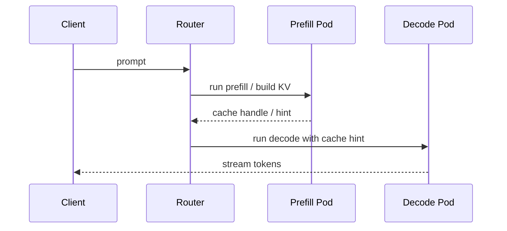
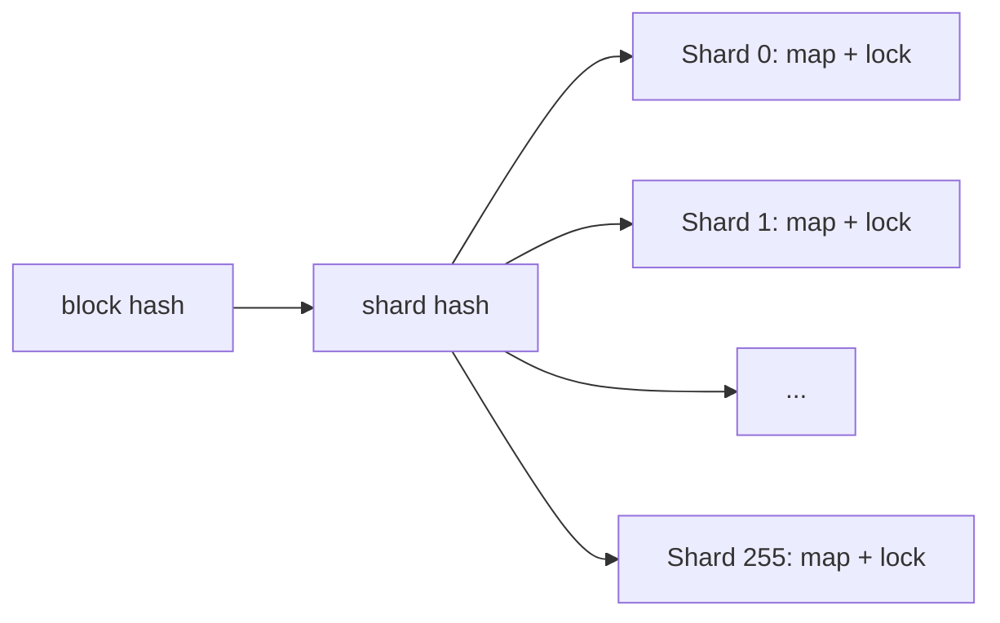
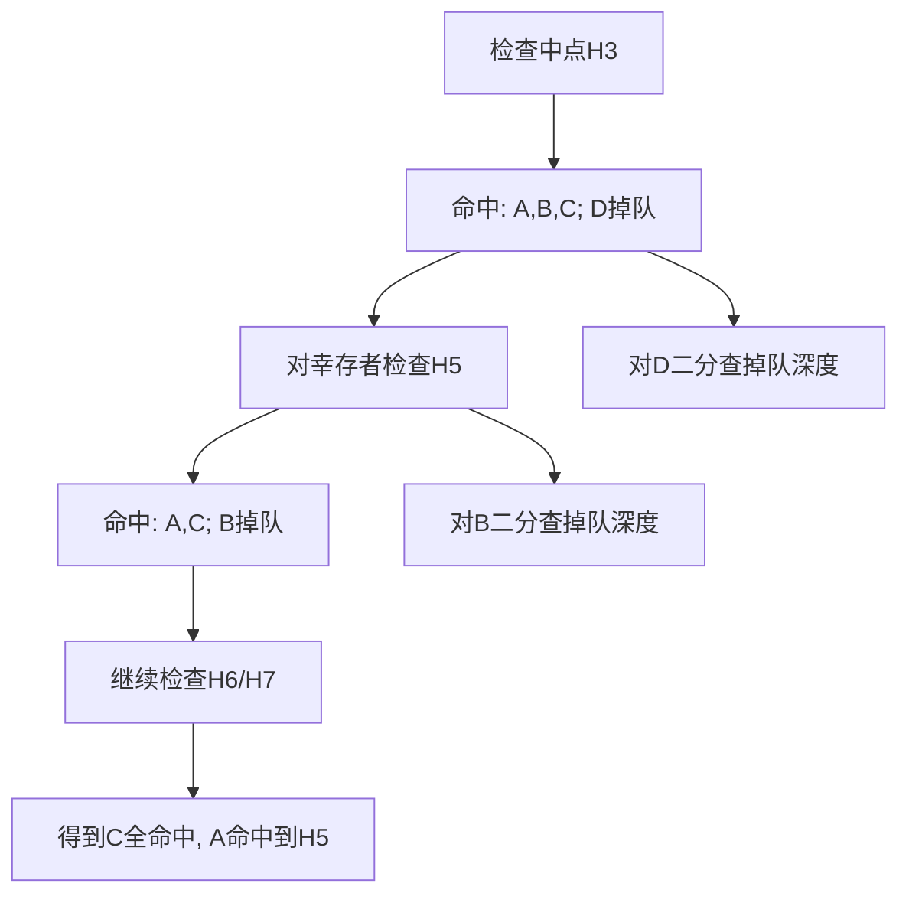
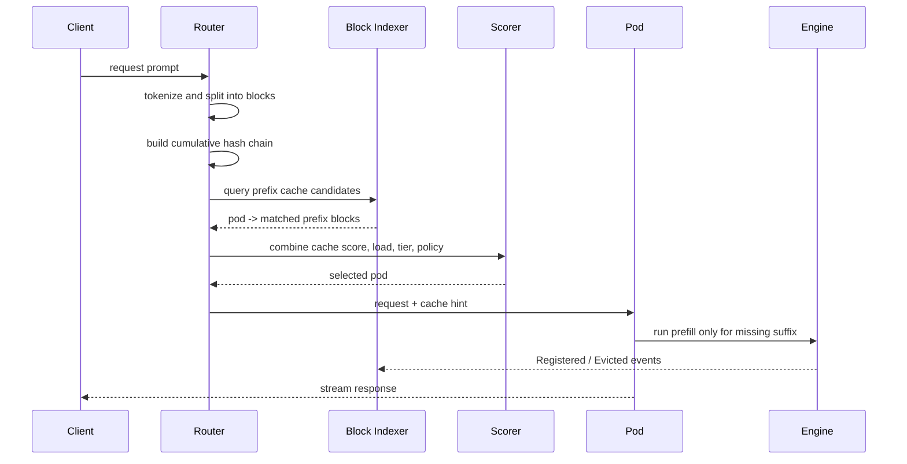

> 本文基于Modular博客《Why LLM Inference Needs a New Kind of Router - Part 1 / Part 2》整理，重点分析其中的cache-aware routing数据层设计。原文发布时间为2026-05-08和2026-05-21。由于推理系统更新很快，具体实现细节应以Modular后续公开资料和实际系统为准。

# 1 先说结论

Modular这两篇博客想说明一件事：LLM推理服务的router不能再按传统HTTP负载均衡来理解。传统router通常假设后端实例是无状态、可互换的，请求之间彼此独立；但LLM推理后端持有大量本地KV cache，某个请求落到哪台GPU pod上，会直接决定prefill是否需要重算。

cache-aware routing的目标不是简单地“固定路由到某个session所在机器”，而是回答一个更底层的问题：

> 对于一个已经tokenize并切成block的prompt，哪些pod已经缓存了它的最长前缀？

Modular Part 2给出的数据层设计可以概括为：

- 把prompt分成block，并为每个block计算累积hash，形成`H0, H1, ..., HN`这样的query chain。
- 每个block hash对应一个`HostBitmap`，bitmap里的每个bit表示某个pod是否拥有该block。
- 整个索引被分成256个shard，每个shard有独立map和锁，降低并发更新时的锁竞争。
- 用Fibonacci hashing把block hash打散到shard，避免相关block集中到少数热点shard。
- 查询时不做`P x N`全量扫描，而是利用“cache hit一定是连续前缀”这一性质，对累积hash链做二分查找，把查询复杂度变成近似`O(K x log N)`。
- pod下线时先更新全局alive bitmap，立刻把死pod从查询结果里mask掉，再后台清理具体block索引。

这套设计的价值在于：router可以在微秒级得到“谁有缓存”这个事实，然后再把它交给决策层，和负载、session、硬件角色、SLA、prefill/decode分离等因素一起做最终路由。

# 2 为什么普通负载均衡不够

普通HTTP路由常见策略包括：

- round-robin：每个后端轮流接请求。
- consistent hashing：根据某个key把请求稳定映射到后端。
- least-requests：把请求交给当前活跃请求数最少的后端。

这些策略背后有三个隐含前提：

- 任意后端都能以差不多的代价处理任意请求。
- 第`N`个请求的处理结果，不会改变第`N+1`个请求应该落到哪里。
- 后端之间大体可互换，router只需要考虑负载均衡。

LLM推理打破了这些前提。一个GPU pod不是普通无状态web server，它本地可能保存了大量KV cache。对于同一段长prompt：

```text
请求A: [system prompt][tools][documents][user question A]
请求B: [system prompt][tools][documents][user question B]
```

如果某个pod已经缓存了前面的`[system prompt][tools][documents]`，请求B落到这个pod上就可以跳过大量prefill计算；如果请求B被round-robin发到冷pod，就必须重新计算整段共享前缀。

这个差异直接影响TTFT：

- 命中长前缀：prefill只处理未缓存后缀，TTFT可能大幅下降。
- 未命中：长上下文需要完整prefill，TTFT变长，同时浪费GPU算力。

因此，对LLM服务来说，“哪个pod当前负载最低”只是一部分信息；“哪个pod拥有这个请求的KV cache前缀”同样是路由决策里的关键输入。

# 3 Router需要处理的四类LLM状态

Part 1把LLM推理相对HTTP routing的差异分成四类。

## 3.1 KV cache state

Transformer decoder推理通常分为prefill和decode：

- prefill：处理整个prompt，计算每个输入token对应的KV。
- decode：逐token生成，每次生成新token时读取历史KV。

KV cache保存的是历史token在各层attention里的Key/Value。它的特点是：

- 体积大，通常占用GPU HBM，也可能offload到CPU内存或SSD。
- 和具体模型、token序列、位置、adapter、cache namespace等上下文相关。
- 对共享前缀有高复用价值。

所以，router不能只知道“pod是否活着”，还要知道“pod上有什么KV cache”。

## 3.2 Hardware specialization

prefill和decode对硬件压力不同：

- prefill一次处理大量prompt token，更偏compute-bound。
- decode每次生成一个或少量token，但反复访问权重和KV，更偏memory-bandwidth-bound。

如果系统做prefill/decode disaggregation，一次用户请求可能需要先去prefill pod构建KV，再去decode pod生成token。此时router不是“选一个后端”即可，而是要理解不同pod的角色。

## 3.3 Conversation continuity

多轮对话天然共享前缀：

```text
turn 1: [system][user1][assistant1]
turn 2: [system][user1][assistant1][user2]
turn 3: [system][user1][assistant1][user2][assistant2][user3]
```

后续turn如果能命中前面turn留下的KV cache，就可以避免重复prefill历史对话。因此，session affinity在LLM推理里仍然有价值，但它只是cache-aware routing的一个特例。更一般的场景里，不同session也可能共享系统提示词、RAG模板、工具说明、few-shot examples。

## 3.4 Multi-step execution

一个用户请求可能对应多个后端步骤：



传统HTTP load balancer通常只负责一次dispatch。LLM router则需要在多个步骤之间保留状态，并让后一个选择受前一个步骤影响。

# 4 Modular的三层路由框架

Part 1把Modular Cloud的routing layer拆成三层：

- Data Layer：维护LLM特有状态，尤其是KV cache block在哪些pod上。
- Decision Layer：把过滤器、打分器、picker组合成可配置的路由策略。
- Execution Layer：执行单步或多步请求流程，例如普通单pod推理或prefill/decode分离。

本文重点看Data Layer。原因很直接：如果“查询哪些pod有缓存”本身就需要毫秒级，那么上层任何精巧的打分策略都来不及发挥作用。cache-aware routing的数据层必须做到足够快、并发安全，并且能承受pod频繁注册、驱逐、下线。

# 5 Data Layer的问题定义

Part 2给出的核心问题是：

> 给定一个包含`N`个block hash的query chain，以及集群中`P`个live pods，返回按缓存前缀长度排序的pod列表。

形式化一点，输入是：

```text
query = [H0, H1, H2, ..., HN-1]
pods  = {pod0, pod1, ..., podP-1}
```

输出类似：

```text
podA: matched 24 blocks
podC: matched 18 blocks
podF: matched 18 blocks
podB: matched  3 blocks
```

然后决策层可以继续处理：

- 命中block数相同的时候，看负载。
- GPU HBM命中优先于CPU/SSD offload命中。
- 当前tenant是否有优先级。
- 是否要保持conversation continuity。
- 是否要避开高延迟或熔断中的pod。
- 如果是PD分离，请求是否要先选prefill pod再选decode pod。

也就是说，Data Layer不直接决定最终路由，它只提供cache事实。

# 6 状态从哪里来

router本身不产生KV cache。实际cache状态来自推理引擎的事件流。Part 2提到的事件包括：

- `Registered`：某个pod在某个tier上缓存了某个block。
- `Evicted`：某个pod移除了某个block。
- `Shutdown`：某个pod即将离开或已经不可用。

这些事件可以通过NATS、gRPC stream、Kafka、Redis Streams等方式进入router。Modular强调Data Layer应该对传输层无感，只消费类型化事件。

这里有两个工程要求很重要：

- 幂等：重复注册同一个block不应出错；重复驱逐已经不存在的block也应是no-op。
- 多消费者安全：如果多个事件源同时把同一类事件写入索引，最终结果应和写入一次一致。

这其实是把router的数据层当成一个高并发、弱实时的索引系统来设计，而不是当成普通内存字典。

# 7 HostBitmap：用bitmap表示“哪些pod拥有这个block”

朴素表示可以是：

```text
blockHash -> [podA, podC, podF]
```

这个结构直观，但有几个问题：

- 每个pod id可能是字符串或对象引用，内存开销大。
- 每个block对应一个slice/list，会产生大量小对象，增加GC压力。
- 判断某个pod是否拥有某个block，需要线性扫描列表。
- 做集合交并差不方便。

Modular选择bitmap。假设一个orchestrator最多管理256个pod，则可以把每个pod映射到一个`0..255`的整数下标：

```text
podA -> bit 0
podB -> bit 1
podC -> bit 2
...
```

那么“哪些pod拥有block H”可以表示成256 bit，也就是4个`uint64`：

```text
block H -> 000...0101
           ^      ^
           podC   podA
```

bitmap的好处是：

- membership test是一次bit test。
- 求交集是bitwise AND。
- 统计候选pod数量可以用CPU的POPCNT。
- 固定大小，内存布局紧凑，减少大量小对象。

于是核心索引变成：

```text
map[blockHash]HostBitmap
```

从数据库角度看，这相当于一个倒排索引：不是“pod -> blocks”，而是“block -> pods”。因为router的查询是从request blocks出发，问哪些pod有这些blocks。

# 8 ShardedBlockIndexer：为什么要分片

单个全局map加一把锁很容易成为瓶颈。cache事件会持续到来：

- 长prompt prefill完成后注册大量block。
- KV cache压力导致block被驱逐。
- pod扩缩容或重启触发shutdown。

如果所有读写都抢同一把锁，即便每次操作很短，在高QPS下也会放大尾延迟。

Modular的做法是把索引切成256个shard：



每个shard维护自己的：

```text
map[blockHash]HostBitmap
lock
```

这样不同block如果落在不同shard，就可以并发读写。读写同一个shard仍然会竞争，但竞争范围从“全局所有block”缩小到“1/256的block集合”。

# 9 为什么要用Fibonacci hashing打散shard

分片的前提是hash分布足够均匀。问题在于，LLM prompt的block hash不是普通随机key，它来自累积hash链，可能带有输入token分布和相邻block关系。如果直接取低位做shard id，相关block可能集中到少数shard，形成热点。

Part 2提到的方案是Fibonacci hashing，也就是用黄金比例相关常数做乘法hash，再从高位取shard index。64位常见常数是：

```text
0x9E3779B97F4A7C15
```

简化伪代码如下：

```text
mixed = blockHash * 0x9E3779B97F4A7C15
shard = high_bits(mixed, shard_bits)
```

它的作用不是加密，也不是解决hash碰撞，而是把有结构的输入更均匀地散布到固定数量的bucket里。这样256个shard才能真正承担并发分散的作用。

Part 2还提到cache-line padding：每个shard结构尽量占据独立cache line，避免两个热shard共享同一条cache line导致false sharing。这个细节说明该索引位于router热路径，CPU cache行为也会影响尾延迟。

# 10 累积block hash：cache正确性的关键

cache-aware routing不能只看某个block内部的tokens。原因是Transformer的KV依赖完整上下文。

考虑两个请求：

```text
请求A: [A0][A1][X]
请求B: [B0][B1][X]
```

假设第三个block的本地tokens都等于`X`，如果只对`X`做hash，那么两个请求的第三个block hash相同。但它们前面的上下文不同，第三个block对应的KV并不等价，不能互相复用。

因此block hash需要是累积的：

```text
H0 = hash(tokens(block0), metadata)
H1 = hash(H0, tokens(block1), metadata)
H2 = hash(H1, tokens(block2), metadata)
...
```

`H2`不只代表block2本身，也代表从block0到block2的完整前缀。这样只要`H2`相同，就意味着前面的链路也相同。这里的metadata在真实系统中通常还要考虑模型、tokenizer、LoRA/adapter、cache salt、position等命名空间信息，否则可能把不兼容的KV误认为可复用。

这一点和vLLM Automatic Prefix Caching的设计思想一致：KV block的hash不仅包含本block token，还包含prefix相关信息。差异在于，vLLM文档主要解释单个engine内部如何索引prefix cache；Modular这篇文章讨论的是跨pod routing层如何查询“哪个pod拥有这些block”。

# 11 二分查找最长缓存前缀

有了累积hash以后，可以利用一个非常重要的性质：

> 如果某个pod拥有`H5`，则它必然拥有同一条链上的`H0..H4`对应前缀；cache hit形成连续前缀。

因此，router不需要对每个pod逐个检查每个block。它可以查某个中点block的bitmap，并通过集合运算找出仍然命中的pod集合。

假设query有8个block：

```text
H0 H1 H2 H3 H4 H5 H6 H7
```

4个pod的真实命中深度如下：

```text
pod A: H0 H1 H2 H3 H4 H5
pod B: H0 H1 H2 H3
pod C: H0 H1 H2 H3 H4 H5 H6 H7
pod D: H0 H1
```

查询过程可以理解为：



其中每次检查某个`Hi`，本质是：

```text
candidate = index[Hi] AND alivePods
```

如果当前候选集合里某些pod不在`candidate`中，说明它们的最长前缀小于等于当前中点，需要在左半边继续找掉队点；仍在`candidate`中的pod则可以去右半边找更长命中。

Part 2把复杂度写成`O(K x log N)`：

- `N`是query chain长度。
- `K`是不同掉队深度的数量。
- 如果很多pod命中深度相同，`K`很小。
- 极端情况下每个pod掉队位置都不同，`K`可能接近`P`。

相比朴素的`P x N`扫描，二分法减少的是shard lookup次数。pod数量增加时，bitmap宽度会影响bit操作成本，但在256 pod、4个`uint64`的设计里，这部分基本是常数级。

# 12 一个完整查询例子

假设：

```text
P = 64 pods
N = 32 blocks per request
QPS = 1000
```

朴素做法：

```text
每个请求: 32 blocks x 64 pods = 2048次检查
每秒: 2048 x 1000 = 2,048,000次检查
```

而bitmap + 二分查找大致如下：

```text
check H15 -> 得到仍命中的pod集合
check H23 -> 对幸存pod继续右查
check H27 -> ...
对掉队集合分别查精确深度
```

如果多数pod状态相近，例如一批pod都只命中到`H15`附近，另一些pod命中到`H23`附近，那么`K`远小于`P`，查询只需要少量shard lookup。每次lookup返回的是一个bitmap，不是单个pod结果；这就是它比逐pod扫描快的关键。

# 13 Chaining和availability是两个不同问题

Part 2特别强调：hash chaining和bitmap lookup解决的是不同问题。

## 13.1 Chaining解决正确性

累积hash回答：

```text
这个block代表的上下文到底是哪条prefix？
```

如果不把前序上下文编码进hash，就可能把“局部tokens相同但prefix不同”的KV误用，导致模型输出错误。

## 13.2 Bitmap解决可用性

bitmap回答：

```text
这条正确的block hash现在在哪些live pod上？
```

即便hash链是正确的，block也可能已经被驱逐，pod也可能已经crash。因此router既需要hash chain定义“什么是同一个cache block”，也需要bitmap索引定义“谁现在真的拥有它”。

# 14 Tiered storage：为什么tier信息不放进热路径bitmap

KV cache可能位于不同存储层：

- GPU HBM：最快，但容量最紧张。
- CPU memory：较慢，但容量更大。
- SSD：更慢，适合更大规模offload。

router当然希望优先选择更快tier命中的pod。一个直觉方案是为每个block维护多个bitmap：

```text
block H -> GPU bitmap
        -> CPU bitmap
        -> SSD bitmap
```

但这会扩大每次热路径查询的成本。Modular选择把数据结构拆成两层：

- Routing shards：热路径，只回答“哪些pod拥有这个block”。
- Host tier maps：冷路径，在选出winning pod后，再查询该pod上block的具体位置和tier。

这样做符合访问模式：

- 每个请求都需要查询cache候选pod。
- 只有最终胜出的pod才需要生成cache hint。

把tier详情延后到winner确定之后，可以让热路径保持小而快。

# 15 Pod生命周期：两阶段移除

pod下线时，最朴素的清理方法是遍历所有shard、所有block，把这个pod对应的bit清掉。但如果索引里有成千上万个block，这会长时间持有shard锁，影响正在进行的路由查询。

Modular使用两阶段移除：

## 15.1 第一阶段：更新alive bitmap

系统维护一个全局`alivePods` bitmap。pod死亡时，先用CAS把对应bit置0。

之后每次查询都会做：

```text
candidate = blockBitmap AND alivePods
```

这样死pod会立刻从路由结果中消失，不需要马上清理每个block里的bit。

## 15.2 第二阶段：后台清理

后台任务再以有界并发遍历shard：

- 清理死pod在每个block bitmap里的bit。
- 删除已经没有任何live pod持有的block条目。
- 回收该pod的tier map和其他元数据。

这是一种典型的“热路径先保证正确排除，冷路径慢慢回收空间”的设计。

# 16 和一致性哈希、session affinity的区别

cache-aware routing容易被误解成consistent hashing或session affinity。它们确实都追求“请求稳定落到有状态后端”，但粒度和信息来源不同。

consistent hashing通常是：

```text
hash(request key) -> pod
```

它不知道pod里实际有什么cache，只是假设同一个key长期落到同一个pod后，cache会自然变热。

session affinity通常是：

```text
session id -> same pod
```

它适合多轮对话，但不能处理跨session共享prompt，也不能处理cache被驱逐或pod下线后的真实状态变化。

cache-aware routing则是：

```text
tokenize prompt -> block hash chain -> query block index -> rank pods by cached prefix
```

它直接查询cache事实，因此可以处理：

- 同一个session后续turn继续命中历史KV。
- 不同session共享系统prompt、工具说明、RAG模板。
- 原pod下线后，从其他拥有同前缀cache的pod里选择。
- 在cache命中和负载之间做动态权衡。

# 17 一个简化的路由流程

把上面的组件串起来，一个cache-aware请求路径大致如下：



注意最后一步：engine执行后还会继续发cache事件，更新router的数据层。router不是一次性配置，而是持续消费运行时状态。

# 18 这套策略的收益

cache-aware routing主要带来三类收益。

## 18.1 降低TTFT

长prompt的prefill成本高。如果命中长前缀，prefill只需要处理未命中的suffix。对RAG、多轮对话、agent工具调用、长system prompt场景尤其明显。

## 18.2 提高GPU有效利用率

冷pod重算共享prefix会浪费算力。把请求送到已有cache的pod，相当于减少重复prefill，让GPU周期用于真正的新token。

## 18.3 降低延迟方差

传统负载均衡会让同一类请求有时命中热pod、有时落到冷pod，TTFT波动很大。cache-aware routing把cache residency纳入决策，可以减少这种随机性。

# 19 代价和边界

这套设计不是免费午餐。

## 19.1 需要准确的事件流

如果engine没有及时发出Registered/Evicted/Shutdown事件，router的索引就会变旧。Part 2允许一定staleness，但不能偏离太多，否则router以为有cache，实际pod已经驱逐，最终仍要重算。

## 19.2 需要统一block划分和hash命名空间

router和engine必须对以下内容达成一致：

- tokenization结果。
- block size。
- block hash计算方式。
- 模型、adapter、position、cache salt等namespace。

否则router查到的“命中”可能无法被engine真正复用。

## 19.3 cache命中不能压倒负载均衡

如果所有共享prefix请求都被打到同一个pod，可能导致热点。实际决策层需要把cache score和load score结合起来，例如：

```text
score(pod) = cache_weight * matched_blocks
           - load_weight  * active_requests
           - penalty      * unhealthy_or_slow
```

Part 1也提到prefix-aware routing通常会配合load-aware tiebreaking和upstream latency circuit breaker。

## 19.4 对短prompt收益有限

短prompt的prefill本来就不贵，cache-aware查询本身虽然很快，但收益可能不明显。它最适合长上下文、高共享前缀、多轮对话、RAG模板固定、agent工具说明很长的服务。

## 19.5 跨pod KV迁移仍是另一个问题

Data Layer回答“谁有cache”，但不自动解决“如何把cache搬到另一个pod”。如果系统支持KV transfer、PD分离或tiered KV cache，router还要和执行层协作，把cache hint传给下游，并处理传输成本。

# 20 和SGLang/vLLM内部prefix cache的关系

SGLang、vLLM等推理引擎内部也有prefix cache机制。例如：

- vLLM Automatic Prefix Caching用block hash管理KV block复用。
- SGLang RadixAttention用radix tree组织共享前缀，并让scheduler利用prefix cache调整调度。

这些机制更多发生在单个engine进程内部：

```text
新请求进入某个engine -> engine本地查prefix cache -> 复用本地KV
```

Modular博客讨论的是router层：

```text
新请求还没选pod -> router查询全局block index -> 选择更可能命中cache的pod
```

两者并不冲突，而是上下两层：

- engine内部prefix cache负责“到了这台机器后如何复用KV”。
- router cache-aware index负责“请求应该先去哪台机器”。

如果只有engine内部cache，而router乱发请求，cache命中率会被流量分散稀释。如果只有router索引，而engine本地没有可靠prefix cache，router查到的命中也无法转化成实际加速。

# 21 实现时可以借鉴的简化版本

如果要在自己的推理网关里做一个最小可用版本，可以先不实现完整的tier map和复杂二分，按以下步骤迭代：

1. 统一block hash：

```text
H_i = hash(model_id, adapter_id, cache_salt, H_{i-1}, block_tokens_i)
```

2. 维护倒排索引：

```text
block_hash -> bitmap(pods)
```

3. 维护pod状态：

```text
alive_pods
pod_load
pod_role
pod_health
```

4. 查询最长前缀：

```text
先线性扫描验证正确性，再替换为二分prefix matching
```

5. 路由打分：

```text
cache_score = matched_blocks / total_blocks
final_score = cache_weight * cache_score - load_weight * normalized_load
```

6. 加入容错：

```text
如果router以为命中但engine报告miss，不要失败，降级为正常prefill，并修正索引。
```

这类系统最好先把正确性和可观测性做扎实，再追求微秒级极限优化。至少需要记录：

- 每个请求的matched blocks。
- router预测命中和engine实际命中的差异。
- cache-aware策略相对round-robin的TTFT变化。
- 热点pod和负载倾斜。
- Registered/Evicted事件延迟。

# 22 总结

Modular这两篇文章的关键贡献不是提出“KV cache可以复用”这个事实，而是把它提升到了路由数据层问题：

- LLM后端是有状态的，KV cache residency会显著影响prefill延迟。
- router必须在选pod之前查询cache状态。
- 用`block hash -> HostBitmap`可以紧凑表示block在哪些pod上。
- 分片、Fibonacci hashing、cache-line padding解决并发和CPU热路径问题。
- 累积block hash保证cache key包含完整prefix上下文，避免错误复用。
- 利用prefix连续性做二分查找，可以避免`P x N`扫描。
- alive bitmap + 后台清理让pod下线对热路径影响最小。
- tier map从热路径拆出去，避免每个请求都为少数winner信息付费。

一句话概括：cache-aware routing的本质是把KV cache从“某个engine内部的局部优化”变成“整个推理集群的可查询状态”，再把这个状态纳入路由决策。

# 参考

- [Modular: Why LLM Inference Needs a New Kind of Router - Part 1](https://www.modular.com/blog/why-llm-inference-needs-a-new-kind-of-router-part-1)
- [Modular: Why LLM Inference Needs a New Kind of Router - Part 2](https://www.modular.com/blog/why-llm-inference-needs-a-new-kind-of-router-part-2)
- [vLLM Documentation: Automatic Prefix Caching](https://docs.vllm.ai/en/stable/design/prefix_caching/)
- [Modular Glossary: Inference Routing](https://docs.modular.com/glossary/ai/inference-routing/)
