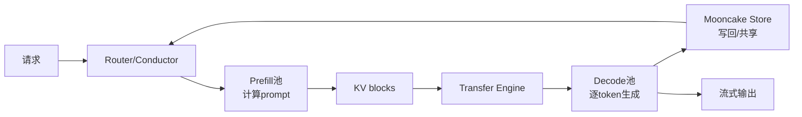
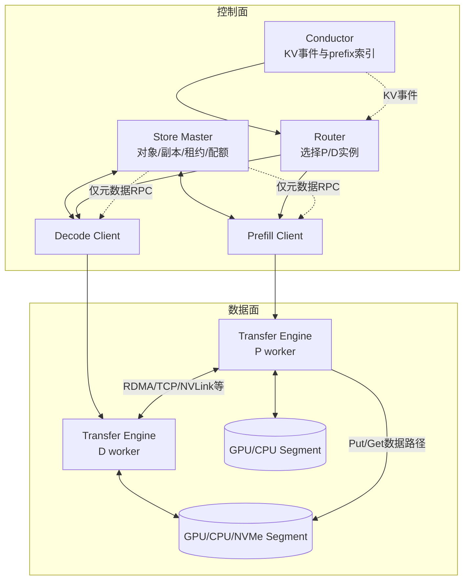
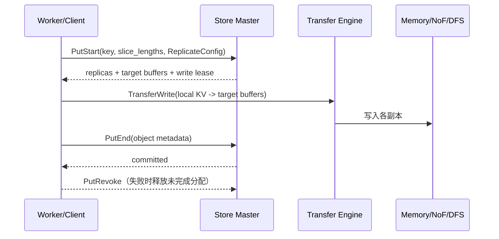

> 版本说明：本文基于2026-09-04访问的[kvcache-ai/Mooncake](https://github.com/kvcache-ai/Mooncake)主线 commit [`e58ad953`](https://github.com/kvcache-ai/Mooncake/tree/e58ad95342158514e273ad287e3859271f079572)及其官方文档、源码和性能页面撰写。Mooncake仍在快速演进，文中的类名、配置项和集成方式不应视为跨版本稳定API。

## 1. 先说结论

Mooncake不是一个“把KV Cache存到Redis里”的小工具，也不只是Prefill/Decode（P/D）分离的传输插件。它更像是LLM serving的数据基础设施，试图把下面三件事放在同一个工程边界内：

1. 用**Transfer Engine**把GPU、CPU、NVMe或远端内存之间的块高效搬运起来。
2. 用**Mooncake Store**维护一个跨实例、跨介质的KV Cache对象池，负责副本、租约、分配和回收。
3. 用**Conductor**把KV Cache前缀索引提供给router，让请求尽量落到已经拥有所需prefix的worker。

上层的vLLM、SGLang、TensorRT-LLM等推理框架仍然负责模型执行、attention kernel和请求调度；Mooncake负责的是“数据在哪里、怎么搬、什么时候可读、哪个实例更值得接这个请求”。这条边界是理解项目的关键。

如果只记住一句话，可以这样概括：

**Mooncake把原本绑定在单个推理实例显存里的KV状态，变成可寻址、可复制、可迁移、可被调度器查询的分布式资源。**

这样做的收益是容量、命中率和P/D弹性；代价是网络依赖、元数据一致性、租约处理、故障恢复和更多观测指标。它更适合长上下文、高prefix复用、多个推理节点组成的高速网络集群，不适合只有一台机器、请求很短且没有RDMA的简单服务。

本文与已有的[《PD分离调研：从推理阶段拆分到Mooncake的KVCache中心架构》](/pd-disaggregation-mooncake/)互补：旧文侧重论文动机和PD分离，本文侧重当前仓库的模块、调用链、生命周期和工程边界。

## 2. Mooncake解决的到底是什么问题

### 2.1 KV Cache为什么会成为系统资源

Decoder-only Transformer在处理请求时，会为每一层、每个已处理token保存Key和Value。下一步decode只需要为新token计算Q，再读取历史K/V。设层数为$L$、KV头数为$H_{kv}$、每头维度为$d$、每个元素占用$B$字节、上下文长度为$T$，粗略的KV大小是：

$$
S_{KV} \approx 2 \times L \times H_{kv} \times d \times T \times B
$$

前面的2表示K和V。以Qwen3-8B的公开评测为例，32,768 token的KV数据约为4.50 GB。一次请求就可能占掉多个GPU的可用空间；如果系统把每个worker的缓存完全隔离，相同system prompt或RAG前缀会在不同实例上重复计算和重复存储。

这会带来三个问题：

1. **容量问题**：显存装不下的prefix只能被淘汰，即使集群其它节点还有空闲内存。
2. **命中问题**：round-robin或随机路由让同一prefix不断落到不同实例，局部缓存无法复用。
3. **阶段干扰**：长prompt的prefill和逐token decode在同一批GPU上竞争，TTFT和TBT很难同时优化。

### 2.2 P/D分离只是数据搬运的起点

Prefill一次处理整段prompt，倾向于大batch和高算力利用率；decode每轮处理一个新token，倾向于稳定的小步迭代。把P和D拆开后，P worker算出的KV必须传给D worker，D worker还要继续追加新KV。这使“KV如何被定位和传输”从框架内部细节变成了系统级协议。



Mooncake的价值不是单独优化某一条箭头，而是让这些箭头共享一套可观测的对象、元数据和传输语义。

## 3. 当前仓库的模块版图

截至上述commit，README已经把项目描述为一组可组合的serving组件，而不是单一库：

| 模块 | 主要职责 | 是否承担模型计算 |
| --- | --- | --- |
| Transfer Engine | 注册本地内存，发现远端segment，提交异步批量传输 | 否 |
| Mooncake Store | KV对象元数据、分层副本、租约、分配、回收 | 否 |
| Conductor | 接收KV事件，维护prefix索引，为router提供查询 | 否 |
| Mooncake EP | 面向Expert Parallel的专家数据/通信后端 | 否，服务于EP |
| Mooncake PG | Pipeline/并行组相关后端能力 | 否，服务于并行组 |
| mooncake-reshard | 模型权重重分片与manifest规划 | 否 |
| vLLM/SGLang连接器 | 将上面能力接入推理框架 | 框架负责 |

因此，排查一个“KV没命中”问题时，不能只看Store；要沿着“事件是否发布、Conductor是否索引、router是否查询、connector是否发起传输、目标worker是否完成加载”整条链路看。

## 4. 总体架构：控制面与数据面分离

Mooncake Store最重要的架构决定是：Master只管理元数据，数据传输尽量绕过Master。一个典型部署可以抽象成下面的关系：



这里的“绕过Master”不是放弃控制，而是把控制和大块数据分开：Master回答“这个key有哪些完整副本、每个副本在哪、租约是否有效”，Client再根据回答直接与持有数据的Client建立传输。

## 5. Transfer Engine：把远程内存当作可寻址空间

### 5.1 三个核心抽象

Transfer Engine的C++接口集中在`mooncake-transfer-engine/include/transfer_engine.h`及相关实现中，最值得记住的是：

- **Segment**：一段可被远程访问的地址空间，通常对应一个进程或设备暴露出的内存范围。
- **Buffer**：Segment里注册的连续内存区域，带地址、长度和传输所需的key/设备信息。
- **BatchTransfer**：一次提交多个非连续读写项的异步批量操作，减少逐块RPC和系统调用开销。

最小生命周期大致如下：

```cpp
engine.init(metadata_config);
auto local = engine.registerLocalMemory(ptr, length, location);
auto remote = engine.openSegment(remote_name);
auto batch = engine.allocateBatchID();
engine.submitTransfer(batch, {read_or_write_items});
engine.getTransferStatus(batch, timeout_ms);
engine.freeBatchID(batch);
```

实际API会随语言绑定和传输协议变化，伪代码只用来表达顺序：先让内存可被传输层发现，再拿到远端buffer元数据，最后提交异步批次并轮询状态。

### 5.2 多协议、多NIC和拓扑感知

官方设计文档列出了TCP、RDMA/GPUDirect RDMA、NVMe-oF、NVLink、HIP、AWS EFA、CXL和Ascend等传输扩展。Transfer Engine会把segment、buffer地址、长度、RDMA key、设备和endpoint信息编码到metadata中；客户端根据本地和远端拓扑选择可用路径。

这不是“有RDMA就自动满速”。工程上至少有四层限制：

1. **单NIC上限**：单条链路带宽决定了一个slice的极限。
2. **CPU/GPU拓扑**：NIC挂在哪个NUMA节点、GPU是否支持GPUDirect，会影响实际带宽。
3. **并发深度**：批量大小、slice大小、in-flight请求数太小，会让链路吃不满；太大则可能耗尽队列和内存。
4. **失败路径**：endpoint pool、重试和路径切换能提高可用性，但也会引入排队和尾延迟。

项目文档提到，大于64 KB的请求可以拆成多个slice，交给不同路径并行发送；多NIC聚合和拓扑选择的目的，就是把多个设备的带宽合成一条对上层更有用的KV数据通道。元数据服务既可以使用etcd、Redis、HTTP，也可以使用`P2PHANDSHAKE`做点对点发现。SIEVE endpoint驱逐机制则用于在endpoint失效或资源紧张时清理候选路径。

### 5.3 为什么异步批量比“一个tensor一次RPC”更重要

KV Cache通常是按block或slice组织的非连续内存。若每个block都独立建立连接、注册内存、等待完成，控制开销会吞掉RDMA收益。BatchTransfer允许调用方一次提交许多源/目标地址，传输层可以合并注册、排队和完成通知。

这也解释了为什么connector需要维护自己的状态机：调度器决定“本轮要加载哪些blocks”，worker提交异步load，forward完成后再提交store，最后统一wait。任何一个wait遗漏，都可能让下一层attention读到未完成的数据。

## 6. Mooncake Store：对象、副本和租约

### 6.1 Master与Client的职责边界

Store的Master Service维护对象元数据、replica、segment、租约和分配策略；Client对上提供`Put`、`Get`、`Query`、`Remove`，同时可以贡献DRAM/VRAM segment。数据面则由Client到Client之间的Transfer Engine完成，Master不转发4.5 GB的KV payload。

Client有三种常见形态：

1. **Embedded client**：推理进程内直接创建Store Client，延迟最低，生命周期和推理进程绑定。
2. **dummy client + real client**：一个进程向框架暴露接口，另一个进程实际持有传输资源，适合隔离依赖。
3. **standalone store service**：以`mooncake_store_service`独立部署，多个推理实例共享Store。

从源码目录看，`MasterService`、`MetadataStore`、`Segment`、`Replica`和`TaskManager`分别对应控制面的状态、空间和后台任务；`ClientService`、`MasterClient`、`RealClient`则把RPC、对象操作和数据传输串起来。

### 6.2 副本不是简单的“复制N份”

`ReplicateConfig`目前可以表达memory replica、NoF（Network of Flash）replica和DFS replica的数量，还能指定preferred segment、same-node allocation、soft pin、hard pin、tenant、data type和group id。也就是说，一个KV对象可以同时拥有：

- GPU/CPU内存中的热副本，用于低延迟命中；
- NVMe或NoF中的容量副本，用于扩大池子；
- DFS中的持久副本，用于重启或跨故障域恢复。

分配器还提供random、free-ratio-first、SSD-free-ratio-first、local-first、preferred-only等策略。`preferred segment`可以表达“尽量在本机或同一节点找空间”，而CXL/SSD等后端则允许把容量和带宽分开优化。

### 6.3 Put：先占位置，再写数据，最后提交

对象写入完成后不可变；要更新同一个key，使用`Upsert`语义。典型Put路径是：



`PutStart`还没有提交对象可读状态；只有数据写完并且`PutEnd`成功后，读方才应把副本当作完整对象。若客户端在`PutStart`后崩溃，会留下zombie object。当前设计会在约30秒后允许新的`PutStart`抢占旧分配，并在更长的回收窗口（约10分钟）后释放旧空间。具体时长属于配置和版本敏感行为，部署时应以当前配置为准。

### 6.4 Get：先查完整副本，再校验租约

Get路径可以概括为：

1. Client调用`Query`或`GetReplicaList`向Master查询对象。
2. Master过滤掉未完成、不可读或租约不可刷新的replica。
3. Client选择一个完整副本；默认倾向于第一个可用结果，也可根据preferred segment和本地性做选择。
4. Memory/NoF副本走Transfer Engine，DFS副本走对应文件/对象后端。
5. 可选checksum校验；传输完成前再次确认read lease没有过期。

这里的租约是防止“元数据说可读，但数据在传输中已经被回收”。默认read lease TTL约10秒；soft pin默认约30分钟，仍可能在极端压力下被驱逐；hard pin则不会被后台eviction选择。默认淘汰近似LRU，但真正的空间回收还要受到副本类型、租户配额、正在进行的读写任务和后台任务影响。

### 6.5 一致性边界：对象原子可读，不是数据库事务

当前Store设计的强保证是：Get返回一个完整且一致的已提交对象，Put中的半成品不会被读到；更新通过新版本对象完成。它不是传统数据库的多对象事务，也不承诺跨多个key的线性一致更新。早期架构文档中曾出现“Get不一定返回最新版本”的表述，阅读当前代码和Store设计时应以“已完成对象、lease和副本状态”为准，不能把Store宣传成关系数据库。

HA路径同样分层：etcd/Redis保存或协助保存控制面状态，OpLog和snapshot用于重放，standby promotion用于Master故障切换；恢复不完整时应fail-closed，避免把未知状态下的副本当成可读数据。

## 7. Conductor：把KV事件变成路由信号

Store解决“数据怎么存”，但router还需要知道“哪个worker可能已经有这个prefix”。Conductor是面向cache-aware router的KV cache indexer，而不是Store的数据面。

其主要组件是`EventManager`、`ZMQClient`、`KVEventHandler`和`PrefixCacheTable`。vLLM或SGLang/cache daemon发布block写入和删除事件，Conductor通过ZMQ接收，解析后更新prefix索引，并通过HTTP接口提供查询：

```text
/register   注册model、LoRA、tenant、instance、block size等上下文
/unregister 注销实例
/query      给定prefix，返回匹配的实例和完整block数量
```

当前parser重点处理vLLM的`BlockStored`和`BlockRemoved`。`/query`只计算连续且完整的block；遇到第一个prefix miss就停止继续匹配，因此路由层不能把“部分命中”误认为“整个prefix可用”。连接断开后，客户端可以通过replay endpoint请求丢失事件，避免短暂网络抖动造成索引永久偏离。

Conductor与Store的关系可以这样分：

- Conductor回答“哪个实例更可能命中这段prefix”，适合快速路由决策。
- Store回答“这个key有哪些可读副本、如何读取和回收”，是数据一致性的最终控制面。

把二者混为一谈会导致错误设计：Conductor索引丢一条事件，最多导致一次cache miss；Store把未提交副本报告为可读，则可能导致错误数据。

## 8. vLLM与SGLang的集成边界

### 8.1 vLLM：P2P、共享池和组合连接器

vLLM侧目前有三类重要边界：

1. `MooncakeConnector`：直接做Prefill与Decode实例之间的KV transfer。
2. `MooncakeStoreConnector`：把跨实例共享的KV blocks放入分布式Mooncake Store。
3. `MultiConnector`：组合peer-to-peer transfer与Store，例如先尝试近端/对等节点，缺失时再从共享池获取。

连接器通常分为scheduler端和worker端：scheduler在prefix cache阶段决定要加载的token/block数量，worker根据connector metadata提交异步load；forward结束后，worker再提交本轮新产生的KV，最后等待完成。这个分层意味着调度器只做规划，真正的GPU内存写入由worker和Transfer Engine执行。

### 8.2 SGLang：HiCache的L1/L2/L3

SGLang的HiCache把层次明确化：

- L1：GPU HBM中的热KV；
- L2：host memory中的较大缓存；
- L3：分布式Mooncake Store。

命中L3时，系统可以prefetch到L2/L1；新KV则按write-back策略异步写回。timeout、best-effort、wait-complete等策略决定请求是在传输未完成时继续、等待，还是把本次写入视为尽力而为。P/D分离场景仍然由Transfer Engine承担跨节点搬运，HiCache则负责多层缓存策略。

### 8.3 缓存隔离与升级

KV bytes只有在模型权重、tokenizer、并行配置和位置编码语义兼容时才可复用。官方隔离文档提醒：

- vLLM应使用model basename、`cache_prefix`和request级`cache_salt`区分命名空间；
- SGLang可使用`served-model-name`和`extra_backend_tag`；
- rolling upgrade必须切换release namespace，不能让新旧模型读取同一批不兼容KV。

这不是可选的“清洁配置”。如果命中率突然升高但输出质量异常，第一时间应检查namespace和模型版本，而不是只调缓存TTL。

## 9. 一个具体的传输与重算例子

取官方vLLM P/D benchmark中的Qwen3-8B、H800、1P1D、8路RoCE数据：32,768 token prompt对应约4.50 GB KV，实际传输耗时31.65 ms，带宽142.25 GB/s，约为理论200 GB/s的71.1%，传输约占总TTFT的4.2%。这些是特定硬件、软件版本和batch配置下的结果，不是所有部署都能达到的SLO。

用同样的数据做一个数量级判断：

$$
T_{transfer} \approx \frac{4.50\ \mathrm{GB}}{142.25\ \mathrm{GB/s}} \approx 31.6\ \mathrm{ms}
$$

如果某个集群只能提供25 GB/s的端到端有效带宽，那么相同KV需要约180 ms；此时传输不再是TTFT的4%，而可能成为主要组成部分。反过来，如果重算这32K prompt需要数百毫秒，且prefix在多个请求之间高度复用，31.6 ms的搬运仍然划算。

正确的决策公式不是“RDMA越快越好”，而是比较：

$$
T_{reuse}=T_{lookup}+T_{transfer}+T_{load}
$$

和：

$$
T_{recompute}=T_{queue}+T_{prefill\_compute}
$$

只有在$T_{reuse}<T_{recompute}$，并且传输不会挤压decode侧的带宽和显存时，远程KV才真正带来收益。

## 10. 性能数据应该如何解读

### 10.1 Transfer Engine微基准

官方Transfer Engine文档给出的示例是：40 GB数据在4×200 Gbps RoCE上最高约87 GB/s，在8×400 Gbps RoCE上最高约190 GB/s，相比TCP约为2.4倍和4.6倍。这里的“GB/s”是特定消息大小、并发度、NUMA和实现路径下的有效吞吐，不等于网卡标称带宽。

测这类系统至少要记录：

- payload大小和slice大小；
- 读还是写、GPU到GPU还是host到GPU；
- in-flight batch数量和队列深度；
- P50/P99传输延迟、重试次数和endpoint切换次数；
- CPU占用、GPU stream等待和实际链路利用率。

### 10.2 Store与真实workload

官方vLLM Mooncake Store页面以Kimi-2.5 NVFP4、GB200、1P1D为例：仅缓存system prompt时命中率约1.7%，引入分布式KV池后约92.2%；吞吐约提升3.8倍，P50 TTFT约降低46倍，端到端延迟约降低8.6倍；多节点round-robin下命中率保持95%以上，并展示了接近线性扩展到60 GPUs的结果。

这些数字首先说明“命中率变化会放大系统收益”，不能直接理解为Mooncake在任何模型上都有3.8倍加速。复现实验时要固定模型量化方式、请求trace、prefix分布、P/D比例、网络拓扑和淘汰策略，并分别报告命中率、重算token数、传输字节数、TTFT、TBT、E2E和GPU利用率。

README还提到，在真实workload中Mooncake让Kimi在满足SLO的前提下处理约多75%请求。这属于项目方对生产工作负载的总结，和公开微基准一样，都需要结合环境与流量特征解读。

## 11. 故障、背压和缓存未命中

### 11.1 传输失败不是简单重试

远程KV读失败时，系统至少要回答四个问题：

1. 失败的是一个slice、一个replica还是整个对象？
2. 是否还有可读副本，切换路径会不会违反租约？
3. 是否值得退化为本地prefill重算？
4. 失败期间是否继续占用decode worker的GPU block？

Transfer Engine的多endpoint、路径切换和重试可以提高成功率，但重试会增加in-flight数据和尾延迟。生产系统必须设置最大等待时间和背压上限，不能无限等待一个永远不会完成的batch。

### 11.2 Store回收与租约竞态

一个典型竞态是：Get已经拿到replica列表，后台eviction同时发现该replica很久没被访问。如果没有read lease，回收可能在DMA尚未结束时释放目标空间。Store通过刷新read lease、在传输完成前检查租约和区分soft/hard pin来降低风险，但调用方仍需正确处理超时和取消。

### 11.3 Conductor索引落后

事件流丢失会让Conductor误判命中：索引过期通常表现为一次额外prefill或路由不均，而不是数据损坏。事件重放、实例注册/注销和block删除事件必须纳入监控。建议把“Conductor命中预测”和“实际connector命中”分别打点，两者差距能快速暴露索引延迟。

### 11.4 背压来自三个方向

- 网络带宽不足：传输队列增长，TTFT上升；
- Store空间不足：PutStart分配失败或副本降级；
- Decode容量不足：P侧即使快速完成，也只能排队等待D worker。

因此，P/D扩缩容不能只看GPU利用率。至少要同时看prefill排队、decode active sequences、KV命中率、Store free ratio、传输队列深度和P99 TTFT/TBT。

## 12. 适用场景与不适用场景

### 适合采用

1. 多轮对话、Agent、RAG等重复prefix明显的业务；
2. 32K以上长上下文，重算代价明显高于一次网络搬运；
3. 多节点GPU集群，希望P/D独立扩缩容；
4. 已经具备RDMA、GPUDirect、NVLink、NVMe或高速EFA，并能维护etcd/Redis等控制面；
5. 需要把热KV放HBM、温KV放host、冷KV放SSD/DFS的分层缓存。

### 先不要采用

1. 单机小流量、请求短且prefix复用低；
2. 只有普通TCP网络，且有效带宽不足以覆盖传输开销；
3. 无法接受额外的Master、Conductor、指标和故障演练成本；
4. 模型版本频繁变更，却没有可靠的cache namespace和兼容性策略；
5. 业务真正的瓶颈是模型算子、tokenizer或下游工具调用，KV搬运不是主要成本。

落地时建议从“一个Store Master + 两个worker + 一条可观测的P/D链路”开始，先验证命中率和重算节省，再增加NoF/DFS副本、Conductor路由和多NIC优化。不要在没有基线的情况下只比较端到端吞吐，否则很难判断收益到底来自缓存命中、P/D拆分还是请求分布变化。

## 13. 项目边界之外的扩展

Mooncake当前还包含一些与KV serving相邻、但不应和核心Store混为一谈的模块：

- **Mooncake EP**：面向Expert Parallel场景，关注专家数据/通信的分布式传输；
- **Mooncake PG**：提供并行组后端能力，服务更广的分布式推理组织方式；
- **mooncake-reshard**：使用manifest描述模型权重分片和重分片计划，解决权重布局变更，不是KV cache API；
- **RL、多模态和SSD/CXL后端**：把Transfer/Store能力扩展到训练后处理、视觉token或更多存储介质。

这些方向共享“可寻址数据 + 控制面元数据 + 高速数据面”的设计语言，但每个方向的正确性边界不同。分析或升级时应先确认自己依赖的是Store对象语义、Transfer Engine传输语义，还是某个实验性后端的专用协议。

## 14. 读源码时最值得跟的调用链

若要继续深入代码，推荐按下面的顺序阅读，而不是从某个transport实现随机切入：

1. `mooncake-store/include/client_service.h`：先看对上层暴露的Put/Get/Query边界；
2. `mooncake-store/src/client_service.cpp`：跟`PutStart -> TransferWrite -> PutEnd`和`GetReplicaList -> TransferRead`；
3. `mooncake-store/include/master_service.h`、`metadata_store.h`：理解副本状态、租约和分配；
4. `mooncake-transfer-engine/include/transfer_engine.h`：确认Segment、Buffer、BatchTransfer的生命周期；
5. `mooncake-transfer-engine/src/topology.cpp`、`multi_transport.cpp`：理解路径选择和多协议聚合；
6. Conductor的事件处理与HTTP query：把block事件和prefix匹配连起来；
7. vLLM/SGLang connector：最后看框架如何把scheduler metadata变成异步load/store。

一个很实用的调试方法是给每次请求建立统一的关联ID，同时记录：请求prefix hash、Conductor预测命中、Store实际副本、Transfer batch ID、租约过期时间和最终重算token数。这样才能把“模型变慢”拆解成“没命中”“传输慢”“等待副本”“decode排队”等可行动问题。

## 15. 总结

Mooncake的核心创新不是某一个RPC或某一种RDMA transport，而是把KV Cache的生命周期完整地系统化：

1. Transfer Engine提供跨设备、跨节点的异步数据面；
2. Store提供对象、副本、租约、分层介质和回收语义；
3. Conductor提供面向prefix的路由索引；
4. vLLM/SGLang connector把这些能力嵌入实际推理调度；
5. P/D分离则把prefill和decode的资源目标拆开，让KV传输成为明确的阶段边界。

它带来的不是“免费显存”，而是用网络和控制面复杂度换取更高的缓存复用与集群弹性。是否值得采用，最终取决于三个可测量的量：prefix复用率、有效KV带宽和重算成本。只有把这三者与TTFT/TBT、故障率和运维成本放在同一张表里，Mooncake才会从一个看起来先进的组件，变成一项可验证的生产工程决策。

## 参考

1. [Mooncake仓库（本文分析版本 e58ad953）](https://github.com/kvcache-ai/Mooncake/tree/e58ad95342158514e273ad287e3859271f079572)
2. [README：Mooncake serving platform概览](https://github.com/kvcache-ai/Mooncake/blob/e58ad95342158514e273ad287e3859271f079572/README.md)
3. [总体架构设计](https://github.com/kvcache-ai/Mooncake/blob/e58ad95342158514e273ad287e3859271f079572/docs/source/design/architecture.md)
4. [Mooncake Store设计](https://github.com/kvcache-ai/Mooncake/blob/e58ad95342158514e273ad287e3859271f079572/docs/source/design/store/mooncake-store.md)
5. [Transfer Engine设计索引](https://github.com/kvcache-ai/Mooncake/tree/e58ad95342158514e273ad287e3859271f079572/docs/source/design/transfer-engine)
6. [Conductor架构设计](https://github.com/kvcache-ai/Mooncake/blob/e58ad95342158514e273ad287e3859271f079572/docs/source/design/conductor/conductor-architecture-design.md)
7. [vLLM P/D分离集成](https://github.com/kvcache-ai/Mooncake/blob/e58ad95342158514e273ad287e3859271f079572/docs/source/deployment/integrations/vllm/disagg-prefill-decode.md)
8. [vLLM Mooncake Store性能](https://github.com/kvcache-ai/Mooncake/blob/e58ad95342158514e273ad287e3859271f079572/docs/source/performance/vllm/vllm-v1-mooncake-store.md)
9. [SGLang HiCache集成](https://github.com/kvcache-ai/Mooncake/blob/e58ad95342158514e273ad287e3859271f079572/docs/source/deployment/integrations/sglang/hicache-integration-v1.md)
10. [KV Cache共享与隔离](https://github.com/kvcache-ai/Mooncake/blob/e58ad95342158514e273ad287e3859271f079572/docs/source/deployment/kv-cache-sharing-and-isolation.md)
11. [Mooncake FAST'25论文（USENIX）](https://www.usenix.org/system/files/fast25-qin.pdf)
12. [Mooncake早期arXiv技术报告](https://arxiv.org/abs/2407.00079)
13. [项目性能文档索引](https://github.com/kvcache-ai/Mooncake/tree/e58ad95342158514e273ad287e3859271f079572/docs/source/performance)
