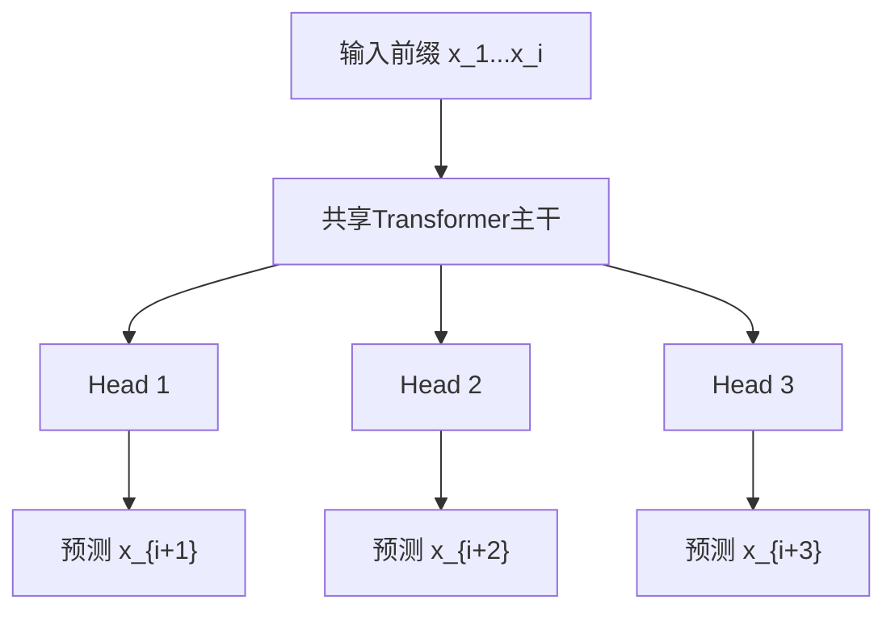
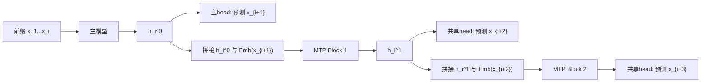
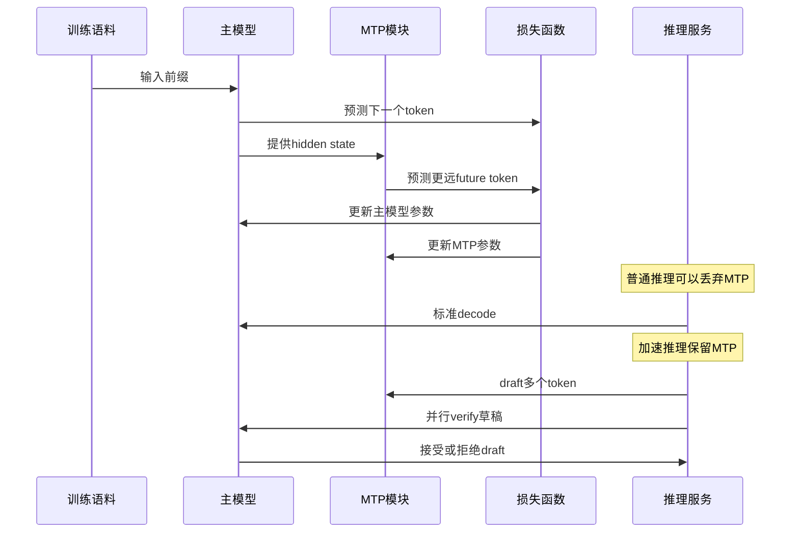

## 1. 先说结论

版本说明：本文写于2026-05-12，主要参考DeepSeek-V3技术报告、DeepSeek-V3官方权重说明、Gloeckle等人的Multi-token Prediction论文、Leviathan等人的Speculative Decoding论文，以及Google在2026-05-05发布的Gemma 4 MTP文档。MTP相关工程实现仍在快速变化，尤其是推理框架对MTP权重、KV cache共享、MoE模型和量化格式的支持，所以具体可用性要以实际框架版本为准。

MTP是Multi-Token Prediction，也就是“多token预测”。它的核心不是让大模型在推理时不受约束地一次吐出多个token，而是：

**在训练时，除了预测下一个token，还让模型学习预测更远的未来token；在推理时，这些额外预测可以作为草稿，再由主模型验证，从而加速decode。**

要把MTP讲清楚，需要分清三个层次：

| 层次 | MTP在做什么 | 目标 |
|---|---|---|
| 训练目标 | 对同一个位置预测多个未来token | 增加训练信号，逼模型形成更有前瞻性的表示 |
| 模型结构 | 增加额外head或额外MTP模块 | 产生第2个、第3个未来token的分布 |
| 推理加速 | 用MTP模块先猜后续token，再由主模型并行验证 | 减少串行decode步数，提高tokens/s |

最重要的几个结论：

1. **标准LLM训练是Next-Token Prediction，MTP是在它旁边加辅助目标。** 主损失仍然是预测下一个token，MTP损失预测更远的token。
2. **MTP不等于“跳过自回归”。** 生成文本最终仍然要满足自回归条件，推理加速通常依赖投机解码的draft-then-verify流程。
3. **MTP的训练收益和推理收益是两件事。** 训练时即使最后丢掉MTP模块，主模型也可能因为更密集的监督信号而变强；推理时如果保留MTP模块，则可以把它当成draft模型使用。
4. **DeepSeek-V3采用的是顺序MTP模块。** 它不是简单并行加多个独立输出头，而是在每个预测深度保留因果链；开源权重里主模型是671B参数，另有MTP模块权重。
5. **加速不是免费的。** 如果草稿token被主模型接受率低，或者MTP模块开销、KV cache管理、MoE专家加载成本太高，实际速度提升会变小，甚至没有收益。

一句话概括：

**MTP的本质是把“只看一步”的语言建模目标，改造成“看一步，也学习看多步”；推理加速时，再把多步预测变成可验证的草稿。**

## 2. 标准自回归为什么慢

普通decoder-only LLM的训练目标是Next-Token Prediction，简称NTP。

给定一段token：

```text
x_1, x_2, x_3, ..., x_T
```

模型在位置$i$看到前缀：

```text
x_1, x_2, ..., x_i
```

然后预测下一个token：

```text
x_{i+1}
```

训练损失通常是：

$$
\mathcal{L}_{\mathrm{NTP}}
= - \frac{1}{T}\sum_{i=1}^{T}\log P_\theta(x_{i+1}\mid x_{\le i})
$$

这个目标很自然，因为语言生成本来就是按条件概率分解的：

$$
P(x_1,\ldots,x_T)
= \prod_{i=1}^{T}P(x_i\mid x_{<i})
$$

问题出在推理阶段。

假设模型要生成4个token：

```text
已有前缀: Actions speak louder than
目标输出: words . <eos>
```

标准自回归decode必须串行执行：

```text
第1步: 模型读入前缀，生成 words
第2步: 模型读入前缀 + words，生成 .
第3步: 模型读入前缀 + words + .，生成 <eos>
```

即使第2个、第3个token很容易猜，模型也要一轮一轮跑。

这带来两个瓶颈：

1. **串行依赖。** 第$t+1$个token必须等第$t$个token确定之后才能作为输入。
2. **decode阶段容易受内存带宽限制。** 每生成一个token，都要读取大量模型权重和KV cache，但每步有效计算的token数很少，GPU算力不容易吃满。

因此，生成$K$个token通常需要$K$次串行主模型forward。MTP和投机解码要解决的就是这个串行瓶颈。

## 3. MTP到底定义了什么

MTP把训练目标从：

```text
当前位置 -> 预测下1个token
```

扩展成：

```text
当前位置 -> 预测下1个token
当前位置 -> 预测下2个token
当前位置 -> 预测下3个token
...
```

如果预测深度是$n$，那么位置$i$不仅要预测$x_{i+1}$，还要预测：

```text
x_{i+2}, x_{i+3}, ..., x_{i+n}
```

可以写成：

$$
\mathcal{L}_{\mathrm{MTP}}
= \frac{1}{n}\sum_{k=1}^{n}
\left(
-\frac{1}{T-k}\sum_{i=1}^{T-k}
\log P_{\theta,k}(x_{i+k}\mid x_{\le i})
\right)
$$

这里$k$表示预测深度：

1. $k=1$：预测下一个token，也就是传统NTP。
2. $k=2$：预测下下个token。
3. $k=3$：预测再往后的token。

实际训练时通常不会简单用MTP替代NTP，而是组合成：

$$
\mathcal{L}
= \mathcal{L}_{\mathrm{main}}
+ \lambda \mathcal{L}_{\mathrm{mtp}}
$$

其中$\lambda$是MTP损失权重。DeepSeek-V3技术报告里提到，预训练前10T token使用较大的MTP loss weight，后4.8T token调低权重。

直观理解：

```text
NTP:
  老师每次只问学生：下一个词是什么？

MTP:
  老师还会追问：再下一个词大概是什么？再往后呢？
```

这会改变模型内部表示的学习压力。模型不能只学一个局部补全，它还要让当前位置的hidden state包含更多对未来结构有帮助的信息。

## 4. 原始MTP：共享主干 + 多个输出头

Gloeckle等人的论文《Better & Faster Large Language Models via Multi-token Prediction》给出的基本形式比较直接：

```text
共享Transformer trunk
        |
        +--> head_1: 预测 x_{i+1}
        +--> head_2: 预测 x_{i+2}
        +--> head_3: 预测 x_{i+3}
        +--> head_4: 预测 x_{i+4}
```

也就是主干网络仍然只跑一次，但顶部有多个独立输出头。每个输出头负责一个未来位置。

用图表示：



这个设计的好处是简单：

1. 共享绝大多数参数。
2. 多个预测头可以并行计算。
3. 训练时每个位置产生更多监督信号。
4. 推理时可以尝试一次拿多个候选token。

但它也有一个问题：多个head是并行从同一个hidden state出发的。

预测$x_{i+3}$时，head并没有真正看到模型自己预测出来的$x_{i+1}$和$x_{i+2}$。它只能从$x_{\le i}$直接猜更远的位置。这对训练目标没问题，但用于推理draft时可能不够贴近真实自回归过程。

这也是DeepSeek-V3没有照搬“多个独立head并行预测”的原因之一。

## 5. DeepSeek-V3的顺序MTP

DeepSeek-V3的MTP更复杂。技术报告明确说，它受到Gloeckle等人的启发，但实现上不是用独立输出头并行预测，而是用**顺序模块**预测额外token，并在每个预测深度保持完整因果链。

### 5.1 模块组成

第$k$个MTP模块大致包含：

1. 共享embedding层。
2. 共享output head。
3. 一个Transformer block。
4. 一个投影矩阵。
5. 对输入表示和未来token embedding的组合。

DeepSeek-V3官方权重说明中也可以看到类似结构：开源V3权重包含1个MTP Module；MTP模块复用主模型embedding和输出head，并额外包含RMSNorm、投影和一个额外Transformer层。

这意味着DeepSeek-V3的MTP不是“随便加一个分类头”。它更像是在主模型最后接了一个轻量的未来token预测小模块。

### 5.2 顺序预测是什么意思

设主模型在位置$i$得到表示：

$$
h_i^0
$$

这里上标$0$表示主模型深度，也就是尚未进入MTP模块。

第1个MTP模块要预测额外未来token。它会把两个东西拼起来：

1. 当前深度的表示$h_i^{k-1}$。
2. 某个未来token的embedding。

然后通过投影矩阵压回模型维度：

$$
z_i^k = W_k [\mathrm{Norm}(h_i^{k-1}); \mathrm{Norm}(\mathrm{Emb}(x_{i+k}))]
$$

再喂给第$k$个MTP Transformer block：

$$
h_i^k = \mathrm{TransformerBlock}_k(z_i^k)
$$

最后用共享输出head预测第$k+1$个未来token：

$$
P_{i}^{k+1} = \mathrm{softmax}(\mathrm{Head}(h_i^k))
$$

不用纠结符号下标，关键是这件事：

**DeepSeek-V3的MTP在预测更远token时，会显式把更近的token信息接入下一层MTP模块，让预测链条更像真实自回归过程。**

### 5.3 为什么要保留因果链

看一个例子：

```text
前缀: def add(a, b):
真实后续: return a + b
```

如果只从前缀直接预测第3个未来token，模型可能要从：

```text
def add(a, b):
```

直接猜到：

```text
+
```

这很难，因为中间的`return`和`a`没有进入条件。

顺序MTP的想法是：

```text
主模型预测: return
MTP第1层结合 return 的信息，预测: a
MTP第2层结合 a 的信息，预测: +
```

这样第$k$步预测会依赖更近的未来token信息，和真实生成过程更接近。

用图表示：



DeepSeek-V3开源权重里是1个MTP模块，所以最常见的理解是：

```text
主模型预测第1个未来token
MTP模块预测第2个未来token
```

技术报告在后训练讨论里也提到，DeepSeek-V3通过MTP预测下两个token，结合投机解码可以提升decode速度。

## 6. MTP训练目标为什么可能让主模型变强

MTP带来的训练收益主要有三个解释。

### 6.1 更密集的训练信号

普通NTP每个位置只给一个监督信号：

```text
位置i -> x_{i+1}
```

MTP每个位置给多个监督信号：

```text
位置i -> x_{i+1}
位置i -> x_{i+2}
位置i -> x_{i+3}
```

如果预测深度是$n$，同一批数据里监督信号的种类更多。它不一定让训练计算完全免费，但从学习信号角度看，同一个上下文被利用得更充分。

### 6.2 迫使表示包含未来规划信息

只预测下一个token时，模型可能偏向局部模式。例如：

```text
import numpy as
```

下一个token大概率是：

```text
np
```

但如果还要预测后面的代码结构，模型需要知道接下来是否会用数组、矩阵、随机数、文件读取等更长程意图。

MTP迫使hidden state不仅对“下一个token”有用，也要对“更远的token”有用。这种压力可能促使模型形成更抽象、更有计划性的表示。

### 6.3 对代码和算法任务尤其有帮助

代码有强结构：

```python
for i in range(n):
    total += arr[i]
```

看到`for i in range(n):`后，后续缩进、变量引用、括号、冒号、换行都有较强规律。多token预测可以让模型更早学习这些跨多个token的结构。

Gloeckle等人的论文报告了代码生成任务上的明显收益；DeepSeek-V3的MTP消融实验也显示，在HumanEval、GSM8K、MATH等任务上，加入MTP后的模型普遍更好。

但要注意：

**MTP不是魔法。** 如果未来token本身高度不确定，或者数据噪声很大，预测更远位置可能会引入额外优化难度。因此MTP损失权重通常需要调节，不能让辅助目标压过主目标。

## 7. 推理阶段：MTP如何加速decode

MTP用于推理加速时，通常要和Speculative Decoding结合。

投机解码的核心流程是：

```text
1. draft模型先快速猜多个后续token
2. target主模型一次性验证这些token
3. 被主模型接受的token直接提交
4. 第一个被拒绝的位置由主模型给出正确token
5. 从新的前缀继续下一轮
```

这里MTP模块可以充当draft模型。

### 7.1 一个具体例子

假设当前前缀是：

```text
Actions speak louder than
```

MTP草稿给出：

```text
words .
```

主模型不再只验证`words`一个token，而是对这段候选一次forward：

```text
输入: Actions speak louder than words .
验证:
  than -> words 是否接受
  words -> . 是否接受
  . -> 下一个token是什么
```

如果主模型同意草稿，那么这一轮可能一次提交多个token：

```text
words .
```

甚至还可以顺手得到主模型对下一个位置的预测。

如果主模型不同意第二个token：

```text
MTP草稿: words !
主模型判断: words 后面更应该是 .
```

那么系统只接受`words`，拒绝`!`，然后提交主模型给出的`.`，再进入下一轮。

### 7.2 为什么验证可以并行

Transformer训练时本来就能并行计算一个序列中每个位置的logits，只是靠causal mask保证位置$i$看不到未来位置。

当草稿token已经给出来后，主模型可以把它们当作已知输入，一次性计算：

```text
prefix + draft_1 + draft_2 + ... + draft_m
```

每个位置的预测分布都能并行得到：

```text
prefix       -> draft_1 的概率
draft_1位置  -> draft_2 的概率
draft_2位置  -> draft_3 的概率
...
```

这就是投机解码能加速的根本原因：

**draft仍然是猜的，但verify可以把多个猜测合并成一次主模型forward。**

### 7.3 接受率决定收益上限

设MTP一次草稿$m$个token，平均接受$a$个token。如果每轮还可以得到主模型额外生成的1个token，那么一轮大约提交：

$$
a + 1
$$

个token。

粗略地说，如果MTP模块开销很小，理想加速比接近：

$$
\mathrm{speedup} \approx a + 1
$$

但真实情况要扣掉：

1. MTP模块本身的计算开销。
2. 更长verify序列带来的attention开销。
3. KV cache读写和管理开销。
4. batch调度开销。
5. MoE模型可能加载额外专家的开销。
6. 采样策略和拒绝采样带来的额外逻辑。

DeepSeek-V3报告中提到，第二个token预测的接受率在不同生成主题上约为85%到90%，并报告了TPS提升。这个数字说明：只预测一个额外token时，只要接受率高，收益就很稳定。

### 7.4 一个简化伪代码

下面是简化后的MTP投机解码逻辑：

```python
tokens = prompt

while not finished(tokens):
    draft = mtp_draft(tokens, max_draft_tokens=m)

    target_logits = target_model(tokens + draft)

    accepted = []
    for j, draft_token in enumerate(draft):
        target_token = sample_or_argmax(target_logits[j])
        if target_token == draft_token:
            accepted.append(draft_token)
        else:
            accepted.append(target_token)
            break

    tokens.extend(accepted)
```

真实实现会更复杂，因为要支持概率采样而不是只支持贪心解码。Leviathan等人的Speculative Decoding给出了保持目标模型分布不变的采样校正方式。工程框架还要处理KV cache复用、位置编码、batch、EOS、停止词、logprobs和流式输出。

## 8. MTP和普通投机解码有什么区别

普通投机解码经常使用两个独立模型：

```text
小draft模型: 便宜、快、先猜
大target模型: 贵、准、负责验证
```

MTP式投机解码则更像：

```text
主模型: target
附加MTP模块: 和主模型共享部分参数或激活的draft
```

对比如下：

| 方案 | draft来自哪里 | 优点 | 缺点 |
|---|---|---|---|
| 独立小模型 | 另一个小LLM | 可复用现有模型，部署概念简单 | tokenizer、分布、KV cache可能不匹配 |
| Medusa类多head | 主模型上加多个head | 结构轻，能自投机 | head能力有限，远期token质量可能下降 |
| EAGLE类特征级draft | 利用隐藏状态预测后续特征/token | 草稿质量更好 | 实现复杂 |
| MTP模块 | 训练时就学习多未来token预测 | 训练收益和推理收益可以统一 | 需要模型原生支持或额外训练 |

MTP的优势在于：draft模块不是事后随便配的小模型，而是在预训练阶段就和主模型一起学习未来token预测。它更容易和主模型分布对齐，也更容易复用主模型embedding、output head、hidden states和KV cache。

Google的Gemma 4 MTP文档也强调了类似工程方向：MTP drafter不是完全独立模型，而是共享输入embedding，并建立在target模型最后层激活之上；这样可以减少重复上下文计算。

## 9. DeepSeek-V3里MTP的几个实现细节

### 9.1 MTP模块可以在普通推理中丢掉

DeepSeek-V3技术报告明确说，MTP主要目标是提升主模型性能；推理时可以直接丢弃MTP模块，主模型仍然能独立正常工作。

这点很重要：

```text
训练:
  主模型 + MTP模块一起优化

普通推理:
  只用主模型

加速推理:
  主模型 + MTP模块 + 投机解码验证
```

所以MTP的训练收益不依赖推理框架是否支持MTP。

### 9.2 开源权重包含额外MTP参数

DeepSeek-V3 GitHub README和README_WEIGHTS说明中提到，Hugging Face上的总权重规模包含主模型权重和MTP模块权重。主模型是671B参数，MTP模块额外占一部分权重。

这会影响部署：

1. 如果推理框架不支持MTP，可以只按主模型路径加载。
2. 如果要用MTP加速，需要框架识别额外MTP层。
3. 权重转换、量化、tensor parallel切分都要考虑MTP模块。

这也是为什么很多框架一开始支持DeepSeek-V3“普通推理”，但MTP支持会滞后。

### 9.3 共享embedding和output head是为了省参数，也为了对齐分布

如果MTP模块使用完全独立的词表投影，它可能和主模型输出分布不一致。共享embedding和output head有两个好处：

1. 减少额外参数。
2. 让MTP预测和主模型使用同一套token语义空间。

从投机解码角度看，draft越接近target，接受率越高；共享这些关键参数有助于提高草稿质量。

## 10. MTP为什么不能保证一定加速

MTP听起来像“一次预测多个token，所以速度翻倍”。这个说法不严谨。

实际速度取决于下面几个因素。

### 10.1 接受率

如果MTP草稿经常错，主模型就会频繁拒绝：

```text
草稿: A B C D
主模型: A 接受，B 拒绝
```

这种情况下，一轮只多提交很少token，但仍然付出了draft和verify的开销。

低接受率常见于：

1. 高temperature采样。
2. 创意写作等分布更发散的任务。
3. 很难的推理步骤。
4. 领域外文本。
5. draft模块训练不足。

### 10.2 draft开销

如果MTP模块太重，草稿本身就慢。理想的draft应该满足：

```text
draft多个token的时间 < target生成一个token的时间
```

否则没有意义。

DeepSeek-V3的1-depth MTP模块相对主模型很小，所以有机会带来收益。但如果MTP深度很大，或者实现没有复用主模型中间结果，收益会被吃掉。

### 10.3 验证长度和attention开销

验证多个token不是完全免费。主模型要处理：

```text
prefix + draft tokens
```

虽然这比串行多次decode更并行，但序列长度增加后仍然有额外attention计算和KV cache写入。

在短draft长度下这通常可接受；draft太长时，边际收益会下降。

### 10.4 MoE专家加载

MoE模型还有一个额外问题：不同token可能路由到不同专家。

如果一次验证多个draft token，每个token激活的专家集合不同，那么系统可能要加载更多专家权重。Google Gemma 4 MTP文档也指出，MoE模型在batch size为1时可能因为专家复用不足而抵消draft收益；batch更大时，不同序列之间的专家重叠更多，收益才更明显。

这说明MTP加速不是纯算法问题，它强依赖硬件和服务系统。

### 10.5 推理框架支持

MTP要跑得快，框架至少要处理：

1. MTP权重加载。
2. MTP模块的tensor parallel切分。
3. MTP和主模型的KV cache共享或复用。
4. draft token的批量验证。
5. 拒绝采样后的KV cache回滚或修正。
6. 流式输出时的token提交边界。
7. 量化权重下的MTP模块兼容。

所以“模型有MTP权重”和“部署时能享受到MTP加速”不是一回事。

## 11. MTP、并行解码和非自回归生成的区别

MTP经常被误解成“模型不再自回归”。这不准确。

### 11.1 MTP不是完全并行生成

完全非自回归生成希望一次生成整个序列：

```text
prefix -> y_1, y_2, ..., y_K
```

MTP不是这样。MTP最多是预测若干个未来token的候选，最终仍要通过主模型的自回归分布验证。

### 11.2 MTP不是简单top-k猜测

普通top-k是在一个位置给出多个候选：

```text
下一个token可能是 A/B/C
```

MTP是在多个未来位置给候选：

```text
第1个未来token可能是 A
第2个未来token可能是 B
第3个未来token可能是 C
```

一个是同一位置的多个候选，一个是多个位置的候选，含义不同。

### 11.3 MTP不是一定改变输出质量

如果使用严格的投机解码校正，主模型仍然决定最终分布，MTP只是加速路径。草稿错了会被拒绝。因此理论上可以做到不改变目标模型输出分布。

但工程实现里仍要小心：

1. 贪心解码和采样解码的验证规则不同。
2. temperature、top-p、top-k会影响接受逻辑。
3. 浮点误差和量化可能造成边界差异。
4. 框架如果为了速度做近似，就可能改变输出分布。

所以生产系统要用实际任务做质量回归测试。

## 12. 一个端到端生命周期

把训练、权重、推理连起来看，MTP的生命周期是这样的：



这张图表达了一个关键点：

**训练时MTP是辅助监督；推理时MTP是可选加速器。**

## 13. 实际什么时候适合用MTP

适合用MTP的场景：

1. **大模型预训练。** 模型足够大时，多token目标更可能转化成能力收益。
2. **代码生成。** token序列结构强，后续token可预测性高。
3. **低延迟推理。** 用户能明显感知decode速度，例如聊天、代码助手、语音助手、agent循环。
4. **本地或边缘设备。** 内存带宽紧张，decode瓶颈明显。
5. **目标模型原生带MTP权重。** 例如DeepSeek-V3、Gemma 4 MTP drafters这类设计。

不一定适合的场景：

1. **小模型或训练预算很紧。** MTP模块和loss调参会增加复杂度。
2. **输出高度随机。** 高temperature创意生成会降低接受率。
3. **框架不支持。** 有权重但不能高效加载、验证和回滚，收益难落地。
4. **MoE单请求低batch部署。** 专家加载可能抵消收益。
5. **只关心prefill吞吐。** MTP主要改善decode，不直接解决长prompt prefill成本。

## 14. 常见误区

### 14.1 “MTP让模型一次生成多个token，所以不需要验证”

不对。MTP预测的是候选。要保持主模型质量，仍然需要target模型验证。

### 14.2 “MTP只对推理有用”

不对。DeepSeek-V3的设计首先把MTP作为训练目标，用来提升主模型性能。即使推理时丢掉MTP模块，也可能受益。

### 14.3 “MTP模块越多越好”

不一定。预测越远，目标越不确定，loss越难优化，草稿接受率也可能下降。更多MTP深度还会增加训练和推理开销。

### 14.4 “MTP和KV cache无关”

理论概念上可以分开讲，但工程实现强相关。MTP投机解码要高效，就必须处理draft和verify阶段的KV cache复用、写入、接受和回滚。

### 14.5 “只要模型支持MTP，速度就一定翻倍”

不一定。速度取决于接受率、draft成本、verify成本、硬件并行度、batch大小、MoE专家复用、框架实现和量化路径。

## 15. 总结

MTP可以从两个角度理解。

从训练角度看，它是一个辅助语言建模目标：

```text
不要只预测下一个token，也学习预测更远的token。
```

它通过更密集的监督信号和更强的未来规划压力，可能提升模型表示质量，尤其对代码、数学和结构化生成任务有帮助。

从推理角度看，它是投机解码的一个好draft来源：

```text
MTP先猜多个未来token，主模型一次性验证，接受就少跑几轮串行decode。
```

DeepSeek-V3的价值在于把MTP放进大规模预训练，并采用顺序MTP模块保留因果链；Gemma 4的近期开源MTP drafters则说明，这类方法正在从论文机制进入真实推理框架和边缘设备部署。

最稳妥的理解是：

**MTP不是推翻自回归，而是在自回归框架里增加“可训练的前瞻能力”，再用验证机制把这种前瞻能力转化为安全的推理加速。**

## 参考

1. DeepSeek-AI, [DeepSeek-V3 Technical Report](https://arxiv.org/abs/2412.19437), arXiv:2412.19437.
2. DeepSeek-AI, [DeepSeek-V3 GitHub Repository](https://github.com/deepseek-ai/DeepSeek-V3).
3. DeepSeek-AI, [DeepSeek-V3 README_WEIGHTS.md](https://github.com/deepseek-ai/DeepSeek-V3/blob/main/README_WEIGHTS.md).
4. Fabian Gloeckle et al., [Better & Faster Large Language Models via Multi-token Prediction](https://arxiv.org/abs/2404.19737), arXiv:2404.19737.
5. Yaniv Leviathan, Matan Kalman, Yossi Matias, [Fast Inference from Transformers via Speculative Decoding](https://arxiv.org/abs/2211.17192), ICML 2023.
6. NVIDIA NeMo Megatron Bridge, [Multi-Token Prediction (MTP)](https://docs.nvidia.com/nemo/megatron-bridge/0.3.0/training/multi-token-prediction.html).
7. Google, [Accelerating Gemma 4: faster inference with multi-token prediction drafters](https://blog.google/innovation-and-ai/technology/developers-tools/multi-token-prediction-gemma-4/), 2026-05-05.
8. Google AI for Developers, [Speed-up Gemma 4 with Multi-Token Prediction](https://ai.google.dev/gemma/docs/mtp/overview), last updated 2026-05-05.
