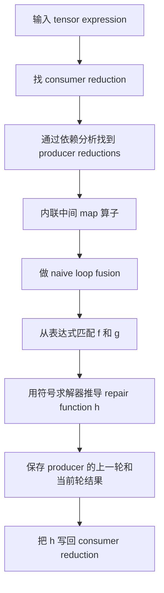
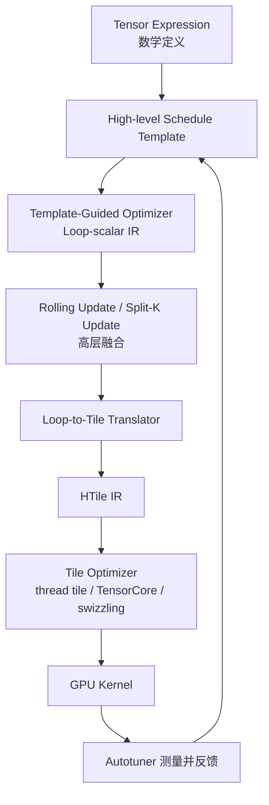

> 论文为：Neptune: Advanced ML Operator Fusion for Locality and Parallelism on GPUs
>
> 本文基于 arXiv:2510.08726v2，最后修订时间为 2026-04-20。论文已被 PLDI 2026 收录，代码仓库为 https://github.com/uiuc-arc/neptune 。

# 1 先说结论

Neptune 想解决的问题很直接：很多深度学习算子理论上应该融合成一个 GPU kernel，但传统 tensor compiler 往往因为 reduction 之间存在循环携带依赖而拒绝融合，最终只能依赖手写的 FlashAttention、FlashDecoding 或各类 Triton 模板。

Neptune 的核心思想可以概括为一句话：

> 先故意打破一部分依赖做“天真的融合”，再自动推导代数修复项，把结果修回来。

这个思路非常像 FlashAttention 里 online softmax 的手工推导，但 Neptune 的贡献在于把它抽象成编译器里的 schedule primitive：

- Rolling Update：更适合 prefill attention，效果类似 FlashAttention。
- Split-K Update：更适合 decode attention，效果类似 FlashDecoding。
- Loop-scalar IR 到 Tile IR 的翻译：高层 schedule 负责融合，底层 tile optimizer 负责线程、TensorCore、swizzle 等硬件细节。

论文的实验结果也比较强：在 10 个 attention 类算子、8 个序列长度、4 种 GPU 的 320 个配置中，Neptune 在 284 个配置上达到最低延迟；相对最好的 compiler baseline 几何平均加速 1.35 倍，在 NVIDIA GPU 上最高 2.65 倍，在 AMD GPU 上最高 3.32 倍。

我的理解是：Neptune 并不是又写了一个新的 FlashAttention，而是尝试回答一个更编译器化的问题：为什么 FlashAttention 这种“算法级 kernel 优化”不能成为通用编译变换？

# 2 背景：为什么 attention 融合这么难

普通的 operator fusion 比较容易理解。例如：

```python
y = relu(x)
z = y + 1
```

把它们合成一个 kernel 通常没有问题，因为第二个算子只是逐元素读取第一个算子的结果，不涉及复杂的跨循环依赖。

但 attention 的核心路径不是这么简单：

```text
QK^T -> score/mask/bias -> softmax -> softmax(score) V
```

这里有两个关键问题：

1. `QK^T` 会产生一个 $L \times L$ 的 score 矩阵，长序列下内存开销巨大。
2. softmax 不是纯 elementwise，它依赖 reduce max 和 reduce sum。

稳定 softmax 通常写成：

$$
\mathrm{softmax}(x_j)=\frac{\exp(x_j-m)}{\sum_k \exp(x_k-m)}
$$

其中：

$$
m=\max_k x_k
$$

也就是说，计算每个 $\exp(x_j-m)$ 之前，需要先知道整行最大值 $m$。如果编译器想沿着 `j` 维把 max、exp、sum 融到一起，就会遇到一个依赖矛盾：

- 原始程序里，`exp` 读取的是“整行 reduce 完成之后”的最终 max。
- 天真融合后，`exp` 可能读取的是“当前迭代刚算出来”的中间 max。

所以传统合法性检查会拒绝这种融合。拒绝是正确的，因为直接融合会算错。

FlashAttention 的做法是重新组织 softmax：一边扫描 K/V block，一边维护当前最大值和归一化分母。当发现新的最大值时，把之前累积的分母和输出按比例缩放。Neptune 把这个“按比例缩放”的规律抽象成了可自动推导的 repair term。

# 3 一个简化例子：从错误融合到修复融合

论文用一个接近 softmax 的例子解释 Neptune 的关键思想。原始程序可以简化为三段：

```python
# s_max
for i in range(2):
    for j in range(4):
        xmax[i] = max(xmax[i], inp[i, j])

# s_exp
for i, j in grid(2, 4):
    xexp[i, j] = exp(inp[i, j] - xmax[i])

# s_sum
for i, j in grid(2, 4):
    xsum[i] += xexp[i, j]
```

如果直接把 `s_exp` 和 `s_sum` 融入 `s_max` 的 `j` 循环，会得到类似下面的代码：

```python
for i in range(2):
    for j in range(4):
        xmax[i] = max(xmax[i], inp[i, j])
        xsum[i] += exp(inp[i, j] - xmax[i])
```

这段代码的问题是，`xsum` 中早期累积的项使用的是早期的 `xmax`。如果后面出现更大的值，前面已经累加进去的项就没有被重新归一化。

Neptune 的修复方式是额外保存上一轮和当前轮的 max：

```python
for i in range(2):
    xmax_0[i] = -inf
    xsum[i] = 0
    for j in range(4):
        xmax_1[i] = max(xmax_0[i], inp[i, j])
        xsum[i] = exp(xmax_0[i] - xmax_1[i]) * xsum[i] \
                  + exp(inp[i, j] - xmax_1[i])
        xmax_0[i] = xmax_1[i]
```

这里的关键修复项是：

$$
\exp(xmax\_0 - xmax\_1)
$$

它的含义是：如果最大值从旧的 $m_{old}$ 变成新的 $m_{new}$，那么之前累积的每一项都要从 $\exp(x-m_{old})$ 变成 $\exp(x-m_{new})$，因此整体乘上：

$$
\exp(m_{old}-m_{new})
$$

这就是 FlashAttention online softmax 背后的数学直觉。Neptune 的不同点在于，它不把这个推导写死成 attention 专用规则，而是从 reduction 的表达式里自动抽取 reducer、term function 和 repair function。

# 4 Neptune 的代数修复框架

论文把一个 consumer reduction 抽象成两部分：

$$
X = \mathrm{Reduce}(f, g(r, c))
$$

其中：

- $f$ 是 reducer，例如加法、最大值。
- $g(r,c)$ 是每个被 reduce 的项。
- $r$ 是 producer reduction 的结果，例如 softmax 里的 max。
- $c$ 是非 reduction 输入，例如当前元素 $x_j$。

对于 softmax sum：

$$
f(x,y)=x+y
$$

$$
g(m,x)=\exp(x-m)
$$

Neptune 要找一个修复函数：

$$
h(t,r,r')
$$

它的作用是：把“基于旧 producer 结果 $r$ 算出来的累积值 $t$”，修成“好像基于新 producer 结果 $r'$ 算出来的一样”。

这个 $h$ 需要满足两个性质：

1. 对单个 term 能修：

$$
h(g(r,c),r,r')=g(r',c)
$$

2. 对 reducer 能分配：

$$
h(x\ f\ y,r,r')=h(x,r,r')\ f\ h(y,r,r')
$$

如果 $g$ 对 $c$ 可逆，那么 Neptune 可以机械地构造：

$$
h(t,r,r')=g(r',g_c^{-1}(r,t))
$$

代回 softmax 的 $g(m,x)=\exp(x-m)$：

$$
t=\exp(x-r)
$$

所以：

$$
x=r+\ln t
$$

于是：

$$
h(t,r,r')=\exp((r+\ln t)-r')=t\exp(r-r')
$$

这正是前面那个修复项。

这个形式化很重要，因为它说明 Neptune 不是“碰巧会做 softmax”，而是可以处理一类有代数结构的 reduction fusion。论文里还举了 Performer、数值稳定的 $L_2$ norm、带动态缩放量化的 RMSNorm 等例子。

# 5 Rolling Update：面向 prefill 的融合

Rolling Update 是 Neptune 的第一个核心变换。它适合 attention prefill 这种场景：query 长度和 key/value 长度都比较长，算子主要瓶颈是中间 score、softmax 相关张量的 materialization 和 global memory traffic。

它的大致流程如下：



直观上，Rolling Update 会让计算沿着 reduce 维滚动前进。每一步都维护当前 block 已知的 producer 结果，并把旧的 consumer 累积值修到新的 producer 结果下。

放到 attention 里，可以理解成：

- 一边遍历 K/V block。
- 一边维护当前 softmax max。
- 一边修正已经累积的 softmax denominator 和输出向量。
- 最终不需要完整写出 $L \times L$ score 矩阵，也不需要把 softmax 矩阵 materialize 到 global memory。

这就是它和 FlashAttention 的对应关系：Rolling Update 从普通 attention 定义和 schedule 出发，自动生成类似 FlashAttention 的融合结构。

但 Rolling Update 也有代价：

- 每轮要计算 repair term，增加少量算术开销。
- 要保存上一轮和当前轮 reduction 结果，通常放在 register 或 shared memory。
- reduce 维的依赖变复杂，某些场景下会限制并行度。

这些代价在 prefill 中通常值得，因为避免大中间张量和 global memory traffic 的收益更大。

# 6 Split-K Update：面向 decode 的并行化

Rolling Update 的问题是滚动依赖会降低 reduce 维并行性。Decode attention 的特点又刚好相反：

- query 长度通常是 1。
- key/value cache 很长。
- 单 token decode 对延迟敏感，需要尽量增加并行度。

因此 Neptune 提出 Split-K Update。它仍然使用同一个“打破依赖 + 代数修复”的思想，但换了一种组织方式：


可以把它理解成：

1. 先把长 K 维拆成多个 tile。
2. 每个 tile 独立算局部 softmax 相关结果。
3. 再用全局 max 修正每个 tile 的局部 sum/output。
4. 最后把修正后的局部结果合并。

这和 FlashDecoding 的思路非常接近：用额外的 partial result 存储换取更多并行度。

Split-K Update 的权衡也很明确：

- 好处：local reduction 可以并行，decode 场景收益明显。
- 代价：需要额外存储局部 reduction 结果，空间开销由 tile size 控制。

# 7 系统架构：schedule 优化和 tile 优化分层

Neptune 的另一个重要点是它没有试图只在一个抽象层解决所有问题。它把高层和低层优化拆开：



这里有两个设计取舍值得注意。

第一，Neptune 仍然让用户提供 schedule template。也就是说，它不是完全自动发现所有优化，而是让用户用少量高层 primitive 表达优化意图。例如论文附录中的 attention schedule 只有几十行，里面显式调用了 `rolling_update`。

第二，Neptune 不要求用户在 schedule 里手写底层 tile 代码。它会把 loop-scalar IR 翻译成 HTile IR，然后交给基于 Triton 的 tile optimizer 处理底层硬件优化。

这其实是在 TVM/Halide 风格 schedule compiler 和 Triton/Pallas 风格 tile compiler 之间取了一个中间路线：

- schedule compiler 擅长表达“这个数学程序应该怎么变形”。
- tile compiler 擅长把 tile 运算映射到 GPU 硬件。
- Neptune 试图把 reduction fusion 这种算法级优化留在高层，把 TensorCore、线程布局等低层细节留给 tile 层。

# 8 Loop-scalar IR 到 Tile IR：为什么还需要这一步

论文专门讨论了从 loop-scalar IR 到 Tile IR 的翻译。这个部分看似工程细节，但其实很关键：如果高层融合之后不能可靠地下沉到 tile 级程序，前面的 schedule primitive 就很难真正生成高性能 GPU kernel。

Neptune 的翻译流程大致分三步：

1. 找 tileable loop nest。
2. 把标量 tensor access 转成 tile access。
3. 做 dimension order reconciliation。

第三步比较有意思。比如原始 loop 里可能有：

```python
y3[vi, vj] = x1d[i0, i1] * xtrans[vj, vi]
```

如果只看访问区域，会得到 tile slice；但如果不理解 loop 变量和 tensor 维度的顺序，就会漏掉 broadcast 和 transpose。Neptune 用类似 Einstein notation / einops 的方式抽取维度顺序：

```text
y3:     i1, j1
x1d:    None, i1
xtrans: j1, i1
```

然后通过 squeeze、permute、unsqueeze 把每个 tile expression 调整到 loop order。这样生成的 HTile IR 才能正确表达 broadcast、transpose、reduce、dot 等 tile 运算。

这一步说明 Neptune 的定位不是单纯提出两个数学变换，而是把它们放进了一个能生成实际 GPU kernel 的编译管线。

# 9 实现和评测

实现方面，Neptune 基于 TVM 和 Triton：

- loop-scalar IR 和 HTile IR 扩展自 TVM TensorIR。
- tensor expression 和 schedule template 使用 TVM 风格接口。
- repair function 的符号求解使用 SymPy。
- tile optimizer 和 codegen 基于 Triton。
- 论文称实现约 10K 行 C++/Python，其中 3K 行用于 loop fusion transformation，1.3K 行用于 loop-to-tile translation。

评测平台包括：

- NVIDIA A100
- AMD MI300
- NVIDIA RTX A5000
- NVIDIA RTX 6000 Ada

attention 类实验覆盖 10 个算子变体，包括 Global、Causal、ALiBi、GQA、SoftCap、Window，以及 prefill / decode 两种模式。序列长度从 128 到 32768，batch size 默认为 1。

对比对象包括：

- compiler / framework：Triton、TVM、FlexAttention、Mirage
- 手工优化库：PyTorch、cuDNN、Tri-Dao CUTLASS、FlashInfer 等

主要结果：

- 对 compiler baseline：320 个配置里 284 个 Neptune 最快或并列最快，整体几何平均 1.35 倍于最强 compiler baseline。
- 对手工优化库：256 个配置里 101 个 Neptune 最快或并列最快，整体几何平均 1.07 倍于最强 library baseline。
- 非 attention 算子中，$L_2$ norm、RMSNorm、Performer 也能从 reduction fusion 中受益。
- 消融实验显示，fusion 是最关键的优化来源，autotuning 对部分算子进一步有效。
- 数值误差方面，论文报告 Neptune 在 prefill attention 上相对 FP64 unfused baseline 的 RMS error 不高于 Tri-Dao 和 FlexAttention。

这里需要注意一个细节：Neptune 相比 compiler baseline 的优势更明显；相比高度手写优化库，优势没有那么稳定。这是合理的，因为手写库通常已经针对热门算子和热门硬件做了大量工程优化。Neptune 的价值主要在于把这类优化变得更通用、更可组合、更可移植。

# 10 和已有系统的关系

我觉得可以从三个维度看 Neptune。

## 10.1 和 FlashAttention / FlashDecoding 的关系

FlashAttention 和 FlashDecoding 是手工推导并手工实现的高性能 attention kernel。Neptune 的 Rolling Update 和 Split-K Update 可以生成与它们等价或相近的结构。

区别在于：

- FlashAttention 是 attention 专用算法。
- Neptune 尝试把其中的代数修复思想推广成 compiler primitive。

所以 Neptune 更像是“FlashAttention 背后的编译器抽象”。

## 10.2 和 Triton / Pallas / TileLang 的关系

Triton 这类 tile language 让程序员可以直接写 tile 级 GPU 程序，性能潜力很高，但高层融合需要程序员自己写进输入程序。

Neptune 认为这层抽象太低了：程序员不应该每次都重新编码 FlashAttention 式融合。它选择在更高层做 reduction fusion，然后把结果翻译到 tile IR。

## 10.3 和 TVM / Halide 的关系

TVM / Halide 的 schedule 体系很适合描述程序变换，但传统 schedule primitive 很难表达“先破坏依赖再代数修复”这种融合。

Neptune 的做法是在 schedule 体系里加入更强的 primitive，同时用符号分析保证变换后的程序在实数语义下等价。

# 11 局限和个人理解

Neptune 的思路很漂亮，但并不是所有 reduction 都能自动融合。

论文中提到一个失败例子：Welford variance。虽然从数学上看，均值和方差可以被组织成单 pass 在线算法，但 Neptune 当前的代数修复分析无法推导出需要的修复项，因为它没有充分利用“均值、方差、样本之间存在额外关系”这一类上下文信息。

这说明 Neptune 的能力边界取决于：

- $g$ 是否能被符号求解器处理。
- 修复函数 $h$ 是否能对 reducer $f$ 分配。
- 程序是否能匹配到 Neptune 支持的 reduction 形态。
- 融合后的程序是否能顺利翻译到 tile IR。
- 额外寄存器、shared memory、局部结果存储是否会压垮 occupancy 或并行性。

另外，论文实验里的 schedule template 仍然需要人提供。虽然比手写 Triton kernel 短很多，但它还不是完全自动的“输入 PyTorch 图，输出最优 kernel”。论文结论里也提到后续工作 Nautilus 进一步自动化了 scheduling，并扩展到 Hopper / Blackwell 等新架构。

# 12 什么时候值得关注 Neptune 这类工作

如果只是使用成熟模型里的标准 attention，直接使用 FlashAttention、cuDNN、FlashInfer 之类库可能仍然是最省事的选择。

但 Neptune 代表的方向在以下场景很有价值：

- 新模型结构频繁引入 attention 变体，例如新的 bias、mask、score modification。
- 算子不是标准 attention，但包含类似“先 reduce 得到统计量，再用统计量做另一个 reduce”的模式。
- 希望同一个高层定义能跨 NVIDIA 和 AMD GPU 生成高性能 kernel。
- 希望把算法级 kernel 优化纳入 compiler pipeline，而不是每次都手写模板。

从更长期看，Neptune 的意义不只是加速某几个 attention 变体，而是把“高级融合”从手工 kernel 工程推进到编译器可表达、可验证、可组合的层面。

# 13 总结

Neptune 的核心贡献可以总结为：

1. 将 FlashAttention 式 online 修复思想推广为一类 reduction fusion 编译变换。
2. 提出 Rolling Update 和 Split-K Update，分别服务于 locality 和 parallelism。
3. 使用符号分析自动推导 repair function，并给出实数语义下的正确性论证。
4. 把高层 schedule 优化和底层 tile 优化串成完整 GPU kernel 生成管线。
5. 在 attention 变体和非 attention reduction 算子上展示了不错的性能和可移植性。

我认为这篇论文最值得学习的点是它对“依赖”的态度。传统编译器看到依赖会停止融合；Neptune 则问：这个依赖能不能暂时打破，然后用代数关系修回来？这个视角很适合解释为什么很多手写 kernel 能做到传统 compiler 做不到的优化，也提示了未来 tensor compiler 可能需要更强的语义和代数推理能力。

# 参考

- arXiv 页面：https://arxiv.org/abs/2510.08726
- 论文 PDF：https://arxiv.org/pdf/2510.08726
- Neptune 代码仓库：https://github.com/uiuc-arc/neptune
- FlashAttention 代码仓库：https://github.com/Dao-AILab/flash-attention
- Triton 文档：https://triton-lang.org/
- TVM 文档：https://tvm.apache.org/docs/
