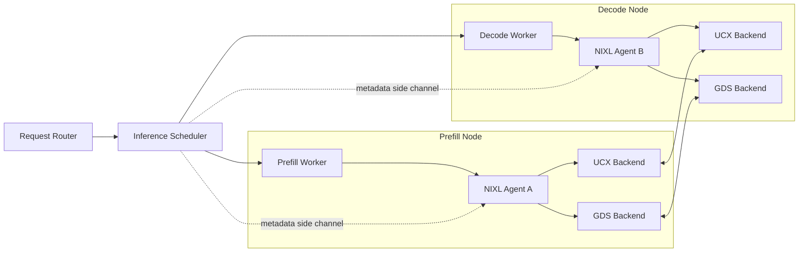
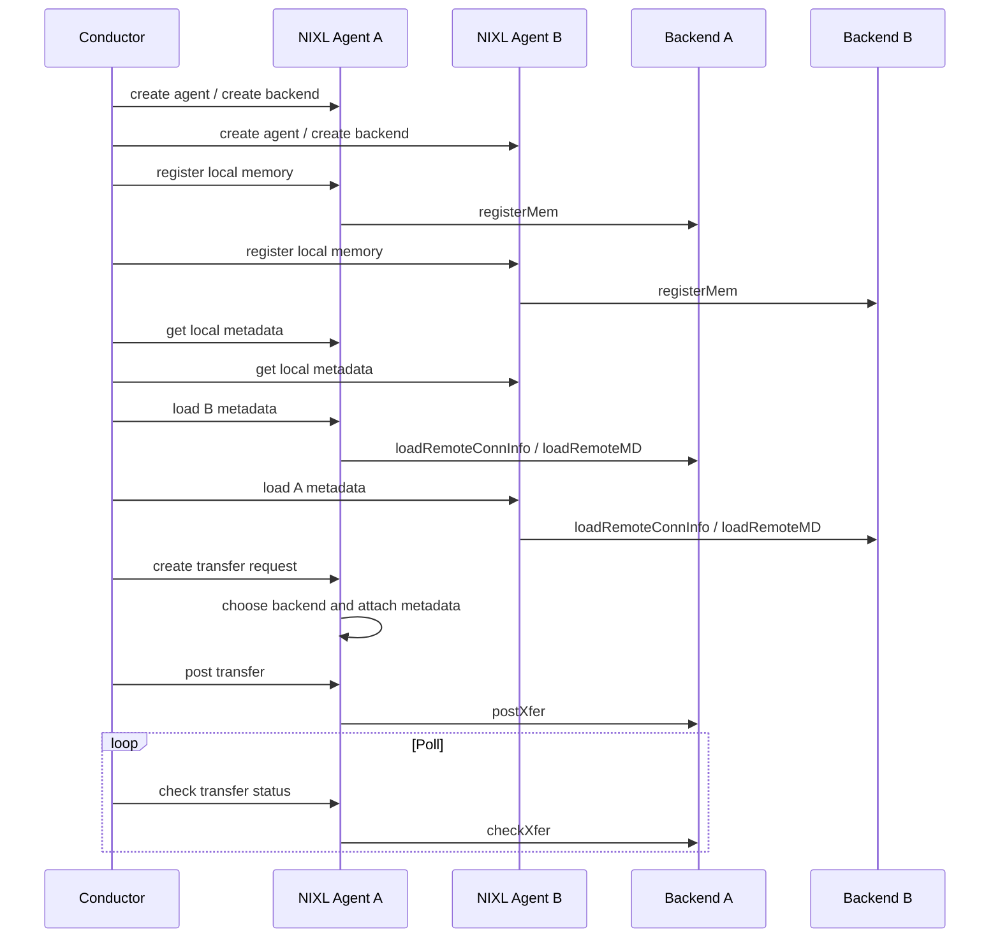
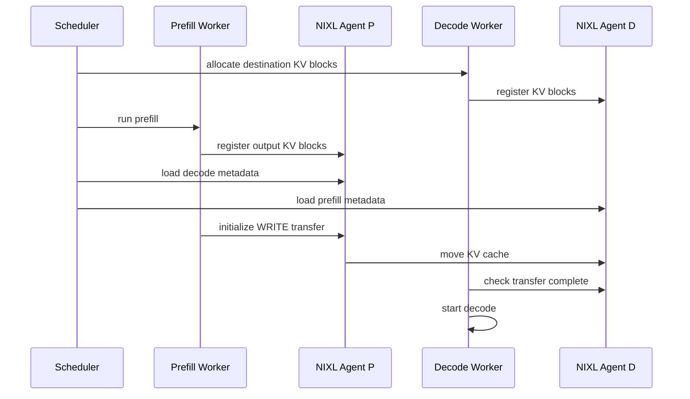

## 1. 先说结论

版本说明：本文参考的是2026-05-13访问的`ai-dynamo/nixl`官方仓库、NIXL overview、Backend Guide、Python API、NIXLBench文档和GitHub Release `v1.1.0`。截至本文写作时，GitHub最新正式release是`v1.1.0`，发布时间是2026-05-12。NIXL仍在快速演进，尤其是backend、Python wheel、telemetry和benchmark部分，生产使用前要以具体版本的release note和源码为准。

NIXL，全称NVIDIA Inference Xfer Library，解决的是LLM推理系统里一个越来越核心的问题：

```text
推理框架知道要搬什么数据，
UCX、RDMA、GDS、对象存储客户端知道怎么搬数据，
但中间缺一个面向推理工作负载的统一数据面抽象。
```

NIXL就是这个数据面抽象。它把CPU内存、GPU HBM、文件、块设备、对象存储等资源抽象成可注册的memory section，把具体搬运路径抽象成backend plugin，比如UCX、GDS、POSIX、OBJ、Libfabric等。上层推理框架只需要描述“从哪些buffer搬到哪些buffer”，NIXL agent负责选择backend、检查描述符、维护远端metadata，并返回异步transfer handle。

一句话概括：

**NIXL不是scheduler，也不是KV cache管理策略，而是给分布式推理系统使用的高性能数据搬运层。它关心的是KV cache、tensor、bytes、object这些数据如何跨GPU、跨机器、跨存储系统低延迟搬运。**

它特别适合下面这些场景：

1. disaggregated prefill/decode里，把prefill worker算出的KV cache搬到decode worker。
2. 多节点推理里，在GPU HBM之间走RDMA或GPUDirect RDMA。
3. KV cache offload/prefix cache里，在GPU、CPU、NVMe、对象存储之间搬数据。
4. 推理平台需要动态扩缩容，agent上下线时要更新远端metadata和连接。
5. 同一个系统要支持多种transport，不想把UCX、GDS、S3客户端细节散落在业务代码里。

但它不解决这些问题：

1. 不决定请求应该调度到哪台机器。
2. 不决定哪些KV cache应该保留、淘汰、压缩或预取。
3. 不替代NCCL、NVSHMEM、UCX、GDS这些底层通信/IO库。
4. 不自动消除网络、PCIe、NUMA、GPU拓扑带来的瓶颈。

## 2. 为什么推理系统需要NIXL

先看普通LLM推理。

一个请求进入serving系统后，大致会经历两个阶段：

```text
prefill: 处理prompt，生成整段prompt对应的KV cache
decode : 逐token生成，持续读取历史KV cache并追加新KV
```

如果prefill和decode在同一个GPU进程里，KV cache通常就在本进程的GPU HBM里，不需要复杂搬运。但大模型推理系统为了提高吞吐和降低时延，经常会把prefill和decode拆开：

```text
Prefill worker: 适合大batch、大矩阵计算
Decode worker : 适合持续小步生成、管理长生命周期请求
```

这就是disaggregated serving。问题随之出现：prefill worker算完KV cache后，decode worker要继续生成，KV cache必须被搬过去。

最朴素的做法是：

```text
GPU HBM -> CPU DRAM -> TCP socket -> CPU DRAM -> GPU HBM
```

这条路径能工作，但问题很多：

1. 多次拷贝浪费带宽。
2. CPU参与过多，容易变成瓶颈。
3. GPU HBM、CPU DRAM、NIC、NVMe之间的拓扑差异被上层代码硬编码。
4. 如果将来从GPU-GPU搬运变成GPU-NVMe-GPU，接口又要重写。
5. 动态扩缩容时，每个worker之间的地址、连接、远端key都要维护。

高性能路径可能是：

```text
GPU HBM -> NIC -> remote GPU HBM
GPU HBM -> NVMe
NVMe    -> GPU HBM
CPU DRAM -> remote GPU HBM
GPU HBM -> object storage
```

这些路径背后分别可能需要UCX、GPUDirect RDMA、GPUDirect Storage、POSIX AIO、io_uring、S3 SDK、Libfabric等机制。推理框架如果直接面向这些库编程，会变得非常复杂。

NIXL的价值就是把这层复杂性收敛成统一模型：

```text
上层：我要搬哪些buffer
NIXL：这些buffer属于什么memory type，远端metadata是什么，哪个backend能搬
后端：用UCX/GDS/OBJ/POSIX等真正执行
```

## 3. NIXL在系统里的位置

一个典型分布式推理系统可以拆成控制面和数据面。

控制面负责：

1. 接收用户请求。
2. 调度prefill/decode。
3. 分配KV cache block。
4. 决定哪些worker通信。
5. 交换metadata。
6. 处理扩缩容和故障。

数据面负责：

1. 把KV cache从A搬到B。
2. 把tensor从GPU搬到CPU或远端GPU。
3. 把缓存写入NVMe或对象存储。
4. 查询传输状态。
5. 尽量和计算重叠。

NIXL处在数据面，但它假设外面有一个conductor，也就是推理平台的编排层。这个conductor知道请求生命周期、内存分配和worker关系，并通过side channel或中心化metadata服务把NIXL需要的metadata交换出去。

可以把关系画成这样：



注意这里有两条路径：

1. metadata/control path：谁和谁通信、远端有哪些buffer、connection info是什么。
2. data path：真正的KV cache/tensor/bytes搬运。

NIXL建议metadata尽量在控制路径提前交换，真正传输时不要每次都重新获取metadata。对KV cache这类频繁搬运的数据来说，这个区别很重要。

## 4. 三个核心抽象

NIXL Transfer Agent主要围绕三个抽象工作：

1. Memory Section。
2. Transfer Backend Interface。
3. Metadata Handler。

### 4.1 Memory Section

Memory Section可以理解为“已经向NIXL注册的一组地址范围或存储范围”。

它支持的segment type包括：

| 类型 | 典型含义 | 例子 |
|---|---|---|
| DRAM | CPU内存 | pinned host buffer、普通CPU tensor |
| VRAM | GPU显存 | CUDA tensor、KV cache block |
| FILE | 文件 | 某个fd/path上的offset范围 |
| BLK | 块设备 | NVMe block range |
| OBJ | 对象存储 | bucket/key/offset |

注册这一步很关键。对RDMA、GDS这类高性能路径来说，backend通常需要提前pin/register memory，生成本地handle或远端可访问key。NIXL agent会保存这些metadata，后续transfer request只引用描述符，不应该每次传输都重新注册内存。

一个descriptor大致包含：

```text
memory type
address or offset
length
device id
backend metadata pointer
```

不同memory type里的字段含义不同。例如VRAM里的device id通常是GPU id；FILE里的address更像文件offset，附加字符串可能包含path和访问模式。

### 4.2 Transfer Backend Interface

Backend是真正执行数据搬运的插件。

官方文档里常提到的backend包括：

| Backend | 主要用途 | 直觉理解 |
|---|---|---|
| UCX | CPU/GPU内存之间的本地或远端通信 | 网络/RDMA数据通道 |
| GDS | GPU和存储之间搬运 | GPUDirect Storage路径 |
| POSIX | 文件IO | 通用文件后端 |
| OBJ | 对象存储 | S3/Azure Blob等对象路径 |
| Libfabric | fabric网络通信 | AWS EFA等场景 |
| Mooncake/GPUNETIO/GUSLI/HF3FS | 特定网络、存储或文件系统路径 | 针对具体环境优化 |

NIXL并不是替代这些backend。它做的是：

1. 统一上层API。
2. 根据memory type和双方共有backend选择可用路径。
3. 把连接、远端地址、memory key等细节藏在metadata里。
4. 给backend一个统一的South Bound API。

例如：

```text
DRAM -> VRAM:
  可能使用UCX。

VRAM -> remote VRAM:
  可能使用UCX + GPUDirect RDMA。

VRAM -> FILE:
  可能使用GDS。

VRAM -> OBJ:
  可能使用OBJ plugin。
```

同一段memory也可能注册给多个backend。NIXL会根据请求两端的memory type、可用backend和注册范围选择路径。如果有多个backend都能做，具体选择取决于实现中的匹配顺序或偏好。

### 4.3 Metadata Handler

远端传输绕不开metadata。

假设Agent A想把GPU0上的KV cache写到Agent B的GPU2。Agent A至少需要知道：

1. Agent B叫什么。
2. Agent B有哪些可通信backend。
3. Agent B上目标buffer的地址范围和memory type。
4. 目标buffer在对应backend里的远端identifier，例如RDMA key。
5. 连接信息，例如UCX endpoint需要的地址信息。

NIXL把这些信息序列化成agent metadata。metadata可以通过两种方式交换：

1. side channel：推理平台自己把metadata从A发给B。
2. central metadata service：通过etcd、Redis之类的中心服务发布和获取。

metadata里还会带backend类型。这样接收方加载metadata时，可以把UCX生成的远端identifier交给本地UCX backend，把GDS/OBJ相关信息交给对应backend。如果本地没有某个backend，就忽略那部分metadata。

这也是NIXL适合动态扩缩容的原因。新worker加入时，发布metadata；旧worker下线或故障时，其他agent invalidate对应metadata，断开连接并清掉缓存。

## 5. 一次传输的生命周期

从上层看，NIXL传输可以拆成四步：

```text
初始化agent和backend
注册本地memory
交换远端metadata和buffer descriptors
创建transfer request并异步post
```

更细一点：



这里最容易误解的是`create transfer request`。它通常只是准备和检查：

1. 本地descriptor是否合法。
2. 远端descriptor是否在已加载metadata范围内。
3. 哪个backend能执行。
4. 给descriptor补上backend所需metadata。
5. 返回一个handle。

真正开始搬运是在`post transfer`阶段。之后上层可以轮询状态，或者在更完整的系统里把传输和model forward、cache管理等任务重叠起来。

Python示例里可以看到类似流程：

```python
from nixl import nixl_agent, nixl_agent_config

config = nixl_agent_config(True, True, listen_port)
agent = nixl_agent("initiator", config)

reg_descs = agent.register_memory(tensor)

agent.fetch_remote_metadata("target", ip, port)
agent.send_local_metadata(ip, port)

local_descs = agent.get_xfer_descs(local_rows)
remote_descs = agent.deserialize_descs(remote_desc_bytes)

xfer_handle = agent.initialize_xfer(
    "READ",
    local_descs,
    remote_descs,
    "target",
    "Done_reading",
)

state = agent.transfer(xfer_handle)
while agent.check_xfer_state(xfer_handle) != "DONE":
    pass
```

真实系统里不要这样空转poll。更合理的方式是把transfer handle交给调度器或后台线程，用事件循环、progress thread或批量检查减少CPU开销。

## 6. 读写语义：谁发起不等于谁发送数据

NIXL的transfer operation可以是read或write。重点是区分initiator和数据方向。

假设Agent A是initiator，Agent B是target：

```text
READ:
  A从B的remote buffer读数据到A的local buffer。

WRITE:
  A把A的local buffer写到B的remote buffer。
```

这和RDMA one-sided语义很像。远端B不一定要主动执行一次receive，它只需要提前注册memory并把metadata交给A。A拿到足够的远端信息后，就能发起传输。

这对KV cache很有用。例如decode worker可以主动从prefill worker读KV，也可以让prefill worker写到decode worker，具体取决于调度器如何安排同步、所有权和生命周期。

## 7. 以KV cache传输为例

假设一个请求的prompt在prefill worker上处理，decode worker要继续生成。简化流程如下：

```text
1. Decode worker提前分配KV cache block。
2. Decode worker把这些block注册给NIXL。
3. Prefill worker也把本地输出KV block注册给NIXL。
4. 控制面交换双方metadata和descriptor。
5. Prefill完成后，发起KV transfer。
6. Decode worker确认KV到达，开始decode。
```

画成时序图：



这个流程里，NIXL只负责“move KV cache”。它不知道这个KV cache该不该搬、什么时候搬、是否能复用prefix cache、失败后请求是否重算。这些仍然是推理框架的责任。

所以更准确的分层是：

| 层 | 负责什么 | 不负责什么 |
|---|---|---|
| Scheduler | 请求调度、worker选择、cache block生命周期 | 具体RDMA/GDS API |
| KV Cache Manager | block分配、引用计数、prefix命中、淘汰 | 网络连接细节 |
| NIXL | descriptor、metadata、backend选择、异步传输 | cache策略和请求语义 |
| Backend | UCX/GDS/OBJ/POSIX等实际搬运 | 推理业务逻辑 |

## 8. Backend插件机制

NIXL的插件接口分成两层：

1. North Bound API：上层应用面对的agent API。
2. South Bound API：NIXL agent面对backend plugin的接口。

backend需要声明自己的能力：

```text
supportsLocal()
supportsRemote()
supportsNotif()
getSupportedMems()
```

不同backend需要实现的方法不同。UCX这种网络backend通常要支持remote和notification；GDS这种存储backend主要是本地agent通过本地存储客户端访问存储，因此通常是local transfer，不需要远端agent跑在“存储节点”上。

从Backend Guide看，一个backend大体要处理这些事：

| 类型 | 典型方法 | 作用 |
|---|---|---|
| 连接管理 | `connect`、`disconnect`、`getConnInfo`、`loadRemoteConnInfo` | 建立或加载远端连接信息 |
| 内存管理 | `registerMem`、`deregisterMem` | 注册/注销memory region |
| metadata | `getPublicData`、`loadRemoteMD`、`loadLocalMD`、`unloadMD` | 生成和加载远端可访问identifier |
| 传输 | `prepXfer`、`postXfer`、`checkXfer`、`releaseReqH` | 准备、提交、检查、释放传输请求 |
| 通知 | `getNotifs`、`genNotif` | 传输完成或控制消息通知 |

这种接口设计的重点是：backend可以保留自己的优化空间，而NIXL agent可以给上层一个稳定抽象。

例如UCX backend可以关心endpoint、remote key、progress、GPUDirect RDMA；GDS backend可以关心cuFile handle、direct IO、文件offset、GPU buffer注册；OBJ backend可以关心bucket、key、认证、分片上传。这些差异不应该污染上层推理调度逻辑。

## 9. v1.1.0值得注意的变化

NIXL `v1.1.0`有不少变化，和推理系统集成最相关的是下面几类。

### 9.1 Python安装方式变化

`v1.1.0`开始，官方建议下游从：

```text
nixl[cu12]
nixl[cu13]
```

切换为：

```text
nixl
```

meta wheel会同时包含CUDA 12和CUDA 13后端，并根据`torch.version.cuda`在运行时选择。这里有个容易踩坑的点：`torch`是运行时依赖，但默认PyPI上的torch可能是CPU版本。生产环境应该显式从匹配CUDA版本的PyTorch index安装CUDA版torch。

### 9.2 Plugin Manager延迟加载

`v1.1.0`把plugin loading改成首次使用时加载，而不是agent构造时全部加载。这对推理服务很实际：

1. agent启动更轻。
2. 只使用UCX的服务不必为未使用的OBJ/GDS等插件付启动成本。
3. 多backend镜像里，未走到的插件依赖问题更容易隔离。

### 9.3 UCX和Libfabric改进

release note里提到：

1. UCX在检测到VRAM被误判为host memory时会显式报错，避免悄悄走错误路径。
2. UCX在较新版本里禁用emulated RMA协议，尽量避免静默退化。
3. Libfabric增强了NUMA-aware rail选择、多GPU memory registration和completion queue locking。

这些变化说明NIXL关注的不只是API统一，也在处理真实生产环境里最麻烦的性能退化和拓扑问题。

### 9.4 Telemetry有破坏性变化

`v1.1.0`里telemetry event签名和Prometheus exporter指标有破坏性调整。例如部分counter增加`_total`后缀，`agent_xfer_time`/`agent_xfer_post_time`从Gauge迁移到Counter。如果已有监控面板或告警规则，需要随版本调整。

## 10. 性能应该怎么测

NIXL这类库不能只看“能不能跑通”。更重要的是确认实际路径是不是预期路径。

应该至少看这些指标：

| 指标 | 为什么重要 |
|---|---|
| bandwidth | 大KV cache搬运是否能打满网络或存储带宽 |
| latency | decode启动是否被KV transfer阻塞 |
| p99/p999 | 长尾会直接影响在线服务体验 |
| CPU占用 | 是否因为poll/progress thread/内存拷贝吃满CPU |
| GPU空泡 | transfer是否和计算重叠，还是让GPU等数据 |
| 注册开销 | memory registration是否在热路径里反复发生 |
| 拓扑敏感性 | NUMA、PCIe、NIC、GPU亲和性是否正确 |
| fallback行为 | 是否从RDMA/GDS退化到host copy或普通IO |

NIXLBench提供了一个比较系统的测试入口，支持多种backend和通信模式。常见命令形态如下：

```bash
# UCX GPU memory benchmark
nixlbench \
  --etcd_endpoints http://localhost:2379 \
  --backend UCX \
  --initiator_seg_type VRAM \
  --target_seg_type VRAM

# GDS storage benchmark
nixlbench \
  --backend GDS \
  --filepath /mnt/storage/testfile \
  --storage_enable_direct

# Object storage benchmark
nixlbench \
  --backend OBJ \
  --obj_bucket_name my-bucket \
  --obj_access_key "$AWS_ACCESS_KEY_ID" \
  --obj_secret_key "$AWS_SECRET_ACCESS_KEY"
```

测试时要避免几个误区：

1. 只测单次传输，不看warmup后稳定状态。
2. 只看平均带宽，不看尾延迟。
3. 传输buffer太小，测到的是提交和轮询开销。
4. 传输buffer太大，掩盖了在线请求里的小块KV搬运成本。
5. 没有确认GPU、NIC、NVMe在同一NUMA/PCIe拓扑下。
6. 把metadata exchange、memory registration放进热路径，导致结果不能代表真实服务。
7. 没有验证数据正确性，只看吞吐。

对KV cache场景，我更建议按真实block大小测。例如某个模型的单层KV block大小是：

$$
\mathrm{bytes}
= 2 \times B \times T \times H_{kv} \times D \times \mathrm{sizeof(dtype)}
$$

其中`2`表示K和V，`B`是batch内请求数，`T`是token数，`H_{kv}`是KV head数，`D`是head dimension。真实系统里还要乘以层数，或者按每个cache block覆盖的token数拆成多个descriptor。

## 11. 和NCCL、UCX、GDS、KV connector的区别

NIXL容易和几类东西混淆。

| 对象 | 它是什么 | 和NIXL的关系 |
|---|---|---|
| NCCL | GPU集体通信库 | 更适合all-reduce、broadcast等collective；NIXL更偏点对点和存储路径 |
| UCX | 通信框架 | NIXL可以把UCX作为backend |
| GDS/cuFile | GPU和存储直接IO API | NIXL可以把GDS作为backend |
| vLLM/SGLang KV connector | 推理框架里的KV迁移接口 | 可以在connector内部调用NIXL完成数据搬运 |
| Dynamo | NVIDIA的分布式推理运行时/平台 | NIXL是它可使用的数据面组件之一 |
| Cache policy | 决定保留/淘汰/预取哪些KV | NIXL只搬运，不做策略 |

一个简单判断：

```text
如果你要做all-reduce，优先想NCCL。
如果你要直接写UCX endpoint，NIXL可能是上层封装。
如果你要从GPU直接读写NVMe，底层可能是GDS。
如果你要在推理系统里统一搬KV/tensor/object，NIXL才是主角。
```

## 12. 使用NIXL时的工程注意事项

### 12.1 memory registration不要放在请求热路径

注册GPU/CPU memory可能很贵。理想情况下，KV cache arena、固定buffer pool、文件范围等应该在初始化或扩容时注册，之后请求只复用descriptor。

### 12.2 metadata要有生命周期管理

metadata不是一次性字符串。它对应远端agent、backend connection和memory region。worker扩缩容、GPU重启、缓存block释放后，要及时invalidate或重新发布，否则可能出现传输失败，严重时还会访问已经失效的远端region。

### 12.3 descriptor粒度影响性能

太碎的descriptor会增加检查、调度和backend提交开销。太粗的descriptor可能搬运无用数据，或者降低并行度。KV cache系统里通常要在block大小、层布局、连续性和复用粒度之间折中。

### 12.4 异步不等于自动重叠

NIXL返回异步handle，但是否真的和计算重叠，取决于：

1. backend是否需要显式progress。
2. 是否有progress thread。
3. 上层是否在等待期间安排了forward、sampling或其他请求。
4. GPU stream、CPU线程和NIC队列是否互相阻塞。

### 12.5 fallback要显式暴露

高性能系统最怕“能跑但路径错了”。比如预期走GPUDirect RDMA，实际走host staging；预期走direct IO，实际走page cache；预期远端GPU写入，实际经过CPU bounce buffer。上线前要用日志、telemetry、backend counters和硬件计数器确认路径。

## 13. 什么时候应该用NIXL

适合使用NIXL：

1. 你在做分布式LLM推理，并且需要跨worker搬KV cache。
2. 你要支持prefill/decode分离。
3. 你希望同一套上层逻辑支持GPU-GPU、GPU-CPU、GPU-storage、GPU-object路径。
4. 你需要动态扩缩容下的metadata和connection管理。
5. 你愿意按NIXL的agent/descriptor/register/metadata模型改造系统。

不一定适合：

1. 单机单GPU推理，没有远端KV cache搬运。
2. 只需要简单HTTP/gRPC传输小结果。
3. 只是训练里的all-reduce/all-gather，NCCL更直接。
4. 系统没有RDMA/GDS/高性能存储环境，瓶颈不在数据面。
5. 团队还没准备好处理GPU/NIC/NUMA/存储拓扑和版本兼容问题。

## 14. 总结

NIXL可以理解为LLM推理系统的数据搬运中间层。

它把上层推理框架关心的“我要把这批KV cache/tensor/bytes搬过去”，转换成底层backend能执行的UCX、GDS、OBJ、POSIX、Libfabric等操作。它的核心抽象是agent、memory section、descriptor、metadata和backend plugin。它的价值不是替代底层通信库，而是让推理系统不用在业务逻辑里散落大量RDMA key、GDS handle、对象存储client和连接管理细节。

对disaggregated serving来说，NIXL补的是关键一层：调度器决定谁算prefill、谁做decode，KV cache manager决定哪些block要搬，NIXL负责把这些block可靠而高效地搬到目标位置。

后续继续研究可以沿三个方向看：

1. NIXL和Dynamo的实际集成路径。
2. vLLM/SGLang的KV connector如何接入NIXL。
3. UCX/GDS/OBJ backend在真实GPU集群里的性能和fallback行为。

## 参考

1. NIXL GitHub仓库：https://github.com/ai-dynamo/nixl
2. NIXL overview：https://github.com/ai-dynamo/nixl/blob/main/docs/nixl.md
3. NIXL Backend Guide：https://github.com/ai-dynamo/nixl/blob/main/docs/BackendGuide.md
4. NIXL Python API：https://github.com/ai-dynamo/nixl/blob/main/docs/python_api.md
5. NIXLBench README：https://github.com/ai-dynamo/nixl/blob/main/benchmark/nixlbench/README.md
6. NIXL Telemetry：https://github.com/ai-dynamo/nixl/blob/main/docs/telemetry.md
7. NIXL v1.1.0 release：https://github.com/ai-dynamo/nixl/releases/tag/v1.1.0
8. UCX项目：https://github.com/openucx/ucx
9. NVIDIA GPUDirect Storage文档：https://docs.nvidia.com/gpudirect-storage/overview-guide/index.html
