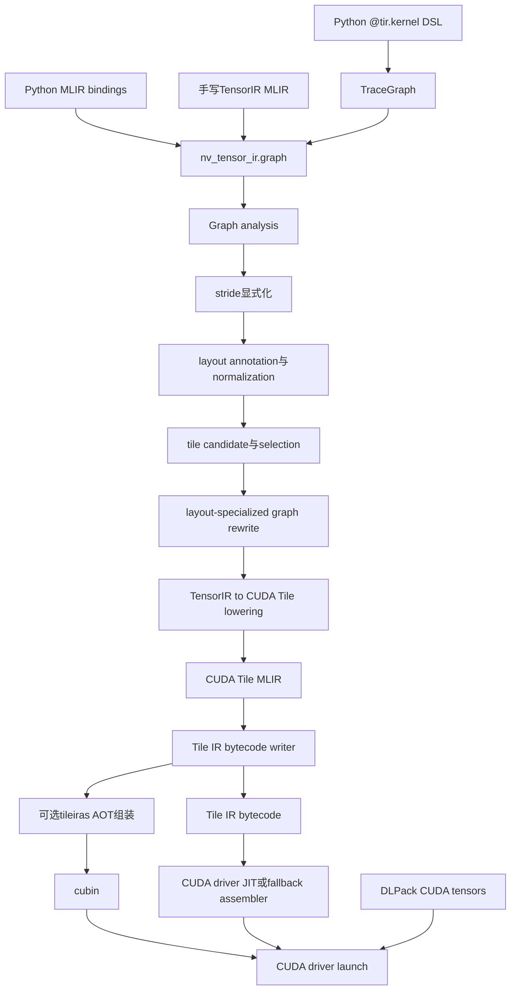
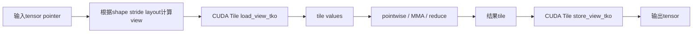

## 1. 先说结论

版本说明：本文分析的是NVIDIA TensorIR `v0.1.0`，该版本于2026-08-17发布。资料主要来自TensorIR官方README、Release Notes、Dialect定义、编译pipeline、Python DSL、runtime和测试代码，以及CUDA Tile IR官方文档。TensorIR处于Early Release阶段，API、性能和硬件支持仍可能快速变化。本文完成了源码级核对，但没有在本机完成CUDA Toolkit 13.3环境下的全量构建和GPU性能测试，因此不会把测试样例能编译等同于生产性能承诺。

如果只用一句话理解TensorIR：

**TensorIR是NVIDIA维护的高层MLIR编译器前端，用张量计算图表达“算什么”，再负责layout传播、iteration space分析、tile选择和单kernel融合，最后把图降低到CUDA Tile IR，由后者表达“怎样以tile方式在NVIDIA GPU上执行”。**

它想填补的是下面这段编译栈中的空白：

```text
PyTorch / JAX / XLA / cuDNN式计算图
             ↓
高层tensor graph：matmul、reduce、activation、shape、stride
             ↓
GPU-aware layout、fusion、tiling决策
             ↓
CUDA Tile IR：tile load/store、MMA、GPU execution structure
             ↓
Tile IR bytecode或cubin
```

TensorIR目前最适合的不是任意神经网络，也不是复杂动态控制流，而是：

1. 静态shape和静态stride。
2. 以pointwise链为主的memory-bound计算。
3. matmul后接bias、activation、residual等epilogue融合。
4. 整个图可以被一个统一iteration space覆盖，并融合为一个kernel。
5. 想研究NVIDIA CUDA Tile编译路径，或者为上层框架开发CUDA专用后端。

当前不应该把它当成：

1. 成熟的Triton替代品。
2. 可直接接入任意PyTorch模型的`torch.compile`后端。
3. 已完成autotuning的高性能算子库。
4. 与Apache TVM TensorIR相同的项目。
5. 生产稳定、保证API兼容和性能上界的编译器。

## 2. 名字容易误导：它不是TVM TensorIR

“TensorIR”这个名字在编译器领域已经有另一个著名含义：Apache TVM的TensorIR。两个项目只是重名，抽象层次和实现完全不同。

| 项目 | 所属生态 | 核心抽象 | 开发者主要控制什么 |
| --- | --- | --- | --- |
| NVIDIA TensorIR | NVIDIA / MLIR / CUDA Tile | 扁平张量计算图 | tensor op、shape、stride、部分tile选项 |
| TVM TensorIR | Apache TVM | loop、block、buffer、schedule | 循环变换、存储层级、线程绑定、schedule |

NVIDIA TensorIR源码里的Dialect命名空间是`nv_tensor_ir`，顶层操作是`nv_tensor_ir.graph`。它不是一个显式循环IR：GraphOp定义中明确写着，这一层没有`loop/for`，iteration会在降低到CUDA Tile时才出现。

所以本文后面的“TensorIR”都指NVIDIA这个仓库。

## 3. 为什么CUDA Tile IR上面还需要TensorIR

CUDA Tile IR已经提供tile类型、tile load/store、MMA、内存层级和GPU相关优化表达，为什么还要增加一层？

原因是上层框架和tile级GPU IR之间仍然隔着很大的语义距离。

一个框架前端通常知道的是：

```text
X = A @ B
Y = gelu(X + bias)
Z = Y + residual
```

但CUDA Tile需要面对的是：

```text
M/N/K分别怎样切tile？
哪个tensor维度在内存中连续？
输入如何load成tile？
matmul使用什么MMA tile？
epilogue是否留在片上？
边界tile怎样处理？
grid有多少个逻辑tile？
动态shape要传哪些size和stride参数？
最后生成Tile IR bytecode还是cubin？
```

如果没有TensorIR，上层框架要么直接生成CUDA Tile IR并自己承担这些决策，要么先经过另一套专用IR。TensorIR的价值就是把这部分公共工作收进一个NVIDIA维护的前端：

1. 保留高层tensor语义，让输入不必过早暴露GPU线程细节。
2. 从整个graph而不是单个op判断能否融合和lower。
3. 用layout provenance分析输入、输出和中间tensor的访问关系。
4. 根据iteration space和访存特征选择tile。
5. 生成CUDA Tile能够直接继续处理的MLIR。
6. 管理Tile IR bytecode、cubin、kernel参数和launch grid。

这也是它和Triton最根本的区别：Triton程序通常已经写出了program ID、block范围和load/store索引；TensorIR输入只描述张量图，编译器承担更多调度责任。

## 4. 它位于整条栈的哪里

下面这张图把项目中已经存在的入口、IR和运行时放到同一条路径上：



仓库交付了四类主要接口：

| 接口 | 用途 |
| --- | --- |
| `tensor_ir-opt` | 运行和调试MLIR pass，观察TensorIR到CUDA Tile的变化 |
| `tensor_ir-compiler` | 编译、dump IR/bytecode、可选launch和reference verify |
| `nv_tensor_ir._mlir` | Python侧注册Dialect、构造或解析MLIR、调用compile API |
| `nv_tensor_ir.dsl` | 用Python表达tensor计算并trace成TensorIR graph |

编译器默认是compile-only。只有显式使用`--launch`或`--verify`时，CLI才会真的启动GPU kernel；`--verify`还会构造reference结果并比较数值。

## 5. TensorIR的核心数据模型

### 5.1 `nv_tensor_ir.graph`是一个扁平图

一个最小的加法图可以写成：

```mlir
module {
  nv_tensor_ir.graph @add(
    %a: tensor<8x8xf32> {nv_tensor_ir.stride = "(8,1)"},
    %b: tensor<8x8xf32> {nv_tensor_ir.stride = "(8,1)"}
  ) -> (tensor<8x8xf32> {nv_tensor_ir.stride = "(8,1)"}) {
    %out = add %a, %b : tensor<8x8xf32>
    results %out : tensor<8x8xf32>
  }
}
```

这里有几个值得注意的设计：

1. GraphOp有函数式签名，但body被定义成无序的flat graph，而不是顺序程序。
2. 图只有一个block，没有高层loop。
3. `results`是terminator，明确图的输出tensor。
4. shape存在MLIR ranked tensor type中。
5. stride以`nv_tensor_ir.stride`属性存在；缺失时pipeline会补成row-major默认值。
6. 一个graph原则上对应一个最终GPU kernel。

源码注释说它的高层图设计来自cuDNN graph。这也解释了为什么它更像“可融合的张量表达式”，而不是手写GPU kernel语言。

### 5.2 shape和stride都是一等信息

只知道shape不够。两个`tensor<8x8xf32>`可能分别是row-major、column-major、transpose view，或者带padding的非连续布局。

TensorIR用字符串形式的stride属性记录元素步长：

```text
shape  = (8, 8)
stride = (8, 1)  # row-major
```

动态stride也可以写成：

```mlir
tensor<?x?xf32> {nv_tensor_ir.stride = "(?,1)"}
```

`?`表示该值要在launch时通过kernel参数提供。固定为`1`的末维stride仍然保留在类型元数据里，使编译器知道该维连续。

### 5.3 三类shape合并语义

Dialect说明中把结果shape关系分成三种策略：

1. **Inherited**：结果维度完全继承来源，静态/动态性质也不改变。
2. **Equal merge**：动态维度可作为未知量被静态值refine，但两个不同静态值不兼容。
3. **Broadcast merge**：在equal merge基础上允许长度为1的维度broadcast。

这类规则看起来琐碎，却是图IR能否可靠做类型推导的基础。编译器不能等到CUDA Tile lowering时才发现两个operand的shape根本无法组合。

### 5.4 layout attribute不是简单的stride数组

layout propagation阶段会生成几种更丰富的来源属性：

| 属性 | 表达内容 |
| --- | --- |
| `TensorSourceAttr` | tensor编号、offset、CuTe layout字符串、动态值映射 |
| `CompositeSourceAttr` | 一个结果同时依赖多个layout source，例如binary pointwise |
| `ConcatSourceAttr` | concatenate维度及多个输入来源 |
| `ReductionSourceAttr` | 原始source和reduction view |
| `MatmulSourceAttr` | LHS、RHS以及逻辑`[B,M,N,K]` view |

因此这里的layout不只是“内存是row-major还是column-major”，还带着provenance：当前结果的每个逻辑维度是从哪个输入、哪段offset、哪种view变换得到的。

## 6. 当前支持哪些操作

`v0.1.0`的Dialect和CUDA Tile前端pre-check覆盖了下面这些类别：

| 类别 | 主要操作 |
| --- | --- |
| 基本pointwise | add、sub、mul、div、mod、rem、max、min、pow、atan2、add_square |
| 数学函数 | abs、ceil、floor、neg、sqrt、rsqrt、exp、log、sin、cos、tan、erf、reciprocal |
| 激活 | ReLU、sigmoid、tanh、GELU、近似GELU、softplus、swish、ELU |
| 比较与逻辑 | cmp、and、or、not、binary_select/where |
| 类型与常量 | convert、constant、splat、iota |
| view与移动 | broadcast、reshape、transpose、slice、concatenate |
| 聚合 | reduce、带自定义region的reduce_ud |
| contraction | matmul |

但是“Dialect里定义了某个op”不等于“任意包含这个op的图都能编译”。TensorIR以整个graph为支持判断单位：

1. op本身必须有lowering。
2. layout propagation必须能建立一致的来源关系。
3. tile analysis必须能为周围的图找到合法schedule。
4. 图不能要求在kernel中间物化一个TensorIR目前无法表示的全局中间tensor。

官方Release Notes专门强调了这一点。

## 7. Python DSL是怎样工作的

### 7.1 它是trace DSL，不是任意Python编译器

一个融合matmul epilogue可以这样写：

```python
import torch
from nv_tensor_ir import dsl as tir


USE_GELU = True


@tir.kernel
def fused_gemm_epilogue(a, b, bias, residual):
    x = a @ b + bias
    if USE_GELU:  # trace时已经确定的静态Python控制流
        x = tir.gelu_approx_tanh(x)
    return x + residual


a = torch.randn((128, 64), device="cuda")
b = torch.randn((64, 128), device="cuda")
bias = torch.randn((128, 128), device="cuda")
residual = torch.randn_like(bias)
output = torch.empty_like(bias)

compiled = tir.compile(
    fused_gemm_epilogue,
    a,
    b,
    bias,
    residual,
    output=output,
    tile_sizes=(64, 64),
)
compiled.run(a, b, bias, residual, output=output)
```

`@tir.kernel`本身只把函数包装成`KernelFunction`。真正compile时会发生：

1. 从输入DLPack tensor或`TensorSpec`提取shape、stride、dtype。
2. 为每个参数创建`TracedTensor`。
3. 实际执行一次Python函数，但operator overload不会计算数据，只会向`TraceGraph`增加节点。
4. 检查返回值数量、shape和dtype是否匹配`output=`元数据。
5. `module_builder`把TraceGraph转换成`nv_tensor_ir.graph` MLIR。
6. Python binding调用C/C++ compiler生成`Program`。
7. `CompiledKernel.run()`把DLPack tensor传给runtime launch。

### 7.2 为什么tensor不能进入Python `if`

如果写：

```python
if x > threshold:
    return a
return b
```

Python需要把`x > threshold`转换成一个`bool`，但它其实代表GPU上的tensor。`TracedTensor.__bool__()`会直接报错，避免trace时误选一个分支。

逐元素选择必须写成：

```python
mask = x > threshold
out = tir.where(mask, a, b)
```

相反，下面的控制流是允许的，因为它在trace时完全静态：

```python
for i in range(3):
    if i == 0:
        x = x + bias
    x = tir.relu(x)
```

最终图里会出现展开后的操作，不会出现Python循环。

### 7.3 不依赖PyTorch分配tensor也能编译

DSL支持`TensorSpec`：

```python
spec = tir.TensorSpec(
    (128, 128),
    dtype=tir.DataType.F32,
    stride=(128, 1),
)
```

它只携带元数据，不分配GPU内存。这样上层编译器可以先生成artifact，实际运行时再提供兼容的DLPack tensor。

当前DSL dtype包括：

```text
i1
f16 / bf16 / f32 / f64
si8 / si16 / si32 / si64
ui8 / ui16 / ui32 / ui64
```

具体op并不一定支持所有dtype组合，仍要看op verifier和CUDA Tile lowering。

## 8. 也可以绕过DSL直接构造MLIR

Python DSL只是方便入口，不是唯一入口。更底层的方式是使用`nv_tensor_ir._mlir`：

```python
import torch
from nv_tensor_ir._mlir import ir
from nv_tensor_ir._mlir.dialects import nv_tensor_ir


mlir_text = r"""
module {
  nv_tensor_ir.graph @add_op(
    %a: tensor<8x8xf32> {nv_tensor_ir.stride = "(8,1)"},
    %b: tensor<8x8xf32> {nv_tensor_ir.stride = "(8,1)"}
  ) -> (tensor<8x8xf32> {nv_tensor_ir.stride = "(8,1)"}) {
    %out = add %a, %b : tensor<8x8xf32>
    results %out : tensor<8x8xf32>
  }
}
"""

with ir.Context() as ctx, ir.Location.unknown(ctx):
    nv_tensor_ir.register_dialect(ctx, load=True)
    module = ir.Module.parse(mlir_text)

    options = nv_tensor_ir.CompileOptions()
    options.tile_sizes = [8, 8]

    assert nv_tensor_ir.can_compile(module, options=options)
    with nv_tensor_ir.compile(module, options=options) as program:
        a = torch.randn((8, 8), device="cuda")
        b = torch.randn((8, 8), device="cuda")
        out = torch.empty_like(a)
        program.launch(a, b, out)
```

这个入口更适合：

1. 上层框架已经有MLIR基础设施。
2. 需要精确控制TensorIR属性。
3. 调试某个lowering或pass。
4. 生成DSL暂时无法表达的`reduce_ud`等结构。

## 9. 完整编译pipeline

默认`layout-propagation`路径可以概括为：

```mermaid
flowchart LR
    A[TensorIR graph] --> B[MaterializeDefaultStrides]
    B --> C[LayoutPropagationAnnotation]
    C --> D[LayoutPropagationNormalization]
    D --> E[TileAnalyzer]
    E --> F[GraphSplitting]
    F --> G[TileSelection]
    G --> H[TensorToCudaTileConversion]
    H --> I[Canonicalizer]
    I --> J[CSE]
    J --> K[CUDA Tile module]
```



源码中的实际阶段顺序是先完成graph analysis，其中包含annotation、normalization、TileAnalyzer和GraphSplitting；随后单独运行TileSelection；最后做conversion、canonicalize和CSE。把这些pass按逻辑作用逐个展开，可以更容易理解编译器在决定什么。

## 10. 第一步：把默认stride显式化

如果graph参数没有写stride，`MaterializeDefaultStridesPass`会按照row-major规则补全。

例如shape为`[2, 3, 4]`：

```text
stride[2] = 1
stride[1] = 4
stride[0] = 3 * 4 = 12

最终stride = [12, 4, 1]
```

这样后续pass不必在每个调用点重复猜测默认布局。它也建立了一条重要约定：

**进入layout分析以后，stride缺失不再表示“未知”，而是已经被规范化为显式row-major布局。**

动态shape例外更复杂。如果shape中的动态维度会让默认stride也变成动态值，pass不能凭空生成静态stride，只能保留需要运行时提供的信息。

## 11. Layout propagation：把访问来源沿图传播

### 11.1 为什么仅看每个op不够

考虑：

```text
A --transpose--+
               +--add--relu--output
B -------------+
```

`add`在数学上只是逐元素相加，但要把它lower成一个高效tile kernel，编译器还需要知道：

1. `A`经过transpose后，输出iteration space的每个维度对应`A`哪个维度。
2. `B`是否和transpose结果有相同layout。
3. 两边load能否使用同一个tile shape。
4. 哪个维度连续，哪个load可能跨步。
5. 最终store的输出stride是什么。

`LayoutPropagationAnnotationPass`按SSA依赖向前走，为每个结果生成带来源的layout attribute。pointwise op会组合operand sources；transpose、reshape、slice等op改变source view；constant和splat则创建没有真实输入tensor的source。

### 11.2 Normalization建立共同iteration space

随后`LayoutPropagationNormalizationPass`给graph输出以及会改变iteration space的操作增加`iteration_space`属性，特别是：

1. reduction。
2. matmul。
3. graph output。

可以把它理解成：前一阶段回答“每个value来自哪里”，normalization进一步回答“最终kernel要遍历的逻辑坐标系是什么”。

对纯pointwise图，iteration space通常接近输出shape。对matmul，它要区分M、N、K和可选batch维；对reduction，它要区分输出维和被归约维。

## 12. TileAnalyzer和TileSelection到底做什么

### 12.1 tile不是thread block大小的同义词

在TensorIR里，tile首先表示逻辑iteration space的一块。例如对`[1024, 1024]`输出选择`[1, 128]`，表示一个逻辑工作单元覆盖一行中的128个元素。

CUDA Tile后端还会决定这块tile怎样映射到更底层执行结构，所以不能简单理解为：

```text
tile elements == CUDA threads
```

源码中的旧baseline heuristic甚至明确写着，编译器可以让每个thread处理多个element。

### 12.2 候选生成看哪些信息

新的`TileCandidateGenerator`会读取：

1. 公共iteration space shape。
2. 每个输入和输出source的stride。
3. 各source元素字节数。
4. 固定tile维约束，例如concatenate维可能强制为1。
5. GPU compute capability、SM数量、warp size和cache line等架构参数。

候选评分关注的因素包括：

1. 不同operand在各维的byte-weighted traffic。
2. stride为1的连续访问维度。
3. cache-line覆盖与访存连续性代理指标。
4. tile element数量和线程块候选。
5. shared-memory footprint是否超过目标GPU容量。
6. 是否为较小tensor保留足够并行tile。

这不是成熟autotuner。它是在编译期用静态信息打分，不会自动生成大量kernel在目标机器上benchmark后选择最快版本。

### 12.3 tile来源有明确优先级

`TileSelectionPass`按以下顺序选择最终tile：

1. compile/pass option显式提供的`tile_size`，优先级最高。
2. GraphOp已经携带的`tile_size`属性。
3. TileAnalyzer生成的`tile_candidates[0]`。

如果candidate generator没有得到合法候选，TileAnalyzer会合成保守fallback：

1. 静态维选择不超过128的2次幂。
2. 动态维默认使用128。
3. 固定约束维覆盖上述结果。

选择后还会验证：

1. tile rank和iteration space rank相同。
2. 静态维上的tile是2次幂。
3. tile没有超过合法维度边界。

动态维无法在compile时完成逐维上界验证，因此这部分会跳过，留到运行期shape决定实际grid。

### 12.4 当前heuristic的现实边界

源码和Release Notes共同表明：

1. pointwise是目前heuristic重点优化的场景。
2. reduction和contraction缺少成熟tile heuristic。
3. reduction tile size需要用户显式选择，且必须是正的2次幂。
4. 选择出合法tile不代表选择了性能最优tile。
5. 官方明确不把`v0.1.0`性能当作production commitment。

## 13. 名字容易误解的GraphSplitting

`GraphSplittingPass`并不是把一个TensorIR graph切成多个GPU kernel。

它做的是：当一个SSA value被多条路径以不同layout消费时，按`(operation, iteration-space-id, layout)`克隆其定义，把reconvergent DAG改写成layout-specialized tree。

例如：

```text
        ┌─ consumer A：需要原始layout
value ──┤
        └─ consumer B：需要transpose后的layout
```

如果强迫两条路径共享完全相同的中间表示，后续lowering可能不知道应该按哪种tile view生成。GraphSplitting会为不同layout需求物化不同版本：

```text
value(layout A) ── consumer A
value(layout B) ── consumer B
```

它的缓存key包含原operation、iteration space id和layout，避免相同需求被重复clone。

这仍然服务于“一张graph生成一个kernel”的目标。它是IR内部的layout specialization，不是kernel partitioner。这个区别很重要，因为官方Release Notes建议在无法统一iteration space时由用户或上层系统拆成多个graph；当前TensorIR不会自动把所有复杂图切成一串带全局中间tensor的kernel。

## 14. TensorIR怎样lower到CUDA Tile

### 14.1 GraphOp变成CUDA Tile entry

layout-propagation lowering启动时会：

1. 读取已经验证的`iteration_space`和`tile_size`。
2. 为graph input/output构造tensor descriptor。
3. 创建`cuda_tile::EntryOp`。
4. 创建`GetTileBlockIdOp`获得当前逻辑tile编号。
5. 把线性tile编号解码为多维iteration space坐标。
6. 对每个输入按layout source生成tile load。
7. 在tile值上执行pointwise、MMA、reduce等操作。
8. 按输出descriptor生成tile store。
9. 用`cuda_tile::ReturnOp`结束entry。

简化数据路径如下：



### 14.2 pointwise为什么容易融合

对pointwise链：

```text
out = gelu((a + b) * scale) + residual
```

输入tile只需要load一次，中间`add`、`mul`、`gelu`的结果都可以继续保留为CUDA Tile SSA value，最后只store一次输出。理论上的全局内存流量从多个kernel的：

```text
load a,b -> store temp1
load temp1,scale -> store temp2
load temp2 -> store temp3
load temp3,residual -> store out
```

变成：

```text
load a,b,scale,residual -> tile内连续计算 -> store out
```

这就是TensorIR当前优先优化memory-bound pointwise graph的原因：收益路径清楚，iteration space也容易统一。

### 14.3 matmul lowering

matmul会根据输入dtype选择CUDA Tile的浮点或整数MMA操作：

```text
floating point -> cuda_tile::MmaFOp
integer        -> cuda_tile::MmaIOp
```

matmul之后的pointwise epilogue仍然可以消费MMA结果tile，从而实现matmul、scale、bias、activation等融合。

但matmul存在contracting K维，tile选择、循环和片上资源管理比纯pointwise复杂。`v0.1.0`官方说明要求用户对contraction相关tile进行选择和实测，不能假定默认heuristic已经完成广泛调优。

## 15. 两条codegen strategy

TensorIR提供两条降低路径：

| 策略 | 默认 | 主要思路 | 当前使用提示 |
| --- | --- | --- | --- |
| `layout-propagation` | 是 | 传播layout来源，normalize iteration space，选择tile，再按layout source生成load/store | 静态shape、pointwise融合的主路径 |
| `affine-map` | 否 | 发现iteration-space map，用affine关系计算坐标、load/store和tiler loop | 动态matmul当前要求使用这条路径 |

CLI选择方式：

```bash
tensor_ir-compiler input.mlir \
  --codegen-strategy=layout-propagation
```

Python DSL中动态matmul要显式配置：

```python
options = tir.CompileOptions()
options.codegen_strategy = tir.CodegenStrategy.AffineMap
options.tile_sizes = [8, 16]

compiled = tir.compile(
    dynamic_matmul_kernel,
    lhs,
    rhs,
    output=output,
    options=options,
    dynamic_shape=True,
)
```

这两条路径当前不是完全等价的可互换实现。遇到某个graph在一条路径失败时，也不能直接推断另一条一定支持；需要结合op、shape和测试范围判断。

## 16. 从CUDA Tile MLIR到最终artifact

lowering结束后，编译器从module中提取唯一的`cuda_tile.module`和唯一entry，然后调用CUDA Tile bytecode writer。

最终artifact有两种：

### 16.1 Tile IR bytecode

默认产物是Tile IR bytecode：

```text
TensorIR MLIR
  -> CUDA Tile MLIR
  -> Tile IR bytecode
  -> CUDA driver加载并JIT
```

优点是保留一定的目标兼容性，让driver在实际设备上完成后续处理。编译器默认bytecode target是：

```text
max(CUDA Tile compatibility version, 13.3)
```

也可以显式选择`current`或`compatibility`。

### 16.2 cubin

如果设置artifact kind为cubin，编译器会尝试调用可用的Tile IR assembler进行AOT组装：

```text
Tile IR bytecode -> tileiras -> cubin
```

cubin要求architecture-conditional target，例如`sm_100a`，因为它必须绑定精确架构。若assembler不可用，相关路径可能回退到Tile IR bytecode，具体行为取决于编译和运行环境。

### 16.3 `sm_100`、`sm_100f`和`sm_100a`

TensorIR把target分成三种portability：

| 后缀 | 含义 | 兼容范围 |
| --- | --- | --- |
| 无后缀，如`sm_100` | portable baseline | 同级或更新兼容架构 |
| `f`，如`sm_100f` | family portable | 同一GPU family内满足条件的架构 |
| `a`，如`sm_100a` | architecture conditional | 必须精确匹配该compute capability |

CLI默认是`sm_100f`，也就是面向SM100 family的family-portable目标。源码识别的compute capability集合从SM80到SM121，但某个具体graph、bytecode版本和CUDA Tile feature能否在目标GPU运行，仍取决于lowering和CUDA环境，不能只看枚举里有没有该SM。

## 17. Runtime怎样launch kernel

### 17.1 DLPack是Python tensor边界

Python runtime不要求输入一定是PyTorch tensor，而是要求它们提供DLPack接口，并且实际内存必须能被CUDA访问。

TensorIR从DLPack读取：

1. data pointer。
2. shape。
3. stride。
4. dtype。

但README和runtime源码都提醒：当前不会在launch前验证所有实参是否和编译signature严格一致。`CudaTileRuntimeKernel::checkSupport()`仍然有“验证参数匹配kernel signature”的TODO。

这意味着调用者必须保证：

1. tensor数量正确。
2. dtype正确。
3. shape和stride符合编译假设。
4. tensor位于兼容CUDA设备。
5. output已经分配，而且大小足够。

否则错误可能直到driver launch才暴露，甚至造成未定义的计算结果。

### 17.2 静态和动态shape使用不同参数打包策略

静态shape时，kernel signature通常只需要data pointer：

```text
[ptr_a, ptr_b, ptr_out]
```

runtime使用`PointerOnlyArgPacker`。

动态shape或uniform signature时，需要额外参数：

```text
[ptr]
[dynamic sizes...]
[dynamic strides...]
```

runtime使用`FlatArgPacker`，根据compile阶段生成的`KernelArgLayout`决定哪些size/stride进入参数列表。

`--uniform-signature`会让静态size和stride也进入kernel参数，从而让不同shape模式拥有更统一的ABI，但会增加参数数量。

### 17.3 grid怎样计算

静态shape可以在compile时得到固定grid：

```text
grid[i] = ceil(iteration_space_shape[i] / tile_size[i])
```

各维最终会被压平成CUDA grid维度。

动态shape则由`TileBasedGridComputer`在launch时读取实际shape并计算tile数量。源码当前把所有逻辑维度的tile数相乘放进`grid.x`：

$$
\mathrm{grid.x}=\prod_i\left\lceil\frac{\mathrm{shape}_i}{\mathrm{tile}_i}\right\rceil
$$

然后kernel内部再把线性tile ID解码为多维坐标。

## 18. 动态shape支持到了哪里

TensorIR的MLIR层和runtime已经有动态shape基础设施：

1. ranked tensor维度可以是`?`。
2. stride属性可以包含`?`。
3. compile阶段生成动态kernel arg layout。
4. runtime打包size/stride。
5. launch时按实际shape计算grid。

一个动态加法图：

```mlir
module {
  nv_tensor_ir.graph @add_dynamic_shape(
    %a: tensor<?x?xf32> {nv_tensor_ir.stride = "(?,1)"},
    %b: tensor<?x?xf32> {nv_tensor_ir.stride = "(?,1)"}
  ) -> (tensor<?x?xf32> {nv_tensor_ir.stride = "(?,1)"}) {
    %out = add %a, %b : tensor<?x?xf32>
    results %out : tensor<?x?xf32>
  }
}
```

CLI运行时提供具体值：

```bash
build/bin/tensor_ir-compiler \
  test/Integration/Compiler/add_dynamic.mlir \
  --dynamic-dims=16,8 \
  --dynamic-strides=8 \
  --tile-size=8x8 \
  --verify
```

但Python DSL当前主动限制`dynamic_shape=True`可使用的图：

1. 允许input、output、constant、splat。
2. 允许pointwise、convert、cmp、select。
3. 允许matmul，但动态matmul要求AffineMap。
4. movement op目前只放行transpose。
5. reshape等操作会被DSL拒绝。

而且官方Release Notes明确说，当前不建议用户重点探索动态shape程序。这意味着“代码里有动态shape测试”与“动态shape已经是推荐路径”不能混为一谈。

## 19. 一个graph为什么强调一个kernel

TensorIR的融合单元是`nv_tensor_ir.graph`。编译器尝试为整个graph找到一套tile和执行结构，不在中间把tensor写回全局内存再启动下一个kernel。

优点是：

1. 避免中间tensor分配。
2. 减少HBM读写。
3. 减少kernel launch overhead。
4. matmul/reduction结果可以直接进入epilogue。

代价是：

1. 整个graph需要相容的iteration space。
2. 某个reshape或concatenate可能让前后tile坐标关系无法统一。
3. 片上live tile太多时会产生资源压力。
4. 当前编译器没有通用的多kernel partition和中间buffer规划来兜底。

官方建议是：如果复杂操作无法放进同一个iteration space，就由上层把程序拆成多个TensorIR graph，接受多个kernel和中间结果。

## 20. 为什么reshape和concatenate容易成为边界

### 20.1 reshape改变维度与tile的对应关系

假设：

```text
[M, N] -> reshape -> [M*N/4, 4]
```

在数学上元素顺序不变，但前后graph对“第0维tile”和“第1维tile”的理解已经不同。如果reshape前后还有不同pointwise分支，编译器很难用一个统一iteration space覆盖所有访问。

因此内部reshape可能阻断tiling。放在graph输入或输出边界通常更容易处理，因为中间不需要同时满足两套消费者布局。

### 20.2 concatenate需要在不同来源之间切换

concat输出的一块tile可能跨越两个输入tensor的边界。当前lowering主要依赖tile-based load view，尚未具备用更一般的pointer-based load轻松拼装任意跨界tile的能力。

源码还会把concat相关维度的tile固定为1来降低复杂度，这虽然提高可lower概率，却可能影响性能。

所以Release Notes建议避免把concat放在graph内部关键路径；更广泛的pointer-based load支持仍在开发中。

## 21. 怎样构建和试用

### 21.1 环境要求

`v0.1.0` README给出的主要要求是：

| 组件 | 要求 |
| --- | --- |
| CMake | 3.20或更新 |
| C++ | C++17编译器 |
| Python | 3.10或更新 |
| Build system | Ninja |
| CUDA Toolkit | 默认compiler/test流程要求13.3或更新 |
| Python binding | Python headers、nanobind 2.9或更新 |
| 测试示例 | pytest、PyTorch，官方验证版本为pytest 8.3.4和PyTorch 2.10 |

对compatibility bytecode支持的kernel，可以用CUDA Toolkit 13.1并传`--bytecode-version=compatibility`，但这不等于所有默认测试都能在13.1通过。

### 21.2 默认构建会拉取大依赖

TensorIR固定了CUDA Tile、LLVM和DLPack commit。作为顶层工程构建时，`TENSOR_IR_DOWNLOAD_LLVM`默认开启，因此CMake可能下载并构建匹配版本的LLVM/MLIR。

基础命令：

```bash
cmake -S . -B build -G Ninja \
  -DCMAKE_BUILD_TYPE=Release

cmake --build build \
  --target tensor_ir-compiler tensor_ir-opt tensor_ir_python_bindings \
  --parallel 32
```

如果已经有兼容的LLVM/MLIR安装：

```bash
cmake -S . -B build -G Ninja \
  -DCMAKE_BUILD_TYPE=Release \
  -DTENSOR_IR_DOWNLOAD_LLVM=OFF \
  -DMLIR_DIR=/path/to/llvm/lib/cmake/mlir
```

这里的“兼容”不能只看LLVM大版本。CUDA Tile和TensorIR固定到具体commit，MLIR C++ API变化又很快，最好使用仓库pin的revision。

### 21.3 使用build tree中的Python package

```bash
export PYTHONPATH="$PWD/build/python_packages:$PYTHONPATH"
python -c 'from nv_tensor_ir import dsl as tir; print(tir.DataType.F32)'
```

这不是普通`pip install tensor-ir`流程。Python package由CMake组装，并包含nanobind native extension和MLIR Python binding。

## 22. 调试编译pipeline

### 22.1 编译一个静态matmul

```bash
build/bin/tensor_ir-compiler \
  test/Integration/Compiler/matmul_8x8x8.mlir \
  --verbose \
  --print-ir-after-all
```

### 22.2 把每个pass后的IR写到目录

```bash
build/bin/tensor_ir-compiler input.mlir \
  --print-ir-tree-dir=/tmp/tensor-ir-passes \
  --timing
```

`--print-ir-tree-dir`优先于`--print-ir-after-all`。这种方式特别适合观察：

1. stride何时被补全。
2. 每个op获得了什么layout。
3. graph上生成了哪些tile candidates。
4. GraphSplitting克隆了哪些op。
5. TensorIR op怎样被替换为CUDA Tile op。

### 22.3 dump CUDA Tile和bytecode

```bash
build/bin/tensor_ir-compiler input.mlir \
  --dump-ir=/tmp/lowered-cuda-tile.mlir \
  --dump-tileir-bc=/tmp/kernel.tileir \
  --dump-artifact=/tmp/kernel.bin
```

### 22.4 运行测试

```bash
cmake --build build --target check-tensor-ir
```

官方smoke tests会launch kernel，因此需要兼容的NVIDIA GPU、driver和CUDA环境，不是纯CPU单元测试集合。

仓库在`v0.1.0`中有约147个`test/`文件，覆盖Dialect verifier、canonicalization、layout transform、TensorIR-to-CUDA-Tile conversion、CLI、Python DSL和runtime。但公开历史非常新，测试数量不能替代广泛硬件和真实workload验证。

## 23. 与相邻项目怎样区分

| 项目 | 输入抽象 | 调度控制者 | 输出/目标 | 更适合 |
| --- | --- | --- | --- | --- |
| NVIDIA TensorIR | 高层tensor graph | 编译器为主，用户可给tile hint | CUDA Tile IR | 框架后端、graph fusion、CUDA Tile前端研究 |
| CUDA Tile IR | tile级MLIR | 前端和后端共同决定 | Tile IR bytecode/cubin | GPU tile compiler基础设施 |
| Triton | Python block/SPMD program | kernel作者显式写program ID和索引，编译器lower | GPU code | 独立高性能kernel开发 |
| CuTe DSL | Python中的CuTe布局与CUDA kernel表达 | kernel作者高度控制layout、copy、MMA | CUDA kernel | NVIDIA硬件专家级kernel |
| TileLang | tile DSL和compiler | 作者写tile primitive，编译器做lower/autotune | 多种后端 | AI kernel开发与调优 |
| TVM TensorIR | loop/block/buffer IR | schedule显式变换 | 多后端 | 通用tensor compiler和schedule研究 |
| XLA HLO/StableHLO | 框架级张量程序 | XLA后端 | CPU/GPU/TPU等 | JAX/TensorFlow等整图编译 |

TensorIR源码里为`canCompile`保留了XLA integration contract注释，说明它至少考虑了作为XLA一类上层系统的轻量能力查询接口。但当前仓库没有交付完整的JAX、PyTorch或XLA端到端集成，因此不能把“为集成保留接口”写成“已经可以直接接入”。

## 24. 哪些场景值得尝试

### 24.1 值得尝试

1. **静态pointwise fusion**：多层activation、scale、bias、residual、comparison和where。
2. **matmul epilogue**：matmul后直接接neg、scale、bias、GELU等。
3. **研究CUDA Tile前端**：需要一个比手写CUDA Tile更高层的测试入口。
4. **开发框架compiler backend**：上层能生成受限tensor graph，并愿意在失败时fallback。
5. **研究layout-aware tiling**：关注stride、broadcast、transpose怎样影响tile选择。

### 24.2 当前不适合

1. 任意PyTorch模型一键编译。
2. 大量动态reshape、concat和数据相关控制流。
3. 需要成熟autotuning和跨硬件稳定性能的生产kernel。
4. 依赖自动多kernel partition的大计算图。
5. 需要稳定Python wheel、宽松CUDA版本和简单安装体验的用户。
6. 需要社区直接提交patch的团队：项目当前明确不接受外部贡献，只鼓励提交issue和反馈。

## 25. 当前版本最需要警惕的限制

### 25.1 Early Release不是措辞谦虚

README明确写着：该版本用于让社区评估API和开发方向，不代表performance benchmark或production commitment。

### 25.2 `canCompile`只是静态pre-check

前端`canCompile`主要检查：

1. module里恰好有一个受支持GraphOp。
2. graph中所有op在允许列表。
3. CTA、warp、candidate等基础选项合法。

它不会完整执行所有layout、tile和conversion pass。因此`can_compile(module) == True`不保证后续compile一定成功。

### 25.3 支持某个op不等于支持任意组合

整图iteration space和layout才是关键。reshape、concat、reconvergent layout、动态维等都可能让组合失败。

### 25.4 runtime参数检查仍不完整

当前调用者要自己保证DLPack tensor和compiled signature一致。对外封装时最好增加shape、dtype、device和stride检查，而不是直接把任意tensor传给`Program.launch()`。

### 25.5 reduction和matmul仍需人工调优

合法tile只说明能lower，不说明高性能。Release Notes要求用户为reduction/contraction显式提供相关tile并benchmark。

### 25.6 API与兼容性没有承诺

`SUPPORT.md`明确说没有SLA、响应时间和向后兼容保证。当前又只有首个公开release，集成时应固定commit，而不是无约束跟随`main`。

## 26. 从源码入手应该先看哪些目录

| 路径 | 作用 |
| --- | --- |
| `include/tensor_ir/Dialect/` | TensorIR op、type、attribute、interface的TableGen定义 |
| `lib/Dialect/` | verifier、canonicalization和layout推导实现 |
| `lib/Analysis/` | TileAnalyzer、TileCandidateGenerator和kernel arg layout |
| `lib/Transform/` | stride、layout、iteration space、graph splitting、tile selection pass |
| `lib/Conversion/TensorToCudaTile/` | 两条TensorIR到CUDA Tile lowering路径 |
| `lib/Compiler/CudaTile/` | frontend pipeline、bytecode、cubin和compiler backend |
| `lib/Runtime/` | CUDA module加载、参数打包、grid计算和launch |
| `python/src/nv_tensor_ir/dsl/` | Python tracing DSL、TensorSpec和MLIR module builder |
| `python/bindings/` | nanobind和MLIR Python extension |
| `tools/tensor_ir-opt/` | MLIR pass调试工具 |
| `tools/tensor_ir-compiler/` | 编译、launch、verify CLI |
| `test/Integration/Compiler/` | 最容易直接运行和理解的MLIR样例 |

推荐阅读顺序：

```text
README
  -> TensorOps.td
  -> Python DSL tracing/module_builder
  -> Pipelines.cpp
  -> LayoutAnnotation与TileAnalyzerPass
  -> LayoutPropagationImpl/AffineMapImpl
  -> CudaTileCompiler
  -> Runtime launch helpers
  -> Integration tests
```

## 27. 我对项目路线的判断

下面三点是基于代码边界和接口命名的判断，不是NVIDIA已经宣布的产品承诺。

### 27.1 它可能成为CUDA Tile的标准高层入口之一

CUDA Tile IR足够底层，框架直接生成它的成本较高。TensorIR如果能稳定住op语义、layout contract和compile API，就有机会成为上层框架接入CUDA Tile的公共桥梁。

### 27.2 真正竞争力在graph-level layout与fusion

单个add或relu的lowering并不稀缺。更有价值的是让matmul、broadcast、activation、residual共享tile和中间值，并在整图范围判断layout是否相容。

### 27.3 autotuning和fallback决定它能否走向生产

生产compiler不能只回答“这个图理论上能lower”，还要回答：

1. 哪个tile在目标GPU和shape上最快。
2. compile成本是否可控。
3. 动态shape怎样分bucket和cache artifact。
4. 失败时怎样自动拆图或fallback到其他backend。
5. 不同CUDA、driver和GPU组合怎样发布与验证。

`v0.1.0`已经把IR、pipeline和runtime骨架公开出来，但这些生产问题仍是后续成熟度的关键。

## 28. 总结

NVIDIA TensorIR不是一个新的底层CUDA编程语言，而是一层高于CUDA Tile IR的tensor graph compiler frontend。

理解它可以抓住五个关键词：

1. **Flat graph**：顶层只有张量图，没有显式loop和GPU线程结构。
2. **Layout provenance**：不仅记录stride，还传播tensor来源和view关系。
3. **One graph, one kernel**：尽量把整张图融合为一个CUDA Tile entry。
4. **Compiler-selected tile**：用户可以给hint，但默认由分析和heuristic选择。
5. **Early Release**：当前最佳场景是静态、memory-bound、可统一iteration space的图，离通用生产compiler仍有距离。

如果目标是手写和精调一个独立GPU kernel，Triton、CuTe DSL或TileLang目前通常更直接；如果目标是研究一个上层tensor graph怎样自动lower到NVIDIA的tile级编译基础设施，TensorIR则提供了一个非常值得跟踪的新入口。

## 参考资料

1. [NVIDIA TensorIR GitHub](https://github.com/NVIDIA/tensor-ir)
2. [TensorIR v0.1.0 Release Notes](https://github.com/NVIDIA/tensor-ir/releases/tag/v0.1.0)
3. [TensorIR README](https://github.com/NVIDIA/tensor-ir/blob/main/README.md)
4. [TensorIR Dialect定义](https://github.com/NVIDIA/tensor-ir/tree/main/include/tensor_ir/Dialect)
5. [TensorIR operation定义](https://github.com/NVIDIA/tensor-ir/blob/main/include/tensor_ir/Dialect/TensorOps.td)
6. [TensorIR compiler pipeline](https://github.com/NVIDIA/tensor-ir/blob/main/lib/Compiler/CudaTile/Pipelines.cpp)
7. [Layout和tile transform](https://github.com/NVIDIA/tensor-ir/tree/main/lib/Transform)
8. [TensorIR到CUDA Tile lowering](https://github.com/NVIDIA/tensor-ir/tree/main/lib/Conversion/TensorToCudaTile)
9. [TensorIR Python DSL](https://github.com/NVIDIA/tensor-ir/tree/main/python/src/nv_tensor_ir/dsl)
10. [TensorIR integration tests](https://github.com/NVIDIA/tensor-ir/tree/main/test/Integration/Compiler)
11. [NVIDIA CUDA Tile IR GitHub](https://github.com/NVIDIA/cuda-tile)
12. [CUDA Tile IR Specification](https://docs.nvidia.com/cuda/tile-ir/13.1/index.html)
13. [MLIR官方文档](https://mlir.llvm.org/)
