## 1. 先说结论

版本说明：本文参考的是2026-05-15访问的`kvcache-ai/Mooncake`官方仓库、Mooncake FAST 2025论文、Mooncake官方文档、PyPI上的`mooncake-transfer-engine`发布页，以及本机`/home/gentle/projects/my_rust/vllm`里的`MooncakeConnector`源码。PyPI显示`mooncake-transfer-engine`当前最新版本是`0.3.10.post2`，发布时间是2026-04-22；本地临时克隆的Mooncake仓库HEAD是`377dcba3fb0ce47ecf1f7643e36b66476d47c6ad`，日期为2026-05-15。

PD分离，也就是Prefill/Decode disaggregation，解决的不是“把一个服务拆成两个服务”这么简单，而是LLM推理里两个阶段资源画像完全不同的问题：

1. **Prefill**：一次性处理prompt，矩阵计算密集，长上下文时非常重，主要影响TTFT，也就是time to first token。
2. **Decode**：每次生成一个token，持续读取历史KV cache，小步迭代，batch形态和显存驻留更重要，主要影响TBT，也就是time between tokens。

如果P和D混在同一个GPU worker里，长prompt的prefill会打断decode批次，使用户看到输出卡顿；如果拆开，prefill集群可以专门吞长上下文，decode集群可以专门维持稳定的逐token生成。

Mooncake的关键观点更进一步：

**真正值得中心化管理的不是请求本身，而是KVCache。**

Mooncake把P/D分离、全局KVCache池、KVCache-aware调度、高速Transfer Engine组合在一起。论文里的实验结论很强：在真实trace下，Mooncake相对baseline的effective request capacity提升为59%到498%；生产部署中，Kimi在A800和H800集群上相对旧系统分别多处理115%和107%的请求。这个收益主要来自三件事：

1. P/D分离降低prefill对decode的干扰，改善TBT。
2. 全局KVCache池把本来分散在单机HBM/DRAM里的prefix cache变成跨实例可复用资源，减少重复prefill计算。
3. Transfer Engine用RDMA、多NIC聚合、拓扑感知路径选择，把“跨节点搬KV”这件事做得足够快，尽量把传输隐藏在计算后面。

但PD分离不是免费午餐。它引入了KV传输、跨节点元数据、请求双边协议、故障回收、P/D比例选择、缓存副本管理等新复杂度。Mooncake论文也明确显示，网络带宽低于约100Gbps时，传输时间会明显拖累TTFT。因此，它更适合长上下文、高prefix复用、高SLO压力、具备RDMA/高速网络的大规模推理集群；对短请求、小规模单机、网络慢或工程团队还没准备好维护复杂控制面的场景，收益可能不够覆盖复杂度。

## 2. PD分离到底分离了什么

一个decoder-only Transformer请求可以抽象成两段：

```text
prefill(prompt tokens):
  一次性处理全部输入token
  生成每层每个token的K/V
  写入KV cache

decode(output tokens):
  每轮处理最新生成的1个token
  读取历史KV cache
  追加新token的K/V
  输出下一个token
```

如果画成请求生命周期：

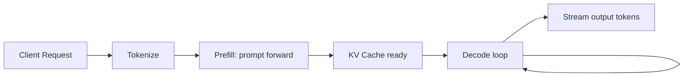

传统coupled serving里，P和D在同一组worker里执行：

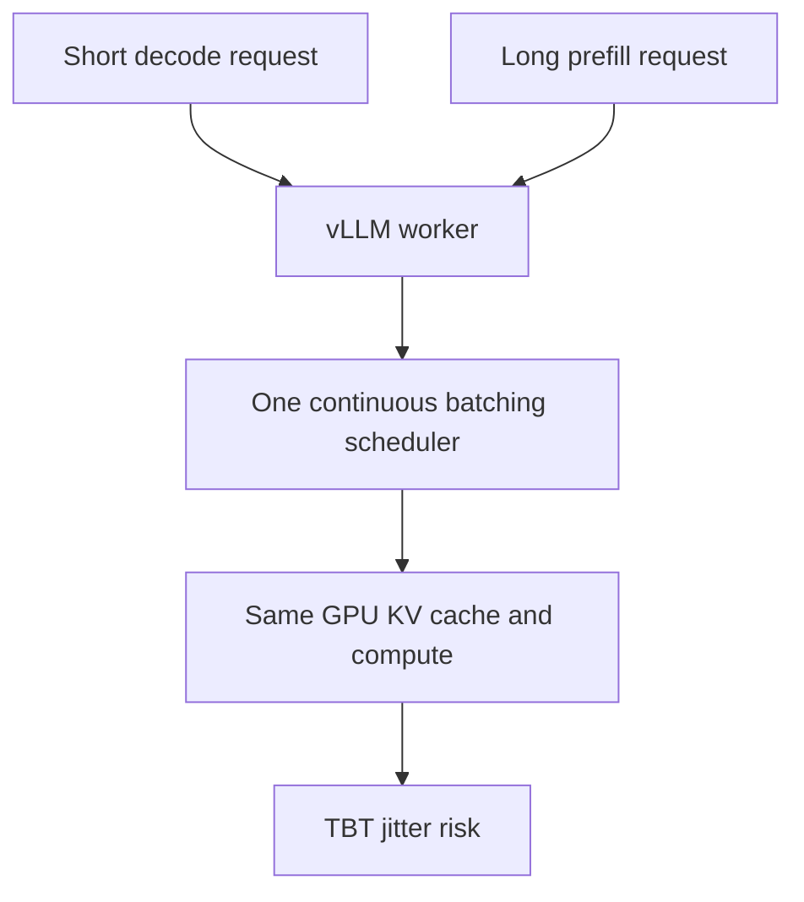

PD分离则把两类worker拆开：

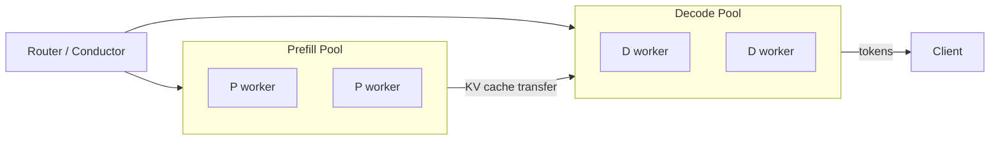

这里的“分离”至少有四层含义：

1. **计算阶段分离**：prefill forward和decode loop不再竞争同一个迭代调度器。
2. **资源池分离**：P池可以偏向高MFU、大batch、长上下文并行；D池可以偏向低TBT、持续batch、KV驻留。
3. **调度目标分离**：P侧主要看TTFT、prefix命中、排队时间；D侧主要看TBT、活跃序列数、KV容量。
4. **数据面分离**：P算出的KV必须通过Transfer Engine、NIXL、NCCL/Gloo、TCP、RDMA或外部KV store搬到D。

## 3. 为什么Prefill和Decode天然不一样

Prefill的主要计算来自一次性处理长度为$n$的输入序列。粗略看，长上下文prefill的计算和显存写入都很重：

$$
\mathrm{PrefillCost}
\approx
O(n^2) \text{ attention部分}
+
O(n) \text{ MLP和投影部分}
$$

Decode每步只处理新token，但每一步要读历史KV：

$$
\mathrm{DecodeStepCost}
\approx
O(t) \text{ attention读历史KV}
+
O(1) \text{ 新token前向}
$$

其中$t$是当前上下文长度。Decode的难点不是单步FLOPS巨大，而是它要稳定地一轮一轮执行。如果某一轮被长prefill挤占，用户就会看到token间隔变长。

可以把两者对比成这样：

| 维度 | Prefill | Decode |
|---|---|---|
| 输入形态 | 一次处理整段prompt | 每轮处理1个新token |
| 主要SLO | TTFT | TBT / TPOT |
| 计算形态 | 大矩阵、吞吐友好 | 小步迭代、延迟敏感 |
| batch偏好 | 大batch提升MFU | 连续batch保持稳定 |
| KV行为 | 大量写入KV | 高频读取历史KV并追加 |
| 长上下文影响 | prompt越长越重 | KV越长，每步读得越多 |
| 干扰风险 | 会打断decode节奏 | 被prefill干扰后用户感知强 |

这就是PD分离的基本动机：让P和D分别按自己的最优形态运行，而不是把两个目标压进同一个scheduler。

## 4. PD分离带来的核心好处

### 4.1 降低prefill对decode的干扰

在在线服务里，用户通常更敏感的是两个指标：

1. 第一个token多久出现，TTFT。
2. 后续token是否稳定流出，TBT或TPOT。

长prompt的prefill可能占用大量GPU时间。如果它和decode共享worker，即便系统总吞吐看起来不错，decode流也会被prefill插入导致抖动。Chunked prefill可以缓解这个问题，但它仍然在同一批GPU上同时追求prefill MFU和decode TBT，两个目标会互相牵制。

PD分离把这个冲突拆开：

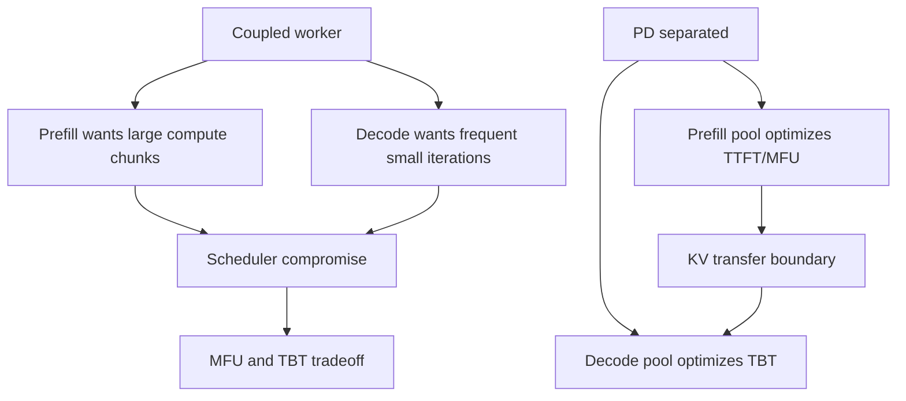

Mooncake论文在真实conversation workload里观察到，vLLM加chunked prefill虽然能降低decode干扰，但仍难同时最大化prefill MFU并满足decode TBT约束。Mooncake通过独立P/D池和KVCache-aware调度，在SLO约束下提升了effective request capacity。

### 4.2 P和D可以独立扩缩容

不同业务的P/D压力不一样：

1. 聊天多轮请求：有较高prefix复用，但输出可能较长。
2. RAG和长文档QA：输入很长，输出可能中等。
3. Agent/tool调用：系统prompt很长且重复，prefix cache收益明显。
4. 短问短答：P和D都轻，拆分收益较小。

如果P/D耦合，扩容通常按整机实例扩容，P资源和D资源一起增加。PD分离后，可以按负载画像设置P:D比例。

Mooncake论文专门评估了P/D ratio。结论不是“P越多越好”或“D越多越好”，而是：

1. P节点更多，TTFT下降，但D节点减少后TBT变差。
2. D节点更多，TBT下降，但P节点减少后TTFT变差。
3. 在论文的16节点synthetic workload实验中，P/D约1:1时effective request capacity最高。

这说明PD分离真正带来的能力是**可调资源比例**，不是固定答案。生产上应该持续监控TTFT、TBT、P队列、D队列和KV传输时间，再决定是否切换节点角色。

### 4.3 全局KVCache池能显著提高prefix复用

Prefix cache在LLM服务里非常重要。两个请求如果共享前缀，第二个请求不必重新计算共享前缀的KV。

单机prefix cache的问题是容量和可见性：

```text
请求A的prefix KV在实例1
请求B被路由到实例2
实例2即使有相同prefix，也看不到实例1的KV
```

一种做法是cache-aware routing，把相同prefix尽量路由到同一实例。但这会带来负载倾斜：热门prefix所在实例会被打爆，而其他实例空闲。

Mooncake的思路是把KVCache变成全局资源：

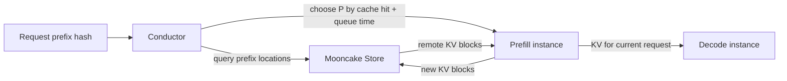

论文里给了很直观的容量分析：以LLaMA3-70B为例，单token KVCache约320KB。即便单节点拿出约1TB DRAM做本地cache，也只能存约3M tokens；而一些真实workload要接近理论最大命中率，需要约50M tokens级别的cache容量，也就是至少池化约20个节点的DRAM。

所以Mooncake的全局KVCache池有两个收益：

1. **容量收益**：把多个节点的DRAM/SSD池化，能装下更多prefix。
2. **调度收益**：请求不必死绑到某个本地cache实例，可以在cache命中和负载均衡之间折中。

论文的global cache对比local cache实验显示，全局cache相对本地cache最高提升136%的cache hit rate，并最高减少48%的prefill GPU计算时间。

### 4.4 高速KV传输让“搬KV”比“重算KV”更划算

复用KVCache是否值得，取决于一个基本比较：

```text
加载/传输已有KV的时间 < 重新prefill这段prefix的时间
```

Mooncake论文里对这一点做了数学分析。对prefix长度$p$、层数$l$、隐藏维度$d$、GQA分组$gqa$、KV数据类型大小$s$，需要传输的KV大小大致是：

$$
\mathrm{KVBytes}
=
p \times l \times (2 \times d / gqa) \times s
$$

如果网络很慢，KV传输会拖垮TTFT；如果网络足够快，长prefix重算更贵，传KV更划算。

Mooncake Transfer Engine的意义就在这里。官方README和论文都强调它支持RDMA、多NIC聚合、拓扑感知路径选择。论文中的传输实验显示，传输40GB数据，也就是LLaMA3-70B 128K tokens量级KVCache，Transfer Engine在4×200Gbps和8×400Gbps RoCE网络下分别达到87GB/s和190GB/s，约为TCP的2.4倍和4.6倍。

这也是为什么Mooncake官方README提醒：虽然支持TCP，但强烈建议在RDMA网络上评估性能。

### 4.5 SLO导向的goodput更适合在线服务

很多吞吐测试只看系统总token/s。但在线服务真正关心的是：

```text
有多少请求在TTFT和TBT SLO内成功完成？
```

Mooncake论文把这个称为effective request capacity，接近goodput的概念。请求如果已经排队到注定超SLO，继续接收只会加重系统负载并伤害其他请求。因此Mooncake的Conductor会估计：

1. prefix cache命中长度。
2. KV传输时间。
3. prefill排队时间。
4. prefill执行时间。
5. decode侧TBT压力。

如果预测无法满足SLO，就可以早拒绝，返回类似HTTP 429的结果。这对高负载MaaS服务很实际：最大化“满足SLO的请求数”，而不是最大化“系统里堆积的请求数”。

## 5. Mooncake完整架构怎么组织

Mooncake论文里的完整架构可以抽象为：

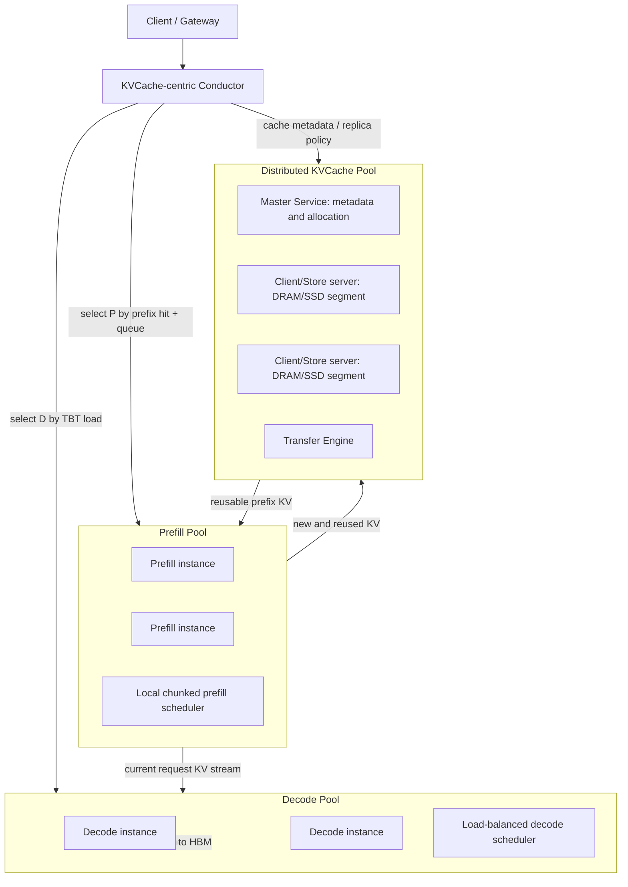

这里有几个容易混淆的点：

1. **Conductor不是数据搬运层**。它是控制面，负责选P、选D、判断cache复用、估计SLO。
2. **Mooncake Store不是普通Redis**。它是面向KVCache对象的分布式KV缓存池，关心replica、segment、RDMA传输、DRAM/SSD层级。
3. **Master Service不走数据面**。官方文档明确说Master负责空间分配和元数据维护，实际数据在Client之间通过Transfer Engine搬。
4. **Transfer Engine不是scheduler**。它只负责把DRAM/VRAM/NVMe-oF里的数据按batch transfer搬过去。

## 6. Mooncake Store源码对应关系

本地临时克隆的Mooncake源码里，Mooncake Store主要在这些目录：

```text
mooncake-store/include/
mooncake-store/src/
mooncake-transfer-engine/include/
mooncake-transfer-engine/src/
```

### 6.1 Transfer Engine：数据面抽象

`mooncake-transfer-engine/include/transfer_engine.h`里的`TransferEngine`暴露了核心数据面接口：

```cpp
int init(const std::string& metadata_conn_string,
         const std::string& local_server_name,
         const std::string& ip_or_host_name = "",
         uint64_t rpc_port = 12345);

int registerLocalMemory(void* addr, size_t length,
                        const std::string& location,
                        bool remote_accessible = true,
                        bool update_metadata = true);

BatchID allocateBatchID(size_t batch_size);

Status submitTransfer(BatchID batch_id,
                      const std::vector<TransferRequest>& entries);

Status getTransferStatus(BatchID batch_id,
                         size_t task_id,
                         TransferStatus& status);
```

这些接口对应论文里的BatchTransfer模型：

1. 先把本地DRAM/VRAM注册成可传输buffer。
2. 通过metadata服务发现远端segment和buffer。
3. 把一组非连续src/dst地址组织成batch。
4. 提交后异步轮询状态。

Mooncake官方Transfer Engine文档把它抽象成`Segment`和`BatchTransfer`：

1. Segment是一段可被远端读写的地址空间，可以来自DRAM、VRAM或NVMe-oF。
2. BatchTransfer是一批读写请求，支持非连续地址的批量搬运。

这很适合KVCache，因为PagedAttention里的KV本来就是block化的，实际传输经常是一组block，而不是一个完整连续大tensor。

### 6.2 Master Service：只管元数据和空间，不搬数据

`mooncake-store/include/master_service.h`里可以看到Master的职责：

```cpp
auto MountSegment(const Segment& segment, const UUID& client_id)
    -> tl::expected<void, ErrorCode>;

auto QuerySegments(const std::string& segment)
    -> tl::expected<std::pair<size_t, size_t>, ErrorCode>;

auto GetReplicaList(const std::string& key)
    -> tl::expected<GetReplicaListResponse, ErrorCode>;

auto PutStart(const UUID& client_id,
              const std::string& key,
              const uint64_t slice_length,
              const ReplicateConfig& config)
    -> tl::expected<std::vector<Replica::Descriptor>, ErrorCode>;

auto PutEnd(const UUID& client_id,
            const std::string& key,
            ReplicaType replica_type)
    -> tl::expected<void, ErrorCode>;

tl::expected<UUID, ErrorCode> CreateCopyTask(
    const std::string& key,
    const std::vector<std::string>& targets);
```

这些接口表达了一个典型对象写入流程：

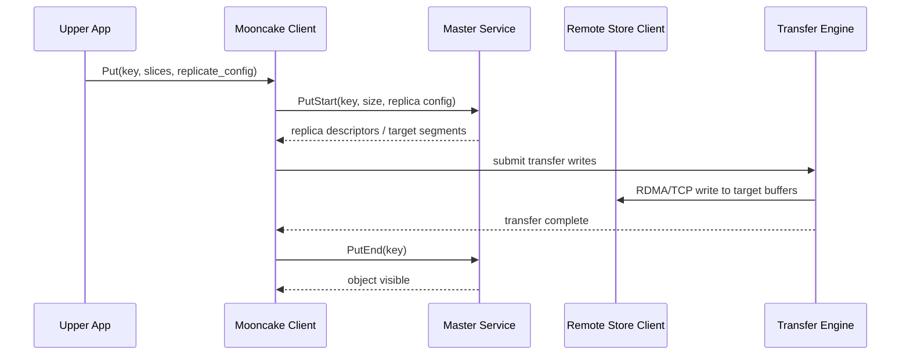

为什么要`PutStart`和`PutEnd`两阶段？因为对象写入期间不能让其他Client读到半写数据。源码里的`ReplicaStatus`也体现了这个状态机：

```cpp
enum class ReplicaStatus {
    UNDEFINED = 0,
    INITIALIZED,
    PROCESSING,
    COMPLETE,
    REMOVED,
    FAILED,
};
```

只有进入`COMPLETE`的replica才应该被作为可读副本返回。

### 6.3 Client：既是客户端，也是存储服务端

`mooncake-store/include/client_service.h`里的`Client`是Mooncake Store很关键的设计。官方文档也强调它有双重角色：

1. 作为client，向上层应用提供`Get`、`Put`、`BatchGet`、`BatchPut`等API。
2. 作为store server，把自己的一段DRAM/SSD segment贡献给全局KVCache池。

源码里可以看到这些接口：

```cpp
tl::expected<void, ErrorCode> Get(const std::string& object_key,
                                  std::vector<Slice>& slices);

std::vector<tl::expected<void, ErrorCode>> BatchGet(
    const std::vector<std::string>& object_keys,
    std::unordered_map<std::string, std::vector<Slice>>& slices);

tl::expected<void, ErrorCode> Put(const ObjectKey& key,
                                  std::vector<Slice>& slices,
                                  const ReplicateConfig& config);

tl::expected<void, ErrorCode> MountSegment(
    const void* buffer,
    size_t size,
    const std::string& protocol = "tcp",
    const std::string& location = kWildcardLocation);

tl::expected<void, ErrorCode> RegisterLocalMemory(
    void* addr,
    size_t length,
    const std::string& location,
    bool remote_accessible = true,
    bool update_metadata = true);
```

这对应Mooncake Store的核心路径：

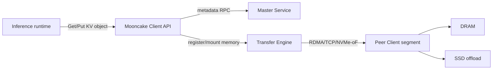

`ReplicateConfig`则表达了副本策略：

```cpp
struct ReplicateConfig {
    size_t replica_num{1};
    bool with_soft_pin{false};
    bool with_hard_pin{false};
    std::vector<std::string> preferred_segments{};
    bool prefer_alloc_in_same_node{false};
    ObjectDataType data_type{ObjectDataType::UNKNOWN};
};
```

这里的`with_soft_pin`、`with_hard_pin`、`preferred_segments`说明Mooncake Store不只是“key到bytes”的KV系统，而是把KVCache当成有生命周期、有热度、有副本位置约束的对象。

### 6.4 Segment和Replica：全局KVCache池的基本单位

`mooncake-store/include/segment.h`里，segment有生命周期：

```cpp
enum class SegmentStatus {
    UNDEFINED = 0,
    OK,
    DRAINING,
    DRAINED,
    UNMOUNTING,
};
```

这对生产集群很重要。节点下线、扩缩容、维护、故障恢复时，不应该简单地把segment删掉，而应该支持：

1. DRAINING：仍可读，但不再接收新分配。
2. DRAINED：数据迁移完成，等待卸载。
3. UNMOUNTING：正在卸载。

`mooncake-store/include/replica.h`里，replica类型包括：

```cpp
enum class ReplicaType {
    MEMORY,
    DISK,
    LOCAL_DISK
};
```

这说明Mooncake Store支持多层存储，不只是DRAM。热KV可以在内存，冷一些的KV可以offload到本地盘或远端存储，再通过Transfer Engine读回。

## 7. vLLM里的MooncakeConnector做了什么

本机vLLM源码路径：

```text
/home/gentle/projects/my_rust/vllm/vllm/distributed/kv_transfer/kv_connector/v1/mooncake/mooncake_connector.py
/home/gentle/projects/my_rust/vllm/vllm/distributed/kv_transfer/kv_connector/v1/mooncake/mooncake_utils.py
/home/gentle/projects/my_rust/vllm/examples/online_serving/disaggregated_serving/mooncake_connector/mooncake_connector_proxy.py
```

需要注意：当前这份`MooncakeConnector`主要是基于Mooncake Transfer Engine做P到D的KV直传。它体现了PD分离的数据面协议，但不等于论文里完整的Conductor + Mooncake Store全局缓存调度。

### 7.1 启动方式

vLLM文档里的最小启动方式是：

```bash
# Prefiller
vllm serve Qwen/Qwen2.5-7B-Instruct \
  --port 8010 \
  --kv-transfer-config '{"kv_connector":"MooncakeConnector","kv_role":"kv_producer"}'

# Decoder
vllm serve Qwen/Qwen2.5-7B-Instruct \
  --port 8020 \
  --kv-transfer-config '{"kv_connector":"MooncakeConnector","kv_role":"kv_consumer"}'

# Proxy
python examples/online_serving/disaggregated_serving/mooncake_connector/mooncake_connector_proxy.py \
  --prefill http://192.168.0.2:8010 \
  --decode http://192.168.0.3:8020
```

`kv_role`决定实例角色：

1. `kv_producer`：prefill侧，生产KV。
2. `kv_consumer`：decode侧，消费远端KV。
3. `kv_both`：实验用的双角色。

`kv_connector_extra_config`里目前比较关键的是：

1. `num_workers`：prefill worker侧传输线程池大小，默认10。
2. `mooncake_protocol`：Transfer Engine协议，默认`rdma`。

### 7.2 Proxy如何把一个请求拆成两段

`mooncake_connector_proxy.py`会为同一个用户请求生成同一个`transfer_id`，然后分别发给P和D。

发给P侧的请求会被改成只生成1个token，并带上：

```python
req_data["kv_transfer_params"] = {
    "do_remote_decode": True,
    "do_remote_prefill": False,
    "transfer_id": f"xfer-{request_id}",
}
req_data["max_tokens"] = 1
```

含义是：P侧执行prefill，保留本请求的KV，等D来拉。

发给D侧的请求带上：

```python
req_data["kv_transfer_params"] = {
    "do_remote_decode": False,
    "do_remote_prefill": True,
    "remote_bootstrap_addr": prefill_client_info["bootstrap_addr"],
    "remote_engine_id": prefill_client_info["dp_engine_id"][prefill_dp_rank],
    "transfer_id": f"xfer-{request_id}",
}
```

含义是：D侧不要本地重新prefill整段prompt，而是从指定P侧拉取KV。

整体时序如下：

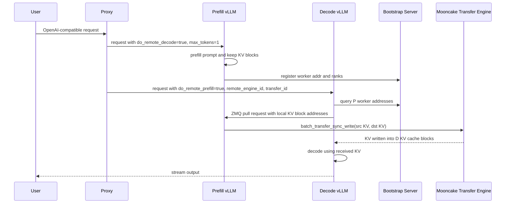

### 7.3 Scheduler侧：把远端KV伪装成external computed tokens

`MooncakeConnectorScheduler.get_num_new_matched_tokens()`里，如果请求带了`do_remote_prefill`，它会返回：

```python
count = len(token_ids) - num_computed_tokens
return count, True
```

这告诉vLLM scheduler：这些prompt token的KV可以从外部异步加载，不必本地计算。

`update_state_after_alloc()`在D侧拿到本地KV block后，会记录：

```python
self._reqs_need_recv[request.request_id] = (request, local_block_ids)
```

随后`build_connector_meta()`把这些请求封装成`MooncakeConnectorMetadata`，发给worker侧。

P侧的关键在`request_finished()`。当prefill请求结束时，如果它需要被D消费，函数会返回`delay_free_blocks=True`，延迟释放P侧KV block：

```python
if delay_free_blocks:
    self._reqs_need_send[request.request_id] = (request, block_ids)

return delay_free_blocks, None
```

这解决了一个很实际的问题：P侧prefill完成后不能立刻把KV block还给缓存管理器，否则D还没拉，数据就被覆盖了。

### 7.4 Worker侧：注册KV Cache GPU地址

`MooncakeConnectorWorker.register_kv_caches()`会遍历每层KV cache tensor，记录：

1. `base_addr = cache.data_ptr()`
2. `curr_tensor_size_bytes = cache.nbytes`
3. `block_len_per_layer = curr_tensor_size_bytes // num_blocks`
4. `kv_caches_base_addr`

然后调用：

```python
self.engine.batch_register_memory(kv_data_ptrs, kv_data_lens)
```

也就是说，vLLM的paged KV cache tensor地址会被注册给Mooncake Transfer Engine，后续P可以直接把KV bytes写入D的KV cache tensor地址。

这一步是MooncakeConnector性能路径的核心。如果没有预注册GPU/CPU内存，传输就会退化成更多CPU参与和额外拷贝。

### 7.5 Bootstrap和ZMQ side channel：交换控制面metadata

`mooncake_utils.py`里的`MooncakeBootstrapServer`非常小，但作用关键。P侧global rank 0启动一个FastAPI server，worker注册：

```python
class RegisterWorkerPayload(BaseModel):
    engine_id: EngineId
    dp_rank: int
    tp_rank: int
    pp_rank: int
    addr: WorkerAddr
```

注册后，D侧可以通过`/query`拿到某个prefill engine的TP/PP worker地址。

真正的拉取请求不是通过这个Bootstrap server传输KV，而是D通过ZMQ向P worker发送`MooncakeXferMetadata`：

```python
class MooncakeXferMetadata(msgspec.Struct):
    remote_hostname: str
    remote_port: int
    remote_tp_size: int
    remote_tp_rank: int
    req_blocks: dict[ReqId, tuple[TransferId, list[int]]]
    kv_caches_base_addr: list[int]
    block_lens: list[int]
```

这里的`remote_hostname`、`remote_port`、`kv_caches_base_addr`、`block_lens`描述的是D侧目标KV cache地址。P侧拿到这些地址后，用Transfer Engine直接写过去。

### 7.6 真正的数据传输：P侧向D侧写KV block

P侧收到D的metadata后，会等待本地prefill请求ready，然后构造传输参数：

```python
src_ptrs = []
dst_ptrs = []
lengths = []
```

`_build_transfer_params()`会根据local block id和remote block id计算每个KV block的源地址、目标地址和长度。连续block会尽量合并，减少transfer descriptor数量：

```python
can_coalesce = _can_coalesce_block_transfers(...)
```

最后调用：

```python
self.engine.batch_transfer_sync_write(
    remote_session,
    src_ptrs,
    dst_ptrs,
    lengths,
)
```

这条路径对应下面的数据面：

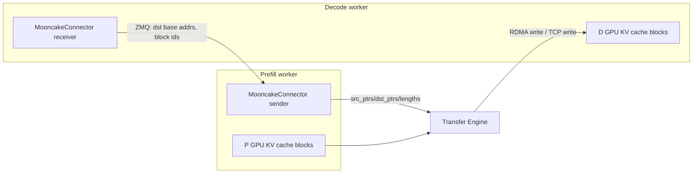

注意这里D侧不是把KV读到临时buffer再拷贝到KV cache，而是把D侧KV cache目标地址告诉P侧，由P侧通过Transfer Engine写入目标地址。具体是否能做到GPUDirect RDMA取决于Mooncake安装、协议、硬件和内存注册情况。

### 7.7 异构TP：为什么代码里有transfer plan

`mooncake_connector.py`里有一组函数处理P/D tensor parallel size不一致的情况：

```python
def _get_tp_ratio(local_tp_size: int, remote_tp_size: int) -> int

def _compute_sender_transfer_plan(
    local_tp_rank: int,
    local_tp_size: int,
    remote_tp_rank: int,
    remote_tp_size: int,
    local_kv_block_len: int,
    remote_kv_block_len: int,
    producer_cache_replicated: bool,
) -> tuple[bool, int, int, int]
```

为什么需要这个？因为P侧和D侧TP不同，单个rank持有的KV shard大小就不同。

例如：

```text
P TP = 4
D TP = 2
```

一个D rank可能需要合并两个P rank的KV分片。反过来：

```text
P TP = 2
D TP = 4
```

一个P rank的KV可能要拆给多个D rank。

所以代码要计算：

1. 当前P rank是否需要给这个D rank发送。
2. 源region偏移是多少。
3. 目标region偏移是多少。
4. 传输长度是多少。

这也是为什么`get_required_kvcache_layout()`里非MLA模型会要求`HND`布局：它让KV transfer在异构TP下更可控。

## 8. Mooncake论文里的调度算法

Mooncake的Conductor不是简单round-robin。论文中的Algorithm 1大致逻辑是：

```text
block_keys = PrefixHash(prompt_tokens)
best_len, best_instance = FindBestPrefixMatch(prefill_pool, block_keys)

for each prefill instance:
  prefix_len = local hit or transferred remote hit
  Ttransfer = estimated KV transfer time
  Tqueue = estimated prefill queue time
  Tprefill = estimated prefill execution time(prompt_len, prefix_len)
  TTFT = Ttransfer + Tqueue + Tprefill

select prefill instance with minimum TTFT
select decode instance by TBT load
if TTFT > TTFT_SLO or TBT > TBT_SLO:
  reject request
else:
  transfer hot KV if worth it
```

画成流程：

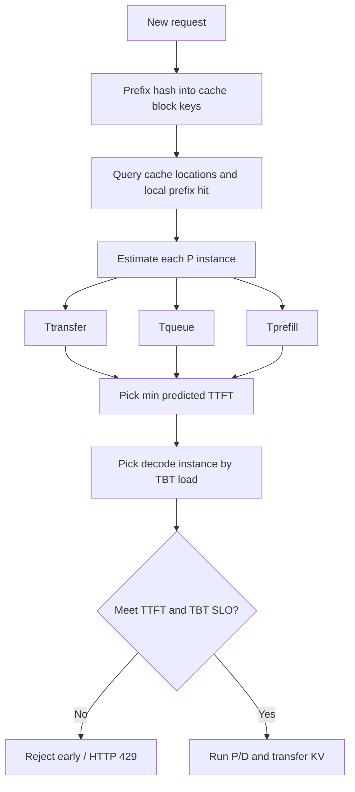

这里的关键不是用了多复杂的模型，而是调度目标从“哪个实例请求少”变成：

```text
哪个prefill实例在考虑cache命中、远端KV传输、排队后，能最快给出first token？
哪个decode实例在接收这个请求后，仍能保持TBT？
```

这正是KVCache-centric的含义。

## 9. 什么时候PD分离收益最大

PD分离通常适合这些场景：

1. **长上下文请求多**：prompt几千到几十万tokens，prefill经常压住decode。
2. **多轮对话多**：用户持续带历史上下文，prefix复用明显。
3. **Agent/tool系统prompt长且重复**：大量请求共享同一段系统prompt或工具说明。
4. **TTFT和TBT都有严格SLO**：不能只追求平均吞吐。
5. **有高速网络**：RDMA、多NIC、拓扑可控，能把KV传输成本压低。
6. **集群规模足够大**：有必要独立规划P/D比例，有足够DRAM/SSD形成全局KV池。
7. **有cache-aware调度能力**：否则很容易在cache命中和负载均衡之间选错。

不太适合的场景：

1. **请求很短**：prefill本来就轻，拆分后的网络和协议开销可能更大。
2. **单机或少量GPU**：P/D拆分会降低资源弹性，运维复杂度不划算。
3. **网络慢或不稳定**：KV传输会直接变成TTFT瓶颈。
4. **prefix复用低**：全局KVCache池的收益下降，只剩阶段隔离收益。
5. **业务能接受较大TBT抖动**：如果SLO不严格，coupled serving加chunked prefill可能足够。
6. **控制面不成熟**：没有良好的故障回收、block生命周期管理和指标观测，容易出现KV block泄露或请求悬挂。

## 10. PD分离的工程代价

### 10.1 KV生命周期更复杂

Coupled serving里，KV block通常只在本worker生命周期内管理。PD分离后，至少有这些状态：

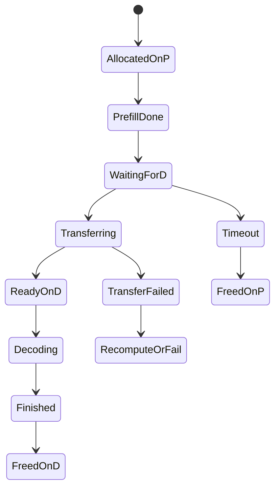

vLLM MooncakeConnector里能看到这个复杂度：

1. P侧`request_finished()`要延迟释放block。
2. D侧拉取成功后要汇报`finished_recving_reqs`。
3. P侧发送成功后要汇报`finished_sending_reqs`。
4. 如果请求abort，`VLLM_MOONCAKE_ABORT_REQUEST_TIMEOUT`会兜底释放P侧block，避免长时间占用。

### 10.2 控制面和数据面要严格分离

一个健康的PD系统至少需要三类通信：

1. 用户请求路径：HTTP/OpenAI API。
2. 控制面metadata：P/D worker地址、rank、block id、transfer id、cache key、replica位置。
3. 数据面传输：KV bytes通过RDMA/TCP/NVMe-oF搬运。

vLLM MooncakeConnector里，Bootstrap server只负责worker注册和查询；ZMQ负责P/D side channel；Transfer Engine负责KV bytes。这个分层是必要的，否则调试和故障定位会很困难。

### 10.3 网络会变成一等公民

PD分离把一部分GPU计算成本换成网络传输成本。网络不再只是“服务之间发HTTP请求”，而是直接处在推理临界路径上。

需要重点观测：

1. KV传输bytes/request。
2. transfer latency P50/P95/P99。
3. RDMA NIC带宽和拥塞。
4. NUMA/GPU/NIC拓扑是否匹配。
5. fallback到TCP或host staging的比例。
6. 传输失败和重试次数。

Mooncake Transfer Engine的拓扑感知路径选择、多NIC切片、endpoint pooling和故障重路由，都是为这个问题服务的。

### 10.4 P/D比例不是静态真理

论文里约1:1在某个synthetic workload上最好，但这不是通用答案。实际比例取决于：

1. 平均input length。
2. 平均output length。
3. prefix cache hit rate。
4. 模型结构和KV大小，例如GQA/MLA会明显改变KV bytes/token。
5. TP/PP/EP并行方式。
6. TTFT和TBT SLO。
7. 网络带宽和cache存储层级。

一个实用策略是先用trace replay扫P:D比例，再在生产里基于队列和SLO指标做慢速调整。

## 11. Mooncake相对其他方案的位置

可以粗略分成几类方案：

| 方案 | 解决点 | 局限 |
|---|---|---|
| Coupled vLLM + continuous batching | 简单、高吞吐、成熟 | 长prefill干扰decode |
| Chunked prefill | 缓解prefill干扰 | 仍共享同一资源池和scheduler目标 |
| Local prefix caching | 减少本实例重复prefill | 容量小，路由容易热点倾斜 |
| PD分离 + 简单KV传输 | 隔离P/D，降低TBT抖动 | 只解决当前请求KV搬运，不解决全局cache |
| Mooncake Store + Conductor | 全局KVCache池和KV-aware调度 | 控制面和运维复杂度最高 |
| NIXL/Transfer Engine类库 | 统一数据搬运抽象 | 不负责请求调度和cache策略 |

所以Mooncake不是单点优化，而是一个系统组合：

```text
P/D disaggregation
+ global KVCache pool
+ KVCache-aware scheduling
+ high-speed data transfer
+ replica/hotspot balancing
+ SLO-aware early rejection
```

只拿其中一个组件，也能有收益。例如vLLM当前`MooncakeConnector`主要拿Transfer Engine做P/D KV直传；如果再接入Mooncake Store或LMCache，就可以进一步做跨实例KV复用。

## 12. 一个具体例子：什么时候传KV比重算更好

假设一个70B模型，每token KV约320KB。一个请求有64K token前缀可复用：

```text
KV size = 64K * 320KB = 20GB左右
```

如果重算这64K prompt需要数秒甚至更久，而RDMA网络能以100GB/s级别搬运，那么传输20GB可能小于重算时间，尤其还可以和后续分层prefill、写入、调度重叠。

但如果只有10GbE或拥塞严重，20GB传输会变成秒级甚至十几秒级，此时重算反而可能更稳定。这就是为什么不能脱离网络讨论PD分离。

实践判断可以用这个简单规则：

$$
\mathrm{Benefit}
=
T_{\mathrm{recompute\_prefix}}
-
(T_{\mathrm{metadata}} + T_{\mathrm{transfer}} + T_{\mathrm{load}})
$$

只有当Benefit稳定为正，KV复用才真正有价值。

## 13. 实践落地建议

如果要在生产中落地PD分离，我会按这个顺序推进：

1. **先做trace分析**：统计input/output长度、prefix复用率、共享prefix热度、请求到达分布。
2. **建立baseline**：coupled vLLM、prefix caching、chunked prefill分别跑一遍，测TTFT、TBT、goodput。
3. **验证网络上限**：用Transfer Engine benchmark测真实P/D节点间带宽、P99延迟、多NIC聚合效果。
4. **先跑P/D直传**：类似vLLM `MooncakeConnector`，验证block生命周期、abort、超时、异构TP。
5. **再引入全局KV Store**：把跨请求prefix复用纳入调度，而不是一开始就做完整Conductor。
6. **做SLO-aware admission control**：过载时早拒绝，否则PD系统会在KV传输和队列里堆积请求。
7. **补齐观测**：P队列、D队列、KV命中率、transfer bytes、transfer latency、block延迟释放、timeout释放次数都要有指标。
8. **做故障演练**：P已完成但D没拉、D拉了一半失败、P节点宕机、Bootstrap不可达、RDMA某张卡故障，都要有明确行为。

## 14. 总结

PD分离的本质是承认LLM推理的prefill和decode不是同一种工作负载。Prefill追求长上下文吞吐和TTFT，Decode追求稳定迭代和TBT。把两者拆成独立资源池，可以降低干扰、独立扩缩容、提升SLO内goodput。

Mooncake进一步把KVCache提升为系统中心对象：用Mooncake Store池化DRAM/SSD/NIC资源，用Conductor做KVCache-aware调度，用Transfer Engine把KV block高速搬运起来。论文结果说明，在长上下文和高prefix复用场景，这种设计能把大量重复prefill计算换成更便宜的存储和网络传输。

从代码看，Mooncake的工程关键点很清晰：

1. Transfer Engine提供`registerLocalMemory`、`submitTransfer`、batch status等底层数据面能力。
2. Mooncake Store的Master负责segment、replica、PutStart/PutEnd、copy/move task等元数据和空间分配。
3. vLLM `MooncakeConnector`把P/D协议落到请求级`transfer_id`、Bootstrap发现、ZMQ side channel、KV cache地址注册和`batch_transfer_sync_write`上。

最终判断是否值得上PD分离，不应该只看架构是否先进，而应该看三件事：

```text
prefill是否经常伤害decode TBT？
prefix KV是否有足够复用价值？
网络和工程复杂度是否足以支撑KV跨节点搬运？
```

这三个答案都为“是”时，PD分离和Mooncake这类KVCache中心架构才真正能释放价值。

## 参考

1. Mooncake官方仓库：<https://github.com/kvcache-ai/Mooncake>
2. Mooncake FAST 2025论文：<https://www.usenix.org/system/files/fast25-qin.pdf>
3. Mooncake arXiv technical report：<https://arxiv.org/abs/2407.00079>
4. Mooncake官方文档：<https://kvcache-ai.github.io/Mooncake/>
5. Mooncake Store设计文档：<https://kvcache-ai.github.io/Mooncake/design/mooncake-store.html>
6. Mooncake Transfer Engine设计文档：<https://kvcache-ai.github.io/Mooncake/design/transfer-engine/index.html>
7. PyPI `mooncake-transfer-engine`发布页：<https://pypi.org/project/mooncake-transfer-engine/>
8. vLLM MooncakeConnector使用文档：<https://docs.vllm.ai/en/latest/features/mooncake_connector_usage/>
9. vLLM disaggregated prefill文档：<https://docs.vllm.ai/en/latest/features/disagg_prefill.html>
10. 本文参考的本地vLLM源码：`/home/gentle/projects/my_rust/vllm/vllm/distributed/kv_transfer/kv_connector/v1/mooncake/mooncake_connector.py`
11. 本文参考的本地Mooncake源码临时克隆：`/tmp/mooncake-research`
