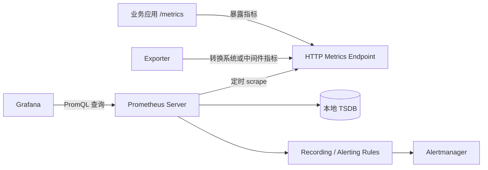
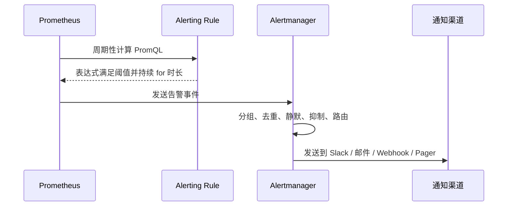
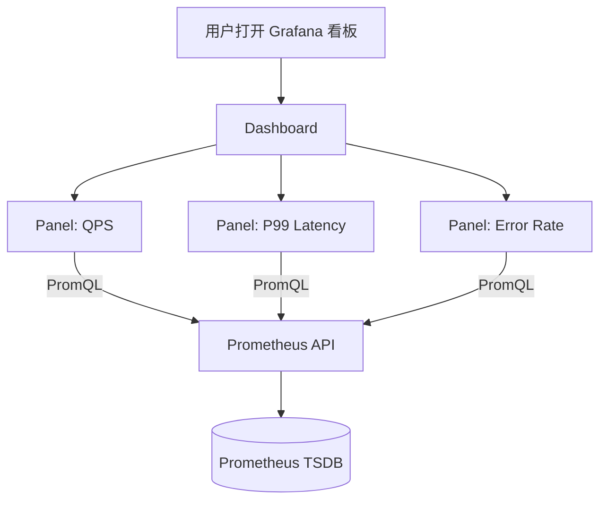

> 资料说明：本文根据 2026-06-08 可访问的 Prometheus 与 Grafana 官方文档整理。Prometheus/Grafana 的基础模型很稳定，但具体版本、UI 菜单、云服务能力会持续变化，实际部署时仍应以官方文档为准。

## 先说结论

Prometheus 和 Grafana 经常一起出现，但它们不是同一个东西：

- **Prometheus** 负责采集、存储、查询和告警“指标数据”（metrics）。它会周期性访问应用、机器、数据库、中间件暴露出来的 `/metrics` 接口，把返回的数据写进本地时序数据库，然后用 PromQL 查询。
- **Grafana** 负责把数据源里的数据做成交互式看板。它可以连接 Prometheus，也可以连接 Loki、MySQL、PostgreSQL、Elasticsearch、云厂商监控等很多数据源。
- **Grafana 看板不是数据本身**。看板里的每个面板，本质上都是“对某个数据源发起查询，然后把查询结果渲染成折线图、表格、仪表盘、热力图、状态列表”等。
- **Prometheus 更像监控系统的大脑和数据库，Grafana 更像监控系统的驾驶舱**。Prometheus 关心“数据怎么来、怎么存、怎么查、什么时候告警”；Grafana 关心“人如何快速看懂这些数据”。

一句话概括：

```text
应用/机器/Exporter 暴露 metrics
        ↓
Prometheus 定时拉取、存储、用 PromQL 查询和生成告警
        ↓
Grafana 连接 Prometheus，把 PromQL 查询结果画成看板
```

## 为什么需要它们

线上系统的问题往往不是“完全不可用”这么简单，而是很多渐进式异常：

- 请求延迟从 20 ms 慢慢涨到 800 ms；
- 某台机器 CPU 一直 95%，但服务还没挂；
- 某个接口 5xx 比例从 0.1% 变成 5%；
- Kafka 消费堆积持续上升；
- 数据库连接池被打满；
- Kubernetes 某个 Pod 不断重启；
- 磁盘剩余空间还没为 0，但按照写入速度 3 小时后就会满。

这些问题需要一个系统持续回答三个问题：

- **现在怎么样**：系统当前健康吗？
- **刚才发生了什么**：异常从什么时候开始？影响范围多大？
- **接下来可能会怎样**：如果趋势不变，多久会打满资源？

Prometheus/Grafana 解决的就是这个场景。它们主要处理的是 **metrics**，也就是数值型、可聚合、可按时间观察的数据。

## 观测性里的三类数据

讨论 Prometheus 之前，要先区分 metrics、logs、traces。

| 类型 | 中文 | 典型问题 | 典型工具 |
|---|---|---|---|
| Metrics | 指标 | QPS 是多少？错误率多高？P99 延迟多少？ | Prometheus |
| Logs | 日志 | 某次请求为什么失败？异常栈是什么？ | Loki、ELK |
| Traces | 链路追踪 | 一个请求经过哪些服务？慢在哪一段？ | Jaeger、Tempo |

Prometheus 的优势是 metrics。它不适合直接存大段日志，也不适合作为完整链路追踪系统。Grafana 则更像统一展示层，它既能展示 Prometheus 指标，也能展示日志和链路数据。

## Metrics 到底是什么

一个指标可以理解成“随时间变化的数字”。例如：

```text
http_requests_total{method="GET", path="/api/users", status="200"} 1027
```

这行数据表达的是：

- 指标名：`http_requests_total`
- 标签：`method="GET"`、`path="/api/users"`、`status="200"`
- 当前值：`1027`
- 时间戳：采集时由 Prometheus 记录，或者由被采集端显式提供

Prometheus 官方文档把所有指标数据都存为时间序列。一个时间序列由 **指标名 + 标签集合** 唯一确定：

```text
http_requests_total{method="GET", path="/api/users", status="200"}
http_requests_total{method="GET", path="/api/users", status="500"}
http_requests_total{method="POST", path="/api/users", status="200"}
```

这三行是三个不同的时间序列，因为标签不同。

### 标签的威力和危险

标签让查询非常灵活：

```promql
sum by (status) (rate(http_requests_total[5m]))
```

这个查询可以按状态码统计最近 5 分钟每秒请求数。

但标签也可能毁掉 Prometheus。比如：

```text
http_requests_total{user_id="123456", request_id="abc-xyz-001"} 1
```

如果 `user_id`、`request_id` 这样的标签取值数量极大，Prometheus 会产生海量时间序列。时间序列数量越多，内存、磁盘、查询成本都会快速上升。这就是常说的 **高基数问题**。

经验规则：

- 可以把 `method`、`status`、`service`、`instance`、`region` 放进标签；
- 谨慎把 `path` 放进标签，最好使用模板化路径，例如 `/users/:id`；
- 不要把 `user_id`、`email`、`trace_id`、`request_id` 放进标签；
- 日志里可以出现的唯一 ID，不一定适合进入 metrics 标签。

## Prometheus 的工作方式

Prometheus 默认采用 **pull model**。也就是说，不是应用主动把指标推给 Prometheus，而是 Prometheus 按配置定时去目标地址拉取指标。



### scrape 是什么

`scrape` 可以理解为一次采集。Prometheus 每隔一段时间访问目标地址，例如：

```text
http://10.0.0.12:9100/metrics
```

被访问方返回 Prometheus 文本格式：

```text
# HELP node_cpu_seconds_total Seconds the CPUs spent in each mode.
# TYPE node_cpu_seconds_total counter
node_cpu_seconds_total{cpu="0",mode="idle"} 12345.67
node_cpu_seconds_total{cpu="0",mode="system"} 345.67
```

Prometheus 解析这些行，把它们写进本地时序数据库。官方文档说明 Prometheus 的文本格式通过 HTTP 传输，编码为 UTF-8，核心指标类型包括 Counter、Gauge、Histogram、Summary、Untyped。

### job 和 instance

Prometheus 采集目标时，会自动给指标附加一些标签，最常见的是：

- `job`：一组同类采集目标，例如 `node`、`api-server`、`mysql`；
- `instance`：具体采集目标，例如 `10.0.0.12:9100`。

例如：

```yaml
scrape_configs:
  - job_name: "node"
    static_configs:
      - targets:
          - "10.0.0.12:9100"
          - "10.0.0.13:9100"
```

Prometheus 会把这两个目标都归入 `job="node"`，同时分别设置不同的 `instance`。

### Exporter 是什么

很多系统本身不会直接暴露 Prometheus 格式的 `/metrics`，这时就需要 Exporter。

Exporter 的职责是：

1. 从目标系统读取状态；
2. 转换成 Prometheus 能理解的 metrics；
3. 暴露 HTTP `/metrics` 端点。

常见例子：

- `node_exporter`：采集 Linux 主机 CPU、内存、磁盘、网络；
- `mysqld_exporter`：采集 MySQL；
- `redis_exporter`：采集 Redis；
- `blackbox_exporter`：从外部探测 HTTP、TCP、ICMP 等可用性；
- 应用内置 client library：业务程序自己暴露请求数、延迟、错误率等。

Exporter 不是越多越好。应该先明确你要回答什么问题，再决定采集哪些指标。

## Prometheus 的核心组件

一个典型 Prometheus 体系包含这些部分：

| 组件 | 作用 |
|---|---|
| Prometheus Server | 拉取指标、存储时序数据、执行 PromQL、计算规则 |
| Client Library | 业务应用埋点，暴露 Prometheus 格式指标 |
| Exporter | 把第三方系统或机器状态转换成 Prometheus 指标 |
| Alertmanager | 接收告警，做分组、抑制、静默、路由和通知 |
| Pushgateway | 给短生命周期任务临时推送指标，不是常规服务的默认选择 |
| Grafana | 查询 Prometheus，并把结果做成看板 |

### 本地 TSDB 和保留周期

Prometheus 默认把数据存到本地 TSDB。它适合中短期监控数据，例如保留 15 天、30 天或几个月。数据写入路径大致是：

```text
scrape 样本 → 内存 head block / WAL → 周期性压缩成磁盘 block → 按保留策略删除旧 block
```

其中 WAL 是 Write-Ahead Log，用来在进程崩溃时尽量恢复尚未压缩的数据。

如果你需要长期保存一年以上、跨机房聚合、多副本查询，通常会接入 remote write 或使用 Thanos、Cortex/Mimir、VictoriaMetrics 等长期存储方案。Prometheus 本身仍然可以作为采集和规则计算的核心。

## 四种主要指标类型

Prometheus client library 提供四种主要指标类型：Counter、Gauge、Histogram、Summary。

### Counter：只增不减的计数器

Counter 适合“累计发生了多少次”的数据：

- 总请求数；
- 总错误数；
- 处理任务总数；
- 网络接收字节数；
- 进程启动以来 GC 次数。

示例：

```text
http_requests_total{method="GET", status="200"} 1027
```

Counter 的值只能增加，进程重启时可以归零。所以看 Counter 的原始值通常没意义，更常用的是看速率：

```promql
rate(http_requests_total[5m])
```

这表示最近 5 分钟平均每秒增长多少，也就是 QPS。

错误率可以这样算：

```promql
sum(rate(http_requests_total{status=~"5.."}[5m]))
/
sum(rate(http_requests_total[5m]))
```

### Gauge：可增可减的瞬时值

Gauge 适合“当前是多少”的数据：

- 当前内存使用量；
- 当前队列长度；
- 当前在线连接数；
- 当前温度；
- 当前磁盘剩余空间。

示例：

```text
queue_depth{queue="payment"} 128
```

Gauge 可以上升也可以下降，所以不要对普通 Gauge 使用 `rate()` 来表达业务速率。它更适合直接画趋势、求最大值、求平均值：

```promql
max_over_time(queue_depth{queue="payment"}[30m])
```

### Histogram：按桶统计分布

Histogram 用来观察分布，最常用于请求延迟、响应大小等。

假设一个服务暴露：

```text
http_request_duration_seconds_bucket{le="0.1"} 1200
http_request_duration_seconds_bucket{le="0.3"} 1800
http_request_duration_seconds_bucket{le="1.0"} 1980
http_request_duration_seconds_bucket{le="+Inf"} 2000
http_request_duration_seconds_sum 345.6
http_request_duration_seconds_count 2000
```

含义是：

- `bucket{le="0.1"}`：小于等于 0.1 秒的请求累计有多少；
- `bucket{le="0.3"}`：小于等于 0.3 秒的请求累计有多少；
- `_sum`：总耗时；
- `_count`：总请求数。

平均延迟：

```promql
sum(rate(http_request_duration_seconds_sum[5m]))
/
sum(rate(http_request_duration_seconds_count[5m]))
```

P99 延迟：

```promql
histogram_quantile(
  0.99,
  sum by (le) (rate(http_request_duration_seconds_bucket[5m]))
)
```

如果要按服务分别看 P99：

```promql
histogram_quantile(
  0.99,
  sum by (service, le) (rate(http_request_duration_seconds_bucket[5m]))
)
```

Histogram 的关键设计点是桶边界。桶太粗，P95/P99 不准；桶太细，时间序列数量和存储成本会上升。

### Summary：客户端计算分位数

Summary 也能表达延迟分布，但它在客户端计算分位数。它的优点是客户端可以直接给出分位数，缺点是跨实例聚合困难。

对于大多数服务端监控，尤其是需要按服务、集群、区域聚合的场景，Histogram 通常更常用。Summary 更适合某些单实例、本地视角的分位数需求。

## PromQL 入门

PromQL 是 Prometheus 的查询语言。官方文档把表达式结果分为几类：instant vector、range vector、scalar、string。入门时可以先把它理解成：

- **instant vector**：某个时间点的一组时间序列；
- **range vector**：某段时间内的一组时间序列；
- **scalar**：一个数字。

### 选择一个指标

```promql
up
```

`up` 是 Prometheus 自动生成的指标。目标采集成功通常为 `1`，失败为 `0`。

筛选标签：

```promql
up{job="node"}
```

正则筛选：

```promql
http_requests_total{status=~"5.."}
```

排除：

```promql
http_requests_total{path!="/healthz"}
```

### 用 rate 看 Counter 速率

Counter 原始值一直累加，看它的绝对值通常没意义。对请求数、错误数、字节数这类 Counter，应使用 `rate()` 或 `increase()`：

```promql
rate(http_requests_total[5m])
increase(http_requests_total[1h])
```

区别：

- `rate(x[5m])`：平均每秒增长多少；
- `increase(x[1h])`：1 小时总共增长多少。

看接口 QPS：

```promql
sum by (path) (rate(http_requests_total[5m]))
```

看服务级 QPS：

```promql
sum by (service) (rate(http_requests_total[5m]))
```

### 聚合维度

Prometheus 的强大之处在于标签聚合。

按状态码聚合：

```promql
sum by (status) (rate(http_requests_total[5m]))
```

忽略实例维度，得到服务整体请求数：

```promql
sum without (instance) (rate(http_requests_total[5m]))
```

按实例找 CPU 使用最高的机器：

```promql
topk(5, 100 - avg by (instance) (rate(node_cpu_seconds_total{mode="idle"}[5m])) * 100)
```

### 窗口大小怎么选

`rate(x[5m])` 里的 `[5m]` 是查询窗口。窗口太短会抖动，窗口太长会掩盖突发。

常见经验：

- 看实时波动：`[1m]` 或 `[2m]`，但要求 scrape interval 足够短；
- 常规看板：`[5m]` 比较稳；
- 告警判断：`[5m]`、`[10m]`、`[15m]` 更抗抖动；
- 长周期趋势：可以用 `[1h]` 或 recording rule 预聚合。

如果 Prometheus 每 15 秒 scrape 一次，那么 `[5m]` 大约包含 20 个样本，通常比较稳定。如果每 60 秒 scrape 一次，`[1m]` 窗口就很容易不稳定。

## Recording Rule 和 Alerting Rule

Prometheus 支持两类规则：

- **Recording rule**：把常用或昂贵的 PromQL 提前算好，保存成新的时间序列；
- **Alerting rule**：当表达式满足条件时产生告警。

### Recording rule 示例

```yaml
groups:
  - name: api.rules
    rules:
      - record: job:http_requests:rate5m
        expr: sum by (job) (rate(http_requests_total[5m]))
```

之后看板里可以直接查询：

```promql
job:http_requests:rate5m
```

好处：

- 看板查询更快；
- 复杂表达式只维护一处；
- 告警和看板使用同一套派生指标，减少口径不一致。

### Alerting rule 示例

```yaml
groups:
  - name: api.alerts
    rules:
      - alert: HighErrorRate
        expr: |
          sum(rate(http_requests_total{status=~"5.."}[5m]))
          /
          sum(rate(http_requests_total[5m]))
          > 0.05
        for: 10m
        labels:
          severity: page
        annotations:
          summary: "HTTP 5xx error rate is above 5%"
```

这里的 `for: 10m` 很重要。它表示条件持续 10 分钟才触发，避免瞬时毛刺造成告警风暴。

## Alertmanager 负责什么

Prometheus 负责判断“是否满足告警条件”，Alertmanager 负责“告警发给谁、怎么发、什么时候不发”。

Alertmanager 常见能力：

- **Grouping**：把相似告警合并，避免一个故障产生几百条通知；
- **Routing**：按团队、服务、严重程度发送到不同渠道；
- **Silence**：维护窗口内静默某些告警；
- **Inhibition**：如果上游大故障已经触发，下游衍生告警可以被抑制；
- **Deduplication**：重复告警去重。

典型流程：



## Grafana 是什么

Grafana 是可视化和交互分析平台。它的核心抽象是：

- **Data source**：数据源，例如 Prometheus、Loki、PostgreSQL、MySQL；
- **Query**：对数据源发出的查询，例如 PromQL；
- **Panel**：一个可视化面板，例如折线图、表格、Stat、Gauge；
- **Dashboard**：多个 Panel 的集合；
- **Variable**：看板变量，例如选择 `service`、`namespace`、`instance`；
- **Transformation**：对查询结果做转换，例如合并字段、重命名、过滤、计算；
- **Annotation**：在时间线上标注部署、事故、版本发布等事件。

Grafana 官方文档说明，Dashboard 由一个或多个 Panel 组成，Panel 会向数据源查询并转换数据，再渲染成可视化。Grafana 支持大量数据源插件，所以它不只属于 Prometheus。

## Prometheus 和 Grafana 如何配合

Grafana 连接 Prometheus 后，每个 Panel 里通常会写一段 PromQL。



例如一个 API 服务看板：

| Panel | PromQL | 用途 |
|---|---|---|
| QPS | `sum(rate(http_requests_total[5m]))` | 当前流量 |
| 错误率 | `sum(rate(http_requests_total{status=~"5.."}[5m])) / sum(rate(http_requests_total[5m]))` | 服务质量 |
| P99 延迟 | `histogram_quantile(0.99, sum by (le) (rate(http_request_duration_seconds_bucket[5m])))` | 尾延迟 |
| 实例存活 | `up{job="api"}` | 哪些实例采集失败 |
| CPU | `100 - avg by (instance) (rate(node_cpu_seconds_total{mode="idle"}[5m])) * 100` | 机器压力 |

Grafana 本身不会把这些 PromQL 结果长期保存为监控数据。它通常是在用户打开或刷新看板时，实时请求数据源。

## 一个最小部署例子

下面是一个只用于理解的最小结构：

```text
docker-compose
├── prometheus
├── grafana
└── node_exporter
```

Prometheus 配置：

```yaml
global:
  scrape_interval: 15s

scrape_configs:
  - job_name: "prometheus"
    static_configs:
      - targets: ["localhost:9090"]

  - job_name: "node"
    static_configs:
      - targets: ["node-exporter:9100"]
```

Prometheus 启动后会采集自己和 `node_exporter`。Grafana 添加 Prometheus 数据源：

```text
URL: http://prometheus:9090
```

然后新建 Dashboard，添加一个 Time series Panel，查询：

```promql
100 - avg(rate(node_cpu_seconds_total{mode="idle"}[5m])) * 100
```

这就是一个最小 CPU 使用率面板。

## 看板应该怎么设计

很多人第一次用 Grafana 会把所有指标都塞进一个 Dashboard，最后得到一面“监控墙”，看起来很酷，但排障时很难用。

一个好的看板应该围绕问题组织，而不是围绕指标堆砌。

### 第一层：服务总览

服务总览回答：“这个服务现在是否健康？”

推荐面板：

- 请求量：QPS；
- 错误率：5xx 或业务错误；
- 延迟：P50/P95/P99；
- 饱和度：CPU、内存、连接池、队列长度；
- 实例状态：`up`、重启次数；
- 近期发布或事故 Annotation。

这层看板应该少而准，最好 10 秒内能判断是否有问题。

### 第二层：下钻分析

下钻看板回答：“问题在哪个维度？”

常见维度：

- `service`：哪个服务；
- `instance`：哪台机器或哪个 Pod；
- `endpoint`：哪个接口；
- `status`：哪个状态码；
- `region` / `zone`：哪个区域；
- `tenant`：哪个租户，前提是基数可控。

Grafana 变量很适合做下钻。比如定义 `$service`、`$instance`，面板查询写成：

```promql
sum by (path) (rate(http_requests_total{service="$service", instance=~"$instance"}[5m]))
```

用户可以在看板顶部选择服务和实例，所有面板一起切换。

### 第三层：容量和趋势

容量看板回答：“资源什么时候会不够？”

推荐面板：

- 磁盘使用率和剩余空间；
- 磁盘增长速度；
- 内存使用趋势；
- 连接数趋势；
- 队列堆积趋势；
- 数据库表大小；
- Kafka consumer lag；
- 未来耗尽时间预测。

例如预测 24 小时后磁盘是否会满：

```promql
predict_linear(node_filesystem_avail_bytes{mountpoint="/"}[6h], 24 * 3600) < 0
```

这类查询适合告警，也适合容量规划看板。

## Grafana Panel 的常见选择

| Panel 类型 | 适合场景 |
|---|---|
| Time series | 最常用，展示随时间变化的趋势 |
| Stat | 展示单个关键数字，例如当前 QPS、错误率 |
| Gauge | 展示百分比或资源占用，例如磁盘使用率 |
| Bar gauge | 对比多个实例、队列、服务 |
| Table | 展示 TopN、实例列表、错误统计 |
| Heatmap | 展示延迟分布、负载分布 |
| State timeline | 展示状态变化，例如服务是否可用 |

不要所有东西都用折线图。比如“当前错误率是否超过阈值”，Stat 或 Gauge 可能更直接；“哪个实例 CPU 最高”，Table 或 Bar gauge 更清楚。

## 变量、模板和复用

Grafana Variables 是看板复用的关键。官方文档把变量定义为占位符：当变量值变化时，使用它的查询和标题会一起变化。

常见变量：

```text
$namespace
$service
$pod
$instance
$job
$region
```

Prometheus 数据源里常见变量查询：

```promql
label_values(up, job)
label_values(up{job="$job"}, instance)
label_values(http_requests_total, service)
```

变量的好处：

- 一个 Dashboard 可以服务多个环境；
- 可以从集群视角下钻到实例视角；
- 面板标题可以自动显示当前筛选条件；
- 导入别人 Dashboard 后更容易适配自己的标签。

变量的风险：

- 变量查询本身也会消耗 Prometheus 查询资源；
- 链式变量太多时，刷新看板会变慢；
- 如果标签基数很高，下拉框会非常难用；
- 变量名和标签名不统一，会让 Dashboard 难维护。

## Transformations：Grafana 侧的数据加工

Grafana Transformations 可以在查询结果返回后继续加工数据，例如：

- 重命名字段；
- 合并多个查询结果；
- 过滤字段；
- 添加计算字段；
- 将时间序列转成表格；
- 对多个数据源的结果做展示层组合。

但要注意：能在 PromQL 里清晰表达的聚合，优先放在 Prometheus 侧；Grafana Transformation 更适合展示层整理。否则 Dashboard 会变成“业务逻辑藏在 UI 里”，难以复用和审查。

## Annotation：把事件放到时间线上

很多监控图真正有价值，是因为它能回答“这个变化和什么事件有关”。

例如：

- 14:05 发布了新版本；
- 14:12 错误率开始上升；
- 14:20 回滚；
- 14:23 错误率恢复。

如果 Grafana 看板上有发布 Annotation，排障速度会快很多。否则大家只能在群聊、CI、Git commit、日志系统之间来回切换。

好的 Annotation 包括：

- 发布时间；
- 版本号；
- 服务名；
- 发布人或自动化系统；
- commit hash；
- 是否回滚。

## 告警应该放 Prometheus 还是 Grafana

两者都能做告警，但职责不同。

常见选择：

- 如果告警核心基于 Prometheus 指标，并且希望和 recording rule、Alertmanager、Prometheus 配置一起版本化，优先使用 Prometheus alerting rules；
- 如果告警涉及多个 Grafana 数据源，或者团队已经统一使用 Grafana Alerting，可以放在 Grafana；
- 不要同时在两边维护同一条告警逻辑，否则很容易出现阈值不一致、通知重复、静默策略混乱。

更重要的是告警质量：

- 告警应该对应用户影响或明确的系统风险；
- 告警消息应该包含排查入口；
- 告警阈值要有 `for` 持续时间；
- 告警不要只说“CPU 高”，而要说明高到什么程度、持续多久、影响哪个服务；
- 能自动恢复的短暂抖动，不应该把人叫醒。

## 常见错误

### 把 Dashboard 当成监控系统

Grafana 看板只是展示层。没有可靠的数据采集、合理的指标设计、正确的 PromQL、有效告警，Dashboard 再漂亮也没用。

### 只看平均值

平均延迟可能掩盖长尾问题：

```text
99 个请求耗时 10 ms，1 个请求耗时 5 s
平均值约 60 ms，但那个 5 s 请求可能已经严重影响用户体验。
```

服务延迟应该至少看 P50、P95、P99。对用户体验敏感的系统，P99 往往比平均值更重要。

### 对 Counter 直接画原始值

`http_requests_total` 一直递增，直接画只会看到一条上升曲线。应该用：

```promql
rate(http_requests_total[5m])
```

### 标签基数失控

这是 Prometheus 最常见也最昂贵的问题之一。高基数标签会让内存和磁盘膨胀，查询变慢，甚至导致 Prometheus 不稳定。

危险标签：

- `user_id`
- `request_id`
- `trace_id`
- `session_id`
- `email`
- 未模板化的 URL path

### scrape interval 和查询窗口不匹配

如果 60 秒采集一次，却大量使用 `[1m]` 的 `rate()`，结果会非常不稳定。查询窗口应至少覆盖多个采样点。

### 看板没有单位和阈值

同样一个数字 `0.8`，可能是 0.8 秒、0.8%、0.8 核 CPU、0.8 GB。Grafana 面板应该设置单位、精度、阈值颜色和标题。

### 把所有指标放在一个看板

一个 Dashboard 如果需要滚动很久才能看完，就很难用于事故排查。应该拆成总览、服务下钻、资源、依赖、容量等不同看板。

## 什么时候不适合只用 Prometheus

Prometheus 很强，但不是万能的。

不适合的场景：

- 需要保存大规模原始日志；
- 需要逐请求链路追踪；
- 需要对每个用户、每个订单、每个请求做唯一维度分析；
- 需要强一致的审计数据；
- 需要把 Prometheus 当通用 OLAP 数据库；
- 单机 Prometheus 已经无法承载极高基数和超长保留周期，但又不愿引入长期存储。

这些场景应该引入日志系统、链路追踪系统、数据仓库或长期指标存储，而不是把所有问题都塞进 Prometheus。

## 一个实用的看板设计模板

如果要给一个 HTTP 服务设计 Grafana Dashboard，可以按这个顺序：

### 顶部：健康总览

- 当前 QPS；
- 当前错误率；
- 当前 P95/P99；
- 当前实例数；
- 当前告警数；
- 最近一次发布。

### 中部：黄金指标

Google SRE 常说的四个黄金信号很适合作为服务看板骨架：

- Latency：延迟；
- Traffic：流量；
- Errors：错误；
- Saturation：饱和度。

对应 PromQL 示例：

```promql
# Traffic
sum(rate(http_requests_total{service="$service"}[5m]))

# Errors
sum(rate(http_requests_total{service="$service", status=~"5.."}[5m]))
/
sum(rate(http_requests_total{service="$service"}[5m]))

# Latency P99
histogram_quantile(
  0.99,
  sum by (le) (rate(http_request_duration_seconds_bucket{service="$service"}[5m]))
)

# Saturation: CPU
100 - avg by (instance) (
  rate(node_cpu_seconds_total{mode="idle", instance=~"$instance"}[5m])
) * 100
```

### 底部：下钻和 TopN

- Top 10 慢接口；
- Top 10 错误接口；
- CPU 最高实例；
- 内存最高实例；
- 请求量最高租户或业务方；
- 下游依赖错误率。

这些面板适合用 Table 或 Bar gauge，帮助定位“哪个维度最异常”。

## 一条请求如何变成看板上的线

完整路径如下：

```mermaid
flowchart TD
    Req[用户请求 API] --> App[业务服务处理请求]
    App --> Metric[埋点更新 Counter / Histogram]
    Metric --> Endpoint[/metrics 暴露当前累计值]
    Prom[Prometheus 定时 scrape]
    Endpoint --> Prom
    Prom --> Store[(TSDB 存储样本)]
    Grafana[Grafana Panel 刷新]
    Grafana --> Query[发送 PromQL]
    Query --> Prom
    Prom --> Result[返回时间序列]
    Result --> Panel[渲染折线图 / Stat / Table]
```

看板上一条 P99 延迟曲线，背后可能经历了：

1. 应用记录每个请求耗时；
2. Histogram bucket 计数增加；
3. Prometheus 每 15 秒拉取一次累计 bucket；
4. PromQL 用 `rate()` 计算最近 5 分钟 bucket 增长速度；
5. `histogram_quantile()` 根据 bucket 估算 P99；
6. Grafana 把每个时间点的 P99 值连成折线。

理解这条链路后，很多问题就好排查了：

- 图上没数据：可能 `/metrics` 没暴露、Prometheus target down、PromQL 标签写错、Grafana 时间范围不对；
- 图上很抖：可能采集间隔太长、查询窗口太短、流量太低；
- P99 不准：可能 Histogram 桶设计不合理；
- 查询很慢：可能标签基数太高、PromQL 聚合太重、Dashboard 面板太多。

## 排障时怎么用 Grafana 看板

一次常见排障流程：

1. 看总览：错误率、P99、QPS 是否异常；
2. 看时间：异常从什么时候开始；
3. 看 Annotation：是否对应发布、扩容、配置变更；
4. 按服务下钻：哪个服务最先异常；
5. 按实例下钻：是否只有某些实例异常；
6. 按接口下钻：是否集中在某些 endpoint；
7. 看资源饱和度：CPU、内存、磁盘、连接池、队列；
8. 看下游依赖：数据库、缓存、消息队列是否异常；
9. 看告警详情：确认持续时间、影响范围、恢复情况。

Grafana 的价值不是“画图”，而是把这些问题组织成可以快速回答的界面。

## Prometheus/Grafana 的边界

### Prometheus 擅长

- 数值型时序指标；
- 服务健康监控；
- 资源使用趋势；
- 基于 PromQL 的聚合；
- 指标告警；
- 中短期数据保留；
- 云原生和 Kubernetes 生态。

### Prometheus 不擅长

- 原始日志检索；
- 高维明细分析；
- 无限期低成本存储；
- 强一致事务数据；
- 逐请求诊断。

### Grafana 擅长

- 多数据源可视化；
- 交互式 Dashboard；
- 下钻分析；
- 变量化复用；
- 统一展示 metrics/logs/traces；
- 团队共享监控视图。

### Grafana 不擅长

- 替代数据采集；
- 替代指标建模；
- 修复错误 PromQL；
- 自动理解业务；
- 把混乱指标变成可靠监控。

## 实践建议

如果从零开始建设监控，可以按这个顺序：

1. 先接入 `node_exporter`，把机器 CPU、内存、磁盘、网络看起来；
2. 给业务服务加 client library，暴露请求数、错误数、延迟 Histogram；
3. 建立服务总览 Dashboard，只放黄金指标；
4. 为关键服务增加下钻 Dashboard；
5. 写少量高质量告警，而不是对所有图都设阈值；
6. 把复杂 PromQL 固化成 recording rules；
7. 定期检查时间序列基数和最慢查询；
8. 用 Annotation 记录发布和事故；
9. 当单机 Prometheus 到瓶颈时，再考虑长期存储和水平扩展方案。

最重要的是：先定义问题，再设计指标，再做看板。不要反过来从“有什么指标”开始堆图。

## 总结

Prometheus 和 Grafana 的组合之所以流行，是因为它们把监控系统拆成了清晰的两层：

- Prometheus 用统一的 metrics 模型采集和查询系统状态；
- Grafana 用 Dashboard 把这些状态组织成人能快速理解的界面。

真正掌握它们，不是会装软件或导入模板，而是理解：

- 指标名和标签如何组成时间序列；
- Counter、Gauge、Histogram、Summary 分别适合什么；
- `rate()`、聚合、`histogram_quantile()` 为什么这样写；
- 告警和看板如何复用同一套指标口径；
- Dashboard 应该围绕排障问题设计，而不是围绕指标数量设计；
- 高基数、错误窗口、错误单位、错误聚合会如何误导你。

当你能从“一次用户请求”一路追到“Grafana 上的一条线”，Prometheus/Grafana 就不再是黑盒，而是一套可以解释、调优和信任的观测系统。

## 参考

- Prometheus 官方文档：Getting started with Prometheus：<https://prometheus.io/docs/tutorials/getting_started/>
- Prometheus 官方文档：Exposition formats：<https://prometheus.io/docs/instrumenting/exposition_formats/>
- Prometheus 官方文档：Metric types：<https://prometheus.io/docs/concepts/metric_types/>
- Prometheus 官方文档：Querying basics：<https://prometheus.io/docs/prometheus/latest/querying/basics/>
- Prometheus 官方文档：Query functions：<https://prometheus.io/docs/prometheus/latest/querying/functions/>
- Prometheus 官方文档：Alertmanager：<https://prometheus.io/docs/alerting/latest/alertmanager/>
- Prometheus 官方文档：Recording rules：<https://prometheus.io/docs/prometheus/3.0/configuration/recording_rules/>
- Prometheus 官方文档：Grafana support for Prometheus：<https://prometheus.io/docs/visualization/grafana/>
- Grafana 官方文档：Dashboards：<https://grafana.com/docs/grafana/latest/dashboards/>
- Grafana 官方文档：Data sources：<https://grafana.com/docs/grafana/latest/datasources/>
- Grafana 官方文档：Configure the Prometheus data source：<https://grafana.com/docs/grafana/latest/datasources/prometheus/configure/>
- Grafana 官方文档：Variables：<https://grafana.com/docs/grafana/latest/visualizations/dashboards/variables/>
- Grafana 官方文档：Query and transform data：<https://grafana.com/docs/grafana/latest/visualizations/panels-visualizations/query-transform-data/>
