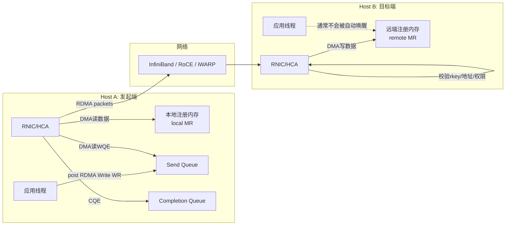
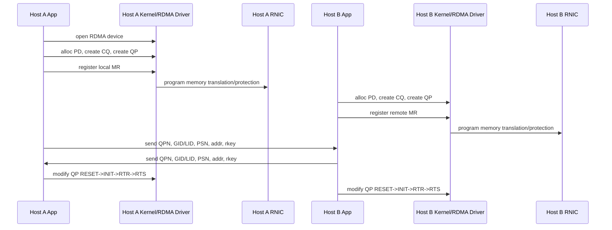
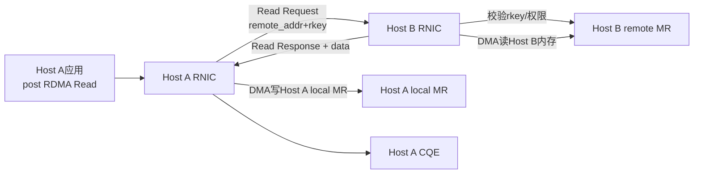
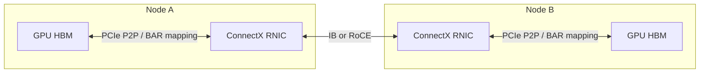

## 1. 先说结论

版本说明：本文参考的是2026-05-15访问的NVIDIA RDMA Aware Networks Programming User Manual、Linux kernel userspace verbs文档、linux-rdma/rdma-core文档、IETF RFC 5040、NVIDIA GPUDirect RDMA 13.2文档和NVIDIA RoCE文档。RDMA的核心语义比较稳定，但具体网卡能力、驱动、RoCE拥塞控制、GPU Direct路径和Kubernetes设备插件会随硬件和软件栈变化，生产环境要以实际网卡、固件、内核、OFED/rdma-core、CUDA版本为准。

RDMA，全称Remote Direct Memory Access，解决的是一个很朴素的问题：

```text
两台机器之间搬一段内存，能不能少让CPU参与、少拷贝几次、少走几层内核协议栈？
```

传统TCP收发大致是：

```text
应用buffer -> 内核socket buffer -> NIC -> 网络 -> NIC -> 内核socket buffer -> 应用buffer
```

RDMA想要的路径是：

```text
应用注册好的buffer -> RNIC/HCA -> 网络 -> RNIC/HCA -> 对端注册好的buffer
```

这里的RNIC是RDMA-capable NIC，也常叫HCA，Host Channel Adapter。直白说，它不是普通“只收发以太网包”的网卡，而是一个能理解RDMA队列、内存key、远端地址、包序号、重传、完成队列的I/O设备。

一句话概括：

**RDMA不是“没有数据搬运”，而是把数据搬运从CPU拷贝和内核网络栈里拿出来，交给RNIC通过DMA、PCIe和网络协议直接做。**

几个最重要的结论：

1. RDMA的“零拷贝”不是零数据移动，而是避免应用态和内核态之间的额外拷贝。
2. RDMA的快速路径通常不进内核；但建连接、创建队列、注册内存、权限检查这些控制面仍然需要内核和驱动。
3. RDMA能访问的不是任意内存，而是已经注册、pin住、建立DMA映射、拿到`lkey/rkey`的Memory Region。
4. RDMA Write和RDMA Read是一侧主动发起的一边操作，远端CPU通常不知道有数据到了。
5. Send/Receive是两边操作，需要接收端提前post receive buffer。
6. RoCE把RDMA语义放到以太网上，但网络配置更敏感，PFC、ECN、DCQCN、MTU、GID、QoS都可能影响结果。
7. GPUDirect RDMA把“注册内存”扩展到GPU显存，让RNIC可以直接读写GPU HBM，但它受GPU/NIC拓扑、驱动模块、IOMMU、BAR映射和同步语义影响。

## 2. 为什么会有RDMA

先从普通网络收发开始。

应用A想把1MB数据发给应用B。用普通TCP时，路径通常涉及：

1. 应用A把数据写到socket。
2. 数据从用户态buffer进入内核socket buffer，或者至少被内核引用、分段、排队。
3. 内核TCP/IP栈做拥塞控制、重传、校验、路由、邻居表等处理。
4. NIC从内核准备好的buffer DMA读数据，发到网络上。
5. 对端NIC收包，DMA写到内核buffer。
6. 对端内核TCP/IP栈重组、确认、唤醒进程。
7. 应用B从socket读到自己的用户态buffer。

这条路非常通用，适合互联网、复杂路由、防火墙、TLS、任意应用。但在数据中心内部、HPC、分布式存储、AI训练和推理里，它有几个明显成本：

1. CPU要参与协议处理。
2. 内核态和用户态之间可能有额外拷贝。
3. 系统调用、软中断、调度、唤醒会带来延迟。
4. 大量小消息会被每次收发的固定开销拖慢。
5. 网络很快时，CPU可能先成为瓶颈。

RDMA的思路是：既然两个进程都明确知道要搬哪段内存，能不能让网卡直接把数据放到目标地址？

这就要求系统先做一些准备：

1. 这段内存不能在传输中被换出或移动。
2. 网卡要知道虚拟地址背后对应哪些物理页或DMA地址。
3. 远端不能随便写本机内存，必须有权限key。
4. 网卡之间要建立可靠连接或至少知道包应该进哪个队列。
5. 应用要有一种低开销方式把“我要搬这段数据”告诉网卡。

这些准备，就是RDMA verbs编程模型里的PD、MR、QP、CQ、WQE、CQE、lkey、rkey。

## 3. 一张图看RDMA数据路径

先看最典型的RDMA Write，也就是机器A把本地buffer写入机器B的某个远端buffer。



这张图有几个关键点：

1. 发起端应用不是调用`send()`让内核搬数据，而是向QP的Send Queue提交一个Work Request。
2. RNIC看到doorbell后，从队列里取WQE，再从本地buffer DMA读数据。
3. 网络上传输的不是“socket字节流”，而是带有RDMA语义的消息，例如RDMA Write。
4. 目标端RNIC解析包，检查远端地址和`rkey`是否合法，然后直接DMA写入目标buffer。
5. 目标端CPU不需要执行`recv()`才能让这次RDMA Write落到内存。
6. 发起端可以从Completion Queue看到这次操作完成。

这就是RDMA低CPU开销的核心来源：快速路径上，数据平面主要由RNIC、PCIe、内存控制器和网络完成。

## 4. RDMA不是一个单一协议

日常说“RDMA”，容易把很多层混在一起。更准确地看，它是一套远程内存访问语义和编程模型，可以跑在不同网络技术上。

| 名称 | 跑在哪里 | 特点 | 常见场景 |
|---|---|---|---|
| InfiniBand | IB专用网络 | 原生RDMA，HPC常见，有Subnet Manager，链路层和拥塞控制体系完整 | 超算、AI集群、MPI、NCCL |
| RoCE v1 | Ethernet L2 | 不可跨三层路由，依赖以太网lossless配置 | 早期/小规模以太网RDMA |
| RoCE v2 | UDP/IP over Ethernet | 可路由，数据中心更常见，通常配合PFC/ECN/DCQCN | AI集群、存储、云内网络 |
| iWARP | TCP/IP | 基于TCP可靠传输，不强依赖lossless Ethernet，但生态相对小 | 部分存储/Windows/特定NIC |

用户态编程时，很多应用并不直接关心底下是IB还是RoCE。应用面对的是verbs：

```text
创建资源 -> 注册内存 -> 建立QP -> post send/read/write/recv -> poll completion
```

但运维和性能调优必须关心底层网络。尤其是RoCE，应用层代码正确不代表网络就正确。PFC配错、ECN阈值不合适、交换机buffer不足、MTU不一致、GID index选错，都可能让RDMA表现得像随机坏掉。

## 5. RDMA里的核心对象

### 5.1 Protection Domain

Protection Domain，简称PD，可以理解为一组RDMA资源的权限边界。

Memory Region、Queue Pair等资源都绑定在某个PD下。网卡检查本地`lkey`、远端`rkey`和QP时，会利用这些关系防止一个资源误用另一个PD里的内存key。

PD不是安全体系的全部，但它是verbs模型里非常基础的隔离单位。

### 5.2 Memory Region

Memory Region，简称MR，是一段被注册给RDMA设备使用的内存。

注册MR时，应用通常调用类似：

```c
struct ibv_mr *mr = ibv_reg_mr(
    pd,
    buf,
    length,
    IBV_ACCESS_LOCAL_WRITE |
    IBV_ACCESS_REMOTE_READ |
    IBV_ACCESS_REMOTE_WRITE
);
```

这个动作背后不是简单记一下`buf`地址。它至少涉及：

1. 检查这段用户态虚拟地址是否合法。
2. pin住对应内存页，避免传输期间被swap或迁移。
3. 建立给设备使用的DMA映射，可能经过IOMMU。
4. 在RNIC/驱动维护的内存保护表里记录地址、长度、权限、页表映射。
5. 返回本地访问用的`lkey`和远端访问用的`rkey`。

Linux kernel userspace verbs文档明确提到，直接用户态I/O要求潜在I/O目标内存保持resident，并由`ib_uverbs`管理pin/unpin。也就是说，RDMA的“直接写用户态内存”不是绕过所有内核管理，而是把昂贵准备工作前置到注册阶段。

`lkey`和`rkey`的区别非常重要：

| key | 谁用 | 用在哪里 |
|---|---|---|
| `lkey` | 本地RNIC | 本机RNIC DMA读写本地MR时检查 |
| `rkey` | 远端RNIC/远端应用 | 对端发起RDMA Read/Write/Atomic访问本MR时检查 |

如果把`rkey`和远端虚拟地址泄露给不该访问的peer，对方就可能在权限范围内读写这段MR。所以RDMA程序通常要把rkey当能力令牌看待，用完及时失效或重新注册。

### 5.3 Queue Pair

Queue Pair，简称QP，是RDMA通信的核心队列对象。

一个QP通常包含：

1. Send Queue，SQ：提交Send、RDMA Write、RDMA Read、Atomic等发送侧操作。
2. Receive Queue，RQ：提交Receive buffer，用于接收Send类消息。

为什么叫Pair？因为Send Queue和Receive Queue成对组成一个通信端点。

QP有状态机。可靠连接RC场景下，常见状态流转是：

```text
RESET -> INIT -> RTR -> RTS
```

含义大致是：

1. `RESET`：刚创建，不能收发。
2. `INIT`：本地端口、P_Key、访问权限等初始化。
3. `RTR`，Ready To Receive：知道远端QP信息，可以接收。
4. `RTS`，Ready To Send：发送侧参数就绪，可以发起传输。

连接建立时，两端需要交换一些信息，例如：

1. QP number，QPN。
2. packet sequence number，PSN。
3. LID或GID。
4. MTU。
5. remote virtual address。
6. rkey。

这些信息可以通过普通TCP socket交换，也可以通过`rdma_cm`连接管理API完成。

### 5.4 Completion Queue

Completion Queue，简称CQ，用来告诉应用：某个Work Request完成了。

应用提交的是WR，网卡完成后生成的是WC，也就是Work Completion。应用通过`ibv_poll_cq()`之类的接口轮询CQ。

Completion有几个容易误解的点：

1. 不是每个发送WR都必须产生CQE，可以用unsignaled WR降低CQ压力。
2. Receive WR通常需要completion，否则应用不知道哪个buffer收到了数据。
3. CQ有容量，应用poll太慢可能CQ overrun，严重时CQ不可继续使用。
4. 完成只说明RDMA传输语义下该WR完成，不等价于远端应用已经处理了数据。

### 5.5 Work Request、WQE、SGE

应用提交给队列的是Work Request，驱动和硬件看到的是Work Queue Element。

一个WR通常会描述：

1. opcode：`SEND`、`RDMA_WRITE`、`RDMA_READ`、`ATOMIC`等。
2. 本地buffer列表：一个或多个SGE。
3. 每个SGE的`addr`、`length`、`lkey`。
4. 远端地址和`rkey`，如果是RDMA Read/Write/Atomic。
5. flags：是否signaled、是否inline、是否需要fence等。
6. `wr_id`：应用自定义ID，completion回来时用于关联上下文。

SGE是Scatter/Gather Entry。它让一次操作可以从多个本地片段读，或者写到多个本地片段。但硬件有数量限制，过多SGE会影响性能。

## 6. 控制面：一次RDMA连接怎么准备好

下面用RC QP上的RDMA Write举例。



可以把控制面分成五步：

1. 找设备：`ibv_get_device_list()`、`ibv_open_device()`。
2. 建资源：PD、CQ、QP。
3. 注册内存：本地buffer和远端buffer分别注册成MR。
4. 交换metadata：两端把连接和内存访问信息告诉对方。
5. QP bring-up：把QP推进到可收发状态。

注意：第4步不是RDMA自己凭空完成的。应用必须有一个side channel。很多demo直接用TCP socket交换，生产系统可能用控制服务、gRPC、etcd、Redis、Kubernetes API或推理框架自己的metadata服务。

这也是为什么RDMA系统常分成控制面和数据面：

| 面 | 负责什么 | 是否追求极致低开销 |
|---|---|---|
| 控制面 | 建连接、交换地址/key、资源生命周期、故障处理 | 不一定 |
| 数据面 | 高频搬数据、poll completion、批量提交 | 是 |

## 7. 快速路径：RDMA Write怎么搬数据

假设Host B已经注册了一段buffer：

```text
remote_addr = 0x7000_0000
rkey        = 0x12345678
length      = 4096
```

Host A也注册了本地buffer：

```text
local_addr = 0x5000_0000
lkey       = 0xabcdef01
length     = 4096
```

Host A提交RDMA Write时，WR看起来像：

```c
struct ibv_sge sge = {
    .addr   = (uintptr_t)local_buf,
    .length = 4096,
    .lkey   = local_mr->lkey,
};

struct ibv_send_wr wr = {
    .wr_id      = 42,
    .sg_list    = &sge,
    .num_sge    = 1,
    .opcode     = IBV_WR_RDMA_WRITE,
    .send_flags = IBV_SEND_SIGNALED,
    .wr.rdma.remote_addr = remote_addr,
    .wr.rdma.rkey        = remote_rkey,
};
```

然后调用：

```c
ibv_post_send(qp, &wr, &bad_wr);
```

从这一刻开始，快速路径大致是：

1. 用户态verbs库把WQE放入SQ。
2. 应用或库向RNIC的doorbell寄存器写入通知。
3. RNIC根据QP上下文找到SQ位置。
4. RNIC通过PCIe DMA读取WQE，或者从doorbell/BlueFlame类机制里直接拿到小WQE。
5. RNIC检查本地`lkey`，把本地虚拟地址转换到设备可访问的DMA地址。
6. RNIC通过PCIe DMA从Host A内存读出4096字节。
7. RNIC把数据切成网络包，包里带上RDMA操作类型、目标QP、远端地址、rkey、offset、packet sequence等信息。
8. 包经过InfiniBand或以太网交换网络到达Host B。
9. Host B RNIC根据包头找到目标QP和MR权限表。
10. Host B RNIC检查`rkey`、远端地址范围、访问权限。
11. Host B RNIC把payload通过PCIe DMA写入Host B内存。
12. 如果是可靠传输，Host B RNIC按协议返回ACK。
13. Host A RNIC确认完成后，在本地CQ写入CQE。
14. Host A应用poll CQ，看到`wr_id=42`完成。

可以看到，数据确实被搬了很多次：

```text
Host A DRAM -> PCIe -> Host A RNIC -> 网络 -> Host B RNIC -> PCIe -> Host B DRAM
```

RDMA优化的是：

1. 不把数据复制到内核socket buffer。
2. 不让远端CPU执行recv才能接收这段数据。
3. 不让每个数据包都走完整内核网络栈。
4. 让应用用队列批量提交，减少系统调用和上下文切换。

## 8. RDMA Read怎么搬数据

RDMA Read方向刚好反过来：发起端从远端内存拉数据回来。



RDMA Read的关键点：

1. 远端应用线程通常不参与。
2. 远端RNIC需要从远端内存DMA读出数据，再发回发起端。
3. 发起端RNIC收到Read Response后，DMA写入本地MR。
4. Read通常比Write更吃远端RNIC资源，因为远端要作为responder读内存并返回数据。
5. 硬件会限制outstanding RDMA Read数量，调优时要关注read depth。

在很多系统里，RDMA Write更常被用作数据推送，RDMA Read更常被用作拉取远端状态或实现某些单边数据结构。具体选择取决于谁知道数据何时准备好、谁管理buffer生命周期、谁更适合承担流控。

## 9. Send/Receive和RDMA Read/Write的区别

RDMA里有两类通信语义：

1. 双边操作：Send/Receive。
2. 单边操作：RDMA Read/Write/Atomic。

### 9.1 Send/Receive

Send/Receive很像消息传递：

1. 接收端先post Receive WR，告诉RNIC有哪些buffer可以放消息。
2. 发送端post Send WR。
3. 数据到达接收端后，RNIC找一个已post的receive buffer，把数据DMA进去。
4. 发送端和接收端都可以拿到completion。

如果接收端没有提前post receive，可靠连接上可能出现RNR，Receiver Not Ready。发送端会按配置重试，重试耗尽后报错。

Send/Receive适合：

1. 控制消息。
2. 通知消息。
3. 小消息。
4. 不想暴露远端地址和rkey的场景。
5. 用`Send with Immediate`或`Write with Immediate`通知对端。

### 9.2 RDMA Write

RDMA Write是发起端直接写远端MR。

接收端不需要post receive WR，普通Write也不会在远端CQ产生completion。它适合：

1. 数据推送。
2. 远端已经分配好buffer。
3. 发起端知道远端地址和rkey。
4. 希望远端CPU不参与数据落地。

但它有一个问题：远端应用怎么知道数据到了？

常见做法有：

1. RDMA Write之后再Send一个控制消息。
2. 使用RDMA Write with Immediate，让远端收到一个带immediate data的completion；这要求远端提前post receive。
3. 写一个远端ring buffer或doorbell变量，然后远端轮询。
4. 由上层协议或RPC控制面通知。

### 9.3 RDMA Read

RDMA Read是发起端从远端MR读数据。

它适合：

1. 发起端知道自己什么时候需要数据。
2. 远端不想主动推送。
3. 读远端索引、元数据、cache block。
4. 实现分布式共享内存风格的数据结构。

但Read的延迟和资源占用通常更敏感，因为请求和响应都要经过网络，远端RNIC还要读取本机内存。

### 9.4 Atomic

RDMA还支持一些原子操作，例如Compare-and-Swap、Fetch-and-Add。它们可以用来实现锁、计数器、队列元数据等。

但不要因为有Atomic就把RDMA当成跨机器共享内存随便用。远端原子操作延迟高、并发热点明显、硬件能力有限，复杂一致性仍然要由上层协议设计。

## 10. RNIC网卡里面大概有什么

RDMA网卡之所以贵，是因为它做的事远多于普通收发包。

一个现代RNIC/HCA通常包含这些能力：

| 模块 | 作用 |
|---|---|
| PCIe接口 | 和CPU内存、GPU显存、设备内存交互 |
| DMA引擎 | 从本地内存读、向本地内存写 |
| Queue管理 | 维护QP、SQ、RQ、CQ、SRQ等队列上下文 |
| Memory Translation/Protection | 根据lkey/rkey检查地址、长度、权限并做DMA地址转换 |
| Packet处理 | 生成和解析IB/RoCE/iWARP包头 |
| Reliability Engine | 处理ACK、NAK、PSN、重传、超时、乱序等 |
| Congestion Control | RoCE场景下处理ECN/CNP/DCQCN等机制 |
| Completion生成 | 向CQ写CQE，触发中断或供应用轮询 |
| Offload | checksum、TSO、RSS、SR-IOV、加密、存储协议等，视型号而定 |
| On-chip cache/SRAM | 缓存QP上下文、MR表项、队列元数据 |

RNIC不是“直接拿一个虚拟地址就能访问内存”。它能访问内存，是因为注册MR时，内核、驱动、IOMMU和网卡已经建立了可验证的映射关系。

可以把RNIC想成一个带网络协议能力的DMA协处理器：

```text
应用告诉它：从本地哪个MR读多少字节，写到远端哪个MR。
它负责：查权限、查地址映射、DMA、组包、可靠传输、写远端、生成完成事件。
```

## 11. Doorbell、轮询和为什么快速路径低延迟

RDMA低延迟不只是因为少拷贝，还因为提交和完成路径被做成了队列模型。

传统系统调用路径：

```text
应用 -> syscall -> 内核 -> 协议栈 -> 驱动 -> 设备
```

RDMA fast path更像：

```text
应用写WQE到用户态可访问的队列内存
应用写doorbell寄存器通知RNIC
RNIC自己DMA读WQE并执行
应用轮询CQ
```

Linux kernel文档提到，用户态verbs的fast path通常通过mmap到用户态的硬件寄存器直接操作，不需要每次都系统调用或进入内核上下文。

这就是为什么RDMA程序常常使用busy polling：

```c
while (ibv_poll_cq(cq, 1, &wc) == 0) {
    // spin
}
```

轮询浪费CPU，但换来更低尾延迟。如果追求吞吐，可以批量poll多个CQE；如果追求CPU效率，可以使用completion channel和中断，但延迟通常会上升。

这和高性能NVMe、io_uring、DPDK的思路很像：用共享队列和轮询减少内核调度开销。

## 12. 内存注册为什么贵

很多RDMA新手会把`ibv_reg_mr()`放在请求路径上，这是性能灾难。

注册MR贵的原因包括：

1. 需要pin用户页。
2. 需要遍历虚拟地址范围。
3. 需要建立DMA映射。
4. 可能要更新IOMMU页表。
5. 需要在网卡内存保护表里建立条目。
6. 可能触发锁、TLB shootdown或驱动同步。

所以高性能RDMA系统通常会：

1. 启动时注册大块内存池。
2. 在内存池里切分buffer。
3. 复用MR，避免频繁注册/注销。
4. 使用hugepage降低页表项数量。
5. 使用MR cache。
6. 对GPU显存使用框架提供的注册缓存，避免反复pin GPU buffer。

Linux还会用`RLIMIT_MEMLOCK`限制非特权进程可pin内存量。RDMA程序启动失败、`ibv_reg_mr()`返回NULL，常见原因之一就是memlock限制太小。

## 13. GPUDirect RDMA：数据直接进GPU显存

普通跨机器GPU通信如果没有GPUDirect RDMA，路径可能是：

```text
GPU HBM -> CPU DRAM -> NIC -> 网络 -> NIC -> CPU DRAM -> GPU HBM
```

GPUDirect RDMA希望变成：

```text
GPU HBM -> NIC -> 网络 -> NIC -> GPU HBM
```

更准确地说，RNIC通过PCIe peer-to-peer和GPU驱动暴露的映射能力，直接读写GPU显存对应的地址窗口。NVIDIA文档提到，`nvidia-peermem`模块让NVIDIA InfiniBand HCA能够对GPU显存做peer-to-peer读写，从而避免把数据复制到host memory。



但这里有很多限制：

1. GPU和NIC最好在同一个PCIe root complex下，跨CPU socket或跨PCIe switch可能性能下降，甚至不可用。
2. 需要合适的NVIDIA GPU驱动、RDMA驱动和`nvidia-peermem`或DMA-BUF路径。
3. IOMMU、ACS、虚拟化、安全策略可能影响peer-to-peer DMA。
4. CUDA kernel写完buffer后，不能假设RNIC立刻看到正确数据，需要正确的CUDA stream/event同步。
5. RNIC写完GPU buffer后，GPU kernel读取前也需要同步，具体由NCCL、UCX、NVSHMEM、NIXL等库封装。
6. 小消息不一定值得走GPU Direct，可能host staging反而更简单。

在AI系统里，GPUDirect RDMA非常关键：

1. NCCL跨节点all-reduce。
2. MoE expert parallel里的all-to-all。
3. 分离式prefill/decode传KV cache。
4. GPU之间远程读写参数、embedding或cache block。
5. NVSHMEM这类PGAS模型。

但排障时一定要确认真的走了GDR路径，而不是悄悄fallback到CPU staging。常用检查包括：

1. `nvidia-smi topo -m`看GPU和NIC距离。
2. `lsmod | grep nvidia_peermem`或检查DMA-BUF路径。
3. NCCL日志里看`NET/IB`、`GDRDMA`相关信息。
4. 使用`ib_write_bw --use_cuda`、`ucx_perftest`、NCCL tests验证带宽。
5. 同时观察GPU PCIe TX/RX、NIC端口计数器、CPU占用。

## 14. RoCE为什么经常难配

InfiniBand是一套为低延迟、高吞吐、可靠fabric设计的网络。RoCE则是把RDMA放到以太网上。

RoCE的好处：

1. 可以复用以太网交换机和布线体系。
2. RoCEv2可基于UDP/IP路由。
3. 云厂商和AI数据中心更容易与现有网络集成。

RoCE的难点：

1. RDMA可靠连接对丢包敏感，丢包会触发重传、超时、吞吐下降。
2. PFC可以减少丢包，但可能带来pause storm、拥塞扩散和死锁风险。
3. ECN/DCQCN参数需要和交换机buffer、链路速率、流量模型匹配。
4. 多租户环境下，QoS、DSCP/PCP、trust模式要一致。
5. MTU不一致会导致性能或连通性问题。
6. GID index、VLAN、bond、容器网络、SR-IOV会增加排障复杂度。

NVIDIA RoCE文档里把RoCE配置分成lossless、semi-lossless、lossy等模式，并强调底层网络应按RoCE需求配置。这里的“lossless”不是绝对永不丢包，而是通过PFC等机制降低拥塞丢包。

一个实用判断：

```text
如果InfiniBand坏了，优先查HCA、SM、LID/GID、QP、线缆、端口状态。
如果RoCE坏了，除了查这些，还要查整个以太网QoS和拥塞控制配置。
```

## 15. RDMA和TCP到底怎么选

RDMA不是TCP的全面替代。

| 维度 | TCP | RDMA |
|---|---|---|
| 编程模型 | socket字节流，简单通用 | verbs/UCX/libfabric/NCCL，复杂 |
| CPU开销 | 较高 | 低 |
| 延迟 | 通常更高 | 通常更低 |
| 内存管理 | 普通buffer即可 | 需要注册/pin/管理key |
| 网络要求 | 通用IP网络 | IB、RoCE或iWARP环境 |
| 安全/隔离 | 生态成熟，易加TLS | rkey能力模型，需要额外保护 |
| 运维难度 | 低到中 | 中到高，RoCE更明显 |
| 适合场景 | 通用服务、跨公网、复杂代理 | HPC、AI、存储、低延迟数据面 |

适合RDMA的场景：

1. 大量节点内部通信，延迟和CPU占用都敏感。
2. 分布式训练、推理、KV cache搬运。
3. NVMe-oF、分布式存储、数据库日志复制。
4. MPI、NCCL、UCX这类通信库已经封装好RDMA。
5. 网络和机器拓扑可控。

不适合直接上RDMA的场景：

1. 普通Web服务。
2. 跨公网或复杂NAT、防火墙环境。
3. 团队没有能力维护RoCE/IB网络。
4. 数据面并不瓶颈，CPU也不瓶颈。
5. 内存安全和租户隔离要求高，但没有成熟封装。

很多系统的实际架构是混合的：

```text
控制面：TCP/gRPC/HTTP
数据面：RDMA/UCX/NCCL/NVSHMEM
```

这是比较合理的分工。控制面追求可维护性，数据面追求极致性能。

## 16. RDMA性能该怎么看

RDMA性能通常看四类指标：

1. latency：单次操作延迟，尤其是p50、p99、p999。
2. bandwidth：大块传输吞吐。
3. message rate：小消息每秒多少次操作。
4. CPU utilization：达到某个吞吐时占用多少CPU。

理论带宽可以先用链路速率估算：

```text
100 Gb/s 约等于 12.5 GB/s
200 Gb/s 约等于 25.0 GB/s
400 Gb/s 约等于 50.0 GB/s
800 Gb/s 约等于 100.0 GB/s
```

实际结果还要扣掉：

1. 编码和协议开销。
2. 包头开销。
3. PCIe带宽限制。
4. NUMA跨socket访问。
5. 内存带宽限制。
6. GPU/NIC拓扑限制。
7. QP数量、CQ polling方式、batch大小。
8. RoCE拥塞、PFC pause、ECN/CNP。

常见测试工具：

| 工具 | 用途 |
|---|---|
| `ibv_devinfo` | 看RDMA设备和端口能力 |
| `ibstat` | 看IB设备状态 |
| `rdma link` | 看Linux RDMA link |
| `ib_write_bw` | 测RDMA Write带宽 |
| `ib_read_bw` | 测RDMA Read带宽 |
| `ib_send_bw` | 测Send/Receive带宽 |
| `ib_write_lat` | 测Write延迟 |
| `ucx_perftest` | 测UCX路径 |
| `nccl-tests` | 测多GPU集合通信 |

测试时不要只跑一个默认命令。至少要变化：

1. message size。
2. queue depth / outstanding WR。
3. QP数量。
4. 是否inline。
5. 是否使用GPU memory。
6. NUMA绑定。
7. MTU。
8. 单流和多流。

一个简单例子：

```bash
# server
ib_write_bw -d mlx5_0 --report_gbits

# client
ib_write_bw -d mlx5_0 --report_gbits <server_ip_or_gid>
```

GPU Direct场景：

```bash
ib_write_bw -d mlx5_0 --use_cuda=0 --report_gbits <server>
```

具体参数取决于perftest版本和CUDA支持，不能机械照抄。

## 17. 常见故障和排障思路

### 17.1 `ibv_reg_mr`失败

常见原因：

1. `RLIMIT_MEMLOCK`太小。
2. buffer地址或长度不合法。
3. 权限flags不匹配，例如远端写需要本地写权限。
4. 驱动或设备不支持某种MR类型。
5. GPU buffer没有正确走GDR注册路径。

排查：

```bash
ulimit -l
rdma link
ibv_devinfo
dmesg | grep -i rdma
```

### 17.2 RDMA Send报RNR

RNR是Receiver Not Ready。意思是发送端发了Send，但接收端没有可用Receive WR。

解决：

1. 接收端提前post足够多receive。
2. 使用SRQ集中管理receive buffer。
3. 调整RNR retry，但不要把它当根治方法。
4. 检查控制流，确保数据消息不会跑在buffer准备之前。

### 17.3 CQ overrun

CQ太小或应用poll太慢，completion堆满。

解决：

1. 增大CQ。
2. 批量poll。
3. 对高频发送使用unsignaled WR，但要周期性signaled防止SQ资源无法回收。
4. 分散到多个CQ或poller线程。

### 17.4 RoCE能ping通但RDMA不通

IP通不等于RoCE正确。

继续查：

1. GID index是否正确。
2. MTU是否一致。
3. VLAN/DSCP/PCP trust配置。
4. PFC是否在端到端链路上生效。
5. ECN/CNP计数是否异常。
6. 防火墙是否影响RoCEv2 UDP端口。
7. 容器或SR-IOV VF是否拿到RDMA device。

### 17.5 带宽只有理论值一半

常见原因：

1. NIC插在PCIe x8而不是x16。
2. PCIe降速。
3. 跨NUMA socket访问内存。
4. GPU和NIC不在同一PCIe拓扑附近。
5. 单QP/单流不足以打满链路。
6. message size太小。
7. Read outstanding太低。
8. RoCE发生pause或拥塞。

排查：

```bash
lspci -vv -s <nic_bdf> | grep -E "LnkCap|LnkSta"
nvidia-smi topo -m
numactl -H
ethtool -S <iface>
```

## 18. 用一个KV cache搬运例子串起来

假设有一个LLM推理系统，prefill worker在GPU 0上算出KV cache，decode worker在另一台机器的GPU 1上继续decode。

不用RDMA时，路径可能是：

```text
GPU0 HBM
  -> cudaMemcpy D2H
  -> Host A DRAM
  -> TCP send
  -> Host B DRAM
  -> cudaMemcpy H2D
  -> GPU1 HBM
```

用GPUDirect RDMA时，目标路径是：

```text
GPU0 HBM
  -> Host A RNIC
  -> IB/RoCE fabric
  -> Host B RNIC
  -> GPU1 HBM
```

系统需要做的控制面准备：

1. Decode worker在GPU 1上分配KV cache block。
2. Decode worker把GPU buffer注册成可RDMA访问的MR。
3. Decode worker把`remote_addr/rkey/block_id`发给调度器或prefill worker。
4. Prefill worker把本地GPU KV buffer也注册或通过通信库注册。
5. Prefill worker post RDMA Write，把KV cache写到decode worker的GPU buffer。
6. 写完后用Write with Immediate、Send或控制面消息通知decode worker。
7. Decode worker在正确同步后开始读GPU 1上的KV cache。

这里最难的其实不是“调用一次RDMA Write”，而是：

1. 谁分配远端buffer。
2. rkey怎么分发和回收。
3. block生命周期怎么管理。
4. 失败时远端buffer是否脏了。
5. GPU kernel和RNIC DMA之间怎么同步。
6. 多租户下如何避免把rkey发给错误worker。
7. 拓扑变化、worker重启、QP断开时怎么恢复。

这也是为什么很多AI系统不会直接让业务代码写verbs，而是用NCCL、UCX、NVSHMEM、libfabric、NIXL这类库封装数据面。

## 19. RDMA编程的最小心智模型

如果只记一套模型，可以记这个：

```text
MR：我允许网卡访问哪段内存。
key：访问这段内存的能力凭证。
QP：我要通过哪个通信端点发起操作。
WR：我要网卡做什么。
CQ：网卡做完后怎么告诉我。
RNIC：真正执行DMA、组包、传输、校验、完成的设备。
```

再具体一点：

```text
注册内存 -> 得到lkey/rkey
交换连接信息和rkey -> QP进入RTS
post WR -> ring doorbell
RNIC DMA读/写本地内存 -> 网络传输 -> 对端RNIC DMA写/读远端内存
poll CQ -> 回收buffer/推进协议状态
```

## 20. 几个容易说错的点

### 20.1 “RDMA绕过内核”不等于完全不用内核

更准确的说法是：RDMA数据面fast path通常绕过内核协议栈和系统调用；控制面仍依赖内核、驱动和设备文件。

创建QP、注册MR、pin内存、处理中断、设备权限、资源回收，都离不开内核。

### 20.2 “RDMA零拷贝”不等于没有拷贝

字节一定要从一个地方移动到另一个地方。所谓零拷贝，通常指没有额外CPU memcpy，没有用户态到内核socket buffer的中间拷贝。

真实路径仍然有：

```text
内存 -> PCIe -> RNIC -> 网络 -> RNIC -> PCIe -> 内存
```

### 20.3 远端CPU不参与不等于远端应用知道数据到了

普通RDMA Write写完远端内存后，远端应用不会自动收到事件。通知需要额外设计。

### 20.4 rkey不是普通ID

rkey是远端访问权限的一部分。泄露rkey和地址，就是把某段MR暴露给对方。

### 20.5 RDMA不是分布式共享内存银弹

RDMA给了远程读写能力，但一致性、并发控制、对象生命周期、错误恢复仍然要自己设计。

## 21. 实践建议

如果你准备在系统里用RDMA，可以按这个顺序推进：

1. 先用`ibv_devinfo`、`rdma link`确认设备可见。
2. 用perftest测Host memory的Write/Read/Send基本性能。
3. 固定NUMA，把进程绑到NIC所在socket。
4. 再测多QP、多message size、多outstanding。
5. 如果是RoCE，先把PFC/ECN/MTU/GID/QoS跑通并记录配置。
6. 如果是GPU Direct，再确认GPU/NIC拓扑和`nvidia-peermem`或DMA-BUF路径。
7. 业务代码尽量先用UCX、libfabric、NCCL、NVSHMEM、NIXL等成熟库。
8. 只有在库抽象不满足需求时，再直接写verbs。
9. 把rkey生命周期、buffer生命周期、QP重连、错误恢复当成协议设计的一部分。
10. 不要把内存注册放在高频请求路径上。

## 22. 总结

RDMA的本质是：应用先把内存和通信资源准备好，然后把高频数据搬运交给RNIC执行。

它快，是因为：

1. 数据面少走内核协议栈。
2. 避免应用buffer和内核buffer之间的额外拷贝。
3. RNIC通过DMA直接读写注册内存。
4. 队列模型让应用可以批量提交和轮询完成。
5. 远端CPU通常不参与数据落地。

它难，是因为：

1. 内存必须注册和pin。
2. key、地址、QP、CQ都要正确管理。
3. 远端通知、流控和错误恢复要自己设计。
4. RoCE对网络配置敏感。
5. GPUDirect RDMA还叠加了GPU/NIC拓扑和同步问题。

理解RDMA时，最重要的不是背API，而是抓住两条路径：

```text
控制面：建资源、注册内存、交换metadata、建立QP。
数据面：post WR、doorbell、RNIC DMA、本地/远端key检查、网络传输、poll CQ。
```

把这两条路径分清楚，RDMA里大多数概念都会变得顺很多。

## 参考

1. NVIDIA, RDMA Aware Networks Programming User Manual: <https://docs.nvidia.com/networking/display/RDMAAwareProgrammingv17>
2. Linux kernel documentation, Userspace verbs access: <https://www.kernel.org/doc/html/latest/infiniband/user_verbs.html>
3. linux-rdma/rdma-core, libibverbs documentation: <https://github.com/linux-rdma/rdma-core/blob/master/Documentation/libibverbs.md>
4. IETF RFC 5040, A Remote Direct Memory Access Protocol Specification: <https://www.rfc-editor.org/rfc/rfc5040>
5. NVIDIA CUDA documentation, GPUDirect RDMA 13.2: <https://docs.nvidia.com/cuda/gpudirect-rdma/>
6. NVIDIA Networking documentation, RDMA over Converged Ethernet: <https://docs.nvidia.com/networking/display/onyxv3102002/rdma%2Bover%2Bconverged%2Bethernet%2B%28roce%29>
7. linux-rdma/perftest: <https://github.com/linux-rdma/perftest>
8. OpenUCX documentation, UCX main features: <https://openucx.readthedocs.io/en/master/ucx_features.html>
