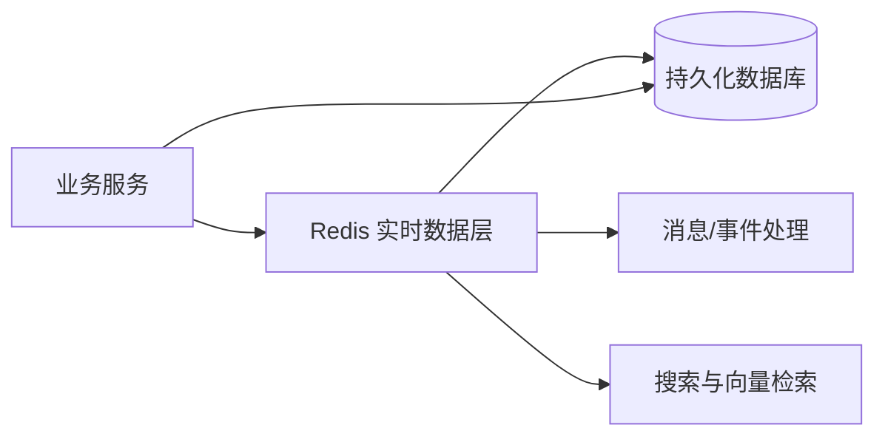
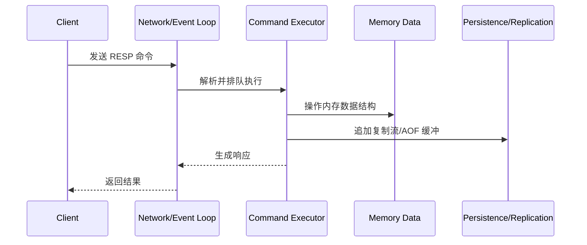
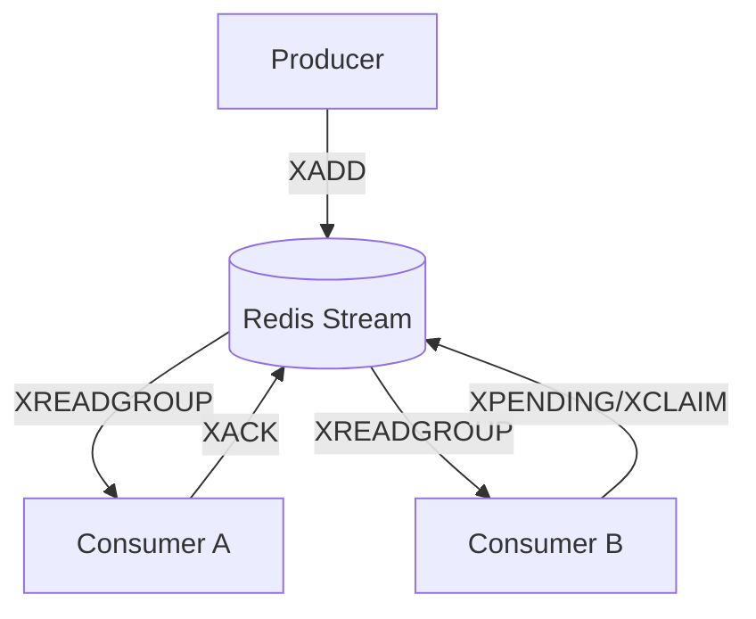
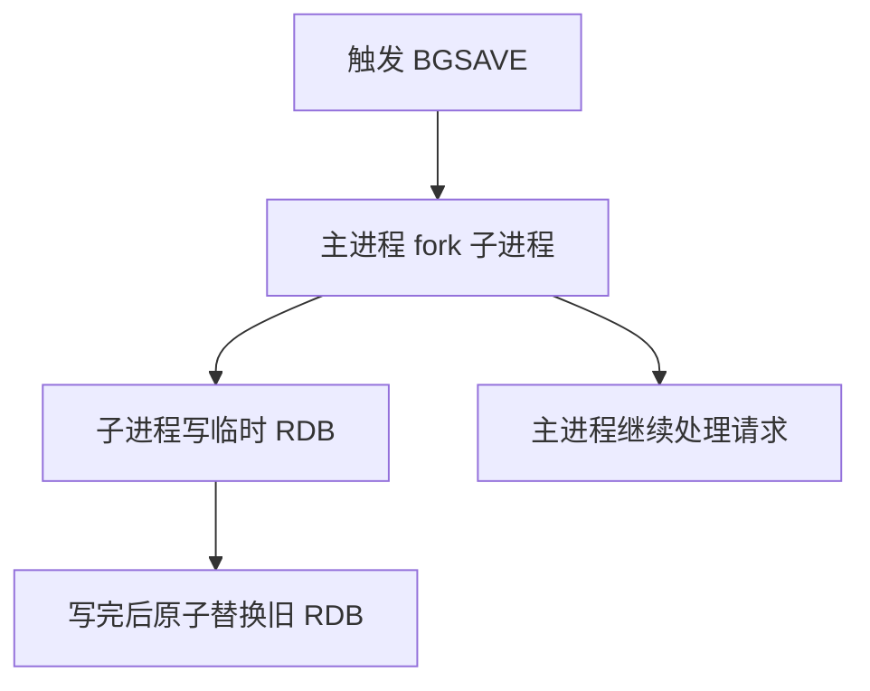
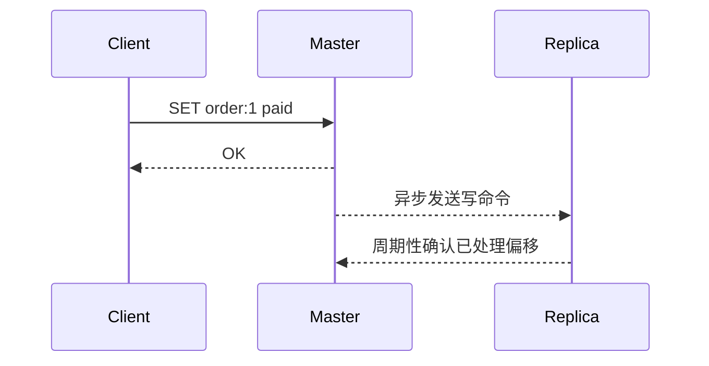
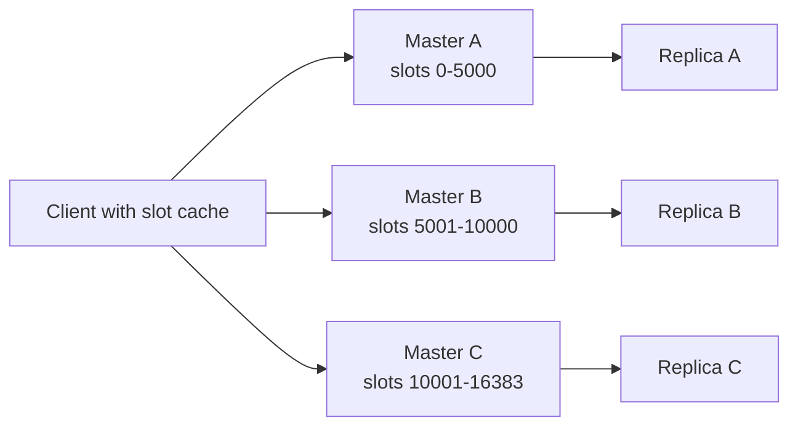

## 版本说明

本文写于 2026-05-19，主要参考 Redis 官方文档、官方博客和 GitHub release。Redis 是一个变化很快的项目，尤其是 Redis 8 以后把搜索、JSON、时序、概率结构等能力统一进 Redis Open Source，因此版本信息需要单独说明：

- GitHub release 页面显示，`8.6.3` 是当前标记为 `Latest` 的稳定版本，发布时间为 2026-05-05；`8.8-M03` 已发布但属于 pre-release，不适合生产默认采用。
- Redis 8 起，Redis Open Source 使用三许可证选项：RSALv2、SSPLv1、AGPLv3，其中 AGPLv3 是 OSI 认可的开源许可证；Redis 7.2 及之前是 BSD-3-Clause。
- Redis 8 将过去 Redis Stack 中常见的 RediSearch、RedisJSON、RedisTimeSeries、RedisBloom 等能力纳入同一个 Redis Open Source 分发包，版本号也与 Redis Open Source 对齐。

## 先说结论

Redis 不是“一个更快的 HashMap”，而是一个围绕内存数据结构、单线程命令执行模型、事件驱动网络层、可选持久化、异步复制和客户端协作构建的数据库系统。它最擅长的不是复杂关系查询，而是把延迟敏感、结构简单、访问频繁的数据放在离业务系统很近的位置，用低延迟和丰富数据结构解决缓存、计数、排行榜、限流、会话、消息流、实时索引、向量检索等问题。

使用 Redis 时最重要的判断是：这个数据是否适合放在内存中，是否能接受 Redis 的一致性和持久化边界，是否能把访问模式映射到 Redis 的数据结构。如果答案是肯定的，Redis 往往能用很少的系统复杂度提供非常好的性能。如果答案是否定的，比如需要复杂事务、强一致多副本提交、任意 SQL 查询、大对象冷存储，那么 Redis 应该作为加速层或实时层，而不是主数据库。

## Redis 的定位

Redis 官方更准确的描述是 data structure server。它暴露的不是传统数据库里的表、行、列，而是一组带命令语义的数据结构：String、Hash、List、Set、Sorted Set、Stream、Bitmap、HyperLogLog、JSON、Time Series、Vector Set 等。客户端通过命令直接操作这些结构，Redis 保证单条命令的原子性，并在大多数情况下把命令执行保持在很短的临界区内。

从系统架构看，Redis 经常处在三种位置：



第一种是缓存层：Redis 保存数据库查询结果、会话、权限、配置、热点对象，降低后端数据库压力。

第二种是实时状态层：Redis 保存计数器、在线状态、令牌桶、排行榜、任务队列、最近事件。这些数据天然需要快速更新和快速读取。

第三种是轻量数据库或实时索引层：Redis 8 以后，JSON、搜索、向量、时序、概率结构都在 Open Source 包内，Redis 可以直接承载一些结构化检索、语义检索和遥测数据处理场景。

## 为什么 Redis 快

Redis 快不是单一原因，而是多个工程选择叠加的结果。

### 内存优先

Redis 的主数据集在内存中，避免了随机磁盘 IO。持久化是后台机制，常规读写路径不依赖每次磁盘落盘。这和 MySQL、PostgreSQL 这类以磁盘页、缓冲池、WAL、查询优化器为核心的系统很不一样。

内存优先的代价也很明显：容量受内存限制，成本高于磁盘，数据规模增长后需要分片、淘汰、压缩、冷热分层或转移到其他存储系统。

### 单线程命令执行模型

Redis 长期以来的核心命令执行路径是单线程的。这个设计的好处是：

- 数据结构操作不需要到处加锁，减少锁竞争和上下文切换。
- 单条命令天然原子，开发者不用理解复杂的行锁、表锁或 MVCC。
- 延迟行为更容易分析，慢命令、fork、AOF fsync、网络抖动这些来源可以分开定位。

但单线程也意味着一个 CPU 核心上的命令执行能力是上限。如果某个命令运行时间长，例如大 key 上的 `HGETALL`、`SMEMBERS`、`LRANGE 0 -1`、复杂 Lua 脚本，就会阻塞后面的命令。Redis 6 起支持 I/O threads，Redis 8 又改进了多线程 I/O，但这主要改善网络读写、解析和吞吐，不等价于把任意命令并行执行。

可以把 Redis 的执行路径理解成：



### 高效协议和批处理

Redis 使用 RESP 协议，命令简单，解析成本低。更重要的是 Redis 支持 pipeline：客户端可以一次发送多条命令，再一次性读取响应。pipeline 并不让命令变成事务，但可以显著减少 RTT 和系统调用成本。

举一个简单例子，如果业务需要写 1000 个计数器：

```text
不用 pipeline:
client -> INCR k1 -> reply
client -> INCR k2 -> reply
...

使用 pipeline:
client -> INCR k1, INCR k2, ..., INCR k1000
server -> reply1, reply2, ..., reply1000
```

pipeline 的风险是响应也需要在 Redis 端和客户端端排队，因此不应该无限批量。官方文档建议把超大批次拆成合理大小，例如每批 10k 级别，而不是一次把所有命令塞进去。

### 数据结构贴近业务操作

Redis 的高性能还来自“命令即意图”。例如排行榜不需要应用自己维护排序数组，可以用 Sorted Set；去重不需要应用读出列表再检查，可以用 Set 或 Bloom Filter；事件日志不需要自己设计 ID 和 pending 表，可以用 Stream。

这带来的好处是少传数据、少做无效查询、少写应用端锁。

## 数据结构：从 String 到 Redis 8

Redis 的数据结构可以分成几类。

### 基础结构

String 是最基本的字节序列，可以保存文本、数字、序列化对象，也可以做计数器：

```redis
SET user:1:name "alice"
INCR page:home:pv
SETEX session:token:abc 3600 "{...}"
```

Hash 适合保存对象字段：

```redis
HSET user:1 name alice age 20 city shanghai
HGET user:1 name
HINCRBY user:1 login_count 1
```

Hash 相比把整个对象 JSON 序列化进 String 的优势是可以局部读写字段，不需要每次反序列化和覆盖整个对象。但如果需要嵌套结构、JSONPath、搜索索引，Redis 8 的 JSON 更合适。

List 是按插入顺序排列的字符串列表，适合简单队列、最近记录：

```redis
LPUSH queue:email job-1
RPOP queue:email
```

不过如果要做可靠消息处理、消费组、ack、pending 重试，Stream 比 List 更合适。

Set 是无序唯一集合，适合去重、标签集合、共同好友：

```redis
SADD user:1:tags gpu redis database
SISMEMBER user:1:tags redis
SINTER user:1:tags user:2:tags
```

Sorted Set 是带 score 的唯一集合，适合排行榜、延迟队列、时间线索引：

```redis
ZADD rank:game 100 alice 90 bob
ZREVRANGE rank:game 0 9 WITHSCORES
ZRANGEBYSCORE delay:jobs -inf 1710000000
```

### Stream

Stream 是 Redis 的追加日志结构。它不像 Pub/Sub 那样“只发给在线订阅者”，而是把消息保存在数据结构中，消费者可以按 ID 读取，消费组可以维护 pending 状态。

典型流程如下：



Redis 8.2 增加了 `XACKDEL`、`XDELEX` 等命令来简化多消费组下“所有组都 ack 后再删除”的逻辑。Redis 8.6 进一步增加 Stream 幂等写入能力，`XADD` 可以配合 `IDMP` 或 `IDMPAUTO` 避免生产者因为网络断开、重试而重复写入同一条消息。

### Bitmap、HyperLogLog 和概率结构

Bitmap 本质上仍然是 String，但 Redis 提供位操作命令。它适合签到、布尔状态、用户活跃标记：

```redis
SETBIT active:2026-05-19 12345 1
GETBIT active:2026-05-19 12345
BITCOUNT active:2026-05-19
```

HyperLogLog 用于估算基数，例如 UV。它不保存完整集合，结果是近似值，但内存极小：

```redis
PFADD uv:home user1 user2 user3
PFCOUNT uv:home
```

Redis 8 还把 Bloom Filter、Cuckoo Filter、Count-Min Sketch、Top-K、t-digest 等概率结构纳入 Open Source 包。它们共同的特点是用可控误差换内存和速度，适合大规模流式统计。

### JSON、Time Series、Vector Set 和 Query Engine

Redis 8 是一个重要分界点。过去很多能力来自 Redis Stack 或模块，现在统一到 Redis Open Source：

- JSON：保存层次化文档，支持局部路径读写，适合会话、配置、半结构化对象。
- Time Series：面向时间戳数据，支持压缩、聚合、降采样，适合监控、IoT、行情。
- Query Engine：为 Hash 和 JSON 建二级索引，支持文本搜索、过滤、向量查询等。
- Vector Set：面向高维向量，支持基于 HNSW 的相似性搜索，适合推荐、语义搜索、RAG 召回。

这意味着 Redis 的边界正在从“缓存 + 常用结构”扩展到“实时数据平台”。但使用这些新能力时要注意两点：第一，它们仍然受内存成本约束；第二，复杂查询和大规模索引会改变 Redis 的 CPU、内存和延迟模型，不能用只跑 `GET/SET` 的经验来评估。

## 过期、淘汰和缓存语义

Redis 适合作缓存，但缓存不是简单加一个 `SETEX`。

### TTL 与过期

Redis 可以给 key 设置过期时间：

```redis
SETEX user:1:profile 600 "{...}"
EXPIRE user:1:profile 600
TTL user:1:profile
```

过期语义要区分两件事：

- key 到期后逻辑上不可用。
- key 的内存不一定在到期瞬间立即释放，而是由访问时惰性删除和后台主动过期过程共同清理。

因此不要把 TTL 当作精确计时器。如果需要精确延迟任务，通常用 Sorted Set 的 score 表示时间戳，然后由 worker 扫描到期元素；如果需要消息语义，用 Stream 或专业 MQ。

### maxmemory 与淘汰策略

Redis 可以配置 `maxmemory`，达到上限后按策略淘汰 key。常见策略包括：

- `noeviction`：默认安全策略，内存满后写入报错。
- `allkeys-lru`：从所有 key 中近似淘汰最近最少使用的 key。
- `volatile-lru`：只从设置了过期时间的 key 中淘汰。
- `allkeys-lfu` / `volatile-lfu`：按访问频率淘汰。
- `allkeys-random` / `volatile-random`：随机淘汰。
- `volatile-ttl`：优先淘汰剩余 TTL 更短的 key。
- Redis 8.6 新增 `allkeys-lrm` / `volatile-lrm`：按最近修改时间淘汰，而不是按最近读取时间淘汰。

LRM 的意义在于，有些 key 被频繁读取但已经不再刷新，例如某些语义缓存、预计算结果、周期聚合结果。LRU 会因为读请求保留它们，LRM 则更关注“数据是否还在被生产者更新”。

### 缓存常见问题

缓存穿透：请求的 key 不存在，每次都打到数据库。常见解法是缓存空值、布隆过滤器、参数校验。

缓存击穿：某个热点 key 过期，大量请求同时打到数据库。常见解法是互斥重建、逻辑过期、提前刷新、热点不过期。

缓存雪崩：大量 key 同时过期或 Redis 故障，后端被压垮。常见解法是 TTL 加随机抖动、多级缓存、限流、熔断、容量隔离。

大 key：单个 key 的 value 太大或元素太多，导致网络传输、删除、迁移、持久化和命令执行都变慢。常见解法是拆 key、分页读取、异步删除、避免全量命令。

热 key：某个 key 被极高频访问，造成单分片 CPU 或网络瓶颈。Redis 8.6 的 `HOTKEYS` 命令可以帮助发现这类问题；工程上还可以做本地缓存、读副本、key 拆分、请求合并。

## 持久化：RDB、AOF 与取舍

Redis 是内存数据库，但不代表不能持久化。官方提供几种模式：

- RDB：按时间点生成快照。
- AOF：记录每个写命令，重启时重放。
- RDB + AOF：同时使用。
- 无持久化：纯缓存场景可以关闭。

### RDB

RDB 会 fork 子进程，把当前数据集写成紧凑快照文件。它的优点是文件小、适合备份、恢复大数据集通常比纯 AOF 快，主进程不直接做大量磁盘 IO。缺点是如果进程异常退出，可能丢失上一次快照之后的数据；同时 fork 在大内存实例上可能带来延迟尖刺，copy-on-write 也会增加内存压力。

RDB 的执行可以简化为：



### AOF

AOF 会把改变数据集的命令追加到日志中。常见 fsync 策略：

- `appendfsync always`：每次写都 fsync，最安全但很慢。
- `appendfsync everysec`：每秒 fsync，一般是性能和安全的折中，最多通常接受秒级丢失窗口。
- `appendfsync no`：交给操作系统刷盘，性能好但风险更高。

AOF 会不断增长，因此 Redis 支持后台 rewrite，把“历史命令序列”压缩成“重建当前状态所需的最短命令序列”。Redis 7 起引入 multi-part AOF，把 base 文件、增量文件和 manifest 分离，降低 rewrite 期间的复杂度。

### 应该怎么选

如果 Redis 只是缓存，后端数据库可以重建数据，可以关闭持久化或只做 RDB 备份。

如果 Redis 保存重要但允许短暂丢失的数据，常见选择是 RDB + AOF everysec。

如果 Redis 被当成主数据库使用，需要非常谨慎。AOF everysec 并不等价于传统数据库的同步提交，多副本复制也默认异步。需要结合业务幂等、补偿、日志、上游数据库或更强一致的存储系统。

## 复制、Sentinel 和 Cluster

Redis 高可用不是一个功能，而是复制、故障检测、故障转移、客户端路由共同构成的系统。

### 主从复制

Redis 使用 leader-follower 复制。master 把写命令流发送给 replica。连接正常时，replica 持续应用增量命令；连接断开后，replica 会尝试部分重同步；如果无法部分重同步，就进行全量同步：master 生成快照发给 replica，然后继续发送期间发生的增量写。

Redis 默认异步复制。客户端写入 master 得到成功响应时，不代表所有 replica 都已经持久化。`WAIT` 命令可以要求一定数量的 replica 确认接收，但官方也明确说明它不会把 Redis 变成强一致 CP 系统，故障转移时仍然可能丢写，概率取决于持久化和复制配置。



### Sentinel

Sentinel 用于非 Cluster 部署的高可用。它负责监控 master 和 replica、通知故障、自动故障转移，并为客户端提供当前 master 地址。生产环境至少需要 3 个 Sentinel 实例，放在尽量独立的故障域中。

Sentinel 的重点不是“保证不丢数据”，而是“在 master 故障后自动选出新 master 并通知客户端”。由于底层仍是异步复制，故障窗口内确认过的写入仍可能丢失。

### Cluster

Redis Cluster 用于水平扩展。它把 key 空间分成 16384 个 hash slot，每个 master 负责一部分 slot，replica 作为对应 master 的副本。客户端根据 key 计算 slot，把请求发到负责该 slot 的节点；如果发错节点，Redis 返回 `MOVED` 或 `ASK` 重定向。



Cluster 有几个重要限制：

- 多 key 操作只有在所有 key 落到同一个 slot 时才可用。
- 可以用 hash tag 强制相关 key 进入同一 slot，例如 `user:{123}:profile` 和 `user:{123}:cart`。
- Cluster 只支持数据库 0，不支持 standalone 模式下的多 database。
- Cluster 不通过 proxy 转发请求，客户端需要理解重定向和 slot 缓存。
- Cluster 复制也是异步的，网络分区和故障转移期间仍有丢写窗口。

因此 Cluster 的核心收益是扩展容量和吞吐，而不是强一致事务。

## 事务、Lua 和 Functions

Redis 事务由 `MULTI`、`EXEC`、`DISCARD`、`WATCH` 组成。事务保证队列中的命令按顺序连续执行，中间不会插入其他客户端命令。`WATCH` 提供乐观锁语义，可以在 key 被修改时让事务失败。

```redis
WATCH balance:alice
GET balance:alice
MULTI
DECRBY balance:alice 100
INCRBY balance:bob 100
EXEC
```

需要注意，Redis 事务不是关系数据库事务：

- 没有复杂隔离级别。
- 命令执行后的运行时错误不会自动回滚之前命令。
- 跨 slot 事务在 Cluster 下受限制。

Lua 脚本可以把多步逻辑放到 Redis 服务器端执行，减少网络往返，并保证脚本执行期间的原子性：

```redis
EVAL "
local current = redis.call('GET', KEYS[1])
if not current then
  return redis.call('SET', KEYS[1], ARGV[1], 'EX', ARGV[2])
end
return nil
" 1 lock:job:1 token-123 30
```

Lua 的风险是执行期间会阻塞服务器，所以脚本必须短小、可预测，不能遍历大 key 或写复杂循环。Redis 7 起 Functions 提供比临时脚本更适合服务端逻辑管理的方式，可以命名、加载和复用函数。

## 性能分析与常见瓶颈

Redis 性能问题通常不是“Redis 不够快”，而是访问模式、数据结构、命令复杂度或系统配置出了问题。

### 慢命令

需要避免在大 key 上执行全量命令，例如：

```redis
KEYS *
HGETALL huge_hash
SMEMBERS huge_set
LRANGE huge_list 0 -1
ZRANGE huge_zset 0 -1
```

替代方法包括：

- 用 `SCAN` 系列命令增量遍历。
- 用分页读取代替全量读取。
- 拆分大 key。
- 用 `UNLINK` 代替 `DEL` 删除大对象，让释放内存异步化。
- 开启 slowlog 和 latency monitor 定位问题。

### fork 延迟

RDB 和 AOF rewrite 都可能 fork。大内存、开启透明大页、内存碎片高、宿主机性能差时，fork 可能造成明显延迟。官方延迟诊断文档也强调禁用 Transparent Huge Pages、使用 intrinsic latency 检查运行环境、关注 fork 和 AOF 造成的延迟事件。

### 网络与客户端

很多 Redis 性能问题来自客户端：

- 每次命令都新建连接。
- 不使用连接池。
- 不使用 pipeline。
- pipeline 批次过大导致输出缓冲膨胀。
- 热点 key 返回大对象，网络带宽成为瓶颈。
- 客户端没有正确处理 Cluster 重定向、Sentinel failover、超时重试。

### 内存

需要持续关注：

- `used_memory`
- `used_memory_rss`
- `mem_fragmentation_ratio`
- key 数量和过期 key 比例
- 大 key、热 key
- replication backlog、AOF rewrite buffer、client output buffer

Redis 8.2 对短字符串 key 和 JSON 数值存储做了较大内存优化，Redis 8.6 又对 hash 和 sorted set 内存占用继续优化。但任何优化都不能替代容量规划：Redis 是内存系统，业务需要明确每类 key 的数量、平均大小、峰值增长和 TTL。

## 工程实践

### key 设计

key 应该可读、有命名空间、有版本意识：

```text
user:123:profile
user:123:session
rank:game:2026-05-19
lock:order:987
stream:payment
```

不要把环境、业务、对象、字段混在不可解析的字符串里。Cluster 场景下要提前设计 hash tag：

```text
user:{123}:profile
user:{123}:cart
user:{123}:coupon
```

这样同一个用户相关 key 可以落到同一个 slot，便于多 key 操作。但 hash tag 也不能滥用，否则会把大量 key 压到单一 slot 形成热点。

### 连接和超时

生产客户端应该配置：

- 连接池大小。
- 连接超时、读写超时。
- 重试次数和退避策略。
- Sentinel 或 Cluster 拓扑刷新。
- pipeline 批大小。
- 熔断和降级策略。

Redis 很快，但业务不能无限等待 Redis。缓存读失败时是降级到数据库、返回默认值，还是直接失败，需要按业务重要性决定。

### 分布式锁

Redis 常被用于分布式锁，但要避免简单的 `SETNX` 后再 `EXPIRE`，因为两条命令之间客户端可能崩溃，造成死锁。基本写法应使用单条 `SET NX EX`：

```redis
SET lock:job:1 token-123 NX EX 30
```

释放锁时要校验 token，避免误删别人的锁：

```redis
EVAL "
if redis.call('GET', KEYS[1]) == ARGV[1] then
  return redis.call('DEL', KEYS[1])
else
  return 0
end
" 1 lock:job:1 token-123
```

但是 Redis 锁不是万能的。如果锁保护的是强一致资金交易、库存扣减、跨系统事务，应该优先考虑数据库事务、唯一约束、乐观锁、幂等表或专门的协调系统。Redis 锁更适合保护短时间、可重试、可补偿的临界区。

### 限流

Redis 做限流很自然。固定窗口可以用 `INCR + EXPIRE`：

```redis
INCR rate:user:123:202605191509
EXPIRE rate:user:123:202605191509 60
```

滑动窗口可以用 Sorted Set 保存请求时间戳：

```redis
ZREMRANGEBYSCORE rate:user:123 -inf 1710000000000
ZADD rate:user:123 1710000060000 req-uuid
ZCARD rate:user:123
EXPIRE rate:user:123 120
```

令牌桶、漏桶或 GCRA 可以用 Lua 保证读写状态原子。限流逻辑要特别注意时间来源、突发流量、重试、脚本耗时和降级策略；如果限流是全局入口保护，最好把 Redis 限流与网关本地限流、熔断、配额配置系统一起设计。

### 队列与消息

如果只是简单后台任务，List 的 `LPUSH/BRPOP` 足够简单。但只要出现这些要求，就应该考虑 Stream：

- 多消费者组。
- 消息 ack。
- 消费失败后重试。
- 查看 pending。
- 同一条消息需要被多个组处理。
- 生产者重试不能重复写入。

Stream 仍然不是 Kafka 的完全替代。Kafka 更适合超大吞吐、磁盘日志、长时间保留、消费者生态、跨数据中心复制等场景。Redis Stream 更适合靠近在线系统的低延迟任务流和事件流。

## Redis 与其他系统比较

### Redis vs Memcached

Memcached 更简单，主要是纯缓存 key-value，适合极简对象缓存。Redis 数据结构更丰富，支持持久化、复制、Lua、Stream、Cluster、JSON、搜索等能力。只需要简单缓存时，Memcached 的简单性是优势；需要结构化操作、原子计数、排行榜、消息、持久化时，Redis 更合适。

### Redis vs 关系数据库

关系数据库强在持久化、复杂查询、事务、一致性、约束、临时查询和数据治理。Redis 强在低延迟、简单操作、高频状态、内存数据结构。不要为了“快”把所有数据搬到 Redis；更常见的合理架构是关系数据库做事实源，Redis 做加速层和实时派生层。

### Redis vs Kafka

Redis Stream 和 Kafka 都能做流，但定位不同。Redis Stream 更轻、更低延迟、更贴近在线请求；Kafka 更适合大规模日志、持久保留、回放、生态连接器和流处理平台。Redis 可以处理“订单创建后通知几个在线服务”这类近端事件，Kafka 更适合“所有订单事件保留 30 天供多个系统回放分析”。

### Redis vs 向量数据库

Redis 8 支持 Vector Set 和 Query Engine 向量搜索，适合把语义缓存、RAG 召回、轻中量向量检索放在同一个实时数据层中。如果业务需要十亿级向量、复杂过滤、冷热分层、专门索引调优、离线构建和多租户隔离，专门的向量数据库或搜索系统仍然更合适。

## 适合使用 Redis 的场景

适合：

- 热点缓存、会话缓存、配置缓存。
- 计数器、限流、去重、签到、在线状态。
- 排行榜、延迟队列、时间窗口统计。
- 低延迟任务队列、轻量事件流。
- 需要原子操作的小状态。
- 可接受近似统计的海量流式数据。
- 需要快速 JSON、搜索、向量、时序能力的实时应用。

不适合：

- 不能丢任何已确认写入的唯一事实源，除非业务已经设计了额外保障。
- 复杂 SQL、任意 ad-hoc 分析查询。
- 超大冷数据存储。
- 大对象文件存储。
- 强一致跨分片事务。
- 访问模式不可控、key 规模和内存增长不可预测的系统。

## 一份生产检查清单

上线 Redis 前至少要回答这些问题：

- 数据是否可以从事实源重建？如果不能，持久化和备份策略是什么？
- RDB、AOF、RDB+AOF 选择什么？能接受几秒或几分钟数据丢失？
- `maxmemory` 设置多少？淘汰策略是什么？
- key 的平均大小、峰值数量、TTL 分布是否估算过？
- 是否存在大 key、热 key？如何发现和拆分？
- 客户端是否使用连接池、超时、重试、pipeline？
- 是否需要 Sentinel 或 Cluster？客户端是否支持？
- Cluster 下多 key 操作是否使用 hash tag？是否可能造成 slot 热点？
- 是否启用 ACL、TLS、网络隔离？
- 是否开启 slowlog、latency monitor、指标采集和告警？
- 是否定期演练重启、故障转移、备份恢复？

## 总结

Redis 的核心价值是把高频、低延迟、结构化的在线状态放进一套简单但强大的内存数据结构系统中。它的命令模型直接、数据结构丰富、生态成熟，Redis 8 以后能力边界进一步扩展到 JSON、搜索、时序、概率结构和向量。

但 Redis 的强项也对应着边界：内存成本、单线程命令阻塞、异步复制丢写窗口、持久化延迟、Cluster 多 key 限制、大 key 和热 key 风险。真正用好 Redis，不是记住更多命令，而是把业务访问模式、数据生命周期、一致性要求和故障恢复策略设计清楚。

我的经验判断是：Redis 最适合做“实时派生数据层”。事实源仍由关系数据库、日志系统或对象存储承担，Redis 负责把最热、最需要快速变化和快速访问的那部分数据用合适的数据结构表达出来。这样既能发挥 Redis 的性能，又不会把它推到不擅长的强一致主存储位置。

## 参考

- Redis Docs: https://redis.io/docs/latest/
- Redis data types: https://redis.io/docs/latest/develop/data-types/
- Redis persistence: https://redis.io/docs/latest/operate/oss_and_stack/management/persistence/
- Redis replication: https://redis.io/docs/latest/operate/oss_and_stack/management/replication/
- Redis Sentinel: https://redis.io/docs/latest/operate/oss_and_stack/management/sentinel/
- Redis Cluster specification: https://redis.io/docs/latest/operate/oss_and_stack/reference/cluster-spec/
- Redis client handling: https://redis.io/docs/latest/develop/reference/clients/
- Redis key eviction: https://redis.io/docs/latest/develop/reference/eviction/
- Redis latency diagnosis: https://redis.io/docs/latest/operate/oss_and_stack/management/optimization/latency/
- Redis pipelining: https://redis.io/docs/latest/develop/using-commands/pipelining/
- Redis transactions: https://redis.io/docs/latest/develop/using-commands/transactions/
- Redis Lua scripting: https://redis.io/docs/latest/develop/programmability/eval-intro/
- Redis 8 GA blog: https://redis.io/blog/redis-8-ga/
- Redis 8.2 GA blog: https://redis.io/blog/redis-82-ga/
- Redis 8.6 what's new: https://redis.io/docs/latest/develop/whats-new/8-6/
- Redis 8.6 feature blog: https://redis.io/blog/announcing-redis-86-performance-improvements-streams/
- Redis GitHub releases: https://github.com/redis/redis/releases
- Redis license overview: https://redis.io/legal/licenses/
